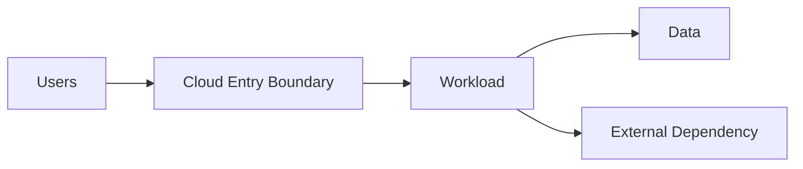
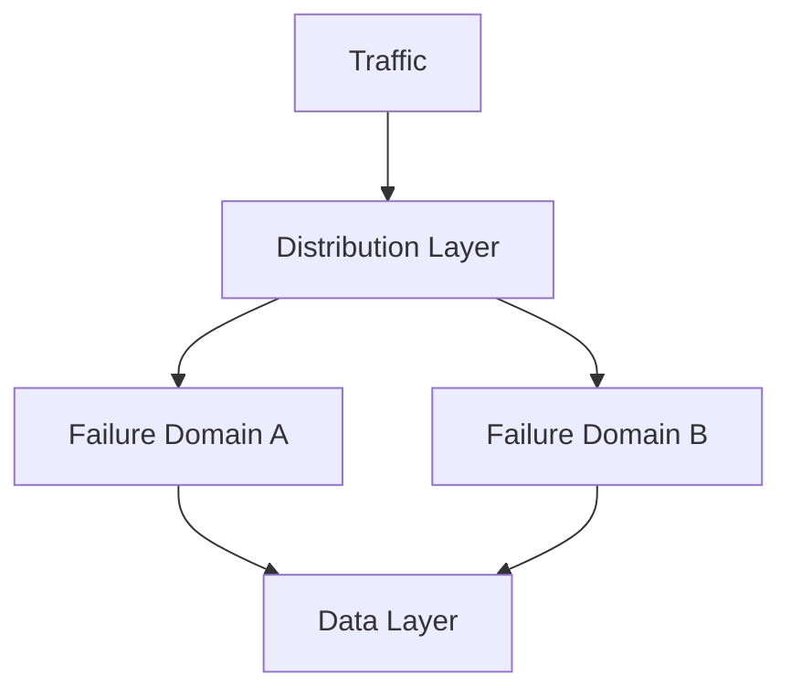
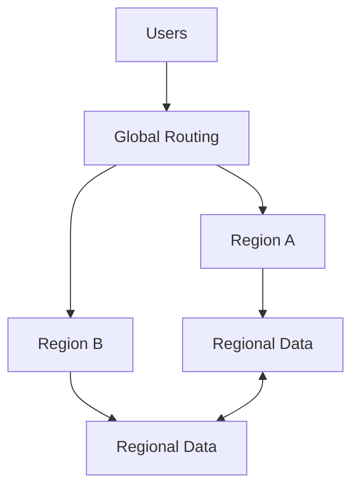

# Cloud Architecture Skill

## Purpose

This skill defines principles, concepts, decision criteria, and best practices for designing systems that use cloud computing capabilities.

Cloud architecture determines how workloads should use cloud capabilities to satisfy requirements related to:

- Availability
- Reliability
- Scalability
- Performance
- Security
- Operations
- Resilience
- Governance
- Cost
- Sustainability
- Maintainability

The objective is not to select a particular cloud provider or service.

The objective is to establish sound cloud architecture decisions before selecting specific technologies.

This skill is:

- Domain-neutral
- Vendor-neutral
- Provider-neutral
- Platform-neutral
- Technology-neutral
- Solution-neutral
- Industry-neutral

Provider-specific implementation guidance should be handled separately.

---

# Objectives

Good cloud architecture should help:

- Select appropriate cloud deployment models.
- Select appropriate service models.
- Design for elasticity.
- Design for failure.
- Establish availability requirements.
- Establish appropriate redundancy.
- Support disaster recovery.
- Define geographic placement.
- Establish isolation boundaries.
- Protect trust boundaries.
- Support operational visibility.
- Enable automation.
- Establish governance.
- Control lifecycle cost.
- Avoid unnecessary complexity.
- Avoid unnecessary provider dependency.
- Support workload evolution.

---

# Fundamental Principles

## Design From Requirements

Cloud architecture should begin with:

- Business requirements
- Functional requirements
- Quality attributes
- Constraints
- Security requirements
- Compliance requirements
- Expected workload
- Expected growth
- Availability requirements
- Recovery requirements
- Budget constraints

Do not begin with a list of cloud services.

The reasoning should follow:

```text
Requirements
      ↓
Architecture Characteristics
      ↓
Cloud Capabilities
      ↓
Service Categories
      ↓
Technology / Provider Selection
```

---

# Cloud Is Not Automatically the Architecture

Using cloud services does not automatically create good cloud architecture.

Cloud provides capabilities such as:

- Elastic infrastructure
- Managed services
- Geographic distribution
- Automation
- On-demand resources
- Consumption-based models

Architecture determines how those capabilities should be used.

---

# Prefer Managed Capabilities Where Appropriate

Cloud platforms commonly provide different levels of management responsibility.

Prefer higher-level managed capabilities when they satisfy requirements and provide meaningful benefits.

Potential benefits include:

- Reduced operational burden
- Automated maintenance
- Built-in resilience
- Easier scaling
- Faster delivery

However, managed capabilities may introduce:

- Reduced control
- Provider dependency
- Service limitations
- Migration complexity
- Cost considerations

Use managed capabilities deliberately rather than automatically.

---

# Shared Responsibility

Cloud computing divides responsibilities between the provider and the consumer.

Responsibility varies depending on the service model.

Architecture should explicitly understand who is responsible for:

- Infrastructure
- Runtime
- Operating system
- Network
- Application
- Identity
- Data
- Configuration
- Security
- Backup
- Monitoring
- Compliance

Do not assume the cloud provider manages everything.

---

# Cloud Deployment Models

Common deployment models include:

## Public Cloud

Resources are provided through shared cloud infrastructure with logical isolation.

Potential benefits:

- Elasticity
- Broad managed capabilities
- Rapid provisioning
- Global reach

Potential considerations:

- Governance
- Provider dependency
- Data residency
- Regulatory requirements

---

## Private Cloud

Cloud operating principles are applied within dedicated infrastructure.

Potential reasons include:

- Regulatory constraints
- Specialized infrastructure
- Data sovereignty
- Organizational control

Potential consequences include:

- Greater operational responsibility
- Capacity planning
- Higher infrastructure management burden

---

## Hybrid Cloud

Hybrid architecture combines cloud and non-cloud or multiple operational environments.

Conceptually:

```text
On-Premises / Private Environment
              │
              │ Integration
              ▼
        Cloud Environment
```

Hybrid architecture may be justified by:

- Existing systems
- Regulatory requirements
- Migration strategy
- Data locality
- Specialized infrastructure

Hybrid architecture introduces additional integration, networking, identity, security, and operational complexity.

---

## Multi-Cloud

Multi-cloud architecture uses capabilities from multiple cloud providers.

Potential drivers include:

- Regulatory requirements
- Business strategy
- Acquisition
- Specialized capabilities
- Risk management

Multi-cloud should not be selected automatically for availability.

It introduces significant complexity involving:

- Identity
- Networking
- Governance
- Security
- Observability
- Skills
- Data movement
- Operations

Use multi-cloud only when explicit requirements justify it.

---

# Cloud Service Models

## Infrastructure-Oriented Services

Provide lower-level infrastructure capabilities.

Consumers generally retain greater responsibility for:

- Operating systems
- Runtime
- Scaling
- Maintenance
- Security configuration

Use when control requirements justify the additional responsibility.

---

## Platform-Oriented Services

Provide managed application or data platforms.

Potential benefits:

- Reduced infrastructure management
- Integrated scaling
- Built-in operational capabilities

Potential trade-offs:

- Reduced infrastructure control
- Platform constraints
- Provider dependency

---

## Serverless-Oriented Services

Provide execution or processing capabilities where infrastructure management is heavily abstracted.

Potential benefits:

- Fine-grained scaling
- Reduced infrastructure management
- Consumption-oriented cost

Potential considerations:

- Execution constraints
- Startup latency
- State management
- Provider dependency
- Cost at sustained scale

Serverless should be selected based on workload characteristics rather than terminology.

---

# Workload Characteristics

Cloud architecture decisions should consider workload characteristics.

Identify:

- Request volume
- Concurrent users
- Transaction rate
- Data volume
- Processing intensity
- Usage patterns
- Peak demand
- Geographic distribution
- Availability requirements
- Recovery requirements
- Growth expectations

Avoid architecture based only on average workload.

---

# Workload Variability

Workloads may be:

```text
Stable

Gradually Growing

Bursty

Seasonal

Event Driven

Unpredictable
```

Scaling and cost strategies should reflect actual workload behavior.

---

# Scalability

Scalability concerns the ability to support increased workload.

## Vertical Scaling

Increase the capacity of an existing resource.

Potential benefits:

- Simplicity
- Minimal architecture change

Potential limitations:

- Finite limits
- Concentrated failure
- Cost

---

## Horizontal Scaling

Increase the number of processing resources.

Potential benefits:

- Elasticity
- Greater capacity
- Improved fault tolerance

Potential challenges:

- State management
- Coordination
- Load distribution
- Data consistency

---

# Elasticity

Elasticity is the ability to adjust capacity according to workload demand.

Conceptually:

```text
Demand Increases
      ↓
Capacity Increases

Demand Decreases
      ↓
Capacity Decreases
```

Elasticity can improve:

- Performance
- Resource efficiency
- Cost efficiency

Architecture should define appropriate scaling boundaries.

---

# Scaling Signals

Scaling decisions may use signals such as:

- Resource utilization
- Request volume
- Queue depth
- Processing latency
- Concurrent workload
- Business events

Choose signals that represent actual workload pressure.

---

# Stateless Design

Stateless processing generally supports cloud elasticity.

Conceptually:

```text
Request
   ↓
Any Available Instance
```

Benefits may include:

- Easier horizontal scaling
- Easier replacement
- Improved resilience

State should be maintained through appropriate state-management boundaries when practical.

---

# Availability

Availability requirements should be defined according to business impact.

Ask:

- How important is the capability?
- What downtime is acceptable?
- Which components are critical?
- What happens when dependencies fail?

Higher availability usually introduces greater:

- Redundancy
- Complexity
- Cost
- Operational requirements

Do not maximize availability without a business requirement.

---

# Availability Zones

Cloud environments may provide physically or logically isolated failure domains within a geographic location.

Using multiple failure domains can reduce the impact of localized failures.

Conceptually:

```text
Region
│
├── Failure Domain A
├── Failure Domain B
└── Failure Domain C
```

Architecture should determine whether workload criticality justifies this redundancy.

---

# Regional Architecture

A region represents a geographic deployment boundary.

Region selection should consider:

- User proximity
- Latency
- Service availability
- Data residency
- Regulatory requirements
- Disaster recovery
- Cost

Do not select regions only based on geographic closeness.

---

# Single-Region Architecture

A single-region design may be appropriate when:

- Regional failure tolerance is not required.
- Cost efficiency is important.
- Recovery objectives allow regional restoration.
- Workload criticality is moderate.

Not every system requires multi-region deployment.

---

# Multi-Region Architecture

Multi-region deployment may be justified by:

- High availability requirements
- Disaster recovery
- Geographic latency
- Regulatory requirements
- Data residency

Conceptually:

```text
Users
  │
  ├──────────────┐
  ▼              ▼
Region A      Region B
```

Multi-region architecture introduces complexity involving:

- Data replication
- Routing
- Consistency
- Failover
- Operations
- Cost

Use it only when requirements justify it.

---

# Active-Passive Architecture

One environment primarily serves workload while another is prepared for recovery.

Conceptually:

```text
Primary Region
     │
     │ Replication
     ▼
Recovery Region
```

Potential benefits:

- Reduced operational complexity
- Lower cost than full active-active

Potential trade-offs:

- Recovery delay
- Failover complexity
- Recovery environment readiness

---

# Active-Active Architecture

Multiple environments actively process workload.

Conceptually:

```text
        Traffic
       /       \
      ▼         ▼
Region A     Region B
```

Potential benefits:

- Higher availability
- Geographic performance
- Better resource utilization

Potential challenges:

- Data consistency
- Routing
- Conflict resolution
- Operational complexity
- Cost

Active-active should require strong justification.

---

# Reliability

Cloud reliability should assume individual resources can fail.

Design should avoid unnecessary dependence on individual instances.

Prefer architectures where:

```text
Resource Failure
       ↓
System Continues
```

when availability requirements justify it.

---

# Resilience

Resilience concerns the system's ability to:

- Resist disruption
- Limit failure impact
- Continue essential functions
- Recover

Possible techniques include:

- Redundancy
- Isolation
- Retry
- Circuit breaking
- Graceful degradation
- Failover
- Recovery automation

Apply techniques according to realistic failure scenarios.

---

# Failure Domains

Identify potential failure boundaries such as:

- Resource
- Instance
- Service
- Zone
- Region
- Network
- Dependency
- Identity provider

Architecture should understand which failures must be tolerated.

---

# Disaster Recovery

Disaster recovery addresses significant disruption requiring restoration or relocation.

Define:

## Recovery Time Objective

How quickly must service be restored?

## Recovery Point Objective

How much data loss is acceptable?

These should be defined from business requirements.

---

# Disaster Recovery Strategies

Conceptual strategies may include:

### Backup and Restore

Restore resources and data after failure.

### Minimal Recovery Environment

Maintain essential recovery capabilities.

### Warm Recovery Environment

Maintain partially active recovery capacity.

### Active Recovery Environment

Maintain fully operational secondary capacity.

Higher readiness generally increases cost.

---

# Backup

Backup strategy should consider:

- Data criticality
- Recovery point requirements
- Retention
- Geographic isolation
- Security
- Restoration testing

Backup without tested restoration provides limited assurance.

---

# Networking

Cloud networking should establish controlled communication boundaries.

Consider:

- Public connectivity
- Private connectivity
- Internal communication
- External dependencies
- Segmentation
- Routing
- Name resolution
- Egress
- Ingress

Networking should support required communication while minimizing unnecessary exposure.

---

# Public vs. Private Exposure

Not every capability requires public network exposure.

Ask:

```text
Does this capability need to be reachable from the public network?
```

If not, prefer appropriately restricted connectivity where practical.

---

# Network Segmentation

Segmentation can limit communication and failure exposure.

Boundaries may separate:

- Environments
- Workloads
- Security zones
- Data classifications
- Organizational responsibilities

Avoid excessive segmentation that creates unnecessary operational complexity.

---

# Ingress

Ingress controls traffic entering workload boundaries.

Architecture should consider:

- Allowed sources
- Authentication
- Routing
- Encryption
- Rate limits
- Protection against abusive traffic

Public ingress should be deliberate.

---

# Egress

Outbound connectivity should also be controlled.

Consider:

- Required destinations
- Data leakage risk
- External dependency access
- Cost
- Monitoring

Do not treat outbound traffic as automatically trusted.

---

# Identity

Cloud identity should be a primary control plane.

Prefer explicit identities for:

- Users
- Applications
- Services
- Automation
- Workloads

Avoid unnecessary shared identities.

---

# Authentication

Authentication verifies identity.

Architecture should determine:

- Who needs access?
- How identity is established?
- Which trust boundaries exist?

---

# Authorization

Authorization determines what an authenticated identity may do.

Apply least privilege.

Conceptually:

```text
Identity
   ↓
Authentication
   ↓
Authorization
   ↓
Permitted Action
```

---

# Workload Identity

Workloads should use managed or controlled identities where possible rather than long-lived embedded credentials.

Benefits include:

- Reduced credential management
- Easier rotation
- Better auditing
- Reduced secret exposure

The exact implementation depends on the selected platform.

---

# Secrets

Secrets may include:

- Credentials
- Keys
- Tokens
- Certificates

Secrets should not be embedded directly into:

- Source code
- Configuration committed to source control
- Deployment artifacts
- Logs

Secret management should support:

- Controlled access
- Rotation
- Auditability
- Lifecycle management

---

# Data Protection

Cloud architecture should consider data protection:

```text
At Rest

In Transit

During Processing
```

Controls should reflect:

- Sensitivity
- Threat model
- Regulatory requirements
- Organizational policy

---

# Encryption

Encryption should be applied according to security requirements.

Architecture should determine:

- What requires encryption?
- Who controls keys?
- How are keys rotated?
- What access is required?
- What happens when keys are unavailable?

Encryption should not replace access control.

---

# Zero Trust

Cloud architecture should not automatically trust resources because they are inside a particular network.

Important access should consider:

- Identity
- Authorization
- Context
- Least privilege
- Verification

Network location alone should not establish trust.

---

# Governance

Cloud environments require governance to prevent uncontrolled growth and inconsistent configuration.

Governance may include:

- Resource organization
- Naming
- Tagging
- Identity
- Policy
- Cost controls
- Security baselines
- Approved regions
- Approved service categories

Governance should enable delivery while maintaining organizational control.

---

# Resource Organization

Cloud resources should be organized according to meaningful boundaries such as:

- Environment
- Workload
- Ownership
- Lifecycle
- Security
- Cost responsibility

Avoid arbitrary organization.

---

# Environment Separation

Environments may include:

```text
Development

Testing

Staging

Production
```

Environment boundaries should reflect differences in:

- Access
- Data
- Stability
- Security
- Cost
- Change control

Production should receive stronger controls where appropriate.

---

# Infrastructure as Code

Cloud infrastructure should generally be defined through repeatable automation where practical.

Potential benefits include:

- Repeatability
- Reviewability
- Version control
- Consistency
- Recovery
- Auditability

Infrastructure changes should follow controlled engineering practices.

---

# Immutable Infrastructure

Where practical, replacing infrastructure may be preferable to manually modifying existing resources.

Potential benefits:

- Reduced configuration drift
- Reproducibility
- Easier rollback
- Consistency

Not every resource can or should be immutable.

---

# Configuration Management

Configuration should be:

- Externalized where variability is required.
- Controlled.
- Validated.
- Versioned where appropriate.
- Protected when sensitive.

Avoid uncontrolled manual configuration.

---

# Automation

Cloud operations should automate repetitive and error-prone activities where practical.

Candidates include:

- Provisioning
- Deployment
- Scaling
- Backup
- Recovery
- Security checks
- Policy enforcement
- Monitoring configuration

Automation should itself be controlled and observable.

---

# Observability

Cloud architecture should provide sufficient visibility into system behavior.

Relevant signals include:

- Metrics
- Logs
- Traces
- Events
- Health indicators
- Audit information

Observability should answer:

- What happened?
- Where?
- When?
- Why?
- What was affected?

---

# Monitoring

Monitoring should focus on meaningful system behavior.

Avoid monitoring only infrastructure utilization.

Consider:

- Availability
- Latency
- Errors
- Throughput
- Capacity
- Dependency health
- Business-critical operations

---

# Health Checks

Health should represent whether a workload can perform its intended responsibilities.

A running process is not necessarily healthy.

Health checks may distinguish:

- Process health
- Dependency health
- Readiness
- Functional health

---

# Logging

Logging should provide useful operational information without unnecessarily exposing:

- Credentials
- Secrets
- Sensitive information

Logs should have appropriate:

- Retention
- Access
- Classification

---

# Cost Architecture

Cost is an architectural quality attribute.

Cloud architecture should consider cost throughout the lifecycle.

Potential cost drivers include:

- Compute
- Storage
- Data transfer
- Requests
- Managed services
- Redundancy
- Observability
- Backup
- Licensing
- Support

---

# Cost Optimization

Cost optimization should focus on value rather than simply minimizing spend.

Ask:

- Is this capacity required?
- Is this redundancy justified?
- Can resources scale dynamically?
- Are idle resources necessary?
- Is data retained longer than needed?
- Is expensive data movement occurring?
- Does a managed service reduce total operational cost?

---

# Total Cost of Ownership

Evaluate more than direct service cost.

Consider:

```text
Infrastructure Cost
        +
Licensing
        +
Engineering Effort
        +
Operations
        +
Security
        +
Support
        +
Migration
        =
Total Cost of Ownership
```

A cheaper service may produce a higher overall lifecycle cost.

---

# Consumption Models

Cloud resources may have different economic characteristics.

Examples include:

- Fixed capacity
- Reserved capacity
- Consumption based
- Usage based
- Elastic capacity

Choose according to workload predictability and business requirements.

---

# Cost Allocation

Organizations should be able to understand which workloads create cost.

Resource organization and metadata should support:

- Ownership
- Cost attribution
- Budgeting
- Optimization

---

# Performance Efficiency

Cloud architecture should satisfy performance requirements without unnecessary capacity.

Consider:

- Latency
- Throughput
- Concurrency
- Geographic proximity
- Data access
- Network paths
- Scaling behavior

Measure before optimizing where practical.

---

# Caching

Caching may reduce:

- Latency
- Backend load
- Repeated processing

Caching introduces:

- Staleness
- Invalidation
- Additional state

Use caching only when it solves a meaningful problem.

---

# Content Distribution

Where users are geographically distributed, frequently accessed content may benefit from being delivered closer to consumers.

Consider:

- Content characteristics
- Cacheability
- Freshness
- Security
- Geographic demand

Do not introduce distributed delivery without measurable value.

---

# Storage Architecture

Cloud storage decisions should follow data requirements.

Consider:

- Structure
- Access pattern
- Transactions
- Consistency
- Scale
- Durability
- Availability
- Retention
- Backup
- Cost

Do not select storage based only on popularity.

Refer to the organizational `data-architecture.md` skill for deeper data architecture reasoning.

---

# Integration

Cloud workloads frequently depend on other systems.

Integration should consider:

- Synchronous vs. asynchronous communication
- Failure
- Retry
- Idempotency
- Ordering
- Contract evolution
- Security

Refer to `integration-patterns.md` and `distributed-systems.md` for deeper reasoning.

---

# Cloud-Native Architecture

Cloud-native architecture generally uses cloud capabilities to improve:

- Automation
- Scalability
- Resilience
- Delivery speed
- Operational efficiency

Cloud-native does not automatically mean:

- Containers
- Microservices
- Serverless
- Kubernetes
- Event-driven architecture

Those are implementation approaches that should be selected only when justified.

---

# Containers

Containerization may provide:

- Packaging consistency
- Portability
- Isolation
- Deployment consistency

It also introduces:

- Image lifecycle
- Security responsibilities
- Runtime management
- Orchestration requirements

Do not containerize workloads solely because containers are commonly used in cloud environments.

---

# Container Orchestration

Orchestration may provide:

- Scheduling
- Scaling
- Service discovery
- Recovery
- Deployment management

It introduces substantial operational and architectural complexity.

Use orchestration platforms when workload requirements justify them.

---

# Serverless Architecture

Serverless approaches may be appropriate for workloads that benefit from:

- Event-driven execution
- Variable demand
- Fine-grained scaling
- Reduced infrastructure management

Consider:

- Execution characteristics
- State
- Latency
- Integration
- Cost behavior
- Platform limits

---

# Managed Services

Managed services can reduce undifferentiated operational work.

Before selecting one, evaluate:

1. Does it satisfy functional requirements?
2. Does it satisfy security requirements?
3. Does it satisfy scale requirements?
4. Does it satisfy availability requirements?
5. Does it satisfy compliance requirements?
6. What operational responsibility does it remove?
7. What provider dependency does it introduce?
8. What is the total lifecycle cost?

---

# Provider Lock-In

Provider-specific capabilities may improve:

- Productivity
- Reliability
- Integration
- Operational simplicity

They may also increase migration effort.

Do not avoid provider-specific capabilities automatically.

Instead evaluate:

```text
Provider Capability Value
          vs.
Future Switching Cost
```

Portability has a cost too.

---

# Portability

Portability may be important when:

- Multi-cloud is required.
- Regulatory requirements exist.
- Exit strategy is important.
- Workloads must run in multiple environments.

Do not maximize portability without an explicit requirement.

Highly portable architectures may sacrifice useful managed capabilities.

---

# Sustainability

Cloud architecture should avoid unnecessary resource consumption.

Consider:

- Resource utilization
- Elasticity
- Idle capacity
- Data retention
- Data movement
- Efficient processing

Sustainability and cost efficiency often align.

---

# Architecture Decision Records

Significant cloud decisions should be documented.

Examples include:

- Deployment model
- Region strategy
- Availability strategy
- Recovery strategy
- Service model
- Networking approach
- Data placement
- Managed vs. self-managed capability
- Portability decisions

A decision record should capture:

```text
Context
   ↓
Options
   ↓
Decision
   ↓
Rationale
   ↓
Consequences
```

---

# Cloud Architecture Views

Architecture documentation may include:

## Cloud Context View

Shows users, external systems, and cloud boundaries.

## Workload View

Shows major workload responsibilities.

## Network View

Shows important connectivity and trust boundaries.

## Deployment View

Shows placement across environments, zones, or regions.

## Data View

Shows important storage and movement.

## Availability View

Shows redundancy and failure boundaries.

## Disaster Recovery View

Shows recovery relationships.

## Security View

Shows trust boundaries and security controls.

Only create views that provide meaningful architectural information.

---

# Mermaid Diagram Guidance

Mermaid diagrams should be used where they improve architecture communication.

## Cloud Context



## Multi-Zone Architecture



## Multi-Region Architecture



## Disaster Recovery


## Hybrid Architecture


Diagrams should remain provider-neutral unless provider-specific architecture is explicitly required.

---

# Cloud Architecture Decision Framework

For each major cloud capability, evaluate:

### 1. Requirement

What requirement must be satisfied?

### 2. Workload Characteristics

What workload behavior matters?

### 3. Architecture Characteristics

What characteristics are required?

### 4. Available Approaches

What architectural options exist?

### 5. Trade-offs

What does each option improve or worsen?

### 6. Operational Responsibility

Who operates and supports it?

### 7. Security

What trust boundaries and controls are introduced?

### 8. Reliability

What happens when it fails?

### 9. Scalability

How does it respond to workload growth?

### 10. Cost

What is the lifecycle cost?

### 11. Portability

What dependency does the decision introduce?

### 12. Decision

Which approach best satisfies the overall requirements?

---

# Best Practices

- Start from requirements rather than services.
- Understand workload characteristics.
- Prefer the simplest suitable architecture.
- Prefer managed capabilities where they reduce meaningful operational burden.
- Understand shared responsibility.
- Design for resource failure.
- Define availability according to business requirements.
- Use redundancy where justified.
- Define RTO and RPO where recovery matters.
- Use multi-region only when requirements justify it.
- Design for elasticity where workload variability exists.
- Prefer stateless processing where practical.
- Minimize public exposure.
- Establish clear trust boundaries.
- Use explicit workload identities.
- Apply least privilege.
- Protect secrets.
- Protect sensitive data.
- Automate infrastructure provisioning.
- Minimize configuration drift.
- Establish observability.
- Design meaningful health checks.
- Treat cost as an architectural concern.
- Evaluate total cost of ownership.
- Avoid unnecessary provider lock-in.
- Avoid unnecessary portability.
- Establish governance.
- Document significant architecture decisions.

---

# Quality Considerations

Good cloud architecture should demonstrate:

## Reliability

The workload can tolerate failures appropriate to its criticality.

## Security

Identity, network, data, and trust boundaries are appropriately protected.

## Performance Efficiency

Resources support required performance without unnecessary capacity.

## Cost Effectiveness

Cloud consumption is proportional to business value.

## Operational Excellence

The workload can be deployed, observed, maintained, and recovered effectively.

## Scalability

Capacity can grow according to expected demand.

## Resilience

Failures are contained and recoverable.

## Governance

Resources and configurations remain controlled.

## Evolvability

The architecture can adapt to expected change.

## Sustainability

Unnecessary resource consumption is minimized.

---

# Trade-offs

Cloud architecture commonly involves trade-offs such as:

| Concern | Trade-off |
|---|---|
| High Availability | Cost |
| Multi-Region | Operational Complexity |
| Active-Active | Consistency Complexity |
| Active-Passive | Recovery Time |
| Managed Services | Provider Dependency |
| Self-Managed Services | Operational Burden |
| Public Connectivity | Exposure |
| Private Connectivity | Network Complexity |
| Elasticity | Predictability |
| Reserved Capacity | Flexibility |
| Serverless | Platform Constraints |
| Containers | Runtime Complexity |
| Orchestration | Operational Complexity |
| Portability | Managed Capability Utilization |
| Redundancy | Cost |
| Strong Isolation | Resource Efficiency |
| Extensive Observability | Cost / Data Volume |
| Long Retention | Cost / Exposure |

Trade-offs should be explicit.

---

# Common Mistakes

Avoid:

- Starting architecture with a list of cloud products.
- Assuming cloud automatically provides high availability.
- Assuming the cloud provider manages all security.
- Selecting the highest service tier without requirement.
- Selecting premium capabilities without measurable need.
- Deploying multi-region architecture by default.
- Using active-active without clear justification.
- Assuming backup automatically provides disaster recovery.
- Failing to test restoration.
- Making every resource publicly accessible.
- Trusting resources solely because they share a network.
- Embedding credentials in source code.
- Using shared credentials across workloads.
- Manually creating infrastructure without considering repeatability.
- Over-provisioning for hypothetical future scale.
- Ignoring scale-down behavior.
- Using orchestration platforms for simple workloads.
- Using containers without a clear reason.
- Using microservices because the system is deployed in cloud.
- Using serverless solely because it is considered cloud-native.
- Avoiding managed services solely because of lock-in concerns.
- Maximizing portability without a requirement.
- Ignoring data transfer cost.
- Ignoring observability cost.
- Ignoring operational skill requirements.
- Ignoring service quotas or capacity constraints.
- Treating cost optimization as only choosing cheaper service tiers.
- Designing cloud architecture without recovery requirements.

---

# Validation Checklist

Before considering cloud architecture sufficiently sound, verify:

- [ ] Business and technical requirements are understood.
- [ ] Workload characteristics are documented.
- [ ] Cloud deployment model is appropriate.
- [ ] Service model decisions are justified.
- [ ] Managed vs. self-managed responsibilities are understood.
- [ ] Shared responsibility is understood.
- [ ] Scalability requirements are defined.
- [ ] Elasticity requirements are defined.
- [ ] State management supports scaling.
- [ ] Availability requirements are explicit.
- [ ] Failure domains are understood.
- [ ] Redundancy is proportional to criticality.
- [ ] Zone-level resilience is considered where relevant.
- [ ] Regional strategy is justified.
- [ ] Multi-region architecture is used only where required.
- [ ] RTO is defined where recovery matters.
- [ ] RPO is defined where recovery matters.
- [ ] Backup strategy exists where required.
- [ ] Restoration can be validated.
- [ ] Network boundaries are clear.
- [ ] Public exposure is minimized.
- [ ] Ingress is controlled.
- [ ] Egress is considered.
- [ ] Identity boundaries are clear.
- [ ] Least privilege is applied.
- [ ] Workload credentials are appropriately managed.
- [ ] Secrets are protected.
- [ ] Sensitive data is protected.
- [ ] Infrastructure can be provisioned repeatably.
- [ ] Configuration drift is controlled.
- [ ] Observability requirements are defined.
- [ ] Health indicators represent meaningful workload health.
- [ ] Cost drivers are understood.
- [ ] Total cost of ownership is considered.
- [ ] Scaling-down and idle-resource cost are considered.
- [ ] Provider dependency has been evaluated.
- [ ] Portability requirements are explicit rather than assumed.
- [ ] Governance requirements are defined.
- [ ] Relevant compliance and residency requirements are considered.
- [ ] Operational ownership is clear.
- [ ] Architecture decisions and trade-offs are documented.
- [ ] Cloud services are selected after architectural requirements are understood.

---

# Relationship With Other Architecture Skills

This skill should not be used in isolation.

Use:

### `architecture-principles.md`

For fundamental architecture reasoning and decision principles.

### `architecture-patterns.md`

For selecting structural architecture patterns.

### `system-design.md`

For boundaries, components, dependencies, state, scalability, and failure behavior.

### `distributed-systems.md`

For distributed coordination, partial failures, consistency, replication, ordering, and distributed transactions.

### `integration-patterns.md`

For communication and integration between boundaries.

### `data-architecture.md`

For data ownership, storage characteristics, consistency, lifecycle, governance, and data movement.

Provider-specific skills may then translate these architecture decisions into actual cloud services.

Conceptually:

```text
Architecture Principles
          ↓
     System Design
          ↓
    Cloud Architecture
          ↓
 ┌────────┼─────────┐
 ↓        ↓         ↓
Data   Integration  Security
Architecture        Architecture
          ↓
Provider-Specific Architecture
          ↓
Technology / Service Selection
```

---

# References

Cloud architecture practices may draw, where applicable, from recognized guidance such as:

- ISO/IEC/IEEE 42010 — Architecture Description
- ISO/IEC 25010 — Systems and Software Quality Models
- NIST Cloud Computing Reference Architecture
- Cloud security architecture principles
- Reliability engineering principles
- Resilience engineering principles
- FinOps principles
- Infrastructure as Code principles
- Zero Trust architecture principles
- Cloud provider Well-Architected frameworks
- Relevant organizational cloud governance standards

Provider Well-Architected frameworks should be treated as useful reference material rather than mandatory architecture.

Cloud architecture decisions should ultimately be determined by requirements, workload characteristics, quality attributes, security, reliability, scalability, recovery objectives, governance, operational capability, cost, organizational constraints, and context.
