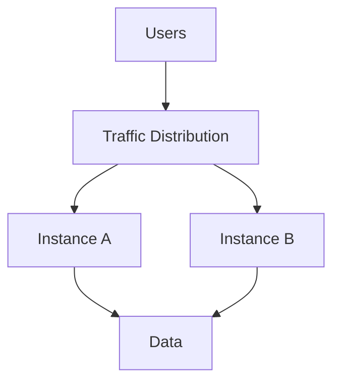
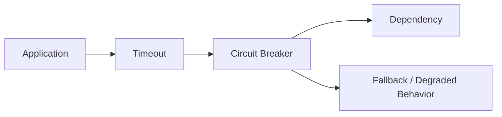
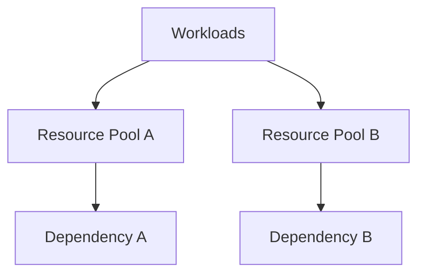
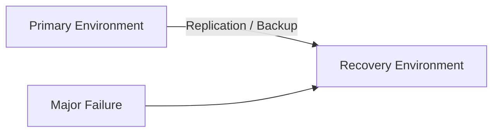

# Resilience Architecture Skill

## Purpose

This skill defines principles, patterns, decision criteria, and best practices for designing systems that can withstand, contain, recover from, and adapt to failures.

Resilience is the ability of a system to continue providing an acceptable level of service when failures, disruptions, overload, or unexpected conditions occur.

Resilience architecture should address:

- Failure prevention
- Failure detection
- Fault isolation
- Fault tolerance
- Graceful degradation
- Recovery
- Redundancy
- Dependency failure
- Capacity failure
- Disaster recovery
- Data recovery
- Operational recovery

The objective is not to eliminate every possible failure.

The objective is to ensure that failures produce consequences proportional to business requirements and that critical capabilities can recover within acceptable limits.

This skill is:

- Domain-neutral
- Vendor-neutral
- Cloud-neutral
- Platform-neutral
- Technology-neutral
- Product-neutral
- Industry-neutral

Technology-specific resilience mechanisms should be selected only after resilience requirements and failure scenarios are understood.

---

# Objectives

Good resilience architecture should help:

- Identify critical capabilities.
- Understand failure modes.
- Identify failure domains.
- Reduce single points of failure.
- Contain failures.
- Prevent cascading failures.
- Handle dependency failures.
- Handle transient failures.
- Handle capacity exhaustion.
- Support graceful degradation.
- Define availability expectations.
- Define recovery objectives.
- Protect critical data.
- Establish appropriate redundancy.
- Support failover.
- Support disaster recovery.
- Validate recovery capability.
- Improve system behavior through failure testing.
- Avoid unnecessary resilience complexity.

---

# Fundamental Principle

## Assume Failure Will Occur

Distributed and complex systems will eventually experience failures.

Potential failures include:

- Process failure
- Hardware failure
- Network failure
- Dependency failure
- Data-store failure
- Resource exhaustion
- Configuration failure
- Deployment failure
- Human error
- Regional failure
- External-service failure

Architecture should therefore ask:

> What happens when this component fails?

rather than:

> Can this component fail?

---

# Resilience Starts With Business Requirements

Do not begin resilience architecture by adding:

- Replicas
- Failover
- Multiple regions
- Retries
- Backup systems

Begin by understanding:

- Which capabilities are critical?
- What downtime is acceptable?
- What data loss is acceptable?
- What degraded behavior is acceptable?
- Which failures must be tolerated?
- How quickly must recovery occur?
- What is the business impact of failure?

Then design resilience proportionally.

---

# Resilience vs. Reliability

Reliability and resilience are related but different.

## Reliability

Reliability concerns how consistently a system performs its intended function without failure.

## Resilience

Resilience concerns how the system behaves when failure occurs.

Conceptually:

```text
Reliability
    ↓
Reduce Probability of Failure

Resilience
    ↓
Reduce Impact of Failure
```

A system should consider both.

---

# Resilience vs. Availability

Availability measures whether a capability is usable when required.

Resilience contributes to availability by enabling:

- Failure tolerance
- Recovery
- Redundancy
- Degradation
- Failover

Availability is an outcome.

Resilience is part of how that outcome is achieved.

---

# Criticality

Not every system component requires identical resilience.

Classify capabilities according to business impact.

Conceptually:

```text
Critical
   ↓
High Resilience Requirement

Important
   ↓
Moderate Resilience Requirement

Non-Critical
   ↓
Simpler Recovery May Be Acceptable
```

Do not apply maximum resilience everywhere.

---

# Failure Modes

Architecture should identify realistic ways components can fail.

Examples include:

### Complete Failure

A component becomes unavailable.

### Partial Failure

Some operations work while others fail.

### Slow Failure

A dependency responds but with excessive latency.

### Intermittent Failure

Failures occur unpredictably.

### Incorrect Response

A component responds successfully but provides incorrect information.

### Resource Exhaustion

Capacity becomes unavailable.

### Dependency Failure

An upstream or downstream dependency fails.

### Data Failure

Data becomes unavailable, inconsistent, corrupted, or lost.

Understanding failure modes is more useful than simply stating:

> The component may fail.

---

# Failure Mode Analysis

For significant components ask:

1. How can it fail?
2. How likely is the failure?
3. What depends on it?
4. What is the impact?
5. How will failure be detected?
6. Can the failure be isolated?
7. Can the system continue without it?
8. How will recovery occur?
9. How long will recovery take?
10. What data may be lost?

---

# Failure Domains

A failure domain is a boundary within which a failure may affect multiple resources.

Possible failure domains include:

```text
Process

Instance

Host

Network

Service

Zone

Region

Provider

External Dependency
```

Architecture should avoid placing redundant components inside the same failure domain when independent failure protection is required.

---

# Blast Radius

Blast radius describes how much of the system can be affected by a failure.

Good resilience architecture attempts to reduce unnecessary blast radius.

Conceptually:

```text
Failure
   ↓
Small Isolated Area
```

rather than:

```text
Failure
   ↓
Entire System
```

---

# Fault Isolation

Fault isolation prevents failure in one area from unnecessarily affecting unrelated capabilities.

Isolation may occur by:

- Component
- Workload
- Tenant
- Data domain
- Region
- Processing pool
- Dependency

Isolation should reflect actual failure and business boundaries.

---

# Single Points of Failure

A single point of failure is a component whose failure causes unacceptable loss of capability.

Architecture should identify such components.

For each one determine whether:

- Redundancy is required.
- Failover is required.
- Recovery is sufficient.
- The business can tolerate the outage.

Not every single point of failure must be eliminated.

The decision depends on required availability.

---

# Redundancy

Redundancy provides alternative capacity when a component fails.

Conceptually:

```text
        Request
       /       \
      ↓         ↓
Instance A   Instance B
```

Redundancy may improve:

- Availability
- Fault tolerance
- Recovery

It also increases:

- Cost
- Operational complexity
- Synchronization requirements

Use redundancy where failure impact justifies it.

---

# Independent Redundancy

Redundant components should avoid sharing the same critical failure dependency when independent protection is required.

Example:

```text
Component A ─┐
             ├── Same Dependency
Component B ─┘
```

If that dependency fails, redundancy may provide no benefit.

Always consider shared dependencies.

---

# Active-Active

Multiple instances or environments actively serve workload.

Conceptually:

```text
        Traffic
       /       \
      ↓         ↓
Active A     Active B
```

Potential benefits:

- Improved availability
- Better capacity utilization
- Reduced failover delay

Potential challenges:

- Data consistency
- Coordination
- Routing
- Conflict resolution
- Cost

Use active-active only when requirements justify the complexity.

---

# Active-Passive

One environment serves workload while another is prepared to take over.

Conceptually:

```text
Active
  │
  │ Replication / Synchronization
  ▼
Passive
```

Potential benefits:

- Simpler coordination
- Lower operating complexity

Potential trade-offs:

- Failover delay
- Recovery readiness
- Idle or partially used capacity

---

# Failover

Failover transfers workload from a failed or unhealthy component to an alternative.

Architecture should define:

- What triggers failover?
- Is failover automatic or manual?
- Where does traffic move?
- What happens to in-flight work?
- What happens to data?
- How is failover validated?
- How is normal operation restored?

Failover should not be assumed to work simply because redundant resources exist.

---

# Failback

Failback returns workload to the preferred environment after recovery.

Architecture should define:

- When failback occurs.
- Whether it is automatic or controlled.
- How data is synchronized.
- How conflicts are prevented.
- How risk is minimized.

Failback can sometimes be more complex than failover.

---

# Graceful Degradation

A resilient system may continue providing reduced functionality instead of failing completely.

Conceptually:

```text
Full Service
    ↓
Dependency Failure
    ↓
Reduced Service
```

Examples may include:

- Read-only behavior
- Cached information
- Deferred processing
- Disabled non-critical functionality
- Reduced personalization

The appropriate degraded behavior should be defined by business requirements.

---

# Essential vs. Non-Essential Capabilities

Identify which capabilities must remain available during failure.

Conceptually:

```text
System
│
├── Essential Capability
├── Essential Capability
├── Non-Essential Capability
└── Optional Enhancement
```

During disruption, protecting essential functions may be more valuable than maintaining every feature.

---

# Dependency Resilience

Dependencies are common sources of failure.

For each significant dependency determine:

- Is it critical?
- What happens if it is unavailable?
- What happens if it becomes slow?
- What happens if it returns errors?
- Can functionality continue without it?
- Can information be cached?
- Can processing be deferred?
- Can requests be rejected safely?

---

# Dependency Chains

Long synchronous dependency chains increase failure probability.

Conceptually:

```text
A → B → C → D → E
```

A failure or slowdown in any dependency may affect the entire operation.

Minimize unnecessary synchronous dependencies.

---

# Timeout

Every remote operation should have bounded waiting behavior where appropriate.

Conceptually:

```text
Request
   ↓
Wait
   ↓
Timeout
```

Without appropriate timeouts, resources may remain blocked indefinitely.

Timeouts should reflect realistic operation characteristics.

---

# Timeout Budget

End-to-end operations may have an overall latency budget.

Example:

```text
Overall Request Budget
        │
        ├── Dependency A
        ├── Dependency B
        └── Processing
```

Individual timeout values should not collectively exceed realistic end-to-end expectations.

---

# Retry

Retry may recover from transient failure.

Conceptually:

```text
Request
   ↓
Failure
   ↓
Wait
   ↓
Retry
```

Retries are appropriate only when:

- Failure may be transient.
- Repeating the operation is safe.
- The overall deadline permits retry.

---

# Bounded Retry

Retries must be limited.

Avoid:

```text
Failure
 ↓
Retry
 ↓
Failure
 ↓
Retry
 ↓
Failure
 ↓
Retry Forever
```

Unbounded retries can amplify failures.

---

# Retry Backoff

Retries should generally avoid immediate repeated attempts.

Conceptually:

```text
Failure
 ↓
Wait
 ↓
Retry
 ↓
Longer Wait
 ↓
Retry
```

This gives dependencies time to recover.

---

# Jitter

When many clients retry simultaneously, synchronized retries can overload a recovering dependency.

Jitter introduces variation into retry timing.

Conceptually:

```text
Client A → Retry after X

Client B → Retry after Y

Client C → Retry after Z
```

This reduces coordinated retry spikes.

---

# Retry Storm

A retry storm occurs when retries significantly increase load during failure.

Example:

```text
Normal Traffic
     +
Retries
     +
More Retries
     =
Dependency Overload
```

Retry policy must consider the capacity of the failing dependency.

---

# Idempotency

Retried operations may execute more than once.

Where duplicate execution is possible, operations should be idempotent where practical.

Conceptually:

```text
Same Operation
      ↓
Repeated Execution
      ↓
Same Intended Outcome
```

Refer to `integration-patterns.md` for deeper guidance.

---

# Circuit Breaker

A circuit breaker temporarily prevents calls to an unhealthy dependency.

Conceptually:

```text
Closed
  ↓
Repeated Failures
  ↓
Open
  ↓
Wait
  ↓
Half-Open
  ↓
Test Recovery
```

This can reduce:

- Repeated failures
- Resource exhaustion
- Pressure on unhealthy dependencies

Use circuit breakers where dependency failure characteristics justify them.

---

# Bulkhead Pattern

Bulkheads isolate resources so that failure or exhaustion in one workload does not consume all available capacity.

Conceptually:

```text
Workload A → Resource Pool A

Workload B → Resource Pool B

Workload C → Resource Pool C
```

Failure in one pool should not necessarily exhaust others.

---

# Resource Isolation

Consider isolating resources based on:

- Tenant
- Workload
- Priority
- Dependency
- Criticality

Isolation should be proportional to failure risk.

---

# Backpressure

Backpressure prevents upstream producers from overwhelming downstream consumers.

Conceptually:

```text
Producer
   ↓
Demand Exceeds Capacity
   ↓
Slow / Reject / Buffer
```

Possible responses include:

- Throttling
- Delaying
- Rejecting
- Buffering
- Prioritizing

Unlimited buffering is not resilience.

It only postpones failure.

---

# Load Shedding

During overload, a system may intentionally reject lower-priority work to protect essential functionality.

Conceptually:

```text
Excess Demand
      ↓
Prioritize
   /       \
  ↓         ↓
Critical   Optional
Process    Reject/Delay
```

Load shedding should follow defined business priorities.

---

# Rate Limiting

Rate limiting protects systems from excessive demand.

It may limit workload by:

- Consumer
- Tenant
- Operation
- Resource
- Time period

Rate limits should be predictable and observable.

---

# Capacity Resilience

Resilience design should consider capacity failures.

Examples include:

- CPU exhaustion
- Memory exhaustion
- Connection exhaustion
- Thread exhaustion
- Storage exhaustion
- Queue growth
- Request limits
- Quota exhaustion

Capacity should have appropriate headroom where required.

---

# Capacity Headroom

Critical systems may require spare capacity to absorb:

- Traffic spikes
- Failover
- Dependency slowdown
- Recovery workload

Running permanently at maximum capacity reduces resilience.

---

# Scaling and Resilience

Automatic scaling can improve resilience to demand changes.

However, scaling is not instantaneous.

Architecture should consider:

```text
Demand Increase
      ↓
Detection
      ↓
Scaling Decision
      ↓
Provisioning
      ↓
New Capacity Available
```

Capacity must survive the period before scaling completes.

---

# Queue-Based Resilience

Queues may decouple producers and consumers.

Conceptually:

```text
Producer
   ↓
Queue
   ↓
Consumer
```

If consumers temporarily fail, work may remain buffered.

However, architecture must consider:

- Queue capacity
- Message age
- Retry
- Dead-letter handling
- Recovery rate

Queues move failure boundaries; they do not eliminate failures.

---

# Poison Messages

Messages that repeatedly fail processing should be isolated where appropriate.

A single problematic message should not indefinitely block healthy processing.

Refer to `integration-patterns.md`.

---

# Data Resilience

Resilience architecture must consider:

- Data loss
- Data corruption
- Data unavailability
- Replication failure
- Backup failure
- Synchronization failure

Data resilience should align with business recovery requirements.

Refer to `data-architecture.md`.

---

# Recovery Point Objective

Recovery Point Objective (RPO) defines the maximum acceptable amount of data loss measured in time.

Conceptually:

```text
Failure Time
     │
     │ ← Acceptable Data Loss
     │
Last Recoverable Point
```

Example values should be determined by business requirements.

Do not invent RPO values.

---

# Recovery Time Objective

Recovery Time Objective (RTO) defines how quickly a capability must be restored after disruption.

Conceptually:

```text
Failure
   ↓
Recovery Process
   ↓
Service Restored
```

The allowed duration is the RTO.

Do not invent RTO values.

---

# RTO vs. RPO

```text
RPO
↓
How much data can we lose?

RTO
↓
How long can we remain unavailable?
```

These are separate requirements.

Both should come from business needs.

---

# Backup

Backups protect against scenarios such as:

- Data deletion
- Data corruption
- Operational mistakes
- Certain infrastructure failures

Backup strategy should define:

- Scope
- Frequency
- Retention
- Security
- Location
- Recovery process

---

# Backup Is Not High Availability

Backups help recover data.

They do not automatically provide continuous service availability.

Conceptually:

```text
High Availability
        ≠
Backup
```

Both may be required for different reasons.

---

# Backup Is Not Disaster Recovery

Backup is one possible component of disaster recovery.

Disaster recovery additionally considers:

- Infrastructure
- Configuration
- Networking
- Identity
- Dependencies
- Applications
- Data
- Operational procedures

---

# Restore Testing

A backup has limited resilience value unless restoration can be performed successfully.

Recovery testing should verify:

- Backup integrity
- Recovery process
- Recovery time
- Required permissions
- Dependency recovery
- Data consistency

---

# Disaster Recovery

Disaster recovery addresses significant disruption that exceeds normal high-availability mechanisms.

Potential scenarios include:

- Regional outage
- Major infrastructure failure
- Destructive security incident
- Severe configuration corruption
- Major data loss

---

# Disaster Recovery Strategy

A DR strategy should define:

1. Failure scenarios.
2. Recovery location.
3. Recovery infrastructure.
4. Data recovery.
5. Configuration recovery.
6. Dependency recovery.
7. Traffic restoration.
8. Validation.
9. Operational ownership.
10. Return-to-normal strategy.

---

# Recovery Strategies

Conceptual approaches include:

## Backup and Restore

Infrastructure and data are reconstructed after failure.

Lowest continuous resource requirement but typically slower recovery.

---

## Minimal Recovery Capacity

A minimal environment exists and is expanded during recovery.

---

## Warm Recovery

A partially operational secondary environment is maintained.

---

## Active Recovery

A fully operational secondary environment exists.

Higher readiness generally increases cost and complexity.

---

# Geographic Resilience

Geographic redundancy may protect against large-scale location failures.

However, multi-region architecture introduces:

- Data replication
- Consistency concerns
- Failover complexity
- Routing complexity
- Testing requirements
- Cost

Use geographic resilience only where requirements justify it.

---

# Recovery Dependencies

Recovery architecture must include dependencies.

A system may be restored but remain unavailable because:

```text
Application Restored
        ↓
Identity Unavailable

or

Application Restored
        ↓
Data Unavailable

or

Application Restored
        ↓
External Dependency Unavailable
```

Recovery planning should consider the full dependency chain.

---

# Recovery Order

Some systems require dependencies to recover in a specific sequence.

Conceptually:

```text
Identity
   ↓
Network
   ↓
Data
   ↓
Core Services
   ↓
Dependent Services
   ↓
User Access
```

Actual ordering should reflect architecture.

---

# State Recovery

Stateful systems require explicit recovery planning.

Consider:

- In-flight transactions
- Partially completed workflows
- Queued work
- Temporary state
- Sessions
- Replicated state

Recovery should avoid creating invalid or duplicate business outcomes.

---

# Reconciliation

After recovery, systems may need to verify that distributed or replicated state is correct.

Reconciliation may detect:

- Missing records
- Duplicate processing
- Inconsistent state
- Delayed synchronization

Critical systems should have a strategy for restoring acceptable consistency.

---

# Graceful Startup

After recovery, bringing every component online simultaneously may overload dependencies.

Where relevant, recovery may require controlled startup.

Conceptually:

```text
Core Dependencies
      ↓
Core Services
      ↓
Dependent Services
      ↓
Background Processing
```

---

# Recovery Load

Recovery itself may create significant workload.

Examples include:

- Backlog processing
- Cache rebuilding
- Data synchronization
- Retry traffic
- User reconnection

Architecture should consider recovery capacity, not only normal capacity.

---

# Cascading Failure

A cascading failure occurs when failure in one component causes additional components to fail.

Example:

```text
Dependency Slow
      ↓
Requests Accumulate
      ↓
Threads Exhaust
      ↓
Service Fails
      ↓
Upstream Retries
      ↓
More Load
```

Resilience patterns should attempt to break such chains.

---

# Cascading Failure Prevention

Possible techniques include:

- Timeouts
- Bounded retries
- Circuit breakers
- Bulkheads
- Backpressure
- Rate limits
- Load shedding
- Graceful degradation

Select only the mechanisms appropriate to the failure scenario.

---

# Common-Mode Failure

Redundant components may fail simultaneously because they share a common dependency.

Examples include shared:

- Configuration
- Network
- Identity
- Data store
- Deployment artifact
- Administrative process

Redundancy analysis should identify common-mode failure.

---

# Correlated Failure

Failures may not be independent.

For example:

```text
Deployment
    ↓
All Instances Updated
    ↓
Same Defect Everywhere
```

Redundancy alone does not protect against identical software or configuration defects.

---

# Deployment Resilience

Deployment architecture should reduce the risk that a bad change affects the entire workload.

Potential approaches include:

- Progressive rollout
- Limited exposure
- Health validation
- Rollback
- Version separation

Exact deployment strategy belongs to implementation and delivery architecture.

---

# Configuration Resilience

Configuration errors can cause large outages.

Configuration should support:

- Validation
- Controlled change
- Versioning
- Rollback
- Auditability

Avoid uncontrolled manual configuration.

---

# Human Error

Humans are part of operational systems.

Architecture should reduce the impact of mistakes through:

- Automation
- Validation
- Review
- Least privilege
- Safe defaults
- Reversible operations

Do not design resilience assuming operators will never make mistakes.

---

# External Dependency Failure

External systems may fail outside organizational control.

Architecture should define behavior for:

```text
Unavailable Dependency

Slow Dependency

Incorrect Response

Rate Limited Dependency

Partial Dependency Failure
```

Avoid assuming external services will always meet expectations.

---

# Third-Party Dependency Strategy

For critical external dependencies consider:

- Timeout
- Retry
- Circuit breaking
- Caching
- Deferred processing
- Alternative dependency
- Graceful degradation

Alternative providers introduce their own cost and complexity and should not be added without justification.

---

# Resilience and Consistency

Resilience mechanisms may affect consistency.

Examples include:

- Replication lag
- Cached data
- Deferred processing
- Multi-region writes

Architecture should define what temporary inconsistency is acceptable.

Refer to `distributed-systems.md`.

---

# Resilience and Security

Resilience mechanisms must not bypass required security controls.

For example, recovery environments should maintain appropriate:

- Identity
- Authorization
- Encryption
- Secrets management
- Auditability

Emergency recovery should not automatically mean unrestricted access.

Refer to `security-architecture.md`.

---

# Resilience and Observability

Resilience mechanisms must be observable.

Examples include:

- Retry activity
- Circuit-breaker state
- Failover
- Queue backlog
- Recovery
- Scaling
- Degraded operation

Refer to `observability.md`.

---

# Resilience and Cost

Higher resilience generally introduces higher cost.

Potential cost drivers include:

- Redundant capacity
- Secondary environments
- Data replication
- Backups
- Testing
- Additional networking
- Operational complexity

Architecture should balance:

```text
Business Impact of Failure
          vs.
Cost of Resilience
```

---

# Resilience and Complexity

Every resilience mechanism creates additional behavior.

For example:

```text
Retry
Circuit Breaker
Failover
Replication
Multi-Region
```

all introduce states and failure modes of their own.

Prefer the simplest resilience design that satisfies actual requirements.

---

# Availability Targets

Availability targets should come from business requirements.

Do not automatically select:

```text
99.9%

99.99%

99.999%
```

without understanding what the business needs.

Each additional level of availability may require significantly more:

- Redundancy
- Automation
- Testing
- Operations
- Cost

---

# Availability Dependencies

End-to-end availability depends on all critical dependencies.

Conceptually:

```text
User
 ↓
Gateway
 ↓
Application
 ↓
Dependency
 ↓
Data
```

Improving only one component may not significantly improve overall availability.

---

# Resilience Testing

Resilience mechanisms should be validated.

Testing may include:

- Component failure
- Dependency failure
- Network delay
- Resource exhaustion
- Instance termination
- Data-store failure
- Recovery
- Failover

Testing should reflect realistic failure scenarios.

---

# Failure Injection

Controlled failure injection can help verify system behavior.

Examples may include:

```text
Terminate Instance

Delay Dependency

Reject Requests

Exhaust Resource

Disable Dependency
```

Failure injection should be performed safely and according to organizational controls.

---

# Chaos Engineering

Chaos engineering uses controlled experiments to understand system behavior under failure.

A useful approach is:

```text
Define Expected Behavior
        ↓
Introduce Controlled Failure
        ↓
Observe System
        ↓
Validate Assumptions
        ↓
Improve Architecture
```

Chaos engineering should not mean introducing random failures without purpose.

---

# Game Days

A game day is a planned exercise in which teams simulate or introduce failure scenarios.

Game days may validate:

- Technical resilience
- Monitoring
- Alerting
- Runbooks
- Communication
- Recovery procedures

---

# Disaster Recovery Testing

DR plans should be tested periodically according to business criticality.

Testing may validate:

- Recovery infrastructure
- Data restoration
- Identity
- Networking
- Dependencies
- Traffic switching
- RTO
- RPO

An untested DR plan is an assumption.

---

# Recovery Runbooks

Important recovery procedures should be documented where operational complexity justifies it.

Runbooks may include:

- Detection
- Decision criteria
- Recovery actions
- Validation
- Escalation
- Failback

Runbooks should support operators rather than replace engineering judgment.

---

# Resilience Architecture Views

Architecture documentation may include:

### Failure Domain View

Shows important failure boundaries.

### Dependency Resilience View

Shows critical dependencies and failure handling.

### Availability View

Shows redundancy and failover.

### Degradation View

Shows behavior when dependencies fail.

### Disaster Recovery View

Shows primary and recovery environments.

### Data Recovery View

Shows replication, backup, and recovery relationships.

Only create views that improve architectural understanding.

---

# Mermaid Diagram Guidance

Use Mermaid diagrams when they improve understanding.

## Redundant Architecture



## Dependency Resilience



## Failure Isolation



## Disaster Recovery



## Cascading Failure Prevention


Diagrams should explain meaningful resilience behavior rather than simply display redundant components.

---

# Resilience Decision Framework

For every significant capability evaluate:

## 1. Criticality

How important is the capability?

## 2. Failure Modes

How can it fail?

## 3. Impact

What happens when it fails?

## 4. Failure Domain

How much of the system is affected?

## 5. Availability Requirement

How much downtime is acceptable?

## 6. RTO

How quickly must it recover?

## 7. RPO

How much data loss is acceptable?

## 8. Dependency Behavior

What happens when dependencies fail?

## 9. Degraded Behavior

Can the capability continue partially?

## 10. Redundancy

Is redundant capacity required?

## 11. Failover

How will workload move during failure?

## 12. Recovery

How will normal operation be restored?

## 13. Observability

How will failure and recovery be detected?

## 14. Validation

How will resilience assumptions be tested?

## 15. Cost

Is resilience cost proportional to business impact?

Select the simplest design that satisfies these requirements.

---

# Best Practices

- Assume failures will occur.
- Start from business criticality.
- Define availability requirements explicitly.
- Define RTO and RPO where required.
- Identify realistic failure modes.
- Identify failure domains.
- Reduce unnecessary blast radius.
- Identify single points of failure.
- Use redundancy only where justified.
- Avoid shared failure dependencies.
- Define failover behavior.
- Define failback behavior.
- Support graceful degradation where appropriate.
- Minimize long synchronous dependency chains.
- Use explicit timeouts.
- Bound retries.
- Use backoff and jitter where appropriate.
- Design retried operations for duplicate execution.
- Use circuit breakers where dependency failures justify them.
- Use bulkheads where resource isolation is valuable.
- Implement backpressure where producers can overwhelm consumers.
- Consider load shedding during overload.
- Maintain capacity headroom where required.
- Protect data through appropriate backup and recovery.
- Test restoration.
- Plan for recovery load.
- Prevent cascading failures.
- Consider common-mode failure.
- Make resilience mechanisms observable.
- Test failure scenarios.
- Test disaster recovery.
- Document important recovery procedures.
- Balance resilience against cost and complexity.

---

# Quality Considerations

Good resilience architecture should demonstrate:

## Fault Tolerance

Expected failures can be tolerated where required.

## Fault Isolation

Failures remain appropriately contained.

## Availability

Critical capabilities remain available according to defined expectations.

## Recoverability

Failed capabilities can be restored within required objectives.

## Data Durability

Important data is protected against unacceptable loss.

## Graceful Degradation

Non-critical failures do not unnecessarily cause complete system failure.

## Dependency Resilience

External and internal failures are handled deliberately.

## Capacity Resilience

Demand spikes and resource constraints are handled appropriately.

## Observability

Failures and recovery behavior can be understood.

## Testability

Resilience assumptions can be validated.

## Cost Effectiveness

Resilience mechanisms are proportional to business impact.

---

# Trade-offs

Resilience commonly involves trade-offs such as:

| Concern | Trade-off |
|---|---|
| Redundancy | Cost |
| High Availability | Complexity |
| Active-Active | Consistency Complexity |
| Active-Passive | Failover Time |
| Multi-Region | Operational Complexity |
| Retry | Additional Load |
| Timeout | Premature Failure |
| Circuit Breaker | Temporary Rejection |
| Bulkheads | Resource Efficiency |
| Backpressure | Increased Latency |
| Load Shedding | Reduced Functionality |
| Replication | Consistency |
| Backup Frequency | Cost |
| Low RPO | Replication / Backup Cost |
| Low RTO | Recovery Infrastructure Cost |
| Graceful Degradation | Application Complexity |
| Capacity Headroom | Resource Cost |
| Extensive Failure Testing | Engineering Effort |

Trade-offs should be explicit.

---

# Common Mistakes

Avoid:

- Assuming failures will not happen.
- Designing resilience without business requirements.
- Selecting arbitrary availability targets.
- Making everything highly available.
- Using multi-region architecture by default.
- Adding redundancy inside the same failure domain.
- Ignoring shared dependencies.
- Assuming replicas eliminate all single points of failure.
- Assuming backup provides high availability.
- Assuming backup automatically provides disaster recovery.
- Creating backups without testing restore.
- Retrying every failure.
- Retrying indefinitely.
- Retrying non-idempotent operations without considering duplicate effects.
- Using immediate retries without backoff.
- Creating retry storms.
- Using extremely long timeouts.
- Using no timeouts.
- Ignoring slow dependencies.
- Allowing one dependency to consume all resources.
- Using unlimited queues.
- Ignoring queue backlog.
- Ignoring capacity during failover.
- Ignoring recovery load.
- Ignoring common-mode failures.
- Ignoring correlated deployment failures.
- Assuming automatic failover always works.
- Designing failover without failback.
- Ignoring data consistency after recovery.
- Creating DR plans without testing them.
- Adding resilience patterns without understanding their failure modes.
- Over-engineering resilience for non-critical capabilities.

---

# Validation Checklist

Before considering resilience architecture sufficiently sound, verify:

- [ ] Critical capabilities are identified.
- [ ] Business impact of failure is understood.
- [ ] Availability requirements are explicit.
- [ ] RTO is defined where required.
- [ ] RPO is defined where required.
- [ ] Important failure modes are identified.
- [ ] Failure domains are understood.
- [ ] Blast radius is considered.
- [ ] Single points of failure are identified.
- [ ] Redundancy is justified where used.
- [ ] Redundant components do not unnecessarily share critical failure dependencies.
- [ ] Active-active or active-passive decisions are justified.
- [ ] Failover behavior is defined.
- [ ] Failback behavior is understood.
- [ ] Graceful degradation is considered.
- [ ] Essential and non-essential capabilities are distinguished where useful.
- [ ] Critical dependency failures are considered.
- [ ] Slow dependency behavior is considered.
- [ ] Timeouts are defined where required.
- [ ] Retry behavior is bounded.
- [ ] Backoff is considered.
- [ ] Jitter is considered where synchronized retries are possible.
- [ ] Duplicate execution is considered.
- [ ] Circuit breaking is considered where relevant.
- [ ] Resource isolation is considered.
- [ ] Backpressure is considered.
- [ ] Load shedding is considered where overload is possible.
- [ ] Capacity headroom is appropriate.
- [ ] Scaling delay is considered.
- [ ] Queue capacity and backlog are understood where relevant.
- [ ] Data recovery requirements are defined.
- [ ] Backup strategy exists where required.
- [ ] Restoration is tested.
- [ ] Disaster recovery strategy is defined where required.
- [ ] Recovery dependencies are understood.
- [ ] Recovery order is understood where relevant.
- [ ] Recovery workload is considered.
- [ ] Reconciliation is considered after failure.
- [ ] Cascading failure scenarios are considered.
- [ ] Common-mode failures are considered.
- [ ] Deployment failures are considered.
- [ ] Configuration failures are considered.
- [ ] External dependency failures are considered.
- [ ] Resilience mechanisms are observable.
- [ ] Failure scenarios can be tested.
- [ ] DR procedures can be tested.
- [ ] Recovery ownership is clear.
- [ ] Resilience cost is proportional to business criticality.
- [ ] Unnecessary resilience complexity has been avoided.

---

# Relationship With Other Architecture Skills

Resilience is a cross-cutting architecture concern.

Use this skill together with:

### `architecture-principles.md`

For architectural quality attributes, trade-offs, constraints, and decision-making.

### `architecture-patterns.md`

For structural patterns affecting resilience and failure isolation.

### `system-design.md`

For components, boundaries, dependencies, state, scalability, and failure behavior.

### `distributed-systems.md`

For partial failures, consistency, replication, coordination, distributed transactions, and network uncertainty.

### `integration-patterns.md`

For timeout, retry, idempotency, asynchronous communication, backpressure, and failed-message handling.

### `data-architecture.md`

For data replication, backup, durability, recovery, consistency, and reconciliation.

### `cloud-architecture.md`

For failure domains, availability zones, regions, redundancy, elasticity, and disaster recovery.

### `security-architecture.md`

For secure recovery, incident resilience, protected backups, identity, and recovery access.

### `observability.md`

For failure detection, health, retry visibility, dependency monitoring, failover monitoring, and recovery validation.

Conceptually:

```text
                  Architecture
                       │
         ┌─────────────┼─────────────┐
         ↓             ↓             ↓
      System         Cloud          Data
      Design      Architecture   Architecture
         │             │             │
         └─────────────┼─────────────┘
                       ↓
                   Resilience
                       ↓
          ┌────────────┼────────────┐
          ↓            ↓            ↓
     Prevention     Tolerance    Recovery
          │            │            │
          └────────────┼────────────┘
                       ↓
              Resilience Testing
                       ↓
              Operational Learning
```

Resilience should therefore be designed across system boundaries rather than added as a standalone infrastructure feature.

---

# References

Resilience architecture practices may draw, where applicable, from recognized guidance such as:

- Site Reliability Engineering principles
- Resilience engineering principles
- Distributed systems principles
- Fault-tolerant system design
- Failure Mode and Effects Analysis concepts
- Circuit Breaker pattern
- Bulkhead pattern
- Retry and timeout patterns
- Backpressure principles
- Graceful degradation principles
- Disaster recovery practices
- Chaos engineering principles
- Cloud Well-Architected reliability guidance
- ISO/IEC 25010 reliability characteristics
- Relevant organizational business continuity and disaster recovery standards

These frameworks and patterns should be treated as reusable guidance rather than mandatory implementations.

The appropriate resilience architecture should ultimately be determined by business criticality, failure impact, availability requirements, RTO, RPO, workload characteristics, dependency behavior, data requirements, operational capability, security requirements, cost, complexity, and acceptable risk.
