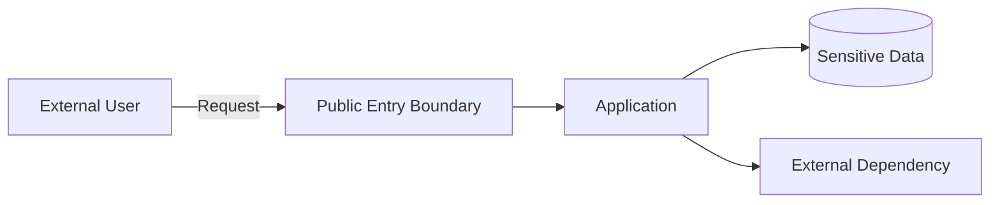
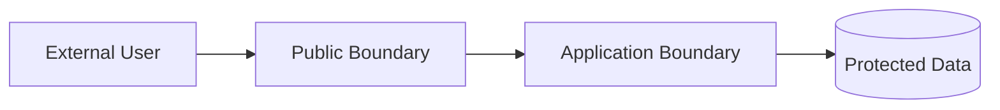
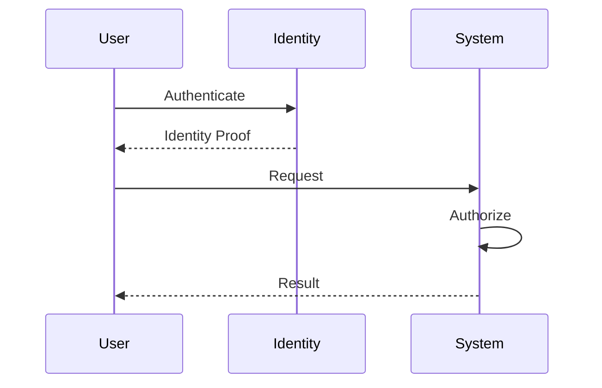
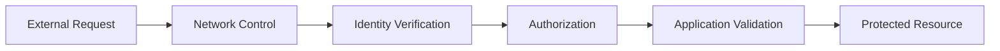
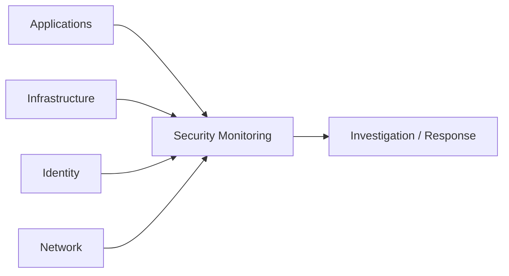

# Security Architecture Skill

## Purpose

This skill defines principles, concepts, decision criteria, and best practices for incorporating security into architecture.

Security architecture establishes how systems protect:

- Identities
- Data
- Workloads
- Interfaces
- Networks
- Infrastructure
- Dependencies
- Administrative capabilities
- Operational processes

The objective is not to select security products.

The objective is to identify security requirements, trust boundaries, threats, risks, and appropriate architectural controls before technology-specific implementation decisions are made.

This skill is:

- Domain-neutral
- Vendor-neutral
- Cloud-neutral
- Platform-neutral
- Technology-neutral
- Product-neutral
- Industry-neutral

Security controls should be proportional to actual risk, sensitivity, business impact, and applicable organizational requirements.

---

# Objectives

Good security architecture should help:

- Identify assets requiring protection.
- Identify trust boundaries.
- Understand threat exposure.
- Reduce attack surface.
- Establish identity boundaries.
- Apply least privilege.
- Protect sensitive data.
- Establish secure communication.
- Isolate workloads appropriately.
- Protect secrets and credentials.
- Establish security monitoring.
- Support auditability.
- Support secure recovery.
- Reduce unnecessary trust.
- Apply defense in depth.
- Support secure evolution.
- Integrate security into architecture decisions.

---

# Fundamental Principles

## Security Is an Architecture Concern

Security should be considered throughout architecture design.

It should not be added only after:

```text
Application Design
        ↓
Infrastructure Design
        ↓
Deployment
        ↓
Security Review
```

Prefer:

```text
Requirements
     ↓
Architecture
     ↓
Threat Analysis
     ↓
Security Controls
     ↓
Technology Selection
     ↓
Implementation
```

Security decisions made late can require expensive redesign.

---

# Start With Risk

Security architecture should begin by understanding:

- What must be protected?
- From whom?
- From what?
- What would happen if protection failed?
- What controls already exist?
- What residual risk remains?

Do not apply security controls solely because they are technically available.

Controls should address meaningful risks.

---

# Security Requirements

Identify relevant security requirements before designing controls.

Requirements may relate to:

- Confidentiality
- Integrity
- Availability
- Authentication
- Authorization
- Privacy
- Auditability
- Non-repudiation
- Isolation
- Regulatory obligations
- Recovery

Security requirements should be explicit where they materially affect architecture.

---

# Assets

An asset is something requiring protection.

Assets may include:

- Data
- Identities
- Credentials
- Applications
- Services
- Infrastructure
- Configuration
- Intellectual property
- Business processes
- Logs
- Backups
- Administrative interfaces

Architecture should identify critical assets and their relative importance.

---

# Asset Classification

Not every asset requires identical protection.

Protection should reflect characteristics such as:

- Sensitivity
- Business criticality
- Regulatory importance
- Financial impact
- Operational impact

Avoid applying maximum controls indiscriminately.

---

# Confidentiality

Confidentiality protects information from unauthorized disclosure.

Architectural considerations may include:

- Access control
- Encryption
- Network boundaries
- Data minimization
- Isolation
- Logging controls

---

# Integrity

Integrity protects information and systems from unauthorized or unintended modification.

Architectural considerations may include:

- Authorization
- Validation
- Transaction controls
- Auditability
- Change controls
- Integrity verification

---

# Availability

Availability ensures required capabilities remain usable according to business expectations.

Security threats affecting availability may include:

- Resource exhaustion
- Abuse
- Dependency disruption
- Malicious traffic
- Administrative errors

Availability is both a reliability and security concern.

---

# Trust Boundaries

A trust boundary exists where the level or type of trust changes.

Examples include:

```text
Internet
   ↓
Public Entry Boundary
   ↓
Internal Workload
   ↓
Sensitive Data
```

Other trust boundaries may exist between:

- Users and systems
- Systems and systems
- Applications and databases
- Administrative and runtime environments
- Internal and external systems
- Different organizations
- Different security zones

Trust boundaries should be visible in architecture documentation.

---

# Never Assume Internal Means Trusted

A component should not automatically be trusted because it is:

- Inside an internal network
- Inside a cloud environment
- Owned by the same organization
- Deployed in the same environment
- Running on the same platform

Trust should be based on identity, authorization, context, and risk.

---

# Zero Trust

Zero Trust architecture assumes that trust should not be granted solely based on location.

Core principles include:

```text
Verify Explicitly

Use Least Privilege

Assume Breach
```

Access decisions should consider relevant context such as:

- Identity
- Resource
- Requested operation
- Security state
- Risk

Zero Trust does not mean every interaction requires maximum security controls.

Controls should remain proportional to risk.

---

# Identity

Identity is a foundational security boundary.

Architecture should identify identities for:

- Human users
- Administrators
- Applications
- Services
- Workloads
- Automation
- External systems

Avoid unnecessary shared identities.

---

# Authentication

Authentication answers:

> Who or what is requesting access?

Authentication mechanisms should reflect:

- Identity type
- Risk
- Trust boundary
- Access sensitivity

Authentication should occur before privileged access is granted.

---

# Authorization

Authorization answers:

> What is this identity allowed to do?

Conceptually:

```text
Identity
   ↓
Authentication
   ↓
Authorization
   ↓
Permitted Operation
```

Authentication alone is not sufficient security.

---

# Least Privilege

Identities should receive only the permissions necessary for their responsibilities.

Avoid:

```text
Read + Write + Delete + Admin
```

when only:

```text
Read
```

is required.

Least privilege should apply to:

- Users
- Services
- Workloads
- Automation
- Administrators
- Integration identities

---

# Role-Based Access

Access may be assigned according to responsibilities.

Conceptually:

```text
Identity
   ↓
Role
   ↓
Permissions
```

Roles should correspond to meaningful responsibilities rather than individual convenience.

---

# Attribute-Based Access

Some authorization decisions may require additional context such as:

- Resource characteristics
- Identity attributes
- Environment
- Time
- Data classification

Use more complex authorization models only when requirements justify them.

---

# Privileged Access

Administrative capabilities create elevated risk.

Privileged access should generally be:

- Limited
- Explicit
- Auditable
- Separated from normal access where appropriate

Avoid permanent broad administrative access without requirement.

---

# Separation of Duties

Critical actions may require responsibilities to be divided between different roles.

Examples may include separating:

```text
Development

Approval

Deployment

Security Administration
```

Separation of duties should reflect organizational risk and governance requirements.

---

# Service and Workload Identity

Applications and services should have identifiable security identities.

Avoid using:

- Human credentials
- Shared accounts
- Embedded long-lived credentials

for workload authentication where better identity mechanisms are available.

---

# Credential Management

Credentials should have controlled:

- Creation
- Storage
- Access
- Rotation
- Revocation
- Expiration

Credential lifecycle is part of security architecture.

---

# Secrets

Secrets may include:

- Passwords
- Tokens
- Private keys
- Certificates
- Connection credentials

Secrets should not be stored directly in:

- Source code
- Source control
- Container images
- Deployment artifacts
- Logs
- Unprotected configuration

---

# Secret Minimization

The best secret to manage is often one that does not need to exist.

Where identity-based trust can replace long-lived credentials, it may reduce:

- Secret storage
- Rotation burden
- Exposure risk

Use this principle where supported by the chosen technology.

---

# Data Security

Data security should follow the principles defined in `data-architecture.md`.

Architecture should identify:

- Sensitive data
- Authoritative data
- Derived copies
- Data movement
- Retention
- Access requirements

Security controls should follow the data throughout its lifecycle.

---

# Data Classification

Data should be classified according to organizational policy.

Classification can influence:

- Access
- Encryption
- Logging
- Retention
- Sharing
- Geographic placement
- Monitoring

Do not invent classification schemes when organizational standards already exist.

---

# Data Minimization

Collect, process, store, and transmit only information required for legitimate purposes.

Reducing unnecessary data reduces:

- Attack surface
- Privacy exposure
- Compliance burden
- Storage cost

---

# Encryption

Encryption may protect confidentiality and integrity.

Architecture should consider protection for:

```text
Data at Rest

Data in Transit

Data During Processing
```

Requirements depend on:

- Data sensitivity
- Threat model
- Organizational policy
- Regulatory requirements

---

# Encryption at Rest

Sensitive stored information may require encryption.

Architecture should also consider:

- Key ownership
- Key access
- Key rotation
- Backup encryption

Encryption should not replace access control.

---

# Encryption in Transit

Communication crossing trust boundaries should use appropriate transport protection where confidentiality or integrity is required.

This may include communication:

- Between users and systems
- Between systems
- Between workloads
- With external dependencies

---

# Key Management

Cryptographic keys require lifecycle management.

Consider:

- Generation
- Storage
- Access
- Rotation
- Revocation
- Backup
- Recovery
- Destruction

Key-management architecture should reflect the sensitivity of protected assets.

---

# Network Security

Network architecture should limit unnecessary connectivity.

The fundamental question is:

> Which components actually need to communicate?

Prefer:

```text
Explicitly Required Communication
```

over:

```text
Everything Can Communicate
```

---

# Network Segmentation

Segmentation may isolate:

- Workloads
- Environments
- Data tiers
- Administrative systems
- Security zones

Potential benefits include:

- Reduced attack movement
- Reduced exposure
- Better isolation

Avoid excessive segmentation that creates operational complexity without meaningful risk reduction.

---

# Public Exposure

Public network exposure should be deliberate.

For every public endpoint ask:

1. Why must it be public?
2. Who should access it?
3. How is identity verified?
4. What traffic is permitted?
5. How is abuse controlled?
6. How is it monitored?

If public access is unnecessary, prefer appropriately restricted connectivity.

---

# Ingress Security

Inbound communication should consider:

- Source
- Authentication
- Authorization
- Encryption
- Validation
- Rate limiting
- Abuse protection

---

# Egress Security

Outbound communication can also create security risk.

Consider:

- Allowed destinations
- Data leakage
- External dependencies
- Malicious outbound activity
- Monitoring

Outbound traffic should not automatically be trusted.

---

# Application Boundaries

Applications should expose only required functionality.

Avoid unnecessary:

- Endpoints
- Administrative interfaces
- Debug interfaces
- Internal APIs
- Diagnostic information

Reducing exposed functionality reduces attack surface.

---

# Attack Surface

Attack surface includes any location where an attacker may attempt interaction.

Examples include:

- Network endpoints
- APIs
- User interfaces
- Administrative interfaces
- Authentication flows
- File uploads
- Integrations
- External dependencies

Architecture should minimize unnecessary attack surface.

---

# Input Validation

Information crossing trust boundaries should be treated as untrusted until validated.

Validation may include:

- Structure
- Type
- Length
- Range
- Format
- Allowed values
- Business constraints

Validation should occur where the receiving boundary can determine correctness.

---

# Output Handling

Systems should avoid exposing unnecessary internal information.

Examples include:

- Internal errors
- Stack traces
- Infrastructure details
- Secrets
- Sensitive identifiers

External responses should provide sufficient information without unnecessary disclosure.

---

# Defense in Depth

Security should not rely entirely on one control.

Conceptually:

```text
Identity
   ↓
Network Boundary
   ↓
Application Authorization
   ↓
Data Authorization
   ↓
Monitoring
```

If one control fails, additional controls can reduce impact.

Defense in depth should not become unnecessary duplication of identical controls.

---

# Secure Defaults

The default configuration should favor safer behavior.

Prefer:

```text
Access Denied
```

until access is explicitly granted.

Avoid architectures where insecure configuration is the easiest default.

---

# Fail Securely

When security controls fail, the system should avoid unintentionally granting access.

Examples include failures involving:

- Authorization
- Identity verification
- Policy evaluation
- Secret retrieval

The appropriate failure behavior depends on business and availability requirements.

---

# Isolation

Isolation limits the impact of compromise or failure.

Isolation may occur between:

- Tenants
- Workloads
- Environments
- Data domains
- Security zones
- Administrative functions

The required isolation level should reflect risk.

---

# Multi-Tenant Security

Where multiple tenants share infrastructure or services, architecture should establish clear isolation.

Consider:

- Identity
- Authorization
- Data
- Processing
- Network
- Configuration
- Logging

A tenant must not gain unauthorized access to another tenant's resources or information.

---

# Environment Isolation

Development, testing, and production environments may require different security boundaries.

Production should generally receive stronger controls.

Avoid using production credentials or sensitive production data in lower environments unless explicitly justified and appropriately protected.

---

# Threat Modeling

Threat modeling identifies potential ways a system could be compromised.

Threat modeling should consider:

```text
Assets
   ↓
Entry Points
   ↓
Trust Boundaries
   ↓
Threats
   ↓
Controls
   ↓
Residual Risk
```

Threat modeling should focus on realistic risks rather than attempting to enumerate every imaginable attack.

---

# STRIDE

STRIDE is one possible threat-modeling framework.

It considers:

### Spoofing

Pretending to be another identity.

### Tampering

Unauthorized modification.

### Repudiation

Denying an action without sufficient evidence.

### Information Disclosure

Unauthorized exposure of information.

### Denial of Service

Preventing legitimate use.

### Elevation of Privilege

Obtaining unauthorized capabilities.

STRIDE is a reasoning aid, not a mandatory architecture method.

---

# Threat Modeling Questions

For each significant component or boundary ask:

1. What assets exist?
2. Who can interact with them?
3. Where are the trust boundaries?
4. What happens if identity is spoofed?
5. What happens if data is modified?
6. What happens if information is exposed?
7. What happens if the component becomes unavailable?
8. Can privilege be escalated?
9. What controls reduce these risks?
10. What risk remains?

---

# Threat Modeling Diagrams

Data-flow diagrams can help identify security boundaries.

Example:



Trust boundaries should be identified clearly in accompanying architecture documentation.

---

# Abuse Cases

Architecture should consider intentional misuse, not only expected usage.

Examples include:

- Excessive requests
- Unauthorized resource access
- Credential abuse
- Malformed input
- Automated enumeration
- Resource exhaustion

Relevant abuse scenarios should influence architecture controls.

---

# Rate Limiting

Rate limiting can protect resources from:

- Abuse
- Excessive consumption
- Accidental overload

Rate limits should reflect:

- Consumer type
- Operation
- Resource sensitivity
- Capacity

---

# Denial-of-Service Resilience

Architecture should consider whether critical public capabilities require protection against excessive or malicious traffic.

Possible architectural considerations include:

- Rate limiting
- Load distribution
- Isolation
- Capacity protection
- Graceful degradation

Controls should reflect actual exposure and business impact.

---

# Dependency Security

External and internal dependencies introduce trust.

For each significant dependency consider:

- Who owns it?
- How is identity established?
- What data is shared?
- What permissions are granted?
- What happens if it is compromised?
- How is it updated?
- How is it monitored?

---

# Third-Party Integration Security

External integrations require explicit trust decisions.

Consider:

- Authentication
- Authorization
- Data sharing
- Contractual requirements
- Availability
- Breach impact
- Revocation
- Exit strategy

Do not grant third parties broader access than required.

---

# Software Supply Chain

Security architecture should consider the software supply chain.

Potential sources of risk include:

```text
Source Code
    ↓
Dependencies
    ↓
Build
    ↓
Artifact
    ↓
Deployment
    ↓
Runtime
```

Architecture should support appropriate controls throughout this lifecycle.

---

# Dependency Management

Third-party libraries and components should be governed.

Consider:

- Source
- Integrity
- Vulnerabilities
- Licensing
- Updates
- Support lifecycle

Avoid uncontrolled dependencies.

---

# Build Security

Build environments may have access to:

- Source code
- Credentials
- Signing keys
- Deployment permissions

Build systems should therefore be treated as security-sensitive infrastructure.

---

# Artifact Integrity

Organizations should be able to establish confidence that deployed artifacts correspond to approved build outputs.

Relevant concepts may include:

- Artifact verification
- Provenance
- Signing
- Controlled repositories

Exact implementation depends on organizational requirements.

---

# CI/CD Security

Delivery automation can have powerful privileges.

Architecture should consider:

- Pipeline identity
- Secret access
- Deployment permissions
- Approval boundaries
- Artifact integrity
- Environment separation
- Auditability

Avoid giving pipelines unnecessary administrative access.

---

# Administrative Interfaces

Administrative interfaces require stronger protection because compromise may provide broad control.

Consider:

- Strong authentication
- Limited access
- Network restrictions
- Auditability
- Separation of administrative identities

---

# Security Logging

Security-relevant events should be recorded where necessary.

Examples include:

- Authentication attempts
- Authorization failures
- Privileged actions
- Security configuration changes
- Credential changes
- Sensitive operations

Avoid logging secrets or unnecessary sensitive information.

---

# Auditability

Architecture should support reconstruction of significant security events.

Audit information may need to answer:

```text
Who?

Did What?

To Which Resource?

When?

From Where?

What Was the Result?
```

Audit requirements should reflect risk and organizational policy.

---

# Security Monitoring

Monitoring should identify meaningful security signals.

Examples may include:

- Repeated authentication failure
- Unexpected privilege changes
- Unusual access
- Configuration changes
- Abnormal traffic
- Suspicious data access

Monitoring should be actionable rather than simply generating large volumes of alerts.

---

# Detection and Response

Security architecture should consider both prevention and detection.

Conceptually:

```text
Prevent
   +
Detect
   +
Respond
   +
Recover
```

No architecture should assume prevention controls will always succeed.

---

# Incident Response

Architecture should support incident response by enabling:

- Detection
- Investigation
- Containment
- Recovery
- Evidence collection

Critical systems should not be designed in ways that make investigation impossible.

---

# Security Recovery

Recovery should consider security state, not only service availability.

After a security incident, recovery may require:

- Credential rotation
- Key rotation
- Configuration restoration
- Artifact replacement
- Access review
- Data integrity validation

Restoring compromised configuration without validation can reintroduce the incident.

---

# Backup Security

Backups contain data and therefore require protection.

Consider:

- Access
- Encryption
- Isolation
- Retention
- Integrity
- Recovery permissions

Compromise of backups can compromise otherwise protected data.

---

# Immutable or Protected Recovery Copies

Where risk justifies it, recovery information may require protection against modification or deletion by compromised operational identities.

This can improve resilience against destructive attacks.

---

# Security and Availability Trade-offs

Security controls can affect availability.

Examples include:

- Dependency on identity services
- Key availability
- Strict network restrictions
- Authorization services

Architecture should understand how security controls behave during dependency failures.

Security should not be weakened casually for availability, nor should availability consequences be ignored.

---

# Security and Usability

Security controls can affect user and operator experience.

Excessive friction may encourage insecure workarounds.

Controls should balance:

```text
Risk Reduction
      vs.
Usability
```

while maintaining required protection.

---

# Security and Performance

Controls such as:

- Encryption
- Inspection
- Validation
- Authentication

may introduce processing overhead.

Performance implications should be considered without using performance as a reason to remove necessary controls.

---

# Security and Cost

Security controls introduce cost through:

- Infrastructure
- Services
- Operations
- Monitoring
- Storage
- Engineering effort

Security architecture should prioritize controls according to risk rather than minimizing cost indiscriminately.

---

# Security Architecture Views

Architecture documentation may include several security-focused views.

## Trust Boundary View

Shows where trust changes.

## Identity View

Shows identities and authentication relationships.

## Authorization View

Shows important permission boundaries.

## Network Security View

Shows communication and exposure boundaries.

## Data Protection View

Shows sensitive data and protection requirements.

## Threat View

Shows significant attack paths.

## Security Operations View

Shows logging, monitoring, and response relationships.

Only create views that communicate meaningful security information.

---

# Mermaid Diagram Guidance

Mermaid diagrams may be used where they improve understanding.

## Trust Boundaries



## Identity Flow



## Defense in Depth



## Security Monitoring



Diagrams should remain technology-neutral unless technology-specific architecture is explicitly required.

---

# Security Decision Framework

For each significant security decision evaluate:

## 1. Asset

What requires protection?

## 2. Threat

What could compromise it?

## 3. Impact

What happens if the threat succeeds?

## 4. Trust Boundary

Where can the threat enter?

## 5. Existing Controls

What protection already exists?

## 6. Required Controls

What additional protection is justified?

## 7. Operational Impact

How will the control be operated?

## 8. Availability Impact

What happens if the control fails?

## 9. Cost

What lifecycle cost does the control introduce?

## 10. Residual Risk

What risk remains after controls are applied?

Security decisions should be proportional to risk.

---

# Best Practices

- Treat security as an architecture concern.
- Start from assets and risks.
- Identify trust boundaries.
- Minimize implicit trust.
- Verify identity explicitly.
- Separate authentication and authorization.
- Apply least privilege.
- Minimize privileged access.
- Use explicit workload identities.
- Minimize long-lived credentials.
- Protect secrets.
- Minimize sensitive data.
- Protect data according to classification.
- Encrypt where requirements justify it.
- Control cryptographic keys.
- Minimize public exposure.
- Restrict unnecessary communication.
- Validate information crossing trust boundaries.
- Minimize attack surface.
- Use defense in depth.
- Prefer secure defaults.
- Fail securely where appropriate.
- Establish appropriate isolation.
- Threat-model significant systems.
- Consider abuse scenarios.
- Protect administrative interfaces.
- Secure delivery pipelines.
- Protect software supply chains.
- Maintain meaningful security logs.
- Support security monitoring.
- Design for incident response.
- Protect recovery mechanisms.
- Document residual risk.

---

# Quality Considerations

Good security architecture should demonstrate:

## Confidentiality

Sensitive information is protected from unauthorized disclosure.

## Integrity

Important information and systems are protected from unauthorized modification.

## Availability

Security controls support required service availability.

## Authentication

Relevant identities can be verified.

## Authorization

Access reflects legitimate responsibility.

## Least Privilege

Access is limited to what is required.

## Isolation

Failures or compromises are appropriately contained.

## Traceability

Important actions can be reconstructed where required.

## Resilience

Security incidents can be detected, contained, and recovered from.

## Maintainability

Security controls can evolve as threats and requirements change.

---

# Trade-offs

Security architecture commonly involves trade-offs such as:

| Concern | Trade-off |
|---|---|
| Security | Convenience |
| Strong Isolation | Resource Efficiency |
| Private Connectivity | Network Complexity |
| Strong Authentication | User Experience |
| Fine-Grained Authorization | Management Complexity |
| Extensive Logging | Cost / Privacy |
| Encryption | Processing Overhead |
| Short Credential Lifetime | Operational Complexity |
| Strong Segmentation | Connectivity Complexity |
| Defense in Depth | Architectural Complexity |
| Strict Access | Operational Flexibility |
| High Security Monitoring | Alert Volume / Cost |
| Data Retention | Exposure |
| Security Controls | Availability Dependencies |

Trade-offs should be explicit rather than accidental.

---

# Common Mistakes

Avoid:

- Adding security only after architecture is complete.
- Starting with security products instead of risks.
- Treating internal networks as trusted.
- Treating authentication as sufficient authorization.
- Giving broad permissions for convenience.
- Using shared administrative identities.
- Using human credentials for workloads.
- Embedding secrets in source code.
- Keeping credentials indefinitely.
- Exposing resources publicly without requirement.
- Allowing unrestricted internal communication.
- Collecting unnecessary sensitive data.
- Logging secrets.
- Assuming encryption replaces access control.
- Ignoring key lifecycle.
- Applying maximum controls everywhere without risk analysis.
- Creating excessive security complexity without measurable value.
- Ignoring abuse scenarios.
- Ignoring administrative interfaces.
- Ignoring third-party risks.
- Ignoring software supply-chain risks.
- Giving deployment pipelines excessive privileges.
- Monitoring infrastructure while ignoring security events.
- Generating security alerts without response ownership.
- Protecting production systems while leaving backups exposed.
- Assuming backup equals secure recovery.
- Failing to consider security during disaster recovery.
- Ignoring residual risk.
- Assuming compliance automatically means secure architecture.

---

# Validation Checklist

Before considering security architecture sufficiently sound, verify:

- [ ] Important assets are identified.
- [ ] Security requirements are understood.
- [ ] Sensitive data is identified.
- [ ] Trust boundaries are visible.
- [ ] Public exposure is justified.
- [ ] Identity boundaries are clear.
- [ ] Authentication requirements are defined.
- [ ] Authorization requirements are defined.
- [ ] Least privilege is applied.
- [ ] Privileged access is limited.
- [ ] Separation of duties is considered where relevant.
- [ ] Workload identities are defined.
- [ ] Shared credentials are minimized.
- [ ] Secret lifecycle is considered.
- [ ] Data protection requirements are defined.
- [ ] Encryption requirements are understood.
- [ ] Key-management responsibilities are understood.
- [ ] Network communication is limited to required paths.
- [ ] Ingress controls are considered.
- [ ] Egress controls are considered.
- [ ] Attack surface is minimized.
- [ ] Input crossing trust boundaries is validated.
- [ ] Defense in depth is appropriate.
- [ ] Secure defaults are preferred.
- [ ] Failure behavior of security controls is understood.
- [ ] Isolation requirements are understood.
- [ ] Tenant isolation is considered where relevant.
- [ ] Environment isolation is appropriate.
- [ ] Threat modeling has been performed for significant risks.
- [ ] Abuse scenarios have been considered.
- [ ] External dependency risks are understood.
- [ ] Third-party access is limited.
- [ ] Software supply-chain risks are considered.
- [ ] CI/CD privileges are appropriate.
- [ ] Administrative interfaces are protected.
- [ ] Security-relevant events are logged.
- [ ] Security monitoring is actionable.
- [ ] Incident response is supported.
- [ ] Backup security is considered.
- [ ] Secure recovery is possible.
- [ ] Security trade-offs are documented.
- [ ] Residual risks are understood and documented.

---

# Relationship With Other Architecture Skills

This skill should work together with the broader architecture knowledge base.

### `architecture-principles.md`

Provides fundamental architectural reasoning.

### `architecture-patterns.md`

Provides structural architecture approaches.

### `system-design.md`

Defines components, boundaries, dependencies, state, scale, and failure behavior.

### `distributed-systems.md`

Provides guidance for distributed communication, consistency, replication, and failure.

### `integration-patterns.md`

Defines secure and reliable interaction between system boundaries.

### `data-architecture.md`

Defines data ownership, lifecycle, classification, movement, and governance.

### `cloud-architecture.md`

Defines provider-neutral cloud architecture principles.

Security architecture applies security reasoning across all of them.

Conceptually:

```text
              Architecture Principles
                       ↓
                  System Design
                       ↓
        ┌──────────────┼──────────────┐
        ↓              ↓              ↓
 Cloud Architecture   Data       Integration
                   Architecture   Architecture
        \              |              /
         \             |             /
          └──── Security Architecture ────┘
                       ↓
               Threat Modeling
                       ↓
               Security Controls
                       ↓
          Provider / Technology Design
```

Security should therefore be treated as a **cross-cutting architecture concern**, not an isolated architecture layer.

---

# References

Security architecture practices may draw, where applicable, from recognized guidance such as:

- NIST Cybersecurity Framework
- NIST Zero Trust Architecture
- NIST Security and Privacy Controls
- ISO/IEC 27001
- ISO/IEC 27002
- ISO/IEC 27005
- ISO/IEC 27701
- OWASP security principles
- OWASP Application Security Verification Standard
- OWASP threat-modeling guidance
- STRIDE threat modeling
- MITRE ATT&CK concepts
- Secure Software Development Framework principles
- Software supply-chain security principles
- Zero Trust principles
- Defense-in-depth principles
- Least-privilege principles
- Relevant organizational security standards

Security frameworks should support architectural reasoning rather than automatically dictate architecture.

The appropriate security architecture should ultimately be determined by assets, threats, trust boundaries, data sensitivity, business impact, regulatory obligations, operational capability, architecture constraints, cost, and acceptable residual risk.

