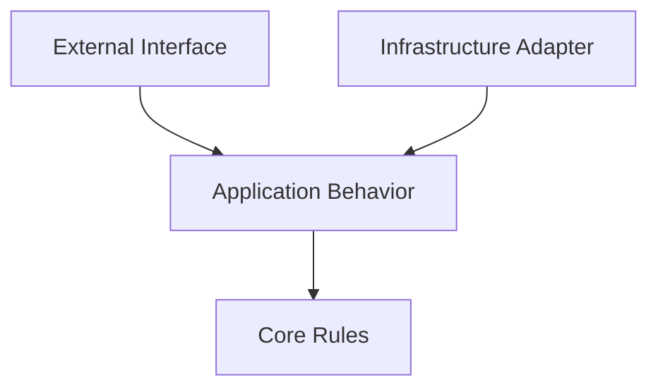
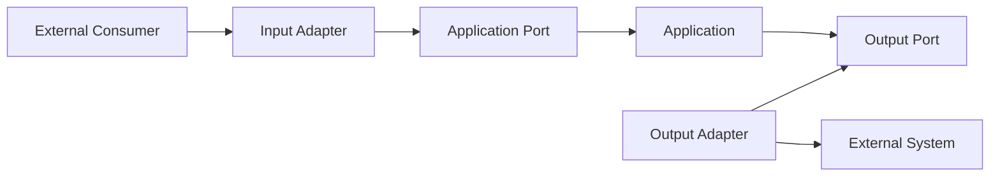
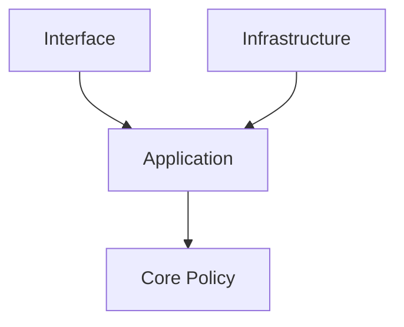
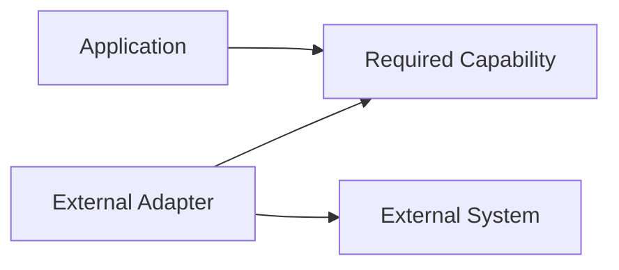

# Clean Architecture Skill

## Purpose

This skill defines generic principles and best practices for structuring software so that important business and system behavior remains understandable, testable, maintainable, and independent from unnecessary implementation details.

The objective is not to enforce a specific folder structure or architecture template.

The objective is to establish clear:

- Responsibilities
- Boundaries
- Dependencies
- Abstractions
- Ownership
- Separation of concerns

This skill is:

- Domain-neutral
- Language-neutral
- Framework-neutral
- Vendor-neutral
- Cloud-neutral
- Platform-neutral
- Application-neutral
- Industry-neutral

Apply these principles according to system complexity and existing architecture.

---

# Objectives

Good software structure should help:

- Separate responsibilities.
- Protect important business rules.
- Reduce unnecessary coupling.
- Increase cohesion.
- Make dependencies explicit.
- Isolate implementation details.
- Improve testability.
- Support independent evolution.
- Make changes easier to understand.
- Reduce the blast radius of changes.
- Avoid unnecessary architectural complexity.

---

# Fundamental Principle

## Dependencies Should Point Toward Stable Policy

Important system behavior should not unnecessarily depend on volatile implementation details.

Conceptually:

```text
External Technology
        ↓
Infrastructure
        ↓
Application Behavior
        ↓
Core Rules
```

The more fundamental a rule is to the system, the less it should depend on implementation-specific concerns.

For example, important logic should not exist only because:

- A particular database is used.
- A specific UI framework exists.
- A particular messaging product is selected.
- A cloud provider exposes a certain SDK.

Technology should support system behavior rather than define it unnecessarily.

---

# Clean Architecture Is a Principle, Not a Folder Structure

Do not assume Clean Architecture requires:

```text
/domain
/application
/infrastructure
/presentation
```

Those folders may be appropriate in some systems, but the principle is more important than the naming.

Clean Architecture is primarily about:

```text
Responsibilities
      +
Boundaries
      +
Dependency Direction
```

A repository can use different physical structures while still following clean architectural principles.

---

# Start With Existing Architecture

Before restructuring or adding code:

1. Inspect the repository.
2. Identify existing architectural boundaries.
3. Identify module responsibilities.
4. Identify dependency direction.
5. Identify existing conventions.
6. Identify architecture documentation.
7. Identify relevant architecture decisions.

Do not impose a new architecture style simply because another style is familiar.

---

# Separation of Concerns

Different concerns should be separated where doing so improves clarity and maintainability.

Typical concerns may include:

```text
Business Rules

Application Workflows

User / External Interfaces

Data Access

External Integrations

Infrastructure

Configuration

Security

Observability
```

These are conceptual responsibilities.

They do not automatically require separate projects, packages, services, or repositories.

---

# Cohesion

Related behavior should remain together.

A component should have a clear reason to exist.

Prefer:

```text
Component
    ↓
Closely Related Responsibilities
```

over:

```text
Component
 ├── Business Rules
 ├── Data Access
 ├── Formatting
 ├── External Integration
 ├── Configuration
 └── Unrelated Utilities
```

High cohesion generally improves maintainability.

---

# Coupling

Components should depend only on what they need.

Unnecessary coupling creates change propagation.

Conceptually:

```text
Change A
   ↓
Component B Changes
   ↓
Component C Changes
   ↓
Component D Changes
```

The goal is not zero coupling.

Software components must collaborate.

The goal is:

> Necessary, explicit, controlled coupling.

---

# Stable Dependencies

Dependencies should generally point toward components that are more stable or policy-oriented.

Conceptually:

```text
Volatile Implementation
        ↓
Stable Abstraction
        ↓
Core Policy
```

Avoid making stable business logic directly dependent on volatile infrastructure details when an appropriate boundary can isolate them.

---

# Dependency Direction

Dependency direction should reflect architectural responsibility.

A common conceptual model is:

```text
External Interfaces
        ↓
Application Logic
        ↓
Core Rules
```

Infrastructure should integrate with these boundaries rather than force core rules to depend on infrastructure.

---

# Dependency Inversion

High-level policy should avoid unnecessary dependence on low-level implementation details.

Instead of:

```text
Business Logic
      ↓
Specific Database Client
```

consider:

```text
Business Logic
      ↓
Required Capability
      ↑
Database Implementation
```

The business logic defines what it requires.

The implementation provides that capability.

---

# Do Not Abstract Everything

Dependency inversion does not mean every class requires an interface.

Create abstraction when it provides meaningful value, such as:

- Isolating external systems
- Supporting architectural boundaries
- Supporting multiple implementations
- Improving testability of important behavior
- Protecting stable policy from volatile details

Avoid meaningless one-to-one abstractions that add indirection without architectural benefit.

---

# Policy vs. Detail

A useful distinction is:

## Policy

Defines what the system should do.

Examples:

- Business rules
- Validation rules
- Workflow decisions
- Domain behavior

## Detail

Defines how technical work is performed.

Examples:

- Storage technology
- Network communication
- Framework
- Serialization
- File system
- External provider

Where practical:

```text
Policy
   ↓
Defines Requirement

Detail
   ↓
Implements Requirement
```

---

# Business Logic

Important business rules should have clear ownership.

Avoid scattering the same rule across:

- User interfaces
- API handlers
- Database queries
- Integration adapters
- Background jobs

A business rule should have an identifiable authoritative implementation.

---

# Application Logic

Application logic coordinates system behavior.

It may:

- Receive a request.
- Validate workflow requirements.
- Coordinate domain behavior.
- Call dependencies.
- Persist results.
- Produce outcomes.

Application logic should not become a dumping ground for unrelated technical behavior.

---

# Use Cases

A useful way to structure application behavior is around meaningful operations or use cases.

Conceptually:

```text
Input
  ↓
Use Case
  ↓
Business Rules
  ↓
Dependencies
  ↓
Result
```

Examples conceptually include:

```text
Create Something

Update Something

Approve Something

Process Something

Retrieve Something
```

The exact terminology depends on the system.

---

# Use Case Responsibility

A use case should represent a meaningful system operation.

It may coordinate:

- Validation
- Authorization decisions
- Business rules
- Persistence
- External interactions

Avoid use cases that simply mirror low-level CRUD operations without meaningful behavior unless CRUD genuinely represents the requirement.

---

# Domain Logic

Where a system contains significant domain rules, those rules should remain independent from unnecessary technical concerns.

Prefer:

```text
Domain Rule
   ↓
Business Concepts
```

rather than:

```text
Domain Rule
   ↓
Database API
   ↓
Web Framework
   ↓
Cloud SDK
```

---

# Domain Model

A domain model may represent:

- Business concepts
- State
- Rules
- Invariants
- Relationships
- Behavior

Not every system requires a rich domain model.

Simple systems may use simpler models.

Architecture complexity should match domain complexity.

---

# Anemic Models

A data-only model is not automatically wrong.

For simple systems:

```text
Data
+
Application Logic
```

may be perfectly appropriate.

For complex domains, scattering domain behavior outside the domain model may become difficult to maintain.

Choose according to actual complexity.

---

# Entities

Where applicable, an entity represents something whose identity matters over time.

An entity may contain:

- Identity
- State
- Behavior
- Invariants

Do not turn every database table into a domain entity automatically.

Database structure and domain structure serve different purposes.

---

# Value Objects

Where useful, values can represent concepts by their meaning rather than identity.

Conceptually:

```text
Value
+
Validation
+
Behavior
```

This may improve correctness for concepts with meaningful constraints.

Do not introduce value objects for every primitive without benefit.

---

# Invariants

Important rules that must always remain true should be protected near the behavior responsible for maintaining them.

Avoid relying solely on:

```text
"Every caller must remember to validate this."
```

when the rule can be enforced by design.

---

# Boundary Design

A boundary separates responsibilities.

Examples include boundaries between:

```text
Application ↔ Database

Application ↔ External Service

Core Logic ↔ Framework

System ↔ User Interface

Service ↔ Service
```

Boundaries should have clear contracts.

---

# Boundary Contracts

A boundary contract should define:

- Required inputs
- Expected outputs
- Failure behavior
- Relevant semantics

Contracts should expose what consumers need without exposing unnecessary implementation details.

---

# Ports and Adapters Concept

A useful conceptual model is:

```text
             External Consumer
                    ↓
                Adapter
                    ↓
                   Port
                    ↓
              Application
                    ↓
                   Port
                    ↓
                Adapter
                    ↓
              External System
```

A **port** represents a capability required or exposed by the application.

An **adapter** connects a specific technology to that capability.

These terms are conceptual and do not require a specific framework.

---

# Input Adapters

Input adapters translate external interactions into forms understood by the application.

Possible examples include:

- API handlers
- User-interface controllers
- Command handlers
- Message consumers
- Scheduled triggers

Input adapters should avoid owning core business rules.

---

# Output Adapters

Output adapters implement interactions with external capabilities.

Possible examples include:

- Data stores
- External APIs
- Message systems
- File systems
- Notification providers

Core application behavior should not unnecessarily depend on their implementation details.

---

# Controllers and Entry Points

Entry points should primarily:

1. Receive input.
2. Translate input.
3. Invoke appropriate application behavior.
4. Translate the result.
5. Return or publish the response.

Avoid placing significant business logic directly in controllers or equivalent entry points.

---

# Data Access

Data access is an implementation concern.

Business logic should not unnecessarily know:

- Query syntax
- Connection details
- Storage SDKs
- Table names
- Storage-specific behavior

However, do not create unnecessary abstraction if direct data access is appropriate for a simple component with no meaningful business layer.

---

# Repository Pattern

A repository abstraction may be useful when domain or application logic needs persistence without depending on storage details.

Conceptually:

```text
Application
    ↓
Persistence Capability
    ↑
Storage Adapter
```

Do not introduce repositories mechanically.

They are useful only when they create a meaningful architectural boundary.

---

# External Services

External systems should be treated as architectural dependencies.

Avoid allowing external provider models and SDK types to spread throughout core logic.

Prefer translating external representations at the integration boundary where practical.

---

# Anti-Corruption Boundary

When integrating with a model that differs significantly from internal concepts, a translation boundary can prevent external semantics from contaminating the internal model.

Conceptually:

```text
External Model
      ↓
Translation
      ↓
Internal Model
```

Use this where external complexity or semantics justify it.

---

# Framework Independence

Frameworks are implementation tools.

Core business behavior should not become unnecessarily inseparable from a framework.

Avoid allowing framework-specific concerns to dominate:

- Business rules
- Domain models
- Application policies

Some framework coupling is normal and acceptable.

The goal is to control it.

---

# Database Independence

Database independence does not mean systems must be capable of switching databases at any moment.

The goal is to avoid unnecessary coupling.

Do not build elaborate abstraction layers solely because the database might theoretically change someday.

Create isolation where:

- Business logic would otherwise become storage-specific.
- Multiple storage implementations are required.
- Testing benefits materially.
- Architecture requires separation.

---

# User Interface Independence

Important business behavior should not exist only inside a particular UI.

Conceptually:

```text
Web UI ─┐
        │
API ────┼──→ Application Behavior
        │
Automation ─┘
```

Different interaction channels should be able to reuse appropriate system behavior.

---

# Infrastructure Independence

Core policy should not unnecessarily depend on:

- Deployment platform
- Cloud SDK
- Container runtime
- Operating system
- Infrastructure orchestration technology

Infrastructure-specific behavior should remain near infrastructure boundaries.

---

# Serialization

Serialization formats are boundary concerns.

Avoid allowing serialization-specific annotations or structures to dominate core models unless the coupling is deliberate and acceptable.

---

# Mapping

Different architectural boundaries may require different representations.

Conceptually:

```text
External Request
      ↓
Application Input
      ↓
Domain Concept
      ↓
Persistence Representation
```

Do not create mappings between every layer mechanically.

Mapping should exist when representations genuinely differ.

---

# DTOs

Data Transfer Objects can provide boundary-specific representations.

They may be useful for:

- External requests
- External responses
- Integration messages
- Boundary isolation

Do not create DTOs merely because every layer is expected to have a duplicate class.

---

# Shared Models

Sharing the same model across many boundaries can reduce mapping but increase coupling.

Evaluate:

```text
Reduced Mapping
      vs.
Boundary Coupling
```

Choose based on the likelihood that the models need to evolve independently.

---

# Dependency Injection

Dependency injection can make dependencies explicit and support inversion of control.

However:

> Dependency Injection is not Clean Architecture.

A system can use dependency injection while still having poor boundaries.

Use dependency injection as a mechanism, not as the architecture itself.

---

# Composition Root

Where dependency injection is used, object composition should ideally occur in a controlled location.

Conceptually:

```text
Application Components
        +
Infrastructure Implementations
        ↓
Composition
        ↓
Running System
```

Core components should not need to locate their own dependencies dynamically.

---

# Service Locator

Avoid hidden dependency retrieval where it makes dependencies unclear.

Prefer:

```text
Component(dependency)
```

over conceptually:

```text
Component
   ↓
Global Locator
   ↓
Find Dependency
```

Explicit dependencies improve understanding and testing.

---

# Circular Dependencies

Avoid circular dependencies between architectural components.

Example:

```text
Module A → Module B
   ↑         ↓
   └─────────┘
```

Circular dependencies often indicate unclear responsibilities.

Resolve them by examining:

- Ownership
- Boundary direction
- Shared concepts
- Missing abstractions

---

# Shared Code

Shared code should represent genuinely shared concepts.

Avoid creating large generic shared modules containing unrelated utilities.

A shared component can become a coupling hub.

Before sharing code ask:

- Is the concept genuinely common?
- Does it have the same meaning?
- Will consumers evolve together?
- Does sharing reduce or increase coupling?

---

# Utility Classes

Avoid turning `utils`, `helpers`, or similar areas into collections of unrelated functionality.

Prefer placing behavior near the concept it supports.

Generic utility code should have clear responsibility.

---

# Cross-Cutting Concerns

Cross-cutting concerns may include:

- Logging
- Security
- Transactions
- Validation
- Metrics
- Error translation

Handle them consistently without allowing them to dominate core business behavior.

---

# Validation Boundaries

Different validation may belong at different boundaries.

### Structural Validation

Is the input well formed?

### Application Validation

Is the operation allowed in the current workflow?

### Domain Validation

Would this violate a business invariant?

Avoid placing every type of validation in a single generic validation layer.

---

# Authorization Boundaries

Authorization should occur before protected operations are performed.

Business-level authorization rules may need application or domain context.

Do not rely solely on presentation-layer visibility.

Refer to `secure-coding.md`.

---

# Transaction Boundaries

Transactions should align with meaningful consistency boundaries.

Avoid creating transactions that span unrelated operations unnecessarily.

For distributed operations, do not assume a traditional transaction can safely span every system.

Refer to architecture skills for distributed-system behavior.

---

# Events

Events may help communicate meaningful state changes without direct coupling.

Conceptually:

```text
Capability A
    ↓
Meaningful Event
    ↓
Interested Capability
```

Do not introduce events simply to avoid all direct method calls.

Use the simplest interaction appropriate to the boundary.

---

# Domain Events

Where meaningful, a domain event represents something significant that occurred within the domain.

Examples conceptually:

```text
SomethingCreated

SomethingApproved

SomethingCompleted
```

Events should represent meaningful facts rather than low-level implementation steps.

---

# Application Events

Application-level events may communicate workflow or integration outcomes.

Keep internal domain events and external integration contracts separate where their evolution requirements differ.

---

# Error Boundaries

Errors should be translated appropriately across architectural boundaries.

An infrastructure-specific failure should not necessarily leak directly through every layer.

Conceptually:

```text
Infrastructure Failure
        ↓
Application Meaning
        ↓
External Error Contract
```

Preserve enough information for diagnosis while maintaining abstraction.

Refer to `error-handling.md`.

---

# Configuration Boundaries

Configuration should enter the system through controlled mechanisms.

Core logic should not repeatedly read environment variables, configuration files, or remote configuration systems directly.

Prefer:

```text
Configuration Source
        ↓
Validated Configuration
        ↓
Components
```

Refer to `configuration-management.md`.

---

# Observability Boundaries

Core behavior should provide enough context for observability without becoming tightly coupled to a specific telemetry platform.

Instrumentation should respect architectural boundaries.

---

# Testing Architecture

Architecture should support appropriate testing without requiring every test to depend on the complete runtime environment.

Useful separation may enable:

```text
Core Logic Tests

Application Behavior Tests

Adapter Tests

Integration Tests

End-to-End Tests
```

Refer to `testing-strategy.md`.

---

# Test Doubles

Test doubles may replace external dependencies during focused testing.

Examples include:

- Stubs
- Fakes
- Mocks

Do not mock every internal class.

Excessive mocking often indicates tests are coupled to implementation details rather than behavior.

---

# Architecture Enforcement

Architectural boundaries should be enforceable where practical.

Possible approaches include:

- Module visibility
- Package boundaries
- Build dependencies
- Static analysis
- Architecture tests
- Code review

Documentation alone may not prevent architectural erosion.

---

# Architecture Erosion

Architecture erosion occurs when repeated shortcuts gradually violate intended boundaries.

Example:

```text
Initial Architecture

UI
 ↓
Application
 ↓
Domain
```

Over time:

```text
UI ─────────→ Database

Domain ─────→ Framework

Application → Random Utilities

Everything ↔ Everything
```

Small boundary violations accumulate.

Development agents should avoid introducing them.

---

# Incremental Improvement

Do not attempt to rewrite an entire existing system solely to achieve architectural purity.

Prefer:

```text
Understand Existing Design
        ↓
Identify Problem
        ↓
Improve Relevant Boundary
        ↓
Preserve Behavior
```

Architecture improvement should be proportional to the requested change and risk.

---

# Modular Monoliths

Clean boundaries do not require microservices.

A single deployable system can contain strong internal module boundaries.

Conceptually:

```text
Application
│
├── Module A
├── Module B
├── Module C
└── Shared Infrastructure
```

Deployment topology and code boundaries are separate decisions.

---

# Microservices

Microservices do not automatically provide clean architecture.

A poorly designed distributed system may simply turn internal coupling into network coupling.

Service boundaries should reflect meaningful:

- Ownership
- Capabilities
- Data boundaries
- Independent evolution requirements

Do not create services merely to satisfy Clean Architecture terminology.

---

# Layered Architecture

Layered architecture can support separation of concerns.

Example:

```text
Presentation
     ↓
Application
     ↓
Domain
     ↓
Infrastructure
```

However, layers should not become pass-through structures with no meaningful responsibility.

Architecture should reflect actual needs.

---

# Vertical Slices

Some systems organize behavior by capability or use case rather than horizontal technical layers.

Conceptually:

```text
Capability A
 ├── Input
 ├── Behavior
 └── Data

Capability B
 ├── Input
 ├── Behavior
 └── Data
```

This can improve cohesion.

Clean Architecture principles can be applied within vertical slices.

---

# Layered vs. Vertical Organization

Neither is universally correct.

Choose based on:

- System size
- Domain complexity
- Team structure
- Change patterns
- Coupling
- Existing architecture

Hybrid structures are often appropriate.

---

# Architecture Complexity

Architecture should be proportional to system complexity.

For a simple system:

```text
Interface
   ↓
Logic
   ↓
Data
```

may be sufficient.

For complex systems:

```text
Interfaces
    ↓
Application Boundaries
    ↓
Domain Capabilities
    ↓
Infrastructure Adapters
```

may provide greater value.

Do not impose enterprise-scale layering on trivial software.

---

# Dependency Rules

When architectural layers or modules exist, define allowed dependencies.

Example conceptually:

```text
Interface
   ↓
Application
   ↓
Domain

Infrastructure
   ↑
implements required boundaries
```

Avoid arbitrary cross-layer dependencies.

---

# Public vs. Internal Components

Expose only what consumers require.

Internal implementation details should remain internal where the language or module system supports it.

Smaller public surfaces reduce coupling.

---

# Change Locality

Good architecture should allow many changes to remain localized.

Example:

```text
Change Database
     ↓
Primarily Data Adapter Changes
```

rather than:

```text
Change Database
     ↓
Controllers Change
Business Rules Change
UI Changes
Integration Changes
```

Perfect isolation is rarely possible, but unnecessary propagation should be minimized.

---

# Replaceability

Replaceability is useful when a dependency is genuinely volatile.

Do not build every component so it can theoretically be replaced.

Ask:

> Is this dependency likely enough to change, or important enough to isolate, that a boundary provides real value?

---

# Evolution

Architecture should allow important capabilities to evolve without requiring unrelated parts of the system to change.

Prefer boundaries aligned with:

- Business capabilities
- Ownership
- Change frequency
- Data responsibility

---

# Development Agent Workflow

When implementing a feature, the Development Agent should follow:

## 1. Understand

Identify:

- Requirement
- Expected behavior
- Acceptance criteria
- Relevant architecture documentation

## 2. Inspect

Examine:

- Existing modules
- Dependency direction
- Similar implementations
- Existing abstractions
- Testing conventions

## 3. Identify Boundary

Determine which architectural capability owns the change.

Do not place code based solely on convenience.

## 4. Design

Determine:

- Core behavior
- Required dependencies
- External interactions
- Data changes
- Error behavior

## 5. Implement

Make the smallest coherent change while preserving boundaries.

## 6. Validate

Verify:

- Dependency direction
- Tests
- Existing behavior
- Error handling
- Security
- Architecture alignment

## 7. Report

Summarize:

- What changed
- Which components changed
- Architectural decisions made
- Important trade-offs
- Validation performed

---

# AI Development Agent Rules

When using this skill, an AI development agent must:

- Inspect existing architecture before modifying code.
- Preserve existing reasonable architectural conventions.
- Respect documented architecture decisions.
- Keep business rules out of infrastructure code where practical.
- Keep infrastructure details from spreading into core policy unnecessarily.
- Keep entry points thin where meaningful business logic exists.
- Make dependencies explicit.
- Avoid circular dependencies.
- Avoid unnecessary shared utilities.
- Avoid speculative abstractions.
- Avoid creating interfaces mechanically.
- Avoid adding architectural layers without purpose.
- Avoid introducing new frameworks solely to implement a pattern.
- Avoid rewriting working architecture without justification.
- Prefer incremental improvement.
- Validate architecture after implementation.

---

# Mermaid Diagram Guidance

Use Mermaid diagrams when architecture relationships need explanation.

## Dependency Direction



## Ports and Adapters



## Clean Boundary



## External Integration



Diagrams should describe meaningful boundaries and dependency direction rather than prescribe folder structures.

---

# Best Practices

- Start from existing architecture.
- Separate responsibilities deliberately.
- Keep related behavior cohesive.
- Minimize unnecessary coupling.
- Make dependencies explicit.
- Protect stable policy from volatile details.
- Use dependency inversion where it provides value.
- Keep business rules clearly owned.
- Keep entry points focused.
- Treat infrastructure as implementation detail where appropriate.
- Isolate external integrations.
- Define meaningful boundary contracts.
- Use mapping where representations genuinely differ.
- Avoid leaking external models throughout the system.
- Keep public interfaces small.
- Avoid circular dependencies.
- Avoid generic utility dumping grounds.
- Align transaction boundaries with consistency requirements.
- Translate errors across boundaries appropriately.
- Support architecture through testing.
- Enforce important boundaries where practical.
- Improve architecture incrementally.
- Keep architecture proportional to complexity.
- Prefer meaningful capability boundaries.
- Optimize for change locality.
- Avoid architectural purity for its own sake.

---

# Common Mistakes

Avoid:

- Treating Clean Architecture as a required folder structure.
- Creating layers with no meaningful responsibility.
- Creating interfaces for every class.
- Creating repositories for every data operation.
- Duplicating every model between every layer.
- Mapping objects without architectural need.
- Putting business logic in controllers.
- Putting business rules inside persistence code.
- Allowing database models to define the entire domain.
- Allowing framework types to spread unnecessarily through core logic.
- Allowing external provider models to become internal domain models.
- Using dependency injection and assuming the architecture is clean.
- Using service locators that hide dependencies.
- Creating circular module dependencies.
- Creating massive shared utility libraries.
- Splitting simple systems into excessive layers.
- Creating microservices merely for separation.
- Adding abstraction for hypothetical future replacements.
- Rewriting existing systems to achieve theoretical purity.
- Ignoring existing architecture decisions.
- Violating boundaries for short-term convenience.
- Mixing unrelated responsibilities.
- Making every component globally reusable.
- Creating architectural complexity without measurable value.

---

# Validation Checklist

Before considering implementation architecturally sound, verify:

- [ ] Existing architecture was inspected.
- [ ] Relevant architecture documentation was reviewed.
- [ ] The owning capability or module is clear.
- [ ] Responsibilities remain cohesive.
- [ ] Separation of concerns is appropriate.
- [ ] Dependency direction is intentional.
- [ ] Core policy does not unnecessarily depend on implementation details.
- [ ] Business rules have clear ownership.
- [ ] Entry points do not contain unnecessary business logic.
- [ ] External integrations are appropriately isolated.
- [ ] Data-access concerns are appropriately isolated.
- [ ] Boundary contracts are clear.
- [ ] External models do not leak unnecessarily into core logic.
- [ ] Mapping exists only where useful.
- [ ] Abstractions have meaningful purpose.
- [ ] Interfaces were not created mechanically.
- [ ] Circular dependencies were avoided.
- [ ] Shared code represents genuinely shared concepts.
- [ ] Global service location was avoided.
- [ ] Cross-cutting concerns do not dominate core logic.
- [ ] Error translation respects boundaries.
- [ ] Configuration access respects boundaries.
- [ ] Security controls remain appropriately positioned.
- [ ] Transaction boundaries are appropriate.
- [ ] Testing can validate important behavior.
- [ ] Public surfaces remain appropriately small.
- [ ] Change impact is reasonably localized.
- [ ] Architecture complexity is proportional to system complexity.
- [ ] Existing reasonable architecture conventions were preserved.
- [ ] No unnecessary architectural layer was introduced.
- [ ] No unnecessary framework or dependency was introduced.
- [ ] Architecture decisions remain understandable to another engineer.

---

# Relationship With Other Engineering Skills

`clean-architecture.md` defines structural engineering principles.

Use it together with:

### `coding-standards.md`

Defines baseline coding behavior, consistency, readability, dependencies, and implementation standards.

### `clean-code.md`

Defines code-level readability, naming, functions, expressions, and complexity.

### `code-quality.md`

Defines measurable maintainability, complexity, duplication, static analysis, and quality controls.

### `error-handling.md`

Defines how failures should cross architectural boundaries.

### `testing-strategy.md`

Defines testing across domain, application, integration, and system boundaries.

### `dependency-management.md`

Defines governance for external software dependencies.

### `configuration-management.md`

Defines how configuration should enter and flow through the system.

### `secure-coding.md`

Defines implementation-level security practices and trust-boundary protection.

### `performance-engineering.md`

Defines performance decisions without violating architectural boundaries unnecessarily.

### `concurrency.md`

Defines safe execution across concurrent and asynchronous boundaries.

### `code-review.md`

Defines how architectural integrity should be reviewed during engineering changes.

Clean Architecture also depends on the Architecture knowledge layer, particularly:

```text
architecture-principles.md

architecture-patterns.md

system-design.md

distributed-systems.md

integration-patterns.md

api-principles.md

data-architecture.md

security-architecture.md

observability.md

resilience.md
```

Conceptually:

```text
                 Architecture Design
                         │
                         ↓
               Architectural Boundaries
                         │
                         ↓
                 Clean Architecture
                         │
       ┌─────────────────┼─────────────────┐
       ↓                 ↓                 ↓
   Core Policy     Application Logic   Interfaces
       │                 │                 │
       └─────────────────┼─────────────────┘
                         ↓
                Infrastructure Details
                         │
                         ↓
                    Implementation
```

---

# References

Clean architecture practices may draw, where applicable, from recognized software engineering concepts such as:

- Separation of Concerns
- Dependency Inversion Principle
- SOLID principles
- Information Hiding
- Encapsulation
- Ports and Adapters
- Hexagonal Architecture
- Onion Architecture
- Clean Architecture
- Domain-Driven Design
- Modular Architecture
- Layered Architecture
- Vertical Slice Architecture
- Interface Segregation
- High Cohesion
- Low Coupling
- Relevant organizational architecture standards

These concepts should be treated as reusable engineering guidance rather than mandatory architecture templates.

The appropriate software structure should ultimately be determined by system complexity, business rules, change patterns, architecture, team ownership, testability requirements, maintainability, existing repository conventions, operational requirements, and cost of complexity.
