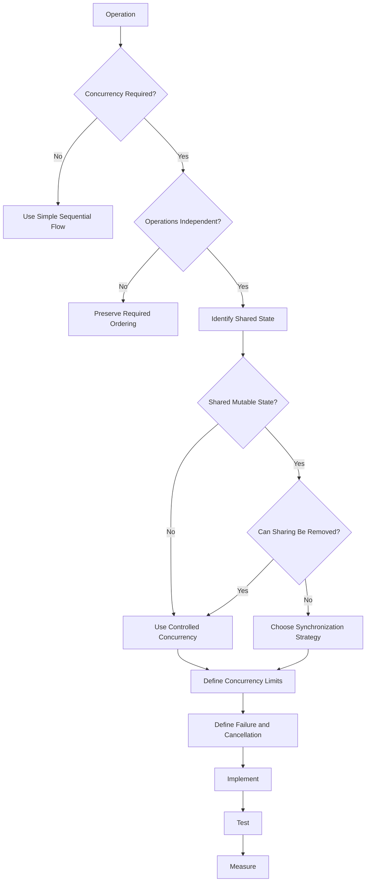
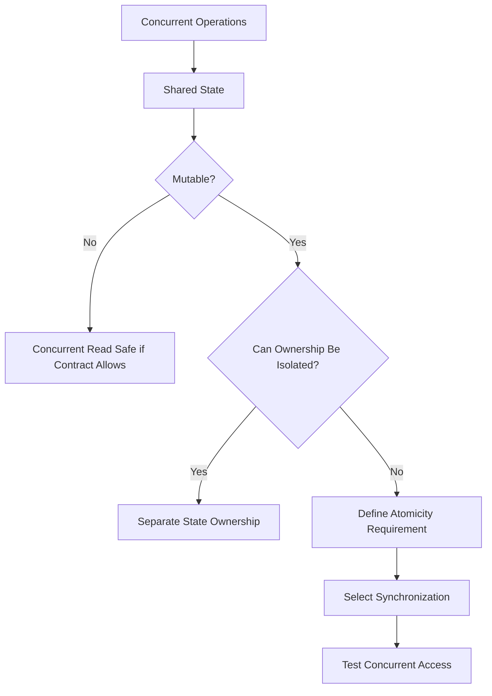
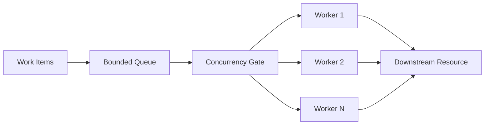
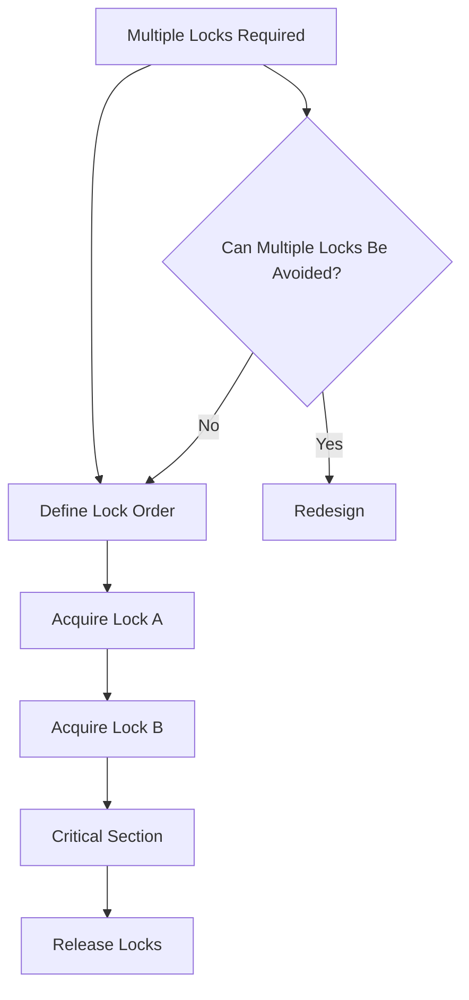
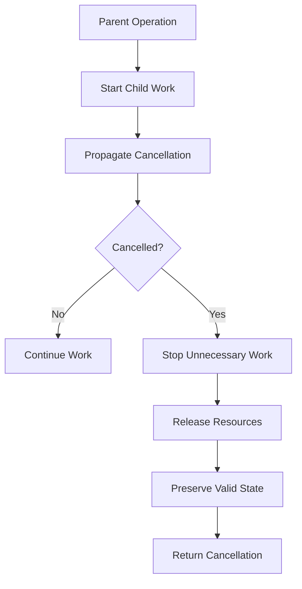
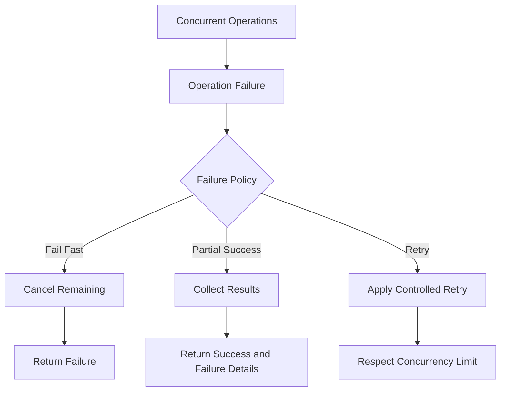
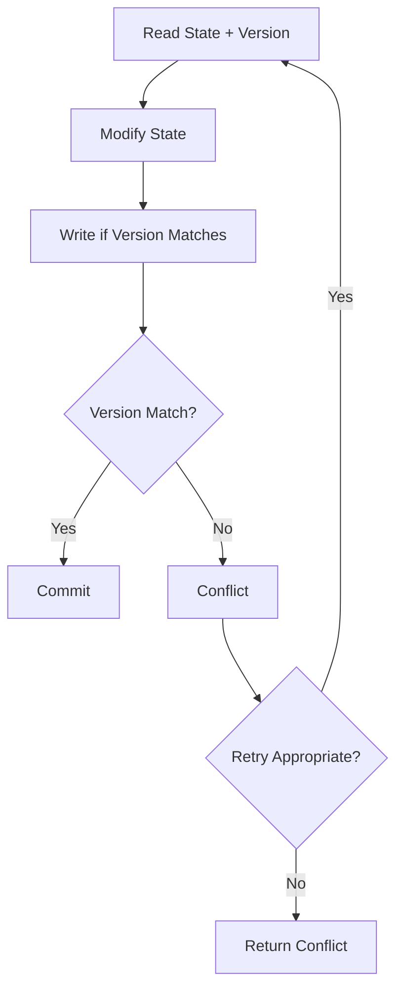

# Concurrency Skill

## Purpose

This skill defines generic engineering principles and best practices for designing, implementing, reviewing, and testing concurrent software.

Concurrency allows multiple operations to make progress during overlapping periods of time.

It can improve:

- Responsiveness
- Throughput
- Resource utilization
- Scalability

However, concurrency also introduces risks such as:

- Race conditions
- Deadlocks
- Data corruption
- Resource exhaustion
- Ordering problems
- Difficult debugging
- Non-deterministic failures

Concurrency should therefore be introduced deliberately rather than automatically.

This skill is:

- Domain-neutral
- Language-neutral
- Framework-neutral
- Runtime-neutral
- Vendor-neutral
- Cloud-neutral
- Platform-neutral
- Application-neutral
- Industry-neutral

---

# Objectives

Good concurrency design should help:

- Preserve correctness under concurrent execution.
- Avoid unnecessary shared mutable state.
- Prevent race conditions.
- Prevent deadlocks.
- Maintain predictable state transitions.
- Bound parallel execution.
- Protect limited resources.
- Support cancellation.
- Handle concurrent failures correctly.
- Prevent resource leaks.
- Maintain observability.
- Make concurrent behavior testable.
- Avoid unnecessary concurrency complexity.

---

# Fundamental Principle

## Correctness Before Concurrency

Concurrency should never be introduced merely because operations can technically run at the same time.

Prefer:

```text
Correct Sequential Implementation
          ↓
Identify Concurrency Requirement
          ↓
Analyze Independence
          ↓
Introduce Controlled Concurrency
          ↓
Validate Correctness
          ↓
Measure Benefit
```

over:

```text
Parallelize Everything
        ↓
Unexpected Behavior
        ↓
Race Conditions
        ↓
Complex Synchronization
```

---

# Concurrency vs Parallelism

Concurrency and parallelism are related but different concepts.

## Concurrency

Multiple operations can make progress during overlapping time periods.

## Parallelism

Multiple operations physically execute simultaneously.

Conceptually:

```text
Concurrency
    ↓
Overlapping Work

Parallelism
    ↓
Simultaneous Work
```

An implementation may be concurrent without being parallel.

---

# Asynchronous Execution

Asynchronous execution allows work to continue without blocking while waiting for operations such as:

```text
Network I/O

Storage I/O

Database I/O

External Services

Message Processing
```

Asynchronous execution does not automatically mean parallel execution.

---

# Determine Whether Concurrency Is Needed

Before introducing concurrency ask:

1. What problem does concurrency solve?
2. Are operations independent?
3. Is the workload I/O-bound or CPU-bound?
4. Is ordering important?
5. Is shared state involved?
6. Are downstream systems capable of handling parallel requests?
7. What concurrency limit is appropriate?
8. What happens when one operation fails?
9. How is cancellation handled?
10. Can the benefit be measured?

Do not introduce concurrency without a clear reason.

---

# Concurrency Requirements

Possible reasons for concurrency include:

```text
Improve Responsiveness

Increase Throughput

Hide I/O Waiting

Process Independent Work

Utilize Multiple Processing Resources
```

Each reason may require a different implementation strategy.

---

# Shared Mutable State

Shared mutable state is one of the primary sources of concurrency bugs.

Conceptually:

```text
Operation A ──┐
              ↓
         Shared State
              ↑
Operation B ──┘
```

If both operations can modify the same state, synchronization or redesign may be required.

---

# Prefer Immutable Data

Immutable data reduces synchronization requirements.

Prefer:

```text
Concurrent Readers
        ↓
Immutable Data
```

where appropriate.

Immutable data can simplify reasoning because its state does not change after creation.

---

# Minimize Shared State

Prefer independent state where practical.

Conceptually:

```text
Worker A → State A

Worker B → State B

Worker C → State C
```

over:

```text
Worker A ─┐
Worker B ─┼→ Shared Mutable State
Worker C ─┘
```

when sharing is unnecessary.

---

# Ownership

Where possible, establish clear ownership of mutable state.

Conceptually:

```text
Component
    ↓
Owns State
    ↓
Controls Mutation
```

Other components interact through defined operations rather than modifying state directly.

---

# Race Conditions

A race condition occurs when correctness depends on unpredictable execution timing.

Example:

```text
Operation A reads value = 10

Operation B reads value = 10

Operation A writes value = 11

Operation B writes value = 11
```

Expected result may have been:

```text
12
```

but actual result becomes:

```text
11
```

---

# Detect Read-Modify-Write Patterns

Operations such as:

```text
Read
 ↓
Calculate
 ↓
Write
```

may be unsafe when multiple operations can execute concurrently.

Determine whether atomicity is required.

---

# Atomicity

An operation is atomic when other concurrent operations cannot observe or interfere with an intermediate state.

Conceptually:

```text
Before
   ↓
Atomic Operation
   ↓
After
```

without externally observable partial state.

---

# Atomic Operations

Where platforms provide atomic operations for simple state transitions, prefer them over complex locking where appropriate.

Do not assume a compound sequence is atomic merely because individual operations are atomic.

---

# Compound Operations

This:

```text
if value exists
    update value
```

may require synchronization even when both the lookup and update operations are individually thread-safe.

Reason about the entire logical operation.

---

# Thread-Safe Collections

Thread-safe data structures can protect individual operations.

They do not automatically make multi-step business operations safe.

For example:

```text
Check
 ↓
Decide
 ↓
Update
```

may still require coordination.

---

# Synchronization

Synchronization coordinates access to shared state.

Possible mechanisms conceptually include:

```text
Locks

Mutexes

Semaphores

Atomic Operations

Message Passing

Transactional Coordination
```

Use the simplest mechanism that correctly protects the required invariant.

---

# Locks

Locks may protect shared mutable state.

Conceptually:

```text
Acquire Lock
     ↓
Critical Section
     ↓
Release Lock
```

Keep critical sections small.

---

# Lock Scope

A lock should protect only the state that requires synchronization.

Avoid unnecessarily broad lock scope.

Prefer:

```text
Acquire
  ↓
Minimal State Change
  ↓
Release
```

over:

```text
Acquire
  ↓
Large Processing Operation
  ↓
External Network Call
  ↓
Database Call
  ↓
Release
```

when external operations do not need protection.

---

# Lock Duration

Long lock duration can reduce concurrency and increase contention.

Avoid holding locks while performing slow operations unless correctness explicitly requires it.

---

# Lock Ownership

Lock ownership should be clear.

Avoid exposing synchronization objects unnecessarily outside the component that owns the protected state.

---

# Nested Locks

Acquiring multiple locks increases deadlock risk.

If multiple locks are necessary, define and consistently follow an acquisition order.

---

# Deadlocks

A deadlock occurs when operations wait indefinitely for resources held by each other.

Conceptually:

```text
Operation A
holds Lock 1
waits for Lock 2

Operation B
holds Lock 2
waits for Lock 1
```

Neither can proceed.

---

# Deadlock Prevention

Strategies may include:

- Consistent lock ordering
- Reduced lock scope
- Avoiding nested locks
- Avoiding blocking calls while holding locks
- Time-bounded acquisition where appropriate
- Redesigning shared state

Prefer eliminating unnecessary lock relationships.

---

# Lock Ordering

If multiple locks must be acquired, use a consistent global ordering.

For example:

```text
Always:

Lock A
  ↓
Lock B
  ↓
Lock C
```

Never acquire them in inconsistent order without strong justification.

---

# Livelock

A livelock occurs when operations continue changing state in response to each other but make no useful progress.

Retry or conflict-resolution mechanisms should avoid endless mutual reaction.

---

# Starvation

Starvation occurs when an operation repeatedly fails to obtain required execution time or resources.

Consider fairness where workloads require it.

---

# Contention

Contention occurs when multiple operations compete for the same resource.

Potential contention points include:

```text
Locks

Database Rows

Connections

Files

Queues

Shared Caches

CPU
```

Measure contention before redesigning synchronization.

---

# Lock-Free Design

Lock-free or wait-free techniques can reduce contention in specialized scenarios.

They also increase implementation complexity.

Do not introduce complex lock-free algorithms unless:

- Performance need is demonstrated.
- Correctness can be proven or strongly validated.
- Simpler mechanisms are insufficient.

---

# Message Passing

Message passing can reduce shared mutable state.

Conceptually:

```text
Producer
   ↓
Message
   ↓
Consumer
```

Instead of multiple components modifying the same memory directly, ownership may be transferred through messages.

---

# Queues

Queues can coordinate concurrent work.

They may provide:

- Buffering
- Work distribution
- Isolation
- Ordering

Queues should generally have bounded capacity or an explicit overload strategy.

---

# Bounded Queues

Prefer:

```text
Producer
   ↓
Bounded Queue
   ↓
Consumer
```

over:

```text
Producer
   ↓
Unlimited Queue
   ↓
Memory Growth
```

when producers can exceed consumer capacity.

---

# Backpressure

Backpressure prevents producers from overwhelming consumers.

Possible strategies include:

```text
Block / Wait

Reject

Throttle

Drop According to Policy

Reduce Production Rate
```

The correct strategy depends on workload semantics.

---

# Unbounded Concurrency

Avoid patterns conceptually equivalent to:

```text
for every item:
    start concurrent operation
```

when item count is uncontrolled.

This can exhaust:

- Memory
- Connections
- CPU
- Threads
- Downstream services

---

# Bounded Concurrency

Prefer controlled concurrency.

Conceptually:

```text
10000 Items
      ↓
Concurrency Limit = N
      ↓
Process in Controlled Groups
```

The value of `N` should reflect workload and resource constraints.

---

# Concurrency Limits

Concurrency limits should consider:

- CPU capacity
- Memory
- Connection pools
- External API limits
- Database capacity
- Queue capacity
- Latency requirements

Do not choose limits arbitrarily when system constraints are known.

---

# Downstream Protection

Increasing local concurrency can overload dependencies.

Conceptually:

```text
Application
     ↓
1000 Concurrent Requests
     ↓
Database Supports 100
     ↓
Failure
```

Concurrency should respect downstream capacity.

---

# CPU-Bound Work

CPU-intensive work may benefit from parallel execution when:

- Work is independent.
- Multiple processing resources are available.
- Coordination overhead is acceptable.

Do not create more parallel CPU work than available capacity can reasonably support.

---

# I/O-Bound Work

I/O-bound operations may benefit from asynchronous concurrency because execution spends significant time waiting.

Examples include:

```text
Database Calls

Network Requests

Storage Operations
```

Asynchronous execution can improve resource utilization without necessarily increasing physical parallelism.

---

# Blocking Operations

Blocking operations occupy execution resources while waiting.

In environments designed for asynchronous I/O, unnecessary blocking can reduce scalability.

Avoid mixing blocking and asynchronous patterns without understanding runtime behavior.

---

# Async All the Way

Where an asynchronous execution model is chosen, avoid unnecessary transitions back to blocking execution.

Conceptually:

```text
Async Request
   ↓
Async Service
   ↓
Async Data Access
```

is generally easier to reason about than:

```text
Async
 ↓
Block
 ↓
Async
 ↓
Block
```

when the platform supports end-to-end asynchronous execution.

---

# Async Does Not Mean Faster

Asynchronous execution may improve scalability and responsiveness.

It does not necessarily reduce the actual execution time of an operation.

Do not claim performance improvement without measurement.

---

# Fire-and-Forget Work

Avoid untracked background operations.

Conceptually:

```text
Start Work
    ↓
Ignore Completion
```

can lead to:

- Lost failures
- Incomplete operations
- Resource leaks
- Shutdown problems

Use managed background processing when work must outlive the initiating request.

---

# Task Lifetime

Concurrent work should have clear ownership and lifetime.

Determine:

```text
Who Starts It?

Who Waits for It?

Who Cancels It?

Who Handles Failure?

Who Cleans Up?
```

Avoid orphaned work.

---

# Structured Concurrency

Where supported, prefer concurrency models where child operations remain associated with the operation that created them.

Conceptually:

```text
Parent Operation
    ├── Child A
    ├── Child B
    └── Child C
         ↓
Parent waits / cancels / handles results
```

This improves lifecycle management.

---

# Cancellation

Long-running or asynchronous work should support cancellation where meaningful.

Cancellation can prevent unnecessary work after:

- Client disconnect
- Timeout
- Shutdown
- User cancellation
- Parent operation failure

---

# Cancellation Propagation

Where operations call other operations, cancellation should propagate appropriately.

Conceptually:

```text
Request Cancelled
      ↓
Service Cancelled
      ↓
External Operation Cancelled
```

Do not swallow cancellation without reason.

---

# Cancellation Is Not Failure

Cancellation may represent expected control flow rather than system failure.

Handle it distinctly where the platform allows.

---

# Cancellation Safety

When cancellation occurs, ensure the system does not remain in an invalid partial state.

Operations that require atomic completion may need transactional or compensating mechanisms.

---

# Timeouts

Concurrency should not create indefinite waiting.

External or synchronization operations may require appropriate time limits.

Refer to `resilience.md` and `error-handling.md`.

---

# Timeout vs Cancellation

A timeout is usually a policy that decides an operation has taken too long.

Cancellation is a signal requesting work to stop.

The concepts may interact but should not be confused.

---

# Concurrent Failure

When multiple operations execute concurrently, several may fail.

Define how failures are handled.

Possible semantics include:

```text
Fail Fast

Collect All Results

Continue Successful Operations

Cancel Remaining Operations

Retry Selected Operations
```

Choose according to business correctness.

---

# Fail Fast

Fail-fast behavior may be appropriate when one failure makes all remaining work unnecessary.

Conceptually:

```text
Task A fails
      ↓
Cancel B and C
      ↓
Return Failure
```

---

# Partial Success

Some workloads allow partial success.

If so, define:

- Which operations succeeded?
- Which failed?
- Can failures be retried?
- Is the caller informed?
- Is compensation required?

Do not accidentally create partial-success semantics.

---

# Aggregated Errors

Concurrent operations may produce multiple failures.

Do not discard important failures simply because one occurred first unless fail-fast behavior is intentional.

---

# Retry and Concurrency

Retries can multiply concurrent load.

For example:

```text
100 Concurrent Operations
        ×
3 Retries
        ↓
Potentially 300 Attempts
```

Coordinate retry policy with concurrency limits.

Refer to `resilience.md`.

---

# Retry Storms

When many operations fail simultaneously, immediate retries may amplify the problem.

Use appropriate:

- Backoff
- Jitter
- Limits
- Circuit-breaking

where architecture requires them.

---

# Idempotency

Concurrent and retried operations may execute more than once.

Operations should be idempotent where delivery semantics require it.

Conceptually:

```text
Same Request
    ↓
Executed More Than Once
    ↓
Equivalent Intended Result
```

---

# Duplicate Processing

Concurrent systems may encounter duplicate work.

Do not assume:

```text
One Message
=
Exactly One Processing Attempt
```

unless the underlying architecture guarantees it.

---

# Idempotency Keys

Where appropriate, a stable operation identifier may help prevent duplicate effects.

The implementation depends on system architecture.

Do not create idempotency mechanisms unnecessarily.

---

# Ordering

Concurrent execution may change completion order.

For example:

```text
Started:
A → B → C

Completed:
C → A → B
```

If order matters, it must be explicitly preserved.

---

# Ordered Processing

When ordering is required, define the ordering scope.

Examples:

```text
Global Ordering

Per User

Per Resource

Per Partition

Per Aggregate
```

Avoid global ordering when only local ordering is required.

---

# Out-of-Order Results

Consumers should not assume concurrent operations complete in start order unless guaranteed.

Design result handling accordingly.

---

# Sequence Numbers

Where ordering matters across asynchronous boundaries, sequence or version information may help detect stale or out-of-order updates.

Use only when required by the design.

---

# Optimistic Concurrency

Optimistic concurrency assumes conflicts are relatively uncommon.

Conceptually:

```text
Read Version 5
     ↓
Modify
     ↓
Write Only If Version Still 5
```

If the version changed, the update is rejected or retried according to policy.

---

# Optimistic Concurrency Use

Optimistic concurrency can be appropriate when:

- Conflicts are uncommon.
- Long locks are undesirable.
- Conflict detection is available.

Conflict handling must be explicit.

---

# Pessimistic Concurrency

Pessimistic concurrency prevents conflicts by acquiring exclusive access before modification.

Conceptually:

```text
Acquire
  ↓
Modify
  ↓
Commit
  ↓
Release
```

It may reduce conflicts but increase blocking and contention.

---

# Choosing Concurrency Control

Evaluate:

```text
Conflict Frequency

Consistency Requirement

Lock Duration

Latency

Throughput

Failure Semantics
```

Do not choose optimistic or pessimistic approaches mechanically.

---

# Lost Updates

A lost update occurs when one concurrent modification overwrites another.

Example:

```text
A reads version 1
B reads version 1

A writes version 2
B writes version 2

A's update is lost
```

Use appropriate concurrency control where updates must not be lost.

---

# Stale Reads

Concurrent systems may observe stale data depending on consistency model.

Determine whether stale reads are acceptable for the operation.

Do not assume every read reflects the latest global state.

---

# Compare-and-Swap

Where supported, compare-and-swap style operations can atomically update state only when expected state has not changed.

They can support optimistic concurrency for simple state transitions.

---

# Transactions

Transactions may coordinate concurrent state changes within supported boundaries.

Use transactions when atomicity requirements justify them.

Avoid unnecessarily large transaction scopes.

---

# Distributed Transactions

Coordinating atomic state across distributed systems can be expensive or unavailable.

Do not assume local transaction semantics automatically extend across services.

Architecture may require:

- Eventual consistency
- Compensation
- Idempotency
- Saga-style coordination

Refer to architecture skills.

---

# Resource Coordination

Concurrent code often shares limited resources such as:

```text
Connections

File Handles

Workers

Memory

CPU

External Rate Limits
```

Access should be controlled.

---

# Semaphores

Semaphores or equivalent mechanisms may limit access to finite resources.

Conceptually:

```text
Many Operations
      ↓
Concurrency Gate
      ↓
Limited Resource
```

Use when bounded access is required.

---

# Rate Limits

Concurrency and request rate are related but different.

A concurrency limit controls simultaneous work.

A rate limit controls work over time.

Systems may require one or both.

---

# Resource Pools

Pools may reuse expensive resources.

Pool size should reflect:

- Resource capacity
- Workload
- Downstream limits

Avoid assuming larger pools always improve throughput.

---

# Resource Cleanup

Concurrent operations must release resources even when:

- Exceptions occur
- Cancellation occurs
- Timeout occurs

Use structured cleanup mechanisms provided by the platform.

---

# Thread Safety

A component is thread-safe only if it behaves correctly under its documented concurrent usage.

Do not label a component thread-safe merely because no obvious race condition was observed.

---

# Thread Confinement

State used by only one execution context may not require synchronization.

Where practical, confinement can simplify concurrency.

---

# Reentrancy

A reentrant component can safely be invoked again before a previous invocation has completed.

Do not assume components are reentrant without understanding their state.

---

# Singleton State

Long-lived shared instances may be accessed concurrently.

Before storing mutable state in such components, verify concurrency behavior.

Avoid hidden mutable singleton state.

---

# Static / Global State

Global mutable state increases concurrency risk and makes tests harder.

Prefer explicit ownership and scoped state.

---

# Caches

Shared caches may require concurrency-safe access.

Consider:

- Atomic population
- Duplicate loading
- Invalidation races
- Visibility
- Security boundaries

Refer to `performance-engineering.md`.

---

# Lazy Initialization

Concurrent lazy initialization can result in duplicate or partially initialized state if implemented incorrectly.

Use platform-supported safe initialization mechanisms where available.

---

# Initialization Races

Ensure shared components are fully initialized before concurrent access begins.

Avoid publishing partially constructed objects.

---

# Configuration Reload

Dynamic configuration may be accessed while being updated.

If runtime configuration changes are supported:

```text
New Configuration
      ↓
Validate
      ↓
Publish Atomically
```

Readers should not observe partially updated configuration.

Refer to `configuration-management.md`.

---

# Event Handlers

Concurrent event processing may introduce:

- Ordering issues
- Duplicate processing
- Shared state conflicts

Do not assume event handlers execute serially unless guaranteed.

---

# Callbacks

Callbacks may execute:

- Later
- On another execution context
- Concurrently

Avoid assumptions about execution timing unless defined by the platform.

---

# Collections

When collections are accessed concurrently, determine whether operations include:

```text
Read Only

Independent Writes

Iteration During Mutation

Compound Updates
```

Select appropriate synchronization.

---

# Iteration and Mutation

Iterating a collection while another operation modifies it may produce:

- Exceptions
- Missing items
- Duplicate observations
- Undefined behavior

Use appropriate synchronization or snapshot semantics.

---

# Snapshots

Immutable snapshots can allow readers to operate without holding long locks.

Conceptually:

```text
Mutable State
      ↓
Create Snapshot
      ↓
Concurrent Readers
```

Use where consistency semantics permit.

---

# Copy-on-Write

Copy-on-write may be useful for data that is:

- Read frequently
- Modified infrequently

It trades memory/allocation cost for simpler concurrent reads.

Use only when justified.

---

# Database Concurrency

Concurrent database operations should consider:

- Isolation
- Lost updates
- Deadlocks
- Lock duration
- Transaction scope

Do not assume application-level synchronization protects distributed application instances.

---

# Database Deadlocks

Databases may detect deadlocks and abort one transaction.

Applications should handle supported transient deadlock errors according to the system's retry strategy.

Do not retry indefinitely.

---

# External API Concurrency

Before parallelizing external calls, consider:

- Rate limits
- Connection limits
- Quotas
- Dependency capacity
- Cost

Local parallelism should not violate external service constraints.

---

# File Concurrency

Multiple operations reading and writing the same file may require coordination.

Prefer designs that avoid shared mutable files where possible.

---

# Distributed Concurrency

When multiple application instances modify shared distributed state, in-memory locks are insufficient.

Conceptually:

```text
Instance A ─┐
            ↓
        Shared Store
            ↑
Instance B ─┘
```

Coordination must occur at a boundary visible to all relevant participants.

---

# Distributed Locks

Distributed locks may sometimes be required.

They introduce complexity involving:

- Lease expiration
- Network failures
- Ownership
- Clock assumptions
- Recovery

Do not introduce distributed locks as the first solution.

Consider whether optimistic concurrency, partitioning, idempotency, or ownership can avoid them.

---

# Lock Expiration

A distributed lock that expires while work continues can allow concurrent ownership.

If distributed locking is required, understand lease semantics carefully.

---

# Leader Election

Leader election can coordinate single-active responsibilities in distributed systems.

This is an architectural mechanism and should not be implemented casually inside application code.

---

# Work Partitioning

Partitioning work can reduce coordination.

Conceptually:

```text
Work
 ├── Partition A → Worker A
 ├── Partition B → Worker B
 └── Partition C → Worker C
```

When ownership is clear, shared-state conflicts may decrease.

---

# Shutdown

Applications should handle shutdown while concurrent work is active.

A controlled shutdown may involve:

```text
Stop Accepting New Work
        ↓
Signal Cancellation
        ↓
Wait for Allowed Work
        ↓
Release Resources
        ↓
Exit
```

---

# Graceful Shutdown

Where required, allow in-progress operations a bounded period to complete.

Do not wait indefinitely.

---

# Shutdown Safety

During shutdown:

- Do not start unnecessary new work.
- Stop accepting work where appropriate.
- Propagate cancellation.
- Release resources.
- Preserve data consistency.

---

# Observability

Concurrent systems require sufficient observability to diagnose timing-related issues.

Useful signals may include:

```text
Active Operations

Queue Depth

Concurrency Level

Wait Time

Lock Contention

Task Duration

Cancellation Count

Timeout Count

Failure Count
```

Refer to architecture `observability.md`.

---

# Correlation

Concurrent work should preserve relevant correlation context so related operations can be traced.

Do not rely solely on thread identity or execution context for business correlation.

---

# Logging

Concurrent logs may interleave.

Use structured logging and correlation identifiers where appropriate.

Avoid logs that depend on physical execution ordering.

---

# Metrics

Metrics may help identify:

```text
Concurrency Saturation

Queue Growth

Resource Exhaustion

Lock Contention

Retry Storms
```

Measure relevant operational limits.

---

# Testing Concurrent Code

Concurrent behavior requires deliberate testing.

Tests may include:

- Multiple simultaneous readers
- Multiple simultaneous writers
- Read/write overlap
- Cancellation
- Timeout
- Failure during concurrent execution
- Resource saturation
- Ordering
- Duplicate execution

---

# Deterministic Tests

Prefer deterministic synchronization in tests where possible.

Avoid relying primarily on arbitrary delays such as:

```text
sleep 2 seconds
```

to make race conditions appear.

Use coordination primitives or controlled test doubles where supported.

---

# Race Condition Testing

Race conditions may be difficult to reproduce.

Useful techniques may include:

- Repeated execution
- High concurrency
- Controlled scheduling
- Specialized runtime tooling

A passing test does not prove absence of races.

---

# Deadlock Testing

Test known lock interactions where deadlock risk exists.

Design should primarily prevent deadlock structurally rather than depend on testing to discover every possibility.

---

# Cancellation Testing

Verify that cancellation:

- Stops unnecessary work.
- Propagates correctly.
- Releases resources.
- Preserves valid state.

---

# Load Testing

Concurrency behavior should be validated under realistic load where system criticality warrants it.

Observe:

- Throughput
- Latency
- Errors
- Resource utilization
- Queue depth
- Downstream saturation

---

# Concurrency Performance

Concurrency has overhead.

Potential costs include:

```text
Scheduling

Synchronization

Context Switching

Memory

Coordination
```

More concurrency is not always faster.

---

# Concurrency and Security

Concurrency can create security vulnerabilities through:

- Race conditions
- Authorization state changes
- Duplicate security operations
- Inconsistent access decisions

Refer to `secure-coding.md`.

---

# Time-of-Check / Time-of-Use

Security-sensitive state may change between:

```text
Check
 ↓
Use
```

If this matters, use an atomic or transactional mechanism.

---

# Concurrency and Error Handling

Concurrent failures should follow defined error semantics.

Refer to `error-handling.md`.

Do not silently ignore failures from background or child operations.

---

# Concurrency and Performance

Concurrency should be introduced according to measured performance needs.

Refer to `performance-engineering.md`.

Do not use concurrency as a substitute for optimizing an inefficient operation.

---

# Concurrency and Configuration

Concurrency limits and timeouts may be configurable where operational variability justifies it.

Configuration should have:

- Safe defaults
- Validation
- Reasonable bounds

Refer to `configuration-management.md`.

---

# Concurrency and Resilience

Concurrency interacts strongly with:

- Retry
- Timeout
- Circuit breaking
- Bulkheads
- Rate limiting

Refer to architecture `resilience.md`.

Concurrency limits can themselves act as a bulkhead.

---

# AI-Generated Concurrency Risk

AI agents may incorrectly:

- Parallelize dependent operations.
- Introduce shared mutable state.
- Forget synchronization.
- Hold locks across I/O.
- Create inconsistent lock ordering.
- Create unbounded tasks.
- Ignore cancellation.
- Start fire-and-forget operations.
- Lose concurrent failures.
- Assume thread-safe collections solve compound operations.
- Retry concurrently without load control.
- Use local locks for distributed state.
- Claim concurrency improves performance without measurement.

Concurrency generated by AI therefore requires explicit review.

---

# AI Development Agent Concurrency Workflow

When considering concurrent implementation:

## 1. Identify the Requirement

Determine why concurrency is needed.

## 2. Inspect Existing Execution Model

Understand:

- Existing asynchronous patterns
- Shared state
- Resource limits
- Downstream dependencies
- Existing synchronization

## 3. Determine Independence

Identify whether operations can execute independently.

## 4. Identify Shared State

Determine which state can be read or modified concurrently.

## 5. Define Correctness Invariants

Specify what must remain true regardless of execution order.

## 6. Select Concurrency Model

Choose the simplest appropriate model.

Examples conceptually include:

```text
Asynchronous I/O

Bounded Parallelism

Message Passing

Atomic Operation

Lock

Optimistic Concurrency
```

## 7. Define Limits

Determine concurrency, queue, and resource limits.

## 8. Define Failure Semantics

Determine:

- Fail fast?
- Partial success?
- Retry?
- Cancel remaining work?

## 9. Define Cancellation

Ensure long-running work can stop where appropriate.

## 10. Implement Minimally

Avoid unnecessary synchronization or parallelism.

## 11. Test

Test:

- Concurrent execution
- Failure
- Cancellation
- Resource limits
- Ordering where relevant

## 12. Measure

Validate performance benefit where concurrency was introduced for performance.

## 13. Review

Inspect specifically for:

- Races
- Deadlocks
- Resource leaks
- Unbounded concurrency
- Lost failures

## 14. Report

Summarize concurrency decisions, limits, and validation.

---

# AI Development Agent Rules

When using this skill, the agent should:

- ALWAYS identify why concurrency is required.
- ALWAYS understand existing concurrency patterns before modifying them.
- ALWAYS identify shared mutable state.
- ALWAYS define important correctness invariants.
- ALWAYS minimize shared mutable state.
- ALWAYS prefer immutable data where appropriate.
- ALWAYS bound concurrency when workload size is uncontrolled.
- ALWAYS respect downstream capacity.
- ALWAYS define cancellation behavior where meaningful.
- ALWAYS handle failures from concurrent operations.
- ALWAYS release resources during failure and cancellation.
- ALWAYS preserve ordering when ordering is a requirement.
- ALWAYS consider duplicate processing.
- ALWAYS consider optimistic concurrency for shared persisted state where appropriate.
- ALWAYS test meaningful concurrent behavior.
- ALWAYS measure performance benefit when concurrency is introduced for optimization.
- ALWAYS report concurrency validation limitations.

The agent should:

- NEVER introduce concurrency merely because operations appear independent.
- NEVER create unbounded parallel work.
- NEVER assume asynchronous execution automatically improves performance.
- NEVER introduce shared mutable global state unnecessarily.
- NEVER assume thread-safe collections make compound operations atomic.
- NEVER hold locks across slow external I/O unless correctness requires it.
- NEVER acquire multiple locks in inconsistent order.
- NEVER start untracked fire-and-forget work for required operations.
- NEVER swallow cancellation without justification.
- NEVER ignore failures from concurrent child operations.
- NEVER retry indefinitely.
- NEVER allow retry behavior to bypass concurrency limits.
- NEVER use local in-memory locking to coordinate independent distributed instances.
- NEVER assume execution order equals completion order.
- NEVER claim concurrent code is thread-safe without analysis.
- NEVER trade correctness, security, or reliability for parallelism.

---

# Concurrency Decision Framework

Before introducing concurrency ask:

## 1. Why Is Concurrency Needed?

Define the requirement.

## 2. Are Operations Independent?

Determine data and execution dependencies.

## 3. Is Work I/O-Bound or CPU-Bound?

Choose an appropriate execution strategy.

## 4. Is Shared Mutable State Present?

Identify synchronization requirements.

## 5. Can Shared State Be Eliminated?

Prefer isolation where possible.

## 6. What Must Be Atomic?

Define correctness boundaries.

## 7. Is Ordering Required?

Define ordering scope.

## 8. What Is the Concurrency Limit?

Avoid uncontrolled parallelism.

## 9. What Resources Are Shared?

Consider pools, connections, memory, and downstream capacity.

## 10. What Happens on Failure?

Define fail-fast, partial success, or recovery semantics.

## 11. What Happens on Cancellation?

Ensure safe termination.

## 12. Can Operations Execute More Than Once?

Consider idempotency.

## 13. Is State Distributed?

Do not rely on process-local synchronization.

## 14. How Will Concurrency Be Tested?

Define meaningful scenarios.

## 15. How Will Benefit Be Measured?

Verify that concurrency actually provides value.

---

# Concurrency Decision Flow



---

# Shared State Flow



---

# Bounded Concurrency Model



---

# Deadlock Prevention Model



---

# Cancellation Flow



---

# Concurrent Failure Flow



---

# Optimistic Concurrency Flow



---

# Best Practices

- Start with correct sequential behavior.
- Introduce concurrency only for a defined reason.
- Minimize shared mutable state.
- Prefer immutable state where practical.
- Establish clear ownership.
- Protect read-modify-write operations.
- Keep critical sections small.
- Use consistent lock ordering.
- Avoid unnecessary nested locks.
- Bound concurrency.
- Bound queues.
- Apply backpressure.
- Respect downstream capacity.
- Distinguish I/O-bound and CPU-bound work.
- Avoid blocking asynchronous execution unnecessarily.
- Track all required background work.
- Propagate cancellation.
- Define concurrent failure semantics.
- Coordinate retries with concurrency.
- Preserve ordering where required.
- Design for duplicate execution where applicable.
- Use appropriate optimistic or pessimistic concurrency control.
- Protect limited resources.
- Release resources reliably.
- Avoid process-local coordination for distributed state.
- Support graceful shutdown.
- Add concurrency observability.
- Test concurrent behavior deliberately.
- Measure the value of performance-driven concurrency.

---

# Common Mistakes

Avoid:

- Parallelizing everything.
- Adding concurrency without a requirement.
- Sharing mutable state unnecessarily.
- Assuming thread-safe collections solve all concurrency problems.
- Ignoring compound operation atomicity.
- Holding locks during slow external operations.
- Acquiring locks in inconsistent order.
- Using unnecessary nested locks.
- Implementing complex lock-free algorithms prematurely.
- Using unlimited queues.
- Creating one concurrent task per uncontrolled item.
- Ignoring downstream capacity.
- Assuming async means parallel.
- Assuming async means faster.
- Mixing blocking and asynchronous code carelessly.
- Starting fire-and-forget required work.
- Ignoring cancellation.
- Treating cancellation as an unexpected error everywhere.
- Ignoring failures from child operations.
- Retrying concurrently without limits.
- Assuming exactly-once processing without guarantees.
- Ignoring operation ordering.
- Allowing lost updates.
- Using process locks for distributed state.
- Introducing distributed locks unnecessarily.
- Failing to release resources during cancellation.
- Depending on arbitrary sleeps in concurrency tests.
- Claiming concurrency improved performance without measurement.
- Allowing AI agents to introduce synchronization without analyzing invariants.

---

# Validation Checklist

Before considering concurrent implementation complete, verify:

- [ ] A clear concurrency requirement exists.
- [ ] Sequential behavior is understood.
- [ ] Existing concurrency patterns were inspected.
- [ ] Independent operations were identified correctly.
- [ ] Shared mutable state was identified.
- [ ] Shared state was eliminated where practical.
- [ ] Immutable data is used where appropriate.
- [ ] State ownership is clear.
- [ ] Required atomic operations were identified.
- [ ] Compound operations are synchronized where required.
- [ ] Lock scope is minimal.
- [ ] Locks are not held across unnecessary external I/O.
- [ ] Multiple locks use consistent ordering.
- [ ] Deadlock risk was considered.
- [ ] Livelock risk was considered where relevant.
- [ ] Starvation risk was considered where relevant.
- [ ] Concurrency is bounded.
- [ ] Queue capacity is bounded where appropriate.
- [ ] Backpressure exists where required.
- [ ] Downstream capacity was considered.
- [ ] CPU-bound vs I/O-bound behavior was considered.
- [ ] Blocking behavior was reviewed.
- [ ] Required work is tracked.
- [ ] Fire-and-forget operations are avoided for required work.
- [ ] Cancellation propagates where appropriate.
- [ ] Cancellation releases resources.
- [ ] Failure semantics are defined.
- [ ] Partial success behavior is intentional where applicable.
- [ ] Concurrent errors are not silently discarded.
- [ ] Retry behavior respects concurrency limits.
- [ ] Ordering requirements are preserved.
- [ ] Duplicate processing was considered.
- [ ] Idempotency was considered where relevant.
- [ ] Lost updates are prevented where required.
- [ ] Optimistic/pessimistic concurrency strategy is appropriate.
- [ ] Distributed state does not rely only on process-local locking.
- [ ] Resource pools have reasonable limits.
- [ ] Resources are released during errors and cancellation.
- [ ] Dynamic configuration is published safely where applicable.
- [ ] Shutdown behavior handles active work safely.
- [ ] Relevant concurrency metrics are observable.
- [ ] Concurrent tests exist where appropriate.
- [ ] Cancellation behavior is tested.
- [ ] Failure behavior is tested.
- [ ] Ordering behavior is tested where required.
- [ ] Resource saturation was considered.
- [ ] Performance benefit was measured where concurrency was introduced for optimization.
- [ ] Security and correctness were not weakened.
- [ ] Concurrency limitations are documented.
- [ ] AI-generated concurrent code received explicit review.

---

# Relationship With Other Engineering Skills

`concurrency.md` defines safe implementation of concurrent and asynchronous behavior.

Use it together with:

### `coding-standards.md`

Defines baseline implementation expectations.

### `clean-architecture.md`

Defines ownership and boundaries that help minimize shared state.

### `clean-code.md`

Ensures concurrent behavior remains understandable.

### `code-quality.md`

Defines maintainability and analysis expectations.

### `error-handling.md`

Defines handling of concurrent failures, cancellation, and partial success.

### `testing-strategy.md`

Defines testing approaches for concurrent behavior.

### `dependency-management.md`

Ensures concurrency-related libraries are introduced responsibly.

### `configuration-management.md`

Defines configuration of concurrency limits, queue sizes, and timeouts.

### `secure-coding.md`

Defines security implications of race conditions and concurrent state changes.

### `performance-engineering.md`

Defines when concurrency provides measurable performance value.

### `code-review.md`

Defines review expectations for concurrency-sensitive changes.

Concurrency also interacts with architecture skills:

```text
architecture-principles.md

system-design.md

data-architecture.md

integration-patterns.md

cloud-architecture.md

observability.md

resilience.md
```

Conceptually:

```text
                 Workload
                    │
                    ↓
           Concurrency Requirement
                    │
          ┌─────────┼─────────┐
          ↓         ↓         ↓
       Shared     Resource   Ordering
       State      Limits
          │         │         │
          └─────────┼─────────┘
                    ↓
             Concurrency Model
                    │
        ┌───────────┼───────────┐
        ↓           ↓           ↓
   Synchronize    Bound       Cancel
        │           │           │
        └───────────┼───────────┘
                    ↓
               Failure Handling
                    │
                    ↓
                  Test
                    │
                    ↓
                 Measure
```

---

# References

Concurrency practices may draw, where applicable, from recognized software engineering concepts such as:

- Structured Concurrency
- Asynchronous Programming
- Parallel Processing
- Immutability
- Thread Confinement
- Atomicity
- Mutual Exclusion
- Semaphores
- Lock Ordering
- Deadlock Prevention
- Optimistic Concurrency
- Pessimistic Concurrency
- Compare-and-Swap
- Message Passing
- Producer-Consumer Patterns
- Bounded Queues
- Backpressure
- Idempotency
- Graceful Cancellation
- Graceful Shutdown
- Little's Law where appropriate for capacity reasoning
- Relevant organizational engineering standards

These concepts should be treated as reusable engineering guidance rather than mandatory technology-specific implementation patterns.

The appropriate concurrency strategy should ultimately be determined by correctness requirements, workload characteristics, state ownership, expected concurrency, consistency requirements, ordering requirements, resource limits, downstream capacity, architecture, performance requirements, reliability requirements, security requirements, and operational constraints.
