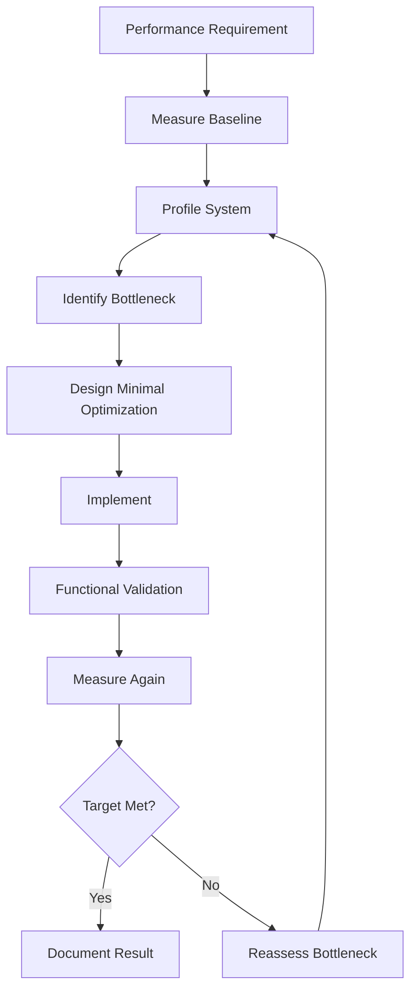
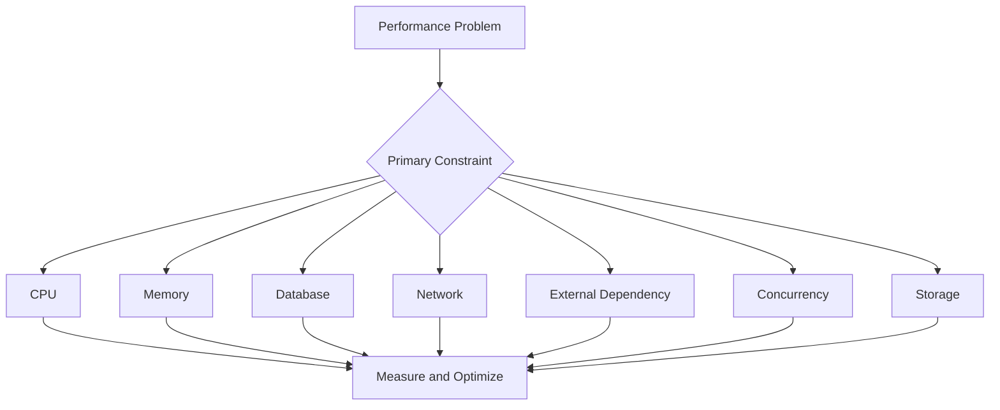
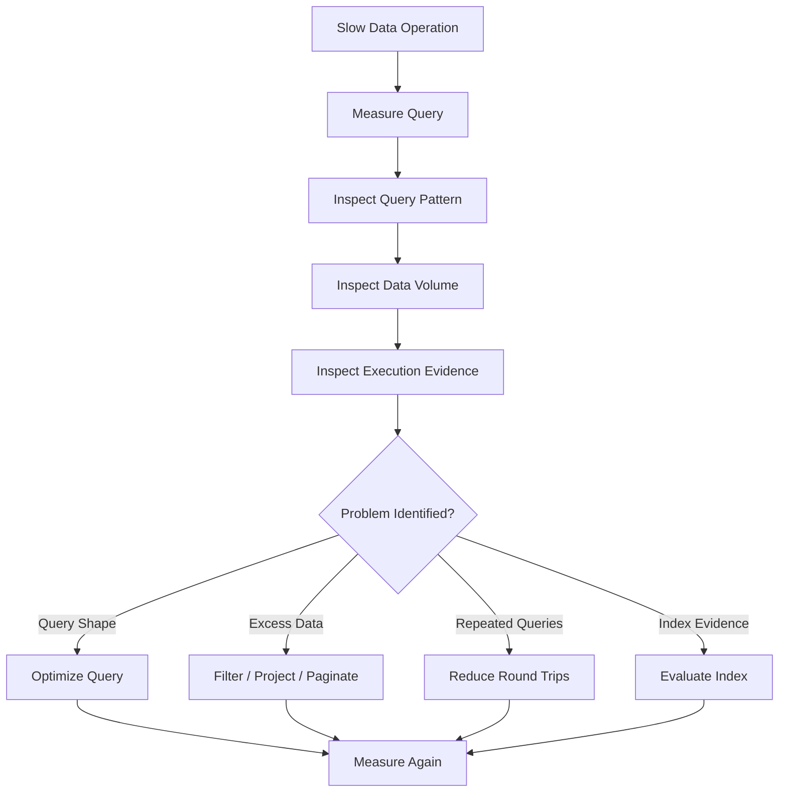
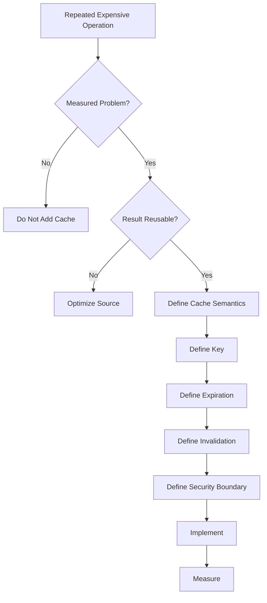
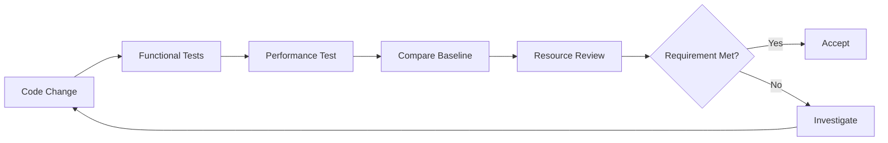

# Performance Engineering Skill

## Purpose

This skill defines generic engineering principles and best practices for designing, implementing, measuring, testing, and optimizing software performance.

Performance engineering is not simply making code execute faster.

It involves balancing:

- Latency
- Throughput
- Resource utilization
- Scalability
- Efficiency
- Reliability
- Cost
- Maintainability

Performance decisions should be based on requirements and evidence rather than assumptions.

This skill is:

- Domain-neutral
- Language-neutral
- Framework-neutral
- Vendor-neutral
- Cloud-neutral
- Platform-neutral
- Database-neutral
- Application-neutral
- Industry-neutral

---

# Objectives

Good performance engineering should help:

- Meet defined performance requirements.
- Reduce unnecessary latency.
- Support required throughput.
- Use resources efficiently.
- Identify real bottlenecks.
- Prevent unnecessary optimization.
- Maintain predictable behavior under load.
- Detect performance regressions.
- Support scalability.
- Avoid resource exhaustion.
- Balance performance with maintainability.
- Make performance decisions measurable.

---

# Fundamental Principle

## Measure Before Optimizing

Do not optimize based solely on intuition.

Prefer:

```text
Requirement
    ↓
Measure
    ↓
Identify Bottleneck
    ↓
Optimize
    ↓
Measure Again
```

over:

```text
Assumption
    ↓
Optimization
    ↓
Additional Complexity
```

Optimization should solve a demonstrated or clearly predictable problem.

---

# Performance Is a System Property

Performance should not be evaluated only at individual function level.

A system may involve:

```text
Client
  ↓
Network
  ↓
Application
  ↓
External Service
  ↓
Database
  ↓
Storage
```

A locally fast function does not guarantee a fast system.

---

# Performance Dimensions

Performance may involve several dimensions.

## Latency

Time required to complete an operation.

## Throughput

Amount of work completed during a period.

## Resource Utilization

Consumption of resources such as:

- CPU
- Memory
- Network
- Storage
- Connections
- Threads or workers

## Scalability

Ability to handle increased workload while maintaining acceptable behavior.

## Efficiency

Amount of useful work produced relative to consumed resources.

---

# Performance Requirements

Before optimization, determine what performance is actually required.

Possible requirements include:

```text
Response Time

Throughput

Concurrency

Batch Processing Time

Startup Time

Memory Limit

Resource Consumption
```

Avoid optimizing toward undefined targets.

---

# Performance Targets

Where measurable performance requirements exist, express them clearly.

For example conceptually:

```text
Operation
    ↓
Target Latency

Workload
    ↓
Required Throughput

Service
    ↓
Maximum Resource Usage
```

Targets should reflect business and operational needs.

---

# Performance Budgets

Performance budgets can define acceptable limits for important operations.

Examples may include:

```text
Maximum Latency

Maximum Payload Size

Maximum Memory Usage

Maximum External Calls

Maximum Query Count
```

Budgets should be meaningful rather than arbitrary.

---

# Latency

Latency should be evaluated across the entire request or processing path.

Conceptually:

```text
Total Latency
    =
Processing
+
Network
+
Database
+
External Services
+
Queueing
+
Serialization
```

Optimizing a small component may have negligible effect if another component dominates latency.

---

# Average Latency Is Not Enough

Average latency can hide poor tail behavior.

Where relevant, consider percentile measurements such as:

```text
Median

P90

P95

P99
```

The appropriate metric depends on system requirements.

---

# Tail Latency

High percentile latency may indicate:

- Resource contention
- Slow dependencies
- Queue buildup
- Garbage collection
- Lock contention
- Cold starts
- Uneven workload

Investigate evidence before changing implementation.

---

# Throughput

Throughput measures how much work the system can process.

Examples include:

```text
Requests per Unit Time

Messages per Unit Time

Transactions per Unit Time

Jobs per Unit Time
```

Throughput should be evaluated under realistic workloads.

---

# Concurrency

Concurrency represents simultaneous or overlapping work.

Higher concurrency does not automatically mean higher throughput.

Excessive concurrency may increase:

- Context switching
- Memory consumption
- Lock contention
- Connection exhaustion
- Downstream overload

Concurrency should be bounded appropriately.

Refer to `concurrency.md`.

---

# Resource Utilization

Performance analysis should consider resource usage.

Typical resources include:

```text
CPU

Memory

Network

Storage I/O

Connections

Workers / Threads

File Handles
```

Optimization may involve reducing unnecessary consumption rather than only improving speed.

---

# CPU Efficiency

High CPU utilization may result from:

- Expensive algorithms
- Repeated computation
- Excessive serialization
- Busy waiting
- Compression
- Encryption
- Excessive polling

Profile before optimizing CPU-intensive code.

---

# Memory Efficiency

Memory problems may result from:

- Unbounded collections
- Large object graphs
- Excessive buffering
- Duplicate data
- Retained references
- Large caches
- Large payloads

Avoid keeping data in memory longer than required.

---

# Memory Leaks

A memory leak occurs when memory remains reachable or allocated longer than intended.

Symptoms may include:

```text
Memory Usage
    ↓
Continuously Increases
    ↓
Resource Pressure
    ↓
Failure / Restart
```

Use profiling and runtime diagnostics to confirm memory retention issues.

---

# Allocation Pressure

Frequent unnecessary allocation may increase:

- Garbage collection
- CPU usage
- Memory pressure

Optimize allocation only when measurement shows meaningful impact.

Do not sacrifice readability for trivial allocation reductions.

---

# Network Efficiency

Network operations are often significantly more expensive than local computation.

Reduce unnecessary:

- Requests
- Round trips
- Payload size
- Repeated data transfers

But do not create complex batching or caching without evidence.

---

# Minimize Round Trips

Prefer fewer meaningful remote calls where practical.

Avoid patterns such as:

```text
Request
  ↓
Remote Call
  ↓
Remote Call
  ↓
Remote Call
```

when operations can safely and appropriately be combined.

---

# Payload Size

Large payloads increase:

- Network transfer
- Serialization cost
- Memory usage
- Processing time

Return only data required by the consumer.

Refer to `api-principles.md`.

---

# Serialization Performance

Serialization and deserialization can become expensive for:

- Large objects
- Large collections
- Deep structures
- High request volumes

Measure before introducing specialized serialization optimizations.

---

# Database Performance

Database access is frequently a major performance factor.

Consider:

- Query count
- Query complexity
- Index usage
- Data volume
- Connection usage
- Transaction scope
- Returned columns
- Pagination

Performance improvements should preserve correctness.

---

# Avoid N+1 Access Patterns

A common inefficient pattern is:

```text
Load Collection
      ↓
For Each Item
      ↓
Execute Another Query
```

This can produce:

```text
1 + N Queries
```

Where supported and appropriate, retrieve required data more efficiently.

---

# Query Only Required Data

Avoid retrieving unnecessary columns or records.

Prefer:

```text
Required Fields
```

over:

```text
Entire Record / Entire Object Graph
```

when the additional data provides no value.

---

# Query Filtering

Apply appropriate filtering as close to the data source as practical.

Avoid loading large datasets merely to filter them in application memory.

---

# Pagination

Large collections should generally be bounded.

Conceptually:

```text
Large Dataset
     ↓
Page / Window
     ↓
Consumer
```

Pagination helps protect:

- Memory
- Database load
- Network usage
- Response latency

---

# Pagination Limits

Pagination should enforce reasonable maximum page sizes.

Do not allow consumers to bypass pagination with arbitrarily large limits.

---

# Database Indexes

Indexes can improve read performance but introduce:

- Storage overhead
- Write overhead
- Maintenance cost

Do not add indexes blindly.

Use query behavior and execution evidence where available.

---

# Query Plans

When diagnosing database performance, query execution plans may help identify:

- Full scans
- Inefficient joins
- Missing indexes
- Poor cardinality assumptions
- Expensive sorting

Use database-specific tooling where available.

---

# Transactions

Long-running transactions can increase:

- Lock duration
- Contention
- Resource usage

Keep transaction scope appropriate to correctness requirements.

Do not reduce transaction boundaries merely for performance if doing so breaks consistency.

---

# Connection Management

External connections are finite resources.

Examples include:

- Database connections
- HTTP connections
- Message broker connections

Reuse and pooling should follow platform best practices.

Avoid creating unnecessary connections per operation.

---

# Connection Pools

Connection pools should have appropriate limits.

Too small:

```text
Requests Wait
```

Too large:

```text
Downstream Resource Exhaustion
```

Tune using actual workload evidence.

---

# External Service Calls

External dependencies contribute to overall latency.

For each external call consider:

```text
Is the call required?

Can calls execute concurrently safely?

Can data be reused?

Can operations be batched?

What happens when dependency slows?
```

Refer to `resilience.md`.

---

# Parallel External Calls

Independent operations may sometimes execute concurrently.

Conceptually:

```text
Sequential:

A → B → C
```

versus:

```text
Concurrent:

   ┌→ A
Start → B
   └→ C
```

Only parallelize when operations are truly independent and concurrency is safe.

---

# Batching

Batching can reduce per-operation overhead.

Conceptually:

```text
Item
Item
Item
Item
```

may become:

```text
Batch
  ↓
Process Together
```

Batching may improve throughput but can increase latency for individual items.

Use based on workload requirements.

---

# Batch Size

Batch size should balance:

- Throughput
- Latency
- Memory
- Failure impact
- Downstream limits

Avoid arbitrary extremely large batches.

---

# Caching

Caching can improve performance by avoiding repeated expensive work.

Conceptually:

```text
Request
   ↓
Cache
 /   \
Hit   Miss
 ↓      ↓
Return  Source
          ↓
        Cache
```

Caching should be introduced only when reuse justifies complexity.

---

# Cache Candidates

Caching may be useful when data is:

- Expensive to retrieve
- Expensive to compute
- Frequently reused
- Stable enough for temporary reuse

Do not cache everything.

---

# Cache Correctness

Before caching, answer:

```text
What is cached?

Who can access it?

How long is it valid?

When does it become stale?

How is it invalidated?

What happens on cache failure?
```

Caching is a correctness decision as well as a performance decision.

---

# Cache Keys

Cache keys must include all dimensions that affect the cached result.

Incorrect cache keys can produce:

- Wrong results
- Cross-user data exposure
- Cross-context leakage

Security boundaries must be preserved.

---

# Cache Invalidation

Invalidation strategy may include:

- Time-based expiration
- Event-based invalidation
- Version-based keys
- Explicit removal

Choose based on data consistency requirements.

---

# Cache Expiration

Avoid indefinite caching unless data is truly immutable or another reliable invalidation mechanism exists.

Expiration should reflect acceptable staleness.

---

# Cache Stampede

When many requests miss the same cache entry simultaneously, they may overload the underlying dependency.

Where this is a demonstrated risk, techniques may include:

- Request coalescing
- Controlled refresh
- Staggered expiration

Do not add complexity without need.

---

# Local vs Distributed Cache

Different cache types have different trade-offs.

Consider:

```text
Latency

Consistency

Capacity

Availability

Network Cost

Operational Complexity
```

Cache selection is an architectural decision when it affects system topology.

---

# Algorithmic Complexity

Algorithm choice can significantly affect performance at scale.

Common conceptual complexities include:

```text
O(1)

O(log n)

O(n)

O(n log n)

O(n²)
```

Do not optimize based solely on theoretical complexity without considering actual data sizes and workload.

---

# Nested Iteration

Nested loops are not automatically a performance problem.

For small bounded datasets they may be entirely appropriate.

Investigate actual scale before refactoring for complexity alone.

---

# Data Structures

Choose data structures according to required operations.

Consider:

- Lookup
- Insert
- Delete
- Ordering
- Memory
- Iteration

Do not choose specialized structures merely because they appear theoretically faster.

---

# Repeated Computation

Avoid repeatedly computing expensive deterministic values when reuse is safe and beneficial.

Possible approaches include:

- Local reuse
- Memoization
- Caching
- Precomputation

Each introduces trade-offs.

---

# Lazy Evaluation

Lazy evaluation can avoid unnecessary work.

However, it may also defer failures or cause repeated execution.

Understand execution semantics before using it as a performance optimization.

---

# Eager Evaluation

Eager evaluation may be appropriate when:

- Results are definitely needed.
- Repeated lazy execution would be expensive.
- Predictable failure timing is important.

Choose based on actual behavior.

---

# Streaming

Streaming may improve memory efficiency when processing large datasets.

Conceptually:

```text
Load Everything
      ↓
Process
```

versus:

```text
Read Portion
    ↓
Process
    ↓
Read Next Portion
```

Streaming can introduce lifecycle and error-handling complexity.

Use when justified.

---

# Buffering

Buffering can improve throughput but increases memory usage and may delay processing.

Buffer sizes should be bounded.

Avoid buffering entire untrusted or arbitrarily large inputs.

---

# Compression

Compression may reduce network usage but increase CPU cost.

Use when the trade-off is beneficial for expected payloads and environment.

---

# Asynchronous Processing

Operations that do not require immediate completion may sometimes be moved out of synchronous request paths.

Conceptually:

```text
Request
   ↓
Validate
   ↓
Queue Work
   ↓
Respond

Worker
   ↓
Process
```

This is an architectural decision when it changes processing semantics.

Do not introduce asynchronous processing solely to make latency numbers appear smaller.

---

# Background Work

Background processing should not be used to hide required work from correctness guarantees.

Define:

- Delivery expectations
- Failure handling
- Retry behavior
- Idempotency
- Observability

Refer to architecture skills where relevant.

---

# Synchronous vs Asynchronous Code

Asynchronous programming may improve scalability for I/O-bound workloads.

It does not automatically make CPU-bound work faster.

Use according to workload characteristics.

---

# Blocking Operations

Blocking operations can reduce concurrency in execution models where workers are limited.

Identify blocking behavior through profiling or platform knowledge.

Do not mechanically convert every operation to asynchronous execution.

---

# Concurrency Limits

Unbounded parallelism can overwhelm:

- CPU
- Memory
- Database
- External services
- Connection pools

Prefer controlled concurrency.

---

# Backpressure

When producers generate work faster than consumers can process it, backpressure may be required.

Conceptually:

```text
Producer
   ↓
Bounded Capacity
   ↓
Consumer
```

Without control:

```text
Producer
   ↓
Unlimited Queue
   ↓
Memory / Latency Growth
```

---

# Queue Growth

Growing queue depth can indicate that processing capacity is lower than arrival rate.

Measure:

- Queue depth
- Processing rate
- Arrival rate
- Age of oldest work item

Avoid treating larger queues as a permanent scalability solution.

---

# Scalability

Scalability concerns how system behavior changes as workload increases.

A scalable implementation should avoid unnecessary shared bottlenecks.

Potential bottlenecks include:

```text
Global Lock

Single Worker

Single Connection

Shared Mutable State

Centralized Expensive Operation
```

---

# Vertical Scaling

Vertical scaling increases capacity of an individual resource.

It can be simple but has limits.

Do not assume larger infrastructure is always the correct solution to inefficient implementation.

---

# Horizontal Scaling

Horizontal scaling increases the number of processing instances.

Applications intended for horizontal scaling should avoid unnecessary dependence on local instance state.

This is primarily an architectural concern but implementation should respect the chosen model.

---

# Stateless Processing

Where architecture expects stateless scaling, avoid introducing hidden local state that affects correctness across instances.

Local caches may still be used where semantics permit.

---

# Contention

Contention occurs when multiple operations compete for the same resource.

Examples include:

- Locks
- Database rows
- Connections
- Files
- Shared state

Measure contention before redesigning synchronization.

---

# Lock Scope

Keep lock scope no larger than necessary for correctness.

Avoid performing slow external I/O while holding locks where this can safely be prevented.

Refer to `concurrency.md`.

---

# Hot Paths

A hot path is frequently executed code that materially contributes to system cost or latency.

Optimization effort should prioritize hot paths rather than rarely executed code.

Use profiling to identify them.

---

# Cold Paths

Rarely executed code often does not justify aggressive optimization.

Prefer maintainability unless the operation has a strict latency requirement.

---

# Startup Performance

Startup time may matter for:

- Scaling
- Recovery
- Short-lived workloads
- Deployment

Measure before optimizing initialization.

Avoid loading unnecessary resources during startup.

---

# Lazy Initialization

Lazy initialization may reduce startup work but can shift latency to the first request.

Use according to operational requirements.

---

# Preloading

Preloading may improve first-use latency but increase startup time and resource usage.

Use when the trade-off is justified.

---

# Performance Profiling

Profiling helps identify where execution time or resources are actually consumed.

Possible profiling dimensions include:

```text
CPU

Memory

Allocations

I/O

Locks

Network

Database
```

Use tooling appropriate to the runtime.

---

# Benchmarking

Benchmarks should answer specific performance questions.

A useful benchmark should:

- Measure representative work.
- Control important variables.
- Be repeatable.
- Compare meaningful alternatives.

Avoid benchmarks disconnected from real usage.

---

# Microbenchmarks

Microbenchmarks measure small isolated operations.

They can help evaluate implementation alternatives.

They do not represent full system performance.

Do not extrapolate microbenchmark results directly to production behavior without evidence.

---

# Load Testing

Load testing evaluates system behavior under expected or elevated workload.

It may measure:

```text
Latency

Throughput

Errors

Resource Utilization

Saturation
```

Use realistic workload models.

---

# Stress Testing

Stress testing evaluates behavior beyond expected operating limits.

It can identify:

- Breaking points
- Resource exhaustion
- Degradation behavior
- Recovery characteristics

---

# Spike Testing

Spike testing evaluates sudden increases in workload.

This may reveal:

- Scaling delay
- Queue buildup
- Connection exhaustion
- Cache behavior

---

# Soak Testing

Long-duration testing can reveal:

- Memory leaks
- Resource leaks
- Gradual degradation
- Connection problems

Use where system criticality warrants it.

---

# Performance Test Environment

Performance results depend heavily on environment.

Document relevant conditions such as:

- Hardware/resources
- Dataset size
- Concurrency
- Network conditions
- Dependency behavior

Do not compare unrelated test environments as if results were equivalent.

---

# Representative Data

Performance testing should use realistic data shapes and volumes where possible.

A query fast against ten records may behave differently against millions.

---

# Warm vs Cold Measurements

Performance can differ depending on:

- Cache state
- Runtime optimization
- Connection initialization
- Data pages
- Startup state

Distinguish warm and cold behavior where relevant.

---

# Baselines

Establish performance baselines before optimization when possible.

Conceptually:

```text
Before Change
    ↓
Baseline

After Change
    ↓
New Measurement

Compare
```

Without a baseline, improvement claims may be unreliable.

---

# Performance Regression

A performance regression occurs when a change materially worsens performance.

Relevant indicators may include:

```text
Higher Latency

Lower Throughput

Higher CPU

Higher Memory

More Queries

More External Calls
```

Important paths may benefit from automated regression testing.

---

# Performance Gates

Where performance is critical, automated thresholds may be used.

Avoid overly sensitive gates that fail because of normal measurement noise.

Use statistically meaningful tolerances.

---

# Observability

Production observability can reveal performance behavior not visible in development.

Useful signals may include:

- Request latency
- Dependency latency
- Query latency
- Throughput
- Resource utilization
- Queue depth
- Cache hit ratio

Refer to architecture `observability.md`.

---

# Performance Metrics

Metrics should support diagnosis.

For example:

```text
High Request Latency
        ↓
Dependency Latency?
Database Latency?
Queue Delay?
CPU Saturation?
```

Collect measurements that help locate bottlenecks.

---

# Performance Logging

Avoid excessive logging on hot paths.

Logging itself consumes:

- CPU
- I/O
- Network
- Storage

Do not remove necessary operational or security logging merely for minor performance gains.

---

# Tracing

Distributed tracing may help identify latency across component boundaries.

Use where system architecture justifies it.

---

# Cost Efficiency

Performance and cost are related.

An implementation using excessive:

```text
CPU

Memory

Network

Storage

Database Operations
```

may increase infrastructure cost.

Optimize for required service quality rather than maximum possible performance.

---

# Performance vs Maintainability

Do not sacrifice maintainability for negligible performance improvements.

Prefer clear implementation unless measurement demonstrates that complexity is justified.

---

# Performance vs Correctness

Correctness takes priority over optimization.

Never introduce:

- Data races
- Lost updates
- Incorrect caching
- Partial consistency

merely to improve performance.

---

# Performance vs Security

Do not weaken:

- Authentication
- Authorization
- Encryption
- Validation
- Auditing

solely for performance.

Optimize safely.

---

# Performance vs Reliability

Aggressive concurrency, caching, or batching can reduce reliability.

Evaluate trade-offs explicitly.

---

# Premature Optimization

Avoid speculative optimizations such as:

- Adding caching without measured need
- Parallelizing trivial operations
- Replacing readable code with complex low-level logic
- Adding indexes without query evidence
- Introducing specialized data structures without scale requirements

Performance complexity requires justification.

---

# Performance Comments

When non-obvious code exists specifically for performance, document why.

Prefer comments explaining:

```text
Performance Requirement

Measured Problem

Reason for Approach
```

rather than generic comments such as:

```text
// faster
```

---

# Performance Documentation

Significant performance decisions may document:

- Requirement
- Baseline
- Bottleneck
- Change
- Measurement
- Trade-offs

This prevents future developers from removing necessary optimization or preserving obsolete optimization blindly.

---

# AI-Generated Performance Risk

AI agents may incorrectly:

- Optimize without measurement.
- Introduce unnecessary caching.
- Parallelize unsafe operations.
- Add unnecessary indexes.
- Increase memory usage to reduce trivial CPU work.
- Create unbounded concurrency.
- Load entire datasets into memory.
- Introduce complex algorithms unnecessarily.
- Claim performance improvement without benchmarks.

Therefore AI-generated optimization must be evidence-driven.

---

# AI Development Agent Performance Workflow

When performance is part of a development task:

## 1. Identify Requirement

Determine the performance objective.

Examples:

```text
Latency

Throughput

Resource Usage

Scalability

Processing Time
```

## 2. Inspect Existing Implementation

Understand:

- Data flow
- External calls
- Queries
- Algorithms
- Concurrency
- Caching
- Resource usage

## 3. Establish Evidence

Use available:

- Metrics
- Profiling
- Benchmarks
- Query plans
- Load tests
- Existing performance reports

## 4. Identify Bottleneck

Determine which operation materially limits performance.

## 5. Select Minimal Optimization

Choose the simplest change that addresses the measured problem.

## 6. Preserve Correctness

Ensure optimization does not break:

- Functional behavior
- Security
- Consistency
- Reliability

## 7. Measure Again

Compare against the baseline.

## 8. Run Regression Tests

Ensure existing functionality still works.

## 9. Document Significant Trade-Offs

Explain non-obvious performance-specific implementation.

## 10. Report

Summarize:

- Problem
- Evidence
- Change
- Result
- Remaining limitations

---

# AI Development Agent Rules

When using this skill, the agent should:

- ALWAYS understand the performance requirement before optimizing.
- ALWAYS inspect existing behavior first.
- ALWAYS prefer measurement over assumptions.
- ALWAYS identify the actual bottleneck where evidence is available.
- ALWAYS preserve correctness.
- ALWAYS preserve security.
- ALWAYS consider resource consumption.
- ALWAYS bound externally controlled workload where appropriate.
- ALWAYS consider database and network costs.
- ALWAYS consider downstream capacity before increasing concurrency.
- ALWAYS measure again after meaningful optimization where tooling permits.
- ALWAYS report performance validation limitations.

The agent should:

- NEVER claim an optimization improves performance without evidence.
- NEVER introduce caching merely because caching may be faster.
- NEVER introduce parallelism without checking independence and safety.
- NEVER create unbounded concurrency.
- NEVER load unbounded datasets into memory.
- NEVER add database indexes blindly.
- NEVER remove security controls for performance.
- NEVER weaken correctness for performance.
- NEVER replace readable implementation with complex optimization without justification.
- NEVER optimize cold paths without a requirement.
- NEVER treat microbenchmark improvements as proof of system-level improvement.
- NEVER silently change behavior to meet performance targets.
- NEVER hide required work in background processing solely to improve reported latency.

---

# Performance Decision Framework

Before optimizing ask:

## 1. What Is the Requirement?

Define the target.

## 2. What Is the Current Baseline?

Measure current behavior.

## 3. Where Is Time Spent?

Profile or inspect the execution path.

## 4. What Resource Is Constrained?

Determine whether the bottleneck is:

```text
CPU

Memory

Network

Database

Storage

External Service

Concurrency
```

## 5. Is the Problem Significant?

Avoid optimizing negligible costs.

## 6. What Is the Simplest Improvement?

Prefer minimal changes.

## 7. What Are the Trade-Offs?

Consider:

```text
Complexity

Memory

Consistency

Reliability

Security

Cost
```

## 8. Can the Improvement Be Measured?

Define validation.

## 9. Can It Regress?

Determine whether automated performance checks are justified.

## 10. Is the Optimization Still Maintainable?

Avoid unnecessary technical complexity.

---

# Performance Engineering Flow



---

# Bottleneck Analysis



---

# Database Performance Flow



---

# Cache Decision Flow



---

# Performance Validation Flow



---

# Best Practices

- Define performance requirements.
- Establish baselines.
- Measure before optimizing.
- Profile before changing implementation.
- Optimize actual bottlenecks.
- Consider system-level performance.
- Measure latency percentiles where relevant.
- Bound concurrency.
- Bound collection sizes.
- Paginate large datasets.
- Retrieve only required data.
- Reduce unnecessary network round trips.
- Avoid N+1 access patterns.
- Manage connections efficiently.
- Batch only when beneficial.
- Cache only when justified.
- Define cache invalidation explicitly.
- Preserve authorization boundaries in caches.
- Use appropriate algorithms and data structures.
- Stream large data when appropriate.
- Apply backpressure to overloaded flows.
- Use representative performance tests.
- Compare against baselines.
- Monitor performance regressions.
- Balance performance, cost, security, reliability, and maintainability.
- Document non-obvious optimizations.
- Require evidence for AI-generated optimization claims.

---

# Common Mistakes

Avoid:

- Optimizing without requirements.
- Optimizing without measurement.
- Focusing only on average latency.
- Ignoring downstream latency.
- Increasing concurrency indefinitely.
- Loading entire datasets unnecessarily.
- Returning unnecessary data.
- Performing excessive database queries.
- Adding indexes without evidence.
- Keeping transactions open unnecessarily.
- Creating connections repeatedly.
- Making sequential remote calls when safe concurrency is clearly beneficial.
- Parallelizing dependent operations.
- Using arbitrary batch sizes.
- Caching everything.
- Ignoring cache invalidation.
- Using incomplete cache keys.
- Caching across authorization boundaries incorrectly.
- Using theoretical complexity without considering actual scale.
- Optimizing small allocations without profiling.
- Buffering unbounded data.
- Moving required work to background processing to hide latency.
- Treating asynchronous code as automatically faster.
- Ignoring backpressure.
- Benchmarking unrealistic workloads.
- Comparing performance tests from unrelated environments.
- Claiming microbenchmark results prove production improvement.
- Removing security or correctness checks for speed.
- Creating hard-to-maintain optimization without measurable benefit.
- Allowing AI agents to claim unverified performance improvements.

---

# Validation Checklist

Before considering performance-related implementation complete, verify:

- [ ] Performance requirement is understood.
- [ ] Relevant performance target is defined where available.
- [ ] Existing implementation was inspected.
- [ ] Baseline was established where practical.
- [ ] Actual bottleneck was identified where possible.
- [ ] Optimization addresses the identified bottleneck.
- [ ] Functional correctness remains intact.
- [ ] Security controls remain intact.
- [ ] Reliability requirements remain intact.
- [ ] Latency impact was considered.
- [ ] Throughput impact was considered.
- [ ] CPU impact was considered.
- [ ] Memory impact was considered.
- [ ] Network impact was considered.
- [ ] Storage impact was considered.
- [ ] External dependency impact was considered.
- [ ] Database query count was reviewed where relevant.
- [ ] Database query shape was reviewed where relevant.
- [ ] N+1 patterns were avoided.
- [ ] Unnecessary data retrieval was avoided.
- [ ] Large datasets are bounded or paginated.
- [ ] Connections are managed appropriately.
- [ ] Concurrency is bounded.
- [ ] Parallel operations are independent and safe.
- [ ] Batch size is bounded.
- [ ] Caching is justified where introduced.
- [ ] Cache keys preserve correctness and isolation.
- [ ] Cache expiration is defined.
- [ ] Cache invalidation is defined.
- [ ] Algorithmic complexity is appropriate to expected scale.
- [ ] Large data processing uses appropriate memory strategy.
- [ ] Backpressure was considered where producer/consumer imbalance is possible.
- [ ] Performance testing uses representative workload where practical.
- [ ] Warm/cold behavior is distinguished where relevant.
- [ ] Performance was measured again after optimization where possible.
- [ ] Performance regression risk was considered.
- [ ] Cost impact was considered.
- [ ] Non-obvious optimization is documented.
- [ ] Performance validation limitations are reported.
- [ ] AI-generated optimization claims are supported by evidence.

---

# Relationship With Other Engineering Skills

`performance-engineering.md` defines how performance should be measured, optimized, and validated.

Use it together with:

### `coding-standards.md`

Defines baseline implementation quality.

### `clean-architecture.md`

Ensures performance optimizations do not violate architectural boundaries.

### `clean-code.md`

Ensures optimized implementation remains understandable.

### `code-quality.md`

Defines quality gates and regression expectations.

### `error-handling.md`

Ensures performance optimizations preserve correct failure behavior.

### `testing-strategy.md`

Defines benchmarking, load testing, and regression testing approaches.

### `dependency-management.md`

Helps evaluate performance impact introduced by dependencies.

### `configuration-management.md`

Defines safe configuration of performance-sensitive settings.

### `secure-coding.md`

Ensures performance optimization does not weaken security.

### `concurrency.md`

Defines safe parallelism, synchronization, and resource coordination.

### `code-review.md`

Defines review expectations for performance-related changes.

Performance engineering also interacts with architecture skills:

```text
system-design.md

data-architecture.md

api-principles.md

integration-patterns.md

cloud-architecture.md

observability.md

resilience.md
```

Conceptually:

```text
                 Performance Requirement
                          │
                          ↓
                       Measure
                          │
                          ↓
                       Profile
                          │
                          ↓
                    Find Bottleneck
                          │
            ┌─────────────┼─────────────┐
            ↓             ↓             ↓
          Code         Database      Network
            │             │             │
            └─────────────┼─────────────┘
                          ↓
                       Optimize
                          │
                          ↓
                     Validate Again
                          │
                          ↓
                  Performance Baseline
```

---

# References

Performance-engineering practices may draw, where applicable, from recognized engineering concepts such as:

- Measurement-Driven Optimization
- Performance Profiling
- Benchmarking
- Load Testing
- Stress Testing
- Spike Testing
- Soak Testing
- Performance Budgets
- Tail Latency
- Algorithmic Complexity
- Database Query Optimization
- Connection Pooling
- Caching
- Cache Invalidation
- Batching
- Pagination
- Streaming
- Backpressure
- Bounded Concurrency
- Horizontal Scaling
- Capacity Planning
- Resource Saturation
- Performance Regression Testing
- Observability
- Relevant organizational performance and engineering standards

These concepts should be treated as reusable engineering guidance rather than mandatory technology-specific implementation patterns.

The appropriate performance strategy should ultimately be determined by workload characteristics, performance requirements, expected scale, architecture, data volume, concurrency, latency requirements, resource constraints, security requirements, reliability requirements, operational cost, system criticality, and organizational engineering standards.
