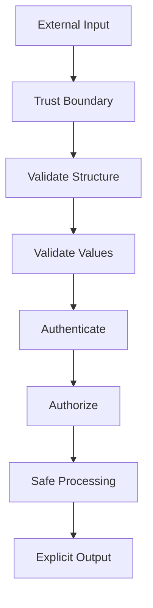
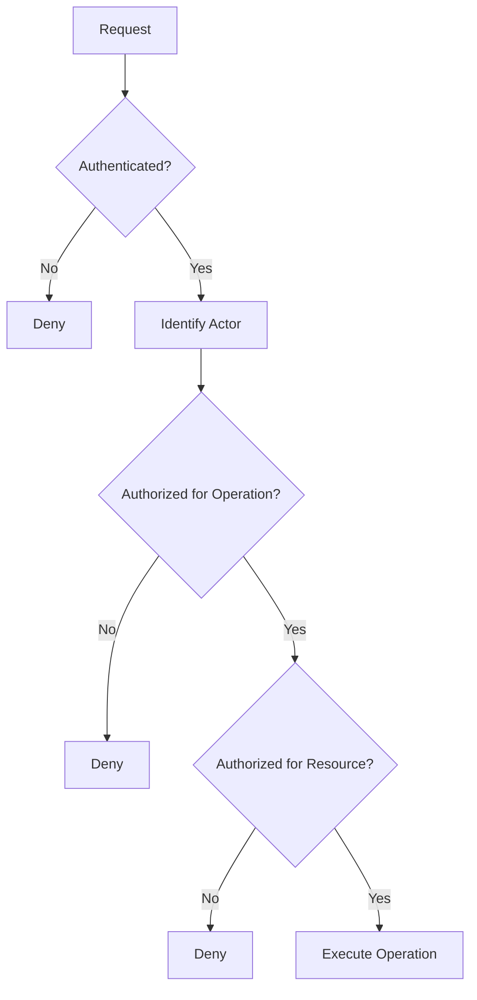
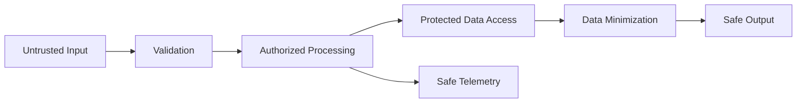
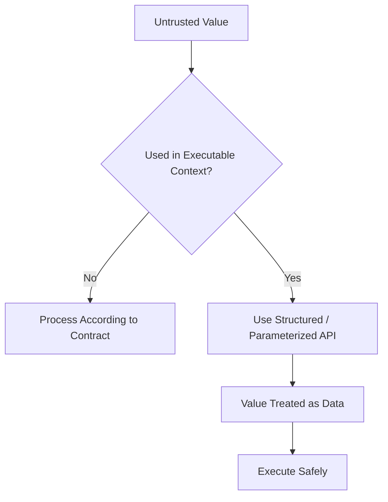
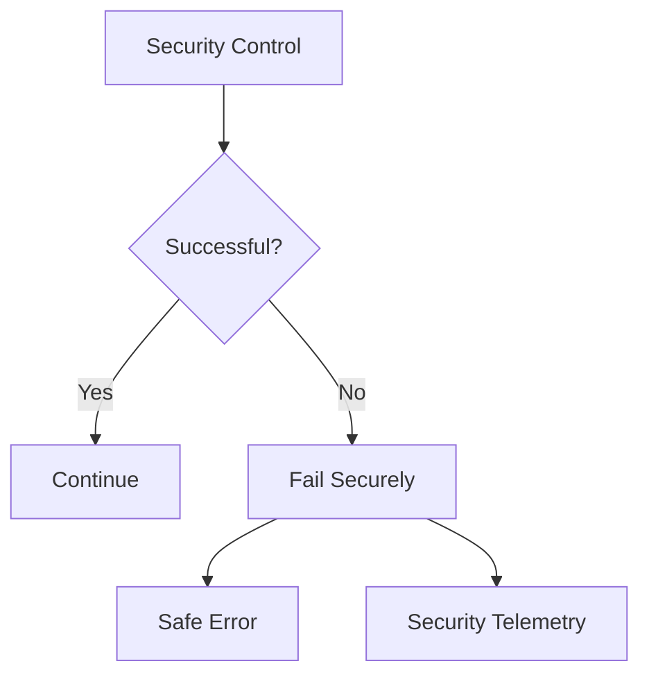
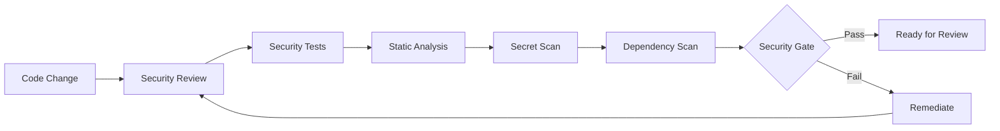

# Secure Coding Skill

## Purpose

This skill defines generic secure software development principles and implementation practices that should be applied while creating, modifying, reviewing, or refactoring code.

Security must be built into implementation rather than added after development.

The objective is to ensure code:

- Treats external data as untrusted
- Validates inputs
- Enforces authorization
- Protects sensitive information
- Prevents common injection vulnerabilities
- Uses cryptography safely
- Handles secrets securely
- Avoids unsafe deserialization
- Protects files and resources
- Handles failures safely
- Uses dependencies responsibly
- Produces security-relevant telemetry safely

This skill is:

- Domain-neutral
- Language-neutral
- Framework-neutral
- Vendor-neutral
- Cloud-neutral
- Platform-neutral
- Application-neutral
- Industry-neutral

---

# Objectives

Secure coding should help:

- Reduce exploitable vulnerabilities.
- Protect confidentiality.
- Protect integrity.
- Preserve availability.
- Prevent unauthorized access.
- Prevent privilege escalation.
- Protect sensitive data.
- Reduce injection risk.
- Reduce software supply-chain risk.
- Prevent information disclosure.
- Provide secure failure behavior.
- Make security controls testable.
- Ensure AI-generated code follows the same security standards as human-written code.

---

# Fundamental Principle

## Never Trust External Input

Any data crossing a trust boundary should initially be considered untrusted.

Examples include:

```text
User Input

External Requests

Files

Messages

Database Data from External Sources

Third-Party Responses

Configuration

Headers

Metadata

URLs

Serialized Objects
```

Conceptually:

```text
Untrusted Input
      ↓
Validation
      ↓
Normalization if Required
      ↓
Authorization / Policy
      ↓
Safe Processing
```

Do not assume data is safe because it came from another internal component.

---

# Security Is Layered

Do not rely on one security control.

Prefer:

```text
Authentication
      +
Authorization
      +
Input Validation
      +
Secure Processing
      +
Data Protection
      +
Monitoring
```

This provides defense in depth.

---

# Trust Boundaries

Identify where data moves between different levels of trust.

Examples may include:

```text
External Consumer
        ↓
Application

Application
        ↓
External Service

Application
        ↓
Data Store

User-Supplied File
        ↓
File Processor
```

Security validation should be strongest at trust boundaries.

---

# Input Validation

Validate untrusted input before using it in sensitive operations.

Validation may include:

- Required fields
- Type
- Length
- Range
- Format
- Allowed values
- Structure
- Relationships between fields

Prefer allowlist-style validation when practical.

---

# Allowlist Validation

Prefer:

```text
Accept values matching known valid rules
```

over:

```text
Reject known bad values
```

when the valid input space can be clearly defined.

Attack patterns evolve.

Known-bad lists are rarely sufficient as the primary defense.

---

# Validate Length

Inputs should have reasonable length limits where applicable.

Unbounded input may create:

- Memory pressure
- Storage abuse
- Parsing problems
- Denial-of-service risk

Limits should reflect actual requirements.

---

# Validate Range

Numeric or bounded values should be checked against acceptable limits.

Do not assume parsed values are automatically safe.

---

# Validate Structure

Structured input should conform to the expected schema.

Reject malformed structures rather than attempting unpredictable recovery.

---

# Validation vs Sanitization

Validation asks:

> Is this input acceptable?

Sanitization asks:

> Can this input be transformed safely?

Do not use sanitization as a universal substitute for validation.

---

# Context Matters

Input safe in one context may be unsafe in another.

For example:

```text
Safe Plain Text
```

does not automatically mean:

```text
Safe Query

Safe HTML

Safe Shell Argument

Safe File Path
```

Apply context-specific protections.

---

# Canonicalization

Some validation requires input to be normalized before security decisions.

Examples may include:

- File paths
- Encodings
- Unicode representation
- Resource identifiers

Avoid validating one representation and using another representation afterward.

---

# Authentication

Authentication establishes identity.

Implementation should use established organizational authentication mechanisms.

Avoid implementing custom authentication protocols when mature supported solutions exist.

---

# Credential Handling

Authentication credentials must be protected.

Never:

- Hardcode credentials
- Log credentials
- Return credentials in errors
- Store plaintext passwords
- Commit credentials to source control

---

# Password Storage

Where password storage is required, use established password-hashing mechanisms designed specifically for password storage.

Do not store:

```text
Plaintext Password

Reversible Encrypted Password
```

as the normal authentication credential representation.

Do not invent custom password hashing algorithms.

---

# Authorization

Authentication does not imply authorization.

Conceptually:

```text
Authenticated
     ↓
Identity Known

Authorized
     ↓
Operation Allowed
```

Every protected operation should enforce appropriate authorization.

---

# Server-Side Authorization

Authorization must be enforced at the trusted processing boundary.

Do not rely solely on:

- Hidden UI elements
- Disabled buttons
- Client-side checks
- Front-end routing

Client-side authorization can improve user experience but is not a security boundary.

---

# Object-Level Authorization

When accessing a specific resource, verify that the caller is allowed to access that resource.

Avoid:

```text
Authenticated User
      ↓
Can Access Any Resource by Changing ID
```

Resource ownership or policy must be validated where required.

---

# Function-Level Authorization

Sensitive operations should enforce authorization independently.

Examples conceptually include:

```text
Create

Delete

Approve

Export

Administer

Change Permissions
```

Do not assume access to one operation grants access to another.

---

# Least Privilege

Code should request and operate with only the permissions required.

Prefer:

```text
Required Permission
```

over:

```text
Administrator / Full Access
```

when broader access is unnecessary.

---

# Privilege Escalation

Avoid implementation paths that allow users to:

- Modify their own permissions improperly
- Select privileged roles
- Bypass approval
- Access privileged operations indirectly

Authorization decisions should use trusted server-side information.

---

# Deny by Default

When authorization state is:

- Missing
- Invalid
- Unknown
- Failed

prefer denial.

Conceptually:

```text
Authorization Result Unknown
        ↓
Deny
```

Security controls should fail safely.

---

# Injection Prevention

Injection occurs when untrusted data is interpreted as executable instructions.

Potential targets include:

```text
Database Queries

Operating-System Commands

Template Engines

Directory Queries

Expression Languages

Dynamic Code

Markup
```

The primary defense is to keep data separate from executable instructions.

---

# Query Injection

Do not construct executable queries by concatenating untrusted input.

Avoid conceptually:

```text
"query " + userInput
```

Prefer:

```text
Parameterized Query
        +
Untrusted Value as Data
```

Use safe query APIs provided by the technology.

---

# ORM Safety

Object-relational mapping does not automatically eliminate injection risk.

Raw queries, dynamic query fragments, and unsafe expression construction may still be vulnerable.

Use parameterization consistently.

---

# Command Injection

Avoid constructing operating-system commands from untrusted strings.

Prefer structured process APIs where arguments are passed separately.

Avoid invoking a shell when direct execution is sufficient.

---

# Dynamic Code Execution

Avoid executing dynamically generated code derived from untrusted input.

Examples conceptually include:

```text
eval

dynamic script execution

runtime expression execution
```

Use safer structured alternatives.

---

# Output Encoding

When untrusted content is rendered into an output context, apply the encoding appropriate to that context.

Different contexts may require different encoding.

Examples include:

```text
HTML

JavaScript

URL

Structured Data
```

Do not build custom escaping mechanisms when established framework protections exist.

---

# Cross-Site Scripting

Where content may be rendered in a browser or similar execution environment:

- Encode output appropriately.
- Avoid unsafe raw markup rendering.
- Avoid injecting untrusted content into executable contexts.
- Use framework protections correctly.

Do not disable automatic output encoding without clear justification.

---

# Request Forgery Protections

State-changing operations exposed through browser-oriented authentication mechanisms may require request-forgery protections.

Use platform-supported mechanisms where applicable.

Do not disable these protections merely to simplify integration.

---

# Server-Side Request Forgery

Applications accepting externally influenced destinations should not automatically connect to arbitrary locations.

Risk may exist when accepting:

```text
URL

Hostname

Callback Address

Webhook Target

Import Location
```

Controls may include:

- Destination allowlists
- Scheme restrictions
- Network controls
- Redirect validation
- Address validation

Treat externally supplied destinations as untrusted.

---

# Open Redirects

Redirect destinations influenced by external input should be validated.

Avoid allowing arbitrary destinations when redirects are expected to remain within trusted locations.

---

# File Handling

Files supplied externally should be treated as untrusted.

Validate as appropriate:

- File size
- File type
- Expected structure
- File name
- Processing requirements

Do not trust file extensions alone.

---

# File Names

User-controlled file names should not directly determine filesystem paths without validation.

Generate safe internal identifiers where appropriate.

---

# Path Traversal

Avoid constructing file paths directly from untrusted input.

Attackers may attempt values conceptually such as:

```text
../../sensitive-resource
```

Normalize and constrain paths to intended storage boundaries.

---

# File Uploads

File-upload functionality should consider:

- Maximum size
- Allowed types
- Safe naming
- Storage location
- Access permissions
- Malware scanning where required
- Processing isolation

Do not automatically execute uploaded content.

---

# Temporary Files

Temporary files should:

- Use safe locations
- Use safe names
- Have appropriate permissions
- Be cleaned up

Do not place sensitive temporary data into broadly accessible locations.

---

# Deserialization

Serialized input from untrusted sources should be treated carefully.

Avoid deserialization mechanisms that can instantiate arbitrary executable types or trigger unsafe behavior.

Prefer constrained data models.

---

# Unsafe Deserialization

Never assume serialized data is safe simply because it matches a known format.

Validate:

- Structure
- Allowed types
- Size
- Expected fields

Avoid enabling polymorphic or arbitrary-type deserialization unnecessarily.

---

# Serialization

When producing serialized output:

- Avoid exposing internal objects directly when that reveals unnecessary data.
- Define explicit external contracts where appropriate.
- Exclude sensitive fields.

---

# Mass Assignment

Binding external input directly to internal domain or persistence models may allow callers to modify fields they should not control.

Prefer explicit input contracts.

Conceptually:

```text
External Input
      ↓
Input Model
      ↓
Validated Mapping
      ↓
Internal Model
```

rather than binding every supplied field automatically.

---

# Over-Posting

External consumers should not be able to modify privileged properties merely by including additional fields.

Examples may include:

```text
Role

ApprovalStatus

Owner

Permission

InternalState
```

Explicitly define which fields are writable.

---

# Secrets

Secrets include:

- Passwords
- Tokens
- API keys
- Private keys
- Certificates containing private material
- Connection credentials

Secrets require controlled handling.

---

# Never Hardcode Secrets

Do not place secrets in:

```text
Source Code

Committed Configuration

Test Files

Documentation Examples

Scripts

Comments
```

Use approved secret-management mechanisms.

---

# Secret Access

Code should retrieve only secrets required for its operation.

Avoid loading large collections of secrets unnecessarily.

Apply least privilege.

---

# Secret Lifetime

Keep sensitive values in memory only as long as practical.

Do not copy secrets unnecessarily between objects, logs, or telemetry.

---

# Secret Rotation

Implementation should avoid assumptions that credentials never change.

Where supported, design integrations to tolerate credential rotation.

---

# Secret Errors

Never include secret values in:

- Exception messages
- Validation messages
- Logs
- Diagnostic output

---

# Sensitive Data

Sensitive information should be identified and handled according to applicable organizational data-classification rules.

Security decisions should consider:

```text
Collection

Processing

Storage

Transmission

Logging

Deletion
```

---

# Data Minimization

Collect and retain only information required for legitimate functionality.

Avoid storing unnecessary sensitive information.

Less sensitive data generally means less exposure.

---

# Data Exposure

Return only data required by the consumer.

Avoid exposing internal model fields automatically.

Conceptually:

```text
Internal Object
      ↓
Explicit Response Mapping
      ↓
Required Consumer Data
```

---

# Encryption in Transit

Sensitive communications should use approved secure transport mechanisms.

Do not disable certificate or peer verification merely to make connectivity work.

---

# Certificate Validation

Avoid implementation patterns equivalent to:

```text
Accept Any Certificate
```

in production-capable code.

If exceptional development behavior is necessary, isolate it clearly and prevent unsafe production use.

---

# Encryption at Rest

Where application-level encryption is required, use approved cryptographic mechanisms and key-management practices.

Do not invent custom encryption schemes.

---

# Cryptography

Cryptography is specialized security engineering.

Prefer established, reviewed, supported cryptographic libraries and platform capabilities.

Never invent:

- Encryption algorithms
- Hashing algorithms
- Signature schemes
- Key derivation mechanisms
- Random-number generators

---

# Cryptographic Algorithms

Use algorithms approved by applicable organizational security standards.

Avoid deprecated or known-weak algorithms.

Do not choose cryptographic primitives based solely on implementation convenience.

---

# Cryptographic Keys

Keys should be:

- Generated securely
- Stored securely
- Access-controlled
- Rotatable
- Protected from logs and source control

Do not embed cryptographic keys in source code.

---

# Randomness

Security-sensitive randomness must use cryptographically secure random-number generation.

Examples include:

- Security tokens
- Nonces
- Session identifiers
- Password-reset tokens

General-purpose pseudo-random generators may not be appropriate.

---

# Hashing

Use hashing according to purpose.

Different purposes require different mechanisms.

Examples include:

```text
Integrity Hashing

Password Hashing

Message Authentication
```

Do not use a generic fast hash as a password-storage mechanism.

---

# Token Generation

Security tokens should have sufficient entropy and be generated using approved secure randomness.

Avoid predictable tokens based on:

- Sequential identifiers
- Timestamps alone
- User names
- Weak randomness

---

# Token Validation

Validate tokens completely according to the expected security contract.

Depending on token type, this may include:

- Signature
- Issuer
- Audience
- Expiration
- Required claims
- Intended use

Do not merely decode a token and assume it is valid.

---

# Session Security

Where sessions exist:

- Use unpredictable identifiers.
- Protect session data.
- Apply appropriate expiration.
- Invalidate sessions when required.
- Prevent unauthorized reuse.

Use platform-supported session mechanisms where appropriate.

---

# Security Headers

Where applicable to the delivery protocol, use established security controls and headers appropriate to the system.

Do not invent custom substitutes for standardized protections.

---

# Cross-Origin Access

Cross-origin policies should grant only required origins, methods, and capabilities.

Avoid overly broad policies such as unrestricted access when not required.

Security configuration should follow actual consumer requirements.

---

# Resource Access

Access to files, storage, queues, databases, and external services should use least privilege.

Application identities should not receive broad administrative permissions unnecessarily.

---

# Database Credentials

Database access should use the minimum privileges required.

Where separate read/write responsibilities exist, stronger separation may be appropriate.

Do not grant schema administration or system-level privileges to runtime code unless required.

---

# Query Result Security

Do not assume authorization is complete simply because a query succeeded.

Ensure returned records satisfy caller authorization requirements.

---

# Logging Security

Logs can become a secondary data store.

Never log unnecessary:

- Credentials
- Tokens
- Passwords
- Secret values
- Private keys
- Sensitive personal information

Apply data classification rules.

---

# Security Logging

Security-relevant events may require logging, such as:

```text
Authentication Failure

Authorization Failure

Privilege Change

Security Configuration Change

Suspicious Validation Failure
```

Logs should support investigation without exposing sensitive information.

---

# Log Injection

Untrusted values written to logs should be handled using structured logging or equivalent safe mechanisms.

Avoid allowing external input to manipulate log structure or create misleading records.

---

# Error Security

External errors should not expose:

- Stack traces
- File paths
- Internal queries
- Hostnames
- Infrastructure details
- Secrets

Refer to `error-handling.md`.

---

# Fail Securely

Security-related failures should preserve protection.

Conceptually:

```text
Security Dependency Failure
        ↓
Deny / Safe Failure
```

not:

```text
Security Dependency Failure
        ↓
Allow Everything
```

---

# Secure Defaults

Security controls should be enabled by default where appropriate.

Avoid requiring operators to discover that protection must be manually enabled.

---

# Debug Features

Debug functionality should not expose sensitive implementation details in production environments.

Avoid production exposure of:

- Debug endpoints
- Stack traces
- Development consoles
- Diagnostic dumps containing secrets

---

# Administrative Capabilities

Administrative functions require stronger controls.

Consider:

- Strong authorization
- Audit logging
- Least privilege
- Explicit interfaces

Do not expose administrative capabilities through ordinary user flows without protection.

---

# Dangerous Operations

Operations capable of:

- Deleting large amounts of data
- Changing permissions
- Exporting sensitive information
- Modifying security configuration

should receive additional validation and authorization appropriate to risk.

---

# Resource Exhaustion

Untrusted users may attempt to consume excessive resources.

Consider limits for:

- Request size
- File size
- Batch size
- Query complexity
- Pagination size
- Concurrency
- Processing time

Security includes protecting availability.

---

# Unbounded Operations

Avoid allowing external input to control unbounded:

```text
Loops

Memory Allocation

Query Size

File Processing

Concurrency
```

without appropriate limits.

---

# Pagination

Collection interfaces should use reasonable bounds.

Avoid allowing consumers to request unlimited records when this can create resource exhaustion or excessive data exposure.

---

# Regular Expressions

Complex regular expressions applied to attacker-controlled input may cause excessive processing.

Use safe patterns and bounded input.

Avoid patterns known to cause catastrophic backtracking.

---

# XML and Structured Parsers

Configure parsers securely.

Disable dangerous features that are unnecessary.

Do not assume default parser behavior is always secure.

---

# URL Processing

URLs from untrusted sources require validation before being:

- Requested
- Redirected to
- Stored as trusted references
- Used for callbacks

Validate according to the intended use.

---

# External Services

Treat responses from external services as untrusted input.

Validate expected:

- Structure
- Type
- Size
- Semantics

A trusted transport does not guarantee trustworthy content.

---

# Third-Party Content

Content received from external systems should not automatically be rendered or executed.

Maintain appropriate encoding and trust boundaries.

---

# Dependency Security

Third-party dependencies introduce supply-chain risk.

Before introducing dependencies:

- Verify package identity.
- Review maintenance status.
- Review security status.
- Avoid unnecessary dependencies.
- Use approved sources.

Refer to `dependency-management.md`.

---

# Vulnerable Dependencies

Known vulnerable dependencies should be assessed and remediated according to risk.

Do not suppress dependency vulnerabilities merely to pass quality gates.

---

# Package Integrity

Do not disable package integrity verification or trust checks simply because dependency installation fails.

Investigate the root cause.

---

# Configuration Security

Security-sensitive configuration should:

- Use safe defaults.
- Be validated.
- Avoid plaintext secrets.
- Be protected from unauthorized modification.

Refer to `configuration-management.md`.

---

# Feature Flags and Security

Do not use ordinary feature flags as the sole authorization mechanism.

A flag may control availability.

Authorization must still control access.

---

# Concurrency Security

Race conditions can create security vulnerabilities.

Examples may include:

```text
Check Permission
      ↓
State Changes
      ↓
Perform Operation
```

Review security-sensitive state transitions carefully.

Refer to `concurrency.md`.

---

# Time-of-Check / Time-of-Use

Avoid assuming a resource remains unchanged between security validation and use when concurrent modification is possible.

Use appropriate atomic or transactional mechanisms where required.

---

# Secure Temporary State

Temporary authorization or verification state should have:

- Limited lifetime
- Appropriate entropy
- Controlled storage
- One-time use where required

---

# Security and Caching

Do not cache sensitive information without considering:

- Authorization boundaries
- Expiration
- Invalidation
- Shared cache exposure

Never allow one consumer to receive another consumer's protected data because of incorrect cache keys.

---

# Multi-Context Isolation

Where multiple users, organizations, tenants, or security contexts share infrastructure, every relevant data operation must preserve isolation.

Do not rely solely on caller-supplied identifiers.

Authorization should determine permitted scope.

---

# Data Export

Export functionality can expose large amounts of information.

Apply:

- Authorization
- Scope validation
- Data minimization
- Auditability where required

Do not treat export as ordinary read access automatically.

---

# Audit Events

High-impact security operations may require auditable records.

Examples include:

```text
Permission Changes

Administrative Actions

Security Configuration Changes

Sensitive Data Export
```

Audit records should be protected from unauthorized modification.

---

# Secure Error Recovery

Recovery mechanisms must not bypass security.

For example:

```text
Primary Authentication Service Fails
        ↓
Disable Authentication
```

is generally unsafe.

Fallback behavior must preserve required controls.

---

# Security and Performance

Do not disable security controls solely to improve performance.

Instead:

1. Measure the bottleneck.
2. Identify the security requirement.
3. Optimize safely.

---

# Security and Usability

Security controls should be usable, but convenience must not silently eliminate required protection.

Design controls so the secure path is also the normal path where practical.

---

# Security and Testing

Security-sensitive behavior should be tested.

Relevant tests may include:

```text
Valid Access

Unauthenticated Access

Unauthorized Access

Invalid Input

Boundary Input

Injection Attempts

Resource Isolation

Sensitive Data Exposure

Failure Behavior
```

Refer to `testing-strategy.md`.

---

# Negative Security Testing

Security tests should deliberately attempt invalid or unauthorized behavior.

Do not validate security only by confirming legitimate requests succeed.

---

# Authorization Matrix Testing

Where roles or permissions exist, tests may use a matrix such as:

| Actor | Operation | Expected |
|---|---|---|
| Authorized | Read | Allow |
| Authorized | Update | Allow if permitted |
| Unauthorized | Read | Deny |
| Unauthorized | Update | Deny |

The exact model depends on the authorization design.

---

# Static Security Analysis

Use configured static security analysis where available.

It may identify:

- Injection patterns
- Unsafe APIs
- Weak cryptography
- Hardcoded secrets
- Unsafe deserialization

Automated findings require review.

---

# Secret Scanning

Repositories should use secret scanning where organizational tooling provides it.

If a secret is accidentally committed:

```text
Remove from Code
      +
Rotate / Revoke Secret
```

Removing the secret from the latest commit alone may not eliminate exposure.

---

# Dynamic Security Testing

Where system risk justifies it, runtime security testing may validate externally observable vulnerabilities.

Use according to organizational security strategy.

---

# Security Findings

Security findings should be evaluated based on:

```text
Severity

Exploitability

Exposure

Affected Capability

Data Impact

Existing Mitigations
```

Do not dismiss findings solely because exploitation is difficult.

---

# Security Exceptions

If a security issue cannot immediately be corrected, use the organizational exception process where one exists.

Document:

- Risk
- Reason
- Mitigation
- Owner
- Review or expiration point

Do not silently accept security debt.

---

# Security Review

High-risk changes may require additional review.

Examples include changes involving:

- Authentication
- Authorization
- Cryptography
- Sensitive data
- File processing
- Dynamic execution
- External URLs
- Administrative functions

AI agents should explicitly flag such changes for review.

---

# Secure Code Review Questions

Reviewers should ask:

```text
What data is untrusted?

Where are trust boundaries?

How is input validated?

Where is authorization enforced?

Could input become executable?

Could sensitive information leak?

Are secrets protected?

Are dependencies trustworthy?

What happens when security controls fail?

Are security assumptions tested?
```

---

# AI-Generated Code Security

AI-generated code must be treated as untrusted candidate implementation until reviewed and validated.

AI may generate:

- Unsafe query construction
- Hardcoded credentials
- Weak validation
- Missing authorization
- Insecure cryptography
- Unsafe deserialization
- Excessive permissions
- Vulnerable dependencies
- Disabled certificate validation
- Unsafe CORS or security configuration

Security validation is mandatory.

---

# AI Development Agent Secure Coding Workflow

When creating or modifying code:

## 1. Identify Trust Boundaries

Determine which inputs originate outside the trusted component.

## 2. Identify Sensitive Operations

Look for:

- Authentication
- Authorization
- Data access
- File handling
- External requests
- Command execution
- Serialization
- Cryptography

## 3. Validate Inputs

Apply appropriate type, format, range, length, and structural validation.

## 4. Verify Authorization

Ensure protected operations enforce authorization at the trusted boundary.

## 5. Prevent Injection

Use structured and parameterized APIs.

## 6. Protect Data

Prevent unnecessary collection, storage, logging, or exposure.

## 7. Protect Secrets

Use approved secret mechanisms.

## 8. Review Dependencies

Avoid unnecessary or unverified dependencies.

## 9. Handle Failures Safely

Ensure errors do not expose sensitive information or fail open.

## 10. Add Security Tests

Test meaningful negative and unauthorized scenarios.

## 11. Run Security Tooling

Run available:

- Static analysis
- Secret scanning
- Dependency scanning
- Other configured security checks

## 12. Review Diff

Inspect all generated changes for security regressions.

## 13. Report

Summarize significant security decisions, validation, and unresolved risks.

---

# AI Development Agent Rules

When using this skill, the agent should:

- ALWAYS treat external input as untrusted.
- ALWAYS identify relevant trust boundaries.
- ALWAYS validate externally controlled input.
- ALWAYS enforce authorization at trusted boundaries.
- ALWAYS use parameterized or structured APIs for executable queries.
- ALWAYS protect sensitive data.
- ALWAYS keep secrets out of source control.
- ALWAYS use approved cryptographic capabilities.
- ALWAYS validate external service responses where relevant.
- ALWAYS use least privilege.
- ALWAYS fail safely for security-sensitive operations.
- ALWAYS consider resource-exhaustion risk.
- ALWAYS review security-sensitive configuration.
- ALWAYS test relevant negative security scenarios.
- ALWAYS run configured security checks where available.
- ALWAYS report security validation that could not be performed.

The agent should:

- NEVER trust client-side authorization.
- NEVER concatenate untrusted input into executable queries.
- NEVER construct shell commands unsafely.
- NEVER execute untrusted dynamic code.
- NEVER invent cryptographic algorithms.
- NEVER hardcode credentials.
- NEVER log secrets.
- NEVER expose stack traces to untrusted consumers.
- NEVER disable certificate validation to make integration work.
- NEVER allow unrestricted external destinations without validation.
- NEVER trust file extensions alone.
- NEVER construct filesystem paths directly from untrusted input.
- NEVER use unsafe arbitrary-type deserialization unnecessarily.
- NEVER bind external input directly to privileged internal fields without control.
- NEVER grant broad permissions when narrower permissions are sufficient.
- NEVER fail open when security validation fails.
- NEVER suppress security findings merely to pass a pipeline.
- NEVER assume AI-generated security code is correct without validation.

---

# Secure Coding Decision Framework

For every meaningful change ask:

## 1. What Is Untrusted?

Identify externally controlled data.

## 2. Where Is the Trust Boundary?

Determine where validation must occur.

## 3. What Must Be Validated?

Check type, structure, range, length, and allowed values.

## 4. Is Authentication Required?

Determine identity requirements.

## 5. Is Authorization Required?

Determine permission requirements.

## 6. Can Input Become Executable?

Consider queries, commands, templates, markup, expressions, and code.

## 7. Is Sensitive Data Involved?

Determine protection requirements.

## 8. Are Secrets Required?

Use approved secret-management mechanisms.

## 9. Is Cryptography Required?

Use approved established implementations.

## 10. Are Files Involved?

Validate file type, size, name, path, and processing.

## 11. Are External URLs Involved?

Validate destination and allowed schemes.

## 12. Are Dependencies Introduced?

Review supply-chain risk.

## 13. What Happens During Failure?

Ensure secure failure behavior.

## 14. How Could This Be Abused?

Consider misuse, privilege escalation, and resource exhaustion.

## 15. How Will Security Be Tested?

Add relevant negative scenarios.

---

# Secure Input Flow



---

# Authorization Flow



---

# Secure Data Flow



---

# Injection Prevention Model



---

# Security Failure Model



---

# Security Validation Flow



---

# Best Practices

- Treat external data as untrusted.
- Identify trust boundaries.
- Validate inputs early.
- Prefer allowlists.
- Enforce reasonable input limits.
- Normalize before security-sensitive comparisons where required.
- Use established authentication mechanisms.
- Enforce authorization server-side.
- Validate resource-level access.
- Apply least privilege.
- Deny by default.
- Keep data separate from executable instructions.
- Use parameterized queries.
- Avoid unsafe shell execution.
- Encode output for its destination context.
- Validate externally influenced URLs.
- Handle files as untrusted.
- Prevent path traversal.
- Avoid unsafe deserialization.
- Use explicit external input models.
- Prevent mass assignment.
- Keep secrets out of source control.
- Protect sensitive data.
- Minimize collected data.
- Use secure transport.
- Validate certificates.
- Use approved cryptography.
- Use cryptographically secure randomness for security-sensitive values.
- Protect tokens.
- Use safe error handling.
- Avoid sensitive logging.
- Apply resource limits.
- Review dependency security.
- Test authorization failures.
- Test malicious or malformed input.
- Run automated security tooling.
- Treat AI-generated code as untrusted until validated.

---

# Common Mistakes

Avoid:

- Trusting internal network location as proof of safety.
- Validating input only in the UI.
- Using denylist-only validation.
- Forgetting input length limits.
- Treating authentication as authorization.
- Performing authorization only client-side.
- Failing to validate resource ownership.
- Concatenating queries.
- Building shell commands from user input.
- Using dynamic execution unnecessarily.
- Disabling output encoding.
- Accepting arbitrary redirect destinations.
- Accepting arbitrary server-side request destinations.
- Trusting uploaded file extensions.
- Using user file names directly as paths.
- Unsafe arbitrary-type deserialization.
- Directly binding privileged internal fields.
- Hardcoding secrets.
- Logging credentials.
- Storing plaintext passwords.
- Inventing cryptography.
- Using predictable security tokens.
- Disabling certificate validation.
- Granting excessive permissions.
- Returning unnecessary sensitive data.
- Logging sensitive information.
- Exposing detailed internal errors.
- Failing open.
- Allowing unbounded resource consumption.
- Ignoring dependency vulnerabilities.
- Suppressing security findings without review.
- Assuming AI-generated security controls are correct.

---

# Validation Checklist

Before considering implementation security-ready, verify:

- [ ] Trust boundaries were identified.
- [ ] External input is treated as untrusted.
- [ ] Required input is validated.
- [ ] Input types are validated.
- [ ] Input lengths are bounded where appropriate.
- [ ] Numeric ranges are bounded where appropriate.
- [ ] Structured input is validated.
- [ ] Authentication uses established mechanisms.
- [ ] Credentials are protected.
- [ ] Authorization occurs at trusted boundaries.
- [ ] Resource-level authorization is enforced where required.
- [ ] Function-level authorization is enforced where required.
- [ ] Least privilege is applied.
- [ ] Security failures deny access by default.
- [ ] Queries use parameterized or structured mechanisms.
- [ ] Shell commands do not contain unsafe untrusted input.
- [ ] Dynamic code execution is avoided.
- [ ] Output encoding is appropriate.
- [ ] Redirect destinations are validated where applicable.
- [ ] External request destinations are validated where applicable.
- [ ] File size is bounded where applicable.
- [ ] File type is validated where applicable.
- [ ] File paths are constrained.
- [ ] Unsafe deserialization is avoided.
- [ ] External models cannot modify privileged fields unexpectedly.
- [ ] No secrets are hardcoded.
- [ ] No secrets exist in committed configuration.
- [ ] Secrets are not logged.
- [ ] Sensitive data collection is minimized.
- [ ] Sensitive output is limited to required fields.
- [ ] Secure transport is used where required.
- [ ] Certificate validation remains enabled.
- [ ] Approved cryptographic mechanisms are used.
- [ ] Security-sensitive randomness is cryptographically secure.
- [ ] Tokens are validated fully.
- [ ] Security-sensitive resources use appropriate permissions.
- [ ] Logs exclude sensitive information.
- [ ] External errors do not expose implementation details.
- [ ] Debug behavior is safe for target environments.
- [ ] Resource limits exist where abuse is possible.
- [ ] Dependencies were security-reviewed.
- [ ] Security-sensitive configuration uses safe defaults.
- [ ] Feature flags are not used as authorization substitutes.
- [ ] Concurrency-related security risks were considered.
- [ ] Relevant security tests exist.
- [ ] Unauthorized behavior is tested.
- [ ] Malformed input is tested.
- [ ] Security tooling was executed where available.
- [ ] Security findings were reviewed.
- [ ] Security validation limitations are reported.
- [ ] AI-generated security-sensitive code received explicit review.

---

# Relationship With Other Engineering Skills

`secure-coding.md` defines implementation-level security requirements.

Use it together with:

### `coding-standards.md`

Defines baseline engineering implementation standards.

### `clean-architecture.md`

Defines security boundaries and prevents infrastructure/security implementation details from contaminating core logic.

### `clean-code.md`

Ensures security-sensitive code remains understandable and reviewable.

### `code-quality.md`

Defines quality gates and security-related analysis requirements.

### `error-handling.md`

Defines secure failure behavior and safe error exposure.

### `testing-strategy.md`

Defines security testing and negative-path validation.

### `dependency-management.md`

Defines software supply-chain and dependency security.

### `configuration-management.md`

Defines secure configuration and separation of secrets.

### `performance-engineering.md`

Defines safe handling of performance and resource limits.

### `concurrency.md`

Defines protection against race conditions and concurrent state vulnerabilities.

### `code-review.md`

Defines review expectations for security-sensitive changes.

This skill should also work with architecture skills such as:

```text
security-architecture.md

api-principles.md

data-architecture.md

integration-patterns.md

cloud-architecture.md

observability.md

resilience.md
```

Conceptually:

```text
                 Security Architecture
                         │
                         ↓
                   Secure Coding
                         │
        ┌────────────────┼────────────────┐
        ↓                ↓                ↓
 Input Validation    Authorization    Data Protection
        │                │                │
        ├────────────┬───┴────┬───────────┤
        ↓            ↓        ↓           ↓
   Injection      Secrets  Crypto    Dependencies
        │            │        │           │
        └────────────┴────┬───┴───────────┘
                          ↓
                    Security Tests
                          │
                          ↓
                   Security Analysis
                          │
                          ↓
                      Code Review
```

---

# References

Secure coding practices may draw, where applicable, from recognized security guidance such as:

- OWASP secure development principles
- OWASP Top 10
- OWASP ASVS
- CWE
- Least Privilege
- Defense in Depth
- Deny by Default
- Fail-Safe Defaults
- Zero Trust principles
- Secure-by-Design principles
- Secure-by-Default principles
- Input Validation
- Output Encoding
- Parameterized Queries
- Secret Management
- Secure Cryptography
- Software Supply Chain Security
- Secure Software Development Framework principles
- Relevant organizational security standards

These should be treated as reusable security guidance rather than technology-specific implementation instructions.

The appropriate security controls should ultimately be determined by threat model, system criticality, data sensitivity, trust boundaries, architecture, regulatory requirements, exposure, deployment model, organizational security standards, and business risk.
