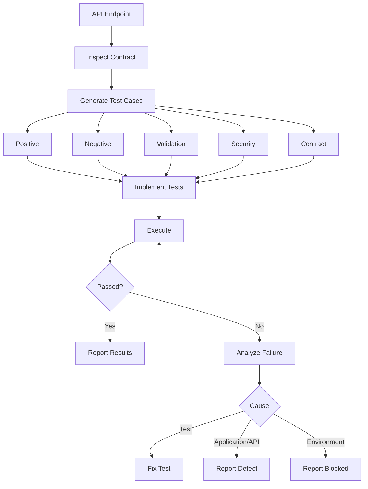

# API Testing Skill

## Purpose

This skill defines standards for designing, creating, executing, and reporting API tests.

API testing verifies that exposed interfaces behave correctly according to their defined contracts.

This skill is:

- Domain-neutral
- Language-neutral
- Framework-neutral
- Protocol-aware
- Platform-neutral
- Vendor-neutral

Use the repository's existing API testing framework and conventions wherever available.

---

# Objectives

API testing should validate:

- Endpoint behavior
- Request validation
- Response correctness
- Status codes
- Data contracts
- Authentication
- Authorization
- Error handling
- Query behavior
- Idempotency
- Version compatibility
- Security-sensitive behavior

---

# Core Principle

API tests should validate:

```text
Request
   ↓
API
   ↓
Processing
   ↓
Response
```

The primary question is:

> Does the API behave according to its documented contract?

---

# API Testing Workflow

```text
Inspect Requirements
        ↓
Discover API Contract
        ↓
Identify Endpoints
        ↓
Generate Test Cases
        ↓
Implement Tests
        ↓
Execute
        ↓
Validate Responses
        ↓
Analyze Failures
        ↓
Report
```

---

# 1. Discover API Contracts

Before creating tests inspect available:

- PRD
- Architecture documentation
- API specifications
- OpenAPI/Swagger definitions
- Routes/controllers
- Request models
- Response models
- Validation rules
- Authentication
- Authorization
- Existing API tests

Do not invent undocumented endpoints or behavior.

---

# 2. Endpoint Coverage

For each applicable endpoint identify:

```text
HTTP Method
+
Route
+
Request
+
Authentication
+
Expected Response
```

For REST APIs this commonly includes:

```text
GET
POST
PUT
PATCH
DELETE
```

Only test methods actually supported.

---

# 3. Positive Tests

Verify valid requests produce expected results.

Examples:

```text
Valid Create Request
        ↓
Expected Success Response
```

```text
Existing Resource
        ↓
GET
        ↓
Expected Resource
```

Validate more than the status code.

---

# 4. Negative Tests

Test applicable invalid scenarios:

- Invalid request
- Missing required field
- Invalid data type
- Invalid format
- Invalid identifier
- Missing resource
- Duplicate resource
- Unsupported operation
- Malformed payload

Verify the API returns the expected failure behavior.

---

# 5. Boundary Testing

Where meaningful test:

```text
Minimum Value
Maximum Value
Below Minimum
Above Maximum
Empty Value
Maximum Length
Oversized Payload
```

Avoid artificial boundary tests where no meaningful constraint exists.

---

# 6. Request Validation

Validate applicable:

- Required fields
- Optional fields
- Data types
- Formats
- Ranges
- Length limits
- Enumerations
- Nested structures
- Unsupported fields where relevant

Invalid input should fail predictably.

---

# 7. Response Validation

Validate applicable:

- Status code
- Response body
- Schema
- Data types
- Required fields
- Headers
- Error structure
- Returned values

Example:

```text
Status Code ✓
Response Schema ✓
Expected Data ✓
Required Headers ✓
```

Do not consider a correct status code alone sufficient.

---

# 8. Status Codes

Verify status codes match the API contract.

Examples may include:

```text
2xx → Successful operation

4xx → Invalid request / unauthorized / forbidden / missing resource

5xx → Server-side failure
```

Use the application's documented contract rather than assuming specific codes.

---

# 9. CRUD Testing

Where CRUD operations exist, test the applicable lifecycle:

```text
Create
  ↓
Read
  ↓
Update
  ↓
Verify Update
  ↓
Delete
  ↓
Verify Removal
```

Do not require full CRUD where the API intentionally supports only some operations.

---

# 10. Authentication

For authenticated APIs consider:

```text
Valid Credentials
      ↓
Allowed

Missing Credentials
      ↓
Rejected

Invalid Credentials
      ↓
Rejected

Expired Credentials
      ↓
Rejected
```

Never hardcode real credentials, tokens, or secrets.

---

# 11. Authorization

Where roles or permissions exist test:

```text
Authorized Identity
      ↓
Allowed Operation
```

and:

```text
Authenticated but Unauthorized Identity
      ↓
Denied Operation
```

Authorization must be validated at the API boundary, not only through UI behavior.

---

# 12. Query Parameters

Where supported test:

- Valid parameters
- Invalid parameters
- Missing optional parameters
- Multiple parameters
- Unsupported values

---

# 13. Pagination

Where pagination exists verify:

- Page size
- Page navigation
- First page
- Last page
- Empty page
- Invalid pagination values
- Metadata where defined

---

# 14. Filtering and Sorting

Where supported validate:

```text
Filter
   ↓
Correct Subset

Sort
   ↓
Correct Order
```

Consider combinations only where they represent meaningful behavior.

---

# 15. Error Contracts

Errors should follow the documented API contract.

Validate applicable:

- Status
- Error code
- Message
- Validation details
- Correlation identifier

Internal implementation details, stack traces, or secrets should not be exposed.

---

# 16. Idempotency

Where required, verify repeated identical requests do not produce unintended duplicate effects.

Example:

```text
Request
   ↓
Success

Same Request
   ↓
Expected Idempotent Behavior
```

This is particularly important for operations where retries may occur.

---

# 17. API Security Tests

Consider applicable:

- Authentication bypass
- Authorization bypass
- Invalid input
- Injection attempts
- Excessive payloads
- Sensitive data exposure
- Unexpected fields
- Resource access across ownership boundaries

Detailed security testing should follow approved security standards and tooling.

---

# 18. Rate Limits

Where rate limiting exists verify:

```text
Requests Within Limit
        ↓
Allowed

Limit Exceeded
        ↓
Expected Rate-Limit Behavior
```

Do not perform uncontrolled high-volume testing against shared or production environments.

---

# 19. API Versioning

Where multiple API versions exist verify:

- Supported versions work.
- Version-specific contracts are preserved.
- Deprecated versions behave according to policy.
- New versions do not unintentionally break existing consumers.

---

# 20. API Contract Testing

Where OpenAPI or another formal specification exists, validate implementation against it.

Check:

```text
Routes
Methods
Request Schema
Response Schema
Required Fields
Data Types
Status Codes
```

Contract tests should detect unintended breaking changes.

---

# 21. Test Data

API test data should be:

- Predictable
- Isolated
- Non-sensitive
- Reproducible
- Cleanable

Prefer:

```text
Prepare Data
    ↓
Execute Request
    ↓
Validate
    ↓
Cleanup
```

Avoid routine testing against production data.

---

# 22. API Test Independence

Tests should not unnecessarily depend on previous tests.

Avoid:

```text
TC-002 depends on TC-001
```

Prefer each test to create or prepare the state it requires.

---

# 23. Test Case Documentation

API test scenarios must be added to:

```text
tests/test-cases/test-cases.md
```

Example:

```markdown
| ID | Requirement | Feature | Test Type | Scenario | Expected Result | Priority | Automation |
|----|-------------|---------|-----------|----------|-----------------|----------|------------|
| TC-050 | REQ-10 | Orders API | API | Create with valid request | Resource created successfully | High | Yes |
| TC-051 | REQ-10 | Orders API | API | Create with missing required field | Validation error returned | High | Yes |
| TC-052 | REQ-10 | Orders API | API | Access without authorization | Request rejected | Critical | Yes |
```

Maintain:

```text
Requirement
    ↓
Test Case
    ↓
Automated API Test
    ↓
Execution Result
```

---

# 24. API Test Implementation

Use the repository's existing test framework.

Possible approaches may include:

```text
Existing Language Test Framework

API Testing Library

HTTP Client Test Framework

Contract Testing Framework
```

Do not introduce a new framework when existing tooling is sufficient.

---

# 25. API Test Execution

Discover the correct command from:

- Package scripts
- Project files
- Build configuration
- CI pipelines
- Existing documentation

Conceptually:

```text
Run API Test Suite
        ↓
Collect Results
        ↓
Generate Report
```

Do not invent execution commands.

---

# 26. Failure Analysis

When a test fails determine whether it is:

```text
Application Defect

API Contract Defect

Test Defect

Environment Failure

Configuration Failure

Test Data Failure
```

Inspect:

- Request
- Response
- Status
- Logs
- Expected contract

Do not modify valid assertions merely to make tests pass.

---

# 27. API Test Reporting

Report actual execution results:

```text
API Test Results

Total:
Passed:
Failed:
Skipped:
Blocked:

Endpoints Tested:
Environment:
Duration:
```

Where useful, include:

```text
Endpoint Coverage
Authentication Coverage
Authorization Coverage
Negative Scenario Coverage
```

---

# Testing Agent API Workflow

## 1. Discover

Inspect:

```text
Requirements
API Specification
Source Code
Existing Tests
```

## 2. Identify

Determine endpoints, methods, contracts, security, and validation rules.

## 3. Design

Generate applicable:

```text
Positive
Negative
Boundary
Validation
Authentication
Authorization
Error
CRUD
Pagination
Filtering
Idempotency
Security
Contract
```

test cases.

## 4. Document

Update:

```text
tests/test-cases/test-cases.md
```

## 5. Implement

Create API tests using repository conventions.

## 6. Execute

Run the applicable API test suite.

## 7. Analyze

Investigate failures against the expected API contract.

## 8. Report

Provide actual execution results and coverage gaps.

---

# Testing Agent Rules

The agent should:

- ALWAYS inspect the API contract before creating tests.
- ALWAYS inspect existing API tests.
- ALWAYS test applicable positive scenarios.
- ALWAYS test applicable negative scenarios.
- ALWAYS validate request rules.
- ALWAYS validate response data, not only status codes.
- ALWAYS test authentication where required.
- ALWAYS test authorization where required.
- ALWAYS validate error contracts.
- ALWAYS consider pagination/filtering/sorting where supported.
- ALWAYS consider idempotency where required.
- ALWAYS protect credentials and tokens.
- ALWAYS keep API tests isolated where practical.
- ALWAYS execute generated tests when execution is available.
- ALWAYS report actual results and coverage gaps.

The agent should:

- NEVER invent endpoints.
- NEVER invent unsupported requirements.
- NEVER hardcode real credentials or tokens.
- NEVER use production data for routine testing.
- NEVER consider status-code validation alone sufficient.
- NEVER disable authentication to simplify tests.
- NEVER ignore authorization testing.
- NEVER expose secrets in reports.
- NEVER weaken assertions to make tests pass.
- NEVER claim API tests passed without execution.

---

# API Test Decision Flow



---

# Validation Checklist

Before API testing is considered complete:

- [ ] API specification/contracts were reviewed.
- [ ] Existing API tests were inspected.
- [ ] Relevant endpoints were identified.
- [ ] Supported methods were identified.
- [ ] Positive scenarios were tested.
- [ ] Negative scenarios were tested.
- [ ] Boundary scenarios were considered.
- [ ] Request validation was tested.
- [ ] Response schema/data was validated.
- [ ] Status codes were validated.
- [ ] Authentication was tested where applicable.
- [ ] Authorization was tested where applicable.
- [ ] CRUD behavior was tested where applicable.
- [ ] Pagination/filtering/sorting were tested where applicable.
- [ ] Error contracts were validated.
- [ ] Idempotency was considered.
- [ ] API security scenarios were considered.
- [ ] Version compatibility was considered where applicable.
- [ ] Test data was isolated.
- [ ] Test cases were documented.
- [ ] Automated tests were executed where possible.
- [ ] Failures were analyzed.
- [ ] Actual results were reported.
- [ ] Coverage gaps were reported.

---

# Completion Criteria

API testing is complete when applicable:

```text
API Contract Understood
        +
Test Cases Documented
        +
Tests Implemented
        +
Tests Executed
        +
Responses Validated
        +
Security Checked
        +
Failures Analyzed
        +
Results Reported
```

---

# Relationship With Testing Skills

```text
test-case-design.md
        ↓
unit-testing.md
        ↓
integration-testing.md
        ↓
api-testing.md
        ↓
playwright-testing.md
        ↓
non-functional-testing.md
        ↓
defect-reporting.md
```

Use the appropriate layer:

```text
Unit
    → Isolated logic

Integration
    → Component boundaries

API
    → API behavior and contracts

Playwright
    → Browser/user workflows
```

---

# Final Principle

API testing should answer:

```text
Does the API behave correctly,
securely, and consistently
according to its defined contract?
```

The goal is not maximum API test count.

The goal is:

```text
Contract Coverage
      +
Functional Coverage
      +
Negative Coverage
      +
Security Coverage
      +
Reliable Execution
```
