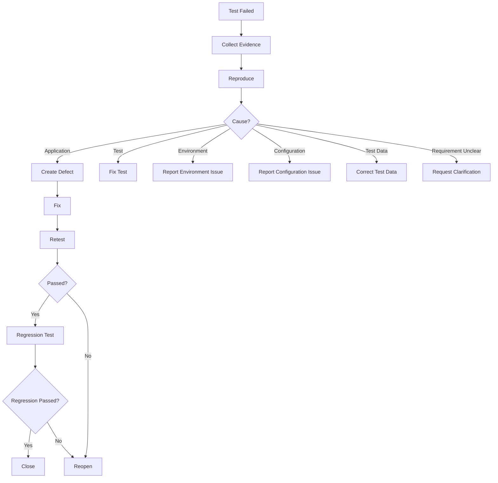

# Defect Reporting Skill

## Purpose

This skill defines standards for analyzing, classifying, documenting, retesting, and closing defects discovered during testing.

It applies to failures discovered through:

- Unit testing
- Integration testing
- API testing
- UI testing
- Playwright testing
- End-to-end testing
- Regression testing
- Security testing
- Accessibility testing
- Performance testing
- Other non-functional testing

The objective is to convert confirmed application failures into clear, reproducible, and actionable defect reports.

---

# Core Principle

A failed test does not automatically mean an application defect.

Always determine:

```text
Test Failure
    ↓
Analyze
    ↓
Classify
```

Possible classifications:

```text
Application Defect

Test Automation Defect

Environment Issue

Configuration Issue

Test Data Issue

External Dependency Issue

Requirement Ambiguity
```

Only confirmed application behavior problems should normally become application defects.

---

# Defect Workflow

```text
Test Failure
    ↓
Collect Evidence
    ↓
Reproduce
    ↓
Compare Expected vs Actual
    ↓
Classify Failure
    ↓
Create Defect if Confirmed
    ↓
Fix
    ↓
Retest
    ↓
Regression Test
    ↓
Close / Reopen
```

---

# 1. Failure Analysis

When a test fails, inspect applicable:

- Test output
- Assertion message
- Application behavior
- Logs
- API request/response
- Screenshot
- Playwright trace
- Video
- Test data
- Environment
- Configuration
- Dependency status

Do not immediately create a defect without understanding the failure.

---

# 2. Reproduce the Failure

Attempt to reproduce the issue where practical.

Determine:

```text
Always Reproducible

Intermittent

Environment-Specific

Data-Specific

Not Reproducible
```

Record reproduction conditions.

Intermittent failures must not automatically be ignored.

---

# 3. Expected vs Actual

Every confirmed defect should clearly identify:

```text
Expected Behavior

vs.

Actual Behavior
```

Expected behavior must come from available:

- Requirements
- Acceptance criteria
- PRD
- API contract
- Architecture/design
- Business rules
- Approved system behavior

Do not invent expected behavior.

---

# 4. Defect Report Structure

Use the following structure:

```markdown
# DEF-001 - <Short Defect Title>

## Summary

<Concise description of the problem>

## Related Test Case

TC-XXX

## Test Type

<Unit / Integration / API / Playwright / E2E / Performance / etc.>

## Environment

<Environment where the defect occurred>

## Preconditions

<Required state before reproduction>

## Steps to Reproduce

1. <Step>
2. <Step>
3. <Step>

## Expected Result

<Expected behavior>

## Actual Result

<Observed behavior>

## Severity

<Critical / High / Medium / Low>

## Priority

<Critical / High / Medium / Low>

## Reproducibility

<Always / Intermittent / Environment-Specific / Data-Specific>

## Evidence

- Logs:
- Screenshot:
- Trace:
- Video:
- API response:
- Test report:

## Status

Open
```

Include only evidence relevant to the failure.

---

# 5. Defect ID

Use stable identifiers:

```text
DEF-001
DEF-002
DEF-003
```

Do not reuse defect IDs.

If the repository or issue-management platform already defines identifiers, use those instead.

---

# 6. Defect Title

The title should identify:

```text
Feature
+
Failure
+
Condition
```

Prefer:

```text
Order creation fails when optional description is empty
```

instead of:

```text
Order issue
```

---

# 7. Severity

Severity represents technical or business impact.

## Critical

Examples:

- System unavailable
- Critical workflow completely blocked
- Severe security exposure
- Significant data corruption
- Data loss

## High

Examples:

- Major functionality unavailable
- Important workflow fails
- Authorization failure
- Significant incorrect processing

## Medium

Examples:

- Feature partially works
- Workaround exists
- Validation behaves incorrectly
- Non-critical workflow affected

## Low

Examples:

- Minor UI issue
- Cosmetic issue
- Small usability problem
- Low-impact inconsistency

Use project-specific severity standards when they exist.

---

# 8. Priority

Priority represents how urgently the defect should be addressed.

Consider:

```text
Business Impact

User Impact

Security Impact

Release Impact

Frequency

Workaround Availability
```

Severity and priority are related but not identical.

Example:

```text
Severity: Medium
Priority: High
```

may occur when a moderate issue blocks an imminent release requirement.

---

# 9. Evidence

Attach useful evidence where available.

For Playwright failures:

```text
Screenshot

Trace

Video

HTML Report
```

For API failures:

```text
Request

Response

Status Code

Relevant Headers
```

For integration failures:

```text
Logs

Dependency Response

Relevant Test Data Identifier
```

For performance failures:

```text
Workload

Latency

Throughput

Error Rate

Resource Metrics
```

Never include:

- Passwords
- Tokens
- Secrets
- Private keys
- Sensitive user information

Sanitize evidence before reporting.

---

# 10. Playwright Defects

For Playwright failures inspect:

```text
playwright-report/
```

and available:

```text
Screenshot
Trace
Video
Console
Network Activity
```

Do not classify a Playwright failure as an application defect until selector, synchronization, environment, and test-data problems have been ruled out.

---

# 11. API Defects

For API defects capture applicable:

```text
Method

Endpoint

Request

Expected Status

Actual Status

Expected Response

Actual Response
```

Remove credentials and sensitive headers before reporting.

---

# 12. Integration Defects

For integration defects identify the failing boundary.

Example:

```text
Service
   ↓
Database
```

or:

```text
Producer
   ↓
Message Broker
   ↓
Consumer
```

Report which interaction failed and the observed result.

---

# 13. Non-Functional Defects

Non-functional defects require measurable evidence.

Example:

```text
Requirement:
P95 response time ≤ defined target

Observed:
Measured P95 exceeds target

Workload:
Defined test workload
```

Do not create performance defects based only on subjective observations such as:

```text
Application feels slow.
```

---

# 14. Duplicate Defects

Before creating a new defect, check whether the issue is already known where issue tracking is available.

If the same root cause already exists:

```text
Link Existing Defect
```

rather than creating unnecessary duplicates.

Multiple failing tests may belong to one underlying defect.

---

# 15. Requirement Ambiguity

If expected behavior cannot be determined:

```text
Test Failure
    ↓
Requirement Unclear
    ↓
Raise Clarification
```

Do not classify ambiguous behavior as a confirmed application defect.

---

# 16. Defect Storage

If no issue-management system is integrated and repository documentation is required, use:

```text
tests/
└── defects/
    ├── DEF-001.md
    ├── DEF-002.md
    └── DEF-003.md
```

Do not create repository defect files when the project already uses an established issue tracker unless explicitly required.

---

# 17. Test Case Traceability

Maintain:

```text
Requirement
    ↓
Test Case
    ↓
Test Execution
    ↓
Defect
```

Example:

```text
REQ-05
  ↓
TC-045
  ↓
FAILED
  ↓
DEF-003
```

A defect should reference the test case that discovered it where applicable.

---

# 18. Retesting

After a defect is fixed:

```text
Defect Fix
    ↓
Execute Failed Test
    ↓
Verify Expected Behavior
```

Do not close a defect solely because code was changed.

The fix must be validated.

---

# 19. Regression Testing

After successful retesting, execute relevant regression tests.

Conceptually:

```text
Fix
 ↓
Retest
 ↓
Related Regression Tests
 ↓
Pass
 ↓
Close
```

Regression scope should consider functionality affected by the fix.

---

# 20. Defect Status

Use repository or issue-tracker status conventions where available.

A generic lifecycle may be:

```text
Open
 ↓
In Progress
 ↓
Fixed
 ↓
Ready for Retest
 ↓
Retested
 ↓
Closed
```

If validation fails:

```text
Ready for Retest
      ↓
Retest Failed
      ↓
Reopen
```

---

# 21. Reopened Defects

Reopen when:

- Original defect still occurs.
- Fix only partially resolves the issue.
- Same scenario fails under required conditions.

Include new evidence from the retest.

---

# 22. Regression Test Creation

When a defect is confirmed, determine the lowest appropriate level for permanent regression protection.

Example:

```text
Business Logic Defect
      ↓
Unit Regression Test

Database Integration Defect
      ↓
Integration Regression Test

API Contract Defect
      ↓
API Regression Test

User Workflow Defect
      ↓
Playwright Regression Test
```

Do not automatically create an E2E regression test for every defect.

---

# 23. Defect Summary

After testing, summarize defects:

```markdown
# Defect Summary

| Defect | Test Case | Type | Severity | Priority | Status |
|--------|-----------|------|----------|----------|--------|
| DEF-001 | TC-021 | API | High | High | Open |
| DEF-002 | TC-045 | Playwright | Medium | High | Ready for Retest |
```

Only include confirmed defects.

---

# Testing Agent Defect Workflow

## 1. Detect

Receive failure from:

```text
Unit
Integration
API
Playwright
Non-Functional
```

## 2. Investigate

Inspect available evidence.

## 3. Reproduce

Confirm the failure where practical.

## 4. Classify

Determine:

```text
Application
Test
Environment
Configuration
Data
Dependency
Requirement
```

## 5. Document

If confirmed application defect:

```text
Create Defect
```

## 6. Link

Maintain:

```text
Test Case → Defect
```

## 7. Retest

After fix, rerun the failed scenario.

## 8. Regression

Run relevant regression tests.

## 9. Close or Reopen

Based on actual validation.

---

# Testing Agent Rules

The agent should:

- ALWAYS investigate failures before creating defects.
- ALWAYS compare expected and actual behavior.
- ALWAYS use requirements as the source of expected behavior.
- ALWAYS reproduce defects where practical.
- ALWAYS reference the related test-case ID.
- ALWAYS classify severity.
- ALWAYS classify priority.
- ALWAYS record environment information.
- ALWAYS provide reproducible steps.
- ALWAYS attach relevant evidence where available.
- ALWAYS sanitize secrets and sensitive information.
- ALWAYS distinguish application defects from test defects.
- ALWAYS distinguish environment failures from application defects.
- ALWAYS check for duplicate defects where possible.
- ALWAYS retest fixes before closure.
- ALWAYS run relevant regression tests after fixes.
- ALWAYS reopen defects when validation fails.
- ALWAYS report actual defect status.

The agent should:

- NEVER create a defect merely because a test failed.
- NEVER invent expected behavior.
- NEVER classify requirement ambiguity as a confirmed defect.
- NEVER expose credentials or tokens.
- NEVER include sensitive information unnecessarily.
- NEVER mark a defect fixed merely because code changed.
- NEVER close a defect without validation where retesting is possible.
- NEVER change valid tests simply to hide application defects.
- NEVER create multiple defects for the same root cause unnecessarily.
- NEVER exaggerate severity.
- NEVER fabricate evidence.
- NEVER fabricate reproduction results.

---

# Defect Classification Flow



---

# Validation Checklist

Before a defect report is complete:

- [ ] Failure was investigated.
- [ ] Expected behavior was identified.
- [ ] Actual behavior was captured.
- [ ] Reproduction was attempted.
- [ ] Failure classification was determined.
- [ ] Application defect was confirmed where applicable.
- [ ] Related test-case ID was recorded.
- [ ] Clear defect title was provided.
- [ ] Environment was documented.
- [ ] Preconditions were documented.
- [ ] Reproduction steps were documented.
- [ ] Severity was assigned.
- [ ] Priority was assigned.
- [ ] Reproducibility was recorded.
- [ ] Relevant evidence was attached.
- [ ] Evidence was sanitized.
- [ ] Duplicate defect check was performed where possible.
- [ ] Defect status was recorded.

Before closing:

- [ ] Fix was deployed/available in test environment.
- [ ] Original failing scenario was retested.
- [ ] Expected behavior was verified.
- [ ] Relevant regression tests were executed.
- [ ] New evidence was captured where required.
- [ ] Defect was closed or reopened based on actual results.

---

# Completion Criteria

A defect lifecycle is complete when:

```text
Failure
    ↓
Investigation
    ↓
Classification
    ↓
Confirmed Defect
    ↓
Documentation
    ↓
Fix
    ↓
Retest
    ↓
Regression
    ↓
Close
```

A test failure alone is not a defect.

A code change alone is not a fix verification.

A defect should be considered resolved only after the required behavior has been validated.

---

# Relationship With Testing Skills

```text
test-case-design.md
        ↓
        ├── unit-testing.md
        ├── integration-testing.md
        ├── api-testing.md
        ├── playwright-testing.md
        └── non-functional-testing.md
                    ↓
            defect-reporting.md
```

All testing skills may produce failures.

`defect-reporting.md` determines how those failures are analyzed and managed.

---

# Final Principle

The Testing Agent should follow:

```text
Failure
   ≠
Defect
```

Instead:

```text
Failure
    ↓
Evidence
    ↓
Investigation
    ↓
Reproduction
    ↓
Classification
    ↓
Confirmed Defect
    ↓
Fix
    ↓
Retest
    ↓
Regression
    ↓
Closure
```

Defect reports must be reproducible, evidence-based, traceable, and actionable.
