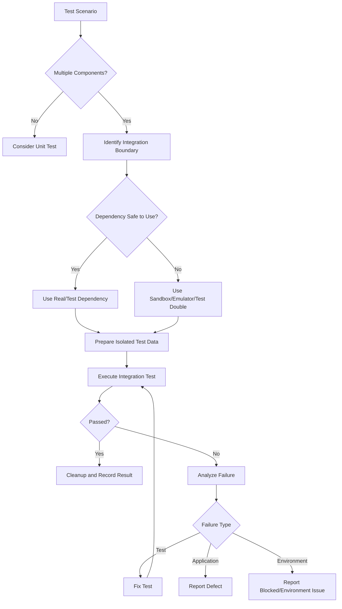

# Integration Testing Skill

## Purpose

This skill defines standards for designing, creating, executing, and reporting integration tests.

Integration tests verify that multiple components work correctly together across real or realistic boundaries.

Typical integrations include:

- Application ↔ Database
- Service ↔ Repository
- Service ↔ Service
- Application ↔ Cache
- Producer ↔ Message Broker
- Consumer ↔ Message Broker
- Application ↔ File/Object Storage
- Application ↔ External API
- Application ↔ Identity Provider
- Application ↔ Infrastructure Dependency

This skill is:

- Domain-neutral
- Language-neutral
- Framework-neutral
- Platform-neutral
- Cloud-neutral
- Vendor-neutral

---

# Objectives

Integration tests should verify:

- Components communicate correctly.
- Data crosses boundaries correctly.
- Configuration works correctly.
- Serialization/deserialization works.
- Persistence works.
- Transactions behave correctly.
- External dependency contracts are respected.
- Authentication between components works where applicable.
- Failures propagate correctly.
- Integration behavior remains stable after changes.

---

# Core Principle

Unit tests answer:

```text
Does this component work correctly in isolation?
```

Integration tests answer:

```text
Do these components work correctly together?
```

Example:

```text
Service
   ↓
Repository
   ↓
Database
```

A meaningful integration test should exercise the actual integration boundary whenever practical.

---

# Integration Testing Workflow

```text
Inspect Requirements
        ↓
Inspect Architecture
        ↓
Identify Integration Boundaries
        ↓
Identify Existing Tests
        ↓
Design Test Scenarios
        ↓
Prepare Test Environment
        ↓
Prepare Test Data
        ↓
Execute Integration Tests
        ↓
Validate Cross-Component Behavior
        ↓
Cleanup
        ↓
Analyze Results
        ↓
Report
```

---

# 1. Discover Integration Boundaries

Before creating tests, inspect:

- PRD
- Architecture documentation
- Source code
- Dependency configuration
- Database access
- APIs
- Queues/topics
- Caches
- Storage
- External services
- Authentication mechanisms
- Existing integration tests
- Existing test infrastructure

When available, inspect:

```text
docs/PRD.md
docs/Architecture-Design.md
```

Identify boundaries such as:

```text
Component A
    ↓
Component B
```

and determine which boundaries are important enough to test.

---

# 2. Common Integration Types

Evaluate applicable integration types.

## Database Integration

```text
Application
    ↓
Data Access
    ↓
Database
```

Validate:

- Connection
- Queries
- Persistence
- Updates
- Deletes
- Constraints
- Relationships
- Transactions
- Data mapping

---

## Repository Integration

Validate repository/data-access components against a real or realistic persistence implementation.

Avoid mocking the persistence layer when the purpose of the test is to validate persistence integration.

---

## Service-to-Service Integration

```text
Service A
    ↓
Service B
```

Validate:

- Request construction
- Authentication
- Serialization
- Response handling
- Error handling
- Timeout behavior where applicable

---

## Messaging Integration

```text
Producer
    ↓
Queue / Topic
    ↓
Consumer
```

Validate applicable:

- Message publishing
- Serialization
- Message consumption
- Routing
- Metadata
- Duplicate handling
- Failure behavior

---

## Cache Integration

Validate:

- Cache connection
- Read
- Write
- Expiration
- Key behavior
- Cache miss
- Invalidation where applicable

Do not duplicate detailed caching performance testing here.

---

## Storage Integration

For file/object storage validate applicable:

- Upload
- Download
- Delete
- Metadata
- Content
- Missing objects
- Access behavior

Use isolated test data.

---

## External API Integration

Where practical, validate integration with:

- Test environment
- Sandbox
- Emulator
- Approved mock server

Avoid uncontrolled dependency on production external services.

---

## Authentication Integration

Where components authenticate with each other, validate:

- Credential/token acquisition
- Credential use
- Rejected authentication
- Required permissions

Never store real secrets in test source code.

---

# 3. Real Dependencies vs Test Doubles

Integration tests should use real dependencies where the integration itself is being validated.

Example:

```text
Testing:
Application ↔ Database

Use:
Real/Test Database

Not:
Mock Database
```

However, not every external system should always be real.

Use test doubles when:

- External system is unavailable.
- Calls have financial cost.
- Production access would be unsafe.
- Failure scenarios cannot safely be reproduced.
- Third-party service has no suitable test environment.

The decision should preserve the integration behavior being tested.

---

# 4. Test Environment

Integration tests should run against controlled environments.

Preferred options may include:

```text
Local Test Service

Containerized Dependency

Test Database

Emulator

Sandbox

Dedicated Integration Environment
```

Never assume production should be used for integration testing.

---

# 5. Environment Isolation

Tests should avoid affecting:

- Production data
- Developer data
- Other test runs
- Shared environments unnecessarily

Where possible use isolated:

```text
Database

Schema

Tenant

Namespace

Queue

Container

Test Identifier
```

depending on the system.

---

# 6. Test Data

Integration test data should be:

- Predictable
- Non-sensitive
- Reproducible
- Isolated
- Cleanable

Prefer generating data specifically for the test.

Example:

```text
Create Test Data
      ↓
Execute Test
      ↓
Validate
      ↓
Cleanup
```

---

# 7. Unique Test Data

Parallel test execution may require unique identifiers.

Conceptually:

```text
Test Run ID
     +
Test Case ID
     ↓
Unique Test Data
```

This helps prevent collisions between test runs.

---

# 8. Cleanup

Integration tests should clean resources they create where appropriate.

Cleanup may include:

- Database records
- Files
- Messages
- Cache entries
- Temporary resources

Cleanup should occur even when tests fail where the framework supports it.

---

# 9. Database Test Cases

For database integration consider applicable:

## Create

```text
Write Record
    ↓
Read Record
    ↓
Verify Persistence
```

## Update

```text
Create
  ↓
Update
  ↓
Read
  ↓
Verify Updated State
```

## Delete

Verify deletion behavior and related constraints.

## Constraints

Test meaningful:

- Required fields
- Unique constraints
- Relationships
- Referential integrity

## Transactions

Where transactions are important, verify:

```text
Success
    ↓
Commit
```

and:

```text
Failure
    ↓
Rollback
```

---

# 10. Data Mapping

Verify data is mapped correctly across boundaries.

Example:

```text
Domain Model
     ↓
Persistence Model
     ↓
Database
```

and back:

```text
Database
    ↓
Persistence Model
    ↓
Domain Model
```

Test meaningful type, field, nullability, and transformation behavior.

---

# 11. Serialization Testing

Where components exchange structured data, verify:

```text
Object
   ↓
Serialize
   ↓
Transport / Storage
   ↓
Deserialize
   ↓
Equivalent Expected Data
```

Consider:

- Required fields
- Optional fields
- Data types
- Dates/times
- Enumerations
- Nested objects

---

# 12. Configuration Integration

Integration failures frequently result from configuration rather than business logic.

Validate relevant:

- Connection configuration
- Endpoints
- Credentials
- Database names
- Queue/topic names
- Storage locations
- Feature configuration

Secrets must come from approved environment or secret-management mechanisms.

---

# 13. Positive Scenarios

Validate expected successful interactions.

Example:

```text
Application
    ↓
Database Write
    ↓
Successful Persistence
```

---

# 14. Negative Scenarios

Consider applicable:

- Invalid data
- Missing record
- Invalid credentials
- Rejected request
- Duplicate data
- Constraint violation
- Dependency failure

Verify expected application behavior.

---

# 15. Boundary Scenarios

Test boundaries that cross integration layers.

Examples:

- Maximum supported payload
- Empty result
- Single result
- Multiple results
- Optional fields
- Data size limits

Do not create artificial boundary tests without a requirement or meaningful risk.

---

# 16. Failure Scenarios

Where safely reproducible, test:

```text
Dependency Unavailable

Connection Failure

Timeout

Rejected Authentication

Invalid Response

Malformed Message

Database Constraint Failure
```

Verify that the application fails predictably.

---

# 17. Timeout Testing

Where timeout behavior is part of the integration contract, verify it using controlled mechanisms.

Avoid tests that rely on long arbitrary waits.

---

# 18. Retry Testing

Where retries are implemented, verify:

```text
Transient Failure
      ↓
Retry
      ↓
Success
```

and where applicable:

```text
Repeated Failure
      ↓
Retry Limit Reached
      ↓
Expected Failure
```

Do not create tests that generate uncontrolled retry storms.

---

# 19. Idempotency

Where integrations may receive duplicate requests/messages, verify duplicate processing behavior.

Example:

```text
Same Operation
      ↓
Executed Twice
      ↓
No Unintended Duplicate Effect
```

Only where idempotency is required.

---

# 20. Messaging Tests

For queues/events consider:

- Correct message published
- Correct destination
- Correct payload
- Correct metadata
- Consumer receives message
- Consumer processes message
- Invalid message handling
- Duplicate message behavior
- Retry/dead-letter behavior where applicable

Avoid assuming message processing is immediate.

Use deterministic waiting/polling mechanisms where available.

---

# 21. Eventual Consistency

Some integrations are asynchronous.

Example:

```text
Write
 ↓
Event
 ↓
Consumer
 ↓
Eventually Updated State
```

Tests should verify eventual outcomes using bounded polling or event synchronization.

Avoid:

```text
Sleep 10 seconds
```

as the primary synchronization strategy.

---

# 22. External API Tests

For third-party integrations validate applicable:

```text
Request Construction

Headers

Authentication

Payload

Response Mapping

Error Mapping

Timeout

Rate-Limit Response
```

Use sandbox/test endpoints where available.

---

# 23. Contract Boundaries

Integration tests should detect mismatches such as:

```text
Field Renamed

Type Changed

Required Field Missing

Unexpected Response

Serialization Difference
```

Detailed API contract testing belongs to:

```text
api-testing.md
```

---

# 24. Authentication and Authorization

For secured integrations test applicable:

```text
Valid Identity
    ↓
Access Allowed

Invalid Identity
    ↓
Access Denied

Valid Identity + Missing Permission
    ↓
Access Denied
```

Never weaken authentication to make integration tests easier.

---

# 25. Concurrency

Where multiple components modify shared data, consider:

- Concurrent updates
- Duplicate requests
- Lost updates
- Transaction conflicts

Use integration tests when the real persistence or coordination boundary matters.

Refer to:

```text
engineering/concurrency.md
```

---

# 26. Integration Test Independence

Tests should not unnecessarily depend on execution order.

Avoid:

```text
Test 1 creates record

Test 2 updates Test 1 record

Test 3 deletes Test 1 record
```

Prefer each test to prepare its required state.

---

# 27. Parallel Execution

If integration tests execute concurrently:

- Isolate test data.
- Avoid shared identifiers.
- Avoid shared mutable configuration.
- Prevent resource collisions.

If dependencies cannot safely support parallel tests, configure the relevant suite accordingly.

---

# 28. Integration Test Structure

Follow repository conventions.

A generic structure may be:

```text
tests/
├── integration/
│   ├── database/
│   ├── messaging/
│   ├── storage/
│   └── services/
│
└── test-cases/
    └── test-cases.md
```

Do not restructure an existing test suite unnecessarily.

---

# 29. Test Case Documentation

Integration scenarios should be included in:

```text
tests/test-cases/test-cases.md
```

Example:

```markdown
| ID | Requirement | Feature | Test Type | Scenario | Preconditions | Steps | Expected Result | Priority | Automation |
|----|-------------|---------|-----------|----------|---------------|-------|-----------------|----------|------------|
| TC-040 | REQ-08 | Orders | Integration | Save order to database | Test DB available | Create order through service | Order persists correctly | High | Yes |
| TC-041 | REQ-08 | Orders | Integration | Rollback failed transaction | Test DB available | Trigger transactional failure | No partial data persists | High | Yes |
```

---

# 30. Traceability

Maintain:

```text
Requirement
    ↓
Test Case
    ↓
Integration Test
    ↓
Execution Result
```

Where practical, automated test names should contain the test-case ID.

---

# 31. Integration Test Execution

Use the repository's established command.

Conceptually:

```bash
<test-command> integration
```

or:

```bash
<test-command> --filter integration
```

The exact command must be discovered from:

- Project configuration
- Package scripts
- Build files
- Existing documentation

Do not invent commands when repository conventions exist.

---

# 32. Environment Readiness

Before execution verify required dependencies are available.

Conceptually:

```text
Database Ready?

Queue Ready?

Storage Ready?

Required Service Ready?

Configuration Available?
```

If required infrastructure is unavailable, report the test as blocked rather than falsely reporting failure or success.

---

# 33. Failure Analysis

When an integration test fails:

```text
Test Failure
     ↓
Inspect Test
     ↓
Inspect Application Logs
     ↓
Inspect Dependency
     ↓
Inspect Test Data
     ↓
Determine Root Cause
```

Classify failures as:

```text
Application Defect

Integration Defect

Test Defect

Environment Failure

Configuration Failure

Test Data Failure

External Dependency Failure
```

---

# 34. Do Not Hide Integration Defects

Do not replace a real integration with a mock merely because the integration test fails.

First determine why the real integration failed.

---

# 35. Logging and Evidence

Where available, retain useful evidence such as:

- Test output
- Application logs
- Dependency logs
- Error responses
- Correlation IDs
- Relevant test data identifiers

Never include secrets or sensitive information in reports.

---

# 36. Integration Test Reporting

Report actual results:

```text
Integration Test Results

Total:
Passed:
Failed:
Skipped:
Blocked:

Environment:

Dependencies Tested:

Duration:
```

Do not claim execution when dependencies were unavailable.

---

# 37. Coverage

Traditional line coverage alone is not sufficient for integration testing.

Focus on:

```text
Integration Boundary Coverage

Critical Workflow Coverage

Failure Path Coverage

Dependency Coverage
```

Example:

```text
Database       ✓

Message Broker ✓

Cache          ✓

External API   Not Tested
```

---

# 38. Integration Coverage Matrix

Where useful, summarize:

| Integration | Positive | Negative | Failure | Status |
|---|---|---|---|---|
| Database | ✓ | ✓ | ✓ | Covered |
| Cache | ✓ | ✓ | — | Covered |
| Message Broker | ✓ | ✓ | ✓ | Covered |
| External Service | ✓ | — | — | Partial |

Only include integrations that actually exist.

---

# 39. AI-Generated Integration Test Risks

AI agents may incorrectly:

- Mock the integration being tested.
- Use production services.
- Hardcode credentials.
- Assume dependencies exist.
- Create order-dependent tests.
- Leave test data behind.
- Use arbitrary sleeps.
- Ignore eventual consistency.
- Invent connection configuration.
- Invent test commands.
- Ignore transactions.
- Ignore asynchronous failures.
- Treat environment failures as application defects.

Generated integration tests must therefore be reviewed and executed.

---

# Testing Agent Integration Workflow

## 1. Inspect

Review:

```text
Requirements
Architecture
Source Code
Configuration
Existing Integration Tests
```

## 2. Discover Boundaries

Identify:

```text
Database

Services

Messaging

Cache

Storage

External APIs

Authentication
```

as applicable.

## 3. Assess Existing Coverage

Avoid duplicate integration tests.

## 4. Design Test Cases

Add applicable integration cases to:

```text
tests/test-cases/test-cases.md
```

## 5. Prepare Environment

Ensure required dependencies are available.

## 6. Prepare Test Data

Create isolated test data.

## 7. Implement Tests

Use real or realistic integration boundaries.

## 8. Execute

Run the appropriate integration test suite.

## 9. Validate

Verify:

```text
Cross-Component Behavior
Data
Errors
Side Effects
```

## 10. Cleanup

Remove temporary test state.

## 11. Analyze Failures

Classify failures correctly.

## 12. Report

Provide actual results and coverage gaps.

---

# Testing Agent Rules

The agent should:

- ALWAYS inspect architecture before designing significant integration tests.
- ALWAYS identify the actual integration boundary.
- ALWAYS inspect existing integration tests.
- ALWAYS use repository testing conventions.
- ALWAYS use real or realistic dependencies when validating the integration itself.
- ALWAYS isolate test data where practical.
- ALWAYS clean created resources where appropriate.
- ALWAYS consider positive scenarios.
- ALWAYS consider negative scenarios.
- ALWAYS consider meaningful failure scenarios.
- ALWAYS test transactions where transactional behavior matters.
- ALWAYS consider serialization across boundaries.
- ALWAYS consider authentication where integrations are secured.
- ALWAYS consider asynchronous behavior where messaging exists.
- ALWAYS use bounded waiting for eventual consistency.
- ALWAYS execute integration tests when required dependencies are available.
- ALWAYS distinguish environment failures from application defects.
- ALWAYS report untested integrations and execution limitations.

The agent should:

- NEVER mock the exact integration boundary being validated without a justified reason.
- NEVER use production data for routine integration testing.
- NEVER hardcode credentials.
- NEVER commit test secrets.
- NEVER depend unnecessarily on test execution order.
- NEVER use uncontrolled shared test data.
- NEVER leave temporary resources intentionally without reason.
- NEVER rely primarily on arbitrary sleeps.
- NEVER assume asynchronous operations complete immediately.
- NEVER disable security to make tests pass.
- NEVER replace failing real integration tests with mocks merely to obtain success.
- NEVER classify every failed integration test as an application defect.
- NEVER claim tests passed without execution.
- NEVER claim an unavailable dependency was successfully tested.

---

# Integration Test Decision Flow



---

# Integration Testing Model

```text
Requirement
    ↓
Architecture
    ↓
Integration Boundary
    ↓
Test Scenario
    ↓
Controlled Environment
    ↓
Realistic Dependency
    ↓
Execution
    ↓
Validation
    ↓
Cleanup
    ↓
Report
```

---

# Validation Checklist

Before integration testing is considered complete:

- [ ] Requirements were reviewed.
- [ ] Architecture was reviewed.
- [ ] Integration boundaries were identified.
- [ ] Existing integration tests were inspected.
- [ ] Existing test infrastructure was identified.
- [ ] Database integrations were considered.
- [ ] Service integrations were considered.
- [ ] Messaging integrations were considered.
- [ ] Cache integrations were considered.
- [ ] Storage integrations were considered.
- [ ] External API integrations were considered.
- [ ] Authentication integrations were considered.
- [ ] Positive scenarios were covered.
- [ ] Negative scenarios were covered.
- [ ] Relevant failure scenarios were covered.
- [ ] Serialization was validated where applicable.
- [ ] Transactions were tested where applicable.
- [ ] Idempotency was considered where applicable.
- [ ] Eventual consistency was handled correctly.
- [ ] Test environment was controlled.
- [ ] Test data was isolated.
- [ ] Secrets were protected.
- [ ] Cleanup was implemented where required.
- [ ] Parallel execution conflicts were considered.
- [ ] Integration test cases were documented.
- [ ] Test IDs are traceable.
- [ ] Tests were executed when dependencies were available.
- [ ] Failures were analyzed.
- [ ] Environment failures were distinguished from application defects.
- [ ] Integration coverage gaps were identified.
- [ ] Actual results were reported.
- [ ] Execution limitations were reported.

---

# Completion Criteria

Integration testing is complete when applicable:

```text
Integration Boundaries Identified
        +
Test Cases Documented
        +
Environment Prepared
        +
Tests Implemented
        +
Tests Executed
        +
Cross-Component Behavior Validated
        +
Failures Analyzed
        +
Cleanup Completed
        +
Results Reported
```

The Testing Agent must distinguish:

```text
Integration Test Created
```

from:

```text
Integration Test Executed
```

from:

```text
Integration Verified Successfully
```

These are different states.

---

# Relationship With Other Testing Skills

```text
test-case-design.md
        ↓
unit-testing.md
        ↓
integration-testing.md
        ↓
api-testing.md
        ↓
playwright-testing.md
        ↓
non-functional-testing.md
        ↓
defect-reporting.md
```

Integration testing should complement rather than duplicate unit and E2E testing.

Use:

```text
Unit Tests
    ↓
Detailed isolated logic

Integration Tests
    ↓
Component boundaries

API Tests
    ↓
API behavior and contracts

Playwright
    ↓
Critical browser/user workflows
```

---

# Final Principle

Integration testing should answer:

```text
Do the real components that must work together
actually work together correctly?
```

The goal is not to test every business-rule permutation through real infrastructure.

Use:

```text
Unit Tests
    ↓
Detailed Logic

Integration Tests
    ↓
Critical Boundaries

E2E Tests
    ↓
Critical Complete Workflows
```

This provides strong confidence without creating unnecessarily slow, fragile, or duplicated test suites.
