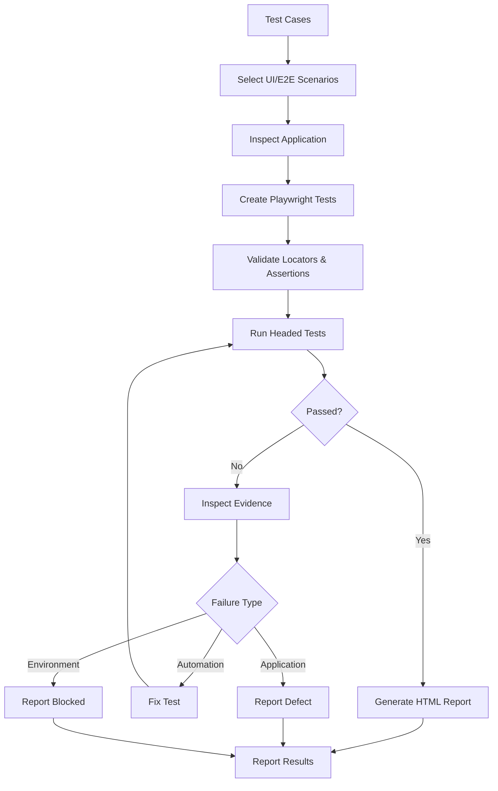

# Playwright Testing Skill

## Purpose

This skill defines standards for creating, executing, validating, and reporting browser-based automated tests using Playwright.

Use Playwright primarily for:

- UI testing
- Browser testing
- End-to-end testing
- Critical user journeys
- Form validation
- Navigation
- Authentication flows
- Role-based UI behavior
- Responsive behavior
- Cross-browser validation
- Accessibility checks where configured

Do not use Playwright as a replacement for unit or integration testing.

---

# Core Principle

Playwright should validate application behavior from the user's perspective.

```text
User Action
    ↓
Browser
    ↓
Application
    ↓
Expected Visible Behavior
```

Prefer testing complete meaningful workflows rather than implementation details.

---

# Inputs

Before generating Playwright tests inspect:

- PRD
- Acceptance criteria
- Architecture documentation
- `tests/test-cases/test-cases.md`
- Application routes/pages
- Existing Playwright tests
- Existing Playwright configuration
- Authentication model
- User roles
- Existing test data
- Package/build scripts

Do not invent application behavior.

---

# Playwright Workflow

```text
Inspect Test Cases
        ↓
Identify Browser Scenarios
        ↓
Inspect Existing Tests
        ↓
Create/Update Playwright Tests
        ↓
Validate Locators & Assertions
        ↓
Run Headed Tests
        ↓
Capture Failure Evidence
        ↓
Generate HTML Report
        ↓
Analyze Failures
        ↓
Report Results
```

---

# 1. Select Playwright Test Cases

From:

```text
tests/test-cases/test-cases.md
```

select applicable:

```text
UI

E2E

Functional

Regression

Smoke

Authentication

Authorization

Validation

Responsive

Accessibility

Cross-Browser
```

test cases.

Do not automate unit-level business logic through the browser when it can be tested more effectively at a lower level.

---

# 2. Test Organization

Follow existing repository conventions.

If no structure exists, prefer:

```text
tests/
├── e2e/
│   ├── authentication.spec.*
│   ├── navigation.spec.*
│   ├── feature-a.spec.*
│   └── feature-b.spec.*
│
├── pages/
│   ├── login.page.*
│   └── feature.page.*
│
└── test-cases/
    └── test-cases.md

playwright.config.*
```

Do not restructure an existing test suite unnecessarily.

---

# 3. Test Naming

Test names should clearly describe behavior.

Prefer:

```text
TC-101 - user can create a record successfully
```

instead of:

```text
create test
```

Where practical maintain:

```text
Test Case ID
    ↓
Playwright Test
    ↓
Execution Result
```

---

# 4. Locator Strategy

Prefer resilient Playwright locators.

Recommended order:

```text
getByRole()
    ↓
getByLabel()
    ↓
getByPlaceholder()
    ↓
getByText()
    ↓
getByTestId()
```

Use CSS selectors only when appropriate.

Avoid fragile selectors based on:

- DOM hierarchy
- Generated classes
- Styling
- Element position
- Long XPath expressions

Tests should interact with the application similarly to a real user.

---

# 5. Assertions

Every test must verify meaningful observable behavior.

Examples:

```text
Page is displayed

Expected text appears

URL changes

Record appears

Validation message appears

Button state changes

Dialog opens

Data is updated

User is redirected
```

Do not create tests that perform actions without validating the result.

Prefer Playwright's web-first assertions where available.

---

# 6. Positive Tests

Validate successful workflows.

Example:

```text
Open Form
    ↓
Enter Valid Data
    ↓
Submit
    ↓
Verify Success
```

---

# 7. Negative Tests

Validate applicable failure behavior:

- Invalid input
- Missing required values
- Invalid credentials
- Unauthorized actions
- Invalid navigation
- Failed operation
- Missing resource

Verify the visible expected behavior.

---

# 8. Form Validation

For applicable fields consider:

```text
Required

Empty

Valid

Invalid

Format

Minimum

Maximum

Length

Unsupported Value
```

Do not duplicate every validation permutation already sufficiently covered by unit/API tests.

Focus Playwright validation on important user-visible behavior.

---

# 9. Complete User Journeys

Critical workflows should be tested end-to-end where appropriate.

Example:

```text
Login
  ↓
Navigate
  ↓
Create
  ↓
Verify
  ↓
Edit
  ↓
Verify
  ↓
Delete
  ↓
Verify
```

Only perform destructive operations against approved test environments and test data.

---

# 10. Authentication

Where authentication exists test applicable:

```text
Valid Login

Invalid Login

Logout

Protected Route

Session Behavior
```

Use environment variables or approved secret mechanisms for credentials.

Never commit credentials into Playwright tests.

---

# 11. Authorization

Where roles exist verify:

```text
Role A
  ↓
Allowed Functionality
```

and:

```text
Role B
  ↓
Restricted Functionality
```

UI authorization tests complement API/server-side authorization tests.

Hidden UI elements alone do not prove authorization security.

---

# 12. Page Object Model

Use Page Objects when they improve reuse and maintainability.

Page objects may contain:

- Locators
- Navigation
- Reusable UI interactions

Conceptually:

```text
Test
 ↓
Page Object
 ↓
Browser UI
```

Do not create unnecessary page objects for trivial components.

Keep important behavioral assertions visible in tests where practical.

---

# 13. Test Isolation

Tests should be independently executable where practical.

Avoid:

```text
Test B depends on Test A
```

Each test should prepare its required state.

Use setup/cleanup mechanisms when appropriate.

---

# 14. Test Data

Test data should be:

- Predictable
- Non-sensitive
- Reproducible
- Isolated
- Cleanable

Use unique identifiers where parallel tests could collide.

Never use real personal or production data unnecessarily.

---

# 15. Waiting Strategy

Use Playwright's automatic waiting and event-based synchronization.

Prefer:

```text
Locator Assertions

waitForURL

waitForResponse

waitForLoadState

Expected Element State
```

where appropriate.

Avoid:

```text
waitForTimeout(...)
```

unless there is a documented exceptional reason.

Wait for application state, not arbitrary time.

---

# 16. Browser Coverage

Use browser projects defined by the repository.

Where cross-browser testing is required, Playwright can validate:

```text
Chromium

Firefox

WebKit
```

Do not require all browsers unless project requirements call for them.

---

# 17. Responsive Testing

Where responsive UI is required, test representative configured viewports such as:

```text
Desktop

Tablet

Mobile
```

Validate:

- Navigation
- Layout usability
- Visible controls
- Critical workflows

Do not rely only on screenshots.

---

# 18. Accessibility

Where accessibility testing is configured, validate applicable:

- Accessible names
- Form labels
- Keyboard interaction
- Focus behavior
- Semantic structure
- Automated accessibility violations

Automated accessibility tests do not replace required manual accessibility review.

---

# 19. Playwright Configuration

Use or update `playwright.config.*` appropriately.

Configuration may include:

```text
testDir

baseURL

projects

timeouts

retries

reporter

screenshots

video

trace
```

Prefer central configuration over duplicated settings in individual tests.

---

# 20. Failure Evidence

Configure useful evidence for failed tests.

Recommended defaults where appropriate:

```text
Screenshot
    → only-on-failure

Video
    → retain-on-failure

Trace
    → retain-on-failure
```

Repository-specific configuration takes precedence.

Artifacts must not expose secrets or sensitive information.

---

# 21. Headed Mode Execution

Whenever the user asks to run Playwright tests, execute the requested tests in headed mode. Pass `--headed` through the repository's configured Playwright command. Do not treat a headless run as satisfying a request to run Playwright tests; a headless run may be performed only as clearly labeled supplemental evidence.

Typical command:

```bash
npx playwright test --headed
```

Specific browser:

```bash
npx playwright test --project=chromium --headed
```

Specific test:

```bash
npx playwright test tests/e2e/feature.spec.ts --headed
```

Prefer repository package scripts when available.

Example:

```bash
npm run test:e2e -- --headed
```

Do not invent commands when the repository defines them.

---

# 22. Headed Mode Validation

Headed mode should visibly exercise browser interactions where supported.

Validate:

- Page loading
- Navigation
- Forms
- Buttons
- Dialogs
- User workflows
- Success states
- Error states

If the execution environment does not support headed browser sessions, report:

```text
Headed execution unavailable in current environment.
```

Mark the requested Playwright execution as `BLOCKED`, explain the environment limitation, and do not claim headed execution succeeded when it was not performed or was not observable. Do not silently substitute headless execution.

---

# 23. Targeted Execution

During test creation, run relevant tests first.

Example:

```bash
npx playwright test tests/e2e/feature.spec.ts --headed
```

After targeted tests succeed, run the appropriate broader Playwright suite.

---

# 24. Cross-Browser Execution

Where required:

```bash
npx playwright test --project=chromium --headed
npx playwright test --project=firefox --headed
npx playwright test --project=webkit --headed
```

Use only configured/supported projects.

---

# 25. Retries

Retries may help diagnose transient failures but must not hide flaky tests.

If a test repeatedly requires retries:

```text
Investigate
    ↓
Synchronization?
Test Data?
Environment?
Application Defect?
```

Do not consider flaky tests acceptable simply because retries eventually pass.

---

# 26. Failure Analysis

When a Playwright test fails inspect:

```text
Error
  ↓
Screenshot
  ↓
Trace
  ↓
Video
  ↓
Application Behavior
```

Classify the failure as:

```text
Application Defect

Automation Defect

Environment Failure

Test Data Failure

Configuration Failure
```

Do not immediately modify the assertion.

---

# 27. Playwright Trace

When traces are available, use them to inspect:

- Actions
- DOM snapshots
- Network activity
- Console output
- Screenshots
- Timing

Trace evidence is especially useful for intermittent or CI failures.

---

# 28. Screenshots and Video

Use screenshots/video primarily as diagnostic evidence.

Avoid generating unnecessary artifacts for every successful test unless project policy requires them.

---

# 29. HTML Report Generation

Configure the Playwright HTML reporter.

Example:

```text
reporter: html
```

After test execution, the typical report location is:

```text
playwright-report/
```

The exact location should follow project configuration.

---

# 30. Open HTML Report

Where the environment supports it:

```bash
npx playwright show-report
```

Use the report to inspect:

- Passed tests
- Failed tests
- Skipped tests
- Duration
- Failure messages
- Screenshots
- Traces
- Videos/attachments

---

# 31. Test Result Reporting

After execution provide actual results.

Example:

```text
Playwright Results

Total: 45
Passed: 42
Failed: 2
Skipped: 1

Execution Mode:
Headed

Browsers:
Chromium

Report:
playwright-report/index.html
```

Only report values produced by actual execution.

---

# 32. Failure Reporting

For failed tests capture:

```text
Test Case ID

Scenario

Expected Result

Actual Result

Failure Classification

Evidence Location
```

Detailed defect creation should follow:

```text
defect-reporting.md
```

---

# 33. Smoke Suite

Critical browser smoke tests should remain small and fast.

Typical coverage:

```text
Application Loads

Login Works

Critical Page Opens

Primary Workflow Works
```

Do not place the entire E2E suite into smoke testing.

---

# 34. Regression Suite

Regression Playwright tests should focus on:

- Critical workflows
- Previously failed functionality
- High-risk behavior
- Cross-feature dependencies

Avoid duplicating every lower-level test through the browser.

---

# 35. AI-Generated Playwright Risks

AI-generated browser tests may contain:

- Invented selectors
- Fragile selectors
- Invalid routes
- Unsupported assumptions
- Arbitrary waits
- Missing assertions
- Hardcoded credentials
- Order dependencies
- Incorrect test data
- Tests that never reach intended functionality

Generated tests must therefore be inspected and executed.

---

# Testing Agent Playwright Workflow

## 1. Inspect

Review:

```text
PRD
Test Cases
Application
Existing Playwright Tests
Playwright Configuration
```

## 2. Select

Identify applicable UI/E2E scenarios.

## 3. Implement

Create/update Playwright tests.

## 4. Review

Validate:

```text
Locators
Assertions
Test Data
Isolation
Waiting
Security
```

## 5. Execute Targeted Tests

Run relevant tests in headed mode.

## 6. Execute Suite

Run the appropriate Playwright suite in headed mode.

## 7. Investigate Failures

Inspect:

```text
Error
Screenshot
Trace
Video
```

## 8. Generate Report

Generate/preserve:

```text
playwright-report/
```

## 9. Report

Provide actual results, failures, evidence, and limitations.

---

# Testing Agent Rules

The agent should:

- ALWAYS inspect `test-cases.md` before generating Playwright tests.
- ALWAYS inspect existing Playwright tests and configuration.
- ALWAYS reuse repository conventions.
- ALWAYS use stable locators.
- ALWAYS create meaningful assertions.
- ALWAYS cover critical user workflows.
- ALWAYS include applicable positive and negative UI scenarios.
- ALWAYS protect credentials.
- ALWAYS keep tests isolated where practical.
- ALWAYS prefer automatic/event-based waiting.
- ALWAYS execute generated tests when possible.
- ALWAYS run requested Playwright test execution in headed mode.
- ALWAYS mark the requested run `BLOCKED` when headed execution is unavailable or unobservable.
- ALWAYS investigate failures before modifying tests.
- ALWAYS retain useful failure evidence.
- ALWAYS generate/preserve the HTML report.
- ALWAYS report actual execution results.

The agent should:

- NEVER use Playwright to replace appropriate unit tests.
- NEVER use Playwright to replace appropriate integration tests.
- NEVER invent UI behavior.
- NEVER invent selectors without inspecting the application.
- NEVER hardcode real credentials.
- NEVER rely unnecessarily on arbitrary waits.
- NEVER create action-only tests without assertions.
- NEVER make tests unnecessarily order-dependent.
- NEVER remove valid assertions to obtain passing tests.
- NEVER hide flaky tests using retries.
- NEVER claim headed execution occurred when it did not.
- NEVER substitute a headless run for a user-requested Playwright execution.
- NEVER claim tests passed without execution.
- NEVER claim report generation succeeded unless the report exists.

---

# Playwright Testing Flow



---

# Validation Checklist

Before Playwright testing is complete:

- [ ] PRD/requirements were reviewed where available.
- [ ] `test-cases.md` was reviewed.
- [ ] Existing Playwright tests were inspected.
- [ ] Playwright configuration was inspected.
- [ ] Relevant UI/E2E scenarios were identified.
- [ ] Critical user journeys were covered.
- [ ] Positive scenarios were covered.
- [ ] Negative scenarios were covered.
- [ ] Important validation behavior was covered.
- [ ] Authentication was covered where applicable.
- [ ] Authorization UI behavior was covered where applicable.
- [ ] Stable locators were used.
- [ ] Meaningful assertions exist.
- [ ] Tests are sufficiently isolated.
- [ ] Test data is controlled.
- [ ] Credentials are protected.
- [ ] Arbitrary waits were avoided.
- [ ] Responsive behavior was considered where applicable.
- [ ] Cross-browser behavior was considered where required.
- [ ] Accessibility was considered where applicable.
- [ ] Screenshots are configured for failures.
- [ ] Traces are configured appropriately.
- [ ] Videos are configured appropriately.
- [ ] Targeted tests were executed.
- [ ] Appropriate suite was executed.
- [ ] Headed mode was used where required and supported.
- [ ] Failures were investigated.
- [ ] HTML report was generated/preserved.
- [ ] Actual pass/fail/skip results were reported.
- [ ] Execution limitations were reported.

---

# Completion Criteria

Playwright testing is complete when applicable:

```text
Test Cases Selected
        +
Playwright Tests Created
        +
Locators Validated
        +
Assertions Validated
        +
Headed Tests Executed
        +
Failures Investigated
        +
Evidence Captured
        +
HTML Report Generated
        +
Results Reported
```

The Testing Agent must distinguish:

```text
Tests Generated
```

from:

```text
Tests Executed
```

from:

```text
Tests Passed
```

These are different states.

---

# Relationship With Testing Skills

```text
test-case-design.md
        ↓
unit-testing.md
        ↓
integration-testing.md
        ↓
api-testing.md
        ↓
playwright-testing.md
        ↓
non-functional-testing.md
        ↓
defect-reporting.md
```

Playwright should primarily cover:

```text
Critical UI Behavior
        +
Critical User Journeys
        +
Browser Integration
```

while lower-level testing handles detailed logic and component behavior.

---

# Final Principle

Playwright testing should answer:

```text
Can a real user successfully perform
the required application workflows
through a supported browser?
```

The required lifecycle is:

```text
Test Case
    ↓
Playwright Test
    ↓
Headed Browser Execution
    ↓
Assertion
    ↓
Evidence
    ↓
HTML Report
    ↓
Result
```

Generating Playwright code without executing and validating it is not complete browser testing.
