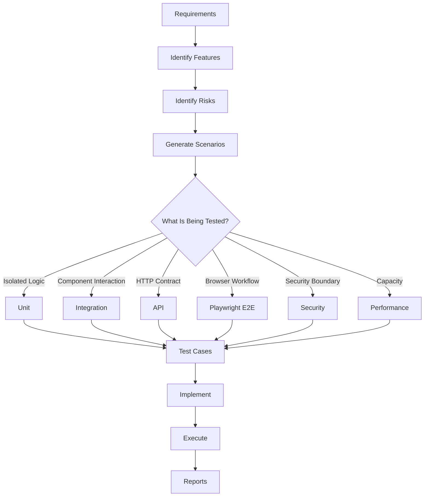

# Test Case Design Skill

## Purpose

This skill defines standards for analyzing requirements and identifying comprehensive test coverage before automated or manual tests are implemented.

The Testing Agent must determine all applicable testing types rather than focusing only on UI or Playwright testing.

The objective is:

```text
Requirements
    ↓
Features
    ↓
Risks
    ↓
Test Scenarios
    ↓
Test Cases
    ↓
Automation
    ↓
Execution
    ↓
Evidence
    ↓
Report
```

This skill is:

- Domain-neutral
- Language-neutral
- Framework-neutral
- Platform-neutral
- Vendor-neutral

---

# Core Principle

Do not begin by asking:

> What Playwright tests should I create?

First ask:

> What needs to be tested?

Then determine the appropriate testing level and tool.

For example:

```text
Business Logic
    ↓
Unit Test

Component Interaction
    ↓
Integration Test

API Contract
    ↓
API Test

Complete User Workflow
    ↓
Playwright E2E Test
```

Playwright must not replace lower-level tests.

---

# Requirement Analysis

Before generating test cases, inspect available:

- PRD
- User stories
- Acceptance criteria
- Architecture documentation
- API specifications
- Business rules
- Source code
- Existing tests
- Database behavior
- UI workflows
- Authentication model
- Authorization model
- External integrations
- Error handling
- Non-functional requirements

When available, inspect:

```text
docs/PRD.md
docs/Architecture-Design.md
```

Do not invent unsupported requirements.

---

# Testing Types

The Testing Agent must evaluate whether each of the following applies.

## Unit Testing

Validate isolated:

- Functions
- Methods
- Classes
- Business rules
- Calculations
- Validators
- Transformations
- Utilities

Use the repository's language-specific unit testing framework.

---

## Component Testing

Validate a component as a meaningful unit with limited external dependencies.

Examples:

- UI component
- Service component
- Processing component
- Module

Use when unit tests are insufficient but full system execution is unnecessary.

---

## Integration Testing

Validate interaction between components.

Examples:

```text
Service ↔ Database

Service ↔ Repository

Application ↔ Cache

Application ↔ Queue

Service ↔ External Service
```

Integration tests should validate actual boundaries where practical.

---

## API Testing

Validate API behavior including:

- Methods
- Routes
- Request structure
- Response structure
- Status codes
- Headers
- Validation
- Authentication
- Authorization
- Error responses
- Pagination
- Filtering
- Sorting
- Idempotency where required

---

## Functional Testing

Verify that implemented behavior satisfies functional requirements.

Test:

```text
Requirement
    ↓
User Action / System Action
    ↓
Expected Behavior
```

---

## End-to-End Testing

Validate complete workflows across system boundaries.

Example:

```text
User
 ↓
UI
 ↓
API
 ↓
Business Logic
 ↓
Database
 ↓
UI Result
```

Use Playwright for applicable browser-based E2E workflows.

---

## UI Testing

Validate:

- Pages
- Forms
- Buttons
- Links
- Dialogs
- Tables
- Navigation
- Dropdowns
- Messages
- Loading states
- Error states

Use Playwright where appropriate.

---

## Validation Testing

For input fields and request models consider:

- Required values
- Optional values
- Empty values
- Invalid formats
- Length limits
- Range limits
- Unsupported values
- Special characters

---

## Positive Testing

Verify valid input produces expected behavior.

---

## Negative Testing

Verify invalid operations fail correctly.

Examples:

- Invalid input
- Missing input
- Invalid credentials
- Unauthorized operation
- Invalid state transition
- Missing resource

---

## Boundary Testing

Test meaningful boundaries:

```text
Minimum

Maximum

Minimum - 1

Maximum + 1

Zero

Empty

Single Item

Maximum Length
```

Only use boundaries that make sense for the requirement.

---

## Equivalence Partitioning

Group similar inputs into logical classes and test representative values.

Example:

```text
Valid Range: 1–100

Invalid:
< 1

Valid:
1–100

Invalid:
> 100
```

Avoid unnecessary tests for every possible value.

---

## Regression Testing

Verify existing functionality still works after changes.

Regression tests should focus on:

- Changed behavior
- Dependent functionality
- Critical existing workflows
- Previously fixed defects

---

## Smoke Testing

Verify critical system functionality after build or deployment.

Typical smoke coverage:

```text
Application Starts

Critical Page Loads

Authentication Works

Critical API Responds

Primary Workflow Works
```

Smoke suites should remain fast.

---

## Sanity Testing

Perform focused validation after a small change or defect fix.

Example:

```text
Bug Fix
   ↓
Verify Fix
   ↓
Verify Closely Related Behavior
```

---

## Authentication Testing

Where authentication exists test applicable:

- Valid login
- Invalid login
- Logout
- Session behavior
- Protected routes
- Expired sessions

Never hardcode real credentials.

---

## Authorization Testing

Where roles or permissions exist test:

```text
Allowed User
    ↓
Allowed Operation

Unauthorized User
    ↓
Denied Operation
```

Test server-side enforcement, not only hidden UI controls.

---

## Security Testing

Identify security-relevant test cases including:

- Input validation
- Authorization
- Authentication
- Injection resistance
- Sensitive information exposure
- Security headers where applicable
- File upload restrictions
- Access-control boundaries

Detailed security testing should follow security-specific standards and approved tooling.

---

## Accessibility Testing

Where UI exists consider:

- Keyboard navigation
- Accessible names
- Form labels
- Focus behavior
- Semantic structure
- Basic accessibility rule violations

Use automated accessibility tooling where configured.

Automation does not replace manual accessibility review when required.

---

## Compatibility Testing

Where required, validate compatibility across:

- Browsers
- Devices
- Viewports
- Supported runtime versions
- Supported API versions

For browser applications, Playwright may cover:

```text
Chromium
Firefox
WebKit
```

according to project requirements.

---

## Responsive Testing

For responsive UI, test relevant viewport categories such as:

```text
Desktop

Tablet

Mobile
```

Validate behavior rather than only screenshots.

---

## Data Testing

Where data processing exists consider:

- Create
- Read
- Update
- Delete
- Data validation
- Data transformation
- Data integrity
- Duplicate data
- Missing data
- Large datasets

---

## Database Testing

Where applicable validate:

- Persistence
- Constraints
- Relationships
- Transactions
- Rollback
- Migrations
- Concurrency behavior
- Data integrity

Avoid destructive tests against production data.

---

## Error Handling Testing

Test meaningful failures such as:

```text
Invalid Request

Dependency Failure

Timeout

Missing Resource

Conflict

Database Failure
```

Verify the system fails predictably and safely.

---

## Resilience Testing

Where applicable evaluate:

- Retry
- Timeout
- Circuit breaker behavior
- Temporary dependency failure
- Recovery
- Duplicate requests

Use controlled environments.

---

## Performance Test Cases

Where performance requirements exist identify cases for:

- Response time
- Throughput
- Concurrent users
- Large datasets
- Resource utilization

Specialized performance tools may be required.

Do not use Playwright as a replacement for dedicated load testing.

---

## Load Testing

Validate behavior under expected workload.

---

## Stress Testing

Validate behavior beyond expected workload and determine degradation characteristics.

---

## Endurance Testing

Validate behavior under sustained workload.

---

## Volume Testing

Validate behavior with large amounts of data.

---

## Recovery Testing

Where applicable verify recovery after:

- Process restart
- Dependency restoration
- Temporary failure
- Connection interruption

---

# Test Pyramid

Prefer appropriate coverage at the lowest practical level.

```text
             E2E
              ▲
             / \
            /   \
       Integration
          /       \
         /         \
        Unit Tests
```

Generally:

```text
Many Unit Tests

Moderate Integration Tests

Focused E2E Tests
```

Do not duplicate every scenario at every testing level.

---

# Selecting the Test Level

Use:

```text
Pure Logic
    ↓
Unit Test

Multiple Internal Components
    ↓
Integration Test

HTTP Contract
    ↓
API Test

Complete Browser Workflow
    ↓
Playwright E2E Test

System Capacity
    ↓
Performance Test

Security Boundary
    ↓
Security Test
```

Select the lowest level that can reliably prove the required behavior.

---

# Test Case Categories

For each feature, evaluate applicable:

```text
Positive
Negative
Boundary
Validation
Functional
Unit
Integration
API
UI
E2E
Regression
Smoke
Sanity
Authentication
Authorization
Security
Accessibility
Compatibility
Responsive
Data
Database
Error Handling
Resilience
Performance
Load
Stress
Endurance
Volume
Recovery
```

Not every feature requires every category.

The agent must determine applicability.

---

# Test Case File

Generate a consolidated test-case document.

Default:

```text
tests/
└── test-cases/
    └── test-cases.md
```

Do not create separate test-case documents for every testing type unless the repository requires it.

---

# Test Case Format

Use:

```markdown
# Test Cases

| ID | Requirement | Feature | Test Type | Scenario | Preconditions | Steps | Expected Result | Priority | Automation |
|----|-------------|---------|-----------|----------|---------------|-------|-----------------|----------|------------|
| TC-001 | REQ-01 | Login | Unit | Validate valid credential model | Valid model | Execute validation | Validation succeeds | High | Yes |
| TC-002 | REQ-01 | Login | API | Login with valid credentials | User exists | Submit login request | Successful response | High | Yes |
| TC-003 | REQ-01 | Login | E2E | User logs in successfully | Application available | Enter credentials and submit | Dashboard displayed | High | Yes |
```

---

# Test Case ID

Use stable identifiers:

```text
TC-001
TC-002
TC-003
```

The ID should remain traceable into automated tests where practical.

Example:

```text
TC-003 - user can login successfully
```

---

# Test Priority

Classify tests using:

```text
Critical
High
Medium
Low
```

Prioritize based on:

- Business impact
- Security
- Frequency
- Failure impact
- Change risk

---

# Automation Decision

Each test case should indicate whether automation is appropriate.

Possible values:

```text
Yes

No

Partial
```

Do not automate tests merely because automation is technically possible.

---

# Avoid Duplicate Tests

Do not test the same behavior unnecessarily at every layer.

Example:

Business calculation:

```text
Detailed permutations
        ↓
Unit Tests

API integration
        ↓
Few API Tests

Complete workflow
        ↓
One/Few E2E Tests
```

This produces faster and more maintainable test suites.

---

# Traceability

Maintain:

```text
Requirement
    ↓
Test Case
    ↓
Automated Test
    ↓
Execution Result
```

This allows the Testing Agent to identify uncovered requirements.

---

# Coverage Analysis

After generating test cases, verify:

```text
Requirements
      ↓
Covered?
```

Identify:

- Covered requirements
- Partially covered requirements
- Uncovered requirements
- Non-automatable requirements

Do not use test count alone as a coverage measure.

---

# Testing Agent Workflow

## 1. Discover

Inspect:

```text
PRD
Architecture
Requirements
Source Code
APIs
Database
Existing Tests
Existing Test Frameworks
```

## 2. Identify Features

Determine application capabilities and critical workflows.

## 3. Analyze Risk

Identify:

```text
Critical Business Logic

Security Boundaries

Data Changes

Integrations

User Workflows

Failure Paths
```

## 4. Select Testing Types

Determine applicable:

```text
Unit
Integration
API
Functional
E2E
UI
Regression
Smoke
Security
Accessibility
Performance
...
```

## 5. Generate Test Cases

Create:

```text
tests/test-cases/test-cases.md
```

## 6. Map Test Levels

Determine which cases belong to:

```text
Unit

Integration

API

Playwright

Other Specialized Testing
```

## 7. Implement

Use the appropriate testing framework for each level.

## 8. Execute

Run applicable tests.

Playwright browser tests should use headed mode when required.

## 9. Collect Results

Capture:

```text
Passed

Failed

Skipped

Blocked
```

## 10. Generate Reports

Generate framework-specific reports.

For Playwright:

```text
playwright-report/
```

## 11. Report Coverage

Summarize tested and untested areas.

---

# Testing Agent Rules

The agent should:

- ALWAYS analyze requirements before generating tests.
- ALWAYS inspect existing testing frameworks.
- ALWAYS identify applicable testing types.
- ALWAYS include unit testing where isolated logic requires it.
- ALWAYS include integration testing where components interact.
- ALWAYS include API testing where APIs exist.
- ALWAYS include Playwright testing where browser workflows exist.
- ALWAYS consider positive cases.
- ALWAYS consider negative cases.
- ALWAYS consider boundary cases.
- ALWAYS consider validation cases.
- ALWAYS consider regression impact.
- ALWAYS consider authentication and authorization where applicable.
- ALWAYS consider security-sensitive scenarios.
- ALWAYS generate a consolidated test-case file.
- ALWAYS maintain requirement-to-test traceability where requirements exist.
- ALWAYS choose the appropriate test level.
- ALWAYS avoid unnecessary duplication between test layers.
- ALWAYS execute tests when execution is available.
- ALWAYS report actual results and limitations.

The agent should:

- NEVER assume Playwright covers all testing requirements.
- NEVER replace unit tests with E2E tests.
- NEVER replace integration tests with UI tests.
- NEVER generate every possible test type when it is irrelevant.
- NEVER create tests only to increase test count.
- NEVER invent unsupported requirements.
- NEVER use production credentials.
- NEVER expose secrets in test files.
- NEVER run destructive tests against production.
- NEVER claim tests passed without execution.
- NEVER claim complete coverage solely from code coverage percentage.

---

# Test Design Flow



---

# Validation Checklist

Before test design is complete verify:

- [ ] Requirements were analyzed.
- [ ] Architecture was inspected where available.
- [ ] Existing tests were inspected.
- [ ] Existing testing frameworks were identified.
- [ ] Critical workflows were identified.
- [ ] Unit test scenarios were considered.
- [ ] Component tests were considered.
- [ ] Integration scenarios were considered.
- [ ] API scenarios were considered.
- [ ] Functional scenarios were considered.
- [ ] E2E scenarios were considered.
- [ ] UI scenarios were considered.
- [ ] Positive scenarios were considered.
- [ ] Negative scenarios were considered.
- [ ] Boundary scenarios were considered.
- [ ] Validation scenarios were considered.
- [ ] Regression scenarios were considered.
- [ ] Smoke scenarios were considered.
- [ ] Authentication scenarios were considered.
- [ ] Authorization scenarios were considered.
- [ ] Security scenarios were considered.
- [ ] Accessibility scenarios were considered.
- [ ] Compatibility scenarios were considered.
- [ ] Responsive scenarios were considered.
- [ ] Data/database scenarios were considered.
- [ ] Error scenarios were considered.
- [ ] Resilience scenarios were considered.
- [ ] Performance-related scenarios were considered.
- [ ] Test levels were selected appropriately.
- [ ] Duplicate testing was minimized.
- [ ] Test cases were documented.
- [ ] Test IDs were assigned.
- [ ] Priorities were assigned.
- [ ] Automation suitability was identified.
- [ ] Requirement traceability exists.
- [ ] Coverage gaps were identified.

---

# Relationship With Testing Skills

This skill is the entry point for the Testing Agent.

```text
                 PRD / Requirements
                         ↓
                test-case-design.md
                         ↓
          ┌──────────────┼──────────────┐
          ↓              ↓              ↓
   unit-testing.md integration-testing.md api-testing.md
          │              │              │
          └──────────────┼──────────────┘
                         ↓
              playwright-testing.md
                         ↓
             non-functional-testing.md
                         ↓
               defect-reporting.md
```

The exact path depends on which testing types apply.

---

# Final Principle

The Testing Agent must optimize for:

```text
Requirement Coverage
        +
Risk Coverage
        +
Correct Test Level
        +
Meaningful Assertions
        +
Reliable Execution
        +
Traceable Results
```

not:

```text
Maximum Number of Tests
```

A comprehensive test strategy means testing the right behavior at the right level, not duplicating every scenario across every testing framework.
