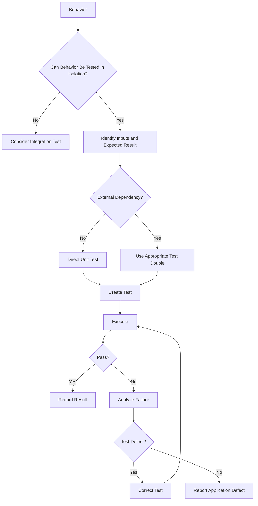

# Unit Testing Skill

## Purpose

This skill defines standards and best practices for designing, generating, executing, and validating unit tests.

Unit tests verify small units of software behavior independently from external systems.

Typical units include:

- Functions
- Methods
- Classes
- Business rules
- Calculations
- Validators
- Data transformations
- Domain logic
- Utility logic
- State transitions

This skill is:

- Language-neutral
- Framework-neutral
- Platform-neutral
- Vendor-neutral
- Domain-neutral

The Testing Agent must use the testing framework and conventions already established by the repository whenever possible.

---

# Objectives

Unit tests should provide:

- Fast feedback
- Behavioral correctness
- Regression protection
- Business-rule validation
- Edge-case validation
- Safe refactoring support
- Deterministic results
- Failure localization

Unit tests should validate behavior rather than implementation details.

---

# Core Principle

A unit test should verify:

```text
Known Input / State
        ↓
Unit Under Test
        ↓
Expected Behavior
```

External systems should normally not participate.

Examples of external dependencies include:

```text
Database

Network

File System

Message Broker

External API

Cloud Service
```

If the test requires multiple real external components, it is likely an integration test rather than a unit test.

---

# Unit Testing Workflow

The Testing Agent should follow:

```text
Inspect Requirements
        ↓
Inspect Source Code
        ↓
Inspect Existing Tests
        ↓
Identify Testable Units
        ↓
Identify Behaviors
        ↓
Generate Test Cases
        ↓
Implement Unit Tests
        ↓
Execute Tests
        ↓
Analyze Coverage
        ↓
Report Results
```

---

# 1. Inspect Existing Test Environment

Before creating tests, identify:

- Programming language
- Test framework
- Assertion library
- Mocking framework
- Existing test projects/directories
- Naming conventions
- Test commands
- Coverage tooling
- Repository test standards

Examples may include frameworks such as:

```text
xUnit
NUnit
MSTest
Jest
Vitest
JUnit
pytest
Go testing
```

Use the repository's existing framework rather than introducing another framework without justification.

---

# 2. Identify Testable Units

Inspect changed or relevant source code.

Identify units containing:

- Business logic
- Validation
- Calculations
- Conditions
- Transformations
- Decision logic
- State transitions
- Error handling

Prioritize meaningful behavior.

Do not create trivial tests merely to increase test count.

---

# 3. Unit Test Scenarios

For every applicable unit, consider:

## Positive Cases

Valid input produces expected output.

```text
Valid Input
    ↓
Execute Unit
    ↓
Expected Result
```

---

## Negative Cases

Invalid input produces expected failure behavior.

Examples:

- Invalid value
- Unsupported value
- Invalid state
- Malformed input

---

## Boundary Cases

Where meaningful, test:

```text
Minimum

Maximum

Minimum - 1

Maximum + 1

Zero

Empty

Single Item

Maximum Length
```

---

## Null / Missing Cases

Where the contract permits missing values, test appropriate behavior.

Do not create tests for impossible states merely for coverage.

---

## Business Rule Cases

Each important business rule should have direct tests.

Example:

```text
Rule:
Discount applies only when threshold is reached.

Tests:

Below Threshold
At Threshold
Above Threshold
```

---

## Conditional Branches

For meaningful decision logic:

```text
Condition True
      ↓
Expected Behavior A

Condition False
      ↓
Expected Behavior B
```

Test important branches.

---

## Exception / Error Cases

Where the unit can fail, verify:

- Correct failure behavior
- Correct exception/error type where part of contract
- Important error information
- No unintended side effects

---

## Collection Cases

Where collections are processed, consider:

```text
Empty Collection

Single Item

Multiple Items

Duplicate Items

Invalid Item

Large Relevant Boundary
```

Only include scenarios relevant to the logic.

---

## State Transition Cases

For stateful domain logic verify:

```text
Valid State
    ↓
Operation
    ↓
Expected State
```

and invalid transitions where applicable.

---

# 4. Test Case Documentation

Relevant unit test scenarios should appear in the consolidated:

```text
tests/test-cases/test-cases.md
```

Example:

```markdown
| ID | Requirement | Feature | Test Type | Scenario | Preconditions | Steps | Expected Result | Priority | Automation |
|----|-------------|---------|-----------|----------|---------------|-------|-----------------|----------|------------|
| TC-010 | REQ-04 | Pricing | Unit | Calculate valid discount | Threshold configured | Execute calculation | Correct discount returned | High | Yes |
| TC-011 | REQ-04 | Pricing | Unit | Value below discount threshold | Threshold configured | Execute calculation | No discount returned | High | Yes |
```

Where practical, automated test names should reference the test-case ID.

---

# 5. Test Structure

Prefer a clear structure such as:

```text
Arrange
   ↓
Act
   ↓
Assert
```

## Arrange

Prepare:

- Input
- Dependencies
- Expected values
- Initial state

## Act

Execute the unit under test.

## Assert

Verify observable behavior.

Tests should make these phases easy to understand even when the language/framework does not explicitly label them.

---

# 6. Test Naming

Test names should describe behavior.

Prefer:

```text
TC-010 - returns discount when threshold is reached
```

over:

```text
testCalculate
```

A useful naming concept is:

```text
Behavior
+
Condition
+
Expected Result
```

---

# 7. Assertions

Every unit test must contain meaningful assertions.

Assertions may verify:

- Return value
- State change
- Error
- Interaction with required dependency
- Collection contents
- Domain event
- Side-effect request

Avoid assertions unrelated to the behavior being tested.

---

# 8. Test One Behavior

A unit test should normally focus on one logical behavior.

Prefer:

```text
One Scenario
    ↓
One Expected Behavior
```

Avoid combining many unrelated behaviors into one test because failure diagnosis becomes difficult.

Multiple assertions are acceptable when they collectively verify one behavior.

---

# 9. Test Independence

Unit tests should be independent.

Avoid:

```text
Test A
 ↓
Creates State
 ↓
Test B Depends on State
```

Prefer:

```text
Test A → Independent

Test B → Independent
```

Tests should be executable:

- Individually
- In groups
- In any order

where practical.

---

# 10. Deterministic Tests

The same test should produce the same result under the same conditions.

Avoid uncontrolled dependencies on:

- Current time
- Random values
- Network
- External services
- Shared state
- Execution order
- Machine configuration

Control these dependencies where necessary.

---

# 11. Mocking

Use mocks, stubs, fakes, or test doubles only when needed to isolate external dependencies.

Potential boundaries include:

```text
Repository

External Service

Clock

Message Publisher

File Access

External Client
```

Do not mock simple internal implementation unnecessarily.

---

# 12. Mock Behavior, Not Implementation

Mocks should represent meaningful dependency behavior.

Example:

```text
Repository returns record
        ↓
Service processes record
        ↓
Expected result
```

Avoid tests that simply verify every internal method call.

Tests tightly coupled to implementation become fragile during refactoring.

---

# 13. Verify Important Interactions

Interaction verification is appropriate when the interaction itself is behavior.

Examples:

```text
Message must be published.

Repository must save changed state.

External notification must not occur when validation fails.
```

Do not verify interactions that are irrelevant to the requirement.

---

# 14. Avoid Over-Mocking

Excessive mocking can create tests that pass even when real components cannot work together.

If a test mocks nearly every component, determine whether:

- Design is too coupled, or
- Integration testing is more appropriate.

---

# 15. External Systems

Unit tests should not normally depend directly on:

```text
Real Database

Real API

Real Cloud Resource

Real Message Broker

Real File Server
```

Such validation belongs primarily to integration testing.

---

# 16. Time-Dependent Logic

If behavior depends on time, avoid directly depending on uncontrolled current system time where design allows abstraction.

Tests should be able to validate:

```text
Before Time

At Time

After Time
```

deterministically.

---

# 17. Randomness

When logic uses randomness:

- Control the random source where practical.
- Use predictable values for unit tests.
- Do not create flaky tests.

---

# 18. Async Unit Tests

When testing asynchronous behavior:

- Await completion correctly.
- Verify failures correctly.
- Avoid arbitrary delays.
- Avoid fire-and-forget test execution.

Do not allow a test to finish before the operation being tested completes.

---

# 19. Concurrency Unit Tests

Where isolated concurrency logic exists, consider:

- Shared-state behavior
- Duplicate execution
- Cancellation
- Ordering
- Concurrent modification

Complex concurrency behavior may also require integration or specialized testing.

Refer to:

```text
engineering/concurrency.md
```

---

# 20. Error Handling Tests

Where error behavior exists, test:

```text
Dependency Failure
      ↓
Unit Behavior
      ↓
Expected Error Handling
```

Verify that errors are:

- Propagated correctly
- Translated correctly
- Handled correctly

Do not test internal exception details unless they are part of the contract.

---

# 21. Validation Logic

Validators should have direct unit tests where meaningful.

Consider:

```text
Valid Input

Invalid Input

Missing Input

Minimum Boundary

Maximum Boundary

Format
```

Avoid duplicating every validation permutation at the E2E level.

---

# 22. Parameterized Tests

Use parameterized/data-driven tests when many inputs verify the same behavior.

Conceptually:

```text
Input A → Expected A

Input B → Expected B

Input C → Expected C
```

This reduces duplication while preserving coverage.

---

# 23. Test Fixtures

Use shared fixtures/setup only for genuinely common setup.

Avoid large fixtures that make test prerequisites difficult to understand.

Each test should remain understandable without tracing excessive hidden setup.

---

# 24. Test Data Builders

For complex test data, reusable builders or factories may improve readability.

Use them when they reduce duplication.

Do not introduce complex test infrastructure for simple data.

---

# 25. Unit Test Coverage

Coverage can help identify untested code.

Useful measures may include:

```text
Line Coverage

Branch Coverage

Function / Method Coverage
```

Coverage is an indicator, not proof of correctness.

---

# 26. Coverage Priorities

Prioritize coverage of:

```text
Business Rules

Critical Calculations

Validation

Decision Logic

Error Handling

State Transitions

Security-Relevant Logic
```

over trivial code.

---

# 27. Coverage Gaps

When coverage tooling identifies uncovered code, ask:

```text
Is this behavior important?

Does it require a test?

Is the code unreachable?

Is the code unnecessary?
```

Do not automatically generate meaningless tests solely to reach a percentage.

---

# 28. Coverage Thresholds

If the repository defines a coverage threshold, respect it.

Do not invent a mandatory percentage when no organizational or repository standard exists.

Do not reduce configured thresholds simply to make validation pass.

---

# 29. Unit Test Execution

Use the repository's standard command.

Examples conceptually include:

```bash
dotnet test
```

```bash
npm test
```

```bash
pytest
```

```bash
mvn test
```

```bash
gradle test
```

```bash
go test ./...
```

Determine the correct command from the repository.

Do not assume a specific framework.

---

# 30. Targeted Test Execution

During development, run relevant tests first where supported.

Conceptually:

```text
Changed Unit
     ↓
Relevant Tests
     ↓
Broader Unit Test Suite
```

Before completion, run the appropriate broader suite where practical.

---

# 31. Failure Analysis

When a unit test fails:

```text
Failure
   ↓
Inspect Assertion
   ↓
Inspect Expected Behavior
   ↓
Determine Cause
```

Classify the issue as:

```text
Application Defect

Test Defect

Requirement Ambiguity

Environment / Tooling Issue
```

Do not automatically change the test to match incorrect implementation.

---

# 32. Test Failure Rule

The expected behavior should come from:

```text
Requirement
+
Contract
+
Approved Architecture / Business Rule
```

not from:

```text
Whatever the Current Implementation Does
```

A failing test may reveal an implementation defect.

---

# 33. Regression Tests

When a defect is fixed, add an appropriate regression unit test when the defect can be reproduced at unit level.

Preferred flow:

```text
Reproduce Failure
      ↓
Create Failing Test
      ↓
Fix Defect
      ↓
Test Passes
```

---

# 34. Test Reports

Use the reporting mechanism already available in the repository where possible.

Reports may contain:

```text
Total Tests

Passed

Failed

Skipped

Duration

Coverage
```

Do not introduce unnecessary reporting dependencies when the existing test framework already provides suitable output.

---

# 35. Test Result Summary

After execution, report actual results.

Example:

```text
Unit Test Results

Total: 125
Passed: 123
Failed: 2
Skipped: 0

Coverage:
Line: 87%
Branch: 79%

Status:
FAILED
```

Only report coverage if it was actually measured.

---

# 36. Test File Organization

Follow repository conventions.

A generic conceptual structure may be:

```text
tests/
├── unit/
│   ├── feature-a/
│   ├── feature-b/
│   └── feature-c/
│
└── test-cases/
    └── test-cases.md
```

Do not reorganize existing tests unnecessarily.

---

# 37. Production Code Changes

The Testing Agent should not modify production code merely to make tests pass unless:

- A genuine defect exists, and
- The agent is explicitly permitted to fix implementation defects.

If the Testing Agent's responsibility is test-only:

```text
Application Defect
      ↓
Document Defect
```

Do not silently change application behavior.

---

# 38. AI-Generated Unit Test Risks

AI-generated tests may:

- Test implementation details.
- Mock everything.
- Assert trivial behavior.
- Reproduce implementation instead of expected behavior.
- Generate tests that always pass.
- Invent APIs.
- Use incorrect framework syntax.
- Ignore negative paths.
- Ignore boundaries.
- Introduce unnecessary dependencies.
- Claim coverage without measurement.

Generated tests must therefore be reviewed and executed.

---

# Testing Agent Unit Test Workflow

## 1. Inspect

Identify:

```text
Requirements
Source Code
Existing Tests
Testing Framework
Coverage Tooling
```

## 2. Identify Units

Find meaningful testable behavior.

## 3. Map Existing Coverage

Determine what is already tested.

## 4. Generate Test Cases

Add relevant unit scenarios to:

```text
tests/test-cases/test-cases.md
```

## 5. Implement

Create or update unit test files using existing conventions.

## 6. Review

Check:

- Behavior
- Assertions
- Isolation
- Mocks
- Edge cases
- Test naming

## 7. Execute Targeted Tests

Run tests related to changed behavior.

## 8. Execute Unit Suite

Run the broader unit test suite where practical.

## 9. Measure Coverage

Run configured coverage tooling where available.

## 10. Analyze Failures

Distinguish application defects from test defects.

## 11. Report

Provide actual:

```text
Passed
Failed
Skipped
Coverage
Limitations
```

---

# Testing Agent Rules

The agent should:

- ALWAYS inspect existing unit tests before creating new ones.
- ALWAYS use the repository's existing testing framework where practical.
- ALWAYS map unit tests to meaningful behavior.
- ALWAYS consider positive cases.
- ALWAYS consider negative cases.
- ALWAYS consider meaningful boundaries.
- ALWAYS test important business rules.
- ALWAYS test important error paths.
- ALWAYS use meaningful assertions.
- ALWAYS keep tests deterministic.
- ALWAYS isolate external dependencies appropriately.
- ALWAYS avoid unnecessary mocking.
- ALWAYS use parameterized tests when they meaningfully reduce duplication.
- ALWAYS execute generated tests when execution is available.
- ALWAYS analyze failures before modifying tests.
- ALWAYS use configured coverage tooling where applicable.
- ALWAYS report actual test results.
- ALWAYS report coverage only when measured.

The agent should:

- NEVER create unit tests only to increase test count.
- NEVER treat code coverage as proof of correctness.
- NEVER mock the unit under test.
- NEVER mock every internal implementation detail.
- NEVER depend on real production services in unit tests.
- NEVER hardcode secrets or production credentials.
- NEVER create order-dependent unit tests unnecessarily.
- NEVER rely on arbitrary sleeps.
- NEVER weaken assertions to make tests pass.
- NEVER delete failing tests merely to obtain a green build.
- NEVER reduce coverage thresholds without explicit justification and approval.
- NEVER claim tests passed without execution.
- NEVER claim coverage without running coverage tooling.
- NEVER assume current implementation defines correct expected behavior.

---

# Unit Test Decision Flow



---

# Unit Test Coverage Model

```text
Requirement
    ↓
Business Behavior
    ↓
Unit Test Cases
    ↓
Automated Tests
    ↓
Execution
    ↓
Coverage Analysis
    ↓
Results
```

Coverage should support test analysis.

It should not replace requirement-based test design.

---

# Validation Checklist

Before unit testing is considered complete:

- [ ] Requirements were inspected.
- [ ] Relevant source code was inspected.
- [ ] Existing unit tests were inspected.
- [ ] Existing testing framework was identified.
- [ ] Existing coverage tooling was identified.
- [ ] Meaningful testable units were identified.
- [ ] Existing coverage was considered.
- [ ] Positive cases were covered.
- [ ] Negative cases were covered.
- [ ] Boundary cases were considered.
- [ ] Null/missing cases were considered where applicable.
- [ ] Business rules were tested.
- [ ] Important branches were tested.
- [ ] Error paths were tested.
- [ ] State transitions were tested where applicable.
- [ ] Test cases were added to the consolidated test-case file.
- [ ] Tests contain meaningful assertions.
- [ ] Tests are sufficiently independent.
- [ ] Tests are deterministic.
- [ ] External dependencies are appropriately isolated.
- [ ] Mocks are not excessive.
- [ ] No secrets exist in test code.
- [ ] Parameterized tests are used where appropriate.
- [ ] Targeted tests were executed.
- [ ] Appropriate unit suite was executed.
- [ ] Coverage was measured where tooling exists.
- [ ] Coverage gaps were reviewed.
- [ ] Failures were analyzed.
- [ ] Actual results were reported.
- [ ] Execution limitations were reported.

---

# Completion Criteria

Unit testing is complete when applicable:

```text
Requirements Analyzed
        +
Units Identified
        +
Test Cases Documented
        +
Tests Implemented
        +
Tests Executed
        +
Coverage Reviewed
        +
Failures Analyzed
        +
Results Reported
```

The Testing Agent must distinguish:

```text
Unit Tests Created
```

from:

```text
Unit Tests Passed
```

and:

```text
Coverage Measured
```

These are separate states.

---

# Relationship With Other Skills

Use this skill with:

```text
test-case-design.md
        ↓
unit-testing.md
        ↓
integration-testing.md
        ↓
api-testing.md
        ↓
playwright-testing.md
        ↓
non-functional-testing.md
        ↓
defect-reporting.md
```

It should also reference relevant engineering skills when necessary:

```text
engineering/testing-strategy.md
engineering/error-handling.md
engineering/secure-coding.md
engineering/concurrency.md
engineering/code-review.md
```

---

# Final Principle

Unit testing should optimize for:

```text
Behavioral Confidence
        +
Fast Feedback
        +
Isolation
        +
Deterministic Execution
        +
Maintainability
```

not:

```text
Maximum Test Count
```

or:

```text
Maximum Coverage Percentage
```

The Testing Agent should create the smallest meaningful set of unit tests that provides strong confidence in important isolated behavior.
