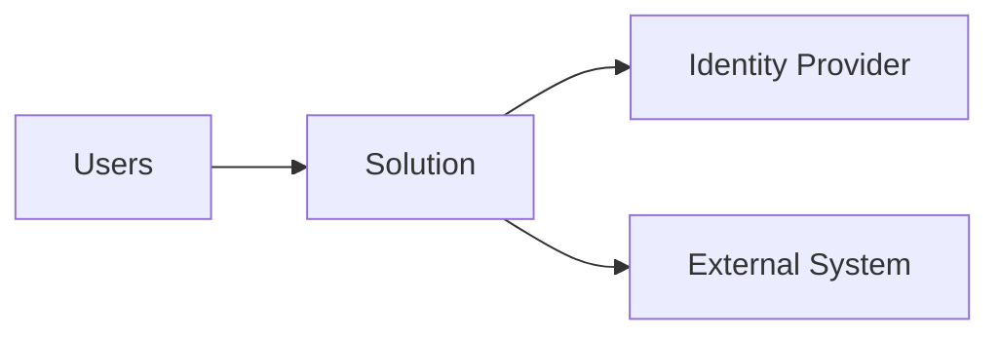
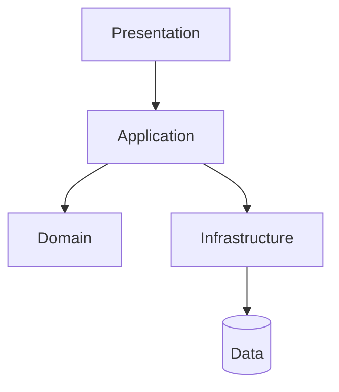
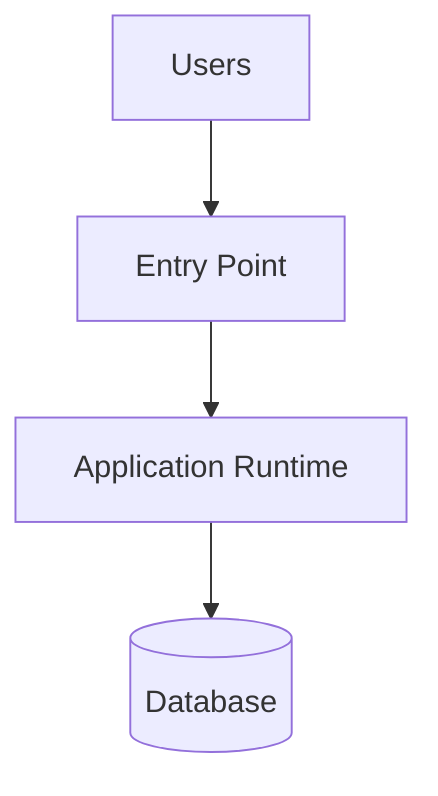
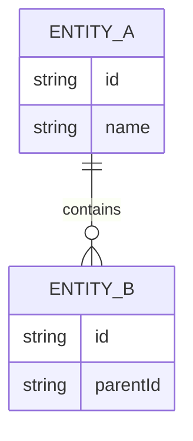
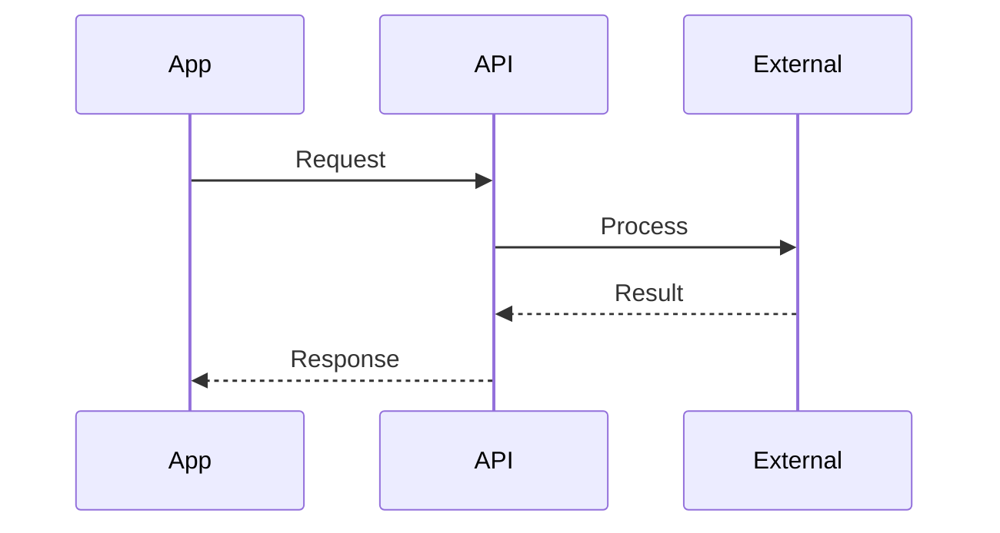
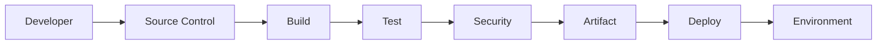

# Architecture Design Document (ADD) Template

## Purpose

Use this template to generate the consolidated Architecture Design Document for the solution defined in the Product Requirements Document.

Primary input:

```text
docs/PRD.md
```

Final output:

```text
docs/Architecture-Design.md
```

The Architecture Agent must use applicable architecture skills, repository standards, existing architecture, and confirmed requirements when generating this document.

The architecture must explain:

```text
WHAT architecture is proposed
        +
WHY it is appropriate
        +
HOW the solution works
        +
WHY technologies/services were selected
        +
WHAT alternatives were considered
        +
HOW requirements are satisfied
```

Do not invent requirements, integrations, scale targets, compliance requirements, SLA/SLO values, RTO/RPO values, or technology constraints.

---

# Architecture Design Document (ADD)

---

# 1. Executive Summary

Provide a concise executive-level summary.

Include:

- Business Context
- Problem Being Solved
- Proposed Solution
- Architecture Style
- Major Components
- Technology Stack
- Deployment Approach
- Key Architecture Decisions

The summary should allow technical leadership to understand the proposed architecture without reading the complete document.

---

# 2. Business Context

Summarize the relevant business context from:

```text
docs/PRD.md
```

Include:

- Business Problem
- Business Goals
- Users / Personas
- Major Capabilities
- Key Constraints
- Major Dependencies

Do not duplicate the entire PRD.

---

# 3. Solution Overview

Describe the proposed solution at a high level.

Explain:

- What the solution does
- Who interacts with it
- Major system capabilities
- Major system boundaries
- External systems involved
- Major data flows

Provide enough context to understand the architecture before presenting technical details.

---

# 4. Architecture Principles

Document the principles guiding the architecture.

Consider applicable principles such as:

- Separation of Concerns
- High Cohesion
- Low Coupling
- Modularity
- Secure by Design
- Least Privilege
- Defense in Depth
- API-First where appropriate
- Automation First
- Infrastructure as Code
- Observability by Design
- Failure Awareness
- Stateless Processing where appropriate
- Configuration Externalization
- Cost Awareness
- Simplicity
- Maintainability
- Testability

Only include principles relevant to the solution.

Explain important principles rather than listing them without context.

---

# 5. Architecture Goals

Define the architecture quality goals derived from the PRD.

Consider:

- Scalability
- Security
- Availability
- Reliability
- Resilience
- Maintainability
- Performance
- Observability
- Testability
- Cost Efficiency
- Operational Simplicity

Use:

| Goal | Requirement Source | Architecture Response |
|---|---|---|
| <Goal> | NFR-XXX / FR-XXX | <How architecture addresses it> |

Do not invent numerical targets.

If required information is unavailable, use:

```text
TBD — stakeholder confirmation required
```

---

# 6. Requirements Summary

Summarize architecture-relevant requirements from the PRD.

## 6.1 Functional Requirements

Summarize major:

```text
FR-XXX
```

requirements.

Do not reproduce every requirement unless necessary.

---

## 6.2 Non-Functional Requirements

Summarize applicable:

```text
NFR-XXX
```

requirements.

Consider:

- Performance
- Scalability
- Security
- Availability
- Reliability
- Resilience
- Recovery
- Accessibility
- Maintainability
- Observability

---

## 6.3 Work Item Context

Summarize the delivery hierarchy relevant to architecture.

```text
Goal
  ↓
Epic
  ↓
Feature
  ↓
User Story
  ↓
Requirement
```

Provide a compact mapping:

| Epic | Feature | User Stories | Requirements |
|---|---|---|---|
| EPIC-001 | FEAT-001 | US-001, US-002 | FR-001, FR-002 |

This establishes traceability without duplicating the PRD.

---

# 7. Architecture Pattern

Document the primary architecture pattern.

Include:

## Selected Pattern

```text
<Architecture Pattern>
```

Possible patterns may include:

- Layered Architecture
- Modular Monolith
- Clean Architecture
- Hexagonal Architecture
- Microservices
- Event-Driven Architecture
- Serverless Architecture
- Service-Oriented Architecture
- Hybrid Architecture

Do not select a pattern mechanically.

---

## Why Selected

Explain why the selected pattern fits:

- Functional requirements
- System complexity
- Scalability requirements
- Security
- Maintainability
- Deployment model
- Operational requirements
- Expected evolution

---

## Alternatives Considered

| Alternative | Advantages | Disadvantages | Decision |
|---|---|---|---|
| <Pattern> | <Advantages> | <Disadvantages> | Selected / Rejected |

---

## Trade-Offs

Explain:

```text
What do we gain?
What complexity does it introduce?
What limitations remain?
```

Prefer the simplest architecture that satisfies the requirements.

---

# 8. Technology Stack

Document the major technologies.

| Layer / Capability | Technology | Purpose | Justification |
|---|---|---|---|
| Frontend | <Technology> | <Purpose> | <Why selected> |
| Backend | <Technology> | <Purpose> | <Why selected> |
| API | <Technology> | <Purpose> | <Why selected> |
| Database | <Technology> | <Purpose> | <Why selected> |
| Cache | <Technology / N/A> | <Purpose> | <Why selected> |
| Messaging | <Technology / N/A> | <Purpose> | <Why selected> |
| Testing | <Technology> | <Purpose> | <Why selected> |

Only include applicable technologies.

---

# 9. Cloud / Platform Services

Document infrastructure and managed services required by the architecture.

If Azure is the selected platform, document Azure services.

Example:

| Service | Purpose | Requirement | Alternatives | Why Selected |
|---|---|---|---|---|
| <Service> | <Purpose> | FR/NFR | <Alternatives> | <Justification> |

For every significant service answer:

```text
Why do we need it?

Which requirement does it satisfy?

What alternatives exist?

Why was this service selected?

What happens if we do not use it?

Is there a simpler or cheaper alternative?

Which service tier is required and why?
```

Do not select Premium or higher tiers unless requirements justify them.

Prefer the most cost-efficient tier that satisfies requirements.

If the solution is not hosted on Azure, use the equivalent platform/service section.

---

# 10. System Context

Describe the solution's external context.

Include:

- Users
- External Systems
- Identity Providers
- Data Providers
- External Consumers
- Third-Party Services

Generate a Mermaid System Context Diagram.

Example:



The actual diagram must reflect the solution.

---

# 11. Logical Architecture

Describe the major logical layers or domains.

Explain:

- Responsibilities
- Boundaries
- Dependencies
- Data movement

Generate a Mermaid Logical Architecture Diagram.

Example:



Do not force this structure if another architecture is selected.

---

# 12. Component Architecture

Identify major components using stable IDs.

Use:

```text
COMP-001
COMP-002
COMP-003
```

Document:

| ID | Component | Responsibility | Related Requirements |
|---|---|---|---|
| COMP-001 | <Component> | <Responsibility> | FR-001 |

For each important component describe:

- Purpose
- Responsibilities
- Inputs
- Outputs
- Dependencies
- Owned Data
- Security Boundary
- Related Features
- Related Requirements

Generate a Mermaid Component Diagram.

Avoid components with overlapping responsibilities.

---

# 13. Deployment Architecture

Describe how the solution is deployed.

Include applicable:

- Entry Points
- Application Runtime
- APIs
- Services
- Databases
- Storage
- Messaging
- External Services
- Scaling
- Regions
- Availability Zones

Generate a Mermaid Deployment Diagram.

Example:



---

# 14. Infrastructure Architecture

Describe the infrastructure required to host and operate the solution.

Consider applicable:

- Compute
- Networking
- Database
- Storage
- Identity
- Secrets
- Messaging
- Cache
- Monitoring
- Edge / Gateway
- DNS

Generate a Mermaid Infrastructure Diagram.

Clearly distinguish:

```text
Application Components
```

from:

```text
Infrastructure Resources
```

---

# 15. Network Architecture

Where network architecture is applicable, describe:

- VNets / Networks
- Subnets
- Network Segmentation
- Public Entry Points
- Private Endpoints
- Firewalls
- Security Groups / NSGs
- Application Gateway / Load Balancer
- DNS
- Inbound Traffic
- Outbound Traffic
- Private Connectivity

Generate a Mermaid Network Diagram.

Example:


Do not introduce private networking complexity without requirement or enterprise-policy justification.

---

# 16. Identity and Access Management

Describe:

- Identity Provider
- Authentication
- Authorization
- RBAC
- ABAC where applicable
- Managed / Workload Identity
- Service-to-Service Authentication
- Least Privilege
- Administrative Access

Show the authorization flow where useful:

```text
Identity
   ↓
Authentication
   ↓
Authorization
   ↓
Resource Access
```

Authorization must be enforced at trusted application/service boundaries, not only in the UI.

---

# 17. Security Architecture

Describe the security architecture.

Include applicable:

- Authentication
- Authorization
- Encryption in Transit
- Encryption at Rest
- Secrets Management
- Key Management
- Network Security
- API Security
- Input Validation
- Audit Logging
- Data Protection
- Supply Chain Security
- Infrastructure Security
- Compliance Requirements

If Azure is used, describe applicable use of services such as Key Vault only when required.

Do not invent compliance requirements.

Include a security/trust-boundary diagram where useful.

---

# 18. Data Architecture

Describe:

- Major Data Domains
- Data Ownership
- Data Sources
- Data Consumers
- Data Movement
- Data Lifecycle
- Data Sensitivity
- Retention
- Data Access Patterns
- Data Consistency

Use:

| Data Domain | Owner | Consumers | Sensitivity |
|---|---|---|---|
| <Domain> | <Component> | <Consumers> | <Classification> |

Generate a Mermaid Data Flow Diagram.

Example:


---

# 19. Database Design

Document the database architecture where persistence is required.

Include:

## Database Selection

Explain:

- Selected database type
- Selected technology
- Why it fits the access patterns

---

## Alternatives

| Option | Advantages | Limitations | Decision |
|---|---|---|---|
| <Database> | | | Selected / Rejected |

---

## Schema Strategy

Describe:

- Major entities
- Relationships
- Ownership
- Schema approach

---

## Indexing

Describe indexing strategy based on expected query patterns.

Do not create indexes without access-pattern justification.

---

## Partitioning

Describe partitioning/sharding only when required.

Do not introduce partitioning for hypothetical scale.

---

## Transactions and Consistency

Document:

- Transaction boundaries
- Consistency requirements
- Concurrency handling
- Conflict handling

---

## Backup

Describe backup expectations and strategy.

---

## Recovery

Describe restoration/recovery approach.

Do not invent RPO/RTO values.

---

## ER Diagram

Generate a Mermaid ER Diagram when the data model is sufficiently known.

Example:



---

# 20. API Design

Where APIs exist, document:

- API Style
- Major API Domains
- Endpoints
- Request/Response Contracts
- Authentication
- Authorization
- Validation
- Versioning
- Pagination
- Filtering
- Sorting
- Error Handling
- Idempotency
- Rate Limiting where required

Use:

| Method | Endpoint | Purpose | Authentication | Related Requirement |
|---|---|---|---|---|
| GET | `/resource` | <Purpose> | Required | FR-XXX |

Do not invent endpoints unsupported by requirements.

Define a consistent error model where applicable.

---

# 21. Integration Architecture

Describe external and internal integrations.

Use:

| Integration | Purpose | Direction | Protocol | Failure Impact |
|---|---|---|---|---|
| <System> | <Purpose> | In / Out / Both | <Protocol> | <Impact> |

For each significant integration describe:

- Authentication
- Data exchanged
- Timeout behavior
- Retry behavior
- Failure handling
- Ownership
- Dependency criticality

Generate Sequence Diagrams for important integrations.

Example:



---

# 22. Monitoring and Observability

Describe the observability strategy.

Cover:

```text
Logs
Metrics
Traces
Health Checks
Dashboards
Alerts
```

If Azure is used, evaluate applicable:

- Azure Monitor
- Application Insights
- Log Analytics

Do not include services merely because they exist.

Explain why each is needed.

Document:

### Logging

- Structured logging
- Correlation IDs
- Error logging
- Security events

Never log secrets or sensitive data unnecessarily.

### Metrics

Consider:

- Request Rate
- Latency
- Error Rate
- Resource Utilization
- Dependency Health
- Queue Depth
- Business Metrics

### Tracing

Use distributed tracing where architecture complexity justifies it.

### Health

Define applicable:

- Liveness
- Readiness
- Dependency Health

### Alerting

Alerts should be actionable.

---

# 23. High Availability

Where availability requirements exist, describe the HA strategy.

Consider:

- Redundancy
- Multiple Instances
- Availability Zones
- Load Distribution
- Health Checks
- Database Availability
- Dependency Availability
- Automatic Failover

Map the strategy to:

```text
NFR-XXX
```

Do not introduce multi-region or zone-redundant architecture without justification.

---

# 24. Disaster Recovery

Where DR requirements exist, describe:

- Failure Scenarios
- Backup Strategy
- Restore Strategy
- Data Recovery
- Regional Recovery
- Service Recovery
- Dependency Recovery
- Recovery Validation

Document RTO/RPO only when provided by requirements.

Use:

| Scenario | Recovery Approach | RTO | RPO |
|---|---|---|---|
| <Scenario> | <Approach> | <Defined/TBD> | <Defined/TBD> |

---

# 25. DevSecOps & CI/CD

Describe the delivery architecture.

Include:

- Source Control
- Branching Strategy
- Pull Requests
- Build Pipeline
- Unit Tests
- Integration Tests
- Security Scanning
- Dependency Scanning
- Code Quality
- Artifact Creation
- Infrastructure Validation
- Deployment
- Environment Promotion
- Approval Gates
- Rollback

Generate a Mermaid CI/CD Pipeline Diagram.

Example:



Detailed pipeline implementation belongs to engineering.

---

# 26. Cost Optimization

Identify major cost drivers.

Use:

| Resource / Capability | Cost Driver | Optimization Strategy |
|---|---|---|
| <Resource> | <Driver> | <Strategy> |

Consider applicable:

- Right-Sizing
- Autoscaling
- Consumption-Based Services
- Standard vs Premium Tiers
- Storage Lifecycle
- Log Retention
- Reserved Capacity
- Data Transfer
- Development Environment Shutdown
- Unused Resources

For each significant service tier answer:

```text
Why is this tier required?

Can a lower-cost tier satisfy the requirement?

What capability would be lost by selecting the lower tier?
```

Cost optimization must not compromise required security, reliability, or performance.

---

# 27. Risks and Mitigations

Document architectural risks.

Use:

```text
ARISK-001
ARISK-002
```

| ID | Risk | Impact | Likelihood | Mitigation |
|---|---|---|---|---|
| ARISK-001 | <Risk> | High | Medium | <Mitigation> |

Consider:

- Security
- Scalability
- Availability
- Data
- Integration
- Vendor Dependency
- Cost
- Migration
- Operational Complexity
- Performance

---

# 28. Architecture Decision Records (ADRs)

Record significant architecture decisions.

Use:

```text
ADR-001
ADR-002
```

For each ADR use:

## ADR-001 — <Decision Title>

### Status

```text
Proposed / Accepted / Superseded
```

### Context

<Why this decision is required>

### Decision

<Selected approach>

### Alternatives Considered

1. <Alternative>
2. <Alternative>
3. <Alternative>

### Why Selected

<Selection rationale>

### Consequences

#### Positive

- <Benefit>

#### Negative / Trade-Offs

- <Trade-off>

### Related Requirements

```text
FR-XXX
NFR-XXX
```

Do not create ADRs for trivial implementation decisions.

---

# 29. Implementation Roadmap

Describe the recommended implementation sequence.

Do not invent calendar dates unless provided.

Use implementation phases.

Example:

```text
Phase 1
Foundation
    ↓
Phase 2
Core Platform / Services
    ↓
Phase 3
Business Capabilities
    ↓
Phase 4
Integrations
    ↓
Phase 5
Security + Hardening
    ↓
Phase 6
Testing + Validation
    ↓
Phase 7
Production Readiness
```

For each phase provide:

| Phase | Scope | Related Epics / Features | Dependencies | Outcome |
|---|---|---|---|---|
| Phase 1 | <Scope> | <Items> | <Dependencies> | <Outcome> |

The roadmap should follow technical dependencies and business priorities.

---

# 30. Appendix

Include applicable supporting information.

## 30.1 Acronyms

| Acronym | Meaning |
|---|---|
| API | Application Programming Interface |
| <Acronym> | <Meaning> |

---

## 30.2 Glossary

| Term | Definition |
|---|---|
| <Term> | <Definition> |

---

## 30.3 References

Reference applicable:

- PRD
- Architecture Standards
- Security Standards
- API Standards
- Engineering Standards
- External Technical Documentation

Do not fabricate references.

---

# 31. Requirement-to-Architecture Traceability

Maintain traceability between planning and architecture.

```text
Goal
  ↓
Epic
  ↓
Feature
  ↓
User Story
  ↓
Requirement
  ↓
Architecture Component
  ↓
Architecture Decision
```

Use:

| Goal | Epic | Feature | User Story | Requirement | Component | ADR |
|---|---|---|---|---|---|---|
| G-01 | EPIC-001 | FEAT-001 | US-001 | FR-001 | COMP-001 | ADR-001 |
| G-01 | EPIC-001 | FEAT-002 | US-003 | FR-003 | COMP-002 | ADR-002 |

Not every requirement requires an ADR.

Every architecturally significant requirement should map to an architecture mechanism or component.

---

# 32. Non-Functional Requirement Mapping

Explicitly map NFRs to architecture.

| NFR | Requirement | Architecture Mechanism | Components | Validation Approach |
|---|---|---|---|---|
| NFR-001 | <Requirement> | <Mechanism> | COMP-001 | <Validation> |

Pay particular attention to:

- Security
- Performance
- Scalability
- Availability
- Reliability
- Resilience
- Recovery
- Observability

Do not claim an NFR is satisfied merely because the selected technology supports the capability.

Explain how the architecture uses it.

---

# 33. Architecture Assumptions and Open Questions

## Assumptions

Use:

```text
AASM-001
AASM-002
```

| ID | Assumption | Impact if Incorrect |
|---|---|---|
| AASM-001 | <Assumption> | <Impact> |

---

## Open Questions

Use:

```text
AQ-001
AQ-002
```

| ID | Question | Architecture Impact | Status |
|---|---|---|---|
| AQ-001 | <Question> | <Impact> | Open |

Do not silently make major architecture assumptions.

---

# 34. Architecture Validation Checklist

Before finalizing the document verify:

## Requirements

- [ ] PRD was reviewed.
- [ ] Goals were understood.
- [ ] Epics were reviewed.
- [ ] Features were reviewed.
- [ ] User Stories were reviewed.
- [ ] Functional Requirements were reviewed.
- [ ] NFRs were reviewed.
- [ ] Constraints were reviewed.
- [ ] Dependencies were reviewed.

## Design

- [ ] Architecture pattern is defined.
- [ ] Architecture pattern is justified.
- [ ] Alternatives were considered.
- [ ] Trade-offs are documented.
- [ ] System Context Diagram exists.
- [ ] Logical Architecture Diagram exists.
- [ ] Component Architecture is defined.
- [ ] Deployment Architecture is defined.
- [ ] Infrastructure Architecture is defined.

## Technology

- [ ] Technology stack is documented.
- [ ] Major technology choices are justified.
- [ ] Major service choices are justified.
- [ ] Alternatives are documented where relevant.
- [ ] Unnecessary technologies were avoided.

## Data

- [ ] Data architecture is defined.
- [ ] Data ownership is defined.
- [ ] Database selection is justified.
- [ ] Indexing is considered.
- [ ] Partitioning is considered only where required.
- [ ] Backup and recovery are addressed.

## APIs & Integration

- [ ] API architecture is defined where applicable.
- [ ] Integrations are documented.
- [ ] Authentication is defined.
- [ ] Failure handling is defined.

## Security

- [ ] Authentication is addressed.
- [ ] Authorization is addressed.
- [ ] RBAC/permissions are defined.
- [ ] Managed/workload identity is considered.
- [ ] Secrets management is defined.
- [ ] Encryption is addressed.
- [ ] Network security is addressed.
- [ ] Least privilege is applied.

## Operations

- [ ] Monitoring is defined.
- [ ] Logging is defined.
- [ ] Metrics are defined.
- [ ] Health checks are considered.
- [ ] Alerting is considered.
- [ ] High availability is addressed where required.
- [ ] Disaster recovery is addressed where required.

## Delivery

- [ ] CI/CD architecture is defined.
- [ ] Security gates are considered.
- [ ] Infrastructure as Code is considered.
- [ ] Implementation roadmap exists.

## Cost

- [ ] Major cost drivers are identified.
- [ ] Service tiers are justified.
- [ ] Lower-cost alternatives were considered.
- [ ] Unnecessary services were avoided.

## Governance

- [ ] Architecture risks are documented.
- [ ] ADRs exist for significant decisions.
- [ ] Assumptions are documented.
- [ ] Open questions are documented.
- [ ] Requirement traceability exists.
- [ ] NFR traceability exists.

---

# 35. Architecture Status and Handoff

Provide a final status.

Use one of:

```text
READY FOR DEVELOPMENT
```

```text
READY WITH ASSUMPTIONS
```

```text
BLOCKED — ARCHITECTURE CLARIFICATION REQUIRED
```

Do not mark architecture ready if unresolved critical questions could materially change the implementation.

---

## Development Handoff

The Development Agent should be able to determine:

```text
What must be implemented?

Which architecture pattern must be followed?

Which components must be created?

What responsibility belongs to each component?

How do components communicate?

Which APIs are required?

Which data stores are required?

What data does each component own?

Which integrations are required?

What security controls must be implemented?

How should failures be handled?

Which infrastructure resources are required?

How should the application be deployed?

How should it be monitored?

Which ADRs are mandatory?

Which requirements map to each component?
```

---

## Testing Handoff

The Testing Agent should be able to identify:

```text
Functional Boundaries

Component Boundaries

Integration Boundaries

API Contracts

Data Boundaries

Security Boundaries

Critical User Flows

Failure Scenarios

Performance Requirements

Scalability Requirements

Availability Requirements

Resilience Requirements

Recovery Requirements
```

---

# Final Output

Generate:

```text
docs/
├── PRD.md
└── Architecture-Design.md
```

Do not fragment the architecture into multiple documents unless the repository standard explicitly requires it.

---

# Template Usage Rules

The Architecture Agent must:

- Use this template as the standard ADD structure.
- Read `docs/PRD.md` before generating architecture.
- Inspect existing architecture and code where available.
- Preserve PRD identifiers.
- Maintain Epic → Feature → User Story → Requirement traceability.
- Use stable component identifiers.
- Use stable ADR identifiers.
- Explain significant technology choices.
- Explain significant cloud/platform service choices.
- Compare meaningful alternatives.
- Document trade-offs.
- Use Mermaid diagrams where required by this template.
- Ensure diagrams match the written design.
- Prefer the simplest architecture satisfying the requirements.
- Prefer cost-efficient service tiers satisfying requirements.
- Apply security throughout the architecture.
- Clearly identify assumptions.
- Clearly identify unresolved questions.
- Mark unknown critical values as `TBD`.
- Remove sections that are genuinely not applicable rather than inventing content.

The Architecture Agent must not:

- Invent requirements.
- Invent integrations.
- Invent scale targets.
- Invent SLA/SLO values.
- Invent RTO/RPO values.
- Invent compliance requirements.
- Select technologies without justification.
- Select cloud services without justification.
- Select Premium tiers by default.
- Select microservices by default.
- Select Kubernetes by default.
- Select messaging by default.
- Select caching by default.
- Select NoSQL by default.
- Add unnecessary infrastructure.
- Over-engineer for hypothetical future requirements.
- Claim an NFR is satisfied without explaining how.

---

# Final Architecture Principle

For every major architecture decision:

```text
Requirement
    ↓
Required Capability
    ↓
Possible Options
    ↓
Comparison
    ↓
Selected Option
    ↓
Justification
    ↓
Trade-Off
    ↓
Architecture Implementation
```

For every significant cloud/platform service:

```text
Why do we need it?
        ↓
What requirement does it satisfy?
        ↓
What alternatives exist?
        ↓
Why was this option selected?
        ↓
Can a simpler/cheaper option satisfy the requirement?
        ↓
Which tier is actually required?
```

The Architecture Design Document must provide enough information for engineering teams to understand, explain, implement, test, deploy, secure, operate, and evolve the solution without inventing missing architecture decisions.