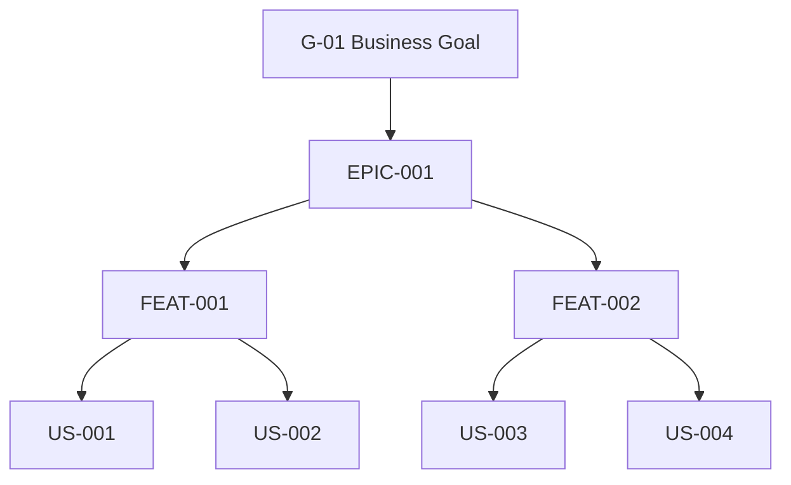
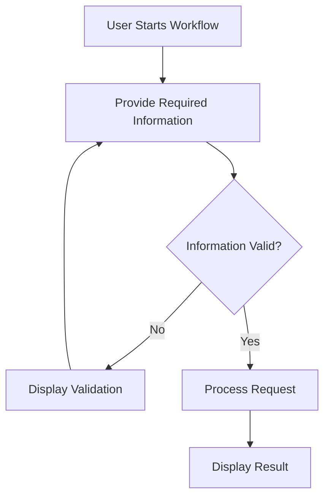
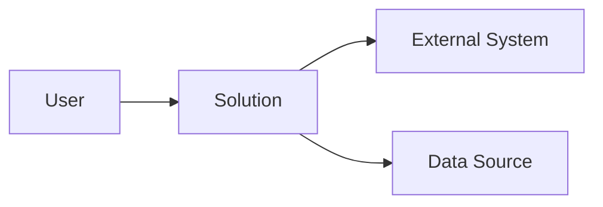

# Product Requirements Document (PRD) Template

## Purpose

Use this template to create a single consolidated Product Requirements Document for the requested product, system, service, platform, feature, or solution.

The Planning Agent must use applicable planning and business-analysis skills when producing this document.

The final PRD should be created at:

```text
docs/PRD.md
```

unless the repository defines another standard location.

---

# Document Rules

The PRD must:

- Be a single consolidated document.
- Be understandable by business, product, architecture, engineering, and testing teams.
- Describe what needs to be built and why.
- Clearly distinguish confirmed requirements from assumptions.
- Include only sections applicable to the requested solution.
- Maintain requirement and work-item traceability.
- Include Epics, Features, User Stories, and Acceptance Criteria.
- Avoid unnecessary implementation-level architecture decisions.
- Avoid inventing requirements.
- Use Mermaid diagrams where they materially improve understanding.

Do not create separate documents for:

- Functional requirements
- Non-functional requirements
- Epics
- Features
- User stories
- Acceptance criteria
- Personas
- Workflows
- Assumptions
- Risks

All applicable planning information belongs in the consolidated PRD.

---

# Requirement Hierarchy

The PRD should maintain the following hierarchy:

```text
Business Need
      ↓
Business Goals
      ↓
Epics
      ↓
Features
      ↓
User Stories
      ↓
Acceptance Criteria
```

Functional requirements and business rules should remain traceable to this hierarchy.

Downstream agents extend the traceability into:

```text
Architecture
      ↓
Implementation
      ↓
Test Cases
      ↓
Test Results
```

---

# 1. Document Information

| Field | Value |
|---|---|
| Product / Initiative | |
| Document Type | Product Requirements Document |
| Version | |
| Status | Draft / Review / Approved |
| Last Updated | |

---

# 2. Executive Summary

Provide a concise explanation of:

- What is being created.
- Why it is needed.
- Who will use it.
- What problem it solves.
- What successful delivery should achieve.

Keep this section understandable to both technical and non-technical stakeholders.

---

# 3. Problem Statement

Describe the problem being addressed.

Include applicable:

- Current situation
- Existing pain points
- User impact
- Business impact
- Operational impact
- Why the problem needs to be solved

Avoid describing detailed technical implementation here.

---

# 4. Goals

Define expected outcomes.

Use identifiers:

```text
G-01
G-02
G-03
```

Example:

| ID | Goal | Success Indicator |
|---|---|---|
| G-01 | <Goal> | <How success will be recognized> |
| G-02 | <Goal> | <How success will be recognized> |

Goals should describe outcomes rather than implementation tasks.

---

# 5. Non-Goals

Clearly identify what the solution is not intended to provide.

Use identifiers:

```text
NG-01
NG-02
```

Example:

| ID | Non-Goal | Reason |
|---|---|---|
| NG-01 | <Excluded capability> | <Reason> |

Non-goals help prevent scope ambiguity and uncontrolled scope expansion.

---

# 6. Stakeholders

Identify applicable stakeholder groups.

| Stakeholder | Responsibility / Interest |
|---|---|
| <Stakeholder> | <Responsibility> |

Do not invent named individuals.

Use roles, teams, or groups unless names are explicitly provided.

---

# 7. Users / Personas

Identify users who interact with or are affected by the solution.

Only create personas supported by available requirements.

For each relevant persona use:

## Persona: <Role / Persona Name>

### Description

<Who this user is>

### Primary Goals

- <Goal>
- <Goal>

### Key Activities

- <Activity>
- <Activity>

### Pain Points

- <Pain point>
- <Pain point>

### Access Expectations

- <Expected access>
- <Expected permissions>

---

# 8. Scope

## 8.1 In Scope

Define capabilities included in the current solution.

- <Capability>
- <Capability>
- <Capability>

---

## 8.2 Out of Scope

Define capabilities explicitly excluded.

- <Capability>
- <Capability>

Do not treat future possibilities as current scope.

---

# 9. Assumptions

Document assumptions required to continue planning.

Use:

```text
ASM-001
ASM-002
```

| ID | Assumption | Impact if Incorrect |
|---|---|---|
| ASM-001 | <Assumption> | <Impact> |

Assumptions must never be presented as confirmed requirements.

If an assumption significantly affects scope, security, architecture, cost, or user behavior, seek clarification where possible.

---

# 10. Constraints

Document known constraints.

Possible categories include:

- Technology
- Platform
- Security
- Regulatory
- Budget
- Timeline
- Organizational
- Integration
- Operational
- Data
- Deployment

Use:

```text
CON-001
CON-002
```

| ID | Constraint | Category | Impact |
|---|---|---|---|
| CON-001 | <Constraint> | <Category> | <Impact> |

---

# 11. Dependencies

Identify dependencies required for successful delivery.

Examples may include:

- Existing systems
- External services
- APIs
- Data sources
- Identity systems
- Infrastructure
- Other teams
- Third-party platforms

Use:

```text
DEP-001
DEP-002
```

| ID | Dependency | Description | Impact |
|---|---|---|---|
| DEP-001 | <Dependency> | <Description> | <Impact> |

Do not invent dependencies unsupported by available information.

---

# 12. Functional Requirements

Functional requirements describe what the solution must do.

Use identifiers:

```text
FR-001
FR-002
FR-003
```

For each requirement use:

## FR-001 — <Requirement Name>

### Description

<Clear description of required behavior>

### Actors

<Applicable users or systems>

### Preconditions

<Required state before execution>

### Trigger

<What initiates the behavior>

### Expected Behavior

<Required system behavior>

### Outcome

<Expected result>

### Priority

```text
Critical / High / Medium / Low
```

### Related Goal

```text
G-XX
```

### Acceptance Criteria

Use identifiers:

```text
AC-001
AC-002
```

Example:

- AC-001 — <Testable expected behavior>
- AC-002 — <Testable expected behavior>

Acceptance criteria must be measurable or verifiable.

Repeat for each functional requirement.

---

# 13. Epics, Features, and User Stories

The PRD must decompose applicable requirements into a structured delivery hierarchy.

```text
Business Goal
      ↓
Epic
      ↓
Feature
      ↓
User Story
      ↓
Acceptance Criteria
```

Rules:

- Every Epic should support one or more Goals.
- Every Feature must belong to an Epic.
- Every User Story must belong to a Feature.
- Every User Story must contain applicable Acceptance Criteria.
- Functional Requirements must remain traceable to delivery work.
- Do not create work items unsupported by requirements.

---

# 13.1 Epics

An Epic represents a major business capability or significant outcome.

Use identifiers:

```text
EPIC-001
EPIC-002
EPIC-003
```

For each Epic use:

## EPIC-001 — <Epic Name>

### Business Objective

<Business or user outcome enabled by this Epic>

### Description

<High-level capability represented by the Epic>

### Related Goals

```text
G-01
G-02
```

### Related Requirements

```text
FR-001
FR-002
```

### Priority

```text
Critical / High / Medium / Low
```

### Features

```text
FEAT-001
FEAT-002
```

---

# 13.2 Features

A Feature represents a meaningful capability delivered as part of an Epic.

Use identifiers:

```text
FEAT-001
FEAT-002
FEAT-003
```

For each Feature use:

## FEAT-001 — <Feature Name>

### Parent Epic

```text
EPIC-001
```

### Description

<Capability provided by this Feature>

### Business Value

<Why this capability is needed>

### Related Requirements

```text
FR-001
FR-002
```

### Priority

```text
Critical / High / Medium / Low
```

### User Stories

```text
US-001
US-002
US-003
```

---

# 13.3 User Stories

A User Story represents a small and testable unit of user or system behavior.

Use identifiers:

```text
US-001
US-002
US-003
```

For each User Story use:

## US-001 — <User Story Name>

### Parent Feature

```text
FEAT-001
```

### Related Requirement

```text
FR-001
```

### Story

```text
As a <user/role>,
I want <capability>,
so that <business/user value>.
```

### Description

<Additional clarification where required>

### Preconditions

- <Required condition>
- <Required condition>

### Priority

```text
Critical / High / Medium / Low
```

### Acceptance Criteria

Use:

```text
AC-XXX
```

Prefer Given / When / Then where appropriate.

#### AC-001 — <Acceptance Criterion>

```text
Given <initial condition>
When <action occurs>
Then <expected result>
```

#### AC-002 — <Acceptance Criterion>

```text
Given <initial condition>
When <alternate or invalid action occurs>
Then <expected behavior>
```

Consider applicable:

- Positive behavior
- Negative behavior
- Validation
- Authorization
- Error handling
- Important boundary behavior

Do not convert every possible test case into acceptance criteria.

Detailed test design belongs to the Testing Agent.

---

# 13.4 System Stories

Not every requirement has a human user.

For system-level behavior, use system-oriented stories when appropriate.

Example:

```text
As the processing service,
I want transient operations to be retried according to the defined policy,
so that temporary dependency failures do not cause permanent processing failures.
```

Do not create artificial human personas for system behavior.

System stories must still:

- Belong to a Feature.
- Map to requirements.
- Have acceptance criteria.
- Describe an observable outcome.

---

# 13.5 Technical Enablers

Some work may be required to enable Features without directly representing user functionality.

Use identifiers:

```text
ENABLER-001
ENABLER-002
```

Format:

## ENABLER-001 — <Enabler Name>

### Supports

```text
EPIC-XXX / FEAT-XXX
```

### Purpose

<Why this enabling work is required>

### Outcome

<What capability becomes possible>

Technical enablers should not replace business/user stories.

Examples may include:

- Foundational platform capability
- Required integration foundation
- Migration prerequisite
- Development infrastructure

Only create technical enablers when genuinely required.

---

# 13.6 Epic Summary

Provide a consolidated Epic summary.

| Epic ID | Epic | Business Goal | Priority | Features |
|---|---|---|---|---|
| EPIC-001 | <Epic> | G-01 | High | FEAT-001, FEAT-002 |

---

# 13.7 Feature Summary

Provide a consolidated Feature summary.

| Feature ID | Feature | Parent Epic | Related Requirements | Priority |
|---|---|---|---|---|
| FEAT-001 | <Feature> | EPIC-001 | FR-001, FR-002 | High |

---

# 13.8 User Story Summary

Provide a consolidated User Story summary.

| Story ID | User Story | Parent Feature | Requirement | Priority |
|---|---|---|---|---|
| US-001 | <Story> | FEAT-001 | FR-001 | High |

---

# 13.9 Work Item Hierarchy

Provide a consolidated hierarchy.

Example:

```text
EPIC-001 — User Access Management
│
├── FEAT-001 — Authentication
│   ├── US-001 — User Login
│   ├── US-002 — User Logout
│   └── US-003 — Session Management
│
└── FEAT-002 — Authorization
    ├── US-004 — Role-Based Access
    └── US-005 — Restricted Resource Access
```

The hierarchy must reflect actual requirements.

---

# 13.10 Work Breakdown Diagram

For sufficiently complex solutions, use Mermaid to visualize the delivery hierarchy.

Example:



Do not create diagrams so large that they become unreadable.

For large solutions, use hierarchy tables instead.

---

# 13.11 Epic Design Rules

Epics should:

- Represent meaningful business capabilities.
- Map to business goals.
- Contain one or more Features.
- Provide identifiable business/user value.
- Be broader than individual Features.

Epics should not normally represent:

```text
Create Database

Create API

Create Controller

Create UI Page

Create Pipeline
```

unless that capability is itself the requested product outcome.

---

# 13.12 Feature Design Rules

Features should:

- Represent meaningful capabilities.
- Belong to a primary Epic.
- Support applicable Functional Requirements.
- Contain one or more User Stories.
- Deliver identifiable value.

Features should not simply represent technical implementation components.

---

# 13.13 User Story Design Rules

User Stories should:

- Represent testable behavior.
- Be understandable independently.
- Have clear user/business/system value.
- Map to a Feature.
- Map to applicable requirements.
- Have acceptance criteria.

Avoid stories such as:

```text
Create backend.

Create database.

Write code.

Create controller.

Create API.
```

Prefer behavior-oriented stories.

---

# 14. Business Rules

Document important business rules independently from UI implementation.

Use:

```text
BR-001
BR-002
```

| ID | Business Rule | Related Requirement | Related Feature |
|---|---|---|---|
| BR-001 | <Rule> | FR-001 | FEAT-001 |

Business rules should be explicit and testable where possible.

---

# 15. User and Business Workflows

Document important workflows.

Use Mermaid where it improves clarity.

Example:



Only represent confirmed or clearly documented behavior.

Do not introduce architecture components into requirement-level workflow diagrams unnecessarily.

---

# 16. System Interactions

Describe known high-level interactions with other systems.

Example:



Keep this at requirement level.

Detailed integration and component architecture belongs in the Architecture document.

---

# 17. Data Requirements

Describe business-level data requirements.

Consider applicable:

- Data captured
- Data displayed
- Data updated
- Data searched
- Data retained
- Data deleted
- Data exported
- Data imported
- Data ownership
- Data sensitivity

Use identifiers:

```text
DR-001
DR-002
```

| ID | Data Requirement | Description | Related Requirement |
|---|---|---|---|
| DR-001 | <Data requirement> | <Description> | FR-XXX |

Do not design database schemas in the PRD.

---

# 18. Integration Requirements

Document required integrations.

Use:

```text
IR-001
IR-002
```

| ID | Integration | Purpose | Direction | Related Requirement |
|---|---|---|---|---|
| IR-001 | <System> | <Purpose> | Inbound / Outbound / Bidirectional | FR-XXX |

Describe required behavior without prematurely selecting implementation technology unless constrained.

---

# 19. Non-Functional Requirements

Non-functional requirements should be measurable where possible.

Use:

```text
NFR-001
NFR-002
```

Only include applicable categories.

---

## 19.1 Performance

Consider requirements for:

- Response time
- Throughput
- Processing time
- Concurrent usage

Do not invent numerical targets.

If unknown:

```text
TBD — stakeholder confirmation required
```

---

## 19.2 Scalability

Document expected growth where known:

- Users
- Requests
- Transactions
- Data
- Workloads

Do not invent scale assumptions.

---

## 19.3 Availability

Document required availability where provided.

Do not invent SLA/SLO percentages.

---

## 19.4 Reliability

Describe required reliability characteristics where applicable.

---

## 19.5 Resilience

Describe expected behavior during:

- Temporary failures
- Dependency failures
- Retryable operations
- Partial outages
- Degraded functionality

Do not prescribe implementation mechanisms unless they are explicit requirements.

---

## 19.6 Security

Document applicable requirements for:

- Authentication
- Authorization
- Role-based access
- Data protection
- Secret protection
- Secure communication
- Auditability

Detailed security architecture belongs in the Architecture document.

---

## 19.7 Privacy

Document applicable requirements for:

- Sensitive data
- Data minimization
- Data access
- Retention
- Deletion
- Privacy obligations

Do not invent compliance requirements.

---

## 19.8 Accessibility

Document applicable accessibility requirements.

Where a specific standard is required, identify it.

Do not invent compliance levels.

---

## 19.9 Compatibility

Document supported environments where known.

Examples:

- Browsers
- Devices
- Operating systems
- Runtime environments
- API versions

---

## 19.10 Maintainability

Document relevant maintainability expectations.

Examples:

- Modular implementation
- Automated testing
- Documentation
- Configuration management

Avoid detailed architecture decisions.

---

## 19.11 Observability

Document operational expectations for:

- Logging
- Monitoring
- Metrics
- Alerting
- Audit trails

Detailed observability design belongs in Architecture.

---

## 19.12 Recovery

Where required, document:

- Recovery expectations
- Data-loss tolerance
- Service restoration expectations

Do not invent RTO/RPO values.

---

# 20. Roles and Permissions

Where authorization exists, document expected access.

Example:

| Capability | Role A | Role B | Role C |
|---|---|---|---|
| View | ✓ | ✓ | ✓ |
| Create | ✓ | ✓ | — |
| Edit | ✓ | — | — |
| Delete | ✓ | — | — |

Only include roles supported by requirements.

---

# 21. Error and Exception Requirements

Document expected behavior for important failures.

Consider applicable:

```text
Invalid Input

Unauthorized Action

Forbidden Action

Missing Resource

Duplicate Operation

Dependency Failure

Processing Failure

Timeout
```

Focus on expected behavior rather than implementation.

---

# 22. Notification Requirements

Where notifications exist, document:

- Trigger
- Recipient
- Purpose
- Required information
- Delivery expectations

Do not assume email, SMS, push, or another delivery channel unless specified.

---

# 23. Reporting and Analytics Requirements

Where applicable identify:

- Reports
- Dashboards
- Metrics
- Filters
- Search
- Export requirements
- Data visibility

Each reporting requirement should map to a business or user need.

---

# 24. Audit Requirements

Where auditing is required, identify important events.

Examples:

```text
Create

Update

Delete

Approval

Authentication

Permission Change

Configuration Change

Critical Business Action
```

Define required business information without designing storage implementation.

---

# 25. Acceptance Criteria Summary

Provide a consolidated view of important acceptance criteria.

| Requirement | User Story | Acceptance Criteria | Priority |
|---|---|---|---|
| FR-001 | US-001 | AC-001, AC-002 | High |
| FR-002 | US-002 | AC-003, AC-004 | Medium |

Detailed acceptance criteria remain under their respective requirements/user stories.

---

# 26. Requirement and Work Item Traceability

Maintain end-to-end planning traceability.

```text
Business Goal
      ↓
Epic
      ↓
Feature
      ↓
User Story
      ↓
Functional Requirement
      ↓
Acceptance Criteria
```

Downstream agents extend this into:

```text
Architecture
      ↓
Implementation
      ↓
Test Case
      ↓
Test Result
```

Use a consolidated matrix:

| Goal | Epic | Feature | User Story | Requirement | Acceptance Criteria |
|---|---|---|---|---|---|
| G-01 | EPIC-001 | FEAT-001 | US-001 | FR-001 | AC-001, AC-002 |
| G-01 | EPIC-001 | FEAT-001 | US-002 | FR-002 | AC-003 |
| G-02 | EPIC-002 | FEAT-003 | US-005 | FR-006 | AC-010, AC-011 |

Verify:

- Every Epic supports a Goal.
- Every Feature belongs to an Epic.
- Every User Story belongs to a Feature.
- Every critical Functional Requirement maps to delivery work.
- Every User Story has applicable Acceptance Criteria.
- Acceptance Criteria are testable.
- No critical requirement is orphaned.

---

# 27. Prioritization

Use:

```text
Critical
High
Medium
Low
```

or the repository's established standard.

Provide a summary:

| Item | Type | Priority | Reason |
|---|---|---|---|
| EPIC-001 | Epic | High | <Reason> |
| FEAT-001 | Feature | High | <Reason> |
| FR-001 | Requirement | Critical | <Reason> |

Do not assign every item the same priority.

---

# 28. Risks

Identify product and requirement-level risks.

Use:

```text
RISK-001
RISK-002
```

| ID | Risk | Impact | Likelihood | Mitigation / Action |
|---|---|---|---|---|
| RISK-001 | <Risk> | High | Medium | <Action> |

Avoid detailed architecture risks that belong in the Architecture document.

---

# 29. Open Questions

Record unresolved questions.

Use:

```text
Q-001
Q-002
```

| ID | Question | Impact | Status |
|---|---|---|---|
| Q-001 | <Question> | <Why it matters> | Open |

Do not silently make major assumptions where clarification is required.

---

# 30. Decisions

Record important confirmed planning decisions.

Use:

```text
DEC-001
DEC-002
```

| ID | Decision | Reason | Source / Context |
|---|---|---|---|
| DEC-001 | <Decision> | <Reason> | <Context> |

Detailed architecture decisions should normally be captured by the Architecture Agent.

---

# 31. MVP Definition

Where an MVP is relevant, identify the minimum useful delivery scope.

Example:

```text
MVP
│
├── EPIC-001
│   ├── FEAT-001
│   │   ├── US-001
│   │   └── US-002
│   │
│   └── FEAT-002
│       └── US-003
│
└── EPIC-002
    └── FEAT-003
```

Clearly separate:

```text
MVP
```

from:

```text
Future Scope
```

Do not arbitrarily classify functionality as MVP without sufficient context.

---

# 32. Future Considerations

Document known future possibilities that are outside the current scope.

Examples:

- Future integrations
- Future user groups
- Future automation
- Future reporting
- Future scale requirements
- Future capabilities

Future considerations must not be treated as current requirements.

---

# 33. Release / Rollout Requirements

Where provided, document applicable expectations for:

- Pilot
- Phased rollout
- Migration
- User onboarding
- Feature enablement
- Backward compatibility
- Transition from existing systems

Do not design deployment architecture here.

---

# 34. Success Metrics

Define measurable business/product success indicators where known.

Use:

```text
SM-001
SM-002
```

| ID | Metric | Target | Measurement |
|---|---|---|---|
| SM-001 | <Metric> | <Defined target> | <Measurement method> |

If the target is unknown:

```text
TBD — stakeholder confirmation required
```

Do not invent numerical targets.

---

# 35. Requirement Completeness Review

Before finalizing the PRD, verify the following.

## Business

- [ ] Problem statement is clear.
- [ ] Business/user impact is understood.
- [ ] Goals are defined.
- [ ] Non-goals are defined.
- [ ] Scope is clear.
- [ ] Stakeholders are identified.

---

## Users

- [ ] Applicable personas are identified.
- [ ] User goals are understood.
- [ ] Important workflows are documented.
- [ ] Access expectations are identified where applicable.

---

## Functional Requirements

- [ ] Functional Requirements have stable IDs.
- [ ] Requirements are clear.
- [ ] Requirements are testable.
- [ ] Priorities are assigned.
- [ ] Acceptance Criteria exist.
- [ ] Business Rules are documented.

---

## Delivery Breakdown

- [ ] Major business capabilities are represented as Epics.
- [ ] Every Epic maps to one or more Goals.
- [ ] Every Epic contains applicable Features.
- [ ] Every Feature belongs to an Epic.
- [ ] Every Feature maps to applicable Functional Requirements.
- [ ] Every Feature contains applicable User Stories.
- [ ] Every User Story belongs to a Feature.
- [ ] Every User Story has Acceptance Criteria.
- [ ] User Stories describe behavior rather than implementation tasks.
- [ ] System Stories are used where no human actor exists.
- [ ] Technical Enablers are separated from business/user stories where necessary.
- [ ] No critical requirement is orphaned from the work-item hierarchy.

---

## Data

- [ ] Required business data is identified.
- [ ] Data sensitivity is considered.
- [ ] Import/export requirements are considered.
- [ ] Retention requirements are considered where applicable.

---

## Integrations

- [ ] Required integrations are identified.
- [ ] Integration purpose is documented.
- [ ] Integration direction is understood.

---

## Non-Functional Requirements

- [ ] Performance was considered.
- [ ] Scalability was considered.
- [ ] Availability was considered.
- [ ] Reliability was considered.
- [ ] Resilience was considered.
- [ ] Security was considered.
- [ ] Privacy was considered.
- [ ] Accessibility was considered.
- [ ] Compatibility was considered.
- [ ] Maintainability was considered.
- [ ] Observability was considered.
- [ ] Recovery was considered.

Only applicable categories require detailed requirements.

---

## Traceability

- [ ] Goals map to Epics.
- [ ] Epics map to Features.
- [ ] Features map to User Stories.
- [ ] User Stories map to Requirements.
- [ ] User Stories map to Acceptance Criteria.
- [ ] Critical Requirements are represented in delivery work.
- [ ] No critical work item is orphaned.
- [ ] Priorities are consistent.

---

## Planning Governance

- [ ] Assumptions are documented.
- [ ] Constraints are documented.
- [ ] Dependencies are documented.
- [ ] Risks are documented.
- [ ] Open Questions are documented.
- [ ] Important Decisions are recorded.
- [ ] Unknown critical information is marked `TBD`.

---

# 36. Final Planning Summary

Provide a concise final summary containing:

### Goals

```text
Total Goals:
```

### Epics

```text
Total Epics:
```

### Features

```text
Total Features:
```

### User Stories

```text
Total User Stories:
```

### Functional Requirements

```text
Total Functional Requirements:
```

### Non-Functional Requirements

```text
Total Non-Functional Requirements:
```

### Open Questions

```text
Total Open Questions:
```

### Major Risks

<List only important risks>

### Planning Status

Use one of:

```text
READY FOR ARCHITECTURE
```

```text
READY WITH ASSUMPTIONS
```

```text
BLOCKED — CLARIFICATION REQUIRED
```

Do not mark the PRD ready if critical information required for architecture is unresolved.

---

# Final Output

The Planning Agent should produce:

```text
docs/
└── PRD.md
```

The document should follow the conceptual flow:

```text
Business Need
      ↓
Problem
      ↓
Goals
      ↓
Users
      ↓
Scope
      ↓
Requirements
      ↓
Epics
      ↓
Features
      ↓
User Stories
      ↓
Acceptance Criteria
      ↓
Business Rules
      ↓
Data
      ↓
Integrations
      ↓
Non-Functional Requirements
      ↓
Traceability
      ↓
Risks
      ↓
Open Questions
      ↓
Success Metrics
      ↓
Architecture Handoff
```

---

# Template Usage Rules

The Planning Agent must:

- Use this template as a structure rather than blindly copying every section.
- Generate one consolidated PRD.
- Remove sections that are genuinely not applicable.
- Expand sections when solution complexity requires it.
- Preserve stable identifiers.
- Maintain requirement traceability.
- Maintain Epic → Feature → User Story hierarchy.
- Ensure User Stories contain testable Acceptance Criteria.
- Ask clarification questions when critical information is missing.
- Clearly mark unresolved information as `TBD`.
- Clearly distinguish assumptions from requirements.
- Use Mermaid diagrams where they improve understanding.
- Keep detailed architecture decisions out of the PRD unless explicitly constrained.
- Ensure the PRD provides sufficient input for Architecture, Development, and Testing agents.

The Planning Agent must not:

- Invent requirements.
- Invent users or roles.
- Invent integrations.
- Invent technology choices.
- Invent performance targets.
- Invent SLA/SLO values.
- Invent compliance requirements.
- Invent business rules.
- Present assumptions as confirmed facts.
- Create technical tasks as User Stories without valid reason.
- Create Epics solely to group unrelated work.
- Create Features that merely represent implementation components.
- Generate fragmented PRD documents.
- Include every template section when it provides no value.

---

# Architecture Handoff Requirements

Before handing the PRD to the Architecture Agent, ensure the Architecture Agent can determine:

```text
What are we building?

Why are we building it?

Who will use it?

What capabilities are required?

What are the major Epics?

What Features belong to each Epic?

What User Stories define expected behavior?

What are the Acceptance Criteria?

What data is required?

What integrations are required?

What security expectations exist?

What scale/performance expectations exist?

What constraints exist?

What assumptions exist?

What risks exist?

What remains unresolved?
```

The Planning Agent should not attempt to answer:

```text
Which exact architecture pattern?

Which cloud service?

Which database technology?

Which messaging technology?

Which deployment topology?

Which detailed API design?
```

unless these are explicit requirements or constraints.

Those decisions belong primarily to the Architecture Agent.

---

# Downstream Traceability

The PRD establishes:

```text
Goal
  ↓
Epic
  ↓
Feature
  ↓
User Story
  ↓
Requirement
  ↓
Acceptance Criteria
```

The Architecture Agent extends it:

```text
Acceptance Criteria
        ↓
Architecture Components
        ↓
Architecture Decisions
```

The Development Agent extends it:

```text
Architecture
     ↓
Implementation
```

The Testing Agent extends it:

```text
Requirement
     ↓
User Story
     ↓
Acceptance Criteria
     ↓
Test Case
     ↓
Unit / Integration / API / Playwright / NFR Test
     ↓
Execution Result
     ↓
Defect
```

The complete lifecycle becomes:


---

# Final Principle

The PRD should answer:

```text
WHY are we building it?
        +
WHAT are we building?
        +
WHO needs it?
        +
WHAT behavior is expected?
        +
HOW is the work logically decomposed?
        +
HOW will success be verified?
```

The work hierarchy should remain:

```text
Business Goal
      ↓
Epic
      ↓
Feature
      ↓
User Story
      ↓
Acceptance Criteria
```

The PRD must provide enough clarity for downstream agents to proceed without inventing business requirements while avoiding premature architecture and implementation decisions.