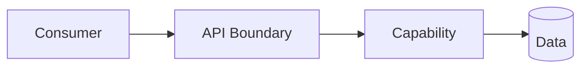
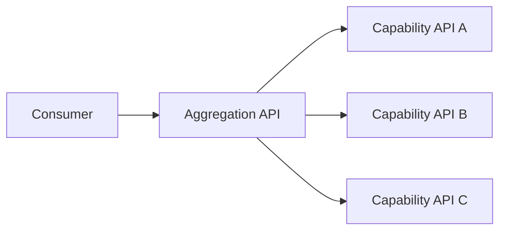
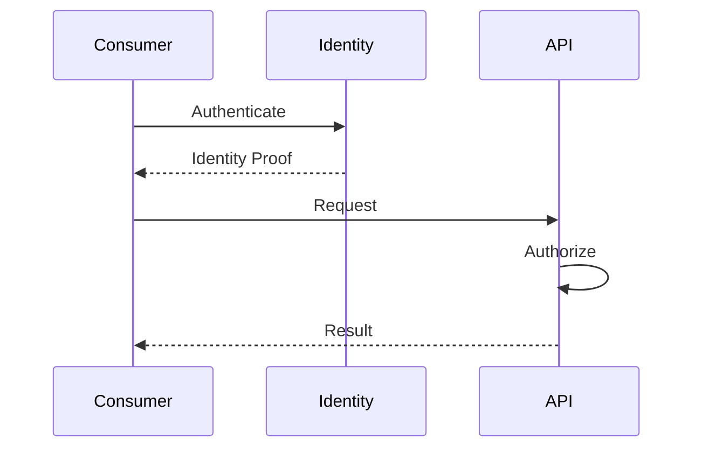
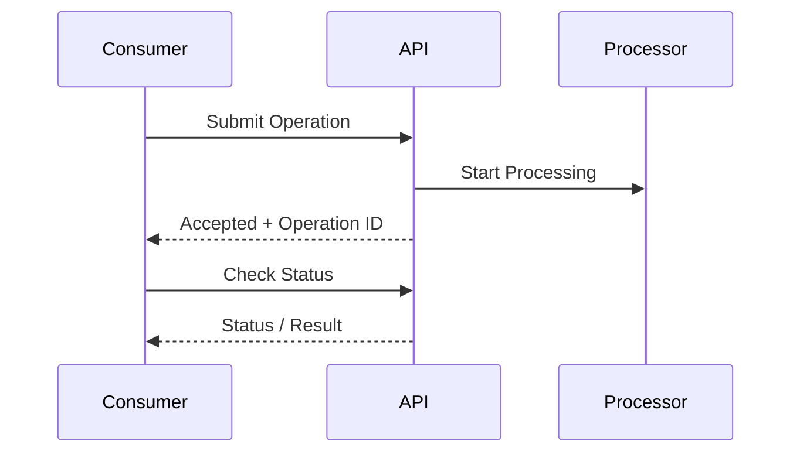
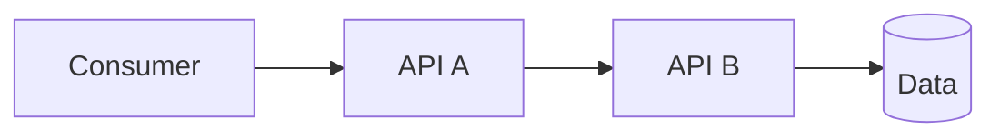

# API Principles Skill

## Purpose

This skill defines principles, decision criteria, standards, and best practices for designing APIs and service contracts.

APIs establish explicit contracts between:

- Systems
- Services
- Applications
- Components
- External consumers
- Partners
- Automation
- Integration boundaries

Good API architecture should provide contracts that are:

- Clear
- Consistent
- Secure
- Stable
- Evolvable
- Observable
- Reliable
- Understandable
- Appropriately performant

The objective is not to mandate a particular API technology or protocol.

The objective is to establish sound API design decisions before selecting implementation technologies.

This skill is:

- Domain-neutral
- Vendor-neutral
- Cloud-neutral
- Platform-neutral
- Language-neutral
- Framework-neutral
- Protocol-neutral
- Industry-neutral

---

# Objectives

Good API design should help:

- Establish clear system boundaries.
- Define explicit contracts.
- Reduce coupling.
- Hide internal implementation details.
- Support independent evolution.
- Provide predictable behavior.
- Establish consistent error handling.
- Protect sensitive operations.
- Support appropriate versioning.
- Support scalability.
- Support resilience.
- Support observability.
- Support governance.
- Provide useful documentation.
- Avoid unnecessary complexity.

---

# Fundamental Principle

## API Is a Contract

An API is not simply an implementation endpoint.

It represents a contract between:

```text
Consumer
    ↓
API Contract
    ↓
Provider
```

The contract may define:

- Operations
- Inputs
- Outputs
- Errors
- Authentication requirements
- Authorization expectations
- Behavioral semantics
- Compatibility expectations

Once consumers depend on an API, changing that contract can affect them.

Treat APIs as long-lived architectural contracts.

---

# Design From Consumer Needs

API design should begin by understanding:

- Who consumes the API?
- What capability do they need?
- What information do they require?
- What operations must they perform?
- What security requirements apply?
- What performance expectations exist?
- What failure behavior is acceptable?

Avoid exposing internal implementation structures directly.

---

# API Boundaries

APIs should correspond to meaningful architectural or capability boundaries.

Prefer:

```text
Consumer
   ↓
Business / System Capability
   ↓
API
```

rather than creating APIs around arbitrary implementation details.

A well-designed API hides unnecessary internal complexity.

---

# Encapsulation

Consumers should not need to understand internal implementation details.

Avoid exposing:

- Internal database schemas
- Internal class structures
- Infrastructure details
- Internal service topology
- Implementation-specific identifiers without need

This reduces coupling and supports independent evolution.

---

# API Styles

Different interaction styles solve different problems.

Architecture should select an API style based on requirements rather than organizational habit.

Common approaches include:

```text
Resource-Oriented APIs

RPC-Oriented APIs

Query-Oriented APIs

Event / Message Interfaces

Streaming Interfaces
```

No single style is correct for every interaction.

---

# Resource-Oriented APIs

Resource-oriented APIs represent capabilities as resources and operations on those resources.

They may be appropriate when:

- Resources have meaningful identities.
- Standard operations map naturally to the domain.
- Broad interoperability is useful.

Avoid forcing every business operation into artificial resource semantics.

---

# RPC-Oriented APIs

RPC-style interfaces represent operations or commands directly.

They may be appropriate when:

- Operations are action-oriented.
- Low latency matters.
- Strong interface definitions are valuable.
- Resource semantics are unnatural.

Avoid exposing excessively fine-grained internal methods.

---

# Query-Oriented APIs

Query-oriented APIs allow consumers to request specific information structures.

They may be useful when:

- Consumers have different data requirements.
- Multiple client experiences require flexible retrieval.

Potential concerns include:

- Query complexity
- Authorization complexity
- Resource consumption
- Caching complexity

Use only when the flexibility provides meaningful value.

---

# Asynchronous Interfaces

Not every interaction should be synchronous.

Asynchronous communication may be appropriate when:

- Processing takes significant time.
- Producer and consumer availability should be decoupled.
- Work can be deferred.
- Temporary dependency failure should not block producers.
- Event-driven behavior is required.

Refer to `integration-patterns.md`.

---

# Synchronous vs. Asynchronous

Choose based on interaction requirements.

## Synchronous

```text
Consumer
   ↓ Request
Provider
   ↓ Response
Consumer
```

Useful when an immediate response is required.

## Asynchronous

```text
Producer
   ↓
Message / Event
   ↓
Consumer
```

Useful when immediate completion is not required.

Do not make every interaction synchronous by default.

---

# Contract First

Where practical, define the API contract before implementation.

A contract may specify:

- Operations
- Input structure
- Output structure
- Required fields
- Optional fields
- Error behavior
- Authentication
- Version expectations

Contract-first thinking helps separate interface design from implementation.

---

# Naming

Names should be:

- Clear
- Consistent
- Predictable
- Domain meaningful

Avoid:

- Internal abbreviations
- Technology-specific names
- Inconsistent terminology
- Ambiguous names

Use the same term for the same concept across related APIs.

---

# Request Design

Requests should contain only information required to perform the operation.

Clearly distinguish:

- Required fields
- Optional fields
- Identifiers
- Filters
- Commands
- Metadata

Avoid requiring consumers to provide information the provider can reliably determine itself.

---

# Response Design

Responses should provide the information required by consumers without unnecessarily exposing internal implementation.

Responses should be:

- Predictable
- Consistent
- Appropriately sized
- Evolvable

Avoid returning excessive information by default.

---

# Data Types

API contracts should define data types clearly.

Consider:

- String
- Number
- Boolean
- Date
- Time
- Enumeration
- Object
- Collection

Avoid ambiguous representations where practical.

---

# Optional and Required Fields

Contracts should clearly distinguish required and optional information.

Adding a required field to an existing consumer request can create a breaking change.

Prefer compatibility-aware evolution.

---

# Nullability

Define whether fields may:

- Be absent
- Be null
- Contain empty values

Do not leave these semantics ambiguous.

---

# Enumerations

Enumerations can improve clarity but can also create compatibility issues.

Consumers should not necessarily assume that today's enumeration values are the only values that will ever exist.

Design enumerations with evolution in mind.

---

# Identifiers

Identifiers should be:

- Stable where required
- Unambiguous
- Appropriate to the API boundary

Avoid exposing internal storage identifiers solely because they already exist.

---

# Pagination

Large collections should not automatically be returned in a single response.

Use pagination where result size can become significant.

Conceptually:

```text
Large Result Set
       ↓
Page / Window
       ↓
Consumer
```

Pagination should define:

- Page size behavior
- Continuation behavior
- Ordering
- Stability expectations

---

# Filtering

Where consumers need subsets of information, APIs may support filtering.

Filters should be:

- Explicit
- Documented
- Predictable

Avoid creating arbitrary query capabilities that expose internal implementation details.

---

# Sorting

If sorting is supported, define:

- Supported fields
- Direction
- Default ordering
- Stability expectations

Do not assume storage ordering is a valid API contract.

---

# Partial Responses

Where payload size is significant, APIs may allow consumers to request only required fields.

Use this capability only when it provides measurable benefit.

It introduces additional contract and implementation complexity.

---

# Commands and Queries

Where useful, distinguish:

```text
Query
   ↓
Retrieve Information

Command
   ↓
Change State
```

Consumers should understand whether an operation modifies system state.

---

# Idempotency

An idempotent operation can be repeated without producing unintended additional effects.

Conceptually:

```text
Operation
   ↓
Same Operation Repeated
   ↓
Same Intended State
```

Idempotency is especially important when:

- Requests may be retried.
- Network failures occur.
- Consumers cannot determine whether a previous request succeeded.

---

# Idempotency Keys

For operations where duplicate processing would be harmful, a consumer-generated operation identifier may help detect duplicate requests.

Conceptually:

```text
Request + Operation ID
          ↓
Provider
          ↓
Duplicate?
   /              \
 Yes               No
 ↓                 ↓
Existing Result   Process
```

Use only where duplicate execution is a meaningful risk.

---

# Validation

APIs should validate information crossing their boundary.

Validation may include:

- Type
- Format
- Range
- Required values
- Structural validity
- Business rules

Reject invalid requests predictably.

---

# Error Handling

Errors are part of the API contract.

Error responses should help consumers determine:

- What happened?
- What category of failure occurred?
- Is retry appropriate?
- Was the request invalid?
- Was access denied?
- Did a dependency fail?

Avoid returning only generic errors.

---

# Error Categories

A consistent error model may distinguish:

```text
Validation Error

Authentication Error

Authorization Error

Resource Not Found

Conflict

Rate Limit

Dependency Failure

Temporary Failure

Internal Failure
```

Exact categories depend on the interface style.

---

# Error Information

Error responses may include:

- Stable error code
- Human-readable message
- Correlation identifier
- Relevant validation details

Do not expose:

- Secrets
- Stack traces
- Internal infrastructure details
- Sensitive implementation information

---

# Retry Semantics

APIs should make retry behavior understandable.

Consumers should know whether an operation is:

- Safe to retry
- Unsafe to retry
- Retryable only under certain failure conditions

Refer to `resilience.md`.

---

# Timeouts

Remote API calls should have bounded waiting behavior where appropriate.

Timeout design should consider:

- Expected processing time
- Consumer deadline
- Dependency latency
- Retry strategy

Avoid infinite waits.

---

# Long-Running Operations

Operations that require significant processing time should not necessarily hold synchronous connections indefinitely.

Consider patterns such as:

```text
Submit Operation
      ↓
Operation Accepted
      ↓
Process Asynchronously
      ↓
Check / Receive Completion
```

The exact mechanism depends on requirements.

---

# API Versioning

APIs evolve.

Versioning strategy should allow providers and consumers to evolve without unnecessary disruption.

Possible approaches include:

- Explicit versions
- Compatible contract evolution
- Capability negotiation

Do not introduce new versions for every minor change.

---

# Breaking Changes

Examples of potentially breaking changes include:

- Removing operations
- Removing fields
- Renaming fields
- Changing field meaning
- Changing data types
- Adding new required request fields
- Changing authorization behavior
- Changing error semantics

Breaking changes should be deliberate.

---

# Backward Compatibility

Prefer compatible evolution where practical.

Often safer changes include:

- Adding optional fields
- Adding new operations
- Adding optional capabilities

Compatibility still depends on consumer behavior.

Do not assume every additive change is automatically safe.

---

# API Deprecation

Deprecated APIs should have a defined lifecycle.

A deprecation process may include:

```text
Deprecation Announcement
        ↓
Migration Guidance
        ↓
Transition Period
        ↓
Retirement
```

Do not remove widely consumed contracts without understanding consumer impact.

---

# Consumer Awareness

API owners should understand important consumers where practical.

This supports:

- Change impact analysis
- Deprecation
- Incident communication
- Capacity planning

Avoid creating unmanaged APIs with unknown dependencies.

---

# Authentication

APIs should verify caller identity where required.

Authentication design should consider:

- Human consumers
- Applications
- Services
- Automation
- External systems

Avoid embedding long-lived credentials into clients where stronger identity mechanisms are available.

Refer to `security-architecture.md`.

---

# Authorization

Authentication answers:

> Who is calling?

Authorization answers:

> What may they do?

Every sensitive operation should enforce appropriate authorization.

Do not rely only on user-interface restrictions.

---

# Least Privilege

API permissions should grant only required capabilities.

Prefer meaningful scopes or permissions rather than broad unrestricted access.

---

# Object-Level Authorization

Authorization may need to consider the specific resource being accessed.

Conceptually:

```text
Identity
   ↓
Requested Resource
   ↓
Permission Check
   ↓
Allow / Deny
```

Authentication alone must not imply access to every resource.

---

# Multi-Tenant APIs

Where APIs serve multiple tenants, tenant boundaries must be explicit.

Architecture should ensure:

- Tenant identity is established.
- Authorization includes tenant context.
- Data access respects tenant isolation.
- Cross-tenant access cannot occur unintentionally.

Do not trust consumer-provided tenant identifiers without appropriate authorization validation.

---

# Transport Security

Communication crossing trust boundaries should use appropriate protection against:

- Interception
- Modification
- Impersonation

The exact mechanism depends on the protocol and environment.

---

# Sensitive Data

APIs should minimize exposure of sensitive information.

Consider:

- Request payloads
- Response payloads
- URLs
- Headers
- Logs
- Traces
- Error messages

Do not expose data simply because it exists internally.

---

# Rate Limiting

Rate limiting may protect:

- Availability
- Fair usage
- Dependency capacity
- Cost

Limits may be based on:

- Consumer
- Tenant
- Operation
- Resource
- Time window

Rate-limit behavior should be predictable and documented.

---

# Throttling

When demand exceeds allowed or available capacity, APIs may throttle requests.

Consumers should receive enough information to respond appropriately where practical.

---

# Quotas

Quotas may establish longer-term usage limits.

Examples conceptually include:

```text
Requests per Period

Data Volume per Period

Concurrent Operations
```

Quotas should align with business and capacity requirements.

---

# Backpressure

APIs should avoid accepting unlimited work when downstream capacity cannot process it.

Possible responses include:

- Throttling
- Rejection
- Queuing
- Deferred processing

Refer to `resilience.md`.

---

# Caching

Caching may improve:

- Latency
- Capacity
- Cost

But introduces:

- Staleness
- Invalidation
- Consistency concerns

API contracts should define cache behavior where it affects consumers.

---

# Performance

API performance requirements should be based on actual consumer needs.

Consider:

- Latency
- Throughput
- Concurrency
- Payload size
- Dependency latency

Do not optimize APIs for hypothetical scale without evidence.

---

# Payload Size

Large payloads increase:

- Network cost
- Serialization cost
- Memory usage
- Latency

Return only useful information.

Use pagination, filtering, or alternative transfer approaches where justified.

---

# Chatty APIs

Excessive fine-grained calls can create high latency and coupling.

Example:

```text
Consumer
   ↓
Call 1
   ↓
Call 2
   ↓
Call 3
   ↓
Call 4
```

Consider whether the API boundary is too granular.

---

# Coarse vs. Fine-Grained APIs

Fine-grained APIs provide flexibility but may increase communication overhead.

Coarse-grained APIs reduce round trips but may create larger contracts.

Choose based on consumer interaction patterns.

---

# API Composition

A consumer may require information from multiple capabilities.

Composition may occur:

- Client side
- Service side
- Through an aggregation boundary

Select the approach based on:

- Coupling
- Performance
- Ownership
- Failure behavior

---

# API Gateway Concept

Some architectures introduce a shared entry boundary for capabilities such as:

- Routing
- Authentication integration
- Rate limiting
- Policy enforcement
- Observability

This is an architectural concept, not a requirement.

Do not introduce a gateway where its benefits do not justify additional complexity.

---

# API Gateway Responsibilities

Avoid turning a gateway into a central business-logic layer.

Prefer gateways for cross-cutting concerns rather than domain behavior.

Business rules should remain within appropriate ownership boundaries.

---

# API Aggregation

Aggregation may simplify consumer interactions.

Conceptually:

```text
Consumer
   ↓
Aggregation Boundary
   ├── Capability A
   ├── Capability B
   └── Capability C
```

Consider:

- Failure handling
- Latency
- Coupling
- Ownership

---

# Resilience

APIs should define behavior during failure.

Consider:

- Timeouts
- Retries
- Circuit breaking
- Rate limiting
- Load shedding
- Graceful degradation

Refer to `resilience.md`.

---

# Dependency Failure

An API should distinguish where practical between:

```text
Consumer Error

Provider Error

Dependency Error

Temporary Failure
```

This helps consumers respond correctly.

---

# Graceful Degradation

If a non-critical dependency fails, an API may provide reduced functionality where business requirements permit.

Do not return misleading success when essential processing failed.

---

# Observability

APIs should produce sufficient telemetry to understand:

- Traffic
- Latency
- Errors
- Authentication failures
- Authorization failures
- Dependency failures
- Rate limiting
- Version usage

Refer to `observability.md`.

---

# Correlation

Requests should support correlation across relevant boundaries.

Conceptually:

```text
Consumer
   ↓
API A
   ↓
API B
   ↓
Data
```

Related activity should be traceable where operational requirements justify it.

---

# API Metrics

Useful API metrics may include:

- Request rate
- Success rate
- Error rate
- Latency
- Throttling
- Dependency latency

Metrics should reflect operational questions rather than being collected without purpose.

---

# API Logging

API logs should provide useful operational context while avoiding sensitive information.

Do not log complete request and response payloads by default.

---

# API Documentation

APIs should be documented sufficiently for intended consumers.

Documentation may include:

- Purpose
- Operations
- Inputs
- Outputs
- Authentication
- Authorization
- Error behavior
- Pagination
- Rate limits
- Versioning
- Examples

Documentation should reflect the actual contract.

---

# Machine-Readable Contracts

Where appropriate, API contracts should use machine-readable interface definitions.

Potential benefits include:

- Validation
- Documentation generation
- Client generation
- Testing
- Compatibility analysis

Do not assume generated clients eliminate the need for good API design.

---

# API Discoverability

Consumers should be able to determine:

- What APIs exist?
- Who owns them?
- What they do?
- How to access them?
- Which versions are supported?

At organizational scale, unmanaged API discovery becomes a governance problem.

---

# API Ownership

Every API should have identifiable ownership.

Ownership should include responsibility for:

- Contract
- Availability
- Security
- Documentation
- Changes
- Deprecation
- Support

Avoid orphaned APIs.

---

# API Lifecycle

APIs should be managed throughout their lifecycle.

Conceptually:

```text
Design
  ↓
Review
  ↓
Implement
  ↓
Publish
  ↓
Operate
  ↓
Evolve
  ↓
Deprecate
  ↓
Retire
```

---

# API Governance

Enterprise API governance may define standards for:

- Naming
- Authentication
- Authorization
- Error models
- Versioning
- Documentation
- Security
- Observability
- Ownership
- Deprecation

Governance should promote consistency without preventing legitimate architectural variation.

---

# Internal APIs

Internal APIs still require sound contracts.

Do not assume internal consumers can tolerate arbitrary breaking changes.

Internal APIs may eventually acquire many consumers and become difficult to evolve.

---

# External APIs

Externally exposed APIs usually require stronger attention to:

- Stability
- Documentation
- Security
- Versioning
- Rate limiting
- Consumer communication
- Deprecation

External contracts generally have less control over consumer upgrade timing.

---

# Partner APIs

Partner integrations may require additional considerations such as:

- Explicit access agreements
- Stable contracts
- Consumer onboarding
- Quotas
- Auditing
- Change communication

---

# API Testing

API contracts should be testable.

Testing may include:

- Contract validation
- Functional behavior
- Authorization
- Validation
- Error handling
- Compatibility
- Performance
- Resilience

---

# Contract Testing

Contract testing helps verify that providers and consumers maintain compatible expectations.

Conceptually:

```text
Consumer Expectation
        ↓
Contract
        ↓
Provider Behavior
```

This is particularly useful when components evolve independently.

---

# Negative Testing

API testing should include invalid and unauthorized behavior.

Examples include:

- Missing required information
- Invalid types
- Invalid identifiers
- Unauthorized operations
- Excessive request rates
- Malformed payloads

Do not test only successful paths.

---

# API Security Review

Security review should consider:

- Authentication
- Authorization
- Object-level authorization
- Input validation
- Data exposure
- Rate limiting
- Abuse cases
- Logging
- Secrets
- Trust boundaries

Refer to `security-architecture.md`.

---

# API Architecture Decision Framework

For each API boundary evaluate:

## 1. Consumer

Who will use the interface?

## 2. Capability

What capability is being exposed?

## 3. Interaction

Is the interaction synchronous, asynchronous, query-oriented, streaming, or another style?

## 4. Contract

What information and behavior must be guaranteed?

## 5. Coupling

Does the contract unnecessarily expose internal implementation?

## 6. Security

How are authentication and authorization handled?

## 7. Reliability

What happens during failure?

## 8. Performance

What latency, throughput, and payload characteristics matter?

## 9. Scalability

How does the API behave as demand grows?

## 10. Evolution

How will the contract change safely?

## 11. Observability

How will usage and failures be understood?

## 12. Ownership

Who owns and supports the API?

## 13. Governance

Which organizational standards apply?

Choose the simplest interface that satisfies these requirements.

---

# Mermaid Diagram Guidance

Use Mermaid diagrams when they improve understanding of API relationships.

## API Context



## API Composition



## Authentication and Authorization



## Long-Running Operation



## API Dependency



Diagrams should describe meaningful API boundaries and interactions rather than implementation-level code.

---

# Best Practices

- Treat APIs as contracts.
- Design from consumer needs.
- Align APIs with meaningful capability boundaries.
- Hide internal implementation details.
- Select API style according to interaction requirements.
- Use contract-first thinking where practical.
- Use clear and consistent terminology.
- Define required and optional fields.
- Define null semantics.
- Design identifiers deliberately.
- Paginate potentially large result sets.
- Define filtering and sorting behavior explicitly.
- Make state-changing behavior clear.
- Design retryable operations appropriately.
- Use idempotency where duplicate execution is risky.
- Validate all untrusted input.
- Define consistent error behavior.
- Avoid exposing internal error details.
- Define timeout behavior.
- Handle long-running operations appropriately.
- Evolve contracts compatibly where practical.
- Manage breaking changes deliberately.
- Establish deprecation processes.
- Authenticate sensitive access.
- Authorize every protected operation.
- Apply least privilege.
- Protect tenant boundaries.
- Minimize sensitive-data exposure.
- Apply rate limits where justified.
- Consider backpressure.
- Avoid unnecessarily large payloads.
- Avoid excessively chatty interfaces.
- Design for dependency failure.
- Make API behavior observable.
- Support correlation.
- Maintain accurate documentation.
- Establish API ownership.
- Manage APIs through their lifecycle.
- Apply governance proportionally.

---

# Quality Considerations

Good API architecture should demonstrate:

## Clarity

Consumers can understand the contract.

## Consistency

Similar concepts behave predictably.

## Encapsulation

Internal implementation is hidden appropriately.

## Security

Access and data are appropriately protected.

## Reliability

Failure behavior is deliberate.

## Evolvability

Contracts can change without unnecessary disruption.

## Performance

Interactions satisfy required latency and throughput.

## Scalability

The API can support expected demand.

## Observability

Usage and failures can be understood.

## Governance

Ownership and lifecycle are clear.

---

# Trade-offs

API design commonly involves trade-offs such as:

| Concern | Trade-off |
|---|---|
| Fine-Grained API | Network Chattiness |
| Coarse-Grained API | Larger Contracts |
| Flexible Queries | Complexity |
| Strict Contracts | Consumer Flexibility |
| Backward Compatibility | Evolution Speed |
| API Versioning | Maintenance |
| Synchronous Interaction | Availability Coupling |
| Asynchronous Interaction | Workflow Complexity |
| Detailed Errors | Information Exposure |
| Rate Limiting | Consumer Throughput |
| Caching | Freshness |
| Aggregation | Coupling |
| Gateway | Central Complexity |
| Large Payloads | Latency |
| Extensive Logging | Cost / Privacy |
| Strong Isolation | Operational Complexity |

Trade-offs should be explicit.

---

# Common Mistakes

Avoid:

- Treating APIs as simple implementation endpoints.
- Designing APIs directly from database schemas.
- Exposing internal implementation structures.
- Creating one API operation for every internal method.
- Using one API style for every interaction.
- Making every integration synchronous.
- Using inconsistent naming.
- Creating ambiguous required/optional semantics.
- Returning unbounded collections.
- Assuming database ordering is API ordering.
- Returning generic errors for every failure.
- Exposing stack traces.
- Exposing sensitive information in errors.
- Retrying every failed API request.
- Ignoring idempotency.
- Using infinite timeouts.
- Holding synchronous connections for extremely long processing.
- Creating new API versions unnecessarily.
- Introducing breaking changes without consumer analysis.
- Removing APIs without deprecation.
- Treating authentication as authorization.
- Trusting tenant identifiers without authorization.
- Logging full sensitive payloads.
- Creating unlimited APIs without rate or capacity considerations.
- Building excessively chatty interfaces.
- Putting domain logic into gateways.
- Ignoring downstream failures.
- Creating APIs without observability.
- Creating APIs without ownership.
- Creating undocumented internal APIs.
- Assuming internal APIs never require compatibility.
- Allowing obsolete API versions to remain indefinitely without governance.

---

# Validation Checklist

Before considering an API design sufficiently sound, verify:

- [ ] Intended consumers are identified.
- [ ] Exposed capability is clear.
- [ ] API boundary aligns with architecture.
- [ ] API style is justified.
- [ ] Synchronous vs. asynchronous interaction is justified.
- [ ] Internal implementation details are appropriately hidden.
- [ ] Naming is consistent.
- [ ] Request contracts are clear.
- [ ] Response contracts are clear.
- [ ] Required fields are identified.
- [ ] Optional fields are identified.
- [ ] Null behavior is defined where relevant.
- [ ] Data types are unambiguous.
- [ ] Identifier semantics are clear.
- [ ] Large collections are bounded.
- [ ] Pagination is considered.
- [ ] Filtering is controlled where supported.
- [ ] Sorting behavior is defined where supported.
- [ ] State-changing operations are clear.
- [ ] Idempotency is considered.
- [ ] Duplicate execution is considered.
- [ ] Input validation is defined.
- [ ] Error categories are meaningful.
- [ ] Error responses do not expose sensitive details.
- [ ] Retry semantics are understood.
- [ ] Timeout behavior is considered.
- [ ] Long-running operations are handled appropriately.
- [ ] Compatibility strategy is defined.
- [ ] Breaking changes are controlled.
- [ ] Deprecation strategy exists where needed.
- [ ] Authentication requirements are defined.
- [ ] Authorization requirements are defined.
- [ ] Object-level authorization is considered.
- [ ] Tenant boundaries are protected where relevant.
- [ ] Sensitive-data exposure is minimized.
- [ ] Transport protection is appropriate.
- [ ] Rate limiting is considered.
- [ ] Quotas are considered where relevant.
- [ ] Backpressure is considered.
- [ ] Payload size is appropriate.
- [ ] Excessive chattiness is avoided.
- [ ] Dependency failures are handled.
- [ ] API telemetry requirements are defined.
- [ ] Correlation is supported where required.
- [ ] Documentation requirements are defined.
- [ ] Contract testing is considered.
- [ ] API ownership is clear.
- [ ] API lifecycle is understood.
- [ ] Organizational API standards are applied where relevant.

---

# Relationship With Other Architecture Skills

API design is closely connected to the broader architecture knowledge base.

Use this skill together with:

### `architecture-principles.md`

For architectural boundaries, quality attributes, constraints, and trade-offs.

### `architecture-patterns.md`

For structural patterns that determine API boundaries.

### `system-design.md`

For component responsibilities, dependencies, state, and system interactions.

### `distributed-systems.md`

For network uncertainty, partial failures, consistency, distributed operations, and duplicate processing.

### `integration-patterns.md`

For synchronous communication, asynchronous messaging, events, retries, idempotency, and integration contracts.

### `data-architecture.md`

For data ownership, data contracts, consistency, lifecycle, and information exposure.

### `cloud-architecture.md`

For cloud deployment, scaling, networking, and service boundaries.

### `security-architecture.md`

For authentication, authorization, trust boundaries, API threats, and data protection.

### `observability.md`

For API metrics, logging, tracing, correlation, health, and operational visibility.

### `resilience.md`

For timeouts, retries, circuit breakers, rate limiting, dependency failure, graceful degradation, and recovery.

Conceptually:

```text
                  Architecture
                       │
                System Design
                       │
          ┌────────────┼────────────┐
          ↓            ↓            ↓
        Data      Integration     Security
    Architecture    Patterns    Architecture
          \            |            /
           \           |           /
            └──── API Principles ──┘
                       │
              API Contract Design
                       │
              Technology Selection
                       │
                 Implementation
```

API principles should therefore define **how interfaces are designed and governed**, while implementation-specific technologies should be selected later.

---

# References

API architecture practices may draw, where applicable, from recognized guidance such as:

- HTTP semantics and standards
- REST architectural principles
- OpenAPI concepts
- AsyncAPI concepts
- RPC principles
- Graph-based API principles
- OWASP API Security guidance
- Zero Trust principles
- Distributed systems principles
- Domain-driven design concepts
- Consumer-driven contract testing
- Semantic versioning concepts
- Idempotency principles
- API lifecycle management practices
- Relevant organizational API governance standards

These references should be treated as reusable guidance rather than mandatory technology choices.

The appropriate API architecture should ultimately be determined by consumer requirements, capability boundaries, interaction style, security, reliability, performance, scalability, compatibility, observability, governance, operational requirements, and organizational constraints.