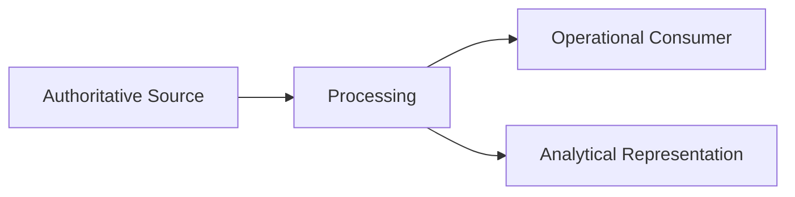
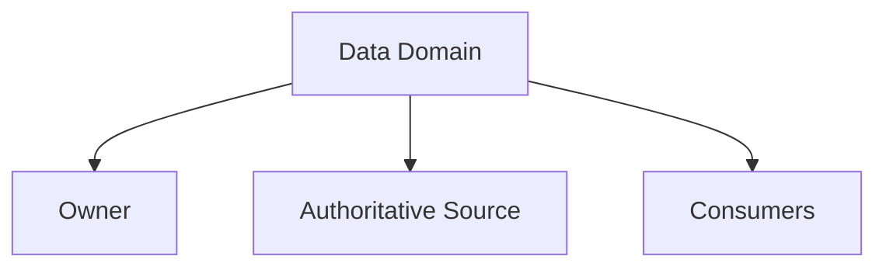
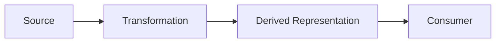

# Data Architecture Skill

## Purpose

This skill defines principles, concepts, decision criteria, and best practices for designing, governing, storing, moving, protecting, and managing data throughout its lifecycle.

Data architecture describes how data is:

- Created
- Owned
- Structured
- Stored
- Accessed
- Shared
- Integrated
- Protected
- Governed
- Retained
- Archived
- Deleted

The objective is not to select a particular database or storage technology.

The objective is to establish data structures and responsibilities that satisfy functional, analytical, security, privacy, reliability, performance, governance, and lifecycle requirements.

This skill is:

- Domain-neutral
- Technology-neutral
- Vendor-neutral
- Platform-neutral
- Database-neutral
- Solution-neutral
- Industry-neutral

It should be used as organizational knowledge rather than as a product-selection or implementation guide.

---

# Objectives

Good data architecture should help:

- Establish clear data ownership.
- Identify authoritative data sources.
- Maintain appropriate data quality.
- Support required access patterns.
- Define appropriate consistency requirements.
- Minimize unnecessary duplication.
- Support transactional and analytical needs.
- Protect sensitive information.
- Support governance and compliance.
- Maintain useful metadata.
- Support data lineage.
- Define retention and deletion.
- Support scalability and availability.
- Manage data movement deliberately.
- Enable controlled evolution.

---

# Definitions

## Data

Recorded facts, observations, measurements, events, states, or representations used by systems or people.

## Data Domain

A meaningful grouping of data associated with a business capability, responsibility, or subject area.

## Data Owner

The role accountable for appropriate definition, use, governance, quality, and lifecycle of data.

## Data Steward

A role responsible for supporting data quality, definition, governance, and operational management.

## Authoritative Source

The recognized source responsible for maintaining the official state of particular information.

## System of Record

A system designated as the authoritative source for a defined set of information.

## Metadata

Information describing data.

Examples include:

- Meaning
- Structure
- Type
- Ownership
- Classification
- Source
- Lineage

## Data Lineage

Information describing where data originated, how it moved, and how it was transformed.

## Data Quality

The degree to which data is suitable for its intended use.

## Data Classification

Categorization of data according to characteristics such as sensitivity, confidentiality, criticality, or regulatory requirements.

## Data Residency

Requirements governing the geographic location where data may be stored or processed.

## Data Retention

Rules defining how long data must or may be retained.

## Data Model

A representation of data concepts, relationships, structures, and constraints.

---

# Fundamental Principles

## Data Is an Architectural Concern

Data architecture should not be treated as a secondary implementation detail.

Data decisions can have long-term consequences for:

- Business operations
- Integration
- Security
- Privacy
- Analytics
- Compliance
- Scalability
- Migration
- Cost

Important data decisions should therefore be explicit.

---

# Start With Data Requirements

Before selecting storage or processing approaches, understand:

- What information exists?
- What does it mean?
- Who owns it?
- Who creates it?
- Who changes it?
- Who consumes it?
- How is it accessed?
- How much data exists?
- How quickly does it change?
- How long must it remain available?
- How sensitive is it?
- What consistency is required?

Technology selection should follow these requirements.

---

# Clear Data Ownership

Important data should have identifiable ownership.

Ownership should answer:

- Who defines the meaning?
- Who controls changes?
- Who establishes quality expectations?
- Who approves access?
- Who governs retention?
- Who resolves ambiguity?

Avoid data without clear accountability.

---

# Authoritative Source

For important information, identify an authoritative source.

Conceptually:

```text
Authoritative Source
        ↓
   Controlled Sharing
        ↓
Derived Representations
```

Derived copies may exist for:

- Reporting
- Analytics
- Search
- Performance
- Integration
- Resilience

However, authoritative ownership should remain clear.

---

# Avoid Conflicting Sources of Truth

Problems arise when multiple independent systems believe they own the same authoritative information.

Conceptually:

```text
System A → "I own Customer Status"

System B → "I own Customer Status"
```

This creates ambiguity around:

- Updates
- Conflict resolution
- Data quality
- Governance

Where multiple systems maintain related information, define responsibility explicitly.

---

# Data Domains

Data may be organized around meaningful domains.

Examples of generic domains include:

```text
Party
Transaction
Asset
Product
Agreement
Location
Event
```

Domain boundaries should reflect meaning and ownership rather than arbitrary technical grouping.

---

# Data Modeling

Data models should represent meaningful concepts and relationships.

Common levels include:

### Conceptual Model

Describes important concepts and relationships without implementation detail.

### Logical Model

Describes entities, attributes, relationships, and rules.

### Physical Model

Describes how data is represented in a specific storage implementation.

Architecture should distinguish conceptual meaning from physical representation.

---

# Data Modeling Principles

Good data models should:

- Represent meaningful concepts.
- Use consistent terminology.
- Define relationships clearly.
- Avoid unnecessary duplication.
- Preserve important constraints.
- Support required access patterns.

Do not allow storage implementation details to unnecessarily dictate business meaning.

---

# Structured Data

Structured data follows a predefined organization.

Examples include:

- Records
- Attributes
- Relationships
- Tables
- Typed fields

Structured data is useful when:

- Relationships are important.
- Validation is required.
- Query patterns are known.
- Consistency rules are significant.

---

# Semi-Structured Data

Semi-structured data has identifiable organization without requiring a rigid universal schema.

It may be useful when:

- Records vary.
- Structures evolve frequently.
- Hierarchical information is natural.
- Flexible representation is valuable.

Flexibility should not eliminate governance.

---

# Unstructured Data

Unstructured data does not naturally fit conventional record structures.

Examples may include:

- Documents
- Images
- Audio
- Video
- Free-form text

Architecture should still define:

- Ownership
- Metadata
- Classification
- Retention
- Access
- Lifecycle

Unstructured does not mean unmanaged.

---

# Transactional Data

Transactional data supports operational processes where individual state changes matter.

Common characteristics may include:

- Frequent reads and writes
- Concurrency
- Integrity constraints
- Low-latency operations
- Transactional consistency

Transactional requirements should be separated from analytical requirements where their characteristics differ substantially.

---

# Analytical Data

Analytical data supports activities such as:

- Reporting
- Trend analysis
- Aggregation
- Exploration
- Decision support
- Historical analysis

Analytical workloads often have different characteristics from transactional workloads.

Examples include:

- Large scans
- Aggregation
- Historical queries
- Multi-source analysis

Avoid forcing operational and analytical workloads into the same architecture without evaluating their different needs.

---

# Operational vs. Analytical Concerns

Conceptually:

```text
Operational Data
      ↓
Controlled Movement
      ↓
Analytical Representation
```

The analytical representation may differ from the operational model.

This is acceptable when ownership and lineage remain clear.

---

# Data Access Patterns

Storage and modeling decisions should consider how data will actually be accessed.

Identify:

- Read patterns
- Write patterns
- Query patterns
- Filtering
- Sorting
- Aggregation
- Relationships
- Search requirements
- Batch access
- Streaming access

Do not optimize data architecture around hypothetical access patterns.

---

# Read and Write Characteristics

Understand the relative workload.

For example:

```text
Read Heavy

Write Heavy

Balanced

Append Heavy

Batch Oriented

Streaming
```

Different characteristics may justify different architectural decisions.

---

# Data Volume

Estimate realistic data volume.

Consider:

- Initial volume
- Growth
- Retention
- Derived copies
- Historical information
- Backups
- Indexes
- Replicas

Do not consider only the primary data representation.

---

# Data Velocity

Velocity describes how quickly data:

- Arrives
- Changes
- Must be processed

High-volume data does not necessarily mean high-velocity data.

The two should be evaluated separately.

---

# Data Variety

Systems may contain multiple forms of data.

Architecture should not force every form into a single storage model merely for standardization.

Use storage characteristics appropriate to the data and access requirements.

---

# Storage Selection Characteristics

Before selecting a storage technology, identify required characteristics.

Consider:

- Data structure
- Relationships
- Query patterns
- Consistency
- Transaction requirements
- Scale
- Latency
- Availability
- Durability
- Retention
- Search
- Analytics
- Geographic requirements
- Cost

Then evaluate technologies against those characteristics.

---

# Relational Characteristics

A relational model may be suitable when:

- Relationships are significant.
- Structured constraints matter.
- Transactional integrity is important.
- Flexible querying is required.
- Data structure is reasonably well understood.

This does not imply a particular relational database product.

---

# Key-Value Characteristics

A key-value model may be suitable when:

- Access primarily occurs through known keys.
- Simple retrieval is dominant.
- Very high scale or low latency is important.
- Complex relationships are limited.

---

# Document Characteristics

A document-oriented model may be suitable when:

- Information naturally forms aggregates or documents.
- Structures vary.
- Hierarchical representation is useful.
- Data is commonly retrieved as a unit.

---

# Graph Characteristics

A graph-oriented model may be suitable when:

- Relationships themselves are central.
- Multi-hop traversal is important.
- Connections are complex or highly dynamic.

---

# Time-Series Characteristics

A time-series model may be suitable when:

- Data is primarily organized around time.
- Append-oriented workloads dominate.
- Time-window queries are frequent.
- Aggregation over time is important.

---

# Object or Blob Characteristics

Object-oriented storage characteristics may be suitable for:

- Documents
- Media
- Archives
- Large binary objects
- Data files

Metadata and lifecycle management remain important.

---

# Polyglot Persistence

Different data responsibilities may use different storage models when their requirements differ significantly.

Conceptually:

```text
System
│
├── Transactional Data → Model A
├── Search Data        → Model B
├── Analytical Data    → Model C
└── Documents          → Model D
```

Potential benefits:

- Better workload fit
- Independent optimization

Potential costs:

- More operational complexity
- More skills required
- Data synchronization
- Governance complexity

Use multiple storage models only when benefits justify complexity.

---

# Data Consistency

Consistency requirements should come from business behavior.

Ask:

- Must every consumer see the latest value immediately?
- Can temporary staleness be tolerated?
- Can conflicting updates occur?
- What happens when data diverges?
- How will convergence occur?

Avoid stronger consistency than requirements justify.

---

# Transaction Boundaries

Transactions should protect meaningful consistency boundaries.

Prefer transactions within clear ownership boundaries where possible.

Cross-boundary transactions introduce significant coordination complexity.

Where full atomicity is unnecessary, alternative consistency mechanisms may be more appropriate.

---

# Concurrency

Where multiple actors may modify the same data, consider:

- Lost updates
- Conflicting changes
- Duplicate operations
- Race conditions

Possible approaches may include:

- Optimistic concurrency
- Pessimistic coordination
- Version checks
- Domain-specific conflict resolution

Choose based on actual conflict characteristics.

---

# Replication

Replication may support:

- Availability
- Read scalability
- Recovery
- Geographic access

Replication introduces:

- Consistency concerns
- Synchronization
- Lag
- Conflict possibilities
- Additional cost

Replication should serve an explicit requirement.

---

# Partitioning

Partitioning distributes data across boundaries.

Potential reasons include:

- Scale
- Performance
- Isolation
- Ownership

A good partitioning strategy should:

- Distribute workload appropriately.
- Avoid hotspots.
- Support common access patterns.
- Support growth.
- Minimize unnecessary cross-partition operations.

---

# Partition Key Selection

A partition key should consider:

- Data distribution
- Access patterns
- Cardinality
- Growth
- Hotspot risk

Poor partition-key selection can undermine otherwise scalable architecture.

---

# Data Duplication

Duplication may be appropriate for:

- Reporting
- Search
- Caching
- Analytics
- Integration
- Resilience

But every duplicate creates lifecycle and consistency responsibilities.

For each copy, determine:

- Why does it exist?
- Who owns it?
- How fresh must it be?
- How is it updated?
- How is it deleted?
- How is divergence repaired?

---

# Derived Data

Derived data is created from authoritative information.

Examples include:

- Aggregates
- Projections
- Search indexes
- Reports
- Analytical models

Derived data should generally be reproducible from authoritative sources where practical.

---

# Data Movement

Data movement should be deliberate.

Before moving data, ask:

- Why must it move?
- What information is required?
- How frequently?
- How much?
- Across what trust boundary?
- What latency is acceptable?
- What consistency is required?
- What cost is introduced?

Avoid unnecessary movement.

---

# Batch Data Movement

Batch movement may be suitable when:

- Immediate freshness is unnecessary.
- Large volumes can be transferred efficiently.
- Scheduled processing is acceptable.

---

# Incremental Data Movement

Incremental approaches move only changed or newly created information.

Potential benefits include:

- Lower data movement
- Improved freshness
- Reduced processing

They introduce requirements for:

- Change tracking
- Ordering
- Recovery
- Duplicate handling

---

# Event-Based Data Propagation

Meaningful state changes may be propagated through events.

This can reduce direct data coupling.

However, event consumers may maintain derived copies that require eventual consistency and reconciliation.

---

# Data Synchronization

When data exists in multiple locations, define:

- Direction
- Ownership
- Frequency
- Conflict behavior
- Recovery
- Reconciliation

Avoid uncontrolled bidirectional synchronization.

Bidirectional synchronization often creates ambiguous ownership.

---

# Data Quality

Data quality should be evaluated according to intended use.

Relevant dimensions may include:

### Accuracy

Does data correctly represent reality?

### Completeness

Is required information present?

### Consistency

Does data remain logically compatible across relevant representations?

### Timeliness

Is data sufficiently current?

### Validity

Does data conform to required rules?

### Uniqueness

Are unintended duplicates controlled?

### Integrity

Are important relationships and constraints preserved?

---

# Data Quality Ownership

Quality should have clear accountability.

Define:

- Expected quality
- Validation rules
- Monitoring
- Remediation ownership
- Acceptable thresholds where applicable

Do not assume downstream consumers should repair poor source data independently.

---

# Validation

Data should be validated as close as practical to the point where correctness can be determined.

Validation may involve:

- Structure
- Type
- Range
- Required fields
- Relationships
- Business rules

Validation should not be duplicated inconsistently across unrelated boundaries.

---

# Metadata

Metadata makes data understandable and manageable.

Useful metadata may include:

- Name
- Meaning
- Owner
- Source
- Type
- Classification
- Retention
- Relationships
- Lineage

Critical data should not depend entirely on undocumented tribal knowledge.

---

# Data Lineage

Lineage should answer:

```text
Where did this data come from?

        ↓

How was it transformed?

        ↓

Where is it used?
```

Lineage is particularly valuable for:

- Analytics
- Compliance
- Troubleshooting
- Data quality
- Impact analysis

---

# Data Classification

Data should be classified according to relevant organizational requirements.

Possible considerations include:

- Public
- Internal
- Confidential
- Restricted
- Sensitive

Exact classifications should follow organizational policy.

Do not invent organizational classification schemes when none have been provided.

---

# Sensitive Data

Sensitive information should receive controls appropriate to risk.

Consider:

- Collection
- Access
- Storage
- Processing
- Movement
- Logging
- Retention
- Deletion

Avoid collecting or propagating sensitive information without a legitimate requirement.

---

# Data Minimization

Collect, store, and distribute only data required for legitimate purposes.

Data minimization can reduce:

- Privacy risk
- Security exposure
- Storage cost
- Governance burden
- Integration complexity

---

# Access Control

Data access should reflect:

- Identity
- Responsibility
- Need
- Classification
- Context

Apply least privilege.

Avoid broad shared access where more precise boundaries are practical.

---

# Encryption

Where confidentiality requirements justify it, consider protection:

```text
Data at Rest

Data in Transit

Data During Processing
```

The exact protection mechanism depends on risk and platform capability.

Encryption should not be treated as a replacement for access control.

---

# Data Masking

Where full values are unnecessary, sensitive information may be masked or transformed.

Potential use cases include:

- Non-production environments
- Reporting
- Support activities
- Limited-access views

Masking should preserve only the information required for the intended purpose.

---

# Tokenization and Pseudonymization

Where appropriate, direct identifiers may be replaced with alternative values.

These techniques can reduce exposure but do not automatically remove all privacy obligations.

---

# Data Privacy

Where personal or sensitive information exists, architecture should consider:

- Purpose limitation
- Data minimization
- Consent where applicable
- Access
- Retention
- Correction
- Deletion
- Disclosure
- Residency
- Auditability

Privacy requirements depend on applicable organizational and regulatory context.

---

# Data Residency

Some information may be required to remain within specific geographic or jurisdictional boundaries.

Architecture should identify:

- Where data is stored.
- Where replicas exist.
- Where backups exist.
- Where processing occurs.
- Where data is transferred.

Residency should be treated as an end-to-end requirement.

---

# Data Sovereignty

Data sovereignty concerns legal or regulatory authority over information based on jurisdiction.

Do not assume residency and sovereignty are identical.

Relevant legal or governance expertise should determine actual obligations.

---

# Data Lifecycle

Data should have a defined lifecycle.

Conceptually:

```text
Create
  ↓
Use
  ↓
Modify
  ↓
Share
  ↓
Retain
  ↓
Archive
  ↓
Delete
```

Different data categories may have different lifecycle requirements.

---

# Retention

Retention should define how long information must or may remain available.

Retention may be influenced by:

- Business needs
- Legal requirements
- Regulatory requirements
- Contractual requirements
- Audit requirements
- Cost

Avoid indefinite retention without justification.

---

# Archival

Data that is no longer actively used may be moved to an archival state.

Archival decisions should consider:

- Retrieval frequency
- Retrieval time
- Cost
- Compliance
- Integrity
- Retention

Archived data remains governed data.

---

# Deletion

Deletion should be deliberate and verifiable where required.

Consider:

- Primary copies
- Replicas
- Derived copies
- Caches
- Analytical representations
- Archives
- Backups

Deletion requirements may be difficult when data has been widely duplicated.

This is another reason to minimize unnecessary duplication.

---

# Backup

Backup protects against data loss or corruption.

Backup design should consider:

- What must be protected?
- How frequently?
- For how long?
- Where?
- How quickly must it be restored?
- How is integrity verified?

Creating backups without testing restoration provides limited assurance.

---

# Recovery

Data recovery should reflect required recovery objectives.

Consider:

- Acceptable data loss
- Acceptable recovery time
- Restoration sequence
- Dependency order
- Integrity validation

Recovery requirements should come from business needs.

---

# Historical Data

Some data must preserve historical state.

Determine whether the requirement is:

- Current state only
- Change history
- Audit history
- Temporal reconstruction
- Analytical history

These are different requirements and may require different approaches.

---

# Audit Data

Audit data should capture relevant evidence of important actions where required.

Audit information may include:

- Actor
- Action
- Target
- Time
- Outcome

Audit records should be protected according to their purpose.

Avoid recording unnecessary sensitive information in audit data.

---

# Search

Search requirements may differ from transactional query requirements.

Consider:

- Full-text search
- Filtering
- Ranking
- Faceting
- Semantic relationships
- Freshness

A derived search representation may be appropriate when transactional storage cannot efficiently support search requirements.

---

# Caching

Caching creates temporary derived copies to improve:

- Latency
- Throughput
- Availability
- Dependency load

Caching introduces:

- Staleness
- Invalidation
- Additional state

Cache design should define:

- What is cached?
- For how long?
- What freshness is acceptable?
- How is invalidation handled?

---

# Data for Analytics

Analytical data should preserve:

- Meaning
- Ownership
- Lineage
- Quality
- Classification

Moving data into an analytical environment does not remove governance responsibilities.

---

# Data Integration

Data exchanged between domains should use clear contracts.

Avoid exposing physical storage schemas directly unless intentionally justified.

Integration contracts should represent meaningful information rather than accidental storage structures.

---

# Data Contracts

A data contract may define:

- Meaning
- Structure
- Ownership
- Required fields
- Optional fields
- Quality expectations
- Compatibility expectations

Data contracts help independent producers and consumers evolve safely.

---

# Schema Evolution

Data structures will change.

Schema evolution should consider:

- Existing data
- Existing consumers
- Backward compatibility
- Forward compatibility
- Migration
- Defaults
- Optional fields
- Deprecation

Avoid assuming all producers and consumers can change simultaneously.

---

# Data Migration

Migration may involve:

```text
Source
  ↓
Extract
  ↓
Transform
  ↓
Validate
  ↓
Load
  ↓
Reconcile
```

Migration planning should consider:

- Volume
- Downtime
- Integrity
- Compatibility
- Rollback
- Reconciliation
- Security

Migration should be treated as a controlled data change, not merely a copying activity.

---

# Reconciliation

Reconciliation verifies that information remains consistent with expected authoritative state.

It may compare:

- Counts
- Values
- Relationships
- State
- Completeness

Critical data movement should have appropriate reconciliation mechanisms.

---

# Data Governance

Data governance establishes accountability and decision rights.

Governance may define:

- Ownership
- Stewardship
- Classification
- Quality
- Access
- Retention
- Naming
- Metadata
- Sharing
- Compliance

Governance should support responsible use without creating unnecessary process overhead.

---

# Master and Reference Data

Some information is reused broadly across organizational boundaries.

Examples may include:

- Standard classifications
- Codes
- Organizational structures
- Shared entities

Where such data exists, architecture should establish:

- Ownership
- Authoritative source
- Distribution
- Change management

Avoid creating multiple conflicting versions of common reference information.

---

# Data Mesh Concepts

Where organizational scale and domain autonomy justify it, data responsibilities may be distributed across domains.

Important principles may include:

- Domain ownership
- Data as a product
- Shared governance
- Self-service capabilities

These concepts should not be adopted merely because they are popular.

They require appropriate organizational maturity and governance.

---

# Data Lake Concepts

A broad data repository may support storage of diverse data for analytical or processing purposes.

Such repositories still require:

- Ownership
- Metadata
- Classification
- Quality
- Lifecycle
- Access governance

A repository without governance can become difficult to understand or trust.

---

# Data Warehouse Concepts

A structured analytical repository may provide integrated and historical information optimized for analysis and reporting.

Important considerations include:

- Dimensional structure
- Historical representation
- Data quality
- Transformation
- Lineage
- Refresh frequency

The concept should be selected according to analytical needs rather than terminology.

---

# Lakehouse Concepts

Some architectures combine characteristics traditionally associated with broad data repositories and structured analytical systems.

Evaluate these approaches according to:

- Workload
- Governance
- Performance
- Data variety
- Operational capability

Do not select an architecture solely because of an industry label.

---

# Data Architecture Views

Architecture documentation may use several views where useful.

### Data Domain View

Shows major data domains and ownership.

### Data Flow View

Shows movement between boundaries.

### Data Storage View

Shows major logical storage responsibilities.

### Data Lineage View

Shows source, transformation, and consumption.

### Data Lifecycle View

Shows creation through deletion.

Only create views that communicate meaningful information.

---

# Mermaid Diagram Guidance

Mermaid diagrams may be used where they improve understanding.

## Data Flow



## Data Ownership



## Data Lifecycle


## Data Lineage



Diagrams should clarify ownership, movement, or lifecycle rather than decorate documentation.

---

# Decision Guidelines

Before making a significant data architecture decision, ask:

1. What data exists?
2. What does it mean?
3. Who owns it?
4. What is the authoritative source?
5. Who creates and modifies it?
6. Who consumes it?
7. What access patterns exist?
8. What relationships matter?
9. What consistency is required?
10. What transaction boundaries exist?
11. What volume is expected?
12. What growth is expected?
13. What latency is required?
14. What availability is required?
15. What data is sensitive?
16. What retention requirements exist?
17. What residency requirements exist?
18. What historical requirements exist?
19. What analytical requirements exist?
20. What duplication is necessary?
21. How will derived copies remain sufficiently consistent?
22. How will data quality be maintained?
23. How will data evolve?
24. How will data be recovered?
25. What lifecycle cost is acceptable?

Technology selection should follow this analysis.

---

# Best Practices

- Establish clear data ownership.
- Identify authoritative sources.
- Model data according to meaning.
- Separate conceptual models from physical implementation.
- Design around realistic access patterns.
- Use appropriate storage characteristics for each workload.
- Avoid unnecessary data duplication.
- Define consistency requirements explicitly.
- Keep transaction boundaries meaningful.
- Consider concurrency.
- Design partitioning around realistic access patterns.
- Identify data quality expectations.
- Maintain useful metadata.
- Preserve important lineage.
- Classify sensitive information.
- Apply least privilege.
- Minimize unnecessary sensitive data.
- Define retention.
- Define archival.
- Define deletion.
- Design backup and recovery according to business requirements.
- Treat analytical copies as governed data.
- Plan schema evolution.
- Reconcile critical data movement.
- Consider total lifecycle cost.

---

# Quality Considerations

Good data architecture should demonstrate:

## Correctness

Data accurately supports required business meaning.

## Ownership

Important information has identifiable accountability.

## Integrity

Important relationships and constraints remain valid.

## Quality

Data is suitable for intended use.

## Availability

Required information is available according to defined expectations.

## Durability

Important information is protected against unacceptable loss.

## Security

Access and exposure reflect sensitivity and risk.

## Privacy

Personal or sensitive information is handled appropriately.

## Traceability

Important data origin and transformation can be understood.

## Evolvability

Data structures and contracts can change safely.

## Cost Effectiveness

Storage, movement, retention, and processing are proportionate to value.

---

# Trade-offs

Data architecture commonly involves trade-offs such as:

| Concern | Trade-off |
|---|---|
| Strong Consistency | Availability / Latency |
| Data Duplication | Consistency Complexity |
| Normalization | Read Simplicity |
| Denormalization | Update Complexity |
| Centralization | Domain Autonomy |
| Distribution | Governance Complexity |
| Long Retention | Cost / Exposure |
| Rich History | Storage Complexity |
| Replication | Synchronization |
| Partitioning | Cross-Partition Operations |
| Flexible Schema | Governance |
| Strict Schema | Evolution Flexibility |
| Real-Time Data | Cost / Complexity |
| Batch Processing | Freshness |
| Broad Access | Security |
| Data Minimization | Future Reuse |

Trade-offs should be evaluated against actual requirements.

---

# Common Mistakes

Avoid:

- Selecting a database before understanding data requirements.
- Treating data architecture as only database design.
- Allowing multiple authoritative sources without explicit rules.
- Leaving data ownership unclear.
- Exposing physical schemas as integration contracts by default.
- Using one storage model for every workload.
- Using multiple storage models without sufficient benefit.
- Duplicating data without a synchronization strategy.
- Creating uncontrolled bidirectional synchronization.
- Assuming all data requires strong consistency.
- Ignoring concurrency.
- Choosing partition keys without understanding access patterns.
- Ignoring hotspots.
- Retaining data indefinitely.
- Ignoring derived copies during deletion.
- Copying sensitive data unnecessarily.
- Ignoring data residency.
- Treating analytical environments as exempt from governance.
- Creating data repositories without metadata.
- Ignoring lineage.
- Assuming backups guarantee recoverability.
- Failing to test restoration.
- Migrating data without reconciliation.
- Treating schema changes as implementation-only concerns.
- Selecting data architecture because of industry trends.

---

# Validation Checklist

Before considering data architecture sufficiently sound, verify:

- [ ] Important data domains are identified.
- [ ] Data ownership is clear.
- [ ] Authoritative sources are identified.
- [ ] Data meaning is sufficiently defined.
- [ ] Relevant data relationships are understood.
- [ ] Data access patterns are understood.
- [ ] Transactional requirements are understood.
- [ ] Analytical requirements are understood.
- [ ] Data volume assumptions are reasonable.
- [ ] Growth assumptions are documented.
- [ ] Consistency requirements are explicit.
- [ ] Transaction boundaries are appropriate.
- [ ] Concurrency concerns are considered.
- [ ] Replication is justified where used.
- [ ] Partitioning is justified where used.
- [ ] Partition-key characteristics are appropriate.
- [ ] Data duplication has explicit purpose.
- [ ] Derived representations have clear ownership.
- [ ] Synchronization behavior is understood.
- [ ] Data quality expectations are defined.
- [ ] Metadata requirements are considered.
- [ ] Lineage is considered where important.
- [ ] Sensitive data is identified.
- [ ] Access follows least privilege.
- [ ] Data minimization has been considered.
- [ ] Retention requirements are understood.
- [ ] Archival requirements are understood.
- [ ] Deletion requirements are understood.
- [ ] Residency requirements are understood where relevant.
- [ ] Backup requirements are understood.
- [ ] Recovery requirements are understood.
- [ ] Historical requirements are understood.
- [ ] Schema evolution is considered.
- [ ] Critical data movement can be reconciled.
- [ ] Governance responsibilities are understood.
- [ ] Storage technology selection follows data characteristics rather than preference.

---

# References

Data architecture practices may draw, where applicable, from recognized guidance such as:

- DAMA Data Management Body of Knowledge
- ISO/IEC 25012 — Data Quality Model
- ISO/IEC 27001 information security principles
- ISO/IEC 27701 privacy information management principles
- Domain-Driven Design
- Data-intensive system design principles
- Distributed systems principles
- Data governance practices
- Master Data Management principles
- Data warehouse architecture principles
- Data lake architecture principles
- Data mesh principles
- Relevant organizational data governance standards

Frameworks, database models, and architectural approaches provide reusable knowledge.

They should support architectural reasoning rather than dictate implementation.

The appropriate data architecture should ultimately be determined by data meaning, ownership, access patterns, consistency, scale, quality, security, privacy, governance, lifecycle, analytical requirements, operational requirements, cost, and context.