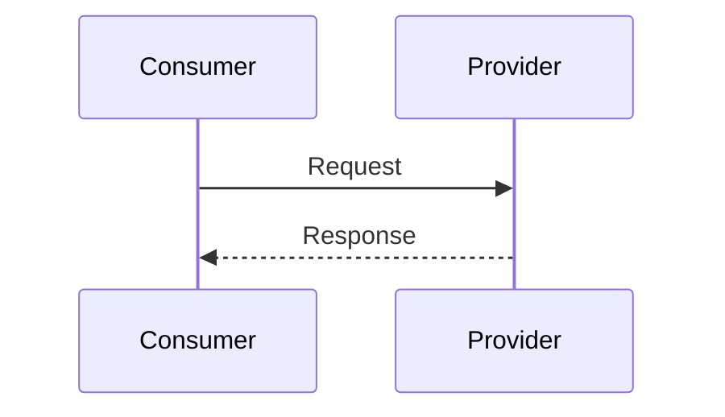
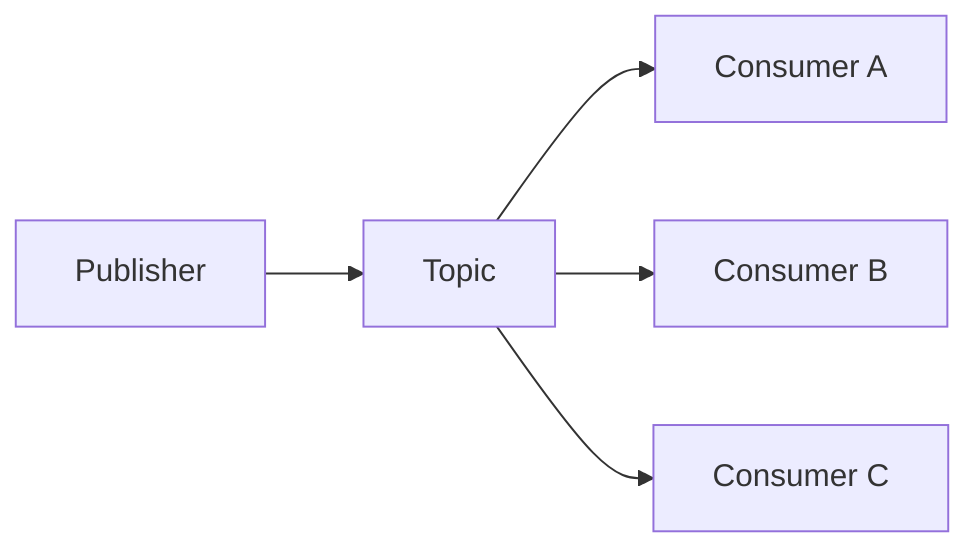
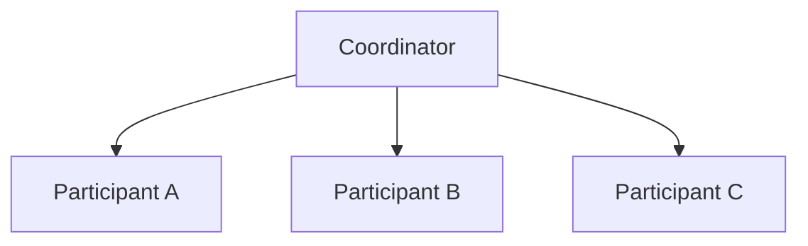
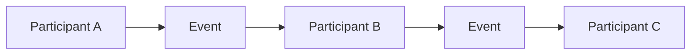

# Integration Patterns Skill

## Purpose

This skill defines principles, patterns, decision criteria, and best practices for integration between independent systems, components, services, domains, processes, and organizational boundaries.

Integration enables independently owned capabilities to exchange information, request actions, publish changes, coordinate activities, and participate in broader workflows.

The objective is not to maximize connectivity.

The objective is to enable necessary interaction while maintaining appropriate:

- Autonomy
- Reliability
- Security
- Compatibility
- Observability
- Maintainability
- Performance
- Scalability

This skill is:

- Domain-neutral
- Technology-neutral
- Vendor-neutral
- Platform-neutral
- Protocol-neutral
- Solution-neutral
- Industry-neutral

It should be used as organizational knowledge rather than as an implementation guide.

---

# Objectives

Good integration design should help:

- Establish clear integration boundaries.
- Minimize unnecessary coupling.
- Define explicit contracts.
- Select appropriate interaction styles.
- Support independent evolution.
- Handle failures deliberately.
- Manage retries and duplicate processing.
- Support appropriate consistency.
- Protect trust boundaries.
- Make ownership clear.
- Support contract evolution.
- Provide meaningful observability.
- Avoid unnecessary integration complexity.

---

# Definitions

## Integration

Interaction between independently bounded capabilities for exchanging information or coordinating behavior.

## Integration Boundary

A boundary across which independently owned or managed capabilities interact.

## Contract

An explicit agreement defining the structure, meaning, behavior, and expectations of an interaction.

## Producer

A participant that produces information, messages, or events.

## Consumer

A participant that receives and processes information, messages, or events.

## Request

A communication asking another participant to perform an operation or return information.

## Response

Information returned as the result of a request.

## Command

An instruction requesting that a specific action be performed.

## Event

A statement describing something that has already occurred.

## Message

A unit of information exchanged between participants.

## Adapter

A component that translates one interface, representation, or interaction model into another.

## Gateway

A controlled entry point mediating access to one or more capabilities.

## Orchestration

Coordination where a central participant directs a multi-step interaction.

## Choreography

Coordination where participants react independently to events without a central controller directing the entire flow.

---

# Fundamental Principles

## Integrate Only Where Necessary

Every integration creates dependency.

Before creating an integration, determine:

- Why interaction is required.
- What information must cross the boundary.
- Who owns the information.
- What behavior is expected.
- What happens when communication fails.

Avoid integrations created only for convenience.

---

# Minimize Coupling

Integration should preserve as much independence as practical.

Avoid unnecessary coupling involving:

- Internal data structures
- Internal implementation details
- Deployment timing
- Shared databases
- Technology-specific assumptions
- Consumer-specific behavior

Prefer explicit contracts across boundaries.

---

# Contract Over Implementation

Consumers should depend on an agreed contract rather than the producer's internal implementation.

Conceptually:

```text
Consumer
    ↓
 Contract
    ↓
Provider
```

The provider should be free to change internal implementation without affecting consumers when the contract remains satisfied.

---

# Integration Ownership

Every significant integration should have clear ownership.

Ownership should address:

- Contract definition
- Contract changes
- Availability expectations
- Security
- Compatibility
- Monitoring
- Support
- Deprecation

Unowned integrations become difficult to evolve safely.

---

# Integration Styles

Common integration styles include:

- Request-response
- Asynchronous messaging
- Event-driven integration
- Publish-subscribe
- Queue-based integration
- Streaming
- Batch integration
- File exchange
- Shared data access

No integration style is universally appropriate.

---

# Synchronous Request-Response

## Definition

A consumer sends a request and waits for a response.

Conceptually:

```text
Consumer
    │
    │ Request
    ▼
Provider
    │
    │ Response
    ▼
Consumer
```

---

## Appropriate When

Useful when:

- Immediate feedback is required.
- The consumer cannot continue without the result.
- The operation is relatively short.
- Runtime dependency is acceptable.

---

## Benefits

- Simple interaction model
- Immediate result
- Straightforward error communication
- Easy conceptual reasoning

---

## Trade-offs

Creates temporal coupling.

The consumer depends on the provider being:

- Reachable
- Responsive
- Available

during the interaction.

---

# Asynchronous Messaging

## Definition

A producer submits a message without requiring immediate processing.

Conceptually:

```text
Producer
    ↓
 Message
    ↓
Messaging Boundary
    ↓
Consumer
```

---

## Appropriate When

Useful when:

- Immediate completion is unnecessary.
- Processing can be deferred.
- Producer and consumer availability should be decoupled.
- Load buffering is useful.
- Processing may take significant time.

---

## Benefits

- Temporal decoupling
- Load leveling
- Failure isolation
- Independent processing

---

## Trade-offs

Introduces concerns such as:

- Duplicate delivery
- Delayed completion
- Ordering
- Retry
- Failure handling
- Observability
- Eventual consistency

---

# Queue-Based Integration

## Definition

A queue stores work until a consumer can process it.

Conceptually:

```text
Producer
   ↓
 Queue
   ↓
Consumer
```

A message is generally intended to be processed as a unit of work.

---

## Appropriate When

Useful when:

- Work should be processed asynchronously.
- Producer and consumer processing rates differ.
- Temporary consumer unavailability must be tolerated.
- Load leveling is required.

---

## Benefits

- Temporal decoupling
- Load buffering
- Improved resilience
- Controlled processing rate

---

## Trade-offs

Requires consideration of:

- Queue growth
- Duplicate processing
- Poison messages
- Ordering
- Retry
- Backpressure

---

# Publish-Subscribe

## Definition

A publisher distributes information without needing direct knowledge of individual subscribers.

Conceptually:

```text
             ┌── Consumer A
             │
Publisher → Topic
             │
             ├── Consumer B
             │
             └── Consumer C
```

---

## Appropriate When

Useful when:

- Multiple consumers need the same information.
- Consumers should evolve independently.
- Publishers should not know individual subscribers.

---

## Benefits

- Loose coupling
- Independent consumers
- Extensibility
- Fan-out communication

---

## Trade-offs

Requires management of:

- Subscription lifecycle
- Delivery semantics
- Duplicate processing
- Schema evolution
- Consumer failures

---

# Event-Driven Integration

## Definition

Participants communicate using events describing meaningful occurrences.

Example:

```text
Something Happened
       ↓
     Event
       ↓
Interested Consumers
```

An event describes a fact.

It should generally represent something that has already happened.

---

## Event vs. Command

A command says:

> Perform this action.

An event says:

> This happened.

Conceptually:

```text
Command
"Perform X"
```

versus:

```text
Event
"X occurred"
```

Confusing commands and events can create hidden coupling.

---

# Event Design

Good events should:

- Represent meaningful occurrences.
- Have clear ownership.
- Have understandable semantics.
- Avoid exposing unnecessary internal structures.
- Support compatible evolution.

Avoid publishing every internal state change as an integration event.

---

# Notification Events

A notification event communicates that something happened with minimal information.

Consumers may retrieve additional information separately.

Benefits:

- Smaller events
- Reduced duplication

Trade-off:

- Additional dependency may be required to obtain details.

---

# Event-Carried State Transfer

An event may contain enough information for consumers to update their own representation without immediately contacting the producer.

Potential benefits:

- Reduced runtime dependency
- Consumer autonomy

Potential costs:

- Larger events
- Data duplication
- Privacy considerations
- Schema evolution complexity

Use according to actual requirements.

---

# Streaming

## Definition

Streaming provides continuous or near-continuous movement of ordered or partitioned information.

Conceptually:

```text
Producer
   ↓
Continuous Records
   ↓
Stream
   ↓
Consumers
```

---

## Appropriate When

Useful when:

- Information arrives continuously.
- High-volume sequential processing is required.
- Multiple consumers need independent processing.
- Replay or historical processing is useful.

---

## Trade-offs

Streaming may introduce:

- Partitioning complexity
- Ordering constraints
- Consumer position management
- Replay complexity
- Storage requirements
- Operational complexity

Do not use streaming where simple messaging is sufficient.

---

# Batch Integration

## Definition

Information is collected and exchanged in groups.

Conceptually:

```text
Source
   ↓
Collect
   ↓
Batch
   ↓
Process
   ↓
Destination
```

---

## Appropriate When

Useful when:

- Immediate processing is unnecessary.
- Large data volumes can be processed together.
- Scheduled exchange is acceptable.
- Simplicity is more important than real-time behavior.

---

## Benefits

- Simple operational model
- Efficient bulk processing
- Reduced interaction frequency

---

## Trade-offs

- Increased data latency
- Large failure scope
- Recovery may require reprocessing
- Limited real-time visibility

---

# File-Based Integration

## Definition

Participants exchange information using files or equivalent bulk artifacts.

---

## Appropriate When

Potentially suitable when:

- Systems have limited direct integration capability.
- Bulk exchange is required.
- Processing frequency is low.
- Legacy interoperability is important.

---

## Design Considerations

Define:

- File format
- Naming
- Ownership
- Delivery
- Validation
- Security
- Duplicate handling
- Partial processing
- Archival
- Retention
- Error handling

File-based integration is not inherently poor architecture when it appropriately fits the requirement.

---

# Shared Database Integration

## Definition

Multiple independently bounded capabilities directly access the same database or data structures.

Conceptually:

```text
System A ─┐
          ├── Shared Data
System B ─┘
```

---

## Benefits

Potential benefits include:

- Simple data access
- Immediate consistency
- Reduced integration infrastructure

---

## Risks

It can create strong coupling involving:

- Schema
- Data ownership
- Release timing
- Security
- Performance
- Business rules

---

## Guidance

Shared data access should be used deliberately.

For independently evolving capabilities, prefer clear data ownership and explicit integration contracts where practical.

---

# Gateway Pattern

## Definition

A gateway provides a controlled integration entry point.

Conceptually:

```text
Consumers
    ↓
 Gateway
    ↓
Capabilities
```

A gateway may handle concerns such as:

- Routing
- Policy enforcement
- Authentication
- Rate control
- Protocol adaptation

---

## Benefits

- Centralized boundary control
- Simplified consumer interaction
- Consistent policy enforcement

---

## Risks

A gateway can become:

- A bottleneck
- A critical dependency
- A location for excessive business logic

Keep gateway responsibilities focused.

---

# Adapter Pattern

## Definition

An adapter translates between incompatible contracts, protocols, formats, or representations.

Conceptually:

```text
System A
   ↓
Adapter
   ↓
System B
```

---

## Appropriate When

Useful when:

- Existing participants cannot directly communicate.
- External contracts differ from internal models.
- Legacy systems must be integrated.
- Technology-specific concerns should be isolated.

---

# Anti-Corruption Layer

## Definition

An Anti-Corruption Layer protects one model or domain from concepts and structures belonging to another.

Conceptually:

```text
External Model
      ↓
Translation Boundary
      ↓
Internal Model
```

---

## Appropriate When

Useful when:

- External terminology differs significantly.
- External models should not leak into internal responsibilities.
- Legacy structures must be isolated.
- Independent domain evolution is important.

---

## Benefits

- Protects internal models
- Reduces external coupling
- Supports independent evolution

---

## Trade-offs

Introduces:

- Translation logic
- Additional maintenance
- Mapping complexity

Use where model isolation provides meaningful value.

---

# Orchestration

## Definition

A coordinator explicitly controls a multi-step interaction.

Conceptually:

```text
        Coordinator
       /     |     \
      ↓      ↓      ↓
     A       B       C
```

---

## Benefits

- Workflow is explicit.
- Central state can be easier to understand.
- Error handling can be coordinated.

---

## Trade-offs

The coordinator may become:

- Highly coupled
- Complex
- A critical dependency

Avoid placing unrelated business responsibilities into the coordinator.

---

# Choreography

## Definition

Participants coordinate by reacting to events.

Conceptually:

```text
A
↓
Event
↓
B
↓
Event
↓
C
```

There is no single participant controlling the entire process.

---

## Benefits

- Loose coupling
- Independent participants
- Extensibility

---

## Trade-offs

Large choreographies can become difficult to understand.

Potential problems include:

- Hidden workflow
- Difficult debugging
- Circular event chains
- Difficult failure handling
- Reduced visibility of overall process state

---

# Orchestration vs. Choreography

Use orchestration when:

- Explicit workflow control is valuable.
- Overall state must be easily understood.
- Complex compensation is required.

Consider choreography when:

- Participants should remain highly autonomous.
- Reactions are naturally event-driven.
- No central workflow authority is necessary.

Hybrid approaches may be appropriate.

Avoid treating either approach as universally superior.

---

# Contract Design

An integration contract should define relevant expectations.

Depending on the interaction, this may include:

- Operation
- Message structure
- Data meaning
- Required fields
- Optional fields
- Error behavior
- Security expectations
- Compatibility expectations
- Delivery semantics

Contracts should expose what consumers need without exposing unnecessary implementation detail.

---

# Contract Ownership

Contract ownership should be clear.

The owner should consider:

- Existing consumers
- Compatibility
- Evolution
- Deprecation
- Documentation
- Support

A contract is an agreement, not merely a technical schema.

---

# Contract Evolution

Integrations should expect change.

Prefer compatible evolution where practical.

Examples include:

- Adding optional information
- Preserving existing semantics
- Supporting transition periods
- Providing explicit versions when necessary

Avoid forcing simultaneous upgrades across independent participants.

---

# Versioning

Versioning may be appropriate when compatibility cannot reasonably be preserved.

Versioning should have:

- Clear purpose
- Defined lifecycle
- Migration strategy
- Deprecation strategy

Avoid creating new versions for every minor change.

---

# Consumer-Driven Compatibility

Integration changes should consider actual consumer expectations.

Where appropriate, compatibility validation can verify that provider changes continue to satisfy consumer contracts.

Avoid assuming schema validity alone guarantees behavioral compatibility.

---

# Schema Design

Schemas should:

- Be explicit.
- Use meaningful names.
- Avoid unnecessary fields.
- Distinguish required and optional information.
- Support compatible evolution where possible.

Do not expose internal storage structures directly as integration contracts unless intentionally justified.

---

# Canonical Data Model

A canonical model defines a shared representation used across multiple integrations.

Potential benefit:

- Reduced pairwise transformation.

Potential risk:

- Centralized model complexity.
- Slow evolution.
- Forced compromise between different domains.

Use canonical models where shared semantics genuinely exist.

Do not force unrelated domains into one universal model.

---

# Point-to-Point Integration

Direct integration connects one participant directly to another.

Conceptually:

```text
A → B
```

This may be perfectly appropriate for simple scenarios.

Problems arise when many participants create uncontrolled relationships:

```text
A ↔ B
A ↔ C
A ↔ D
B ↔ C
B ↔ D
C ↔ D
```

Integration complexity should be proportional to actual need.

---

# Integration Hub

A central integration capability may mediate communication between multiple participants.

Potential benefits:

- Centralized transformation
- Centralized routing
- Reduced pairwise integration

Potential risks:

- Central bottleneck
- Excessive coupling
- Concentrated operational risk
- Centralized ownership burden

Use only where central mediation provides sufficient value.

---

# Routing

Messages or requests may need routing based on:

- Destination
- Type
- Content
- Priority
- Tenant
- Region
- Capability

Routing logic should remain understandable.

Avoid creating hidden business logic inside integration infrastructure.

---

# Transformation

Transformation converts one representation into another.

Transformation may involve:

- Format
- Structure
- Semantics
- Units
- Identifiers

Semantic transformations require particular care.

Changing syntax is not the same as translating meaning.

---

# Enrichment

Integration flows may add required information from another source.

Enrichment introduces additional dependencies.

Consider:

- Availability
- Latency
- Consistency
- Ownership

Avoid enrichment when consumers can operate without the additional information.

---

# Aggregation

Aggregation combines information from multiple sources.

Conceptually:

```text
Source A ─┐
Source B ─┼→ Aggregator → Result
Source C ─┘
```

Aggregation should consider:

- Partial failure
- Timeout
- Data freshness
- Response completeness

Do not assume every source will always respond successfully.

---

# Idempotency

Integration operations may be repeated because of:

- Retry
- Duplicate delivery
- Recovery
- Replay

Where repeated processing is possible, design operations to be idempotent where practical.

---

# Deduplication

Where duplicates cannot be safely processed, consumers may track unique message or operation identifiers.

Deduplication should consider:

- Retention period
- Identifier scope
- Storage
- Replay behavior

Do not retain deduplication state indefinitely without a requirement.

---

# Retry

Retries may recover transient failures.

Retry policy should consider:

- Failure type
- Retry limit
- Backoff
- Jitter
- Idempotency
- Overall processing deadline

Avoid uncontrolled retry loops.

---

# Dead-Letter Handling

Messages that repeatedly cannot be processed should not necessarily block normal processing indefinitely.

A dead-letter or equivalent failure mechanism can isolate problematic messages.

The design should define:

- Why the message failed
- How it is inspected
- Who owns resolution
- Whether it can be corrected
- Whether it can be replayed
- When it should be discarded

A dead-letter location is not a substitute for operational ownership.

---

# Poison Messages

A poison message repeatedly causes processing failure because its content or semantics cannot be handled successfully.

Possible causes include:

- Invalid structure
- Invalid business state
- Unsupported version
- Unexpected values

Poison messages should be isolated from normal processing.

---

# Backpressure

Integration boundaries should define behavior when incoming work exceeds processing capacity.

Possible approaches include:

- Buffering
- Throttling
- Delaying
- Rejecting
- Prioritizing
- Load shedding

Unlimited accumulation is not a sustainable strategy.

---

# Rate Limiting

Rate limits protect participants from excessive demand.

Rate limiting may be applied based on:

- Consumer
- Operation
- Resource
- Priority
- Time window

Consumers should have predictable behavior when limits are reached.

---

# Throttling

Throttling controls processing rate to protect capacity or downstream dependencies.

Throttling should be observable so that sustained capacity problems can be distinguished from temporary demand spikes.

---

# Timeouts

Synchronous integrations should have explicit timeout behavior.

A timeout means the caller did not receive a response in the expected period.

It does not prove whether the provider completed the operation.

This uncertainty should be considered when retries are possible.

---

# Error Handling

Integration errors should be classified where useful.

Examples include:

### Validation Errors

Input does not satisfy the contract.

### Authorization Errors

The caller lacks required permission.

### Business Errors

The requested operation violates a business condition.

### Transient Errors

A temporary condition may succeed later.

### Permanent Technical Errors

Retry is unlikely to succeed without intervention.

Different errors should not automatically receive the same retry behavior.

---

# Partial Failure

Multi-participant integration can experience partial failure.

Example:

```text
A → Success

B → Success

C → Failure
```

Design should determine:

- Whether partial success is acceptable.
- Whether compensation is required.
- Whether retry is safe.
- How the overall outcome is represented.

---

# Integration Consistency

Cross-boundary integrations may not update all representations simultaneously.

Determine:

- Which source is authoritative?
- How stale may derived information become?
- How are conflicts handled?
- How is synchronization verified?
- How is divergence repaired?

Consistency requirements should come from actual business needs.

---

# Reconciliation

Reconciliation compares expected and actual state and repairs unacceptable divergence.

It can be valuable when:

- Messages can be missed.
- External systems may fail.
- Derived representations exist.
- Eventual consistency is used.

Critical integrations should have a recovery strategy rather than assuming communication will never fail.

---

# Integration Security

Integration boundaries are trust boundaries unless proven otherwise.

Consider:

- Identity
- Authentication
- Authorization
- Confidentiality
- Integrity
- Replay protection
- Data sensitivity
- Auditability

Avoid granting broad trust merely because participants belong to the same organization.

---

# Least Privilege

Integration identities should receive only the permissions required for their responsibilities.

Avoid broad shared credentials across unrelated integrations.

---

# Sensitive Information

Integration contracts should contain only information required by consumers.

Avoid unnecessary propagation of:

- Sensitive data
- Confidential information
- Credentials
- Internal implementation information

Data minimization reduces both coupling and exposure.

---

# Integrity

Where integrity matters, designs should ensure information cannot be modified without appropriate detection or authorization.

The required mechanism depends on risk and trust boundaries.

---

# Replay

Some integration messages may be captured and resent.

Where replay could cause harmful repeated actions, appropriate protections should be considered.

Idempotency can reduce replay consequences.

---

# Observability

Integration behavior should be observable across boundaries.

Useful information may include:

- Interaction volume
- Latency
- Failures
- Retry
- Queue depth
- Processing delay
- Dead-letter volume
- Consumer health
- Contract/version usage

Observability should support operational decisions.

---

# Correlation

A logical interaction may cross multiple boundaries.

Correlation identifiers or equivalent context can help connect related activity.

Conceptually:

```text
Request
  ↓
System A
  ↓
Message
  ↓
System B
  ↓
Event
  ↓
System C
```

The overall interaction should be traceable where operationally important.

---

# Integration Health

Integration health should not be defined only by whether infrastructure is running.

Meaningful health may consider:

- Can messages be delivered?
- Can consumers process them?
- Is backlog growing?
- Are failures increasing?
- Is latency acceptable?
- Are contracts compatible?

---

# Integration Documentation

Significant integrations should document relevant information such as:

- Purpose
- Producer
- Consumer
- Ownership
- Interaction style
- Contract
- Data ownership
- Security
- Failure behavior
- Retry behavior
- Consistency
- Operational expectations

Documentation should remain proportional to integration significance.

---

# Mermaid Diagram Guidance

Mermaid diagrams may be used when they improve understanding.

## Request-Response



## Asynchronous Messaging


## Publish-Subscribe



## Orchestration



## Choreography



Diagrams should explain meaningful integration relationships rather than merely decorate documentation.

---

# Integration Style Selection

Use the interaction requirement to guide style selection.

| Requirement | Potential Approach |
|---|---|
| Immediate result required | Request-response |
| Deferred processing acceptable | Asynchronous messaging |
| Single unit of work | Queue |
| Multiple independent consumers | Publish-subscribe |
| Significant occurrence notification | Event |
| Continuous high-volume information | Streaming |
| Scheduled bulk processing | Batch |
| Limited direct integration capability | File exchange |
| Explicit multi-step control | Orchestration |
| Autonomous reactions | Choreography |
| Model translation required | Adapter / Anti-Corruption Layer |

This table provides initial guidance only.

Actual selection should consider complete architectural context.

---

# Decision Guidelines

Before selecting an integration approach, ask:

1. Why is integration required?
2. Who owns the source information?
3. Who owns the interaction contract?
4. Is an immediate response required?
5. Can processing occur asynchronously?
6. Is the communication a command, query, message, or event?
7. How many consumers exist?
8. Can consumers evolve independently?
9. What happens if the provider is unavailable?
10. What happens if communication is duplicated?
11. Does ordering matter?
12. What consistency is required?
13. What volume and frequency are expected?
14. What security boundary exists?
15. How will the contract evolve?
16. How will failures be observed?
17. How will failed processing be recovered?
18. Could a simpler integration satisfy the requirement?

Select the simplest interaction style that satisfies these needs.

---

# Best Practices

- Integrate only where necessary.
- Keep integration boundaries explicit.
- Define clear ownership.
- Use explicit contracts.
- Hide internal implementation details.
- Prefer loose coupling.
- Choose synchronous interaction only when immediate response is necessary.
- Use asynchronous interaction where temporal decoupling provides value.
- Distinguish commands from events.
- Publish meaningful events.
- Design for duplicate processing.
- Use idempotency where appropriate.
- Bound retries.
- Handle poison messages explicitly.
- Define dead-letter ownership.
- Plan contract evolution.
- Maintain compatibility where practical.
- Avoid uncontrolled shared data access.
- Minimize sensitive information in contracts.
- Apply least privilege.
- Support meaningful observability.
- Design recovery and reconciliation where needed.
- Document significant integration decisions.

---

# Quality Considerations

Good integration design should demonstrate:

## Loose Coupling

Participants depend on stable contracts rather than internal implementation.

## Autonomy

Participants can evolve independently where required.

## Reliability

Expected communication failures are handled appropriately.

## Compatibility

Contracts can evolve without unnecessary disruption.

## Security

Trust boundaries and information exchange are appropriately protected.

## Observability

Integration behavior can be understood operationally.

## Recoverability

Failed or inconsistent processing can be restored where necessary.

## Scalability

Interaction mechanisms support realistic workload requirements.

## Simplicity

Integration complexity is limited to what requirements justify.

---

# Trade-offs

Integration commonly involves trade-offs such as:

| Concern | Trade-off |
|---|---|
| Synchronous Interaction | Temporal Coupling |
| Asynchronous Interaction | Delayed Consistency |
| Shared Data | Strong Coupling |
| Independent Data | Synchronization Complexity |
| Rich Events | Data Duplication |
| Minimal Events | Additional Lookup Dependency |
| Orchestration | Central Coordination |
| Choreography | Global Visibility |
| Retry | Duplicate Processing |
| Buffering | Increased Latency |
| Central Gateway | Bottleneck Risk |
| Decentralized Integration | Governance Complexity |
| Canonical Model | Central Model Complexity |
| Versioning | Lifecycle Management |

Trade-offs should be explicit.

---

# Common Mistakes

Avoid:

- Integrating systems without a clear need.
- Exposing internal implementation structures as public contracts.
- Sharing databases by default.
- Creating unnecessary point-to-point integrations.
- Using synchronous communication for long-running work.
- Creating long synchronous dependency chains.
- Using asynchronous messaging when immediate interaction is simpler.
- Treating commands as events.
- Publishing meaningless technical events.
- Assuming messages are delivered exactly once.
- Ignoring duplicate processing.
- Ignoring ordering requirements.
- Retrying every failure.
- Retrying indefinitely.
- Leaving dead-letter messages without ownership.
- Using unlimited queues.
- Ignoring backpressure.
- Breaking contracts without migration strategy.
- Creating new versions unnecessarily.
- Creating a universal canonical model for unrelated domains.
- Putting business logic into gateways.
- Creating excessive choreography that hides workflows.
- Creating orchestration that becomes a centralized business monolith.
- Ignoring security at internal integration boundaries.
- Propagating unnecessary sensitive information.
- Ignoring reconciliation.
- Monitoring infrastructure while ignoring actual integration health.

---

# Validation Checklist

Before considering an integration design sufficiently sound, verify:

- [ ] The integration has a clear purpose.
- [ ] Producer and consumer responsibilities are understood.
- [ ] Ownership is clear.
- [ ] The interaction style matches the requirement.
- [ ] Simpler alternatives have been considered.
- [ ] Contracts are explicit.
- [ ] Internal implementation details are appropriately hidden.
- [ ] Commands and events are correctly distinguished.
- [ ] Synchronous dependencies are justified.
- [ ] Asynchronous delivery semantics are understood.
- [ ] Duplicate processing is considered.
- [ ] Idempotency is addressed where relevant.
- [ ] Ordering requirements are explicit.
- [ ] Retry behavior is bounded.
- [ ] Backoff is considered where appropriate.
- [ ] Poison-message handling is defined where relevant.
- [ ] Dead-letter ownership is defined where relevant.
- [ ] Backpressure behavior is considered.
- [ ] Contract evolution is considered.
- [ ] Compatibility requirements are understood.
- [ ] Data ownership is clear.
- [ ] Consistency expectations are understood.
- [ ] Reconciliation is considered where relevant.
- [ ] Partial failure behavior is understood.
- [ ] Security boundaries are identified.
- [ ] Least privilege is applied.
- [ ] Sensitive information is minimized.
- [ ] Integration behavior is observable.
- [ ] Correlation is supported where operationally important.
- [ ] Recovery behavior is understood.
- [ ] Integration complexity is justified.

---

# References

Integration practices may draw, where applicable, from recognized knowledge such as:

- Enterprise Integration Patterns
- Domain-Driven Design
- Event-Driven Architecture
- Service-Oriented Architecture principles
- Messaging patterns
- Distributed systems principles
- API and contract design principles
- Reactive systems principles
- ISO/IEC/IEEE 42010 — Architecture Description
- ISO/IEC 25010 — Systems and Software Quality Models
- Relevant organizational integration standards

Integration patterns provide reusable knowledge.

They should support architectural reasoning rather than dictate technology choices.

The appropriate integration approach should ultimately be determined by interaction requirements, ownership, coupling, consistency, reliability, security, scale, operational capability, lifecycle cost, and context.