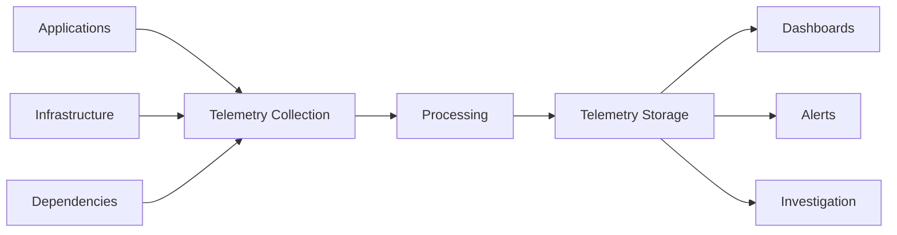
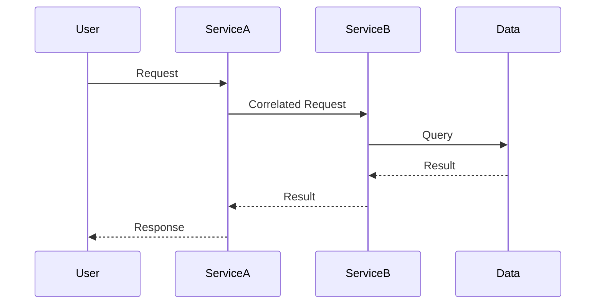
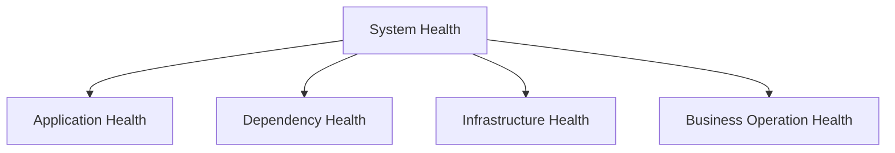
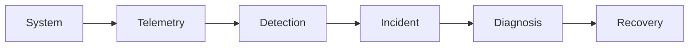

# Observability Skill

## Purpose

This skill defines principles, concepts, decision criteria, and best practices for designing observable systems.

Observability is the ability to understand the internal state and behavior of a system through the information it produces.

Observability should enable teams to answer questions such as:

- Is the system healthy?
- Is the system meeting expected service levels?
- What is failing?
- Where is the failure occurring?
- Why is it failing?
- Which users or operations are affected?
- Which dependency is contributing to the problem?
- When did the behavior change?
- What changed before the problem occurred?
- Is performance degrading?
- Is capacity approaching a limit?

The objective is not to select a monitoring or telemetry product.

The objective is to define the observability capabilities required to operate, troubleshoot, secure, and improve a system.

This skill is:

- Domain-neutral
- Vendor-neutral
- Cloud-neutral
- Platform-neutral
- Technology-neutral
- Product-neutral
- Industry-neutral

Technology-specific implementation should occur only after observability requirements are understood.

---

# Objectives

Good observability architecture should help:

- Understand system health.
- Detect failures.
- Detect degradation.
- Diagnose root causes.
- Trace activity across boundaries.
- Understand dependency behavior.
- Measure service performance.
- Understand resource consumption.
- Identify capacity constraints.
- Support incident response.
- Support security investigations.
- Support reliability analysis.
- Support performance optimization.
- Support operational decision-making.
- Reduce mean time to detect.
- Reduce mean time to diagnose.
- Reduce mean time to recover.

---

# Observability vs. Monitoring

Monitoring and observability are related but not identical.

## Monitoring

Monitoring evaluates known signals and conditions.

Example:

```text
CPU > Threshold
        ↓
      Alert
```

Monitoring answers questions such as:

> Is a known undesirable condition occurring?

---

## Observability

Observability provides enough information to investigate both expected and unexpected behavior.

Conceptually:

```text
System
  ↓
Telemetry
  ↓
Correlation
  ↓
Analysis
  ↓
Understanding
```

Observability should help answer questions that were not necessarily anticipated when the system was designed.

---

# Fundamental Principle

## Design for Observability

Observability should be considered during architecture design.

Avoid:

```text
Build System
     ↓
Deploy System
     ↓
Problem Occurs
     ↓
Add Logging
```

Prefer:

```text
Requirements
     ↓
Architecture
     ↓
Operational Questions
     ↓
Observability Requirements
     ↓
Telemetry Design
     ↓
Implementation
```

---

# Start With Operational Questions

Do not begin by deciding:

> What should we log?

Begin by asking:

- What must operators understand?
- What failures matter?
- What user journeys are critical?
- What dependencies are critical?
- What performance characteristics matter?
- What service levels must be measured?
- What security events matter?
- What capacity limits matter?

Telemetry should support meaningful operational questions.

---

# Observability Signals

Common observability signals include:

```text
Metrics

Logs

Traces

Events

Health Signals
```

These signals complement each other.

No single signal is sufficient for every problem.

---

# Metrics

Metrics are numerical measurements captured over time.

Examples include:

- Request rate
- Error rate
- Response latency
- Resource utilization
- Queue depth
- Active connections
- Processing duration
- Data volume

Conceptually:

```text
Measurement
     +
Timestamp
     +
Dimensions
     =
Metric
```

---

# Metric Characteristics

Useful metrics should have:

- Clear meaning
- Defined units
- Appropriate dimensions
- Known ownership
- Appropriate collection frequency

Avoid creating metrics that have no operational use.

---

# Metric Dimensions

Dimensions allow measurements to be analyzed by meaningful categories.

Examples may include:

- Operation
- Component
- Environment
- Region
- Dependency
- Outcome

Avoid dimensions with uncontrolled cardinality.

High-cardinality dimensions can create significant cost and operational complexity.

---

# Logs

Logs are records describing events or conditions that occurred during system execution.

Logs may capture:

- Operations
- Errors
- State transitions
- Security events
- Dependency failures
- Administrative actions
- Diagnostic information

Logs should provide meaningful context.

---

# Structured Logging

Prefer structured information where practical.

Instead of:

```text
"Something failed"
```

prefer conceptually:

```text
Event:
    operation
    component
    timestamp
    outcome
    error_category
    correlation_identifier
```

Structured information improves:

- Searching
- Filtering
- Correlation
- Aggregation
- Automation

---

# Log Levels

Logs may use severity levels such as:

```text
Trace

Debug

Information

Warning

Error

Critical
```

Exact terminology may vary.

Levels should have consistent organizational meaning.

Avoid treating every event as an error.

---

# Log Quality

Useful logs should answer relevant questions such as:

- What happened?
- When?
- Where?
- During which operation?
- What was the outcome?
- Which dependency was involved?

Avoid logs that contain only generic messages without context.

---

# Sensitive Information in Logs

Logs must not become uncontrolled data stores.

Avoid recording unnecessary:

- Passwords
- Secrets
- Tokens
- Private keys
- Sensitive personal information
- Confidential payloads

Observability requirements must respect security and privacy requirements.

---

# Distributed Tracing

Distributed tracing follows an operation across multiple components or services.

Conceptually:

```text
User Request
     ↓
Component A
     ↓
Component B
     ↓
Component C
     ↓
Data Store
```

A trace can show how the operation moved through these boundaries.

---

# Trace

A trace represents an end-to-end operation.

Example:

```text
Trace
│
├── Span A
│
├── Span B
│
├── Span C
│
└── Span D
```

---

# Span

A span represents one operation within a trace.

A span may contain:

- Start time
- End time
- Duration
- Operation
- Component
- Status
- Attributes

---

# Trace Context

Trace context should propagate across relevant system boundaries.

Conceptually:

```text
Request
   ↓
Trace Context
   ↓
Service A
   ↓
Trace Context
   ↓
Service B
```

Without context propagation, end-to-end troubleshooting becomes difficult.

---

# Correlation

Related telemetry should be correlatable.

A logical operation may produce:

```text
Trace

Logs

Metrics

Dependency Calls

Business Events
```

Correlation enables these signals to be connected.

---

# Correlation Identifier

A correlation identifier may connect activity belonging to the same logical operation.

Example:

```text
Request
   ↓
Correlation ID: X
   ↓
Service A
   ↓
Message
   ↓
Service B
   ↓
Database
```

All relevant telemetry can then be associated with `X`.

Identifiers should not expose sensitive information.

---

# Events

Events describe meaningful occurrences.

Examples may include:

- Deployment completed
- Configuration changed
- Dependency unavailable
- Failover occurred
- Scaling occurred
- Security policy changed

Operational events help explain changes in system behavior.

---

# Change Events

Changes should be observable.

Relevant changes may include:

```text
Deployment

Configuration Change

Infrastructure Change

Dependency Change

Scaling Event

Security Change
```

Many incidents occur after change.

Observability should make change correlation possible.

---

# Health

Health indicates whether a system or component can perform its intended responsibility.

A process being alive does not necessarily mean the system is healthy.

---

# Health Dimensions

Health may include:

### Process Health

Is the process running?

### Readiness

Can it accept work?

### Dependency Health

Are required dependencies available?

### Functional Health

Can the system perform important operations?

These should not automatically be treated as identical.

---

# Health Checks

Health checks should represent meaningful conditions.

Avoid health checks that only verify:

```text
Process Exists
```

while critical dependencies or functionality are unavailable.

---

# Dependency Observability

External and internal dependencies should be observable where they affect system behavior.

Measure relevant characteristics such as:

- Availability
- Latency
- Error rate
- Timeout rate
- Retry rate

Dependency failures should be distinguishable from internal failures.

---

# Golden Signals

A useful starting point for service observability is to consider:

```text
Latency

Traffic

Errors

Saturation
```

These are commonly called the golden signals.

They are useful guidance rather than mandatory requirements.

---

# Latency

Latency measures how long operations take.

Consider distributions rather than averages alone.

An average can hide poor experience for a subset of operations.

Where useful, evaluate:

- Median
- Percentiles
- Maximum
- Distribution

---

# Traffic

Traffic measures demand placed on a system.

Examples include:

- Requests
- Transactions
- Messages
- Jobs
- Data processed

Traffic helps understand workload behavior.

---

# Errors

Errors represent unsuccessful operations.

Error metrics should distinguish meaningful categories where possible.

Examples:

```text
Client Error

Validation Error

Authorization Error

Dependency Error

Timeout

Internal Error
```

A single total error count may provide insufficient diagnostic value.

---

# Saturation

Saturation indicates how close a resource or system is to its capacity limit.

Examples may include:

- CPU saturation
- Memory pressure
- Connection limits
- Queue growth
- Thread exhaustion
- Storage capacity

Saturation signals can provide early warning before failure.

---

# RED Method

For request-oriented systems, consider:

```text
Rate

Errors

Duration
```

This can provide a useful service-level view.

It should not replace workload-specific observability requirements.

---

# USE Method

For resource-oriented analysis, consider:

```text
Utilization

Saturation

Errors
```

This can help diagnose resource constraints.

Again, use it as guidance rather than as a mandatory model.

---

# Business Observability

Technical telemetry alone may not indicate whether the system is fulfilling its purpose.

Where appropriate, observe important business or functional outcomes.

Examples may include:

```text
Operations Started

Operations Completed

Operations Failed

Processing Backlog

Completion Time
```

Business observability should avoid unnecessary exposure of sensitive information.

---

# User Journey Observability

Critical user journeys should be observable end-to-end.

Example:

```text
User
  ↓
Entry
  ↓
Processing
  ↓
Dependency
  ↓
Data
  ↓
Result
```

Architecture should identify journeys whose failure would materially affect users or business operations.

---

# Service Level Indicators

A Service Level Indicator represents a measurable characteristic of service behavior.

Examples may include:

- Availability
- Latency
- Error rate
- Successful completion rate

SLIs should represent meaningful user or business experience.

---

# Service Level Objectives

A Service Level Objective defines a target for an SLI.

Conceptually:

```text
SLI
 ↓
Target
 ↓
SLO
```

Example conceptually:

```text
Successful Operations
        ≥
Required Target
```

Exact targets should come from business requirements.

---

# Service Level Agreements

A Service Level Agreement may define contractual or formal service commitments.

Do not automatically treat:

```text
SLA = SLO = SLI
```

They serve different purposes.

---

# Error Budgets

Where SLO practices are used, an error budget represents the amount of unreliability permitted within the defined objective.

Conceptually:

```text
Target Reliability
       ↓
Allowed Unreliability
       ↓
Error Budget
```

Error budgets can support trade-offs between:

- Reliability
- Change velocity
- Operational risk

Use them only where the organization adopts this operating model.

---

# Alerting

Alerts should indicate conditions requiring attention.

Do not alert simply because telemetry exists.

Good alerts should answer:

- What happened?
- What is affected?
- How severe is it?
- Does action need to be taken?
- Who owns the response?

---

# Actionable Alerts

Prefer:

```text
Alert
  ↓
Known Owner
  ↓
Meaningful Action
```

Avoid alerts that consistently require no action.

---

# Alert Severity

Alert severity should reflect impact.

Possible conceptual levels include:

```text
Informational

Warning

High

Critical
```

Exact levels should follow organizational standards.

---

# Symptom-Based Alerting

Where practical, alert on meaningful service symptoms.

Example:

```text
Users Cannot Complete Critical Operation
```

may be more valuable than:

```text
CPU = 82%
```

Resource signals remain useful for diagnosis and capacity planning.

---

# Alert Fatigue

Too many low-value alerts reduce operational effectiveness.

Common causes include:

- Poor thresholds
- Duplicate alerts
- Non-actionable alerts
- Alerts on temporary conditions
- Missing aggregation

Alert quality is more important than alert quantity.

---

# Alert Ownership

Every important alert should have an owner.

Ownership should identify:

- Who receives it?
- Who investigates?
- Who resolves it?
- When should it escalate?

Unowned alerts provide limited operational value.

---

# Dashboards

Dashboards should support specific operational questions.

Examples include:

### Service Health Dashboard

Is the service healthy?

### Reliability Dashboard

Are service objectives being met?

### Dependency Dashboard

Are dependencies behaving normally?

### Capacity Dashboard

Are capacity limits approaching?

### Business Operations Dashboard

Are critical operations succeeding?

Avoid dashboards containing large numbers of metrics without clear purpose.

---

# Dashboard Design

A useful dashboard should help answer:

```text
What is happening?

Is it normal?

What changed?

Where should I investigate?
```

Different audiences may require different dashboards.

---

# Operational Personas

Observability requirements may differ for:

- Developers
- Operations teams
- Reliability engineers
- Security teams
- Support teams
- Business stakeholders

Avoid assuming one dashboard satisfies every audience.

---

# Error Handling Observability

Failures should produce enough information for diagnosis.

Where appropriate capture:

- Error category
- Affected operation
- Component
- Dependency
- Correlation context
- Retry status

Avoid exposing unnecessary internal or sensitive information to users.

---

# Retry Observability

Retries can hide dependency instability.

Observe:

- Retry count
- Retry success
- Retry exhaustion
- Retry latency

A system may appear successful while relying heavily on retries.

This can indicate degradation.

---

# Timeout Observability

Timeouts should be visible.

Track where relevant:

- Timeout count
- Dependency involved
- Operation
- Duration
- Outcome

Timeouts can reveal:

- Dependency degradation
- Network issues
- Capacity problems
- Incorrect timeout configuration

---

# Circuit Breaker Observability

Where circuit-breaking patterns exist, observe:

```text
Closed

Open

Half-Open
```

and transitions between these states.

Repeated circuit-breaker activation can indicate dependency instability.

---

# Queue and Messaging Observability

Asynchronous systems require different observability.

Useful signals may include:

- Queue depth
- Message age
- Processing rate
- Failure rate
- Retry rate
- Dead-letter volume
- Consumer lag

Queue depth alone may not indicate actual user impact.

Message age can be particularly important.

---

# Event-Driven Observability

Event-driven systems should support tracing where practical across:

```text
Producer
   ↓
Event
   ↓
Broker / Channel
   ↓
Consumer
   ↓
Downstream Processing
```

Architecture should consider correlation across asynchronous boundaries.

---

# Batch Observability

Batch workloads should expose:

- Start time
- Completion time
- Duration
- Records processed
- Records failed
- Partial completion
- Retry
- Final status

A process merely starting successfully does not mean the batch completed successfully.

---

# Scheduled Job Observability

Scheduled operations should expose:

- Expected execution
- Actual execution
- Completion
- Failure
- Duration
- Missed execution

A missing job may otherwise produce no error signal.

---

# Data Pipeline Observability

Data-processing systems may require visibility into:

- Data arrival
- Processing delay
- Throughput
- Data quality
- Failed records
- Schema changes
- Pipeline failures
- Data freshness

Refer to `data-architecture.md` for broader data considerations.

---

# Distributed Systems Observability

Distributed systems require visibility across boundaries.

Observability should support understanding:

- Partial failure
- Dependency failure
- Network latency
- Retry
- Duplicate processing
- Ordering problems
- Consistency delays

Refer to `distributed-systems.md` for deeper distributed-system reasoning.

---

# Integration Observability

Integration boundaries should expose sufficient information to understand:

- Request volume
- Message volume
- Latency
- Failures
- Retries
- Contract failures
- Backlog
- Dead-letter conditions

Refer to `integration-patterns.md`.

---

# Cloud Observability

Cloud environments may introduce additional operational dimensions such as:

- Region
- Failure domain
- Resource instance
- Scaling activity
- Quotas
- Managed dependencies

Observability should remain workload-focused rather than becoming only infrastructure monitoring.

Refer to `cloud-architecture.md`.

---

# Security Observability

Security-relevant events may include:

- Authentication failures
- Authorization failures
- Privilege changes
- Administrative operations
- Security configuration changes
- Unusual access patterns

Security telemetry should support detection and investigation.

Refer to `security-architecture.md`.

---

# Infrastructure Observability

Infrastructure signals may include:

- Compute utilization
- Memory
- Storage
- Network
- Capacity
- Resource health

Infrastructure metrics should be connected to workload behavior where possible.

---

# Capacity Observability

Architecture should provide enough information to understand capacity.

Useful signals may include:

```text
Current Demand

Current Capacity

Utilization

Saturation

Growth

Remaining Headroom
```

Capacity planning should rely on measured workload behavior rather than assumptions alone.

---

# Scaling Observability

Where automatic scaling exists, observe:

- Scaling triggers
- Scale-out events
- Scale-in events
- Capacity before and after scaling
- Scaling failures
- Time required to scale

Scaling should not become invisible operational behavior.

---

# Deployment Observability

Deployments should be visible in operational telemetry.

Conceptually:

```text
System Healthy
     ↓
Deployment
     ↓
Latency Increases
     ↓
Errors Increase
```

Without deployment markers, identifying the relationship may be difficult.

---

# Release Observability

Where multiple versions are running, telemetry may need to distinguish behavior by:

- Release
- Version
- Deployment group

This can support controlled rollout analysis.

Avoid uncontrolled version dimensions that create excessive cardinality.

---

# Configuration Observability

Significant configuration changes should be traceable.

Architecture should support answering:

> What changed immediately before system behavior changed?

---

# Auditability

Operational telemetry and audit records may overlap but serve different purposes.

Operational telemetry focuses on:

- Behavior
- Performance
- Reliability

Audit information focuses on:

- Who performed an action?
- What changed?
- When?
- What was the outcome?

Do not assume normal application logs automatically satisfy audit requirements.

---

# Telemetry Context

Useful telemetry may include context such as:

- Environment
- Component
- Operation
- Dependency
- Version
- Region
- Outcome

Only include context that provides operational value.

---

# Telemetry Cardinality

High-cardinality telemetry can create significant cost and performance issues.

Potential high-cardinality values include:

- User identifiers
- Request identifiers
- Unique resource identifiers
- Random values

Use high-cardinality context deliberately.

Trace systems and log systems may be more appropriate than metrics for highly unique values.

---

# Sampling

High-volume systems may require telemetry sampling.

Sampling can reduce:

- Storage
- Processing
- Cost

But it may remove important diagnostic information.

Sampling strategy should consider:

- Error retention
- Rare events
- Critical operations
- Trace completeness

Do not sample away the evidence required to investigate failures.

---

# Telemetry Retention

Telemetry should not be retained indefinitely without reason.

Retention should consider:

- Operational need
- Security investigations
- Compliance
- Cost
- Privacy

Different telemetry types may require different retention periods.

---

# Telemetry Lifecycle

Telemetry itself is data.

It should have lifecycle controls:

```text
Generate
   ↓
Collect
   ↓
Process
   ↓
Store
   ↓
Analyze
   ↓
Retain
   ↓
Delete
```

Refer to data governance requirements where applicable.

---

# Telemetry Security

Observability systems can contain sensitive operational information.

Protect telemetry using appropriate:

- Authentication
- Authorization
- Encryption
- Access control
- Retention
- Auditability

Access to observability data should follow least privilege.

---

# Telemetry Integrity

Operational decisions depend on telemetry.

Where risk justifies it, protect telemetry from:

- Unauthorized modification
- Deletion
- Fabrication

This is especially relevant for security and audit information.

---

# Telemetry Availability

Observability infrastructure should remain sufficiently available during incidents.

An observability system that fails whenever the workload fails provides limited diagnostic value.

Where appropriate, avoid excessive failure coupling between:

```text
Observed System
      and
Observability System
```

---

# Telemetry Cost

Observability can become a significant operational cost.

Cost drivers may include:

- Data ingestion
- Storage
- Retention
- High-cardinality metrics
- Trace volume
- Query volume
- Data transfer

Cost optimization should preserve useful diagnostic capability.

---

# Cost Control Techniques

Potential techniques include:

- Appropriate log levels
- Sampling
- Aggregation
- Retention policies
- Cardinality control
- Filtering unnecessary telemetry

Avoid reducing cost by removing critical visibility.

---

# Observability and Privacy

Telemetry may unintentionally contain personal information.

Architecture should consider:

- Data minimization
- Access
- Retention
- Masking
- Redaction
- Regional requirements

Observability does not override privacy requirements.

---

# Observability and Performance

Telemetry generation introduces processing overhead.

Consider:

- Logging volume
- Trace volume
- Serialization
- Network transfer
- Instrumentation overhead

Observability should not materially degrade critical workload performance without justification.

---

# Observability Architecture

A conceptual observability flow may look like:

```text
Applications
Infrastructure
Dependencies
Security
     │
     ▼
Telemetry Generation
     │
     ▼
Collection
     │
     ▼
Processing
     │
     ▼
Storage
     │
     ▼
Analysis
     │
     ├── Dashboards
     ├── Alerts
     ├── Investigation
     └── Reporting
```

The exact implementation should depend on requirements and selected technologies.

---

# Centralized vs. Distributed Observability

Centralized observability may provide:

- Cross-system visibility
- Consistent governance
- Easier correlation
- Shared operational practices

Potential trade-offs include:

- Cost concentration
- Central dependency
- Data residency concerns
- Scale requirements

Decentralized approaches may provide autonomy but can make cross-system investigation more difficult.

Choose according to organizational scale and requirements.

---

# Observability Standards

Organizations should establish consistent conventions for:

- Telemetry naming
- Log structure
- Correlation
- Severity
- Service identity
- Environment identity
- Common dimensions

Consistency improves cross-system investigation.

Avoid standards that require every workload to emit identical telemetry regardless of purpose.

---

# Runbooks

Important alerts should have appropriate operational guidance.

A runbook may explain:

- What the alert means
- Possible causes
- Initial investigation
- Dependencies
- Escalation
- Recovery considerations

Runbooks should support operators rather than replace engineering judgment.

---

# Incident Response

Observability should support:

```text
Detect
   ↓
Triage
   ↓
Diagnose
   ↓
Mitigate
   ↓
Recover
   ↓
Learn
```

Telemetry should remain available for post-incident analysis where required.

---

# Root Cause Analysis

Observability should help distinguish:

```text
Symptom
   ↓
Contributing Factors
   ↓
Root Cause
```

Avoid assuming the first visible error is always the root cause.

---

# Post-Incident Learning

Incident analysis may identify:

- Missing telemetry
- Poor alerts
- Missing correlation
- Inadequate dashboards
- Missing runbooks

Observability should evolve based on operational experience.

---

# Observability Architecture Views

Architecture documentation may include:

### Telemetry Flow View

Shows how telemetry moves from producers to analysis.

### Distributed Trace View

Shows trace propagation across boundaries.

### Health View

Shows critical health relationships.

### Dependency View

Shows observable dependencies.

### Alerting View

Shows important signals and operational ownership.

Only create views that communicate meaningful information.

---

# Mermaid Diagram Guidance

Use Mermaid diagrams where they improve understanding.

## Telemetry Architecture



## Distributed Tracing



## Health Model



## Incident Detection



Diagrams should remain technology-neutral unless a specific implementation architecture is explicitly required.

---

# Observability Decision Framework

For each significant system capability ask:

## 1. Criticality

How important is the capability?

## 2. Operational Question

What must operators understand?

## 3. Failure Modes

What can fail?

## 4. User Impact

How would failure affect users?

## 5. Signals

Which signals reveal the behavior?

## 6. Correlation

How will related activity be connected?

## 7. Detection

How will degradation or failure be detected?

## 8. Alerting

Does the condition require action?

## 9. Ownership

Who responds?

## 10. Diagnosis

Is enough information available to identify cause?

## 11. Retention

How long is telemetry useful?

## 12. Security

Does telemetry contain sensitive information?

## 13. Cost

What volume and retention cost does the telemetry create?

Observability should be proportional to system criticality and operational requirements.

---

# Best Practices

- Design observability as part of architecture.
- Start with operational questions.
- Observe user-impacting behavior.
- Use metrics, logs, traces, and events appropriately.
- Prefer structured logging.
- Propagate correlation context.
- Observe important dependencies.
- Make failures distinguishable.
- Observe retries and timeouts.
- Observe asynchronous backlog and processing delay.
- Observe important scheduled jobs.
- Make deployments and configuration changes visible.
- Define meaningful health indicators.
- Define service-level indicators where required.
- Alert on actionable conditions.
- Establish alert ownership.
- Avoid alert fatigue.
- Build dashboards around operational questions.
- Control telemetry cardinality.
- Protect sensitive information.
- Define telemetry retention.
- Control observability cost.
- Support incident investigation.
- Learn from production incidents.
- Keep observability technology-neutral during architecture design.

---

# Quality Considerations

Good observability architecture should demonstrate:

## Visibility

Important system behavior can be understood.

## Correlation

Activity can be followed across relevant boundaries.

## Diagnosability

Failures can be investigated efficiently.

## Actionability

Alerts lead to meaningful action.

## Reliability

Observability remains useful during failures.

## Security

Telemetry is appropriately protected.

## Privacy

Sensitive information is minimized.

## Scalability

Telemetry architecture supports expected workload volume.

## Cost Effectiveness

Telemetry cost is proportional to operational value.

## Maintainability

Observability evolves with the system.

---

# Trade-offs

Observability commonly involves trade-offs such as:

| Concern | Trade-off |
|---|---|
| Detailed Logging | Storage Cost |
| Extensive Tracing | Processing / Storage Cost |
| High Cardinality | Query Flexibility / Cost |
| Long Retention | Cost / Privacy |
| Sampling | Diagnostic Completeness |
| Frequent Metrics | Resolution / Cost |
| Detailed Context | Data Exposure |
| Many Alerts | Alert Fatigue |
| Centralized Observability | Central Dependency |
| Distributed Observability | Cross-System Visibility |
| Extensive Instrumentation | Performance Overhead |
| Telemetry Availability | Infrastructure Cost |

Trade-offs should be explicit.

---

# Common Mistakes

Avoid:

- Treating observability as an afterthought.
- Equating observability only with logging.
- Logging everything without purpose.
- Creating metrics without operational value.
- Monitoring only CPU and memory.
- Using averages for all latency analysis.
- Ignoring dependencies.
- Ignoring asynchronous processing delay.
- Ignoring retry behavior.
- Ignoring timeout behavior.
- Failing to propagate trace context.
- Generating unstructured logs without need.
- Putting sensitive information in logs.
- Using unique identifiers as metric dimensions without considering cardinality.
- Retaining telemetry indefinitely.
- Creating dashboards with hundreds of unrelated metrics.
- Creating alerts for every warning.
- Alerting on conditions requiring no action.
- Creating alerts without owners.
- Monitoring infrastructure but not user outcomes.
- Monitoring individual components while ignoring end-to-end journeys.
- Failing to correlate deployments with incidents.
- Sampling away critical errors.
- Ignoring observability cost.
- Assuming telemetry systems are automatically secure.
- Assuming monitoring tools automatically create observability.

---

# Validation Checklist

Before considering observability architecture sufficiently sound, verify:

- [ ] Critical capabilities are identified.
- [ ] Critical user journeys are identified.
- [ ] Operational questions are understood.
- [ ] Important failure modes are understood.
- [ ] Appropriate metrics are defined.
- [ ] Appropriate logs are defined.
- [ ] Distributed tracing is considered where relevant.
- [ ] Correlation is supported across important boundaries.
- [ ] Important dependencies are observable.
- [ ] Health signals represent meaningful system health.
- [ ] Latency is measurable.
- [ ] Traffic is measurable where relevant.
- [ ] Errors are measurable and appropriately categorized.
- [ ] Saturation is measurable where relevant.
- [ ] Retry behavior is observable.
- [ ] Timeout behavior is observable.
- [ ] Asynchronous backlog is observable where relevant.
- [ ] Message age or processing delay is observable where relevant.
- [ ] Batch completion is observable where relevant.
- [ ] Scheduled job failures can be detected.
- [ ] Deployment events are visible.
- [ ] Significant configuration changes are traceable.
- [ ] Service-level indicators are considered where required.
- [ ] Service-level objectives are considered where required.
- [ ] Alerts are actionable.
- [ ] Alert ownership is defined.
- [ ] Alert fatigue has been considered.
- [ ] Dashboards answer specific operational questions.
- [ ] Telemetry does not unnecessarily contain sensitive information.
- [ ] Telemetry access follows appropriate security controls.
- [ ] Cardinality is controlled.
- [ ] Sampling is deliberate where used.
- [ ] Retention requirements are defined.
- [ ] Telemetry lifecycle is considered.
- [ ] Observability remains useful during incidents.
- [ ] Telemetry volume and cost are understood.
- [ ] Incident investigation is supported.
- [ ] Architecture remains independent of a specific observability product unless explicitly required.

---

# Relationship With Other Architecture Skills

Observability is a cross-cutting architecture concern.

Use this skill together with:

### `architecture-principles.md`

For fundamental architecture reasoning.

### `architecture-patterns.md`

For understanding structural patterns that affect observability.

### `system-design.md`

For component boundaries, dependencies, state, workload flows, and failure behavior.

### `distributed-systems.md`

For tracing distributed operations, partial failures, retries, consistency, and asynchronous processing.

### `integration-patterns.md`

For observing requests, messages, events, queues, consumers, retries, and dead-letter processing.

### `data-architecture.md`

For telemetry data lifecycle, governance, classification, retention, and privacy.

### `cloud-architecture.md`

For workload, infrastructure, scaling, regional, and cloud operational visibility.

### `security-architecture.md`

For security logging, auditability, threat detection, access control, and security investigations.

Conceptually:

```text
                    Architecture
                         │
       ┌─────────────────┼─────────────────┐
       ↓                 ↓                 ↓
    System             Cloud             Data
    Design          Architecture      Architecture
       │                 │                 │
       └─────────────────┼─────────────────┘
                         ↓
                  Observability
                         ↓
             Metrics / Logs / Traces
                         ↓
              Detection & Diagnosis
                         ↓
                Operational Action
```

Observability should therefore be designed across architecture boundaries rather than added as an isolated monitoring component.

---

# References

Observability practices may draw, where applicable, from recognized guidance such as:

- Site Reliability Engineering principles
- Distributed tracing principles
- OpenTelemetry concepts
- Four Golden Signals
- RED Method
- USE Method
- Service Level Indicators
- Service Level Objectives
- Error Budget principles
- Distributed systems observability practices
- Cloud Well-Architected frameworks
- ISO/IEC 25010 quality characteristics
- Security monitoring principles
- Relevant organizational operational standards

These frameworks and techniques should be treated as reusable guidance rather than mandatory implementations.

The appropriate observability architecture should ultimately be determined by system criticality, operational requirements, failure modes, user impact, dependencies, security, privacy, telemetry volume, retention requirements, organizational operating model, and cost.