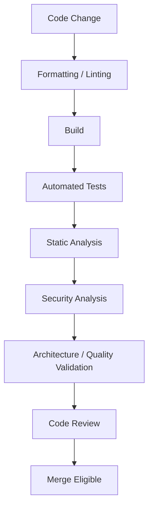
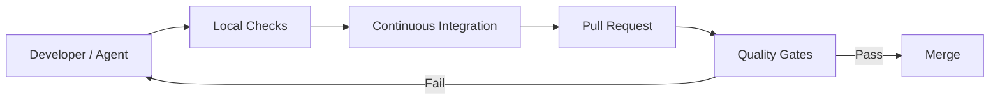
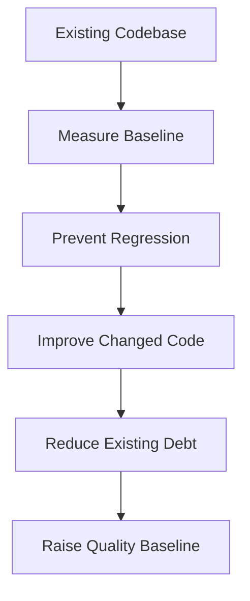

# Code Quality Skill

## Purpose

This skill defines generic principles, standards, quality criteria, and engineering controls for evaluating and maintaining source-code quality.

Code quality is broader than code formatting or style.

It includes characteristics such as:

- Correctness
- Maintainability
- Reliability
- Readability
- Testability
- Security
- Complexity
- Duplication
- Consistency
- Evolvability
- Technical debt
- Change safety

The objective is not to maximize quality metrics.

The objective is to maintain software that can be understood, changed, tested, operated, and evolved safely.

This skill is:

- Domain-neutral
- Language-neutral
- Framework-neutral
- Vendor-neutral
- Platform-neutral
- Application-neutral
- Industry-neutral

Tool-specific quality rules may supplement these principles.

---

# Objectives

A good code-quality practice should help:

- Detect defects early.
- Prevent quality degradation.
- Reduce unnecessary complexity.
- Control technical debt.
- Identify risky changes.
- Maintain consistent engineering standards.
- Improve maintainability.
- Support safe evolution.
- Improve review effectiveness.
- Increase confidence in changes.
- Automate repeatable quality checks.
- Prevent known quality problems from entering protected branches.

---

# Fundamental Principle

## Quality Is Multi-Dimensional

Code quality cannot be represented by one number.

A useful conceptual model is:

```text
                   Code Quality
                        │
       ┌────────────────┼────────────────┐
       ↓                ↓                ↓
   Correctness     Maintainability    Security
       │                │                │
       ↓                ↓                ↓
    Testing        Complexity       Vulnerabilities
       │                │                │
       └────────────────┼────────────────┘
                        ↓
                    Confidence
```

A codebase with excellent formatting but incorrect behavior is not high quality.

A codebase with high test coverage but serious security vulnerabilities is not high quality.

Quality must be evaluated across multiple dimensions.

---

# Quality Priorities

When evaluating implementation quality, generally prioritize:

```text
Correctness
    ↓
Security
    ↓
Reliability
    ↓
Architecture
    ↓
Maintainability
    ↓
Testability
    ↓
Performance
    ↓
Consistency
    ↓
Style
```

The exact priority may vary according to system risk.

Do not allow cosmetic quality concerns to hide correctness or security problems.

---

# Correctness

Code must satisfy intended behavior.

Correctness includes:

- Functional requirements
- Acceptance criteria
- Business rules
- Edge cases
- Error behavior
- State transitions
- Data integrity

A quality implementation should not merely compile.

It should behave correctly.

---

# Requirement Traceability

Where practical, implementation should be traceable to:

- Requirement
- User story
- Acceptance criterion
- Defect
- Architecture decision
- Engineering task

This helps reviewers understand:

> Why does this change exist?

Do not introduce functionality without understanding the requirement it satisfies.

---

# Quality Should Be Built In

Quality should not depend solely on final review.

Prefer:

```text
Design
   ↓
Implementation
   ↓
Local Validation
   ↓
Automated Analysis
   ↓
Testing
   ↓
Review
   ↓
Integration Validation
```

rather than:

```text
Implementation
      ↓
Reviewer Finds Everything
```

Quality is a shared engineering responsibility.

---

# Quality Gates

A quality gate defines conditions that must be satisfied before a change progresses.

Possible gates may include:

```text
Build

Tests

Static Analysis

Security Analysis

Formatting

Coverage Expectations

Dependency Validation

Architecture Validation
```

The exact gates should be determined by organizational requirements and system risk.

---

# Quality Gate Principle

A quality gate should:

- Protect meaningful engineering requirements.
- Be deterministic where possible.
- Provide actionable feedback.
- Run automatically where practical.
- Avoid unnecessary noise.
- Be maintainable.

Do not create gates solely to produce compliance metrics.

---

# Build Quality

A change should compile or build successfully where the technology requires compilation or build validation.

Build failures should block delivery.

Warnings should be reviewed according to repository policy.

Do not assume:

```text
Build Success = Correct Software
```

Build success is only one quality signal.

---

# Static Analysis

Static analysis evaluates source code without executing all behavior.

It can help identify:

- Programming errors
- Unsafe constructs
- Dead code
- Type issues
- Security problems
- Resource misuse
- Maintainability issues
- Style violations

Use static analysis where it provides meaningful engineering value.

---

# Static Analysis Categories

Static analysis rules may include:

```text
Correctness Rules

Reliability Rules

Security Rules

Maintainability Rules

Performance Rules

Style Rules
```

Rules should be classified according to impact where possible.

---

# Static Analysis Severity

Not every finding has equal importance.

A useful conceptual classification is:

```text
Critical
   ↓
High
   ↓
Medium
   ↓
Low
   ↓
Informational
```

Organizations may use different terminology.

Severity should reflect meaningful engineering risk.

---

# Warning Management

Warnings should not be ignored automatically.

For each warning:

```text
Understand
   ↓
Fix
or
Justify
   ↓
Validate
```

Do not suppress warnings simply to make a quality check pass.

---

# Warning Suppression

When suppression is necessary:

1. Understand the finding.
2. Confirm the behavior is acceptable.
3. Use the narrowest possible suppression.
4. Document reasoning when non-obvious.
5. Avoid suppressing unrelated findings.

Prefer:

```text
Specific Suppression
```

over:

```text
Disable Rule Globally
```

unless the rule is genuinely inappropriate for the entire codebase.

---

# False Positives

Automated tools can produce false positives.

A finding should be evaluated rather than blindly accepted or ignored.

When a finding is confirmed as false:

- Suppress it appropriately.
- Record reasoning where necessary.
- Avoid weakening unrelated controls.

---

# Linting

Linting can enforce:

- Syntax conventions
- Style
- Common error detection
- Language-specific best practices

Linting should preferably be automated.

Do not make human reviewers repeatedly enforce rules that reliable tooling can enforce.

---

# Formatting

Formatting should be automated where practical.

A consistent formatter reduces:

- Style debates
- Unnecessary diffs
- Review noise

Formatting is useful but should not be confused with overall code quality.

---

# Complexity

Complex code is harder to:

- Understand
- Test
- Review
- Modify
- Debug

Complexity should therefore be controlled.

---

# Complexity Types

Relevant complexity may include:

### Structural Complexity

How many components and relationships exist?

### Control-Flow Complexity

How many execution paths exist?

### Cognitive Complexity

How difficult is the code for a human to understand?

### Dependency Complexity

How many dependencies must be understood?

### State Complexity

How many possible states and transitions exist?

Quality analysis should consider more than one complexity dimension.

---

# Cyclomatic Complexity

Cyclomatic complexity estimates the number of independent execution paths.

Conceptually:

```text
More Branches
    ↓
More Possible Paths
    ↓
More Testing and Reasoning Required
```

High cyclomatic complexity can indicate code that deserves investigation.

Do not use one universal threshold without considering context.

---

# Cognitive Complexity

Cognitive complexity focuses on how difficult code is for humans to understand.

Factors may include:

- Deep nesting
- Complex conditions
- Multiple control-flow jumps
- Recursion
- Interdependent branches

Code can have acceptable cyclomatic complexity and still be difficult to understand.

---

# Complexity Is a Signal

A complexity metric should trigger investigation.

It should not automatically trigger refactoring.

Ask:

- Why is this complex?
- Is the underlying requirement inherently complex?
- Can responsibilities be separated?
- Can conditions be simplified?
- Would refactoring improve understanding?

Some complex business logic is legitimately complex.

---

# Complexity Reduction

Possible approaches include:

- Guard clauses
- Smaller cohesive operations
- Named conditions
- Better data structures
- Decision tables
- State machines
- Separation of responsibilities
- Appropriate abstractions

Do not split code into many tiny functions merely to reduce a metric.

---

# Duplication

Duplication can create multiple sources of truth.

Conceptually:

```text
Business Rule
   ├── Copy A
   ├── Copy B
   └── Copy C

Rule Changes
   ↓

Copies May Diverge
```

Duplicated knowledge is more concerning than duplicated syntax.

---

# Duplication Analysis

When duplication is detected ask:

- Does this represent the same knowledge?
- Does it change for the same reason?
- Does it have the same meaning?
- Would sharing reduce or increase coupling?

Only then decide whether abstraction is appropriate.

---

# Acceptable Duplication

Some duplication may be preferable to an incorrect abstraction.

For example, two components may contain similar-looking logic that represents different concepts and evolves independently.

Do not force unrelated concepts into shared abstractions solely to improve duplication metrics.

---

# Maintainability

Maintainability describes how easily software can be:

- Understood
- Modified
- Tested
- Diagnosed
- Extended
- Refactored

Maintainability depends on multiple factors.

Conceptually:

```text
Readability
    +
Low Unnecessary Complexity
    +
Clear Boundaries
    +
Tests
    +
Documentation
    +
Consistent Standards
        ↓
Maintainability
```

---

# Maintainability Metrics

Tools may provide maintainability scores or indexes.

Treat them as signals.

Do not assume:

```text
Maintainability Score = Objective Truth
```

The metric may not understand:

- Domain complexity
- Architecture
- Business risk
- Operational context

Use metrics together with engineering judgment.

---

# Code Smells

A code smell indicates a potential maintainability problem.

Examples may include:

- Excessive complexity
- Large functions
- Large components
- Excessive parameters
- Duplicated logic
- Dead code
- Excessive coupling
- Global state
- Repeated conditional logic
- Poor naming

A smell is an investigation signal, not proof of defective code.

---

# Technical Debt

Technical debt represents engineering decisions that create future cost.

Examples may include:

- Temporary implementation shortcuts
- Outdated dependencies
- Missing automation
- Weak test coverage
- Architecture violations
- Repeated manual work
- Known maintainability issues

Not every imperfect implementation is technical debt.

---

# Intentional Technical Debt

Sometimes engineering teams deliberately accept debt.

For example:

```text
Delivery Constraint
      ↓
Temporary Simpler Solution
      ↓
Known Future Cost
```

When significant debt is intentionally accepted, document:

- Reason
- Impact
- Risk
- Expected remediation

Avoid silently creating debt.

---

# Technical Debt Prioritization

Technical debt should be prioritized based on impact.

Consider:

```text
Security Risk

Reliability Risk

Delivery Friction

Change Frequency

Maintenance Cost

Operational Impact
```

Do not prioritize solely based on code-quality scores.

---

# Debt Accumulation

Small shortcuts can accumulate.

Conceptually:

```text
Shortcut
   ↓
Another Shortcut
   ↓
Workaround
   ↓
More Coupling
   ↓
Change Becomes Expensive
```

Quality practices should prevent uncontrolled accumulation.

---

# Test Quality

Tests are part of code quality.

Good tests should provide confidence that important behavior works correctly.

Evaluate tests for:

- Relevance
- Reliability
- Readability
- Isolation where appropriate
- Meaningful assertions
- Appropriate coverage

Refer to `testing-strategy.md`.

---

# Test Coverage

Coverage measures how much code was exercised during testing.

Common measures include:

```text
Line Coverage

Branch Coverage

Function Coverage

Condition Coverage
```

Coverage is useful but incomplete.

---

# Coverage Is Not Quality

High coverage does not guarantee good tests.

Example:

```text
100% Code Executed
       ↓
Weak Assertions
       ↓
Defects Still Possible
```

Coverage answers:

> Was this code executed?

It does not necessarily answer:

> Was the behavior correctly verified?

---

# Coverage Expectations

Coverage targets should reflect:

- System criticality
- Change risk
- Existing codebase maturity
- Type of component
- Testing strategy

Avoid blindly enforcing one percentage across every repository.

---

# Changed-Code Coverage

For established systems with low historical coverage, focusing on new or modified code may be more practical than demanding immediate whole-codebase coverage.

Conceptually:

```text
Legacy Code
    +
New Change
       ↓
Strong Validation of Changed Area
```

This supports incremental quality improvement.

---

# Mutation Testing

Mutation testing can evaluate whether tests detect intentionally introduced behavioral changes.

Conceptually:

```text
Original Code
     ↓
Small Artificial Defect
     ↓
Run Tests
     ↓
Did Tests Detect It?
```

This can provide deeper insight into test effectiveness.

Use it where its cost is justified.

---

# Flaky Tests

Tests that fail inconsistently reduce confidence.

Flaky tests should be investigated.

Common causes include:

- Timing
- Shared state
- External dependencies
- Concurrency
- Test ordering
- Environment assumptions

Do not normalize repeatedly rerunning pipelines until tests pass.

---

# Dead Code

Unused code should generally be removed.

Dead code creates:

- Confusion
- Maintenance burden
- Analysis noise
- Security exposure
- False dependencies

Version control preserves historical code.

---

# Unreachable Code

Unreachable code may indicate:

- Logic errors
- Obsolete implementation
- Incorrect conditions

Static-analysis findings for unreachable code should be investigated.

---

# Unused Dependencies

Dependencies that are no longer used should be removed.

Unused dependencies increase:

- Security exposure
- Maintenance effort
- Build complexity
- Dependency-resolution complexity

---

# Dependency Quality

Dependency quality contributes to overall code quality.

Evaluate dependencies for:

- Maintenance status
- Security
- Compatibility
- Licensing
- Necessity
- Update frequency

Refer to `dependency-management.md`.

---

# Security Quality

Security is a fundamental quality attribute.

Code quality processes should detect or prevent:

- Embedded secrets
- Unsafe input handling
- Injection risks
- Authorization mistakes
- Insecure cryptography
- Unsafe dependency usage
- Sensitive logging
- Unsafe deserialization

Refer to `secure-coding.md`.

---

# Reliability Quality

Quality analysis should consider whether code behaves predictably under failure.

Review:

- Error handling
- Timeouts
- Retries
- Resource cleanup
- Partial failure
- Dependency failure

Refer to `error-handling.md` and architecture resilience guidance.

---

# Performance Quality

Performance problems may represent quality problems when requirements are not met.

However, performance should be measured rather than assumed.

Refer to `performance-engineering.md`.

---

# Resource Quality

Code should manage resources correctly.

Review:

- Memory
- Files
- Connections
- Threads
- Locks
- Streams
- External sessions

Resource leaks are quality defects.

---

# Concurrency Quality

Concurrent code requires additional quality analysis.

Review for:

- Race conditions
- Deadlocks
- Unsafe shared state
- Unbounded concurrency
- Ordering assumptions

Refer to `concurrency.md`.

---

# Architecture Quality

Code quality includes adherence to intended architecture.

A function may be individually clean while still violating system architecture.

Examples include:

```text
UI directly accessing storage

Core logic depending on infrastructure SDK

Circular module dependencies

Business rules duplicated across boundaries
```

Refer to `clean-architecture.md`.

---

# Architecture Tests

Where architecture boundaries are important, automated checks may verify:

- Dependency direction
- Forbidden dependencies
- Module isolation
- Layer boundaries

Architecture tests can reduce architecture erosion.

Use them where architectural complexity justifies them.

---

# Documentation Quality

Documentation should be:

- Accurate
- Relevant
- Maintainable
- Close to the behavior it explains where practical

Outdated documentation can reduce quality.

Do not create documentation solely to increase documentation quantity.

---

# API Quality

Public interfaces should be evaluated for:

- Clarity
- Consistency
- Compatibility
- Error behavior
- Validation
- Security
- Documentation

Refer to architecture `api-principles.md`.

---

# Data Quality Considerations

Code interacting with data should preserve:

- Validity
- Consistency
- Integrity
- Required constraints

Data-related defects can have broader impact than local implementation defects.

---

# Quality Baseline

Before enforcing new quality rules on an established codebase, understand the current baseline.

A legacy repository may contain existing:

- Warnings
- Duplication
- Complexity
- Coverage gaps
- Technical debt

Introducing strict gates without baseline analysis can make delivery impossible.

---

# New Code Principle

A practical improvement strategy is:

> New and modified code should not make the codebase worse.

Conceptually:

```text
Existing Quality Baseline
          ↓
      New Change
          ↓
Same or Better Quality
```

This enables gradual improvement.

---

# Quality Ratchet

A quality ratchet allows standards to improve progressively.

Example:

```text
Current Baseline
      ↓
Prevent Regression
      ↓
Improve Changed Areas
      ↓
Raise Standard Gradually
```

This can be more effective than demanding immediate perfection.

---

# Quality Profiles

Different repositories may require different quality profiles.

For example:

```text
Prototype

Internal Tool

Business Application

Shared Library

Critical Platform
```

Risk and quality expectations may differ.

Core organizational principles should remain consistent while thresholds may vary.

---

# Quality Thresholds

Thresholds should be:

- Justified
- Measurable
- Appropriate to risk
- Consistently enforced
- Reviewed periodically

Avoid arbitrary numbers without engineering reasoning.

---

# Quality Metrics

Useful metrics may include:

- Build success
- Test success
- Defect rate
- Complexity
- Duplication
- Coverage
- Static-analysis findings
- Security findings
- Technical debt
- Change failure rate

No single metric should become the definition of quality.

---

# Metric Gaming

When a metric becomes a target, teams may optimize the metric rather than the underlying outcome.

Examples include:

```text
Writing meaningless tests to increase coverage

Splitting functions only to reduce complexity score

Suppressing warnings to reach zero findings
```

Quality metrics should support engineering judgment, not replace it.

---

# Quality Trends

Trends can be more useful than isolated values.

For example:

```text
Complexity Increasing?

Coverage Improving?

Critical Findings Decreasing?

Technical Debt Growing?
```

Trend analysis can reveal gradual degradation.

---

# Quality Feedback

Quality feedback should be provided as early as practical.

Prefer:

```text
Developer Environment
       ↓
Commit / Push
       ↓
Pull Request
       ↓
Integration
```

rather than discovering basic quality problems only after deployment.

---

# Local Quality Validation

Where tooling permits, engineers and agents should be able to run important quality checks locally.

Examples:

- Formatter
- Linter
- Build
- Unit tests
- Static analysis

This reduces feedback time.

---

# CI Quality Validation

Continuous integration should repeat important checks in a controlled environment.

Do not rely solely on local execution.

CI provides independent validation.

---

# Pull Request Quality Gates

Pull requests may require successful:

```text
Build
+
Tests
+
Static Analysis
+
Security Checks
+
Required Reviews
```

before merging.

The exact policy should reflect repository risk.

---

# Quality Gate Failure

When a quality gate fails:

```text
Understand Finding
      ↓
Fix Root Cause
or
Provide Valid Justification
      ↓
Run Validation Again
```

Do not bypass the gate simply because delivery is urgent unless an approved exception process exists.

---

# Exceptions

Organizations may require controlled exceptions.

A quality exception should ideally record:

- Finding
- Reason
- Risk
- Approver
- Scope
- Expiration or review point

Exceptions should not silently become permanent policy.

---

# Legacy Code

Legacy code should not automatically be rewritten.

When modifying legacy areas:

1. Understand current behavior.
2. Identify relevant risks.
3. Add tests where practical.
4. Make the required change.
5. Improve nearby quality where safe.
6. Avoid unrelated large rewrites.

---

# Boy Scout Principle

A useful principle is:

> Leave the area slightly better than you found it.

However, improvement should remain proportional to the requested work.

Do not turn every feature request into a large refactoring project.

---

# Refactoring and Quality

Refactoring may improve:

- Complexity
- Duplication
- Cohesion
- Naming
- Testability

Refactoring should preserve behavior unless behavior change is intentional.

Refer to `clean-code.md`.

---

# Quality and Change Size

Large changes are harder to:

- Review
- Test
- Understand
- Roll back

Prefer smaller coherent changes where practical.

This improves quality confidence.

---

# Reviewability

A high-quality change should be reasonably reviewable.

Reviewers should be able to understand:

- What changed
- Why it changed
- What behavior is affected
- What risks exist
- How it was tested

Refer to `code-review.md`.

---

# AI-Generated Code Quality

AI-generated code must meet the same quality expectations as human-written code.

AI-generated output should be treated as:

```text
Candidate Implementation
        ↓
Validation
        ↓
Review
        ↓
Accepted Implementation
```

not:

```text
AI Generated
    ↓
Automatically Trusted
```

---

# AI Quality Risks

AI-generated code may introduce:

- Incorrect assumptions
- Nonexistent APIs
- Unnecessary dependencies
- Duplicate implementations
- Excessive abstraction
- Security weaknesses
- Weak tests
- Architecture violations
- Outdated patterns

Quality validation must detect these risks.

---

# AI Development Agent Quality Workflow

When an agent completes an implementation, it should:

## 1. Review Scope

Verify that changes match the requested requirement.

## 2. Review Diff

Inspect all modified files.

Remove unrelated changes.

## 3. Build

Run the appropriate build or compilation process.

## 4. Test

Run relevant tests.

## 5. Analyze

Run available:

- Linters
- Static analysis
- Quality checks

## 6. Security Validate

Run configured security checks where available.

## 7. Review Complexity

Inspect newly introduced complex logic.

## 8. Review Duplication

Check whether important logic was unnecessarily duplicated.

## 9. Review Architecture

Confirm architectural boundaries remain respected.

## 10. Report

Summarize:

- Changes
- Validation performed
- Tests
- Quality findings
- Remaining risks

---

# AI Development Agent Rules

When using this skill, the agent should:

- ALWAYS treat generated code as unverified until validated.
- ALWAYS inspect the complete change before completion.
- ALWAYS run available relevant quality checks.
- ALWAYS investigate failed quality checks.
- ALWAYS preserve or improve the quality baseline.
- ALWAYS distinguish critical findings from cosmetic findings.
- ALWAYS consider architecture quality.
- ALWAYS consider security quality.
- ALWAYS report validation that could not be performed.

The agent should:

- NEVER manipulate metrics merely to pass quality gates.
- NEVER add meaningless tests to increase coverage.
- NEVER suppress findings without understanding them.
- NEVER disable quality tools solely to make a build pass.
- NEVER ignore build failures.
- NEVER ignore failing tests without explanation.
- NEVER treat high coverage as proof of correctness.
- NEVER treat zero static-analysis findings as proof of correctness.
- NEVER perform large unrelated refactoring solely to improve metrics.
- NEVER assume existing code is correct simply because it already exists.

---

# Quality Decision Framework

When evaluating a change, ask:

## 1. Correctness

Does the implementation satisfy the requirement?

## 2. Security

Does it introduce security risk?

## 3. Reliability

Does it behave correctly during failure?

## 4. Architecture

Does it respect intended boundaries?

## 5. Maintainability

Can another engineer understand and change it?

## 6. Complexity

Is the complexity justified?

## 7. Duplication

Is important knowledge unnecessarily duplicated?

## 8. Testing

Are important behaviors adequately validated?

## 9. Dependencies

Are introduced dependencies justified?

## 10. Performance

Does the implementation satisfy required performance characteristics?

## 11. Reviewability

Can the change be reasonably reviewed?

## 12. Technical Debt

Does the change introduce known future cost?

## 13. Quality Gates

Do configured quality checks pass?

---

# Quality Gate Model

A generic quality flow may look like:



The exact sequence may vary.

---

# Quality Feedback Model



The goal is fast feedback and controlled integration.

---

# Quality Baseline Model



---

# Best Practices

- Treat quality as multi-dimensional.
- Prioritize correctness and security.
- Build quality into development.
- Automate repeatable checks.
- Use meaningful quality gates.
- Treat metrics as signals.
- Investigate complexity.
- Reduce unnecessary complexity.
- Control duplicated knowledge.
- Use static analysis.
- Investigate warnings.
- Suppress findings narrowly.
- Maintain reliable tests.
- Use coverage as one signal.
- Focus on meaningful assertions.
- Remove dead code.
- Remove unused dependencies.
- Track significant technical debt.
- Protect architecture boundaries.
- Establish a quality baseline.
- Prevent new quality regression.
- Improve changed areas incrementally.
- Use trends where useful.
- Provide early feedback.
- Keep changes reviewable.
- Apply quality standards to AI-generated code.
- Validate before declaring work complete.

---

# Common Mistakes

Avoid:

- Treating formatting as overall code quality.
- Measuring quality with one number.
- Optimizing solely for coverage percentage.
- Writing meaningless tests for coverage.
- Treating static-analysis findings as absolute truth.
- Ignoring static-analysis findings.
- Globally suppressing warnings without analysis.
- Splitting code artificially to reduce metrics.
- Deduplicating unrelated concepts.
- Treating every code smell as a defect.
- Rewriting legacy systems solely to improve scores.
- Introducing arbitrary quality thresholds.
- Applying identical thresholds to every repository without context.
- Ignoring security when evaluating quality.
- Ignoring architecture violations.
- Allowing flaky tests to become normal.
- Rerunning tests repeatedly until they pass.
- Keeping dead code.
- Keeping unused dependencies.
- Allowing technical debt to remain invisible.
- Bypassing gates without controlled exceptions.
- Gaming quality metrics.
- Assuming AI-generated code is correct.
- Assuming passing quality gates guarantees defect-free software.

---

# Validation Checklist

Before considering a change quality-ready, verify:

- [ ] Requirement is understood.
- [ ] Acceptance criteria are satisfied.
- [ ] Build succeeds.
- [ ] Relevant automated tests pass.
- [ ] Important edge cases are tested.
- [ ] Failure paths are tested where appropriate.
- [ ] Static analysis was executed where available.
- [ ] Important findings were resolved.
- [ ] Warning suppressions are justified.
- [ ] Formatting follows repository standards.
- [ ] Linting passes where configured.
- [ ] Newly introduced complexity is justified.
- [ ] Deeply complex logic was reviewed.
- [ ] Important business knowledge is not unnecessarily duplicated.
- [ ] New abstractions are justified.
- [ ] Test coverage is appropriate to risk.
- [ ] Coverage was not increased through meaningless tests.
- [ ] Tests are deterministic.
- [ ] No unnecessary dead code exists.
- [ ] No unnecessary dependencies were introduced.
- [ ] Dependencies are appropriately maintained.
- [ ] No embedded secrets exist.
- [ ] Security findings were reviewed.
- [ ] Error handling is appropriate.
- [ ] Resource management is appropriate.
- [ ] Concurrency risks were considered where relevant.
- [ ] Architecture boundaries remain respected.
- [ ] Public interfaces remain appropriate.
- [ ] Significant technical debt is identified.
- [ ] Quality has not regressed unnecessarily.
- [ ] Changes remain focused.
- [ ] Change is reasonably reviewable.
- [ ] Relevant quality gates pass.
- [ ] Any exception is explicitly documented.
- [ ] Validation limitations are reported.
- [ ] AI-generated code was independently validated.

---

# Relationship With Other Engineering Skills

`code-quality.md` defines how implementation quality is evaluated and controlled.

Use it together with:

### `coding-standards.md`

Defines baseline engineering standards and implementation conventions.

### `clean-architecture.md`

Defines architectural boundaries, responsibilities, and dependency direction.

### `clean-code.md`

Defines readability, naming, functions, control flow, abstraction, and implementation clarity.

### `error-handling.md`

Defines failure representation, propagation, recovery, and error boundaries.

### `testing-strategy.md`

Defines testing levels, test design, coverage strategy, and validation confidence.

### `dependency-management.md`

Defines dependency selection, updates, security, licensing, and lifecycle.

### `configuration-management.md`

Defines configuration structure, validation, environment handling, and lifecycle.

### `secure-coding.md`

Defines implementation-level security controls.

### `performance-engineering.md`

Defines performance measurement, profiling, optimization, and validation.

### `concurrency.md`

Defines quality requirements for concurrent and asynchronous behavior.

### `code-review.md`

Defines human and AI-assisted review expectations.

Conceptually:

```text
                 Engineering Standards
                         │
                         ↓
                 Coding Standards
                         │
            ┌────────────┴────────────┐
            ↓                         ↓
       Clean Architecture         Clean Code
            │                         │
            └────────────┬────────────┘
                         ↓
                    Code Quality
                         │
       ┌─────────────────┼─────────────────┐
       ↓                 ↓                 ↓
   Static Analysis     Testing        Security
       │                 │                 │
       └─────────────────┼─────────────────┘
                         ↓
                   Quality Gates
                         ↓
                    Code Review
                         ↓
                       Merge
```

---

# References

Code-quality practices may draw, where applicable, from recognized software-engineering principles such as:

- Static Analysis
- Clean Code
- SOLID
- DRY
- KISS
- YAGNI
- Cyclomatic Complexity
- Cognitive Complexity
- Code-Smell Analysis
- Technical Debt Management
- Test Coverage
- Mutation Testing
- Continuous Integration
- Shift-Left Quality
- Secure Software Development
- Software Maintainability
- Quality Gates
- Software Quality Models
- Relevant organizational engineering standards

These concepts should be treated as engineering guidance rather than mechanically enforced universal thresholds.

The appropriate quality strategy should ultimately be determined by system criticality, business risk, security requirements, architecture, repository maturity, maintainability requirements, regulatory constraints, delivery model, team practices, and organizational engineering standards.