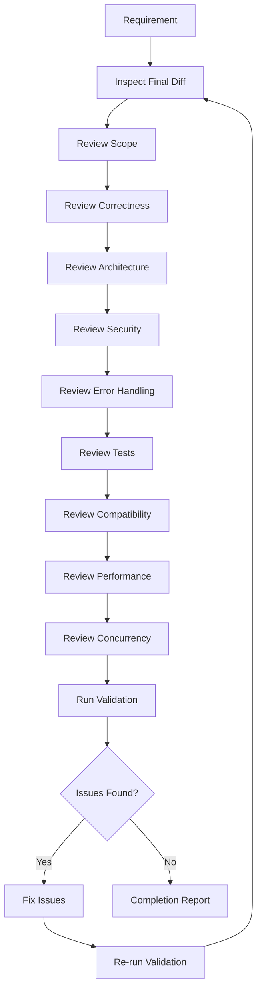
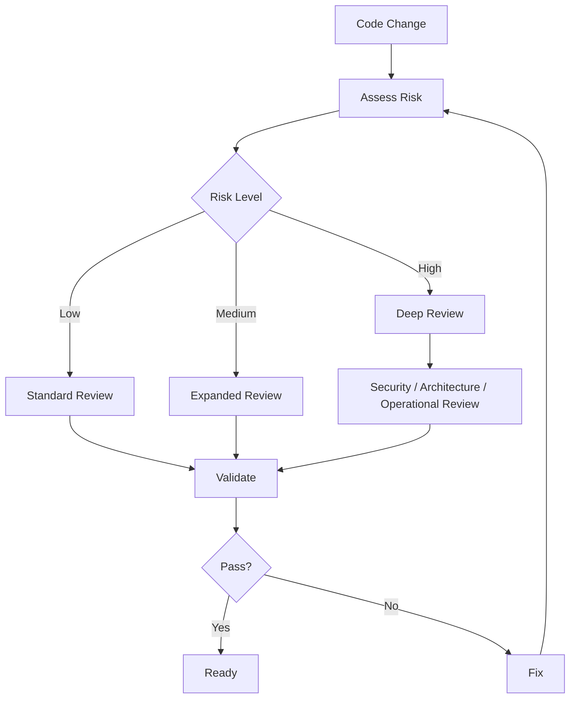
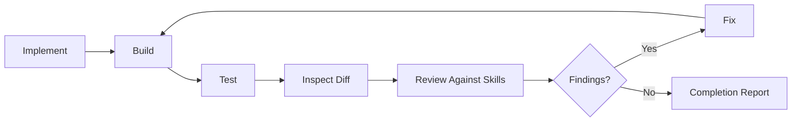
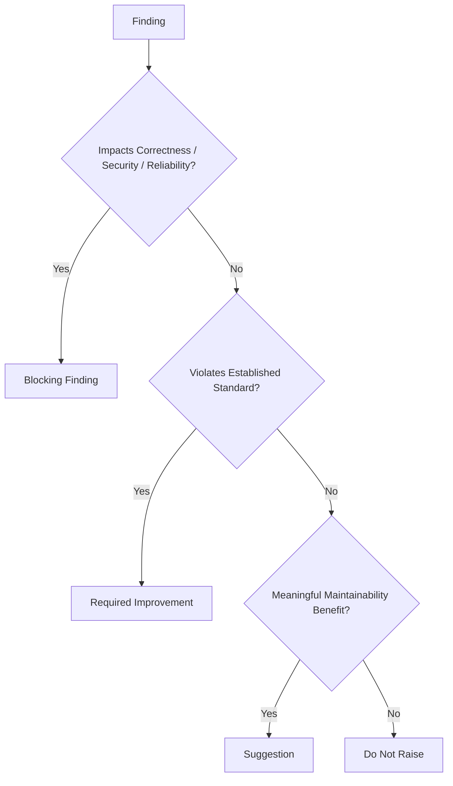
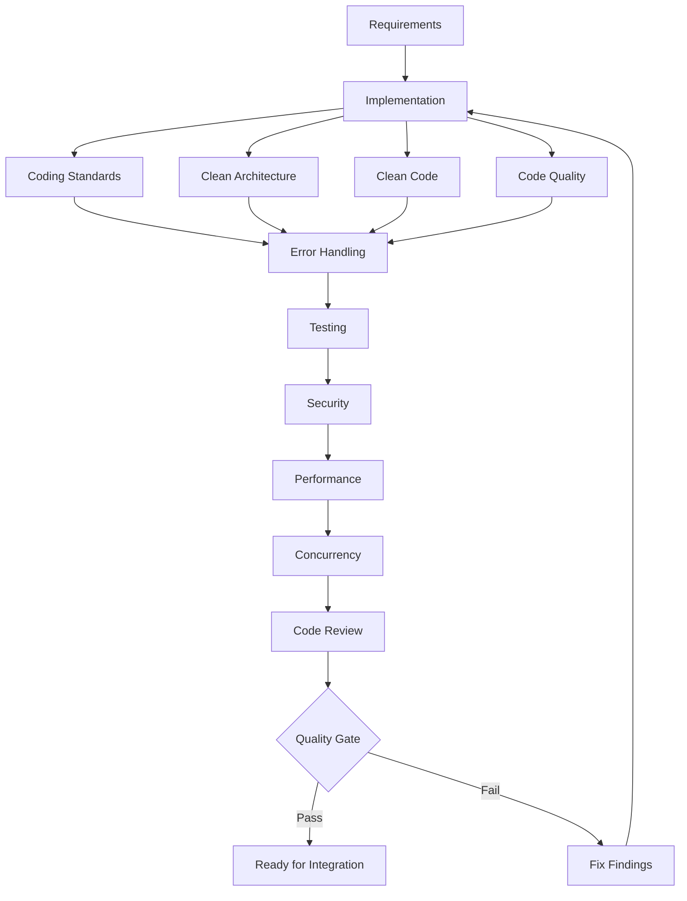
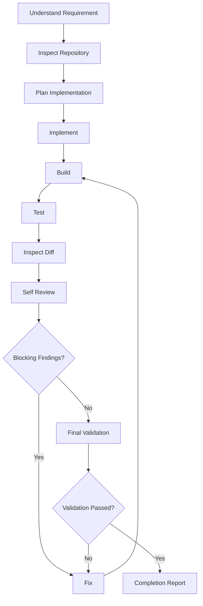

# Code Review Skill

## Purpose

This skill defines generic principles, standards, and practices for reviewing software changes before they are considered ready for integration.

Code review is not limited to checking syntax or formatting.

A complete review should evaluate whether a change is:

- Correct
- Necessary
- Understandable
- Maintainable
- Architecturally aligned
- Secure
- Testable
- Properly tested
- Operationally safe
- Performance-conscious
- Backward compatible where required
- Free from unnecessary complexity
- Within the intended scope

This skill acts as a cross-cutting validation layer over the engineering knowledge base.

This skill is:

- Domain-neutral
- Language-neutral
- Framework-neutral
- Vendor-neutral
- Cloud-neutral
- Platform-neutral
- Application-neutral
- Industry-neutral

---

# Objectives

Effective code review should help:

- Detect defects before integration.
- Validate implementation against requirements.
- Maintain architectural consistency.
- Prevent unnecessary complexity.
- Improve maintainability.
- Identify security vulnerabilities.
- Validate error handling.
- Verify test coverage.
- Detect performance regressions.
- Identify concurrency risks.
- Prevent accidental breaking changes.
- Detect scope creep.
- Improve operational readiness.
- Review AI-generated code critically.
- Maintain consistent engineering standards.

---

# Fundamental Principle

## Review the Change, Not Just the Code

A code review should answer:

```text
Why was this change needed?

Does the implementation satisfy the requirement?

Is the implementation correct?

Does it fit the existing architecture?

Is there a simpler approach?

Is it safe?

Is it tested?

Can it be operated safely?

Does it introduce unintended behavior?
```

Reviewing individual lines without understanding the purpose of the change is insufficient.

---

# Review Context

Before reviewing implementation, understand:

```text
Requirement
    ↓
Expected Behavior
    ↓
Existing Architecture
    ↓
Changed Components
    ↓
Implementation
    ↓
Tests
```

The reviewer should understand the intent before evaluating the solution.

---

# Review Inputs

Where available, review should consider:

- Requirements
- User stories
- Acceptance criteria
- Architecture decisions
- Existing implementation
- Changed files
- Tests
- Configuration changes
- Dependency changes
- Database changes
- API changes
- Infrastructure assumptions
- Security requirements
- Performance requirements

Not every change requires every category.

Review proportionally to risk.

---

# Risk-Based Review

Review depth should reflect the risk of the change.

Higher-risk areas may include:

```text
Authentication

Authorization

Security

Data Modification

Database Schema

Public APIs

Concurrency

Cryptography

Financial / Critical Calculations

External Integrations

Deployment Configuration

Shared Libraries

High-Traffic Paths
```

Small low-risk changes may require less extensive review.

---

# Review Scope

The review should focus primarily on the submitted change.

However, surrounding code may need inspection to understand:

- Existing patterns
- Dependencies
- Side effects
- Architectural boundaries
- Regression risks

Do not unnecessarily redesign unrelated parts of the system during review.

---

# Requirement Alignment

The first review question should be:

> Does this change actually solve the requested problem?

Verify that:

- Required behavior exists.
- Acceptance criteria are satisfied.
- Important edge cases are handled.
- No required functionality was omitted.
- No unrelated functionality was introduced.

---

# Requirement Traceability

Where requirements or acceptance criteria exist, the implementation should be traceable to them.

Conceptually:

```text
Requirement
    ↓
Implementation
    ↓
Validation / Test
```

If a requirement cannot be mapped to implementation or validation, investigate.

---

# Correctness

Correctness is more important than stylistic preference.

Review:

- Business logic
- Conditions
- State transitions
- Calculations
- Data transformations
- Error paths
- Boundary conditions

Ask:

```text
Does this produce the intended result?

What happens at boundaries?

What happens with invalid input?

What happens when dependencies fail?
```

---

# Happy Path

Verify that valid expected scenarios work correctly.

Conceptually:

```text
Valid Input
    ↓
Expected Processing
    ↓
Expected Result
```

But do not stop at the happy path.

---

# Negative Paths

Review behavior for:

- Invalid input
- Missing input
- Unauthorized access
- Dependency failure
- Timeout
- Empty data
- Duplicate requests
- Unexpected state

Negative paths often reveal defects missed by basic testing.

---

# Boundary Conditions

Review values around meaningful boundaries.

Examples conceptually include:

```text
Empty

Minimum

Maximum

One Below Minimum

One Above Maximum

Zero

Single Item

Large Collection
```

Apply only where relevant.

---

# Null / Missing Values

Review how missing or absent values are handled.

Do not assume values are always present unless the contract guarantees it.

Avoid unnecessary defensive checks when absence is impossible by design.

---

# State Transitions

Where state changes exist, verify:

```text
Current State
     ↓
Allowed Operation
     ↓
New State
```

Ensure invalid transitions cannot occur accidentally.

---

# Side Effects

Identify side effects such as:

```text
Database Update

File Write

External Request

Message Publish

Notification

Cache Change
```

Ensure side effects happen at the correct time and only when intended.

---

# Duplicate Effects

Determine whether retries or duplicate requests could cause repeated side effects.

Where required, verify idempotency or duplicate protection.

---

# Partial Failure

If multiple side effects occur, ask:

```text
What happens if step 1 succeeds
but step 2 fails?
```

Ensure partial completion is intentionally handled.

---

# Architecture Alignment

Review whether implementation follows established architecture.

Check:

- Layer boundaries
- Dependency direction
- Module ownership
- Separation of concerns
- Existing abstractions
- Integration patterns

Refer to `clean-architecture.md`.

---

# Dependency Direction

Dependencies should follow established architecture.

Avoid introducing dependencies that reverse intended boundaries.

Conceptually:

```text
Outer Layer
    ↓
Inner Abstraction
```

should not become:

```text
Core Logic
    ↓
Infrastructure Detail
```

without architectural justification.

---

# Separation of Concerns

Review whether unrelated responsibilities have been combined.

Avoid components that simultaneously handle excessive responsibilities such as:

```text
Validation
+
Business Logic
+
Persistence
+
External Integration
+
Formatting
```

unless the architecture intentionally defines such a boundary.

---

# Existing Patterns

Prefer existing project patterns when they are appropriate.

Do not introduce a new architectural style for a small feature without justification.

Consistency reduces cognitive load.

---

# Abstraction Review

Ask:

```text
Is this abstraction necessary?

Does it represent a meaningful concept?

Does it reduce duplication or coupling?

Is it premature?
```

Do not create abstractions merely to make the implementation appear sophisticated.

---

# Overengineering

Look for unnecessary:

- Layers
- Interfaces
- Factories
- Wrappers
- Generic frameworks
- Configuration
- Indirection
- Design patterns

Prefer the simplest design that satisfies current requirements while remaining maintainable.

---

# Underengineering

Simplicity does not mean ignoring necessary structure.

Do not accept implementation that:

- Mixes unrelated concerns.
- Duplicates significant logic.
- Ignores established boundaries.
- Hardcodes important behavior.
- Creates obvious maintainability problems.

Balance simplicity with engineering quality.

---

# Code Clarity

Code should communicate intent clearly.

Review:

- Naming
- Function size
- Control flow
- Data flow
- Responsibility
- Comments

Refer to `clean-code.md`.

---

# Naming

Names should describe intent.

Avoid names such as:

```text
data

temp

thing

obj

helper

manager
```

when a more precise name is practical.

Context matters; short names may be appropriate in narrow scopes.

---

# Function Responsibility

Functions should have a coherent responsibility.

If a function requires extensive explanation because it performs many unrelated operations, consider decomposition.

Do not split functions mechanically merely to reduce line count.

---

# Control Flow

Prefer understandable control flow.

Avoid unnecessary:

- Deep nesting
- Complex branching
- Hidden side effects
- Non-obvious mutation

Early validation or guard clauses may improve clarity where appropriate.

---

# Comments

Comments should explain:

```text
Why
```

rather than restating:

```text
What
```

Avoid comments that duplicate obvious code.

Document non-obvious constraints, trade-offs, or decisions.

---

# Dead Code

Remove unused code introduced or made obsolete by the change.

Avoid leaving:

- Commented-out implementation
- Unused variables
- Unused methods
- Obsolete branches
- Temporary debugging code

unless explicitly required.

---

# Duplication

Review meaningful duplication.

Not every repeated line requires abstraction.

Abstract duplication when it represents the same concept and is likely to change together.

---

# Magic Values

Important values should not appear as unexplained literals when they represent meaningful business or technical rules.

Use appropriately named constants or configuration where justified.

---

# Coding Standards

Verify implementation follows the established engineering conventions.

Refer to:

```text
coding-standards.md
```

Check relevant:

- Naming conventions
- Formatting
- Structure
- Error patterns
- Language idioms
- Repository conventions

Do not enforce personal stylistic preferences that conflict with established standards.

---

# Code Quality

Review maintainability and complexity.

Refer to:

```text
code-quality.md
```

Consider:

- Complexity
- Duplication
- Readability
- Maintainability
- Static analysis
- Technical debt

---

# Error Handling

Review all meaningful failure paths.

Refer to:

```text
error-handling.md
```

Check that:

- Errors are not silently ignored.
- Exceptions are not swallowed unnecessarily.
- Error context is preserved.
- Internal details are not exposed.
- Cleanup occurs.
- Retries are intentional.
- Failure behavior is predictable.

---

# Empty Catch Blocks

Avoid:

```text
catch
{
}
```

or equivalent behavior unless ignoring the failure is explicitly correct and documented.

Silent failure makes diagnosis difficult.

---

# Exception Scope

Catch errors at a level where meaningful action can be taken.

Do not catch exceptions merely to immediately rethrow them without adding value.

---

# Error Translation

When translating lower-level errors into higher-level errors:

- Preserve useful context.
- Avoid leaking implementation details.
- Maintain causal information where supported.

---

# Retry Review

If retry logic exists, verify:

- Failure is transient.
- Attempts are bounded.
- Delay strategy is appropriate.
- Duplicate effects are safe.
- Retry does not overload dependencies.

---

# Testing

Review tests as part of the implementation.

Tests are not separate from production code quality.

Refer to:

```text
testing-strategy.md
```

---

# Test Coverage

Ask:

```text
What behavior changed?

Which tests prove it?

What could break?

Are negative paths tested?
```

Coverage percentage alone does not prove sufficient testing.

---

# Test Quality

Tests should verify meaningful behavior.

Avoid tests that merely reproduce implementation details.

Prefer tests that remain valid during safe refactoring.

---

# Positive Tests

Verify expected valid behavior.

---

# Negative Tests

Verify invalid or failure behavior where relevant.

Examples:

- Invalid input
- Missing data
- Unauthorized operation
- Dependency failure
- Conflict
- Timeout

---

# Boundary Tests

Add tests around important boundaries where defects are plausible.

---

# Regression Tests

When fixing a defect, prefer adding a test that demonstrates the defect and prevents recurrence.

Conceptually:

```text
Bug
 ↓
Reproduce with Test
 ↓
Fix
 ↓
Test Passes
```

---

# Test Isolation

Tests should avoid unnecessary dependency on:

- Execution order
- Shared mutable state
- External environments
- Real time
- Uncontrolled network resources

unless integration testing specifically requires them.

---

# Flaky Tests

Do not accept unreliable tests as normal.

Investigate sources such as:

- Timing assumptions
- Shared state
- Randomness
- External dependencies
- Concurrency

---

# Security Review

Review security-sensitive behavior.

Refer to:

```text
secure-coding.md
```

At minimum consider:

- Trust boundaries
- Input validation
- Authentication
- Authorization
- Injection
- Secrets
- Sensitive data
- File handling
- External URLs
- Cryptography
- Logging

---

# Input Validation Review

Determine whether externally controlled data is validated appropriately.

Check:

- Type
- Length
- Range
- Format
- Allowed values
- Structure

Validation should occur at trusted boundaries.

---

# Authorization Review

Authentication is not enough.

Verify:

```text
Can this actor perform this operation?

Can this actor access this resource?
```

Do not rely solely on UI restrictions.

---

# Injection Review

Look for untrusted input entering:

```text
Queries

Commands

Templates

Markup

Dynamic Code

Paths
```

Use structured or parameterized mechanisms.

---

# Secret Review

Ensure the change does not introduce:

- Hardcoded credentials
- Tokens
- Keys
- Passwords
- Sensitive connection information

Also inspect:

- Tests
- Configuration
- Scripts
- Documentation

---

# Sensitive Logging

Review new logs carefully.

Ensure they do not expose:

- Passwords
- Tokens
- Credentials
- Sensitive personal information
- Private keys

---

# Dependency Review

Any added or updated dependency should be intentional.

Refer to:

```text
dependency-management.md
```

Ask:

```text
Is this dependency necessary?

Can existing functionality solve the requirement?

Is the package maintained?

Is the version appropriate?

Does it introduce security risk?

Does it significantly increase runtime or build footprint?
```

---

# Dependency Scope

Use the narrowest appropriate dependency scope.

Do not add runtime dependencies when they are only required for tests or development tooling.

---

# Dependency Locking

Where the ecosystem supports deterministic dependency resolution, ensure lock or version management follows repository standards.

---

# Configuration Review

Configuration changes require review.

Refer to:

```text
configuration-management.md
```

Check:

- Defaults
- Validation
- Environment overrides
- Secrets
- Naming
- Required settings
- Failure behavior

---

# Safe Defaults

New configuration should use safe and reasonable defaults where appropriate.

Avoid defaults that:

- Disable security
- Enable destructive behavior
- Create unlimited resource consumption
- Expose internal functionality

---

# Configuration Validation

Invalid configuration should fail predictably.

Do not allow malformed critical configuration to silently produce unsafe behavior.

---

# Environment Assumptions

Avoid unnecessary assumptions about:

```text
Development

Test

Staging

Production
```

Behavior differences should be explicit.

---

# Performance Review

Review performance implications where the change affects important execution paths.

Refer to:

```text
performance-engineering.md
```

Look for:

- Repeated computation
- Excessive queries
- N+1 patterns
- Large payloads
- Unbounded collections
- Excessive network calls
- Memory growth
- Unnecessary serialization
- Inefficient algorithms

---

# Performance Evidence

Do not reject readable implementation merely because another implementation appears theoretically faster.

Require evidence when optimization adds meaningful complexity.

---

# Database Review

Where data access changes, review:

- Query count
- Filtering
- Projection
- Pagination
- Transaction scope
- Index assumptions
- Concurrency behavior

Do not retrieve significantly more data than required without reason.

---

# Collection Bounds

Review externally influenced collection sizes.

Avoid:

```text
Load Everything
```

when data volume may be unbounded.

Use appropriate pagination, streaming, or limits.

---

# Caching Review

If caching is introduced, verify:

```text
Why is caching needed?

What is the key?

What is the lifetime?

How is invalidation handled?

Does it preserve authorization boundaries?
```

Caching should not be introduced casually.

---

# Concurrency Review

Review concurrency-sensitive code carefully.

Refer to:

```text
concurrency.md
```

Look for:

- Shared mutable state
- Race conditions
- Lost updates
- Deadlocks
- Unbounded concurrency
- Fire-and-forget work
- Missing cancellation
- Ordering assumptions
- Resource exhaustion

---

# Parallelism Review

If operations execute concurrently, verify they are genuinely independent.

Do not parallelize operations with hidden dependencies.

---

# Concurrency Limits

Concurrent work should normally have appropriate bounds when workload size is uncontrolled.

Review downstream capacity as well as local capacity.

---

# Cancellation Review

Long-running asynchronous work should propagate cancellation where meaningful.

Ensure cancellation does not leave invalid partial state.

---

# Compatibility Review

Determine whether the change affects existing consumers.

Potential compatibility areas include:

```text
Public APIs

Data Contracts

Database Schemas

Configuration

Events

Messages

Files

Command Interfaces

Libraries
```

---

# Backward Compatibility

Where backward compatibility is required, verify existing consumers continue to work.

Do not silently introduce breaking changes.

---

# API Compatibility

Potential breaking changes include:

- Removing fields
- Renaming fields
- Changing types
- Changing semantics
- Removing operations
- Making optional fields required
- Changing error contracts

Refer to `api-principles.md`.

---

# Data Compatibility

Data model changes should consider existing stored data.

Ask:

```text
Can old data still be read?

Does migration exist?

Can rollback work?

Are defaults needed?
```

---

# Schema Changes

Database schema changes require careful review.

Consider:

- Existing data
- Migration safety
- Rollback
- Locking
- Deployment order
- Compatibility between application versions

---

# Event Compatibility

Published events or messages may have multiple consumers.

Avoid breaking existing consumers without an explicit migration/versioning strategy.

---

# Configuration Compatibility

Renaming or removing configuration may break deployments.

Consider transition strategy where compatibility is required.

---

# Deployment Safety

Review whether the change can be deployed safely.

Consider:

```text
Application Version

Database Version

Configuration

Dependencies

External Consumers
```

Avoid requiring perfectly simultaneous deployment unless architecture explicitly supports it.

---

# Rollback

For high-impact changes, ask:

```text
Can this change be rolled back?

Will new data remain compatible?

Will schema changes prevent rollback?

Will old versions understand new messages?
```

Rollback limitations should be explicit.

---

# Observability Review

Changes affecting important behavior should provide sufficient operational visibility.

Consider:

- Logs
- Metrics
- Traces
- Correlation
- Error signals

Do not add telemetry without a clear operational purpose.

---

# Logging Review

Logs should be:

- Useful
- Structured where supported
- Appropriate in level
- Free from sensitive information

Avoid excessive logging on high-volume paths.

---

# Metrics Review

New critical operations may require metrics when existing observability does not provide sufficient visibility.

Avoid creating large numbers of low-value metrics.

---

# Failure Observability

Important failures should be diagnosable.

Avoid implementations where failures disappear without useful signals.

---

# Resilience Review

Where external dependencies exist, review behavior under dependency failure.

Consider:

- Timeout
- Retry
- Circuit breaking
- Rate limits
- Partial availability

Refer to architecture `resilience.md`.

---

# Scope Review

Verify the implementation stays within the requested scope.

AI-generated changes are particularly susceptible to unnecessary expansion.

Ask:

```text
Was every changed file necessary?

Was every refactor necessary?

Was every new dependency necessary?

Was every new abstraction necessary?
```

---

# Scope Creep

Examples include:

```text
Feature Request
    +
Unrelated Refactoring
    +
Dependency Upgrade
    +
Formatting Entire Repository
```

Avoid mixing unrelated changes unless explicitly required.

---

# Minimal Change Principle

Prefer the smallest coherent change that safely satisfies the requirement.

This does not mean:

```text
Fewest Lines Possible
```

It means:

```text
No Unnecessary Changes
```

---

# Diff Review

The Development Agent should inspect the actual diff before considering implementation complete.

Review:

```text
Added Lines

Removed Lines

Changed Files

Renamed Files

Generated Files

Configuration Changes

Dependency Changes
```

Do not rely solely on memory of what was changed.

---

# Every Changed File Must Be Explainable

For every modified file, the agent should be able to answer:

> Why was this file changed?

If the answer is unclear, investigate whether the change is necessary.

---

# Accidental Changes

Look for:

- Formatting-only changes
- Generated artifacts
- Temporary files
- Debug code
- IDE metadata
- Local environment configuration
- Unrelated dependency updates

Remove accidental changes.

---

# Generated Files

Determine whether generated files should be committed according to repository conventions.

Do not manually edit generated files unless the project explicitly requires it.

---

# Build Artifacts

Avoid committing local build artifacts unless repository policy explicitly requires them.

Examples conceptually include:

```text
Compiled Output

Temporary Cache

Local Logs

Test Output
```

---

# Documentation Review

If behavior, configuration, interfaces, or operational procedures changed, determine whether documentation should also change.

Documentation should remain aligned with implementation.

---

# Comments and Documentation Accuracy

Outdated documentation can be worse than missing documentation.

Review whether existing comments or documentation became incorrect because of the change.

---

# Naming Consistency

New terminology should align with existing project terminology.

Avoid introducing multiple names for the same concept.

---

# Public Interface Documentation

Where public interfaces require documentation, ensure new behavior and constraints are described appropriately.

---

# Build Validation

Before completion, execute the project's standard build process where available.

The build should succeed without introducing new unexpected warnings or errors.

Do not modify build configuration merely to hide failures.

---

# Static Analysis

Run configured static analysis where available.

Potential checks include:

```text
Compiler Analysis

Linting

Code Quality Analysis

Security Analysis

Type Checking
```

Do not disable rules merely to make validation pass.

---

# Formatting

Run established formatting tools where configured.

Avoid manually reformatting unrelated files.

---

# Test Validation

Run the appropriate test suite.

Depending on change scope this may include:

```text
Unit Tests

Integration Tests

Contract Tests

Security Tests

Performance Tests
```

Do not claim tests passed unless they were actually executed successfully.

---

# Validation Limitations

If some validation cannot be performed, report it explicitly.

For example:

```text
Integration tests were not executed because the required external dependency is unavailable.
```

Do not silently imply full validation.

---

# Review Severity

Review findings should be prioritized.

A generic classification may be:

## Critical

Could cause severe security, data integrity, availability, or correctness failure.

## High

Likely to cause significant functional, security, or operational problems.

## Medium

Meaningful maintainability, correctness, or reliability concern.

## Low

Minor improvement with limited risk.

## Suggestion

Optional improvement that does not block integration.

Use repository-specific severity conventions where they exist.

---

# Blocking vs Non-Blocking Findings

Not every observation should block integration.

Block when the issue materially affects:

- Correctness
- Security
- Data integrity
- Required behavior
- Reliability
- Compatibility
- Operational safety

Avoid blocking solely because of personal style preference.

---

# Review Comments

Review comments should be:

- Specific
- Actionable
- Evidence-based
- Respectful
- Focused on code and behavior

Prefer:

```text
This update can overwrite a concurrent change because the version
is not checked before writing. Consider using the existing optimistic
concurrency mechanism.
```

over:

```text
This code is bad.
```

---

# Explain Why

Review feedback should explain why a change matters.

This helps developers distinguish:

```text
Required Correction
```

from:

```text
Optional Preference
```

---

# Avoid Personal Preference Reviews

Do not request changes merely because another implementation style is preferred.

Ask whether the existing implementation violates:

- Requirements
- Architecture
- Standards
- Maintainability
- Security
- Reliability

---

# Self-Review

The Development Agent must review its own changes before reporting completion.

Self-review should occur after implementation and validation.

Conceptually:

```text
Implement
    ↓
Build
    ↓
Test
    ↓
Inspect Diff
    ↓
Review Against Skills
    ↓
Fix Findings
    ↓
Revalidate
    ↓
Report
```

---

# AI-Generated Code

AI-generated code must receive the same or stronger review than human-written code.

AI output should be treated as:

```text
Candidate Implementation
```

not:

```text
Verified Implementation
```

---

# Common AI Code Risks

AI-generated implementation may contain:

- Invented APIs
- Incorrect library usage
- Missing imports
- Deprecated patterns
- Missing validation
- Missing authorization
- Hardcoded configuration
- Hardcoded secrets
- Unnecessary dependencies
- Excessive abstractions
- Unnecessary refactoring
- Weak error handling
- Unsafe concurrency
- Incorrect tests
- Tests that do not test behavior
- Unsupported assumptions
- Unverified performance claims

Review explicitly for these risks.

---

# Hallucinated APIs

Verify that referenced:

```text
Functions

Classes

Packages

Configuration Options

Command-Line Arguments
```

actually exist in the versions used by the repository.

Do not assume generated code uses valid APIs.

---

# Dependency Hallucination

AI agents may invent package names or suggest nonexistent dependencies.

Verify dependencies before adding them.

---

# Existing Capability First

Before creating new utilities or dependencies, search the repository for existing capabilities.

Conceptually:

```text
Need Capability
     ↓
Search Existing Code
     ↓
Reuse if Appropriate
     ↓
Create Only if Necessary
```

---

# Duplicate Implementation

AI agents may recreate functionality that already exists.

Search for:

- Utilities
- Services
- Validators
- Mappers
- Error types
- Configuration
- Tests

before introducing duplicates.

---

# Architectural Drift

Repeated AI-generated changes can gradually introduce inconsistent patterns.

Review whether the change follows the repository's established architecture rather than creating a parallel architecture.

---

# Excessive Comments

AI-generated code may include comments that explain obvious implementation.

Remove low-value comments.

Keep comments that explain important reasoning or constraints.

---

# Excessive Defensive Code

AI may add validation for impossible states or excessive fallback logic.

Defensive behavior should reflect real contracts and risks.

Avoid hiding programming errors behind silent fallback behavior.

---

# Silent Fallbacks

Review fallback logic carefully.

A fallback may hide:

- Configuration errors
- Missing dependencies
- Data problems
- Programming defects

Fallback behavior should be intentional.

---

# Test Hallucination

AI may create tests that:

- Mock the behavior being tested.
- Never reach production code.
- Assert trivial values.
- Pass regardless of implementation.
- Test implementation details unnecessarily.

Review tests for actual behavioral value.

---

# Scope Explosion

AI agents should not convert a focused change into broad repository modernization unless explicitly requested.

For example:

```text
Add Validation
```

should not automatically become:

```text
Rewrite Architecture

Replace Framework

Upgrade Dependencies

Reformat Repository
```

---

# Review Against Engineering Skills

The Development Agent should evaluate the change against relevant skills.

Not every skill applies to every change.

Use this mapping:

| Review Area | Skill |
|---|---|
| General implementation | `coding-standards.md` |
| Architecture boundaries | `clean-architecture.md` |
| Readability | `clean-code.md` |
| Maintainability | `code-quality.md` |
| Failure behavior | `error-handling.md` |
| Testing | `testing-strategy.md` |
| Dependencies | `dependency-management.md` |
| Configuration | `configuration-management.md` |
| Security | `secure-coding.md` |
| Performance | `performance-engineering.md` |
| Concurrency | `concurrency.md` |
| Final validation | `code-review.md` |

---

# Review Against Architecture Skills

When implementation affects architecture, also consult relevant architecture skills.

Examples:

| Concern | Architecture Skill |
|---|---|
| Overall design | `architecture-principles.md` |
| Component/system design | `system-design.md` |
| Data | `data-architecture.md` |
| Security design | `security-architecture.md` |
| APIs | `api-principles.md` |
| Integrations | `integration-patterns.md` |
| Cloud design | `cloud-architecture.md` |
| Observability | `observability.md` |
| Reliability | `resilience.md` |

Implementation should remain consistent with approved architecture.

---

# Review Priority

Review in this order:

```text
1. Requirement Correctness

2. Functional Correctness

3. Security

4. Data Integrity

5. Architecture

6. Error Handling

7. Tests

8. Compatibility

9. Concurrency

10. Performance

11. Maintainability

12. Style
```

Do not spend review effort on formatting while critical correctness issues remain.

---

# AI Development Agent Review Workflow

Before reporting a development task complete, the agent should perform the following review.

## 1. Re-read the Requirement

Confirm the original request and acceptance criteria.

## 2. Inspect the Final Diff

Review every changed file.

## 3. Check Scope

Remove accidental or unrelated changes.

## 4. Verify Functional Correctness

Confirm expected and negative paths.

## 5. Verify Architecture Alignment

Ensure dependency and layer boundaries remain correct.

## 6. Review Code Quality

Check clarity, complexity, naming, duplication, and maintainability.

## 7. Review Error Handling

Ensure failures are explicit and safe.

## 8. Review Security

Check trust boundaries, validation, authorization, secrets, and sensitive data.

## 9. Review Dependencies

Verify all dependency changes are necessary and valid.

## 10. Review Configuration

Check defaults, validation, secrets, and environment behavior.

## 11. Review Performance

Inspect queries, network calls, loops, allocations, payloads, and collection bounds where relevant.

## 12. Review Concurrency

Inspect shared state, asynchronous execution, cancellation, ordering, and limits where relevant.

## 13. Review Compatibility

Check public interfaces, schemas, messages, and configuration.

## 14. Review Tests

Ensure changed behavior has appropriate tests.

## 15. Run Validation

Run available:

```text
Build

Lint

Static Analysis

Unit Tests

Integration Tests

Security Checks
```

as appropriate.

## 16. Fix Findings

Resolve blocking issues discovered during review.

## 17. Re-run Validation

Validation should be repeated after fixes.

## 18. Report

Provide a concise completion summary with validation results and unresolved risks.

---

# AI Development Agent Rules

When using this skill, the agent should:

- ALWAYS understand the requirement before reviewing implementation.
- ALWAYS inspect the actual final diff.
- ALWAYS review every changed file.
- ALWAYS verify each changed file is necessary.
- ALWAYS prioritize correctness over style.
- ALWAYS check relevant negative paths.
- ALWAYS verify architecture alignment.
- ALWAYS review error handling.
- ALWAYS review security-sensitive changes explicitly.
- ALWAYS verify dependency changes.
- ALWAYS review configuration changes.
- ALWAYS review tests for behavioral value.
- ALWAYS consider backward compatibility where interfaces change.
- ALWAYS consider concurrency where shared state or parallel execution exists.
- ALWAYS consider performance where hot paths or large data operations change.
- ALWAYS run available validation appropriate to the change.
- ALWAYS distinguish executed validation from assumed validation.
- ALWAYS report validation that could not be completed.
- ALWAYS treat AI-generated implementation as unverified until reviewed.
- ALWAYS remove accidental changes.
- ALWAYS keep review proportional to risk.

The agent should:

- NEVER approve its own implementation merely because it generated the code.
- NEVER claim tests passed unless they were executed successfully.
- NEVER claim build success without running the build when execution is available.
- NEVER ignore failing tests.
- NEVER disable tests to make validation pass.
- NEVER suppress static analysis without justification.
- NEVER weaken security controls to resolve review findings.
- NEVER introduce unrelated refactoring during review.
- NEVER request changes solely because of personal style preference.
- NEVER add dependencies without verifying necessity.
- NEVER assume generated APIs or packages exist.
- NEVER ignore backward compatibility when public contracts change.
- NEVER ignore database migration impact.
- NEVER accept unbounded concurrency without justification.
- NEVER accept caching without defined semantics.
- NEVER accept silent error handling without justification.
- NEVER treat high code coverage as proof of correctness.
- NEVER hide unresolved risks from the completion report.

---

# Code Review Decision Framework

For each change ask:

## 1. Why Does This Change Exist?

Map it to a requirement.

## 2. Does It Work?

Verify expected behavior.

## 3. What Can Go Wrong?

Inspect negative and failure paths.

## 4. Is It Architecturally Correct?

Check boundaries and dependencies.

## 5. Is It Understandable?

Evaluate readability and responsibility.

## 6. Is It Secure?

Review trust boundaries and sensitive operations.

## 7. Is Failure Handled Correctly?

Review error behavior and cleanup.

## 8. Is It Tested?

Verify meaningful behavioral tests.

## 9. Does It Break Existing Consumers?

Check compatibility.

## 10. Does It Introduce Performance Risk?

Review important execution paths.

## 11. Does It Introduce Concurrency Risk?

Review shared state and asynchronous behavior.

## 12. Are Dependencies Necessary?

Review newly introduced packages or libraries.

## 13. Is Configuration Safe?

Review defaults and secrets.

## 14. Is Every Changed File Necessary?

Remove accidental changes.

## 15. Can This Be Operated?

Check logging, metrics, failure visibility, and deployment impact where relevant.

---

# Review Flow



---

# Risk-Based Review Flow



---

# Self-Review Flow



---

# Review Finding Flow



---

# Best Practices

- Understand requirements first.
- Review the actual diff.
- Review every changed file.
- Keep review proportional to risk.
- Prioritize correctness.
- Review negative paths.
- Check architectural alignment.
- Prefer simple implementations.
- Detect unnecessary abstractions.
- Review error handling.
- Review security explicitly.
- Review tests as production-quality code.
- Verify dependencies.
- Review configuration.
- Consider compatibility.
- Review data migrations carefully.
- Consider deployment ordering.
- Consider rollback.
- Review concurrency where applicable.
- Review performance where applicable.
- Check observability for critical behavior.
- Remove accidental changes.
- Verify generated APIs and dependencies.
- Run automated validation.
- Revalidate after fixes.
- Report unresolved limitations clearly.
- Treat AI-generated code as candidate code requiring verification.

---

# Common Mistakes

Avoid:

- Reviewing only formatting.
- Reviewing without understanding the requirement.
- Ignoring negative paths.
- Accepting code because tests exist.
- Relying only on coverage percentage.
- Ignoring architectural drift.
- Accepting unnecessary abstractions.
- Allowing unrelated refactoring.
- Ignoring security because the feature appears internal.
- Ignoring error handling.
- Ignoring configuration defaults.
- Ignoring dependency changes.
- Ignoring database migration safety.
- Ignoring public contract compatibility.
- Ignoring concurrency risks.
- Assuming async code is correct.
- Assuming caching is safe.
- Optimizing without evidence.
- Accepting silent fallback behavior.
- Accepting hardcoded secrets.
- Accepting unverified generated APIs.
- Accepting invented packages.
- Leaving debug code.
- Committing accidental generated files.
- Claiming validation that was not performed.
- Hiding unresolved risks.
- Treating personal preference as a blocking standard.
- Assuming AI-generated code is correct because it looks plausible.

---

# Final Review Checklist

Before considering implementation ready, verify:

## Requirement

- [ ] The original requirement was re-read.
- [ ] Acceptance criteria are satisfied.
- [ ] No required behavior is missing.
- [ ] No unrelated functionality was introduced.

## Scope

- [ ] Final diff was inspected.
- [ ] Every changed file is necessary.
- [ ] No accidental files were added.
- [ ] No unrelated refactoring exists.
- [ ] No unnecessary formatting changes exist.

## Correctness

- [ ] Happy path works.
- [ ] Relevant negative paths are handled.
- [ ] Boundary conditions were considered.
- [ ] Missing values are handled according to contract.
- [ ] State transitions are valid.
- [ ] Side effects occur correctly.
- [ ] Partial failures are handled intentionally.
- [ ] Duplicate execution was considered where relevant.

## Architecture

- [ ] Architecture boundaries are respected.
- [ ] Dependency direction is correct.
- [ ] Responsibilities are appropriately separated.
- [ ] Existing patterns are followed where appropriate.
- [ ] No unnecessary abstraction was introduced.
- [ ] No architectural drift was introduced.

## Code Quality

- [ ] Names communicate intent.
- [ ] Control flow is understandable.
- [ ] Functions have coherent responsibilities.
- [ ] Significant duplication was addressed appropriately.
- [ ] Dead code was removed.
- [ ] Debug code was removed.
- [ ] Comments explain non-obvious reasoning.
- [ ] Complexity is justified.

## Error Handling

- [ ] Errors are not silently ignored.
- [ ] Exceptions are handled at appropriate boundaries.
- [ ] Useful context is preserved.
- [ ] Sensitive implementation details are not exposed.
- [ ] Cleanup occurs on failure.
- [ ] Retry behavior is bounded and appropriate.

## Testing

- [ ] Changed behavior has meaningful tests.
- [ ] Positive behavior is tested.
- [ ] Relevant negative behavior is tested.
- [ ] Important boundaries are tested.
- [ ] Regression tests exist for defect fixes where appropriate.
- [ ] Tests verify behavior rather than implementation details.
- [ ] Tests are deterministic where practical.
- [ ] No failing tests are ignored.

## Security

- [ ] Trust boundaries were considered.
- [ ] External input is validated.
- [ ] Authorization is enforced where required.
- [ ] Injection risks were reviewed.
- [ ] No secrets were introduced.
- [ ] Sensitive data is protected.
- [ ] Logging does not expose sensitive information.
- [ ] File and URL handling is safe where relevant.
- [ ] Security-sensitive code received additional review.

## Dependencies

- [ ] New dependencies are necessary.
- [ ] Dependency identity was verified.
- [ ] Versions follow repository standards.
- [ ] Dependency scope is appropriate.
- [ ] Known security risks were considered.

## Configuration

- [ ] New configuration is necessary.
- [ ] Defaults are safe.
- [ ] Configuration is validated.
- [ ] Secrets are not stored in committed configuration.
- [ ] Environment behavior is explicit.
- [ ] Existing deployments remain compatible where required.

## Performance

- [ ] Important performance paths were considered.
- [ ] No obvious N+1 pattern was introduced.
- [ ] Large collections are bounded.
- [ ] Unnecessary data retrieval is avoided.
- [ ] Network calls are reasonable.
- [ ] Caching has defined semantics where introduced.
- [ ] Complex optimization has evidence.

## Concurrency

- [ ] Shared mutable state was reviewed.
- [ ] Race conditions were considered.
- [ ] Lost updates were considered.
- [ ] Concurrency is bounded.
- [ ] Cancellation is handled where appropriate.
- [ ] Ordering requirements are preserved.
- [ ] Fire-and-forget required work is avoided.
- [ ] Downstream capacity is respected.

## Compatibility

- [ ] Public API compatibility was reviewed.
- [ ] Data compatibility was reviewed.
- [ ] Schema changes were reviewed.
- [ ] Event/message compatibility was reviewed.
- [ ] Configuration compatibility was reviewed.
- [ ] Deployment ordering was considered.
- [ ] Rollback impact was considered.

## Operations

- [ ] Important failures are observable.
- [ ] Logs are useful and safe.
- [ ] Metrics/tracing are sufficient where relevant.
- [ ] Dependency failure behavior is appropriate.
- [ ] Deployment impact was considered.

## Validation

- [ ] Build was executed where available.
- [ ] Static analysis was executed where configured.
- [ ] Formatting/linting was executed where configured.
- [ ] Relevant unit tests were executed.
- [ ] Relevant integration tests were executed where available.
- [ ] Security checks were executed where configured.
- [ ] Validation was repeated after significant fixes.
- [ ] Validation limitations are explicitly reported.

## AI-Generated Code

- [ ] Generated APIs were verified.
- [ ] Generated package names were verified.
- [ ] Existing repository capabilities were searched before adding new ones.
- [ ] Duplicate implementation was avoided.
- [ ] Generated tests were reviewed for behavioral value.
- [ ] No unnecessary AI-generated abstractions remain.
- [ ] No unsupported assumptions remain.
- [ ] AI-generated code was treated as unverified until validated.

---

# Completion Criteria

The Development Agent should consider implementation complete only when:

```text
Requirements Satisfied
        +
Implementation Correct
        +
Architecture Aligned
        +
Security Reviewed
        +
Tests Appropriate
        +
Validation Passed
        +
Diff Reviewed
        +
No Blocking Findings
```

If any blocking condition remains:

```text
Implementation
     ↓
NOT COMPLETE
```

The agent must not present unfinished or unvalidated work as completed.

---

# Completion Report

After self-review, the Development Agent should provide a concise report containing:

```text
Implementation Summary

Files Changed

Tests Added / Updated

Validation Performed

Security Considerations

Architecture Considerations

Known Limitations / Risks
```

Do not create unnecessary documentation solely for this report unless requested.

---

# Example Completion Report

```text
Implementation Summary
- Added the requested capability.
- Integrated it using the existing application architecture.
- Added input validation and failure handling.

Files Changed
- Updated existing implementation components.
- Added required tests.
- Updated configuration where necessary.

Validation
- Build: Passed
- Unit Tests: Passed
- Static Analysis: Passed

Security Review
- External input validated.
- No secrets introduced.
- Existing authorization model preserved.

Architecture Review
- Existing dependency direction preserved.
- No new architectural pattern introduced.

Known Limitations
- Integration testing requiring the external environment was not executed.
```

The exact report should reflect the actual work performed.

---

# Relationship With Other Engineering Skills

`code-review.md` acts as the final cross-cutting engineering validation layer.

It should use:

```text
coding-standards.md
        ↓
clean-architecture.md
        ↓
clean-code.md
        ↓
code-quality.md
        ↓
error-handling.md
        ↓
testing-strategy.md
        ↓
dependency-management.md
        ↓
configuration-management.md
        ↓
secure-coding.md
        ↓
performance-engineering.md
        ↓
concurrency.md
        ↓
code-review.md
```

The purpose is not to apply every skill blindly.

The Development Agent should identify which skills are relevant to the change and review accordingly.

---

# Engineering Quality Gate



---

# Development Agent Final Flow



---

# Final Rules

The Development Agent must:

- Treat code review as part of implementation.
- Review the final state rather than only individual edits.
- Validate against the original requirement.
- Review the actual diff.
- Apply relevant engineering skills.
- Apply relevant architecture skills when architectural boundaries are affected.
- Prioritize correctness, security, and reliability.
- Validate tests rather than merely generating them.
- Verify generated APIs and dependencies.
- Remove accidental changes.
- Preserve backward compatibility where required.
- Report validation accurately.
- Report unresolved risks explicitly.

The Development Agent must never consider:

```text
Code Generated
```

equivalent to:

```text
Task Complete
```

The required lifecycle is:

```text
Understand
    ↓
Design
    ↓
Implement
    ↓
Test
    ↓
Review
    ↓
Validate
    ↓
Report
```

Only after the relevant stages succeed should the implementation be considered ready for integration.