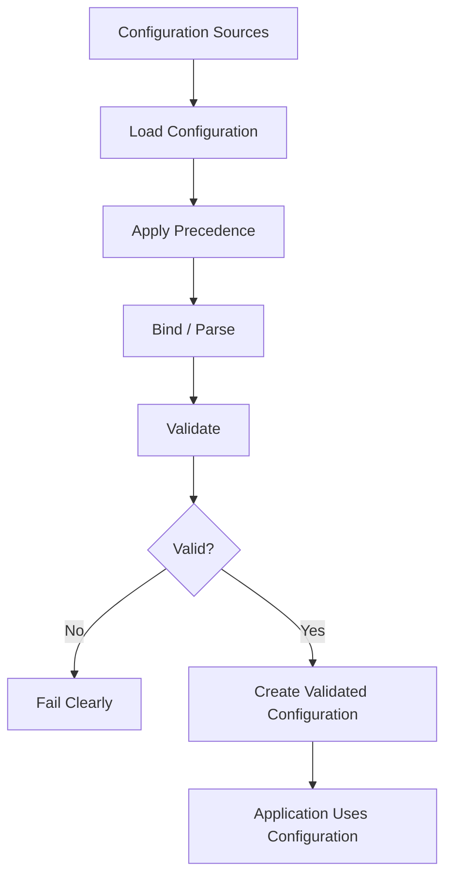
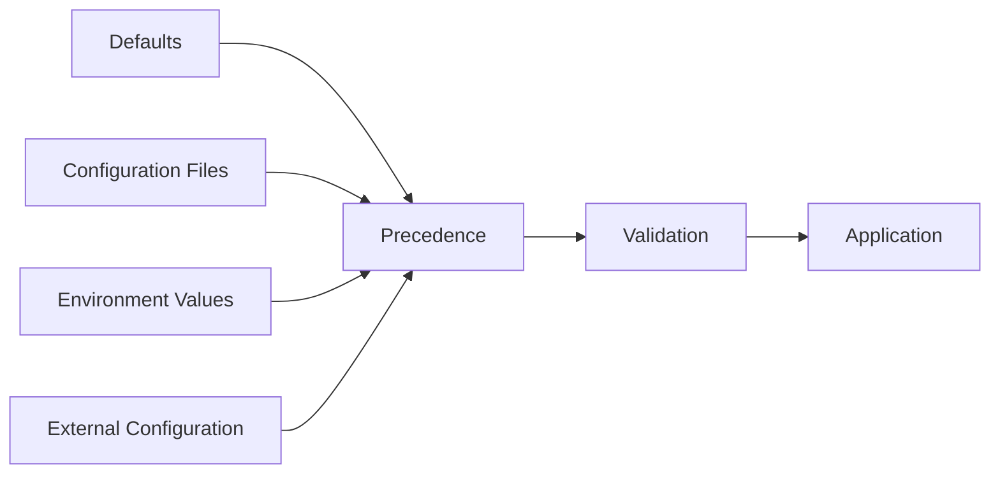
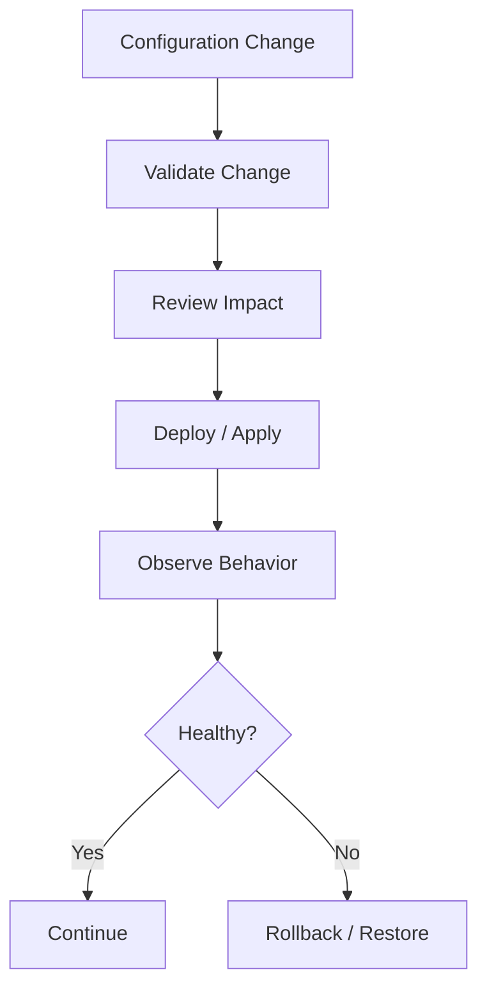

# Configuration Management Skill

## Purpose

This skill defines generic engineering principles and best practices for designing, storing, validating, accessing, changing, and maintaining software configuration.

Configuration represents values that influence system behavior without requiring source-code changes.

Examples may include:

- Service endpoints
- Timeouts
- Retry limits
- Feature settings
- Resource limits
- Runtime modes
- Integration settings
- Environment-specific values

Configuration must be managed deliberately because incorrect configuration can cause failures even when application code is correct.

This skill is:

- Domain-neutral
- Language-neutral
- Framework-neutral
- Vendor-neutral
- Cloud-neutral
- Platform-neutral
- Deployment-neutral
- Application-neutral
- Industry-neutral

---

# Objectives

Good configuration management should help:

- Separate configuration from source code.
- Avoid environment-specific hardcoding.
- Validate configuration early.
- Provide predictable configuration behavior.
- Keep secrets separate from ordinary configuration.
- Support multiple deployment environments.
- Make configuration changes reviewable.
- Reduce configuration drift.
- Support safe operational changes.
- Make configuration failures diagnosable.
- Provide secure defaults.
- Maintain consistent configuration conventions.

---

# Fundamental Principle

## Separate Code from Configuration

Source code defines system behavior.

Configuration controls variable aspects of that behavior.

Prefer:

```text
Application Code
      +
External Configuration
      ↓
Runtime Behavior
```

over:

```text
Application Code
      +
Hardcoded Environment Values
```

Values that legitimately differ between deployments should generally not require source-code modification.

---

# What Is Configuration?

A value is a configuration candidate when it may reasonably change between:

- Environments
- Deployments
- Regions
- Runtime contexts
- Operational modes

without requiring a change to core business logic.

Examples include:

```text
Service Endpoint

Timeout

Retry Limit

Feature Toggle

Resource Limit

Log Level
```

---

# What Is Not Configuration?

Not every value should become configurable.

Avoid turning fundamental application behavior into arbitrary configuration.

Examples may include:

- Core algorithms
- Fundamental domain rules
- Internal implementation constants
- Values that should never vary

Too much configuration increases system complexity.

---

# Configuration Decision

Before making a value configurable ask:

1. Does this value legitimately vary?
2. Who needs to change it?
3. How frequently might it change?
4. Does changing it affect correctness?
5. Does changing it affect security?
6. Should a code review be required?
7. Does it require restart or redeployment?
8. What happens if the value is invalid?

Only expose configuration where variability provides meaningful value.

---

# Avoid Hardcoding

Do not hardcode values that are expected to differ between deployment contexts.

Avoid:

```text
Production Endpoint

Environment Name

Region

Machine Path

Credential

Port Assigned by Deployment

External Resource Identifier
```

inside application logic when these values belong to configuration.

---

# Hardcoded Constants

Hardcoding is not always wrong.

Stable implementation constants may remain in code when they are part of the implementation rather than deployment configuration.

The question is:

> Is this value part of the software definition, or does it vary independently from the software?

---

# Configuration Categories

Configuration may be conceptually divided into:

```text
Application Configuration

Infrastructure Configuration

Environment Configuration

Integration Configuration

Operational Configuration

Feature Configuration

Secret Configuration
```

The exact organization depends on the system.

---

# Application Configuration

Application configuration controls application-level behavior.

Examples:

- Limits
- Timeouts
- Processing settings
- Feature behavior

Keep related settings logically grouped.

---

# Environment Configuration

Environment configuration contains values that vary between deployment environments.

Conceptually:

```text
Development

Testing

Staging

Production
```

Environment-specific differences should be intentional and minimal.

---

# Integration Configuration

External integrations may require configuration such as:

```text
Endpoint

Protocol Setting

Timeout

Retry Policy

Resource Identifier
```

Keep integration configuration close to the integration boundary where practical.

---

# Operational Configuration

Operational settings may include:

- Logging level
- Resource limits
- Diagnostic options
- Operational thresholds

Operational configuration should not bypass application correctness or security controls.

---

# Configuration Structure

Configuration should be organized logically.

Prefer:

```text
ServiceA:
    Endpoint
    Timeout

ServiceB:
    Endpoint
    RetryLimit
```

over:

```text
ServiceAEndpoint
ServiceBRetryLimit
ServiceATimeout
ServiceBEndpoint
```

when hierarchical configuration is supported.

---

# Configuration Naming

Configuration names should be:

- Clear
- Consistent
- Descriptive
- Stable

Avoid ambiguous names such as:

```text
VALUE

SETTING1

FLAG

CONFIG
```

Prefer names that communicate purpose.

---

# Configuration Types

Configuration should be treated as typed data where possible.

Examples:

```text
Boolean

Integer

Duration

URL / Endpoint

Enumeration

Structured Object
```

Avoid treating every configuration value as an arbitrary string throughout the application.

---

# Configuration Validation

Configuration must be validated before use.

Validation may include:

- Required values
- Type validation
- Format validation
- Range validation
- Allowed values
- Cross-field constraints

Conceptually:

```text
Configuration
      ↓
Validation
   /      \
Valid    Invalid
 ↓         ↓
Start    Fail Clearly
```

---

# Validate Early

Critical configuration should generally be validated during initialization.

Prefer:

```text
Application Starts
      ↓
Validate Configuration
      ↓
Configuration Invalid
      ↓
Fail Clearly
```

over:

```text
Application Starts

Hours Later

Rare Code Path Executes

Configuration Error Appears
```

---

# Required Configuration

If the system cannot operate correctly without a value, treat that value as required.

Do not silently substitute arbitrary values for missing critical configuration.

---

# Optional Configuration

Optional configuration should have clearly defined behavior.

For each optional value determine:

```text
Absent
   ↓
What Happens?
```

Possible outcomes include:

- Use documented default.
- Disable optional capability.
- Use another configured source.

Optional must not mean undefined.

---

# Defaults

Defaults can simplify configuration.

A good default should be:

- Safe
- Predictable
- Documented
- Appropriate for common use

Avoid defaults that silently weaken:

- Security
- Reliability
- Data protection

---

# Secure Defaults

When configuration controls security behavior, prefer safe defaults.

Conceptually:

```text
Security Configuration Missing
        ↓
Safe Behavior
```

rather than:

```text
Security Configuration Missing
        ↓
Security Disabled
```

---

# Fail-Safe Defaults

Where configuration determines access or protection behavior, failure should generally preserve the safer state.

For example:

```text
Authorization Setting Invalid
        ↓
Reject / Fail Startup
```

rather than automatically permitting access.

---

# Configuration Precedence

Systems may load configuration from multiple sources.

For example:

```text
Default
   ↓
Configuration File
   ↓
Environment Configuration
   ↓
Runtime Override
```

If multiple sources exist, precedence must be explicit.

---

# Predictable Precedence

Developers and operators should be able to answer:

> Which configuration value will actually be used?

Avoid hidden or undocumented precedence rules.

---

# Configuration Sources

Possible sources include:

- Configuration files
- Environment variables
- Command-line parameters
- External configuration stores
- Deployment configuration
- Runtime management systems

Use sources appropriate to the deployment model.

---

# Configuration Source Abstraction

Core application logic should not need to know how configuration was physically loaded.

Prefer:

```text
Configuration Source
       ↓
Configuration Binding
       ↓
Validated Settings
       ↓
Application Logic
```

This reduces infrastructure coupling.

---

# Centralized Configuration Access

Avoid reading configuration independently throughout the entire codebase.

Prefer structured access through appropriate configuration abstractions.

This improves:

- Validation
- Testing
- Consistency
- Discoverability

---

# Configuration Objects

Where supported, group related configuration into meaningful structures.

Conceptually:

```text
PaymentConfiguration

MessagingConfiguration

StorageConfiguration
```

rather than scattering unrelated string lookups throughout implementation code.

The names should reflect actual system concepts.

---

# Secrets Are Not Ordinary Configuration

Secrets may be referenced through configuration mechanisms, but they require stronger handling.

Examples include:

- Passwords
- Tokens
- Private keys
- API credentials
- Certificates
- Connection credentials

Do not treat secrets as ordinary configuration values.

---

# Secret Separation

Prefer:

```text
Ordinary Configuration
        +
Secret Reference / Secure Secret Source
```

over:

```text
Configuration File
        ↓
Plaintext Secrets
```

Refer to `secure-coding.md` and security architecture standards.

---

# Never Commit Secrets

Secrets must not be committed to source control.

This includes:

- Production secrets
- Development secrets
- Test credentials
- Tokens
- Private keys

Even temporary credentials should not be committed.

---

# Secret References

Where supported, configuration may contain references to secrets rather than secret values themselves.

Conceptually:

```text
Configuration
     ↓
Secret Identifier
     ↓
Secure Secret Provider
     ↓
Secret Value
```

This reduces secret exposure.

---

# Secret Rotation

Configuration design should allow credentials to change without unnecessary source-code modification.

Where runtime secret rotation is supported, applications should handle it according to system requirements.

---

# Environment Variables

Environment variables are a common configuration mechanism.

They are useful for deployment-specific values.

However:

- Naming should be consistent.
- Required values should be validated.
- Secrets should still be protected.
- Values should be parsed into appropriate types.

Do not assume environment variables are automatically secure.

---

# Configuration Files

Configuration files may be appropriate for structured settings.

Consider:

- Source-control policy
- Environment overrides
- Secret handling
- Validation
- Deployment packaging

Do not place sensitive values into committed configuration files.

---

# Configuration Templates

Repositories may provide configuration templates showing required settings without containing sensitive values.

For example:

```text
SERVICE_ENDPOINT=<required>
SERVICE_TIMEOUT=<default>
SECRET_REFERENCE=<required>
```

Templates can improve onboarding and deployment clarity.

---

# Environment-Specific Files

Environment-specific files can be useful, but excessive environment-specific duplication can cause drift.

Prefer common configuration with minimal intentional overrides where practical.

---

# Environment Parity

Deployment environments should avoid unnecessary configuration differences.

Conceptually:

```text
Development
      ↓
Testing
      ↓
Staging
      ↓
Production
```

Differences should primarily reflect legitimate environmental concerns.

Unnecessary differences increase deployment risk.

---

# Configuration Drift

Configuration drift occurs when environments evolve differently without deliberate control.

Examples include:

```text
Staging Timeout = 10

Production Timeout = 90

Reason Unknown
```

Configuration should be versioned, reviewed, or otherwise governed where appropriate.

---

# Configuration as Code

Where practical, non-secret configuration may be maintained through version-controlled processes.

Benefits include:

- History
- Review
- Auditability
- Repeatability

This does not mean every runtime configuration value must live in the application repository.

---

# Configuration Ownership

Configuration should have clear ownership.

For important settings determine:

- Who defines it?
- Who can change it?
- Who reviews it?
- Who operates it?
- Who understands its impact?

Avoid unmanaged configuration.

---

# Configuration Documentation

Important configuration should document:

- Purpose
- Type
- Required/optional status
- Default
- Allowed values
- Security sensitivity
- Restart/reload behavior where relevant

Avoid documentation that simply repeats the setting name.

---

# Configuration Discoverability

An engineer should be able to determine which configuration values a component requires.

Avoid hidden configuration dependencies.

---

# Startup Validation

At startup, validate critical configuration such as:

```text
Required Values

Valid Formats

Allowed Ranges

Cross-Setting Compatibility
```

If critical configuration is invalid, fail clearly.

---

# Cross-Field Validation

Some settings are valid individually but invalid together.

Example:

```text
FeatureEnabled = true

FeatureEndpoint = missing
```

Validation should consider relationships where necessary.

---

# Configuration Error Messages

Configuration failures should identify:

- Which setting is invalid
- Why it is invalid
- Expected format or range where safe

Avoid exposing secret values in error messages.

---

# Do Not Log Secrets

Configuration logging must exclude:

- Passwords
- Tokens
- Private keys
- Secret values
- Sensitive credentials

Even debug logs should not expose them.

---

# Configuration Diagnostics

It can be useful to log safe configuration metadata such as:

```text
Feature Enabled

Timeout Value

Selected Mode
```

when this helps operations.

Never log sensitive values merely for troubleshooting convenience.

---

# Feature Flags

Feature flags allow behavior to be enabled or disabled without immediately changing deployed code.

Conceptually:

```text
Code Deployed
     ↓
Feature Flag
   /       \
Enabled   Disabled
```

Feature flags should be used deliberately.

---

# Feature Flag Use Cases

Feature flags may support:

- Progressive rollout
- Controlled release
- Experimentation
- Emergency disablement
- Temporary compatibility behavior

They should not become permanent substitutes for clean architecture.

---

# Feature Flag Naming

Feature flag names should communicate the capability being controlled.

Avoid:

```text
flag1

newFeature

temp
```

Prefer stable meaningful names.

---

# Feature Flag Defaults

Feature flags should have intentional defaults.

Consider:

- What happens when flag service is unavailable?
- What happens when the flag is missing?
- Which behavior is safest?

---

# Feature Flag Lifecycle

Feature flags create complexity and should have a lifecycle.

Conceptually:

```text
Create
  ↓
Use
  ↓
Roll Out
  ↓
Stabilize
  ↓
Remove Flag
```

Temporary flags should not remain indefinitely.

---

# Stale Feature Flags

Unused or permanently enabled flags should be removed when safe.

Stale flags increase:

- Branching complexity
- Testing complexity
- Cognitive load
- Dead code

---

# Feature Flag Testing

When a feature flag changes meaningful behavior, test relevant states.

At minimum, where important:

```text
Flag Off

Flag On
```

Additional combinations may be required when flags interact.

---

# Avoid Flag Explosion

Too many interacting feature flags can produce a large number of behavioral combinations.

For example:

```text
3 Boolean Flags
      ↓
8 Possible Combinations
```

Use flags selectively.

---

# Runtime Configuration

Some systems allow configuration to change while running.

Before supporting dynamic configuration ask:

- Is runtime change required?
- Is the change safe?
- Must existing operations see the old or new value?
- Does it require synchronization?
- What happens if reload fails?

Dynamic configuration introduces complexity.

---

# Static Configuration

Where runtime changes are unnecessary, configuration may be loaded once during startup.

This is often simpler and easier to reason about.

Do not add dynamic reload capability without a requirement.

---

# Configuration Reload

If runtime reload is supported:

```text
New Configuration
       ↓
Validate
       ↓
Apply Atomically
```

Avoid partially applying invalid configuration.

---

# Invalid Runtime Update

When a runtime configuration update is invalid, prefer preserving the last known valid configuration where appropriate.

Do not corrupt running behavior with partially valid configuration.

---

# Configuration Consistency

Distributed components may observe configuration changes at different times.

If consistency matters, define:

- Propagation behavior
- Versioning
- Rollout expectations
- Compatibility during transition

Do not assume instantaneous global configuration updates.

---

# Immutable Configuration

Immutable deployment configuration can improve predictability.

Conceptually:

```text
Configuration Change
      ↓
New Deployment
```

rather than modifying running instances manually.

Use when compatible with operational requirements.

---

# Mutable Configuration

Mutable runtime configuration can provide flexibility but increases operational complexity.

Use it only where the benefit justifies the risk.

---

# Manual Configuration Changes

Manual production changes should be minimized.

They can cause:

- Drift
- Poor auditability
- Inconsistent environments
- Difficult rollback

Prefer controlled configuration workflows.

---

# Configuration Versioning

Significant configuration formats may require versioning when compatibility matters.

A configuration change can be breaking even when source APIs remain unchanged.

---

# Backward Compatibility

When configuration schemas evolve, consider compatibility with existing deployed values.

Changes such as:

```text
Rename Setting

Remove Setting

Change Type

Change Meaning
```

may require migration.

---

# Configuration Migration

When configuration structure changes:

1. Identify existing usage.
2. Define new format.
3. Determine compatibility.
4. Update deployment definitions.
5. Validate affected environments.
6. Remove obsolete settings when safe.

---

# Deprecated Configuration

Configuration values may become obsolete.

If deprecating a setting:

- Identify replacement.
- Support migration where necessary.
- Communicate behavior.
- Remove obsolete handling when safe.

Do not accumulate permanent unused settings.

---

# Configuration Duplication

Avoid defining the same value independently in many places.

Conceptually:

```text
Same Setting
 ├── Application File
 ├── Deployment Script
 ├── Pipeline
 └── Manual Environment Value
```

can create ambiguity.

Prefer a clear source of truth.

---

# Single Source of Truth

For each important configuration value, identify the authoritative source.

This does not mean every value must exist in one physical file.

It means ownership and precedence should be unambiguous.

---

# Infrastructure Configuration

Infrastructure-level configuration and application-level configuration should have clear boundaries.

For example:

```text
Infrastructure
      ↓
Provides Endpoint / Resource Identity
      ↓
Application Configuration
      ↓
Application Uses Resource
```

Avoid duplicating infrastructure-generated values manually where automation can provide them.

---

# Deployment Configuration

Deployment systems may provide application configuration.

The application should not depend unnecessarily on the implementation details of the deployment platform.

Maintain clear boundaries.

---

# Local Development Configuration

Local development should have a documented configuration approach.

It should not require developers to:

- Modify production configuration
- Commit personal settings
- Share credentials
- Hardcode machine-specific paths

---

# Test Configuration

Tests should use controlled configuration.

Avoid depending accidentally on developer-machine or production environment values.

Tests should explicitly define required settings.

---

# Production Configuration

Production configuration should:

- Be controlled
- Be reviewable where appropriate
- Protect sensitive values
- Avoid ad hoc modification
- Support recovery

Production values should not be assumed in application code.

---

# Configuration and Error Handling

Invalid configuration should produce predictable failures.

Refer to `error-handling.md`.

Do not catch configuration failures and continue with undefined behavior.

---

# Configuration and Testing

Configuration behavior should be tested where meaningful.

Possible tests include:

- Required setting missing
- Invalid type
- Invalid range
- Valid configuration
- Default behavior
- Cross-field validation
- Feature flag states

Refer to `testing-strategy.md`.

---

# Configuration and Security

Configuration may control security-sensitive behavior.

Examples include:

- Authentication modes
- Authorization policies
- Encryption settings
- External endpoints
- Certificate references

Security-sensitive configuration should receive stronger validation and governance.

Refer to `secure-coding.md`.

---

# Configuration and Resilience

Settings such as:

- Timeout
- Retry count
- Circuit thresholds
- Queue limits

can strongly affect reliability.

Do not expose arbitrary resilience configuration without safe constraints.

Refer to architecture `resilience.md`.

---

# Configuration and Performance

Settings such as:

- Concurrency limits
- Batch size
- Cache size
- Connection limits

can affect performance and resource usage.

Validate reasonable ranges.

Refer to `performance-engineering.md`.

---

# Configuration and Observability

Operationally important configuration changes should be diagnosable.

Where appropriate, observability should help answer:

```text
Which configuration version is active?

Which features are enabled?

When did configuration change?
```

without exposing secrets.

---

# Configuration and Architecture

Configuration should respect architectural boundaries.

Core business logic should not be tightly coupled to:

- Environment variable names
- Configuration file formats
- External configuration providers
- Deployment platforms

Prefer:

```text
External Configuration Source
        ↓
Configuration Adapter
        ↓
Validated Configuration Model
        ↓
Application
```

---

# Configuration and Dependency Management

Dependencies may introduce configuration requirements.

When adding a dependency:

- Identify new settings.
- Validate them.
- Document them.
- Protect sensitive values.
- Remove obsolete settings if dependency is removed.

Refer to `dependency-management.md`.

---

# Configuration Change Review

Configuration changes deserve review according to impact.

Review questions include:

```text
What behavior changes?

Which environments are affected?

Is security affected?

Is restart required?

Can the change be rolled back?

Is the value validated?
```

---

# High-Risk Configuration

Some configuration changes can be equivalent to code changes in operational impact.

Examples may include:

- Security controls
- Data destinations
- Feature activation
- Retry behavior
- Resource limits

Apply appropriate governance.

---

# Configuration Rollback

Significant configuration changes should have a recovery strategy.

Possible strategies include:

```text
Restore Previous Version

Redeploy Previous Configuration

Disable Feature

Revert Configuration Commit
```

The mechanism depends on deployment architecture.

---

# Configuration Auditability

Important configuration changes should be traceable where organizational requirements require it.

Useful information may include:

- What changed?
- When?
- Who or what changed it?
- Why?
- Which environment was affected?

---

# Configuration Drift Detection

Where configuration consistency matters, automated comparison or policy validation can identify unexpected drift.

Use according to operational risk.

---

# Configuration Schema

Complex configuration may benefit from a defined schema.

A schema can specify:

- Required fields
- Types
- Allowed values
- Structure
- Constraints

Schema validation can detect errors before runtime.

---

# Configuration Contract

Configuration is effectively an input contract for the application.

Treat incompatible changes accordingly.

Conceptually:

```text
Deployment
    ↓
Configuration Contract
    ↓
Application
```

---

# AI-Generated Configuration Risk

AI agents may accidentally:

- Hardcode environment-specific values.
- Invent configuration names.
- Add unnecessary settings.
- Introduce insecure defaults.
- Store secrets in files.
- Duplicate existing configuration.
- Ignore existing precedence.
- Remove required configuration.
- Introduce undocumented feature flags.

Configuration changes therefore require deliberate inspection.

---

# AI Development Agent Configuration Workflow

When implementation requires configuration changes:

## 1. Inspect Existing Configuration

Identify:

- Existing configuration system
- Naming conventions
- Configuration sources
- Validation approach
- Environment overrides
- Secret handling

## 2. Determine Necessity

Ask whether the value genuinely needs to be configurable.

## 3. Reuse Existing Configuration

Avoid duplicate settings.

## 4. Define Structure

Use existing naming and grouping conventions.

## 5. Define Type

Determine expected type and valid range.

## 6. Define Default

Provide a safe default only when appropriate.

## 7. Validate

Implement startup or boundary validation.

## 8. Protect Secrets

Never place secret values into committed configuration.

## 9. Update Documentation

Document new required or important settings.

## 10. Test

Validate:

- Correct configuration
- Missing configuration
- Invalid configuration
- Default behavior where relevant

## 11. Review Environment Impact

Determine which deployment environments require updates.

## 12. Report

Summarize configuration changes and deployment requirements.

---

# AI Development Agent Rules

When using this skill, the agent should:

- ALWAYS inspect existing configuration patterns before adding new configuration.
- ALWAYS determine whether a value truly needs to be configurable.
- ALWAYS reuse existing configuration when appropriate.
- ALWAYS follow existing naming conventions.
- ALWAYS use typed configuration where practical.
- ALWAYS validate required configuration.
- ALWAYS use safe defaults where defaults are appropriate.
- ALWAYS keep secrets separate from ordinary configuration.
- ALWAYS consider environment impact.
- ALWAYS document important new configuration.
- ALWAYS test meaningful configuration behavior.
- ALWAYS report required deployment configuration changes.

The agent should:

- NEVER hardcode environment-specific values when configuration is appropriate.
- NEVER commit secrets.
- NEVER place credentials in example configuration.
- NEVER log secret configuration.
- NEVER invent unnecessary configuration.
- NEVER introduce insecure defaults.
- NEVER silently ignore invalid critical configuration.
- NEVER assume production values.
- NEVER duplicate configuration without understanding the source of truth.
- NEVER introduce runtime reload complexity without a requirement.
- NEVER create feature flags without considering lifecycle.
- NEVER leave obsolete temporary feature flags indefinitely.
- NEVER bypass existing configuration validation.
- NEVER change configuration precedence unintentionally.
- NEVER claim configuration is complete when deployment requirements remain unknown.

---

# Configuration Decision Framework

Before introducing or modifying configuration ask:

## 1. Should This Be Configuration?

Does the value legitimately vary independently of source code?

## 2. Who Owns It?

Identify the responsible system or team.

## 3. Where Does It Come From?

Identify the authoritative source.

## 4. Is It Sensitive?

If yes, use secure secret handling.

## 5. What Type Is It?

Avoid unstructured string handling.

## 6. Is It Required?

Define missing-value behavior.

## 7. Does It Need a Default?

Use only a safe meaningful default.

## 8. What Values Are Valid?

Define constraints.

## 9. When Is It Validated?

Prefer early validation for critical values.

## 10. Can It Change at Runtime?

Only support this if required.

## 11. What Environments Are Affected?

Identify deployment impact.

## 12. What Happens If It Is Wrong?

Define failure behavior.

## 13. How Is It Tested?

Validate meaningful scenarios.

## 14. How Is It Rolled Back?

Consider recovery for high-risk changes.

---

# Configuration Flow



---

# Configuration Source Model



---

# Secret Configuration Model


The application receives the required secret without storing the secret value in committed configuration.

---

# Feature Flag Lifecycle


---

# Configuration Change Flow



---

# Best Practices

- Separate configuration from source code.
- Avoid unnecessary configuration.
- Avoid environment-specific hardcoding.
- Organize configuration logically.
- Use clear naming.
- Use typed configuration.
- Validate configuration early.
- Define required and optional settings explicitly.
- Use safe defaults.
- Keep precedence predictable.
- Centralize configuration access appropriately.
- Keep secrets separate.
- Never commit secrets.
- Use secret references where supported.
- Minimize unnecessary environment differences.
- Prevent configuration drift.
- Maintain a clear source of truth.
- Document important settings.
- Validate cross-field relationships.
- Use feature flags deliberately.
- Remove stale flags.
- Avoid unnecessary runtime configuration.
- Apply runtime updates atomically where required.
- Treat configuration schema changes as contracts.
- Test configuration behavior.
- Review high-risk configuration changes carefully.
- Maintain rollback capability where needed.
- Keep configuration changes observable without exposing secrets.
- Require AI-generated configuration to follow existing repository conventions.

---

# Common Mistakes

Avoid:

- Hardcoding deployment-specific values.
- Making every constant configurable.
- Scattering configuration access throughout the codebase.
- Treating all configuration as strings.
- Skipping validation.
- Discovering invalid configuration only during rare runtime paths.
- Using arbitrary defaults for required values.
- Using insecure defaults.
- Keeping secrets in configuration files.
- Committing example secrets.
- Logging secrets.
- Assuming environment variables are automatically secure.
- Creating unclear precedence rules.
- Duplicating the same configuration in multiple sources.
- Allowing unexplained environment drift.
- Creating permanent temporary feature flags.
- Allowing feature-flag combinations to grow uncontrolled.
- Supporting dynamic reload without a requirement.
- Partially applying invalid runtime configuration.
- Changing configuration schemas without migration consideration.
- Leaving obsolete settings indefinitely.
- Assuming configuration changes are always low risk.
- Making undocumented manual production changes.
- Allowing AI agents to invent environment-specific values.

---

# Validation Checklist

Before considering configuration work complete, verify:

- [ ] Existing configuration conventions were inspected.
- [ ] Each new setting is actually required.
- [ ] Environment-specific values are not hardcoded.
- [ ] Configuration names are clear.
- [ ] Related settings are logically grouped.
- [ ] Appropriate types are used.
- [ ] Required settings are explicitly defined.
- [ ] Optional-setting behavior is defined.
- [ ] Defaults are safe.
- [ ] Security-sensitive settings fail safely.
- [ ] Configuration precedence is understood.
- [ ] Configuration source is appropriate.
- [ ] Critical configuration is validated early.
- [ ] Format validation exists where required.
- [ ] Range validation exists where required.
- [ ] Cross-field validation exists where required.
- [ ] Invalid configuration produces useful safe diagnostics.
- [ ] Secrets are not committed.
- [ ] Secrets are not logged.
- [ ] Example configuration contains no real credentials.
- [ ] Secret references are used where appropriate.
- [ ] Environment differences are intentional.
- [ ] Configuration source of truth is clear.
- [ ] Important settings are documented.
- [ ] Feature flags have meaningful names.
- [ ] Feature flag defaults are intentional.
- [ ] Feature flag lifecycle is considered.
- [ ] Runtime reload exists only where required.
- [ ] Runtime updates are validated before application.
- [ ] Configuration schema compatibility was considered.
- [ ] Obsolete settings were removed where appropriate.
- [ ] Local development configuration is supported safely.
- [ ] Test configuration is isolated appropriately.
- [ ] Production values are not assumed by code.
- [ ] Configuration-related failure behavior is tested.
- [ ] High-risk configuration changes are reviewable.
- [ ] Rollback is possible where required.
- [ ] Configuration changes are observable where appropriate.
- [ ] Deployment requirements are documented.
- [ ] AI-generated configuration values were independently reviewed.

---

# Relationship With Other Engineering Skills

`configuration-management.md` defines how variable runtime and deployment behavior should be configured safely.

Use it together with:

### `coding-standards.md`

Defines baseline implementation conventions for configuration usage.

### `clean-architecture.md`

Defines boundaries between application logic and external configuration mechanisms.

### `clean-code.md`

Defines readable configuration models and clear naming.

### `code-quality.md`

Defines quality checks and review expectations for configuration changes.

### `error-handling.md`

Defines behavior when configuration is missing or invalid.

### `testing-strategy.md`

Defines testing of configuration, defaults, validation, and feature flags.

### `dependency-management.md`

Defines how configuration introduced by dependencies should be governed.

### `secure-coding.md`

Defines secure handling of secrets and security-sensitive configuration.

### `performance-engineering.md`

Defines validation of performance-sensitive configuration.

### `concurrency.md`

Defines safe handling of runtime configuration changes in concurrent systems.

### `code-review.md`

Defines review expectations for configuration changes.

Configuration management also interacts with architecture skills:

```text
architecture-principles.md

system-design.md

security-architecture.md

observability.md

resilience.md

cloud-architecture.md
```

Conceptually:

```text
                 Configuration Sources
                         │
                         ↓
                 Configuration Layer
                         │
              ┌──────────┼──────────┐
              ↓          ↓          ↓
           Parsing    Validation   Secrets
              │          │          │
              └──────────┼──────────┘
                         ↓
                Validated Configuration
                         │
                         ↓
                    Application
                         │
                         ↓
                 Runtime Behavior
```

---

# References

Configuration-management practices may draw, where applicable, from recognized engineering concepts such as:

- Externalized Configuration
- Configuration as Code
- Environment Parity
- Fail-Fast Configuration Validation
- Fail-Safe Defaults
- Typed Configuration
- Configuration Schemas
- Feature Flags
- Progressive Delivery
- Secret Management
- Immutable Infrastructure
- Configuration Drift Detection
- Twelve-Factor configuration principles
- Secure Software Development
- Relevant organizational engineering and security standards

These concepts should be treated as reusable engineering guidance rather than mandatory implementation patterns.

The appropriate configuration strategy should ultimately be determined by architecture, security requirements, deployment model, operational requirements, environment strategy, configuration sensitivity, change frequency, system criticality, compliance requirements, and organizational engineering standards.