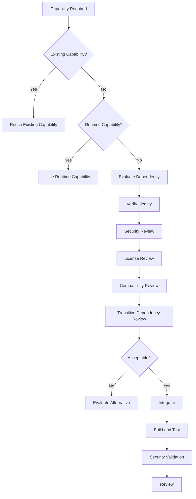
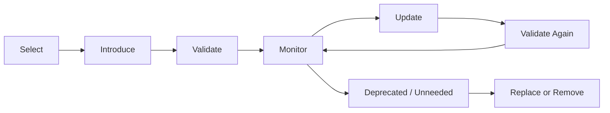
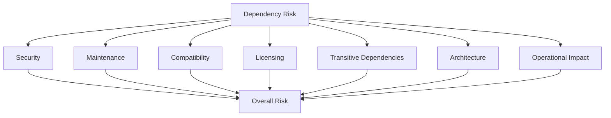
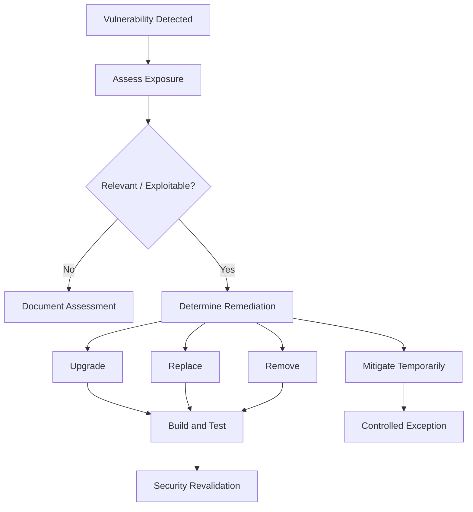

# Dependency Management Skill

## Purpose

This skill defines generic engineering principles and best practices for selecting, introducing, versioning, securing, maintaining, upgrading, and removing software dependencies.

Dependencies can accelerate development by providing proven capabilities.

They also introduce:

- Security risk
- Supply-chain risk
- Compatibility risk
- Maintenance responsibility
- Licensing obligations
- Operational risk
- Transitive dependencies
- Upgrade requirements
- Long-term ownership cost

The objective is not to eliminate dependencies.

The objective is to use dependencies deliberately and responsibly.

This skill is:

- Domain-neutral
- Language-neutral
- Framework-neutral
- Package-manager-neutral
- Vendor-neutral
- Cloud-neutral
- Platform-neutral
- Application-neutral
- Industry-neutral

---

# Objectives

Good dependency management should help:

- Avoid unnecessary dependencies.
- Select trustworthy dependencies.
- Reduce software supply-chain risk.
- Maintain compatible versions.
- Detect known vulnerabilities.
- Control transitive dependencies.
- Support reproducible builds.
- Manage upgrades safely.
- Remove obsolete dependencies.
- Understand licensing implications.
- Prevent dependency sprawl.
- Reduce long-term maintenance cost.

---

# Fundamental Principle

## Every Dependency Has a Cost

A dependency should not be considered free simply because it is easy to install.

Conceptually:

```text
Dependency
    │
    ├── Functionality
    │
    ├── Security Risk
    │
    ├── Compatibility Risk
    │
    ├── Maintenance
    │
    ├── Transitive Dependencies
    │
    ├── Licensing
    │
    └── Upgrade Responsibility
```

Therefore:

> Introduce a dependency only when its value justifies its lifecycle cost and risk.

---

# Dependency Decision Process

Before introducing a dependency, evaluate:

```text
Requirement
    ↓
Is Existing Capability Sufficient?
    ↓
Is Standard Platform Capability Sufficient?
    ↓
Is a New Dependency Necessary?
    ↓
Evaluate Candidates
    ↓
Security / Maintenance / License Review
    ↓
Select
    ↓
Integrate
    ↓
Validate
```

Do not begin with package installation.

Begin with the capability required.

---

# Determine Whether a Dependency Is Necessary

Before adding a dependency ask:

- What capability is required?
- Does the repository already contain this capability?
- Does an existing dependency provide it?
- Does the language or runtime provide it?
- Is implementing the required behavior simple and safe?
- Does the dependency solve substantially more than needed?
- What long-term maintenance does it introduce?

Avoid introducing large dependencies for trivial functionality.

---

# Prefer Existing Capabilities

Before adding a new dependency, inspect:

- Existing libraries
- Existing frameworks
- Shared organizational components
- Standard runtime capabilities
- Repository utilities

Conceptually:

```text
Required Capability
        ↓
Existing Solution?
    /           \
  Yes            No
   ↓              ↓
Reuse        Evaluate New
```

Avoid duplicate libraries solving the same problem without justification.

---

# Standard Library Preference

Where a language or runtime provides a mature, secure, maintainable capability, prefer it when appropriate.

Benefits may include:

- Reduced dependency count
- Reduced supply-chain exposure
- Better compatibility
- Simpler maintenance

However, do not recreate complex functionality poorly merely to avoid a dependency.

---

# Build vs. Adopt Decision

Evaluate:

```text
Implementation Complexity

Security Sensitivity

Standards Compliance

Maintenance Cost

Dependency Risk

Internal Expertise
```

For complex capabilities such as cryptography or protocol handling, established implementations are generally preferable to custom implementations.

---

# Dependency Evaluation

Before adopting a dependency, evaluate relevant characteristics.

These may include:

- Functional fit
- Maintenance status
- Release activity
- Security history
- Vulnerability status
- Compatibility
- Documentation
- Community or vendor support
- Licensing
- Dependency footprint
- Transitive dependencies
- Upgrade stability

Not every factor has equal importance in every system.

---

# Functional Fit

Choose a dependency that solves the actual requirement.

Avoid selecting a large framework when only a small capability is required unless broader adoption is intentional.

Prefer:

```text
Required Capability
       ↓
Appropriate Dependency
```

over:

```text
Small Requirement
       ↓
Large Unnecessary Framework
```

---

# Maintenance Status

Evaluate whether the dependency appears actively maintained.

Potential indicators include:

- Recent releases
- Security fixes
- Issue activity
- Maintainer activity
- Supported runtime versions
- Clear maintenance status

A stable library may not require frequent releases.

Lack of frequent releases alone does not prove abandonment.

---

# Abandoned Dependencies

Dependencies that are no longer maintained can create long-term risk.

If a dependency appears abandoned:

1. Determine whether maintenance is actually required.
2. Review known vulnerabilities.
3. Evaluate compatibility risk.
4. Consider supported alternatives.
5. Plan replacement if risk justifies it.

Do not replace stable dependencies merely because another library is newer.

---

# Dependency Popularity

Popularity can provide useful ecosystem information but should not be the sole selection criterion.

A popular dependency can still have:

- Vulnerabilities
- Poor architecture fit
- Licensing problems
- Excessive scope

Evaluate technical suitability independently.

---

# Dependency Reputation

Where possible, verify that the dependency originates from the expected project, organization, or publisher.

Be cautious of:

- Look-alike package names
- Typosquatting
- Unknown publishers
- Unexpected forks
- Recently created suspicious packages

Package identity should be verified before adoption.

---

# Supply-Chain Security

Dependencies form part of the software supply chain.

Potential risks include:

```text
Compromised Package

Malicious Maintainer

Compromised Build Process

Typosquatting

Dependency Confusion

Compromised Transitive Dependency
```

Dependency management must therefore be treated as a security concern.

---

# Package Source

Use approved and trusted package sources.

Avoid arbitrary package repositories without review.

Organizations may require:

- Approved registries
- Internal mirrors
- Artifact repositories
- Package allowlists

Follow organizational dependency-source policy.

---

# Dependency Confusion

Dependency confusion can occur when package resolution unexpectedly selects a public package instead of an intended internal package.

Mitigations may include:

- Controlled package sources
- Namespace management
- Explicit source configuration
- Internal package governance

Repository configuration should make dependency sources intentional.

---

# Typosquatting

Verify package names carefully.

For example, conceptually:

```text
expected-package
```

versus:

```text
expeted-package
```

A small spelling difference may reference an unrelated or malicious package.

AI agents must not assume a package exists merely because its name appears plausible.

---

# Verify Dependency Existence

Before adding a dependency, verify that:

- The package exists.
- The expected publisher owns it.
- The version exists.
- The package is appropriate for the ecosystem.

AI-generated package names can be hallucinated.

Never introduce an unverified dependency.

---

# Dependency Versioning

Dependency versions should be controlled intentionally.

Version strategy should balance:

```text
Reproducibility
      +
Security Updates
      +
Compatibility
      +
Maintenance
```

Do not rely unintentionally on uncontrolled versions.

---

# Semantic Versioning

Some ecosystems use semantic versioning conceptually:

```text
MAJOR.MINOR.PATCH
```

where:

```text
MAJOR → potentially incompatible changes

MINOR → backward-compatible capability

PATCH → backward-compatible fixes
```

Do not assume every dependency follows semantic versioning correctly.

Review the dependency's actual versioning policy.

---

# Version Ranges

Version ranges can allow compatible updates automatically.

They can also introduce unexpected changes.

Use ranges deliberately according to:

- Ecosystem conventions
- Reproducibility requirements
- Dependency stability
- Lock-file behavior

Avoid overly broad ranges without understanding resolution behavior.

---

# Exact Versions

Exact versions can improve reproducibility.

However, exact pinning without an update process can leave dependencies outdated.

Conceptually:

```text
Version Pinning
      +
Regular Updates
      =
Controlled Dependencies
```

Pinning is not a substitute for maintenance.

---

# Floating Versions

Avoid uncontrolled floating versions in reproducible production builds unless there is a specific justified reason.

Conceptually:

```text
Dependency: latest
```

can produce:

```text
Build Today → Version A

Build Tomorrow → Version B
```

without source-code changes.

This weakens reproducibility.

---

# Lock Files

Where the ecosystem supports lock files, use them according to repository conventions.

Lock files can capture resolved dependency versions.

They improve:

- Reproducibility
- Dependency visibility
- Change review

Lock files should normally be committed where ecosystem guidance recommends it.

---

# Lock-File Integrity

Do not manually edit generated lock files unless the ecosystem explicitly supports it.

Prefer using the appropriate dependency-management tooling.

Review unexpected lock-file changes carefully.

---

# Reproducible Builds

The same source and dependency definition should ideally produce equivalent dependency resolution.

Conceptually:

```text
Source
+
Dependency Manifest
+
Lock Information
        ↓
Predictable Build
```

Uncontrolled dependency resolution can make debugging and rollback difficult.

---

# Direct Dependencies

A direct dependency is intentionally referenced by the project.

Direct dependencies should have:

- Clear purpose
- Known ownership
- Appropriate version strategy

Avoid keeping dependencies that no longer provide value.

---

# Transitive Dependencies

Dependencies often depend on other dependencies.

Conceptually:

```text
Application
    ↓
Library A
    ↓
Library B
    ↓
Library C
```

`Library B` and `Library C` are transitive dependencies.

They still contribute to:

- Security risk
- Licensing
- Compatibility
- Build size
- Maintenance exposure

---

# Transitive Dependency Awareness

Do not evaluate only direct dependencies.

Where tooling permits, inspect the complete dependency graph.

A small direct dependency may introduce a large transitive tree.

---

# Dependency Depth

Deep dependency trees can make:

- Vulnerability remediation harder
- Version conflicts more likely
- Builds larger
- Troubleshooting harder

Do not optimize solely for the smallest possible dependency graph, but avoid unnecessary depth.

---

# Version Conflicts

Different dependencies may require incompatible versions of the same transitive dependency.

When conflicts occur:

1. Understand the dependency graph.
2. Identify version constraints.
3. Check supported versions.
4. Prefer supported compatible resolution.
5. Avoid forced versions without validation.

---

# Forced Dependency Versions

Overriding dependency resolution can solve immediate conflicts but may violate assumptions made by dependent libraries.

If overriding:

- Understand compatibility.
- Test thoroughly.
- Document significant reasoning.

Do not force versions solely to silence package-management errors.

---

# Vulnerability Management

Dependencies should be monitored for known security vulnerabilities.

A generic process is:

```text
Dependency Inventory
        ↓
Vulnerability Detection
        ↓
Risk Assessment
        ↓
Remediation
        ↓
Validation
```

Security findings should be prioritized based on actual risk.

---

# Vulnerability Severity

A vulnerability may be classified using categories such as:

```text
Critical

High

Medium

Low
```

Severity alone may not determine application risk.

Consider:

- Is the vulnerable functionality used?
- Is it externally reachable?
- Is exploitation realistic?
- What data or capability is exposed?
- Is mitigation already present?

---

# Vulnerability Remediation

Preferred remediation order may include:

```text
Upgrade Dependency

Replace Dependency

Remove Dependency

Apply Supported Mitigation

Temporary Controlled Exception
```

Avoid ignoring known vulnerabilities without risk evaluation.

---

# Security Update Priority

Critical exploitable vulnerabilities should generally receive high remediation priority.

Dependency updates should still be validated for compatibility and regression risk.

Security urgency does not eliminate the need for testing.

---

# Vulnerability Exceptions

If a vulnerability cannot immediately be remediated, a controlled exception may be required.

Where organizational processes require it, record:

- Dependency
- Vulnerability
- Exposure
- Risk
- Mitigation
- Owner
- Review or expiration point

Do not silently accept security risk.

---

# Dependency Scanning

Automated dependency scanning can detect:

- Known vulnerabilities
- Outdated versions
- License concerns
- Dependency changes

Use configured organizational tooling where available.

---

# Software Composition Analysis

Software Composition Analysis may provide:

- Dependency inventory
- Vulnerability detection
- License identification
- Transitive dependency analysis

SCA complements source-code security analysis.

It does not replace secure coding.

---

# SBOM

A Software Bill of Materials can provide an inventory of software components.

Conceptually:

```text
Application
    │
    ├── Direct Dependency A
    │     └── Transitive Dependency B
    │
    └── Direct Dependency C
```

SBOMs may support:

- Security response
- Compliance
- Dependency visibility
- Supply-chain management

Generate or maintain them where organizational requirements require it.

---

# Dependency Provenance

Where ecosystem and organizational tooling support it, provenance can help verify:

- Package origin
- Build origin
- Publisher
- Artifact integrity

Use trusted provenance mechanisms for higher-risk environments where appropriate.

---

# Integrity Verification

Where supported, package managers may verify package integrity through:

- Cryptographic hashes
- Signatures
- Checksums
- Trusted metadata

Do not disable integrity verification merely to make dependency installation succeed.

---

# Licensing

Dependencies may introduce legal obligations.

Potential license considerations include:

- Attribution
- Redistribution
- Modification
- Source-disclosure requirements
- Commercial restrictions

Engineering agents should not assume every open-source dependency can be used without review.

---

# License Compatibility

Before introducing a dependency, ensure its license is compatible with organizational policy.

Where license policy is unclear, flag the dependency for review rather than making legal assumptions.

---

# Unknown Licenses

Dependencies with missing, unclear, or unusual licensing should be treated cautiously.

Do not bypass licensing controls simply because the dependency is technically useful.

---

# Dependency Upgrades

Dependencies require lifecycle maintenance.

A dependency should not remain indefinitely at the version originally introduced.

Upgrade processes should consider:

- Security
- Compatibility
- Deprecation
- Runtime support
- New requirements

---

# Upgrade Strategy

A controlled upgrade process may be:

```text
Identify Upgrade
      ↓
Review Release Information
      ↓
Assess Breaking Changes
      ↓
Update
      ↓
Build
      ↓
Test
      ↓
Security Validate
      ↓
Review
```

---

# Small Regular Upgrades

Where practical, regular incremental upgrades are often easier than rare large upgrades.

Conceptually:

```text
Small Upgrade
    ↓
Small Validation Scope
```

versus:

```text
Years of Updates
      ↓
Large Migration
      ↓
High Risk
```

---

# Major Version Upgrades

Major upgrades may introduce:

- Breaking APIs
- Configuration changes
- Behavioral changes
- Removed functionality
- New runtime requirements

Review migration guidance before upgrading.

Do not update major versions blindly.

---

# Patch Updates

Patch updates are often lower risk but still require validation.

Do not assume a patch release can never introduce behavioral changes.

---

# Release Notes

For meaningful dependency upgrades, review available release information.

Look for:

- Breaking changes
- Security fixes
- Deprecated APIs
- Configuration changes
- Runtime requirements

---

# Deprecated Dependencies

A deprecated dependency should be evaluated.

Determine:

- Why it was deprecated.
- Whether support continues.
- Whether security updates continue.
- Recommended replacement.
- Migration complexity.

Deprecation does not always require immediate replacement, but it should not be ignored.

---

# Deprecated APIs

A dependency may remain supported while specific APIs are deprecated.

Avoid introducing new usage of deprecated APIs without justification.

When modifying related code, consider migration where practical.

---

# End-of-Life Dependencies

Dependencies or runtimes beyond supported lifecycle can create:

- Security risk
- Compatibility risk
- Operational risk

Plan migration according to system criticality and organizational support policy.

---

# Automated Dependency Updates

Automated tooling may propose dependency upgrades.

Automation can improve maintenance but proposed changes must still be validated.

Conceptually:

```text
Automated Update
      ↓
Build
      ↓
Tests
      ↓
Security Validation
      ↓
Review
      ↓
Merge
```

Do not automatically merge dependency updates without appropriate validation unless organizational policy explicitly supports it.

---

# Update Grouping

Grouping compatible low-risk updates may reduce maintenance overhead.

However, large grouped updates can make failures harder to diagnose.

Choose grouping based on:

- Risk
- Dependency relationship
- Testing strength
- Repository maturity

---

# Dependency Removal

Dependencies that are no longer required should be removed.

Removal should include:

- Manifest entry
- Lock-file resolution
- Configuration
- Imports
- Integration code
- Documentation where relevant

Run validation after removal.

---

# Unused Dependencies

Unused dependencies create unnecessary:

- Security exposure
- Build overhead
- Maintenance
- Licensing obligations

Detect and remove them where practical.

---

# Duplicate Dependencies

Avoid introducing multiple libraries providing equivalent capabilities without clear reason.

Examples conceptually include multiple:

```text
Logging Libraries

Serialization Libraries

Validation Libraries

HTTP Clients
```

This can increase inconsistency and maintenance burden.

---

# Dependency Consolidation

When multiple dependencies solve the same concern, evaluate whether standardization is appropriate.

Do not consolidate mechanically if different contexts genuinely require different capabilities.

---

# Framework Dependencies

Frameworks often introduce broad dependency surfaces.

Before introducing a framework, evaluate:

- Scope
- Architectural impact
- Lock-in
- Runtime requirements
- Learning cost
- Upgrade lifecycle

Do not introduce a framework to solve a trivial problem.

---

# SDK Dependencies

External service SDKs can simplify integration but may spread provider-specific types throughout the codebase.

Where appropriate:

```text
Application
    ↓
Integration Boundary
    ↓
External SDK
```

Keep SDK coupling near integration boundaries.

Refer to `clean-architecture.md`.

---

# Internal Dependencies

Internal libraries also require governance.

Do not assume an internal package is automatically:

- Stable
- Secure
- Compatible
- Well maintained

Internal dependencies should have clear ownership.

---

# Shared Libraries

Shared libraries can reduce duplication but increase coupling.

Before creating or adopting a shared library ask:

- Is the capability genuinely shared?
- Do consumers require the same behavior?
- Can it evolve compatibly?
- Who owns it?
- How is it versioned?

Avoid creating shared libraries as dumping grounds for common utilities.

---

# Circular Dependencies

Dependency relationships should not form unnecessary cycles.

Conceptually:

```text
Module A → Module B
   ↑         ↓
   └─────────┘
```

Circular dependencies can indicate unclear boundaries.

Refer to `clean-architecture.md`.

---

# Dependency Boundaries

Dependencies should be introduced at appropriate architectural boundaries.

For example:

```text
Core Policy
     ↓
Should Avoid Unnecessary Infrastructure Dependencies
```

while:

```text
Integration Adapter
     ↓
May Legitimately Depend on External SDK
```

Dependency placement matters as much as dependency selection.

---

# Dependency Isolation

Volatile or external dependencies may benefit from isolation.

Conceptually:

```text
Application Logic
       ↓
Stable Internal Contract
       ↑
Dependency Adapter
       ↓
External Library
```

Use this when isolation provides real architectural value.

Do not wrap every dependency mechanically.

---

# Dependency Wrapper

A wrapper may be appropriate when:

- External API is unstable.
- Provider types should not spread.
- Testing requires a meaningful boundary.
- Multiple implementations are required.
- Organization needs a stable internal contract.

Avoid wrappers that simply reproduce every external method one-to-one without value.

---

# Runtime Dependencies

Dependencies required during execution deserve particular attention because failures may directly affect production behavior.

Review:

- Availability
- Compatibility
- Security
- Resource usage
- Failure behavior

---

# Development Dependencies

Development-only dependencies may include:

- Testing tools
- Formatters
- Linters
- Build tools

They still contribute to supply-chain risk and should be maintained.

---

# Build Dependencies

Build-time dependencies can compromise artifacts even if they are not present at runtime.

Treat build tools as part of the software supply chain.

---

# Optional Dependencies

Optional dependencies should have clearly defined behavior.

Determine:

```text
What happens if dependency is absent?

Is capability disabled?

Does startup fail?

Is fallback valid?
```

Do not create ambiguous optional behavior.

---

# Native Dependencies

Native or platform-specific dependencies may introduce:

- Operating-system constraints
- Architecture constraints
- Deployment complexity
- Security maintenance

Validate target environment compatibility.

---

# Dependency Configuration

Dependency behavior should be configured explicitly where necessary.

Avoid relying on undocumented defaults for security-sensitive or reliability-sensitive behavior.

---

# Secrets and Dependencies

Credentials required by dependencies must follow secure secret-management practices.

Never place secrets directly into dependency manifests or committed configuration.

Refer to `secure-coding.md` and `configuration-management.md`.

---

# Dependency Failure

External dependencies can fail.

Integration code should consider:

- Timeouts
- Retries
- Error translation
- Resource exhaustion
- Compatibility failures

Refer to `error-handling.md`.

---

# Dependency Performance

Dependencies can affect:

- Startup time
- Memory
- Artifact size
- CPU usage
- Network behavior

Evaluate performance impact where significant.

Refer to `performance-engineering.md`.

---

# Dependency Testing

When adding or changing a dependency, test behavior affected by that dependency.

Validation may include:

```text
Build

Unit Tests

Integration Tests

Regression Tests

Security Analysis
```

Do not assume successful installation proves correct integration.

---

# Dependency Upgrade Testing

After an upgrade, validate:

- Compilation/build
- Existing behavior
- Integration behavior
- Configuration compatibility
- Error behavior
- Relevant performance characteristics

Testing depth should reflect upgrade risk.

---

# Dependency Rollback

Significant upgrades should have a practical recovery strategy where failure impact is meaningful.

A rollback may involve restoring:

- Dependency version
- Configuration
- Related code changes

Avoid irreversible dependency migrations without understanding recovery options.

---

# Dependency Inventory

Repositories should be able to determine which dependencies they use.

Useful information may include:

```text
Dependency Name

Version

Direct / Transitive

Purpose

License

Vulnerability Status
```

The exact inventory mechanism depends on organizational tooling.

---

# Dependency Ownership

Important dependencies should have identifiable ownership at the repository or platform level.

Ownership means someone is responsible for:

- Updates
- Security response
- Compatibility
- Replacement decisions

Dependencies should not become invisible infrastructure.

---

# Dependency Policy

Organizations may define:

- Approved package sources
- Prohibited licenses
- Required scanning
- Allowed versions
- Update timelines
- Security thresholds

Repository changes should follow applicable organizational policy.

---

# Dependency Review

Dependency changes deserve explicit code-review attention.

A reviewer should understand:

```text
Why is this dependency needed?

Why this dependency?

What does it introduce?

Is it secure?

Is it maintained?

What is the license?

How is it tested?
```

---

# Dependency Changes in Pull Requests

Dependency changes should be visible.

Avoid hiding unrelated dependency upgrades inside large feature changes where practical.

This improves:

- Reviewability
- Troubleshooting
- Rollback

---

# AI-Generated Dependency Risk

AI agents may incorrectly:

- Invent package names
- Recommend outdated packages
- Select deprecated libraries
- Add unnecessary dependencies
- Use incorrect versions
- Introduce insecure packages
- Duplicate existing capabilities

Therefore dependency additions require explicit verification.

---

# AI Dependency Decision Workflow

When an AI Development Agent believes a new dependency is required:

## 1. Identify Capability

Define exactly what capability is missing.

## 2. Inspect Existing Repository

Search for:

- Existing dependency
- Existing utility
- Existing framework capability
- Standard organizational solution

## 3. Check Standard Capabilities

Determine whether the language/runtime already provides the functionality.

## 4. Determine Necessity

Ask whether adding a dependency provides meaningful value.

## 5. Verify Candidate

Verify:

- Package exists
- Correct publisher/project
- Appropriate version
- Maintenance status

## 6. Evaluate Risk

Review:

- Security
- Transitive dependencies
- Compatibility
- License
- Scope

## 7. Integrate Minimally

Use the dependency only where required.

## 8. Validate

Run:

- Build
- Relevant tests
- Dependency/security analysis

## 9. Review Changes

Inspect manifest and lock-file changes.

## 10. Report

Document significant dependency additions or changes.

---

# AI Development Agent Rules

When using this skill, the agent should:

- ALWAYS inspect existing dependencies before adding another.
- ALWAYS determine whether the standard platform already provides the capability.
- ALWAYS verify that a proposed dependency actually exists.
- ALWAYS verify the correct dependency identity.
- ALWAYS use versions consistent with repository policy.
- ALWAYS review relevant manifest changes.
- ALWAYS review lock-file changes.
- ALWAYS consider transitive dependencies.
- ALWAYS consider security implications.
- ALWAYS consider licensing requirements.
- ALWAYS run relevant validation after dependency changes.
- ALWAYS remove dependencies that become unused because of the agent's changes.
- ALWAYS report significant dependency additions or upgrades.

The agent should:

- NEVER invent package names.
- NEVER invent dependency versions.
- NEVER add a dependency solely because implementation is easier.
- NEVER add multiple libraries solving the same problem without justification.
- NEVER use uncontrolled `latest` versions in reproducible builds without explicit policy.
- NEVER disable integrity verification to install a dependency.
- NEVER ignore known critical vulnerabilities without risk handling.
- NEVER bypass approved package sources.
- NEVER assume open source means unrestricted use.
- NEVER introduce deprecated APIs without justification.
- NEVER upgrade major versions blindly.
- NEVER manually manipulate generated dependency metadata without ecosystem justification.
- NEVER claim a dependency upgrade is safe without validation.
- NEVER hide dependency changes inside unrelated implementation where avoidable.

---

# Dependency Decision Framework

Before adding a dependency ask:

## 1. What Capability Is Required?

Define the actual need.

## 2. Does It Already Exist?

Check repository and organizational capabilities.

## 3. Can the Runtime Provide It?

Prefer standard capabilities where appropriate.

## 4. Is External Dependency Better Than Internal Implementation?

Compare complexity, security, and maintenance.

## 5. Is the Dependency Trustworthy?

Evaluate source, publisher, maintenance, and reputation.

## 6. Is It Secure?

Review known vulnerabilities and supply-chain risk.

## 7. What Does It Bring Transitively?

Inspect the dependency graph.

## 8. Is the License Acceptable?

Follow organizational policy.

## 9. Is the Version Strategy Controlled?

Understand version and lock behavior.

## 10. Is the Dependency Architecturally Appropriate?

Place it at the correct boundary.

## 11. Can It Be Tested?

Validate its integration.

## 12. Who Maintains It?

Understand lifecycle responsibility.

---

# New Dependency Flow



---

# Dependency Lifecycle



---

# Dependency Risk Model



---

# Vulnerability Response Flow



---

# Best Practices

- Treat dependencies as lifecycle commitments.
- Prefer existing capabilities where appropriate.
- Prefer standard runtime capabilities for simple needs.
- Evaluate build versus adopt deliberately.
- Verify package identity.
- Use trusted package sources.
- Control dependency versions.
- Maintain reproducible dependency resolution.
- Commit lock files according to ecosystem standards.
- Understand transitive dependencies.
- Scan dependencies for vulnerabilities.
- Assess vulnerability exposure rather than severity alone.
- Maintain software composition visibility.
- Generate SBOMs where required.
- Respect licensing requirements.
- Upgrade dependencies regularly.
- Review major upgrades carefully.
- Avoid deprecated APIs for new development.
- Remove unused dependencies.
- Avoid duplicate dependency capabilities.
- Keep external SDKs near integration boundaries.
- Treat internal dependencies as governed dependencies.
- Validate dependency changes through tests.
- Review dependency changes explicitly.
- Maintain dependency ownership.
- Treat AI-proposed dependencies as unverified until confirmed.

---

# Common Mistakes

Avoid:

- Adding a library before checking existing capabilities.
- Installing large frameworks for trivial functionality.
- Selecting dependencies solely because they are popular.
- Assuming frequently released means better maintained.
- Assuming infrequently released means abandoned.
- Trusting package names without verification.
- Ignoring typosquatting risk.
- Using untrusted package sources.
- Allowing uncontrolled floating versions.
- Pinning dependencies permanently without update processes.
- Ignoring lock-file changes.
- Ignoring transitive dependencies.
- Forcing dependency versions without compatibility testing.
- Ignoring known vulnerabilities.
- Treating vulnerability severity as the only risk factor.
- Suppressing dependency findings without assessment.
- Ignoring licensing.
- Performing major upgrades blindly.
- Continuing new development on deprecated APIs unnecessarily.
- Keeping unused dependencies.
- Keeping multiple equivalent libraries without justification.
- Wrapping every external library mechanically.
- Allowing SDK-specific types to spread unnecessarily across core logic.
- Assuming internal dependencies are automatically safe.
- Automatically merging dependency updates without appropriate validation.
- Assuming successful installation means successful integration.
- Allowing AI agents to invent packages or versions.

---

# Validation Checklist

Before considering a dependency change complete, verify:

- [ ] Required capability is clearly identified.
- [ ] Existing repository capabilities were checked.
- [ ] Existing dependencies were checked.
- [ ] Standard runtime capabilities were considered.
- [ ] A new dependency is actually justified.
- [ ] Dependency identity was verified.
- [ ] Expected publisher or project was verified.
- [ ] Selected version exists.
- [ ] Version strategy follows repository conventions.
- [ ] Dependency source is approved.
- [ ] Maintenance status was considered.
- [ ] Known vulnerabilities were reviewed where tooling permits.
- [ ] Supply-chain risk was considered.
- [ ] Transitive dependencies were considered.
- [ ] Dependency footprint is reasonable.
- [ ] License requirements were considered.
- [ ] Compatibility was reviewed.
- [ ] Architectural placement is appropriate.
- [ ] Provider-specific types do not spread unnecessarily.
- [ ] Manifest changes are correct.
- [ ] Lock-file changes are expected.
- [ ] Integrity mechanisms remain enabled.
- [ ] Build succeeds.
- [ ] Relevant unit tests pass.
- [ ] Relevant integration tests pass.
- [ ] Relevant regression tests pass.
- [ ] Dependency/security scanning passes where configured.
- [ ] No unnecessary duplicate dependency was introduced.
- [ ] No newly unused dependency remains.
- [ ] Deprecated APIs were avoided where practical.
- [ ] Major upgrade migration requirements were reviewed where relevant.
- [ ] Dependency failure behavior was considered.
- [ ] Rollback/recovery was considered for significant upgrades.
- [ ] Significant dependency changes are visible to reviewers.
- [ ] Validation limitations are reported.
- [ ] AI-proposed packages and versions were independently verified.

---

# Relationship With Other Engineering Skills

`dependency-management.md` defines how external and internal software dependencies should be governed throughout their lifecycle.

Use it together with:

### `coding-standards.md`

Defines baseline engineering expectations for dependency usage.

### `clean-architecture.md`

Defines where dependencies should be placed and how volatile implementations should be isolated.

### `clean-code.md`

Defines how dependency usage should remain clear and maintainable.

### `code-quality.md`

Defines dependency-related quality gates and technical-debt controls.

### `error-handling.md`

Defines how dependency failures should be classified, translated, retried, and exposed.

### `testing-strategy.md`

Defines validation required after introducing or upgrading dependencies.

### `configuration-management.md`

Defines configuration required by external dependencies.

### `secure-coding.md`

Defines secure use of dependencies, credentials, and external capabilities.

### `performance-engineering.md`

Defines how dependency performance impact should be measured.

### `concurrency.md`

Defines safe usage of dependencies in concurrent execution.

### `code-review.md`

Defines review expectations for dependency additions and changes.

Dependency management also interacts with architecture skills:

```text
architecture-principles.md

architecture-patterns.md

system-design.md

integration-patterns.md

security-architecture.md

resilience.md
```

Conceptually:

```text
                 Required Capability
                         │
                         ↓
                Dependency Decision
                         │
        ┌────────────────┼────────────────┐
        ↓                ↓                ↓
    Necessity         Security         License
        │                │                │
        └────────────────┼────────────────┘
                         ↓
                   Dependency
                         │
              ┌──────────┼──────────┐
              ↓          ↓          ↓
           Version    Validate    Monitor
              │          │          │
              └──────────┼──────────┘
                         ↓
                      Update
                         │
                         ↓
                 Replace / Remove
```

---

# References

Dependency-management practices may draw, where applicable, from recognized software-engineering and software-supply-chain concepts such as:

- Semantic Versioning
- Reproducible Builds
- Dependency Locking
- Software Composition Analysis
- Software Bill of Materials
- Software Supply Chain Security
- Dependency Provenance
- Package Integrity Verification
- Vulnerability Management
- Dependency Confusion Prevention
- Typosquatting Prevention
- Least Dependency Principle
- Secure Software Development
- Automated Dependency Updates
- Open-Source License Governance
- Relevant organizational engineering and security standards

These concepts should be treated as reusable engineering guidance rather than mandatory ecosystem-specific implementation patterns.

The appropriate dependency-management strategy should ultimately be determined by system criticality, architecture, security risk, supply-chain requirements, ecosystem conventions, organizational policy, licensing requirements, compatibility requirements, maintainability, repository maturity, and operational risk.