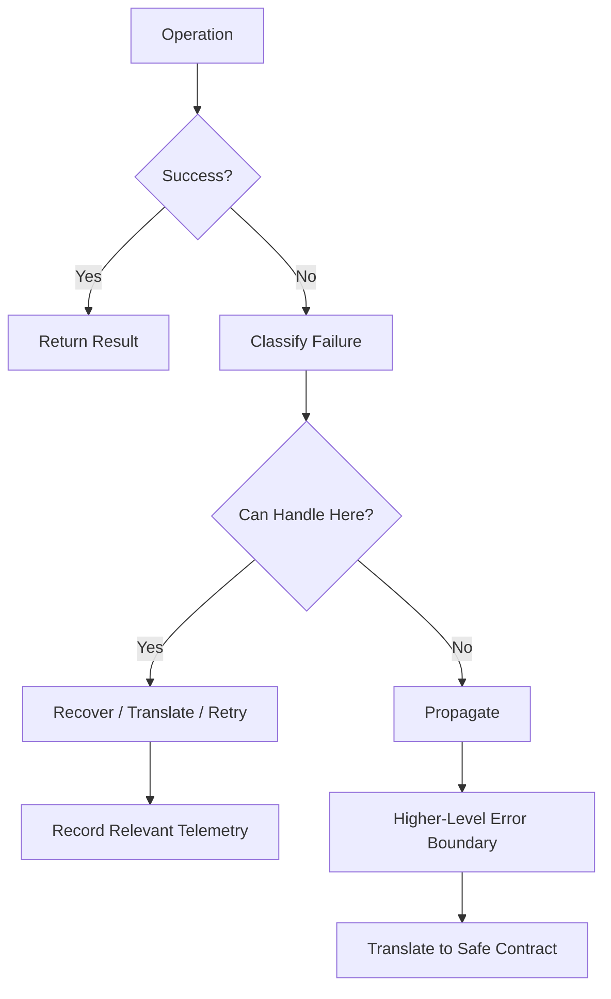
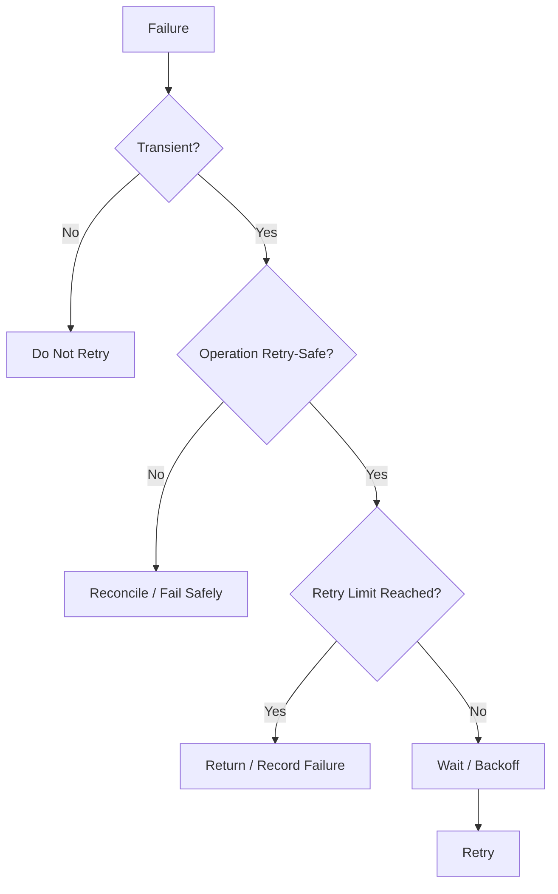
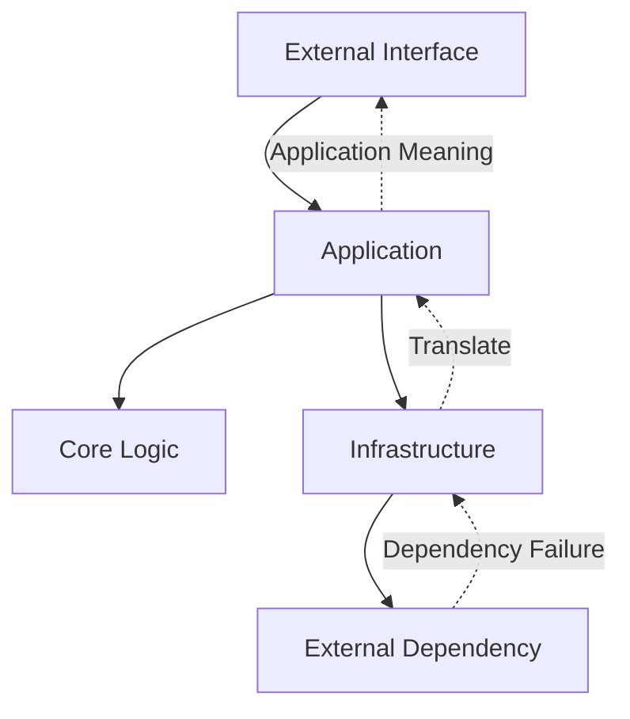
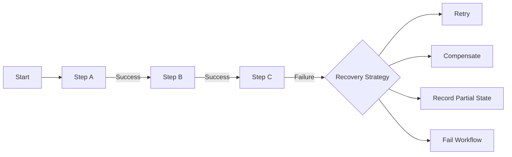

# Error Handling Skill

## Purpose

This skill defines generic engineering principles, standards, and best practices for handling failures safely, consistently, predictably, and observably.

Errors are part of normal software-system behavior.

Systems can fail because of:

- Invalid input
- Invalid state
- Business-rule violations
- Missing resources
- Permission failures
- Dependency failures
- Timeouts
- Concurrency conflicts
- Resource exhaustion
- Configuration problems
- Infrastructure failures
- Programming defects
- Unexpected conditions

The objective is not to prevent every possible failure.

The objective is to ensure failures are:

- Detected
- Classified
- Contained
- Communicated
- Logged appropriately
- Recoverable where possible
- Diagnosable
- Safe for consumers
- Consistent with system contracts

This skill is:

- Domain-neutral
- Language-neutral
- Framework-neutral
- Protocol-neutral
- Vendor-neutral
- Cloud-neutral
- Platform-neutral
- Application-neutral
- Industry-neutral

---

# Objectives

Good error handling should help:

- Preserve correctness.
- Prevent silent failures.
- Prevent misleading success.
- Provide predictable failure behavior.
- Preserve useful diagnostic context.
- Protect sensitive information.
- Support recovery where appropriate.
- Avoid unnecessary cascading failures.
- Support observability.
- Improve debugging.
- Support reliable integrations.
- Maintain architectural boundaries.

---

# Fundamental Principle

## Failure Is Part of the Contract

Successful behavior is only part of a software contract.

Consumers also need to understand:

```text
What can fail?

Why can it fail?

How is failure represented?

Can the operation be retried?

What state exists after failure?
```

Failure behavior should therefore be designed rather than added as an afterthought.

---

# Never Hide Failure

A system should not silently convert meaningful failure into apparent success.

Avoid:

```text
Operation Failed
      ↓
Ignore Error
      ↓
Return Success
```

unless the failure is explicitly non-critical and the behavior is intentional.

Prefer:

```text
Operation Failed
      ↓
Classify
      ↓
Handle / Propagate / Recover
```

---

# Expected vs. Unexpected Failures

Distinguish between failures that are expected as part of normal system behavior and failures that indicate unexpected defects or environmental problems.

## Expected Failures

Examples may include:

- Invalid input
- Resource not found
- Business-rule violation
- Duplicate operation
- Concurrency conflict
- Permission denied

## Unexpected Failures

Examples may include:

- Programming defects
- Broken invariants
- Unexpected null values
- Corrupted state
- Unhandled dependency behavior
- Impossible state transitions

These categories should generally be handled differently.

---

# Error Classification

Errors should be classified according to meaning rather than implementation technology.

A useful generic model may include:

```text
Validation Failure

Business Rule Failure

Authentication Failure

Authorization Failure

Resource Failure

Conflict

Dependency Failure

Timeout

Resource Exhaustion

Configuration Failure

Infrastructure Failure

Internal Failure
```

Not every system needs every category.

Use classifications that help consumers and operators respond appropriately.

---

# Validation Errors

Validation failures occur when input does not satisfy required structure or constraints.

Examples include:

- Missing required value
- Invalid format
- Invalid range
- Invalid combination of values

Validation errors should usually be detected as close as practical to the relevant boundary.

---

# Business Rule Failures

A request may be structurally valid but violate system rules.

Conceptually:

```text
Valid Input
    ↓
Business Rule
    ↓
Operation Not Allowed
```

Business-rule failures should remain distinguishable from programming defects.

---

# Authentication Failures

Authentication failures indicate that caller identity cannot be established appropriately.

Do not expose unnecessary details about why authentication failed when doing so creates security risk.

---

# Authorization Failures

Authorization failures occur when an authenticated identity is not allowed to perform an operation.

Authentication and authorization are different concerns.

```text
Authentication
      ↓
Who are you?

Authorization
      ↓
Are you allowed to do this?
```

Do not treat them as the same error category.

---

# Resource Not Found

A requested resource may not exist or may not be accessible to the consumer.

The exact external representation should consider security and contract requirements.

Do not expose resource existence when doing so would violate security boundaries.

---

# Conflict Errors

A conflict occurs when an operation cannot proceed because of current system state.

Examples may include:

- Duplicate creation
- Version mismatch
- Invalid state transition
- Concurrent update

Conflict errors should provide enough information for appropriate consumer behavior where safe.

---

# Dependency Failures

A dependency failure occurs when another required component or external system cannot successfully perform its responsibility.

Examples include:

```text
Data Store Failure

External Service Failure

Messaging Failure

File-System Failure

Infrastructure Failure
```

Avoid exposing dependency-specific implementation details directly to consumers unless they are part of the intended contract.

---

# Timeout Failures

A timeout means an operation did not complete within an acceptable time.

A timeout does not always mean the operation failed.

For example:

```text
Caller
   ↓
Request
   ↓
Dependency Processes Request
   ↓
Caller Times Out
```

The dependency may still have completed the operation.

This distinction is important when deciding whether retry is safe.

---

# Resource Exhaustion

Systems may fail because required capacity is unavailable.

Examples include:

- Memory
- Connections
- Threads
- Storage
- Queue capacity
- Request limits

Resource exhaustion should not automatically trigger unlimited retries.

---

# Configuration Failures

Invalid required configuration should generally fail clearly.

Examples include:

- Missing required setting
- Invalid endpoint
- Invalid format
- Incompatible configuration
- Missing required dependency configuration

Prefer detecting configuration problems early.

---

# Internal Failures

Unexpected internal failures should be treated as defects or unexpected runtime conditions.

Consumers should receive a safe external representation.

Operators should retain sufficient diagnostic context.

---

# Error Representation

Errors should communicate useful information appropriate to the consumer.

A generic error representation may include:

```text
Error Category

Stable Error Code

Safe Message

Relevant Details

Correlation Identifier
```

Not every field is required for every interface.

---

# Stable Error Codes

Where consumers need programmatic error handling, stable error codes can be useful.

Prefer:

```text
ORDER_ALREADY_PROCESSED
```

over requiring consumers to parse:

```text
"The order has already been processed."
```

Human-readable messages may change.

Machine-readable contracts should remain stable where required.

---

# Error Messages

Error messages should be:

- Clear
- Relevant
- Actionable where possible
- Safe

Avoid generic messages such as:

```text
Something went wrong
```

when more useful information can safely be provided.

---

# Do Not Expose Internal Details

External error responses should not expose unnecessary:

- Stack traces
- File paths
- Database queries
- Credentials
- Tokens
- Connection strings
- Internal hostnames
- Infrastructure topology
- Framework internals

Detailed diagnostics belong in controlled operational telemetry.

---

# Error Context

Internal error information should preserve useful context.

Potential context may include:

- Operation
- Component
- Dependency
- Resource identifier
- Correlation identifier
- Relevant state

Do not include sensitive information unnecessarily.

---

# Error Propagation

Errors should propagate until they reach a boundary capable of meaningfully handling them.

Avoid:

```text
Function A
   ↓
Failure
   ↓
Function B catches it
   ↓
Does nothing useful
```

Catching an error without meaningful handling often hides the problem.

---

# Handle or Propagate

When encountering an error, a component should generally do one of the following:

```text
Handle

Recover

Translate

Add Context

Propagate
```

Do not catch errors merely because a catch mechanism exists.

---

# Error Translation

Different architectural boundaries may require different error representations.

Conceptually:

```text
Infrastructure Error
        ↓
Application Meaning
        ↓
External Contract
```

For example, a storage-specific "record missing" error may become an application-level "resource not found" outcome.

This prevents infrastructure details from leaking across boundaries.

---

# Preserve Root Cause

When translating or wrapping an error, preserve enough root-cause information for diagnosis.

Avoid:

```text
Original Failure
      ↓
Replace Completely
      ↓
Diagnostic Information Lost
```

Use language-supported error chaining or equivalent mechanisms where available.

---

# Exception Handling

Where the language uses exceptions, exceptions should represent exceptional or failure conditions according to language conventions.

Do not use exceptions mechanically for every non-success result.

Do not use exceptions as ordinary branching when clearer alternatives exist.

---

# Catch Scope

Catch errors at the narrowest meaningful boundary.

Avoid overly broad blocks conceptually like:

```text
try
    entire application
catch everything
    ignore
```

Broad catches may be appropriate at top-level safety boundaries, but they should not hide failures.

---

# Catch Specific Failures

Where practical, catch failures that can be handled meaningfully.

Prefer conceptually:

```text
catch expected dependency timeout
```

over:

```text
catch every possible error
```

when only timeout behavior can actually be handled.

---

# Broad Exception Handling

Broad error handling may be appropriate at:

- Process boundaries
- Request boundaries
- Worker boundaries
- Job boundaries

Its purpose should generally be to:

- Prevent uncontrolled termination where appropriate
- Record diagnostics
- Translate to safe failure behavior

It should not pretend the operation succeeded.

---

# Do Not Swallow Exceptions

Avoid:

```text
try
    operation
catch
    // nothing
```

unless intentionally ignoring the failure is explicitly safe and documented.

Silent exception handling makes defects difficult to detect.

---

# Empty Catch Blocks

Empty catch blocks should be treated as suspicious.

If failure can safely be ignored, make that reasoning explicit.

---

# Rethrowing

When rethrowing an error, preserve the original diagnostic context according to language capabilities.

Do not accidentally reset or destroy the original failure information.

---

# Custom Error Types

Custom error types may be useful when they communicate meaningful application semantics.

Examples conceptually include:

```text
ValidationFailure

BusinessRuleViolation

ConcurrencyConflict
```

Do not create a custom error class for every possible failure.

---

# Error Boundaries

An error boundary is a point where failure is:

- Caught
- Classified
- Logged
- Translated
- Recovered from
- Returned safely

Common conceptual boundaries include:

```text
External Interface Boundary

Application Boundary

Integration Boundary

Background Processing Boundary

Process Boundary
```

Error handling should align with architecture.

---

# Boundary Responsibilities

A boundary should understand:

```text
Which failures can cross this boundary?

Which failures should be translated?

Which failures should be logged?

Which failures can be retried?

Which failures require termination?
```

Avoid inconsistent handling across similar boundaries.

---

# Input Boundary

Invalid external input should generally be rejected before it reaches deeper system behavior.

Conceptually:

```text
External Input
      ↓
Validate
      ↓
Valid?
 /          \
No           Yes
↓             ↓
Error      Continue
```

---

# Integration Boundary

Failures from external dependencies should be translated into meaningful internal semantics where appropriate.

Avoid allowing provider-specific failure models to spread throughout the codebase.

---

# Persistence Boundary

Storage-specific failures may require classification such as:

- Not found
- Conflict
- Temporary unavailable
- Constraint violation
- Permanent failure

Do not expose raw storage implementation errors unnecessarily.

---

# Background Processing Boundary

Background work must not silently disappear when processing fails.

A worker should define:

- Retry behavior
- Failure recording
- Poison/dead-letter handling where relevant
- Alerting requirements
- Idempotency expectations

---

# Partial Failure

Distributed or multi-step operations can partially succeed.

Example:

```text
Step A ✓

Step B ✓

Step C ✗
```

The system must determine what happens to completed steps.

Possible strategies include:

- Retry remaining work
- Compensate
- Record partial state
- Resume later
- Fail the overall workflow

Do not assume automatic rollback exists across every boundary.

---

# Atomicity

Where operations require all-or-nothing behavior within a transactional boundary, use appropriate transaction mechanisms.

Do not assume a transaction can safely span independent systems.

---

# Compensation

When distributed work cannot be atomically rolled back, compensating actions may be required.

Conceptually:

```text
Action A ✓
Action B ✓
Action C ✗
     ↓
Compensate B
     ↓
Compensate A
```

Compensation should reflect business semantics.

It is not simply technical rollback.

---

# Retry

Retry is appropriate only when failure may be temporary and repeating the operation is safe.

Before retrying ask:

```text
Is the failure transient?

Is the operation retry-safe?

Could retry create duplicates?

What delay should be used?

How many attempts are appropriate?
```

---

# Never Retry Everything

Do not retry:

- Invalid input
- Authorization failures
- Permanent business-rule failures
- Known permanent configuration errors

Retrying permanent failures wastes resources and can amplify incidents.

---

# Retry Limits

Retries must be bounded.

Avoid:

```text
while failure
    retry forever
```

Unlimited retries can create:

- Resource exhaustion
- Dependency overload
- Cascading failure
- Queue backlog

---

# Retry Delay

Immediate repeated retries may worsen dependency failure.

Where appropriate, use delayed retry.

Conceptually:

```text
Attempt
  ↓
Failure
  ↓
Wait
  ↓
Retry
```

---

# Backoff

Increasing delay between retries can reduce pressure on a failing dependency.

Conceptually:

```text
Attempt 1
   ↓
Short Delay
   ↓
Attempt 2
   ↓
Longer Delay
   ↓
Attempt 3
```

Use appropriate resilience mechanisms rather than implementing arbitrary retry logic repeatedly.

---

# Jitter

When many clients retry simultaneously, synchronized retries can create another traffic spike.

Randomized delay may reduce synchronization.

Use where scale and failure patterns justify it.

---

# Idempotency

Retry safety often depends on idempotency.

An idempotent operation can be repeated without producing unintended additional effects.

Conceptually:

```text
Request
   ↓
Failure Unknown
   ↓
Retry Same Request
   ↓
No Duplicate Effect
```

Refer to architecture `api-principles.md` and `resilience.md`.

---

# Ambiguous Outcomes

Some failures leave the caller uncertain whether an operation completed.

Example:

```text
Submit Operation
       ↓
Server Processes
       ↓
Network Fails
       ↓
Caller Receives No Response
```

The caller cannot safely assume the operation failed.

Design operations with:

- Idempotency
- Operation identifiers
- Status lookup
- Reconciliation

where ambiguity matters.

---

# Timeouts

Remote operations should generally have bounded waiting behavior.

Timeouts should reflect:

- Expected latency
- Consumer deadline
- Dependency characteristics
- Retry strategy
- Overall workflow budget

Avoid infinite waits.

---

# Timeout Budget

Nested operations should consider the overall operation deadline.

Conceptually:

```text
Total Request Budget
        │
        ├── Dependency A
        ├── Dependency B
        └── Processing
```

Individual dependency timeouts should not accidentally exceed the caller's total deadline.

---

# Cancellation

Where supported, cancellation should propagate appropriately.

If the caller no longer requires work, downstream processing may be able to stop.

However, cancellation behavior must consider:

- Data consistency
- Partial completion
- External side effects

---

# Circuit Breaking

Repeated calls to a failing dependency can make failure worse.

A circuit-breaker pattern may temporarily stop calls when failure exceeds an acceptable threshold.

Conceptually:

```text
Calls
  ↓
Repeated Failures
  ↓
Circuit Opens
  ↓
Calls Temporarily Blocked
  ↓
Recovery Probe
```

Use only where appropriate to dependency behavior.

Refer to architecture `resilience.md`.

---

# Graceful Degradation

If a non-critical capability fails, the system may continue with reduced functionality where requirements permit.

Example:

```text
Primary Capability ✓

Optional Recommendation Service ✗

System Continues Without Recommendations
```

Do not degrade when doing so would violate correctness, security, or critical business behavior.

---

# Fallbacks

Fallbacks should provide genuinely valid alternative behavior.

Avoid fallbacks that:

- Hide data corruption
- Return misleading information
- Bypass security
- Use stale data without clear policy

Fallback behavior should be deliberate.

---

# Fail Fast

When continuing cannot produce a valid result, fail as early as practical.

Examples include:

- Invalid mandatory configuration
- Broken invariant
- Unsupported required state

Fail-fast behavior prevents invalid state from spreading.

---

# Fail Safe

Security-sensitive failures should default toward safe behavior.

For example:

```text
Authorization Check Fails
        ↓
Deny
```

not:

```text
Authorization Check Fails
        ↓
Allow
```

---

# Resource Cleanup

Failure paths must release resources appropriately.

Examples include:

- Files
- Locks
- Connections
- Streams
- Transactions
- Temporary resources

Use language-supported deterministic cleanup mechanisms where available.

---

# Transactions

If a failure occurs within a transaction, the system should preserve intended consistency.

Ensure transaction lifecycle is explicit.

Avoid leaving partially committed state unintentionally.

---

# Logging Errors

Errors should be logged at the boundary where sufficient context exists to diagnose them.

Do not log the same error repeatedly at every layer.

Repeated logging can create noise and duplicate incident signals.

---

# Log Once Where Practical

A useful principle is:

```text
Error Occurs
    ↓
Context Added
    ↓
Meaningful Boundary
    ↓
Log
```

rather than:

```text
Layer A Logs
Layer B Logs
Layer C Logs
Layer D Logs
```

for the same failure.

---

# Logging Levels

Logging severity should reflect operational significance.

Conceptually:

```text
Debug

Information

Warning

Error

Critical
```

Exact terminology depends on the logging system.

Not every expected business failure should be logged as a system error.

---

# Expected Failures and Logs

Expected failures such as invalid user input may not require error-level logs.

Otherwise normal consumer behavior can generate false operational incidents.

Choose severity according to operational meaning.

---

# Unexpected Failures and Logs

Unexpected internal failures generally require sufficient diagnostics.

Logs should support determining:

- What failed?
- Where?
- During which operation?
- Which dependencies were involved?
- Which correlation identifier applies?

---

# Sensitive Logging

Never log unnecessary:

- Passwords
- Access tokens
- API keys
- Private keys
- Authentication credentials
- Sensitive personal information
- Full payment information
- Secrets

Apply organizational data-classification rules.

---

# Correlation

Distributed failures should be traceable across relevant boundaries.

Use correlation identifiers or tracing mechanisms where appropriate.

Conceptually:

```text
Request
   ↓
Component A
   ↓
Component B
   ↓
Component C
```

The same operation should be diagnosable across components.

---

# Error Metrics

Operational metrics may include:

- Failure rate
- Error category
- Timeout rate
- Retry rate
- Dependency failure rate
- Unhandled error rate
- Dead-letter rate

Metrics should support actionable operational questions.

---

# Alerting

Not every individual error should generate an alert.

Alert on conditions requiring operational attention.

Examples may include:

- Sustained failure-rate increase
- Critical dependency unavailable
- Repeated job failure
- Resource exhaustion
- Data integrity failure

Avoid alert fatigue.

---

# Error Observability

A diagnosable failure should ideally answer:

```text
What failed?

When?

Where?

For which operation?

What was the error category?

What dependency was involved?

Was it retried?

Did it recover?
```

Refer to architecture `observability.md`.

---

# User-Facing Errors

Errors shown to end users should be:

- Understandable
- Safe
- Actionable where appropriate

Avoid exposing technical implementation details.

Prefer:

```text
The requested operation could not be completed.
Please retry.
```

over:

```text
Database connection pool exhausted at host...
```

when technical details provide no user value.

---

# Developer-Facing Errors

Developer-facing errors may include more technical context.

They should still avoid exposing secrets.

Development diagnostics and production consumer errors serve different audiences.

---

# External Consumer Errors

External interfaces should provide stable error semantics.

Consumers should not need to parse arbitrary internal messages.

Refer to architecture `api-principles.md`.

---

# Error Compatibility

Changing error behavior can be a breaking contract change.

Examples include:

- Changing error codes
- Changing retry semantics
- Changing failure categories
- Returning success where failure was previously returned
- Removing expected error information

Consider compatibility when evolving public contracts.

---

# Concurrency Errors

Concurrent operations may produce expected conflicts.

Examples include:

- Optimistic concurrency failure
- Lock contention
- Duplicate operation
- Version mismatch

These should not automatically be treated as unexpected internal defects.

Refer to `concurrency.md`.

---

# Asynchronous Errors

Asynchronous work requires explicit failure ownership.

Avoid fire-and-forget work where failures become unobservable.

Define:

- Who observes failure?
- Who retries?
- Where is failed work recorded?
- How is permanent failure surfaced?

---

# Message Processing Failures

Message consumers should consider:

- Retry
- Duplicate delivery
- Poison messages
- Ordering
- Idempotency
- Dead-letter handling

Do not assume a message is delivered exactly once.

Refer to architecture `integration-patterns.md`.

---

# Batch Processing Errors

Batch operations should define whether failure behavior is:

```text
Fail Entire Batch

Skip Failed Item

Record Failed Item

Retry Failed Items

Continue with Partial Success
```

The choice should reflect business semantics.

---

# Bulk Operations

Bulk operations should clearly communicate partial success where possible.

Conceptually:

```text
10 Operations

8 Successful

2 Failed
```

Avoid representing partial completion as unconditional success.

---

# Data Integrity Errors

Failures that threaten data integrity should receive high priority.

Examples include:

- Invalid state persisted
- Broken invariants
- Partial write
- Duplicate unintended processing
- Corruption

Do not hide or automatically retry integrity failures without understanding the cause.

---

# Startup Errors

Critical initialization failures should generally prevent the component from reporting itself healthy.

Examples include:

- Invalid required configuration
- Missing mandatory dependency
- Invalid schema expectations
- Required initialization failure

Do not start in an undefined state.

---

# Shutdown Errors

Shutdown behavior should consider:

- In-flight operations
- Resource cleanup
- Message acknowledgement
- Data flushing
- Lock release

Errors during shutdown should be observable where they affect correctness.

---

# Health Checks

Health reporting should distinguish meaningful operational states.

Conceptually:

```text
Healthy

Degraded

Unhealthy
```

Do not report healthy simply because the process is running.

---

# Error Handling and Security

Failure behavior must not weaken security.

Avoid:

- Authorization bypass during dependency failure
- Detailed authentication diagnostics to untrusted consumers
- Sensitive data in logs
- Stack traces exposed externally
- Fallbacks that disable security checks

Refer to `secure-coding.md`.

---

# Error Handling and Performance

Error handling can affect performance.

Examples include:

- Retry storms
- Excessive logging
- Expensive stack generation
- Large diagnostic payloads

Performance concerns must not justify hiding meaningful failures.

---

# Error Handling and Architecture

Error handling should respect architectural boundaries.

Conceptually:

```text
Infrastructure Failure
        ↓
Infrastructure Boundary
        ↓
Application Failure
        ↓
Application Boundary
        ↓
External Failure Contract
```

Do not allow low-level implementation errors to define high-level system contracts unintentionally.

---

# Error Handling and Testing

Failure behavior must be tested.

Important tests may include:

- Invalid input
- Missing resource
- Authorization failure
- Dependency failure
- Timeout
- Retry
- Conflict
- Partial failure
- Unexpected error
- Resource cleanup

Refer to `testing-strategy.md`.

---

# Failure Injection

Where system criticality justifies it, deliberately introduce controlled failures during testing.

Examples include:

```text
Dependency Unavailable

Timeout

Connection Failure

Resource Exhaustion

Message Failure
```

This validates whether error-handling behavior actually works.

---

# Error Handling Decision Framework

When handling a failure, ask:

## 1. What Failed?

Identify the failed operation or dependency.

## 2. Why Did It Fail?

Classify the failure.

## 3. Is It Expected?

Determine whether this is normal business/system behavior or an unexpected defect.

## 4. Can It Be Handled Here?

If not, propagate it.

## 5. Is Recovery Possible?

Determine whether fallback, retry, compensation, or continuation is valid.

## 6. Is Retry Safe?

Consider idempotency and ambiguous outcomes.

## 7. What State Exists After Failure?

Determine whether partial work occurred.

## 8. What Should the Consumer See?

Translate into a safe and meaningful contract.

## 9. What Should Operators See?

Preserve sufficient diagnostic context.

## 10. Should It Be Logged?

Avoid both missing diagnostics and duplicate logging.

## 11. Should It Trigger Operational Action?

Determine whether metrics or alerts are appropriate.

## 12. Is Security Preserved?

Ensure failure handling does not weaken controls.

---

# Generic Error Flow



---

# Retry Decision Flow



---

# Error Boundary Model



---

# Partial Failure Model



---

# Best Practices

- Treat failure behavior as part of the contract.
- Distinguish expected and unexpected failures.
- Classify errors meaningfully.
- Validate input at appropriate boundaries.
- Preserve useful diagnostic context.
- Translate errors across architectural boundaries.
- Avoid leaking implementation details.
- Catch errors only where meaningful handling can occur.
- Never silently swallow important failures.
- Preserve root causes.
- Use stable machine-readable error codes where needed.
- Keep external error messages safe.
- Bound retries.
- Retry only appropriate transient failures.
- Consider idempotency before retrying.
- Use backoff where appropriate.
- Consider ambiguous outcomes.
- Apply timeouts to remote dependencies.
- Support cancellation where appropriate.
- Handle partial failures deliberately.
- Use compensation according to business semantics.
- Release resources on failure.
- Avoid duplicate logging.
- Protect sensitive information.
- Support correlation.
- Monitor meaningful failure trends.
- Alert on actionable conditions.
- Test failure paths.
- Preserve security during failure.
- Fail fast when valid operation is impossible.
- Fail safe for security-sensitive behavior.

---

# Common Mistakes

Avoid:

- Returning success after meaningful failure.
- Catching every error at every layer.
- Empty catch blocks.
- Swallowing exceptions.
- Losing the original root cause.
- Exposing raw infrastructure errors.
- Exposing stack traces externally.
- Logging secrets.
- Using generic errors for every failure.
- Using implementation-specific error codes as business contracts.
- Retrying every failure.
- Unlimited retries.
- Immediate retry loops.
- Retrying non-idempotent operations without protection.
- Assuming timeout means the operation did not complete.
- Ignoring partial success.
- Assuming distributed rollback exists automatically.
- Using fallback behavior that violates correctness.
- Allowing security checks to fail open.
- Logging the same failure at every layer.
- Alerting on every individual error.
- Treating expected validation failures as critical system incidents.
- Ignoring background-processing failures.
- Fire-and-forget work without failure ownership.
- Treating message delivery as exactly once.
- Starting successfully with invalid mandatory configuration.
- Reporting healthy when critical dependencies make the component unusable.
- Testing only successful paths.

---

# Validation Checklist

Before considering error handling complete, verify:

- [ ] Expected failure types are identified.
- [ ] Unexpected failure behavior is defined.
- [ ] Error categories are meaningful.
- [ ] Input validation failures are handled appropriately.
- [ ] Business-rule failures are distinguishable.
- [ ] Authentication failures are handled safely.
- [ ] Authorization failures are handled safely.
- [ ] Missing-resource behavior is defined.
- [ ] Conflict behavior is defined where relevant.
- [ ] Dependency failures are translated appropriately.
- [ ] Timeout behavior is defined.
- [ ] Resource-exhaustion behavior is considered.
- [ ] Configuration failures are detected appropriately.
- [ ] Internal failures do not expose sensitive implementation details.
- [ ] Error messages are meaningful.
- [ ] Stable error codes exist where consumers require them.
- [ ] Root causes are preserved internally.
- [ ] Errors are caught only where meaningful handling occurs.
- [ ] No important errors are silently swallowed.
- [ ] Broad catches are justified.
- [ ] Error boundaries align with architecture.
- [ ] Retry behavior is defined where relevant.
- [ ] Retries are bounded.
- [ ] Permanent failures are not unnecessarily retried.
- [ ] Idempotency is considered before retry.
- [ ] Ambiguous outcomes are considered.
- [ ] Timeout values are bounded.
- [ ] Cancellation is considered where supported.
- [ ] Partial failure behavior is defined.
- [ ] Compensation is considered where required.
- [ ] Resource cleanup occurs on failure.
- [ ] Transaction behavior is correct.
- [ ] Logging occurs at meaningful boundaries.
- [ ] Duplicate logging is avoided.
- [ ] Sensitive information is excluded from logs.
- [ ] Correlation is supported where required.
- [ ] Error metrics are available where operationally useful.
- [ ] Alerting is actionable.
- [ ] User-facing errors are safe.
- [ ] External error contracts are stable where required.
- [ ] Background failures are observable.
- [ ] Message-processing failures are handled.
- [ ] Batch partial failures are handled where relevant.
- [ ] Startup failures prevent invalid operation.
- [ ] Health reporting reflects actual usability.
- [ ] Security controls fail safely.
- [ ] Failure paths are tested.
- [ ] Relevant quality gates validate error behavior.

---

# Relationship With Other Engineering Skills

`error-handling.md` defines implementation-level failure management.

Use it together with:

### `coding-standards.md`

Defines baseline implementation conventions and engineering behavior.

### `clean-architecture.md`

Defines where error boundaries should exist and how implementation failures should be isolated.

### `clean-code.md`

Defines how failure-handling code should remain understandable and maintainable.

### `code-quality.md`

Defines quality controls that detect unsafe or inconsistent error handling.

### `testing-strategy.md`

Defines how successful and failure behavior should be tested.

### `dependency-management.md`

Defines governance of dependencies whose failures may affect application behavior.

### `configuration-management.md`

Defines validation and handling of configuration-related failures.

### `secure-coding.md`

Defines secure failure behavior and protection of sensitive information.

### `performance-engineering.md`

Defines how retries, timeouts, and error behavior affect performance.

### `concurrency.md`

Defines handling of concurrency conflicts, asynchronous failures, and shared-state problems.

### `code-review.md`

Defines review expectations for error handling and failure paths.

This skill also depends strongly on architecture skills:

```text
distributed-systems.md
integration-patterns.md
api-principles.md
security-architecture.md
observability.md
resilience.md
```

Conceptually:

```text
                    Operation
                        │
                 ┌──────┴──────┐
                 ↓             ↓
              Success        Failure
                                │
                                ↓
                         Error Handling
                                │
              ┌─────────────────┼─────────────────┐
              ↓                 ↓                 ↓
           Classify          Recover          Propagate
              │                 │                 │
              └─────────────────┼─────────────────┘
                                ↓
                         Error Boundary
                                │
                  ┌─────────────┴─────────────┐
                  ↓                           ↓
             Safe Contract               Telemetry
                  │                           │
                  ↓                           ↓
              Consumer                    Operations
```

---

# References

Error-handling practices may draw, where applicable, from recognized software-engineering concepts such as:

- Defensive Programming
- Fail-Fast principles
- Fail-Safe principles
- Exception-handling practices
- Result/error models
- Error boundaries
- Retry patterns
- Exponential backoff
- Jitter
- Idempotency
- Circuit Breaker
- Timeout patterns
- Graceful degradation
- Compensation
- Transaction management
- Distributed-system failure principles
- Structured logging
- Distributed tracing
- Secure error handling
- Relevant organizational engineering standards

These concepts should be treated as reusable engineering guidance rather than mandatory implementation patterns.

The appropriate error-handling strategy should ultimately be determined by failure semantics, business requirements, architecture, security, reliability, consistency requirements, consumer contracts, dependency characteristics, operational requirements, system criticality, and organizational engineering standards.