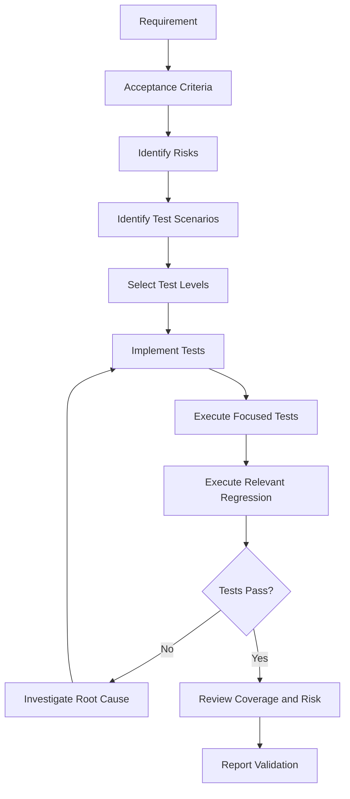
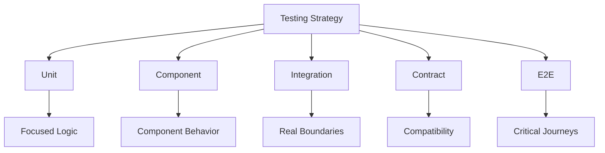
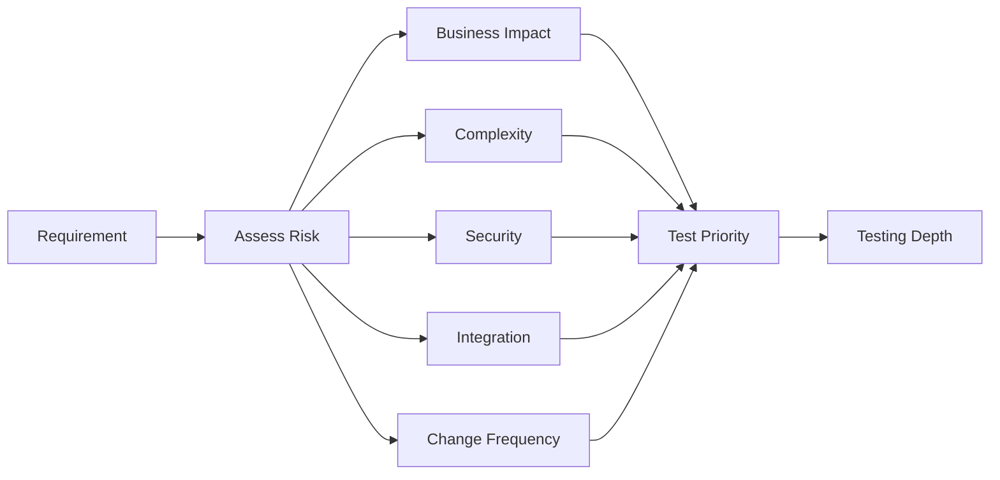
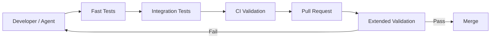

# Testing Strategy Skill

## Purpose

This skill defines generic principles, standards, and best practices for designing, implementing, executing, and maintaining software tests.

Testing provides evidence that software behaves as intended.

The objective is not to maximize the number of tests or achieve an arbitrary coverage percentage.

The objective is to establish sufficient confidence that software:

- Satisfies requirements
- Preserves expected behavior
- Handles important failure conditions
- Protects critical business rules
- Integrates correctly
- Respects contracts
- Remains safe to change
- Meets relevant quality requirements

This skill is:

- Domain-neutral
- Language-neutral
- Framework-neutral
- Vendor-neutral
- Cloud-neutral
- Platform-neutral
- Application-neutral
- Industry-neutral

---

# Objectives

A good testing strategy should help:

- Detect defects early.
- Prevent regressions.
- Validate requirements.
- Validate business rules.
- Validate architectural boundaries.
- Validate integrations.
- Validate failure behavior.
- Increase confidence in changes.
- Support safe refactoring.
- Provide fast engineering feedback.
- Reduce production defects.
- Improve system maintainability.
- Support continuous delivery.
- Make AI-generated changes independently verifiable.

---

# Fundamental Principle

## Test Behavior, Not Implementation Details

Tests should primarily verify observable behavior.

Prefer:

```text
Given
    ↓
Known Situation

When
    ↓
Behavior Occurs

Then
    ↓
Expected Outcome
```

Avoid excessive tests that verify:

```text
Private method called

Internal variable changed

Specific implementation sequence

Exact internal object structure
```

unless those details are themselves meaningful contracts.

Tests tightly coupled to implementation become fragile during refactoring.

---

# Testing Is Risk Management

Not every component requires identical testing depth.

Testing effort should reflect:

```text
Business Criticality
        +
Change Risk
        +
Complexity
        +
Security Impact
        +
Failure Impact
        +
Integration Complexity
        ↓
Testing Depth
```

Higher-risk behavior generally requires stronger validation.

---

# Understand Before Testing

Before creating tests, determine:

- Requirement
- Acceptance criteria
- Business rules
- Expected behavior
- Failure behavior
- Important edge cases
- Architectural boundaries
- External dependencies
- Existing testing conventions

Do not generate tests blindly from implementation code.

---

# Requirements and Tests

Tests should trace back to meaningful expected behavior.

Conceptually:

```text
Requirement
    ↓
Acceptance Criteria
    ↓
Expected Behavior
    ↓
Tests
```

Implementation and tests should ultimately validate the requirement rather than each other.

---

# Test Portfolio

A mature testing strategy may contain multiple test types.

Examples include:

```text
Unit Tests

Component Tests

Integration Tests

Contract Tests

End-to-End Tests

Regression Tests

Security Tests

Performance Tests

Resilience Tests
```

Not every repository requires every test type.

Select tests according to architecture and risk.

---

# Test Pyramid

A traditional testing model is:

```text
           /\
          /  \
         /E2E \
        /------\
       /Integration\
      /------------\
     /  Unit Tests  \
    /________________\
```

The principle is generally:

- Many fast focused tests
- Fewer integration tests
- Fewer expensive end-to-end tests

This is guidance, not a universal mandatory distribution.

---

# Test Trophy and Other Models

Some systems may benefit from stronger emphasis on integration or component testing.

Conceptually:

```text
       E2E
        │
   Integration
        │
      Unit
        │
Static Analysis
```

Do not force one testing model on every architecture.

Choose the test portfolio that provides confidence efficiently.

---

# Unit Tests

Unit tests validate focused behavior in isolation from unnecessary external dependencies.

Typical characteristics:

- Fast
- Deterministic
- Focused
- Easy to execute
- Easy to diagnose

Unit tests are especially valuable for:

- Business rules
- Calculations
- Validation
- Transformations
- Decision logic
- State transitions
- Algorithms

---

# Unit Boundary

A unit does not always mean one method or one class.

A unit is a meaningful testable behavior boundary.

Depending on design, it may represent:

- Function
- Class
- Component
- Small collaborating group

Avoid artificially isolating every object simply to call a test a unit test.

---

# Unit Test Isolation

Unit tests should avoid unnecessary dependence on:

- Networks
- External services
- Shared databases
- File systems
- Global mutable state
- Environment-specific resources

unless those dependencies are intentionally part of the tested unit.

---

# Unit Test Value

Do not write trivial unit tests merely to increase test count.

For example, testing simple language-generated accessors usually provides little value.

Prioritize behavior where defects matter.

---

# Component Tests

Component tests validate a meaningful component as a whole while controlling external boundaries.

Conceptually:

```text
Test
  ↓
Component
 ├── Internal Logic
 ├── Internal Collaboration
 └── Controlled External Boundaries
```

Component testing can provide confidence without requiring the complete system.

---

# Integration Tests

Integration tests verify that components collaborate correctly across real boundaries.

Examples may include:

```text
Application ↔ Data Store

Application ↔ External Interface

Component ↔ Messaging Infrastructure

Module ↔ Module

Serialization ↔ Contract
```

Integration tests should focus on behavior that cannot be sufficiently validated through isolated tests.

---

# Integration Test Purpose

Integration tests can detect problems such as:

- Incorrect configuration
- Schema mismatch
- Serialization problems
- Query errors
- Transaction behavior
- Dependency assumptions
- Protocol mismatch

These issues may not appear in unit tests.

---

# Integration Test Scope

Keep integration tests focused.

Avoid turning every integration test into a complete system test.

A focused integration test should clearly identify which boundary it validates.

---

# Contract Tests

Contract tests verify agreements between independently evolving components.

A contract may define:

- Input structure
- Output structure
- Required fields
- Error semantics
- Compatibility expectations
- Message structure

Contract testing is useful when producer and consumer changes can occur independently.

---

# Consumer-Provider Contracts

Conceptually:

```text
Consumer
    ↓
Expected Contract
    ↓
Provider
```

Contract tests can detect breaking changes before deployment.

---

# Contract Tests Are Not Full Integration Tests

Contract tests verify compatibility expectations.

They do not necessarily prove that:

- Networking works.
- Authentication works.
- Infrastructure is correctly configured.
- Full workflows succeed.

Use complementary tests where necessary.

---

# End-to-End Tests

End-to-end tests validate behavior across a substantial portion of the deployed or runnable system.

Conceptually:

```text
External Entry
      ↓
System
      ↓
Dependencies
      ↓
Expected Outcome
```

They provide broad confidence but usually have higher cost.

---

# E2E Test Risks

End-to-end tests can be:

- Slow
- Expensive
- Difficult to diagnose
- Environment-dependent
- More prone to flakiness

Use them for important workflows rather than every possible behavior.

---

# Critical Journey Testing

Prioritize end-to-end tests for important system journeys.

Examples conceptually include:

```text
Primary Business Workflow

Critical State Transition

High-Risk Transaction

Security-Sensitive Workflow
```

Do not attempt to reproduce every unit-level edge case through E2E tests.

---

# Regression Tests

A regression test protects behavior that must continue working after changes.

When fixing a defect, where practical:

```text
Reproduce Defect
      ↓
Create Failing Test
      ↓
Fix Defect
      ↓
Test Passes
```

This prevents the same defect from returning unnoticed.

---

# Acceptance Tests

Acceptance tests verify behavior against requirements or acceptance criteria.

They should focus on:

> Does the system satisfy the required outcome?

rather than implementation details.

---

# Smoke Tests

Smoke tests provide quick confidence that essential capabilities are operational.

They may validate:

- Application starts
- Critical dependency reachable
- Essential operation succeeds
- Basic system health

Smoke tests are not substitutes for deeper testing.

---

# Sanity Tests

Sanity tests may provide focused validation after a small change or deployment.

They verify that the affected capability behaves reasonably before deeper validation.

Terminology varies between organizations.

---

# Negative Testing

Testing should include invalid and failure conditions.

Examples include:

- Invalid input
- Missing input
- Unauthorized operation
- Forbidden operation
- Resource not found
- Dependency failure
- Timeout
- Conflict
- Invalid state transition

Do not test only successful paths.

---

# Boundary Testing

Defects frequently occur at boundaries.

Test values:

```text
Below Boundary

At Boundary

Above Boundary
```

For a conceptual allowed range:

```text
1 ≤ value ≤ 100
```

useful tests may include:

```text
0

1

100

101
```

---

# Equivalence Partitioning

Inputs can often be grouped into categories expected to behave similarly.

Instead of testing every possible value:

```text
Valid Group

Invalid Group A

Invalid Group B
```

Select representative values.

This reduces unnecessary tests while preserving useful confidence.

---

# Decision Table Testing

When behavior depends on combinations of conditions, decision tables can clarify required cases.

Example:

| Condition A | Condition B | Expected |
|---|---|---|
| Yes | Yes | Outcome 1 |
| Yes | No | Outcome 2 |
| No | Yes | Outcome 3 |
| No | No | Outcome 4 |

Use when combinations are meaningful.

---

# State Transition Testing

Systems with meaningful states should test valid and invalid transitions.

Conceptually:

```text
State A
  ↓
State B
  ↓
State C
```

Tests should verify:

- Valid transitions
- Invalid transitions
- Required conditions
- Side effects

---

# Property-Based Testing

Where appropriate, tests can verify properties across many generated inputs.

Examples conceptually include:

```text
Result is never negative

Serialization followed by deserialization preserves value

Ordering remains valid

Invariant always holds
```

Property-based testing is especially useful for algorithms and broad input spaces.

Use where tooling and complexity justify it.

---

# Example-Based Testing

Example-based tests use specifically chosen scenarios.

They are useful for:

- Requirements
- Known edge cases
- Business examples
- Regression cases

Property-based and example-based testing can complement each other.

---

# Test Structure

Tests should have clear structure.

A common conceptual model is:

```text
Arrange
   ↓
Prepare Situation

Act
   ↓
Perform Behavior

Assert
   ↓
Verify Outcome
```

Equivalent structures such as Given-When-Then are also appropriate.

---

# Arrange

Arrange only the data and dependencies required for the scenario.

Excessive setup can make tests difficult to understand.

---

# Act

The tested behavior should generally be obvious.

A test with many unrelated actions may be validating too much at once.

---

# Assert

Assertions should verify meaningful outcomes.

Avoid assertions that merely confirm:

```text
Result is not null
```

when more important behavior can be validated.

---

# One Behavior Per Test

A test should ideally have a clear behavioral purpose.

This does not mean:

> Exactly one assertion per test.

Multiple assertions may be appropriate when they collectively validate one outcome.

---

# Test Naming

Test names should communicate:

```text
Behavior

Condition

Expected Outcome
```

where practical.

A failing test should help an engineer understand what behavior broke.

---

# Test Readability

Test code is engineering code.

Tests should be:

- Clear
- Maintainable
- Consistent
- Focused

Avoid excessive abstraction that hides test intent.

---

# Test Independence

Tests should ideally be executable independently.

Avoid assumptions such as:

```text
Test B requires Test A to run first.
```

Test ordering dependencies create fragility.

---

# Deterministic Tests

Given the same relevant conditions, a test should produce the same result.

Avoid dependence on uncontrolled:

- Time
- Randomness
- Shared state
- Network availability
- Test order
- Environment data

Control these factors where practical.

---

# Time-Dependent Testing

Code depending on current time can be difficult to test.

Where time affects behavior, consider providing a controllable time abstraction or equivalent mechanism.

Avoid arbitrary delays as test synchronization.

---

# Randomness

Randomized behavior should be controllable where deterministic tests are required.

Use fixed seeds or controlled generators where appropriate.

Do not allow uncontrolled randomness to create flaky tests.

---

# Test Data

Test data should be:

- Minimal
- Understandable
- Relevant
- Safe
- Reproducible

Avoid copying uncontrolled production data into test environments.

---

# Sensitive Test Data

Tests should not contain real:

- Credentials
- Secrets
- Sensitive personal information
- Production tokens
- Confidential data

Use synthetic or appropriately sanitized data.

---

# Test Data Builders

For complex test objects, builders or factories may improve readability.

Use them when they reduce repeated irrelevant setup.

Avoid over-engineered test frameworks for simple data.

---

# Fixtures

Fixtures may provide reusable test setup.

Keep fixtures:

- Focused
- Predictable
- Easy to understand

Large shared fixtures can create hidden coupling between tests.

---

# Shared Test State

Shared mutable test state can create:

- Order dependencies
- Flakiness
- Difficult debugging

Prefer isolated test state where practical.

---

# Test Cleanup

Tests creating external resources should clean them up appropriately.

Examples include:

- Database records
- Files
- Temporary resources
- Queues
- External test objects

Cleanup should also account for test failure.

---

# Mocks

Mocks can verify interactions with dependencies.

Use them when interaction behavior matters.

Do not mock every internal collaborator.

Excessive mocking can make tests tightly coupled to implementation.

---

# Stubs

Stubs provide controlled responses from dependencies.

They are useful when the test needs predictable dependency behavior.

---

# Fakes

Fakes provide lightweight working implementations.

Examples may include:

```text
In-Memory Store

Fake Clock

Fake Message Publisher
```

Use when they represent behavior sufficiently for the test.

---

# Test Doubles

Choose test doubles based on what the test needs.

Conceptually:

```text
Stub
  ↓
Provides Controlled Data

Mock
  ↓
Verifies Interaction

Fake
  ↓
Provides Lightweight Behavior
```

Terminology varies by framework.

---

# Mock at Boundaries

Prefer mocking meaningful external boundaries rather than internal implementation details.

Conceptually:

```text
Application
    ↓
External Capability
```

is often a better mock boundary than:

```text
Class A
 ↓
Class B
 ↓
Class C
```

where all classes are internal implementation details.

---

# Do Not Mock What You Do Not Own Blindly

External libraries may behave differently from simplified mocks.

Where correctness depends on external behavior, use appropriate integration or contract testing.

---

# Over-Mocking

Warning signs include:

- Tests know exact internal call sequences.
- Small refactoring breaks many tests.
- Tests reproduce implementation logic.
- Tests pass while real integration fails.

When this occurs, reconsider the test boundary.

---

# Database Testing

When persistence behavior matters, test against realistic storage behavior where practical.

Mocking storage may not detect:

- Query errors
- Constraints
- Transactions
- Serialization
- Concurrency behavior
- Schema incompatibility

Use integration testing for storage-specific behavior.

---

# External Dependency Testing

Do not make the entire test suite depend on uncontrolled external systems.

Use combinations of:

- Test doubles
- Contract tests
- Controlled integration environments

according to risk.

---

# Network Testing

Network behavior introduces uncertainty.

Tests involving real networks should consider:

- Timeouts
- Availability
- Latency
- Authentication
- Rate limits

Do not make fast unit suites dependent on external network access.

---

# Error Testing

Tests should verify meaningful error behavior.

Validate:

- Error category
- Safe error message where relevant
- State after failure
- Retry behavior
- Cleanup
- Side effects

Refer to `error-handling.md`.

---

# Retry Testing

When retry exists, test:

```text
Initial Failure

Retry

Recovery
```

and:

```text
Repeated Failure

Retry Limit

Final Failure
```

Do not create tests that depend on long real-time retry delays when delays can be controlled.

---

# Timeout Testing

Timeout behavior should be tested without unnecessarily slowing the test suite.

Use controllable dependency behavior or clocks where appropriate.

---

# Idempotency Testing

Retryable or duplicate-prone operations should verify idempotency where required.

Conceptually:

```text
Execute Request
      ↓
Execute Same Request Again
      ↓
No Unintended Duplicate Effect
```

---

# Concurrency Testing

Where concurrency matters, test:

- Concurrent updates
- Race-sensitive behavior
- Conflict handling
- Ordering assumptions
- Shared-state safety

Concurrency tests require careful design to avoid nondeterministic results.

Refer to `concurrency.md`.

---

# Transaction Testing

Where transactional behavior matters, verify:

```text
Successful Commit

Failure Rollback

Constraint Violation

Concurrent Conflict
```

Do not rely solely on mocks for important transactional semantics.

---

# Asynchronous Testing

Asynchronous behavior should be tested using deterministic synchronization where possible.

Avoid arbitrary:

```text
sleep(5000)
```

to wait for completion.

Prefer observable completion signals.

---

# Message Processing Testing

Message-driven behavior should consider:

- Duplicate messages
- Invalid messages
- Retry
- Ordering
- Partial processing
- Dead-letter behavior
- Idempotency

Do not assume exactly-once delivery.

---

# Batch Testing

Batch behavior should test:

- All success
- Individual item failure
- Partial success
- Empty batch
- Large batch where relevant
- Retry behavior

Expected partial-failure semantics should be explicit.

---

# File Processing Testing

Where file processing exists, test relevant cases such as:

- Valid file
- Invalid structure
- Empty file
- Partial data
- Unsupported format
- Large input where relevant

The exact cases depend on requirements.

---

# Security Testing

Testing strategy should include security validation proportional to risk.

Possible areas include:

- Authentication
- Authorization
- Input validation
- Injection resistance
- Sensitive-data handling
- Secret exposure
- Dependency vulnerabilities

Refer to `secure-coding.md`.

---

# Authorization Testing

Do not test only authorized behavior.

Where access control exists, test:

```text
Allowed Actor → Allowed

Unauthorized Actor → Denied

Insufficient Permission → Denied
```

Security controls should fail safely.

---

# Performance Testing

Performance testing may validate:

- Latency
- Throughput
- Resource usage
- Scalability
- Capacity

Use when performance requirements exist.

Refer to `performance-engineering.md`.

---

# Load Testing

Load testing evaluates behavior under expected or elevated workload.

It may help identify:

- Capacity limits
- Bottlenecks
- Resource exhaustion
- Scaling behavior

Use realistic workload assumptions.

---

# Stress Testing

Stress testing explores behavior beyond expected operating conditions.

The goal may include understanding:

- Failure point
- Recovery behavior
- Degradation characteristics

Do not confuse stress testing with normal load testing.

---

# Resilience Testing

Where reliability requirements justify it, test dependency failures and degraded conditions.

Examples include:

```text
Dependency unavailable

Timeout

Temporary failure

Partial network failure

Resource exhaustion
```

Refer to architecture `resilience.md`.

---

# Failure Injection

Controlled failure injection can validate resilience behavior.

Conceptually:

```text
Normal System
      ↓
Introduce Failure
      ↓
Observe Behavior
      ↓
Verify Recovery
```

Use where system criticality justifies the complexity.

---

# Compatibility Testing

Where compatibility matters, test supported:

- Versions
- Protocols
- Schemas
- Runtime environments
- Data formats

Do not claim compatibility that has not been validated.

---

# Migration Testing

Changes involving persistent data or schemas should test:

- Migration success
- Existing data compatibility
- Failure behavior
- Rollback or recovery strategy where applicable

Migration failures can have high impact.

---

# Upgrade Testing

Dependency or platform upgrades should validate important existing behavior.

Do not assume successful compilation proves compatibility.

---

# Snapshot Testing

Snapshot testing can be useful for stable structured output.

However, avoid large snapshots that reviewers approve without understanding.

Snapshot changes should be reviewed intentionally.

---

# Golden Master Testing

For legacy systems with poorly understood behavior, capturing existing observable behavior may support safe refactoring.

Use carefully.

Existing behavior may include defects.

Do not automatically define every existing behavior as correct.

---

# Test Coverage

Coverage is one indicator of test execution.

Common metrics include:

- Line coverage
- Branch coverage
- Function coverage
- Condition coverage

Coverage should support risk analysis.

It should not become the objective itself.

---

# Coverage Targets

Do not impose arbitrary universal coverage percentages.

Determine expectations based on:

- System risk
- Criticality
- Complexity
- Existing baseline
- Type of code

Critical business logic may justify stronger coverage than trivial mapping code.

---

# Changed-Code Coverage

For existing repositories, changed-code coverage can encourage incremental improvement.

Conceptually:

```text
Existing Baseline
      ↓
New / Changed Code
      ↓
Appropriate Testing
```

This avoids requiring immediate remediation of the entire historical codebase.

---

# Branch Coverage

Branch coverage can be especially useful for decision-heavy logic.

For example:

```text
if condition
    path A
else
    path B
```

Line coverage alone may not reveal whether both outcomes were tested.

---

# Coverage Gaps

When identifying untested code, prioritize based on:

```text
Risk
    ↓
Business Criticality
    ↓
Complexity
    ↓
Change Frequency
```

Do not blindly test every uncovered line.

---

# Mutation Testing

Mutation testing evaluates whether tests can detect behavioral changes.

Conceptually:

```text
Correct Code
    ↓
Introduce Small Mutation
    ↓
Run Tests
    ↓
Tests Should Fail
```

Surviving mutations may indicate weak assertions or missing tests.

Use where cost is justified.

---

# Test Quality

Tests themselves require quality standards.

A good test should be:

- Relevant
- Understandable
- Deterministic
- Focused
- Maintainable
- Trustworthy

A large number of weak tests can create false confidence.

---

# Flaky Tests

A flaky test produces inconsistent results without meaningful system changes.

Flakiness damages trust in automation.

Common causes include:

- Timing assumptions
- Shared state
- Network dependencies
- Randomness
- Environment instability
- Ordering
- Concurrency

Flaky tests should be investigated.

---

# Never Normalize Flakiness

Avoid:

```text
Test Failed
    ↓
Rerun
    ↓
Passed
    ↓
Ignore
```

Repeated reruns hide quality problems.

Retrying infrastructure execution may sometimes be appropriate, but test nondeterminism should still be investigated.

---

# Quarantining Tests

Temporary quarantine may be appropriate when a flaky test blocks delivery disproportionately.

If used:

- Track the problem.
- Preserve visibility.
- Define ownership.
- Restore the test after correction.

Quarantine should not become permanent deletion of quality controls.

---

# Test Execution Speed

Feedback speed matters.

Fast tests encourage frequent execution.

A useful strategy is:

```text
Fast Tests
    ↓
Run Frequently

Slower Tests
    ↓
Run at Appropriate Pipeline Stage
```

Do not place every expensive system test in the earliest feedback loop.

---

# Test Suite Segmentation

Test suites may be organized by execution characteristics.

For example:

```text
Fast Validation

Integration Validation

Extended Validation

Performance / Security Validation
```

The exact organization depends on delivery workflow.

---

# Local Testing

Developers and AI agents should run relevant fast tests before considering implementation complete.

Do not rely exclusively on CI to discover basic failures.

---

# Continuous Integration Testing

CI should independently validate important behavior.

Typical validation may include:

```text
Build
   ↓
Unit Tests
   ↓
Integration Tests
   ↓
Static / Security Checks
```

Additional test stages may follow according to risk.

---

# Pull Request Testing

Pull requests should execute sufficient validation to protect the target branch.

Testing should focus on:

- Changed behavior
- Relevant regression
- Integration impact
- Required quality gates

---

# Post-Deployment Testing

Where appropriate, deployed systems may require:

- Smoke tests
- Health validation
- Synthetic tests
- Critical journey tests

These validate behavior that cannot be fully established before deployment.

---

# Test Environment

Test environments should be sufficiently representative for the behavior being validated.

Not every test requires production-equivalent infrastructure.

Match environment fidelity to test purpose.

---

# Environment Drift

Differences between test and target environments can hide defects.

Relevant differences may include:

- Configuration
- Runtime version
- Dependency version
- Network behavior
- Data schema

Automate environment consistency where practical.

---

# Test Configuration

Test-specific configuration should remain explicit.

Avoid hidden environment assumptions.

Tests should clearly identify required external resources.

---

# Production Testing

Testing in production may be appropriate for certain controlled validation strategies, but it must not replace pre-production testing.

Production validation should protect:

- Users
- Data
- Security
- Availability

Use only when organizational practices allow it.

---

# Test Observability

When tests fail, engineers should have enough information to diagnose the cause.

Useful failure output may include:

- Test name
- Expected result
- Actual result
- Relevant diagnostic context

Avoid overwhelming output that hides the useful failure.

---

# Test Failure Classification

A failed test may indicate:

```text
Product Defect

Test Defect

Environment Failure

Configuration Failure

Infrastructure Failure
```

Investigate before assuming the product code is always the cause.

---

# Test Maintenance

Tests must evolve with legitimate requirement changes.

When behavior intentionally changes:

```text
Requirement Changes
      ↓
Update Implementation
      +
Update Relevant Tests
```

Do not modify tests merely because they fail after an unintended regression.

---

# Do Not Make the Test Pass at Any Cost

When a test fails after implementation, determine:

```text
Is implementation wrong?

Is test wrong?

Did requirement change?

Is environment wrong?
```

Do not automatically weaken the assertion.

---

# Test Duplication

Some duplication in tests can improve readability.

Do not aggressively abstract tests until intent becomes difficult to understand.

Test clarity is often more valuable than maximum DRY compliance.

---

# Testing Private Implementation

Avoid directly testing private implementation details where public or observable behavior can provide confidence.

Tests should survive reasonable internal refactoring.

---

# Testing Getters and Setters

Do not create low-value tests solely to verify language-generated or trivial behavior unless the behavior contains meaningful rules.

Focus engineering effort where defects matter.

---

# Test Prioritization

When testing time is constrained, prioritize:

1. Critical business behavior
2. Security-sensitive behavior
3. High-risk changes
4. Complex logic
5. Failure paths
6. Integration boundaries
7. Frequently changed components
8. Regression-prone areas

Do not prioritize solely by file size or line count.

---

# Risk-Based Testing

A useful model is:

```text
Risk = Probability of Failure × Impact of Failure
```

Higher-risk areas deserve stronger testing.

Risk factors may include:

- Complexity
- Criticality
- Change frequency
- External dependencies
- Security sensitivity
- Historical defects

---

# Testing New Features

For new behavior:

1. Understand acceptance criteria.
2. Identify important scenarios.
3. Identify negative scenarios.
4. Identify boundary conditions.
5. Identify integration impact.
6. Select appropriate test levels.
7. Implement tests.
8. Execute relevant suites.
9. Review coverage gaps.
10. Report validation.

---

# Testing Bug Fixes

For defect correction:

```text
Understand Defect
      ↓
Reproduce
      ↓
Create Regression Test
      ↓
Confirm Test Fails
      ↓
Implement Fix
      ↓
Confirm Test Passes
      ↓
Run Relevant Regression
```

Where practical, this is preferred over fixing the defect without protecting against recurrence.

---

# Testing Refactoring

Refactoring should preserve observable behavior.

Before substantial refactoring:

- Establish test confidence.
- Identify critical behavior.
- Add characterization tests where needed.

After refactoring:

- Run relevant regression.
- Confirm behavior remains unchanged.

---

# Testing Configuration Changes

Configuration changes can alter behavior without source-code changes.

Where configuration is significant, validate:

- Required values
- Invalid values
- Environment differences
- Safe defaults
- Startup behavior

Refer to `configuration-management.md`.

---

# Testing Dependency Changes

When dependencies change:

- Run relevant regression tests.
- Validate compatibility.
- Review changed behavior.
- Review security impact.

Refer to `dependency-management.md`.

---

# Testing Error Handling

Every important error-handling path should have appropriate validation.

Examples include:

```text
Dependency Fails

Timeout Occurs

Retry Succeeds

Retry Exhausted

Invalid State

Partial Failure
```

Refer to `error-handling.md`.

---

# Testing Architecture Boundaries

Where architectural rules are important, tests or automated checks may validate:

- Allowed dependencies
- Forbidden dependencies
- Module isolation
- Layer direction
- Contract boundaries

This helps prevent architecture erosion.

Refer to `clean-architecture.md`.

---

# Testing Non-Functional Requirements

Testing is not limited to functional behavior.

Depending on requirements, validation may include:

```text
Performance

Security

Reliability

Accessibility

Compatibility

Scalability

Recoverability
```

Select according to system context.

---

# AI-Generated Tests

AI-generated tests should not be automatically trusted.

AI may generate tests that:

- Mirror implementation rather than requirements
- Assert trivial behavior
- Mock everything
- Miss important edge cases
- Produce false confidence
- Use nonexistent APIs
- Duplicate existing tests

Generated tests must be reviewed and executed.

---

# AI Development Agent Testing Workflow

When implementing a change, an AI Development Agent should follow:

## 1. Understand

Read:

- Requirement
- Acceptance criteria
- Architecture documentation
- Relevant existing behavior

## 2. Inspect

Identify:

- Existing test framework
- Existing test structure
- Similar tests
- Test commands
- Test conventions

## 3. Identify Risk

Determine:

- Critical behavior
- Edge cases
- Failure paths
- Security impact
- Integration impact

## 4. Select Test Levels

Choose appropriate:

- Unit
- Component
- Integration
- Contract
- E2E

Do not create every test type automatically.

## 5. Implement Tests

Create focused tests aligned with expected behavior.

## 6. Run Focused Tests

Execute tests directly related to the change.

## 7. Run Relevant Regression

Run broader suites appropriate to the change impact.

## 8. Review Failures

Determine root cause rather than weakening tests automatically.

## 9. Review Coverage

Identify important untested behavior.

Do not chase arbitrary percentages.

## 10. Report

Summarize:

- Tests created
- Tests modified
- Tests executed
- Results
- Validation not performed
- Remaining risks

---

# AI Development Agent Rules

When using this skill, the agent should:

- ALWAYS inspect existing tests before creating new test patterns.
- ALWAYS understand expected behavior before generating tests.
- ALWAYS test important changed behavior.
- ALWAYS include relevant negative paths.
- ALWAYS consider boundary conditions.
- ALWAYS preserve existing valid tests.
- ALWAYS execute generated tests where tooling permits.
- ALWAYS investigate failing tests.
- ALWAYS report tests that could not be executed.
- ALWAYS treat test coverage as a signal rather than the objective.
- ALWAYS consider regression risk.
- ALWAYS consider security-sensitive test cases.
- ALWAYS consider integration impact.

The agent should:

- NEVER create meaningless tests solely to increase coverage.
- NEVER remove a failing test solely to make validation pass.
- NEVER weaken assertions without understanding the requirement.
- NEVER blindly update snapshots.
- NEVER assume generated tests are correct.
- NEVER mock every dependency automatically.
- NEVER create E2E tests for every low-level behavior.
- NEVER rely solely on happy-path testing.
- NEVER introduce test-order dependencies.
- NEVER normalize flaky tests.
- NEVER use real secrets in tests.
- NEVER copy sensitive production data into test fixtures.
- NEVER claim validation passed when tests were not executed.

---

# Testing Decision Framework

For each meaningful behavior ask:

## 1. What Requirement Is Being Verified?

Identify the expected outcome.

## 2. What Is the Risk?

Consider probability and impact of failure.

## 3. What Is the Smallest Useful Test Boundary?

Prefer focused tests where they provide sufficient confidence.

## 4. Does Real Integration Matter?

If yes, add appropriate integration validation.

## 5. Is There a Consumer Contract?

If yes, consider contract testing.

## 6. Is This a Critical Journey?

If yes, consider end-to-end validation.

## 7. What Can Fail?

Identify negative scenarios.

## 8. What Are the Boundaries?

Test important boundary values.

## 9. Is State Involved?

Test relevant transitions.

## 10. Can the Operation Be Repeated?

Consider idempotency and duplicate behavior.

## 11. Is Concurrency Relevant?

Test conflicts or race-sensitive behavior.

## 12. Is Security Relevant?

Validate authorization and input trust boundaries.

## 13. Is Performance Relevant?

Validate required performance characteristics.

## 14. What Regression Could This Change Cause?

Run appropriate existing tests.

---

# Generic Testing Flow



---

# Test Portfolio Model



---

# Risk-Based Testing Model



---

# Testing Feedback Model



---

# Best Practices

- Test behavior rather than implementation details.
- Base testing depth on risk.
- Trace tests to requirements.
- Use multiple test levels where appropriate.
- Keep unit tests fast.
- Use integration tests for real boundary behavior.
- Use contract tests for independently evolving interfaces.
- Reserve E2E testing for meaningful workflows.
- Add regression tests for defects.
- Test negative paths.
- Test boundary values.
- Test important state transitions.
- Keep tests deterministic.
- Keep tests independent.
- Keep test data safe.
- Mock meaningful boundaries.
- Avoid excessive mocking.
- Test real persistence semantics where necessary.
- Test retries and timeouts.
- Validate idempotency where required.
- Test concurrency where relevant.
- Include security testing proportional to risk.
- Use performance testing when requirements exist.
- Treat coverage as a signal.
- Investigate flaky tests.
- Maintain fast feedback.
- Keep test environments appropriate to test purpose.
- Review AI-generated tests.
- Run tests before declaring implementation complete.

---

# Common Mistakes

Avoid:

- Writing tests only after implementation without understanding requirements.
- Testing implementation details instead of behavior.
- Testing only happy paths.
- Creating trivial tests for coverage.
- Enforcing arbitrary coverage percentages everywhere.
- Mocking every dependency.
- Using mocks to validate behavior that depends on real integration semantics.
- Making every test an E2E test.
- Making unit tests depend on external networks.
- Sharing mutable state between tests.
- Depending on test execution order.
- Using uncontrolled randomness.
- Using arbitrary sleeps for synchronization.
- Using production secrets in tests.
- Using sensitive production data.
- Ignoring flaky tests.
- Repeatedly rerunning flaky tests until they pass.
- Removing tests because they expose regressions.
- Weakening assertions simply to make tests pass.
- Blindly updating snapshots.
- Treating 100% coverage as proof of correctness.
- Ignoring failure paths.
- Ignoring concurrency behavior.
- Ignoring security-sensitive scenarios.
- Assuming successful unit tests prove integration correctness.
- Claiming tests passed when they were not executed.

---

# Validation Checklist

Before considering testing sufficient, verify:

- [ ] Requirements were reviewed.
- [ ] Acceptance criteria were identified.
- [ ] Existing testing conventions were inspected.
- [ ] Relevant existing tests were identified.
- [ ] Testing depth reflects risk.
- [ ] Critical business behavior is tested.
- [ ] Changed behavior is tested.
- [ ] Relevant negative scenarios are tested.
- [ ] Important boundary values are tested.
- [ ] State transitions are tested where relevant.
- [ ] Unit tests exist where focused logic benefits from them.
- [ ] Integration boundaries are tested where required.
- [ ] Contracts are tested where compatibility matters.
- [ ] Critical journeys have appropriate system-level validation.
- [ ] Defect fixes include regression protection where practical.
- [ ] Tests focus primarily on behavior.
- [ ] Tests remain understandable.
- [ ] Tests are reasonably independent.
- [ ] Tests are deterministic.
- [ ] Time dependencies are controlled where practical.
- [ ] Randomness is controlled where required.
- [ ] Test data is safe.
- [ ] No real secrets are included.
- [ ] Sensitive production data is not used improperly.
- [ ] Test doubles are used intentionally.
- [ ] Excessive mocking is avoided.
- [ ] Real persistence semantics are tested where necessary.
- [ ] Dependency failure behavior is tested where important.
- [ ] Retry behavior is tested where implemented.
- [ ] Timeout behavior is tested where implemented.
- [ ] Idempotency is tested where required.
- [ ] Concurrency behavior is tested where relevant.
- [ ] Transaction behavior is tested where relevant.
- [ ] Asynchronous behavior is tested deterministically where possible.
- [ ] Message-processing failure behavior is tested where relevant.
- [ ] Authorization behavior is tested where applicable.
- [ ] Security-sensitive behavior receives appropriate validation.
- [ ] Performance requirements are tested where defined.
- [ ] Resilience behavior is tested where required.
- [ ] Coverage gaps were reviewed according to risk.
- [ ] Coverage metrics were not treated as the sole quality measure.
- [ ] Flaky tests were not ignored.
- [ ] Focused tests pass.
- [ ] Relevant regression tests pass.
- [ ] Required CI quality gates pass.
- [ ] Validation limitations are reported.
- [ ] AI-generated tests were executed and reviewed.

---

# Relationship With Other Engineering Skills

`testing-strategy.md` defines how implementation behavior should be verified.

Use it together with:

### `coding-standards.md`

Defines baseline implementation standards that tested code should follow.

### `clean-architecture.md`

Defines architectural boundaries that influence appropriate testing boundaries.

### `clean-code.md`

Defines readability and maintainability expectations for production and test code.

### `code-quality.md`

Defines quality gates, coverage interpretation, static analysis, and overall quality validation.

### `error-handling.md`

Defines failure behavior that testing must validate.

### `dependency-management.md`

Defines dependency governance and validation requirements when dependencies change.

### `configuration-management.md`

Defines configuration behavior and environment handling that should be tested.

### `secure-coding.md`

Defines security controls requiring security-focused validation.

### `performance-engineering.md`

Defines performance requirements and validation strategy.

### `concurrency.md`

Defines concurrency behavior requiring specialized testing.

### `code-review.md`

Defines how test completeness and test quality should be reviewed.

Testing also interacts with architecture skills:

```text
architecture-principles.md

system-design.md

distributed-systems.md

integration-patterns.md

api-principles.md

data-architecture.md

security-architecture.md

observability.md

resilience.md
```

Conceptually:

```text
                    Requirement
                        │
                        ↓
                 Implementation
                        │
                        ↓
                 Testing Strategy
                        │
       ┌────────────────┼────────────────┐
       ↓                ↓                ↓
     Unit           Integration       Contract
       │                │                │
       └────────────────┼────────────────┘
                        ↓
                   End-to-End
                        │
                        ↓
                Quality Validation
                        │
                        ↓
                   Code Review
                        │
                        ↓
                  Delivery Confidence
```

---

# References

Testing practices may draw, where applicable, from recognized software-engineering concepts such as:

- Risk-Based Testing
- Test Pyramid
- Test Trophy
- Unit Testing
- Component Testing
- Integration Testing
- Contract Testing
- End-to-End Testing
- Acceptance Testing
- Regression Testing
- Boundary Value Analysis
- Equivalence Partitioning
- Decision Table Testing
- State Transition Testing
- Property-Based Testing
- Mutation Testing
- Test Doubles
- Consumer-Driven Contracts
- Shift-Left Testing
- Continuous Testing
- Security Testing
- Performance Testing
- Resilience Testing
- Failure Injection
- Relevant organizational engineering standards

These concepts should be treated as reusable engineering guidance rather than mandatory test structures.

The appropriate testing strategy should ultimately be determined by system risk, business criticality, architecture, security requirements, complexity, failure impact, integration characteristics, change frequency, repository maturity, delivery model, and organizational engineering standards.