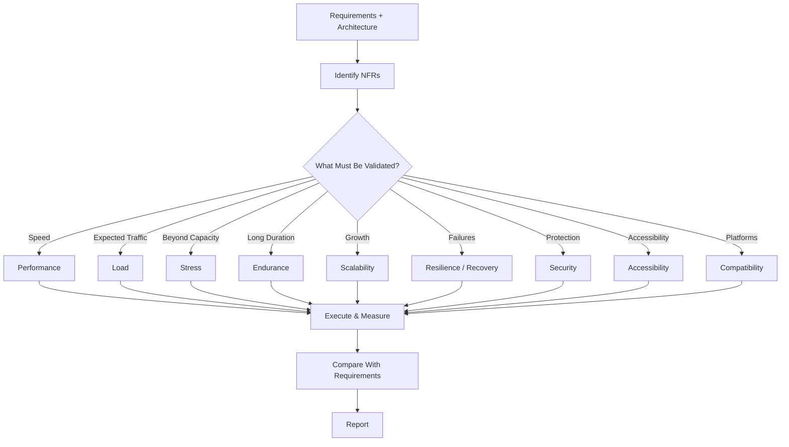

# Non-Functional Testing Skill

## Purpose

This skill defines standards for identifying, designing, executing, and reporting non-functional tests.

Non-functional testing evaluates how well a system operates rather than only whether a feature produces the correct functional result.

This skill is:

- Domain-neutral
- Language-neutral
- Framework-neutral
- Platform-neutral
- Vendor-neutral

The Testing Agent must apply only the non-functional test categories relevant to the system and its requirements.

---

# Objectives

Non-functional testing may validate:

- Performance
- Load handling
- Stress behavior
- Scalability
- Endurance
- Reliability
- Resilience
- Recovery
- Security
- Accessibility
- Compatibility
- Responsiveness
- Usability

Do not automatically execute every category.

Use:

```text
Requirements
    +
Architecture
    +
Risk
    ↓
Applicable Non-Functional Tests
```

---

# Core Principle

Functional testing asks:

```text
Does the system work?
```

Non-functional testing asks:

```text
How well does the system work
under expected and unexpected conditions?
```

---

# Inputs

Before designing tests inspect available:

- PRD
- Non-functional requirements
- Architecture design
- Expected workload
- Performance targets
- Security requirements
- Availability requirements
- Recovery requirements
- Supported browsers/devices
- Accessibility requirements
- Existing test tooling
- Existing non-functional tests

When available inspect:

```text
docs/PRD.md
docs/Architecture-Design.md
tests/test-cases/test-cases.md
```

Do not invent performance, availability, or scalability targets.

---

# Non-Functional Testing Workflow

```text
Inspect Requirements
        ↓
Identify NFRs
        ↓
Assess Risk
        ↓
Select Applicable Test Types
        ↓
Generate Test Cases
        ↓
Prepare Environment
        ↓
Execute Tests
        ↓
Measure Results
        ↓
Compare With Targets
        ↓
Report
```

---

# 1. Performance Testing

Performance testing evaluates system behavior under defined workload.

Measure applicable:

- Response time
- Throughput
- Latency
- Resource utilization
- Error rate

Example:

```text
Defined Workload
      ↓
Execute
      ↓
Measure
      ↓
Compare With Requirement
```

Do not claim a performance issue without measurable evidence.

---

# 2. Load Testing

Load testing validates behavior under expected or peak workload.

Consider:

```text
Normal Load

Expected Peak Load

Expected Concurrent Users

Expected Request Volume
```

Validate:

- Response time
- Throughput
- Error rate
- Stability
- Resource utilization

Use dedicated load-testing tools where available.

Playwright should not be used as the primary load-generation tool.

---

# 3. Stress Testing

Stress testing evaluates behavior beyond expected operating capacity.

Conceptually:

```text
Normal Load
    ↓
Peak Load
    ↓
Beyond Capacity
    ↓
Observe Degradation
```

Validate:

- Failure behavior
- Error rate
- Resource exhaustion
- Recovery
- Stability

Stress testing must be performed only in approved environments.

---

# 4. Endurance Testing

Endurance testing validates sustained operation over time.

Look for:

- Memory growth
- Connection leaks
- Resource leaks
- Performance degradation
- Increasing error rates
- Queue/backlog growth

Use when long-running stability is important.

---

# 5. Volume Testing

Volume testing validates behavior with large amounts of data.

Examples:

```text
Large Record Count

Large Payload

Large File

Large Query Result

Large Message Volume
```

Verify that system behavior remains acceptable within defined limits.

---

# 6. Scalability Testing

Where scalability requirements exist, validate behavior as workload increases.

Conceptually:

```text
Increase Workload
      ↓
Increase Capacity
      ↓
Measure Behavior
```

Evaluate whether the system scales according to its architecture and defined expectations.

Do not assume horizontal or vertical scaling without inspecting the architecture.

---

# 7. Reliability Testing

Reliability testing evaluates whether the system consistently performs expected operations over time.

Consider:

- Repeated operations
- Long-running workflows
- Intermittent failures
- Resource stability
- Error frequency

Focus on critical workflows.

---

# 8. Resilience Testing

Where resilience mechanisms exist, test controlled failure scenarios such as:

```text
Dependency Unavailable

Timeout

Transient Failure

Network Interruption

Service Restart
```

Validate applicable:

- Retry
- Timeout
- Circuit breaker
- Fallback
- Graceful degradation

Failure injection must be controlled and authorized.

---

# 9. Recovery Testing

Recovery testing validates whether the system can return to a valid state after failure.

Examples:

```text
Dependency Failure
      ↓
Dependency Restored
      ↓
System Recovers
```

Consider:

- Service restart
- Connection restoration
- Process failure
- Temporary dependency failure
- Interrupted operation

Validate data consistency after recovery.

---

# 10. Security Testing

Identify applicable security scenarios including:

- Authentication
- Authorization
- Input validation
- Injection resistance
- Sensitive data exposure
- Session behavior
- Security configuration
- File handling
- Access boundaries
- API security

Use approved security testing tools and organizational security standards.

Do not perform uncontrolled offensive security testing.

Detailed secure implementation guidance should follow:

```text
engineering/secure-coding.md
```

---

# 11. Accessibility Testing

For user interfaces, consider applicable accessibility validation:

- Keyboard navigation
- Accessible names
- Form labels
- Focus behavior
- Semantic structure
- Alternative text
- Automated accessibility rules

Where Playwright accessibility tooling is configured, use it as part of browser testing.

Automated checks do not replace required manual accessibility testing.

---

# 12. Compatibility Testing

Validate behavior across supported environments.

Depending on requirements this may include:

```text
Browsers

Operating Systems

Runtime Versions

API Versions

Devices
```

Do not test unsupported platforms unless explicitly requested.

---

# 13. Cross-Browser Testing

For browser applications, test supported browsers.

With Playwright this may include:

```text
Chromium

Firefox

WebKit
```

Validate critical workflows rather than duplicating every browser test unnecessarily.

Refer to:

```text
playwright-testing.md
```

---

# 14. Responsive Testing

Where responsive behavior is required, validate representative viewport categories:

```text
Desktop

Tablet

Mobile
```

Verify:

- Navigation
- Content visibility
- Forms
- Tables
- Dialogs
- Critical actions
- Layout usability

Do not rely solely on screenshots.

---

# 15. Usability Validation

Where required, validate basic usability characteristics such as:

- Clear navigation
- Understandable labels
- Action feedback
- Error messages
- Consistent interactions
- Critical workflow clarity

Automated tests can validate observable behavior but cannot replace formal human usability studies.

---

# 16. Performance Baseline

Where measurable performance requirements exist, establish a baseline.

Example:

```text
Scenario
    ↓
Workload
    ↓
Response Time
    ↓
Throughput
    ↓
Error Rate
```

Future test runs can compare against the baseline to identify regressions.

---

# 17. Performance Thresholds

Use defined requirements where available.

Example:

```text
Requirement:
95th percentile response time ≤ defined target
```

Do not invent arbitrary thresholds.

If no target exists, report measured results as observations rather than pass/fail requirements.

---

# 18. Test Environment

Non-functional tests should use a representative and controlled environment.

The environment should be documented because results may depend on:

- Compute capacity
- Database size
- Network
- Configuration
- Scaling configuration
- Dependency capacity

Avoid performance conclusions from environments that do not represent the intended workload without clearly stating the limitation.

---

# 19. Production Safety

Load, stress, resilience, and failure-injection tests can affect system availability.

The Testing Agent must not run disruptive tests against production unless explicitly authorized and safely controlled.

Prefer:

```text
Performance Environment

Staging Environment

Dedicated Test Environment
```

---

# 20. Test Data

Non-functional test data should be:

- Representative
- Non-sensitive
- Reproducible
- Appropriately sized

Do not use real sensitive production data merely to achieve realistic volume.

---

# 21. Test Case Documentation

Applicable non-functional scenarios should be added to:

```text
tests/test-cases/test-cases.md
```

Example:

```markdown
| ID | Requirement | Feature | Test Type | Scenario | Expected Result | Priority | Automation |
|----|-------------|---------|-----------|----------|-----------------|----------|------------|
| TC-200 | NFR-01 | API | Performance | Expected peak workload | Meets defined response target | High | Yes |
| TC-201 | NFR-02 | Service | Resilience | Dependency temporarily unavailable | System handles failure according to design | High | Yes |
| TC-202 | NFR-03 | UI | Accessibility | Keyboard navigation | Critical workflow is keyboard accessible | Medium | Yes/Partial |
```

---

# 22. Test Execution

Use existing repository or organizational tools.

Potential categories include:

```text
Performance Tool

Load Testing Tool

Security Scanner

Accessibility Tool

Playwright

Platform Monitoring
```

Do not introduce new tools when existing approved tooling is sufficient.

---

# 23. Monitoring During Tests

For performance-related tests capture relevant metrics where available.

Examples:

```text
CPU

Memory

Network

Request Rate

Response Time

Error Rate

Database Utilization

Queue Depth
```

Metrics help determine why performance changes occur.

---

# 24. Result Analysis

Compare actual results against defined requirements.

```text
Expected Target
      ↓
Actual Result
      ↓
Pass / Fail
```

If no defined target exists:

```text
Actual Result
      ↓
Observation / Baseline
```

Do not invent a pass/fail threshold.

---

# 25. Failure Analysis

When a non-functional test fails, determine whether the cause is:

```text
Application

Architecture

Infrastructure

Dependency

Configuration

Test Environment

Test Implementation

Test Data
```

Do not automatically classify every failure as an application-code defect.

---

# 26. Reporting

Report applicable results such as:

```text
Test Type

Scenario

Environment

Workload

Target

Actual Result

Pass / Fail

Evidence

Limitations
```

Example:

```text
Performance Test

Concurrent Users: 100

Target P95:
< defined requirement

Actual P95:
measured value

Error Rate:
measured value

Status:
PASS / FAIL
```

Only report values that were actually measured.

---

# Testing Agent Workflow

## 1. Discover

Inspect:

```text
PRD
Architecture
NFRs
Existing Tests
Existing Tooling
```

## 2. Select

Determine applicable:

```text
Performance
Load
Stress
Endurance
Volume
Scalability
Reliability
Resilience
Recovery
Security
Accessibility
Compatibility
Responsive
Usability
```

## 3. Document

Add applicable scenarios to:

```text
tests/test-cases/test-cases.md
```

## 4. Prepare

Configure:

```text
Environment
Test Data
Workload
Monitoring
```

## 5. Execute

Run only approved and applicable tests.

## 6. Measure

Capture actual metrics and evidence.

## 7. Compare

Compare against defined NFRs.

## 8. Report

Report actual results, gaps, and limitations.

---

# Testing Agent Rules

The agent should:

- ALWAYS inspect non-functional requirements before testing.
- ALWAYS inspect architecture for performance/resilience testing.
- ALWAYS select only relevant test categories.
- ALWAYS use defined targets when available.
- ALWAYS document applicable test cases.
- ALWAYS use representative test environments.
- ALWAYS protect sensitive data.
- ALWAYS capture measurable results.
- ALWAYS monitor relevant system metrics where available.
- ALWAYS distinguish measurements from assumptions.
- ALWAYS report environment and test limitations.
- ALWAYS use approved tooling.

The agent should:

- NEVER invent performance targets.
- NEVER invent availability targets.
- NEVER claim scalability without testing.
- NEVER claim resilience without testing failure scenarios.
- NEVER use Playwright as a primary load-testing tool.
- NEVER perform uncontrolled stress testing.
- NEVER perform disruptive production testing without explicit authorization.
- NEVER expose secrets or sensitive test data.
- NEVER claim performance results that were not measured.
- NEVER classify every non-functional failure as an application defect.
- NEVER mark a result PASS when no acceptance threshold exists.

---

# Non-Functional Test Selection



---

# Validation Checklist

Before non-functional testing is complete:

- [ ] Non-functional requirements were reviewed.
- [ ] Architecture was reviewed where relevant.
- [ ] Existing tooling was identified.
- [ ] Performance testing was considered.
- [ ] Load testing was considered.
- [ ] Stress testing was considered.
- [ ] Endurance testing was considered.
- [ ] Volume testing was considered.
- [ ] Scalability testing was considered.
- [ ] Reliability testing was considered.
- [ ] Resilience testing was considered.
- [ ] Recovery testing was considered.
- [ ] Security testing was considered.
- [ ] Accessibility testing was considered.
- [ ] Compatibility testing was considered.
- [ ] Responsive testing was considered.
- [ ] Only applicable categories were selected.
- [ ] Test cases were documented.
- [ ] Environment was documented.
- [ ] Test data was appropriate.
- [ ] Defined thresholds were used where available.
- [ ] Actual results were measured.
- [ ] Relevant metrics were captured.
- [ ] Failures were analyzed.
- [ ] Results were compared against requirements.
- [ ] Limitations were reported.

---

# Completion Criteria

Non-functional testing is complete when applicable:

```text
NFRs Identified
      +
Relevant Tests Selected
      +
Test Cases Documented
      +
Environment Prepared
      +
Tests Executed
      +
Results Measured
      +
Results Compared
      +
Findings Reported
```

---

# Relationship With Testing Skills

```text
test-case-design.md
        ↓
unit-testing.md
        ↓
integration-testing.md
        ↓
api-testing.md
        ↓
playwright-testing.md
        ↓
non-functional-testing.md
        ↓
defect-reporting.md
```

Non-functional testing complements functional testing.

It should not unnecessarily duplicate:

```text
Unit Tests
Integration Tests
API Tests
Playwright Tests
```

---

# Final Principle

The Testing Agent should not attempt every possible non-functional test.

It should determine:

```text
What Does the System Need to Guarantee?
                ↓
What Risks Exist?
                ↓
Which Non-Functional Tests Provide Evidence?
                ↓
Execute
                ↓
Measure
                ↓
Compare
                ↓
Report
```

Non-functional quality must be demonstrated through measurable evidence rather than assumptions.