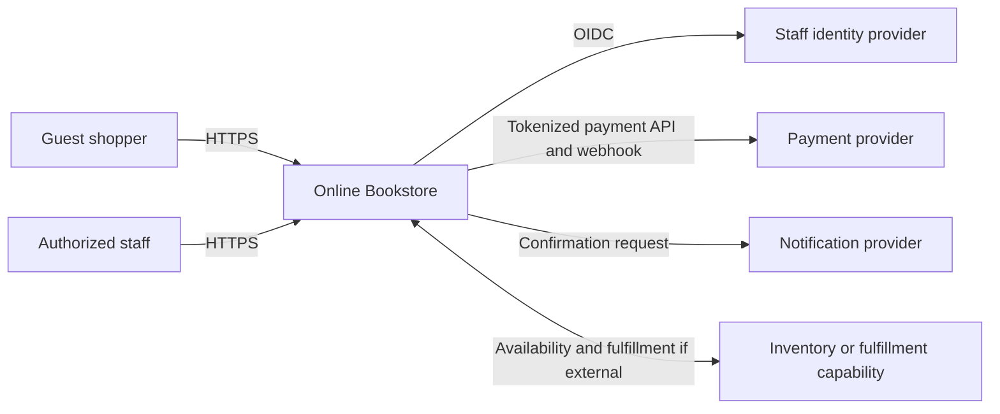
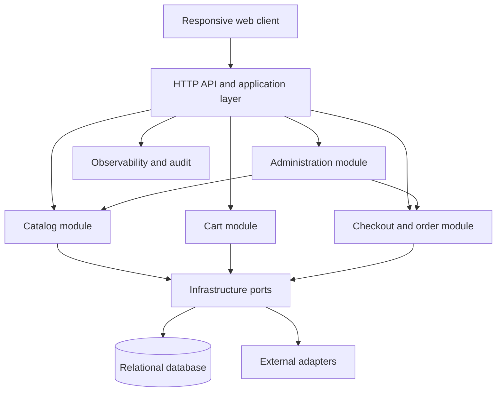
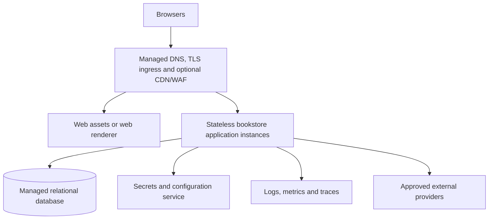
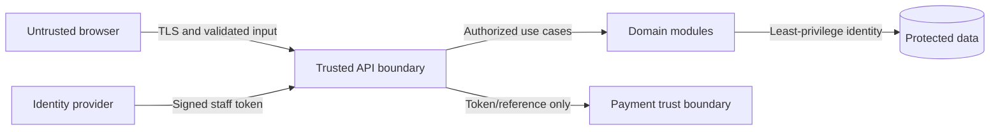
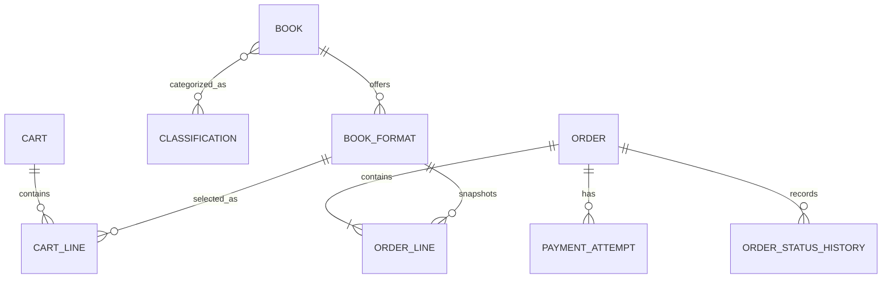
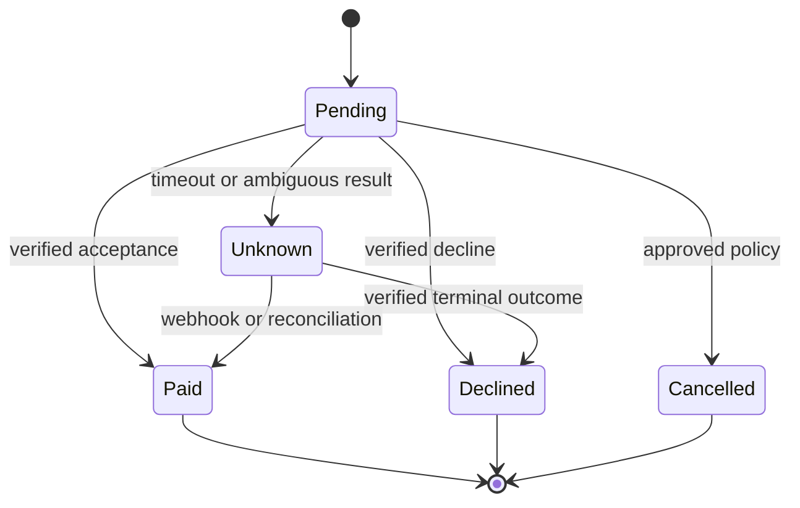

# Architecture Design Document: Online Bookstore

| Field | Value |
|---|---|
| Version | 0.1 |
| Status | Proposed — implementation-ready within recorded assumptions |
| Source | `docs/PRD.md` version 0.1 |
| Last updated | 2026-08-03 |

## 1. Executive summary

The solution is a responsive online bookstore for guest shoppers and authorized staff. It supports discovery, book details, a persistent cart, safe checkout, durable confirmation, catalog administration, and order inspection while maintaining a clean, accessible interface.

The selected architecture is a **modular monolith with clean/hexagonal boundaries**: one web client, one stateless application deployment, and one relational database. Catalog, Cart, Checkout/Order, and Administration are logical modules with explicit application interfaces. Payment, notification, identity, and any external inventory/fulfillment capability are accessed through adapters. This is the smallest design that provides transactional order safety, clear ownership, testability, and later extraction points without imposing microservice or messaging complexity before scale and operational targets exist.

Technology products, cloud provider, regions, service tiers, payment/notification providers, and quantitative service targets remain TBD. The interfaces and deployment boundaries below allow those selections without changing business semantics.

Key decisions are ADR-001 through ADR-006: modular monolith, relational persistence, provider adapters, server-authoritative checkout, idempotent payment/order processing, and guest-cart opaque identifiers.

## 2. Business context and scope

The product addresses shopper friction caused by crowded discovery, incomplete book information, unclear costs, and uncertain checkout outcomes. It also provides staff with controlled catalog and order operations. The architecture covers the PRD MVP only; marketplace, DRM/reading, subscriptions, reviews, recommendations, localization, customer accounts, and other PRD non-goals are excluded.

Actors are anonymous/guest shoppers, catalog administrators, and order operations staff. External dependencies are payment processing (IR-001), confirmation notification (IR-002), an administrative identity provider, and potentially inventory/fulfillment (IR-003). Commercial policies, supported markets and formats, provider choices, and measurable NFRs remain open.

## 3. Architecture principles and goals

- **Clarity end to end:** presentation, contracts, errors, and state transitions expose one unambiguous outcome.
- **Single ownership:** each domain record has one authoritative module; external contracts never expose storage internals.
- **Secure by design:** minimize personal data, tokenize payment details at the provider, authorize on the server, and audit privileged/financial actions.
- **Simple first:** no microservices, distributed cache, broker, sharding, or multi-region topology until approved requirements justify them.
- **Failure-aware:** timeouts, bounded retries, idempotency, reconciliation, and explicit recoverable UI states protect critical journeys.
- **Portable and replaceable:** provider-specific behavior stays behind ports; configuration and secrets remain outside application artifacts.
- **Observable without disclosure:** correlated structured events and metrics omit payment credentials and unnecessary personal data.

| Goal | Requirement source | Architecture response |
|---|---|---|
| Accessible, responsive clarity | NFR-001–003, NFR-008 | Semantic responsive client, explicit states, shared UI primitives, server validation, recoverable drafts |
| Safe commerce | FR-004–008, NFR-004 | server-side price/stock revalidation, transactional order state, idempotency keys, provider tokenization |
| Controlled operations | FR-009–011, NFR-005 | federated staff identity, role policies, backend authorization, immutable audit events |
| Operational insight | NFR-007 | correlated logs, metrics, traces, health checks, journey and dependency dashboards |
| Performance/availability/recovery | NFR-006 | stateless horizontal scaling and managed persistence are supported; thresholds and topology are TBD |
| Maintainability and cost control | C-02 | modular deployment, one primary store, no speculative infrastructure |

## 4. Requirements and work-item context

| Epic | Features | Stories | Requirements | Primary components |
|---|---|---|---|---|
| EPIC-001 | FEAT-001–003 | US-001–003 | FR-001–003 | COMP-001, COMP-002 |
| EPIC-002 | FEAT-004–006 | US-004–006 | FR-004–008 | COMP-001, COMP-003, COMP-004, COMP-007–009 |
| EPIC-003 | FEAT-007–008 | US-007–008 | FR-009–011 | COMP-001, COMP-002, COMP-004, COMP-005 |
| Cross-cutting | All MVP | US-001–008 | NFR-001–008 | COMP-001, COMP-005, COMP-006, COMP-010 |

Data requirements DR-001–005 are owned by the Catalog, Cart, Order, and Audit boundaries. External requirements IR-001–003 are isolated through integration adapters.

Complete requirement set in scope: FR-001, FR-002, FR-003, FR-004, FR-005, FR-006, FR-007, FR-008, FR-009, FR-010, FR-011; NFR-001, NFR-002, NFR-003, NFR-004, NFR-005, NFR-006, NFR-007, NFR-008.

## 5. Pattern and alternatives

**Selected:** modular monolith using clean/hexagonal separation between presentation, application use cases, domain rules, and infrastructure adapters.

| Alternative | Advantages | Limitations | Decision |
|---|---|---|---|
| Layered modular monolith | Simple deployment; local transactions; low operating cost; explicit future extraction seams | Modules share a release cadence and runtime failure domain | Selected |
| Microservices | Independent scaling and releases | Distributed transactions, latency, observability, and operational burden unsupported by current targets | Rejected for MVP |
| Serverless functions per capability | Consumption pricing and granular scaling | Workflow fragmentation, provider coupling, and transaction complexity | Rejected as default; hosting may still use a serverless-compatible application runtime |
| Static storefront with third-party commerce backend | Fast initial delivery | May not satisfy custom administration, audit, stock, and order semantics; product choice not approved | Deferred option pending product/provider evaluation |

The selected pattern trades independent module deployment for operational simplicity. Module APIs and database ownership rules must be enforced in code so the monolith does not degrade into a tightly coupled application.

## 6. Technology and platform decisions

| Layer/capability | Selection | Rationale/status |
|---|---|---|
| Web client | Standards-based component UI framework, **TBD product** | Must support SSR/SPA routing as chosen, semantic HTML, responsive design, and automated accessibility tests |
| Backend/API | Stateless server runtime, **TBD language/framework** | Repository has no existing implementation or organizational constraint |
| API | HTTPS JSON REST under `/api/v1` | Fits request/response catalog and checkout behavior and is broadly testable |
| Database | Managed relational database, **TBD product** | Catalog/order relationships, constraints, and transaction requirements favor relational storage |
| Object storage/CDN | Optional managed image storage and edge delivery, **TBD** | Use only if book images are not supplied by an approved external catalog source |
| Identity | OIDC/OAuth 2.0 compatible workforce identity provider, **TBD** | Required for administrator authentication; guest shoppers remain anonymous |
| Payment | Hosted fields/redirect/token API, **TBD provider** | Prevents reusable payment credentials entering bookstore systems |
| Notification | Provider adapter, **TBD channel/provider** | IR-002 requires stakeholder selection |
| Cache/message broker | None for MVP | No validated scale or asynchronous fan-out requirement; reconsider from measured load/failure needs |
| Cloud/platform/tier | **TBD** | Hosting policy, region, availability and budget are unconfirmed |

No premium tier, private network topology, availability-zone configuration, or multi-region deployment can be selected until NFR-006 and Q-001/Q-007 are resolved. The minimum candidate platform needs managed HTTPS ingress, stateless compute, relational storage, secrets, object storage if required, monitoring, backups, and workload identity.

## 7. System context



The bookstore owns its user experience, cart, order record, catalog view, authorization policies, and audit trail. Providers own payment credentials/payment processing and message delivery. Inventory ownership remains TBD under Q-003.

## 8. Logical and component architecture



| ID | Component | Responsibility | Owned data | Requirements |
|---|---|---|---|---|
| COMP-001 | Web client | Accessible storefront/admin views; visible state; local non-sensitive checkout draft | Browser cart token and transient form state | FR-001–011, NFR-001–003, NFR-008 |
| COMP-002 | Catalog module | Browse/search/filter/detail; catalog validation and sale state | Books, formats, classifications, prices, availability if internal | FR-001–003, FR-009, DR-001 |
| COMP-003 | Cart module | Create/retrieve cart, quantity validation, price/stock-change comparison | Carts and cart lines | FR-004, DR-002 |
| COMP-004 | Checkout/order module | Quote final total, validate checkout, coordinate payment, create durable confirmation, order query/status | Orders, snapshots, totals, payment references/outcomes, status history | FR-005–008, FR-010–011, DR-003–004 |
| COMP-005 | Identity/authorization | Validate staff identity and enforce CatalogAdmin/OrderOperator policies | Role mappings/configuration; no shopper account | NFR-005, FR-009–011 |
| COMP-006 | Audit/telemetry | Privileged and critical-event audit plus non-sensitive operational signals | Audit events and telemetry | NFR-004–005, NFR-007 |
| COMP-007 | Payment adapter | Tokenized authorize/capture interface and signed webhook translation | Provider reference only | FR-007, IR-001 |
| COMP-008 | Notification adapter | Submit confirmation and report delivery failure | Provider delivery reference/status | FR-008, IR-002 |
| COMP-009 | Inventory/fulfillment adapter | Optional synchronization/commands behind an anti-corruption boundary | No authority until Q-003 is resolved | FR-004, FR-011, IR-003 |
| COMP-010 | Relational persistence adapter | Transactions, optimistic concurrency, migrations, backup/restore hooks | Persistent domain records | DR-001–005, NFR-004–006 |

Dependencies point inward to application/domain interfaces. Modules must not query another module’s tables directly; they use defined application services even when deployed in the same process.

## 9. Deployment, infrastructure, and network



- Environments: isolated development, test/staging, and production configurations; exact promotion topology TBD.
- Compute: stateless instances with health checks and scale-out capability. Minimum/maximum counts await targets.
- Data: private access is preferred where supported without disproportionate cost; the database must never be directly public to browsers. Exact network segmentation follows the selected platform and enterprise policy.
- Edge: TLS is mandatory. WAF/CDN adoption depends on hosting choice, threat assessment, and measured need rather than default premium services.
- Secrets: provider credentials reside in a secrets facility and are accessed using workload identity where the platform supports it.
- Images: serve approved, transformed image assets through the edge; validate uploads and restrict types if staff uploads are enabled.

## 10. Identity and security

Guest shoppers receive a high-entropy opaque cart identifier in a Secure, HttpOnly, SameSite cookie; possession grants access only to that cart. Checkout confirmation retrieval uses the active session plus an unguessable reference and does not expose another customer’s order.

Staff authenticate through the selected OIDC identity provider. The backend maps verified claims to at least `CatalogAdmin` and `OrderOperator` policies. Catalog mutation, order lookup, and status changes are authorized server-side. Administrative UI hiding is convenience only.

Security controls:

- TLS in transit and platform/database encryption at rest; key ownership requirements are TBD.
- Hosted/tokenized payment entry; no PAN/CVV persistence or logging.
- CSRF protection for cookie-authenticated mutations, secure headers, output encoding, request validation, upload validation, and parameterized persistence.
- Explicit confirmation for checkout and destructive administration; idempotency/replay protection for financial actions and webhooks.
- Secrets outside code and deployment artifacts; separate identities and least privilege per environment.
- Audit actor, action, resource, outcome, timestamp, and correlation ID for privileged changes and critical order/payment events, excluding unnecessary personal data.
- Dependency/SAST/secret scans and signed or provenance-verifiable build artifacts where supported.
- Privacy classification, retention, deletion, data-subject handling, launch jurisdiction, and formal compliance controls remain TBD under DR-005 and Q-001.



## 11. Data and database architecture

| Data domain | Authority | Consumers | Sensitivity |
|---|---|---|---|
| Catalog | Catalog module or external source per Q-003 | Storefront, cart, order snapshot, staff | Internal/public mix |
| Cart | Cart module | Shopper, checkout | Pseudonymous/internal |
| Order/customer fulfillment | Order module | Shopper confirmation, authorized operations, notification | Personal/confidential |
| Payment outcome | Payment provider for processing; Order module for recorded outcome | Checkout, operations, reconciliation | Confidential; no reusable credentials |
| Audit | Audit component | Authorized security/operations | Confidential |

Core relational entities are `Book`, `BookFormat`, `Classification`, `BookClassification`, `Cart`, `CartLine`, `Order`, `OrderLine`, `PaymentAttempt`, `OrderStatusHistory`, and `AuditEvent`. Order lines snapshot title, format, ISBN where applicable, unit price, tax/shipping allocation where approved, and quantity so catalog changes do not rewrite history. Customer/delivery fields are stored on the order only to the minimum approved extent.



Access-pattern-driven indexes cover normalized ISBN uniqueness where applicable, sale status/classification/format filters, searchable title/author fields using database-supported text search initially, cart token, unique order reference, payment provider reference, idempotency key, and staff order lookup fields. Exact search technique will be validated against catalog size and relevance needs; a separate search service is not justified now.

Transactions cover cart changes individually and order creation plus immutable line snapshots/status initialization atomically. Price and availability are read from authoritative data immediately before payment initiation. Optimistic concurrency/version columns prevent lost catalog/cart updates. Payment cannot participate in the database transaction, so the checkout state machine and reconciliation handle uncertain outcomes.

Partitioning/sharding is not proposed. Backup retention, point-in-time restore capability, restore testing, RPO, and RTO are TBD pending NFR-006/DR-005; the selected managed database must support automated backups and tested restoration.

## 12. API design

The API uses HTTPS JSON, plural resources, UTC timestamps, opaque identifiers, validation at the boundary, and a consistent problem response containing `type`, `title`, `status`, `code`, `detail` safe for users, `fieldErrors`, and `correlationId`. List endpoints use bounded cursor or page pagination; the exact method is fixed during framework selection. Additive changes preserve v1 compatibility.

| Method | Endpoint | Purpose | Authentication | Trace |
|---|---|---|---|---|
| GET | `/api/v1/books` | Browse/search/filter/sort books | Public | FR-001–002 |
| GET | `/api/v1/books/{bookId}` | Book and purchasable formats | Public | FR-003 |
| POST | `/api/v1/carts` | Create cart | Public | FR-004 |
| GET | `/api/v1/carts/{cartId}` | Read owned cart | Cart token | FR-004 |
| PUT | `/api/v1/carts/{cartId}/items/{formatId}` | Set validated quantity | Cart token | FR-004 |
| DELETE | `/api/v1/carts/{cartId}/items/{formatId}` | Remove item | Cart token | FR-004 |
| POST | `/api/v1/checkouts/quotes` | Revalidate and calculate final payable total | Cart token | FR-004–006 |
| POST | `/api/v1/orders` | Submit checkout using quote/payment token | Cart token plus `Idempotency-Key` | FR-005–008 |
| GET | `/api/v1/orders/{orderReference}/confirmation` | Durable completion view | Confirmation access proof | FR-008 |
| GET/POST/PATCH | `/api/v1/admin/books[/{bookId}]` | Manage catalog sale records | CatalogAdmin | FR-009 |
| GET | `/api/v1/admin/orders/{orderReference}` | Inspect order | OrderOperator | FR-010 |
| POST | `/api/v1/admin/orders/{orderReference}/status-transitions` | Apply approved transition | OrderOperator | FR-011 |
| POST | `/api/v1/integrations/payments/webhook` | Receive verified payment outcome | Provider signature | FR-007, IR-001 |

`POST /orders` requires a unique idempotency key scoped to the cart/checkout attempt. Reuse with the same canonical request returns the original outcome; reuse with different content returns conflict. Rate-limit public write and search operations using thresholds set after threat/load analysis. Admin collection/list endpoints beyond exact-reference lookup are not introduced without requirements.

## 13. Checkout and integration behavior

| Integration | Style | Data | Failure behavior | Criticality |
|---|---|---|---|---|
| Payment | Synchronous initiation plus signed asynchronous outcome/reconciliation | amount, currency, provider token, idempotency key, references | timeout produces pending/unknown, never blind duplicate; reconcile before retry | Critical to purchase |
| Notification | Synchronous submission or deferred adapter call depending provider | approved confirmation content and destination | order remains successful; record failure and expose operations retry | Non-critical to order integrity |
| Inventory/fulfillment | TBD adapter | book/format availability and order fulfillment data | block invalid purchase; surface unavailable state; reconciliation policy TBD | Critical if external authority |
| Staff identity | OIDC request/response | identity and required claims | deny staff access while unavailable; shopper catalog remains available | Critical to administration only |

```mermaid
sequenceDiagram
    actor Shopper
    participant UI as Web client
    participant Order as Checkout/order module
    participant DB as Relational database
    participant Pay as Payment provider
    participant Notify as Notification provider
    Shopper->>UI: Confirm reviewed order
    UI->>Order: POST order with quote, token and idempotency key
    Order->>DB: Revalidate catalog, stock and quote
    Order->>DB: Create pending order and payment attempt
    Order->>Pay: Authorize/capture with same operation identity
    alt Accepted
        Pay-->>Order: Accepted with provider reference
        Order->>DB: Mark paid and persist confirmation atomically
        Order-->>UI: Order confirmation
        Order->>Notify: Submit confirmation
    else Declined
        Pay-->>Order: Declined
        Order->>DB: Mark failed; preserve checkout context
        Order-->>UI: Clear recoverable failure
    else Timeout or unknown
        Order->>DB: Mark payment pending/unknown
        Order-->>UI: Pending outcome; do not resubmit blindly
        Pay-->>Order: Signed webhook or reconciliation result
        Order->>DB: Apply outcome idempotently
    end
```

Payment callbacks are authenticated, deduplicated by provider event/reference, safe for out-of-order delivery, and allowed only valid state transitions. Retry only transient, idempotent provider operations with bounded exponential backoff and jitter. Notification retry policy and operational ownership are selected with its provider. If durable asynchronous delivery becomes required, add an outbox and queue through a separate ADR; it is not assumed for MVP.

## 14. State, resilience, availability, and recovery

Order payment states are `Pending`, `Paid`, `Declined`, `Unknown`, and `Cancelled` where policy permits. Fulfillment/order status values and transitions remain TBD under Q-005; they must not be encoded until approved.



- Use explicit dependency timeouts; never treat timeout as proof a financial operation failed.
- Bound retries and use circuit breaking only if repeated measured failures justify it.
- Preserve checkout drafts after validation/payment failure; disable purchase only when critical payment or inventory authority is unavailable.
- Notification failure degrades to on-screen confirmation plus operational follow-up.
- Stateless instances and managed database failover capabilities support future HA, but instance counts/zones require approved availability targets.
- Restore from managed backups for corruption/deletion. Regional disaster recovery is TBD and must not be implied without RTO/RPO, data residency, and budget decisions.

| Scenario | Recovery approach | RTO | RPO |
|---|---|---|---|
| Application instance loss | Health removal and replacement/redeployment | TBD | N/A; state is external |
| Database failure/corruption | Managed failover or tested point-in-time restore | TBD | TBD |
| Regional outage | Strategy not selected pending requirements | TBD | TBD |
| Payment ambiguity | Provider query/webhook reconciliation using stable references | TBD | No accepted outcome may be silently lost |

## 15. Monitoring and observability

- **Logs:** structured event name, severity, timestamp, environment, correlation/trace ID, component, safe entity references, and outcome. Redact contact/address data, tokens, secrets, and payment data.
- **Metrics:** request count/latency/error by route class; catalog no-result/error; cart validation changes; checkout started/accepted/declined/unknown; duplicate suppression; webhook verification; notification failure; database and provider health. Business dashboards use aggregated, non-sensitive events.
- **Tracing:** propagate W3C trace context through HTTP and external adapter calls; sampled rates TBD. Never attach request bodies containing personal data.
- **Health:** liveness checks process responsiveness; readiness checks required configuration and database access. External dependency status appears in diagnostics but optional dependency failure need not remove a healthy instance.
- **Alerts:** actionable alerts for sustained checkout errors, unknown payment backlog, reconciliation failure, unauthorized/admin anomaly, database exhaustion, and confirmation-delivery failure. Thresholds and on-call ownership are TBD.

## 16. DevSecOps and testing architecture


Schema migrations are versioned, backward-compatible during deployment, applied once, and have recovery instructions. CI/CD product, branching rules, environments, approvals, rollback mechanism, and infrastructure-as-code technology are TBD. Acceptance requires requirement-linked unit/domain tests, API/authorization tests, database transaction/concurrency tests, provider contract tests, Playwright critical journeys, manual/automated accessibility checks, security review, failure/reconciliation tests, and performance tests against approved NFR targets.

## 17. Cost considerations

| Capability | Primary cost driver | Optimization |
|---|---|---|
| Application compute | instance size/count and runtime | start with minimum safe non-premium tier; scale from observed utilization after targets are approved |
| Relational database | compute, storage, backup, HA tier | one database; right-size; index measured queries; select HA/retention only from approved NFRs |
| Edge/assets | requests, bandwidth, transforms | cache immutable assets; responsive images; use CDN only when justified |
| Observability | ingestion and retention | sampling, aggregation, redaction, tiered retention aligned to incident/audit needs |
| External providers | payment transaction and notification volume | compare approved providers on capability, reliability, security, support, and total cost |
| Non-production | uptime and duplicated resources | reduced sizing and scheduled shutdown where compatible with team workflow |

## 18. Architecture risks and mitigations

| ID | Risk | Impact | Likelihood | Mitigation |
|---|---|---|---|---|
| ARISK-001 | Commercial rules/providers remain unresolved | High | High | Make Q-001–007 release gates; keep policies/adapters configurable |
| ARISK-002 | Ambiguous payment result causes duplication | High | Medium | durable attempt identity, idempotency, verified callbacks, reconciliation, no blind retry |
| ARISK-003 | External inventory becomes stale | High | Medium | define authority/reservation policy, revalidate at checkout, reconcile |
| ARISK-004 | Personal data leaks through telemetry/support | High | Medium | field minimization, redaction tests, access controls, retention policy |
| ARISK-005 | Clean UI omits necessary states/cues | High | Medium | explicit state components, accessibility tests, representative usability review |
| ARISK-006 | Modular monolith boundaries erode | Medium | Medium | module ownership rules, architecture tests, no cross-module table access |
| ARISK-007 | Unknown scale/NFRs lead to under/over-provisioning | Medium | High | approve targets, baseline tests, measure and right-size before launch |
| ARISK-008 | Notification failure is mistaken for order failure | Medium | Medium | order remains authoritative, on-screen confirmation, delivery status and retry |

## 19. Architecture decision records

### ADR-001 — Use a modular monolith

**Status:** Proposed. **Context:** MVP has cohesive commerce transactions and no independent scaling/release evidence. **Decision:** one deployable backend with enforced Catalog, Cart, Order, and Administration boundaries. **Consequences:** simpler operation and transactions; shared runtime/release; extraction remains possible through module ports.

### ADR-002 — Use one relational source of truth

**Status:** Proposed. **Context:** orders require relationships, constraints, snapshots, and atomic updates. **Decision:** one managed relational database with module-owned schemas/tables and versioned migrations. **Consequences:** strong local consistency and simpler recovery; scale is vertical/read-optimized until evidence justifies distribution.

### ADR-003 — Isolate external providers behind ports/adapters

**Status:** Proposed. **Context:** payment, notification, and fulfillment providers are TBD. **Decision:** domain/application contracts own semantics; adapters translate provider contracts. **Consequences:** testability and replaceability; translation and contract tests are required.

### ADR-004 — Keep totals and purchase validation server-authoritative

**Status:** Proposed. **Context:** FR-004–007 require current price/stock and full cost review. **Decision:** client values are display/input only; the server issues a quote and revalidates before payment. **Consequences:** prevents tampering/stale purchase; changed values require acknowledgement and retry.

### ADR-005 — Make checkout idempotent and model uncertain payment

**Status:** Proposed. **Context:** retries and provider timeouts can duplicate charges/orders. **Decision:** stable idempotency keys, durable payment attempts, valid state transitions, verified webhooks, and reconciliation. **Consequences:** extra state/operations; safe recovery satisfies FR-007 and RISK-005.

### ADR-006 — Support guest checkout without a customer identity domain

**Status:** Proposed assumption. **Context:** PRD A-02 assumes guest checkout and accounts are out of MVP. **Decision:** opaque cart/session proof and scoped confirmation access; staff use federated identity. **Consequences:** lower shopper friction; account history and cross-device cart are deferred. Revisit if Q-006 rejects guest checkout.

## 20. Traceability matrix

| Requirement | Components/controls | Decisions |
|---|---|---|
| FR-001–003 | COMP-001, COMP-002; catalog APIs and relational indexes | ADR-001, ADR-002 |
| FR-004 | COMP-003, COMP-009; checkout revalidation/concurrency | ADR-004 |
| FR-005–006 | COMP-001, COMP-004; validated checkout and quote | ADR-004, ADR-006 |
| FR-007 | COMP-004, COMP-007; attempt state, idempotency, reconciliation | ADR-003, ADR-005 |
| FR-008 | COMP-004, COMP-008; immutable snapshot and durable reference | ADR-002, ADR-003, ADR-005 |
| FR-009 | COMP-002, COMP-005, COMP-006 | ADR-001, ADR-002 |
| FR-010–011 | COMP-004–006; authorized query and transition policy | ADR-001, ADR-002 |
| NFR-001–003, NFR-008 | COMP-001; semantic UI, explicit/recoverable states | ADR-004, ADR-006 |
| NFR-004–005 | COMP-005–007, COMP-010; minimization, encryption, authorization, audit | ADR-002, ADR-003, ADR-006 |
| NFR-006 | stateless deployment, managed database backup/scale hooks; targets TBD | ADR-001, ADR-002 |
| NFR-007 | COMP-006; correlated logs/metrics/traces and dependency health | ADR-003, ADR-005 |

## 21. Assumptions, TBDs, and readiness gates

Assumptions carried forward: one bookstore sells fixed-price products; guest checkout is permitted; physical books are included; order history retains line snapshots. These are not converted into final business policy.

Before production implementation can be considered approved, owners must resolve:

1. Q-001: launch regions, language/currency, tax and legal/privacy rules.
2. Q-002/Q-003: formats, fulfillment model, catalog/inventory authority, and reservation semantics.
3. Q-004/Q-005: payment success rule/provider/methods, shipping, cancellation, refund, and status transitions.
4. Q-006: guest checkout approval and future account direction.
5. Q-007: browser/device/accessibility standard plus performance, availability, throughput, RTO, and RPO targets.
6. Platform/framework/database/provider products, cloud region, tiers, support model, CI/CD tooling, telemetry retention, and operational ownership.

Development may begin on provider-neutral domain/UI foundations after ADR review. Payment, totals, fulfillment, personal-data schema, production infrastructure, and release acceptance must not be finalized until their corresponding gates are resolved.

## 22. Validation and handoff

Architecture review confirms all FR-001–011 and NFR-001–008 map to components and controls; system, trust, data, deployment, API, and integration boundaries are defined; state ownership and payment failure behavior are explicit; and speculative cache, broker, microservices, sharding, premium tiers, and multi-region services are excluded.

Validation status:

- Requirements/traceability review: completed against PRD v0.1.
- Diagram syntax: manually reviewed; automated Mermaid rendering not run.
- Threat model, accessibility standard review, provider proof-of-concept, load/capacity test, recovery test, cost estimate, and deployment validation: **not run / TBD**, because products and targets are not yet selected.
- Architecture status: **READY WITH ASSUMPTIONS** for stakeholder ADR/TBD review and provider-neutral implementation planning; **not production-approved**.

After stakeholder approval of the ADRs and applicable readiness gates, `development_agent` can implement the approved design without silently changing unresolved architecture decisions.
