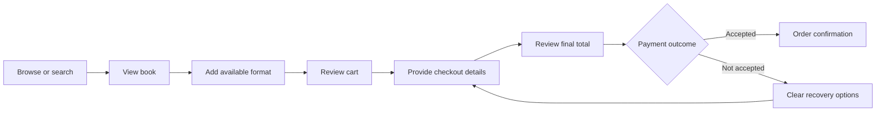

# Product Requirements Document: Online Bookstore

| Field | Value |
|---|---|
| Product / Initiative | Online Bookstore |
| Document Type | Product Requirements Document |
| Version | 0.1 |
| Status | Draft — ready with assumptions |
| Last Updated | 2026-08-03 |

## 1. Executive Summary

The Online Bookstore will let readers discover and purchase books across multiple types and genres through a clean, clear, and accessible shopping experience. The MVP covers catalog browsing, search and filtering, book details, a persistent cart, checkout, order confirmation, and basic catalog/order administration. It prioritizes understandable navigation, restrained visual presentation, transparent pricing, and low-friction purchase completion.

The intended users are shoppers and bookstore administrators. Exact commercial policies, inventory source, payment provider, fulfillment model, supported regions, and quantitative business targets require stakeholder confirmation.

## 2. Business Need and Problem

Readers need a simple way to find relevant books among different formats, genres, authors, and price points, understand what they are buying, and complete a purchase confidently. Bookstore operators need a manageable digital sales channel with accurate catalog, stock, pricing, and order visibility.

Many retail experiences create friction through crowded layouts, unclear navigation, weak product information, hidden costs, or unnecessarily long checkout flows. This initiative should provide a focused storefront in which the hierarchy, actions, status, and costs are immediately understandable.

## 3. Goals and Success Indicators

| ID | Goal | Success indicator |
|---|---|---|
| G-01 | Enable efficient discovery across a varied book catalog. | Users can browse, search, filter, and reach a relevant book detail page without ambiguity. |
| G-02 | Enable a trustworthy end-to-end purchase journey. | Users can review costs, provide required details, pay, and receive an order confirmation. |
| G-03 | Deliver a clean, clear, inclusive user experience. | Critical journeys meet agreed usability and accessibility acceptance criteria. |
| G-04 | Enable operators to keep commerce information accurate. | Authorized staff can manage catalog availability and inspect orders. |

Quantitative conversion, abandonment, performance, and revenue targets are TBD pending a baseline and stakeholder approval.

## 4. Non-Goals

| ID | Non-goal for MVP | Reason |
|---|---|---|
| NG-01 | Marketplace support for third-party sellers | Adds seller onboarding, settlement, moderation, and liability complexity. |
| NG-02 | E-book reading or digital-rights management | The requested need is selling books, not providing a reading platform. |
| NG-03 | Subscriptions, rentals, auctions, or buy-back | Separate commercial models requiring additional policy. |
| NG-04 | Social community, reviews, or user-generated content | Valuable later, but not essential to catalog-to-purchase value. |
| NG-05 | Personalized recommendations or loyalty program | Requires additional data, consent, and business rules. |
| NG-06 | Multi-language and multi-currency operation | Regions and localization policy are not yet defined. |

## 5. Stakeholders and Users

| Stakeholder | Responsibility / interest |
|---|---|
| Product / business owner | Owns outcomes, scope, commercial policy, and priorities. |
| Shoppers / readers | Discover, evaluate, and purchase books. |
| Catalog administrator | Maintains book metadata, price, categorization, and availability. |
| Order operations | Reviews orders and supports fulfillment/customer issues. |
| Finance / legal / privacy stakeholders | Confirm payment, tax, refund, privacy, and record-retention obligations. |
| Customer support | Resolves shopper and order issues. |

### Shopper persona

A visitor seeking books for personal use or as gifts. They need fast discovery, legible product information, transparent costs, clear availability, and confidence that checkout succeeded. No account is assumed to be required for MVP checkout; see A-02.

### Administrator persona

An authorized bookstore employee who needs accurate, auditable access to catalog and order information. Fine-grained operational roles are deferred until the operating model is confirmed.

## 6. Experience Principles

- **Clarity first:** each page has a clear purpose, consistent hierarchy, plain labels, and one visually dominant next action.
- **Low visual noise:** restrained color, typography, spacing, and decoration; no intrusive overlays or auto-playing media.
- **Progressive disclosure:** show essential book and price information first; reveal secondary detail when requested.
- **Visible system state:** loading, empty, success, error, stock, cart, and checkout states are explicit.
- **Consistency:** navigation, cards, controls, validation, price presentation, and feedback behave consistently.
- **Inclusive use:** keyboard operation, visible focus, semantic structure, readable contrast, meaningful alternatives, and responsive layouts are required.

## 7. Scope and MVP

### MVP capabilities

1. Browse a structured catalog containing multiple book types/genres.
2. Search by title, author, or ISBN and filter/sort results.
3. View complete book and purchase information.
4. Add, update, and remove cart items.
5. Enter checkout details, review the final order, pay, and receive confirmation.
6. Handle unavailable stock and failed/abandoned payment clearly.
7. Allow authorized staff to manage catalog entries and inspect order status.
8. Capture essential commerce and operational events without exposing sensitive data.

### Future considerations

Customer accounts and order history, wish lists, reviews, recommendations, promotions, gift cards, loyalty, localized storefronts, digital books, shipment tracking, returns self-service, bulk ordering, and richer analytics.

## 8. Epics, Features, and User Stories

### EPIC-001 — Discover books

Supports G-01 and G-03.

#### FEAT-001 — Browse catalog

**US-001:** As a shopper, I want to browse books by meaningful type or genre so that I can explore the catalog without knowing an exact title.

- **AC-001:** Given available categories, when the shopper selects one, then only matching books are shown and the active selection is clear.
- **AC-002:** Each result identifies at minimum cover image or fallback, title, author, format where relevant, price, and availability.
- **AC-003:** Empty categories show a clear empty state and a route back to the broader catalog.

#### FEAT-002 — Search, filter, and sort

**US-002:** As a shopper, I want to search and refine results so that I can quickly find suitable books.

- **AC-004:** Search accepts title, author, or ISBN and distinguishes no-result from error states.
- **AC-005:** Shoppers can apply applicable genre/type, format, price, and availability filters and can clear them.
- **AC-006:** Shoppers can sort by relevance and price; any additional sort rules require confirmation.
- **AC-007:** Search terms, active refinements, result count, and current sort remain visible and understandable.

#### FEAT-003 — Book detail

**US-003:** As a shopper, I want complete and legible book information so that I can make an informed purchase decision.

- **AC-008:** A detail page shows title, author, cover/fallback, description, ISBN, format, price, availability, and applicable edition/publisher information.
- **AC-009:** The purchase action clearly identifies whether the selected book can be added to cart.
- **AC-010:** If multiple purchasable formats exist, price and availability update for the selected format before addition.

### EPIC-002 — Purchase books

Supports G-02 and G-03.

#### FEAT-004 — Shopping cart

**US-004:** As a shopper, I want to review and edit my selected books before checkout.

- **AC-011:** A shopper can add an available item, change quantity within allowed stock, and remove an item.
- **AC-012:** The cart shows item-level prices, quantity, subtotal, and any known additional charges; unknown charges are disclosed before order submission.
- **AC-013:** Cart contents persist across normal navigation for a duration defined by business policy.
- **AC-014:** Price or availability changes are called out and require acknowledgement before checkout continues.

#### FEAT-005 — Checkout

**US-005:** As a shopper, I want a concise checkout flow so that I can submit a valid order with confidence.

- **AC-015:** Checkout collects only information required for contact, fulfillment, billing, and payment.
- **AC-016:** Required fields, validation errors, and corrective actions are identified in text and associated with the affected controls.
- **AC-017:** Before submission, the shopper sees items, quantities, delivery details, subtotal, discounts if applicable, tax, shipping, and final total.
- **AC-018:** The order is created only after the payment outcome satisfies the confirmed business rule; duplicate submission does not create duplicate orders or charges.
- **AC-019:** A failed or interrupted payment preserves recoverable checkout context and presents a clear retry or alternative action.

#### FEAT-006 — Confirmation

**US-006:** As a shopper, I want clear confirmation after purchase so that I know the order was received.

- **AC-020:** Successful checkout presents a unique order reference, purchased items, final total, fulfillment summary, and support guidance.
- **AC-021:** A confirmation is made available through the storefront and through the stakeholder-approved notification channel.
- **AC-022:** Refreshing or revisiting the completion step does not create another order.

### EPIC-003 — Operate the bookstore

Supports G-04.

#### FEAT-007 — Catalog administration

**US-007:** As an authorized administrator, I want to manage book records so that storefront information remains accurate.

- **AC-023:** An administrator can create and update required metadata, categorization, format, price, and availability.
- **AC-024:** Invalid or incomplete records cannot be made purchasable, and validation identifies the corrections required.
- **AC-025:** Removing a book from sale prevents new purchases without erasing historical order data.

#### FEAT-008 — Order visibility

**US-008:** As authorized order staff, I want to find and inspect orders so that operations and support can act on them.

- **AC-026:** Staff can find an order by its reference and view items, totals, customer/fulfillment details, payment outcome, and current status subject to authorization.
- **AC-027:** Order status values and permitted transitions follow confirmed fulfillment and cancellation policies.
- **AC-028:** Sensitive data is limited to what the staff role needs and is not exposed in ordinary logs or analytics.

## 9. Functional Requirements

| ID | Requirement | Priority | Trace |
|---|---|---|---|
| FR-001 | The storefront shall present a browsable catalog organized by shopper-meaningful book classifications. | Must | G-01, FEAT-001 |
| FR-002 | The storefront shall support search, filtering, sorting, clear empty states, and recoverable error states. | Must | G-01, FEAT-002 |
| FR-003 | The storefront shall display sufficient book, format, price, and availability information for a purchase decision. | Must | G-01, FEAT-003 |
| FR-004 | The storefront shall maintain an editable cart and revalidate price and availability before checkout. | Must | G-02, FEAT-004 |
| FR-005 | The storefront shall collect and validate the minimum information required to complete an order. | Must | G-02, FEAT-005 |
| FR-006 | The storefront shall show the full payable total before the shopper submits the order. | Must | G-02, FEAT-005 |
| FR-007 | The solution shall process a payment outcome without duplicate orders or charges from repeated submission. | Must | G-02, FEAT-005 |
| FR-008 | The solution shall provide a durable, uniquely referenced order confirmation. | Must | G-02, FEAT-006 |
| FR-009 | Authorized administrators shall manage catalog sale information and availability. | Must | G-04, FEAT-007 |
| FR-010 | Authorized operational staff shall locate and inspect orders. | Must | G-04, FEAT-008 |
| FR-011 | The solution should support approved order-status changes after fulfillment policy is defined. | Should | G-04, FEAT-008 |

## 10. Business and Data Rules

| ID | Rule | Status |
|---|---|---|
| BR-001 | An item may be purchased only when it is marked for sale and sufficient quantity is available. | Assumption requiring inventory-policy confirmation |
| BR-002 | The shopper must see the final payable total before order submission. | Confirmed product requirement |
| BR-003 | A single checkout submission must not produce duplicate orders or payment attempts. | Confirmed product requirement |
| BR-004 | Historical order line details must remain understandable even if the source catalog record later changes. | Assumption requiring records-policy confirmation |
| BR-005 | Tax, shipping, cancellation, refund, and status-transition rules are TBD and must be approved before release. | Open |

| ID | Data requirement | Related requirements |
|---|---|---|
| DR-001 | Maintain book identity and descriptive metadata, classification, purchasable format, imagery/fallback, price, and availability. | FR-001–FR-004, FR-009 |
| DR-002 | Maintain cart items and quantities without payment credentials. | FR-004 |
| DR-003 | Capture the minimum customer, delivery, billing, and consent information required by approved policy. | FR-005 |
| DR-004 | Retain an order reference, line-item snapshot, price components, payment outcome/reference, fulfillment details, and status history. | FR-006–FR-008, FR-010–FR-011 |
| DR-005 | Define retention, deletion, correction, and access rules for personal and transaction data before launch. | NFR-004, NFR-005 |

No database schema is prescribed by this PRD.

## 11. External Capability Requirements

| ID | Capability | Required behavior | Status |
|---|---|---|---|
| IR-001 | Payment processing | Submit payment securely and return an unambiguous outcome/reference; the storefront must not handle reusable payment credentials beyond approved provider controls. | Provider and supported methods TBD |
| IR-002 | Order confirmation notification | Deliver the approved confirmation content and expose delivery failure for operational follow-up. | Channel/provider TBD |
| IR-003 | Inventory and fulfillment | Provide or receive availability and order-fulfillment state as required by the operating model. | Whether internal or integrated is TBD |

## 12. Non-Functional Requirements

| ID | Requirement | Verification |
|---|---|---|
| NFR-001 | Critical shopper and administrator journeys shall work with keyboard-only input, visible focus, semantic labels/structure, non-color-only cues, meaningful image alternatives, and stakeholder-approved contrast/accessibility criteria. | Accessibility review and automated/manual checks |
| NFR-002 | The experience shall remain clear and usable across stakeholder-approved mobile and desktop viewport/browser support. | Responsive and compatibility testing against approved matrix |
| NFR-003 | Pages shall communicate loading, empty, success, validation, and failure states without losing recoverable user input. | Journey and failure-state testing |
| NFR-004 | Personal and transaction data shall be minimized, protected in transit and at rest, access-controlled, and excluded from routine logs/analytics. | Security/privacy review and tests |
| NFR-005 | Authentication and authorization shall protect administrative capabilities; privileged changes and critical order events shall be auditable. | Authorization and audit validation |
| NFR-006 | Quantitative response-time, availability, throughput, recovery, and data-loss targets shall be approved before production readiness. | Targets recorded and verified; currently TBD |
| NFR-007 | The product shall expose sufficient operational status, error, payment, and order-flow signals to detect failed critical journeys without recording sensitive content. | Observability review |
| NFR-008 | Destructive or financially significant actions shall require explicit intent and provide clear outcomes. | Usability and functional testing |

## 13. Key Workflows

## 14. Prioritization

MoSCoW is used for MVP boundaries. Discovery, product clarity, cart, final-cost review, safe payment, confirmation, accessibility, catalog management, and order visibility are **Must** because omitting any prevents a usable and operable sales journey. Order-status changes are **Should**, subject to confirmed operating rules. Accounts, wish lists, reviews, recommendations, promotions, localization, and self-service post-purchase functions are **Could/Future**. Marketplace, reading/DRM, subscriptions, rental, auction, and buy-back capabilities **Won't** be included in MVP.

## 15. Assumptions, Constraints, and Dependencies

| ID | Type | Statement / impact |
|---|---|---|
| A-01 | Assumption | MVP sells books at fixed displayed prices from one bookstore rather than third-party sellers. |
| A-02 | Assumption | Guest checkout is supported; mandatory account creation would materially change scope and must be explicitly approved. |
| A-03 | Assumption | At least physical books are sold; supported formats and format-specific fulfillment require confirmation. |
| C-01 | Constraint | The UI must be very clean and clear; feature additions must preserve hierarchy and avoid avoidable visual or interaction complexity. |
| C-02 | Constraint | No provider, technology, jurisdiction, budget, deadline, SLA, or numeric success target has been selected in this PRD. |
| D-01 | Dependency | Business approval of catalog taxonomy, price, stock, tax, shipping, cancellation, refund, and fulfillment policies. |
| D-02 | Dependency | Selection and commercial approval of payment and notification capabilities. |
| D-03 | Dependency | Privacy, security, accessibility, and record-retention review for intended launch regions. |

## 16. Risks

| ID | Risk | Impact | Likelihood | Mitigation / action |
|---|---|---|---|---|
| RISK-001 | Undefined tax, shipping, refund, and fulfillment rules delay checkout completion. | High | High | Assign business owners and approve policies before architecture is finalized. |
| RISK-002 | A broad or inconsistent taxonomy makes “different types” difficult to navigate. | High | Medium | Validate taxonomy and labels with representative shoppers; support clear refinements. |
| RISK-003 | Stock or price changes during checkout reduce trust or cause invalid orders. | High | Medium | Revalidate before submission and require visible acknowledgement of changes. |
| RISK-004 | Visual minimalism removes useful context or accessibility cues. | High | Medium | Validate clarity with users and accessibility checks; retain explicit labels and states. |
| RISK-005 | Payment uncertainty creates duplicate charges/orders. | High | Medium | Require safe repeat submission behavior, durable outcome references, and recovery testing. |
| RISK-006 | Unconfirmed regional privacy or commerce obligations cause rework. | High | Medium | Confirm intended markets and conduct appropriate legal/privacy review before release. |

## 17. Open Questions

| ID | Question | Impact | Status |
|---|---|---|---|
| Q-001 | Which countries/regions, languages, currencies, taxes, and legal policies apply? | Determines checkout, content, privacy, and compliance requirements. | Open |
| Q-002 | Which physical/digital formats and fulfillment methods are in MVP? | Determines product variations and delivery workflow. | Open |
| Q-003 | What is the catalog/inventory source and stock-reservation policy? | Determines availability accuracy and operational interaction. | Open |
| Q-004 | Which payment methods/provider and payment-success rule are approved? | Required to complete and validate checkout. | Open |
| Q-005 | What shipping, cancellation, return, and refund rules apply? | Determines totals and post-purchase behavior. | Open |
| Q-006 | Is guest checkout approved, and are customer accounts required now or later? | Changes identity, privacy, and journey scope. | Open |
| Q-007 | What browser/device support, accessibility standard, and measurable service targets are required? | Determines NFR acceptance thresholds. | Open |
| Q-008 | What baseline and targets will be used for discovery success, conversion, abandonment, support burden, and revenue? | Determines outcome measurement. | Open |

## 18. Decisions

| ID | Decision | Reason | Source / context |
|---|---|---|---|
| DEC-001 | Treat clean and clear UI as a cross-cutting acceptance constraint, not a visual style preference alone. | It must govern navigation, content hierarchy, feedback, and accessibility. | User request |
| DEC-002 | Define an MVP around discovery-to-confirmation plus minimum operations. | This is the smallest coherent and operable commerce journey. | Planning assumption |
| DEC-003 | Defer provider and architecture choices. | They require architecture analysis and business constraints not supplied. | Planning boundary |

## 19. Traceability Summary

| Goal | Epic | Features | User stories | Requirements | Acceptance criteria |
|---|---|---|---|---|---|
| G-01 | EPIC-001 | FEAT-001–003 | US-001–003 | FR-001–003 | AC-001–010 |
| G-02 | EPIC-002 | FEAT-004–006 | US-004–006 | FR-004–008 | AC-011–022 |
| G-03 | EPIC-001, EPIC-002 | FEAT-001–006 | US-001–006 | FR-001–008, NFR-001–003, NFR-008 | AC-001–022 |
| G-04 | EPIC-003 | FEAT-007–008 | US-007–008 | FR-009–011 | AC-023–028 |

## 20. Release and Success Measurement

MVP release requires all Must requirements to pass acceptance testing, critical accessibility/security/privacy findings to be resolved, commercial policies and providers to be approved, and production NFR targets to be agreed and verified. Rollout model and user onboarding are TBD.

| ID | Metric | Target | Measurement |
|---|---|---|---|
| SM-001 | Catalog search/browse success | TBD after baseline | Successful progression from discovery to relevant book detail; usability study |
| SM-002 | Checkout completion and abandonment | TBD after baseline | Commerce journey analytics excluding sensitive content |
| SM-003 | Order/payment failure and duplicate rate | TBD | Operational/payment reconciliation |
| SM-004 | Accessibility and usability acceptance | Approved threshold TBD | Automated/manual audit and representative-user task evaluation |
| SM-005 | Catalog/order support burden | TBD after baseline | Support contacts categorized by journey stage |

## 21. Architecture Handoff and Readiness

The architecture phase can begin using the bounded capabilities, traceability, business data, external capability needs, and quality concerns in this PRD. It must preserve provider independence until Q-001–Q-007 are resolved and must not convert planning assumptions into policy.

### Final planning summary

- Goals: 4
- Epics: 3
- Features: 8
- User stories: 8
- Functional requirements: 11
- Non-functional requirements: 8
- Open questions: 8
- Planning status: **READY WITH ASSUMPTIONS**

The principal blockers to production-ready architecture are the commercial operating rules, target markets, supported formats/fulfillment, identity policy, providers, and measurable NFR thresholds. The appropriate next role is `architecture_agent_v2` after responsible stakeholders answer or explicitly accept the listed questions and assumptions.
